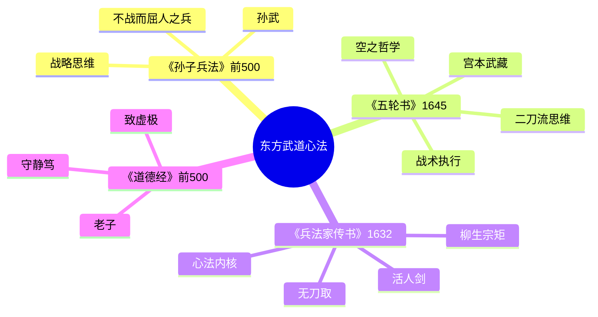
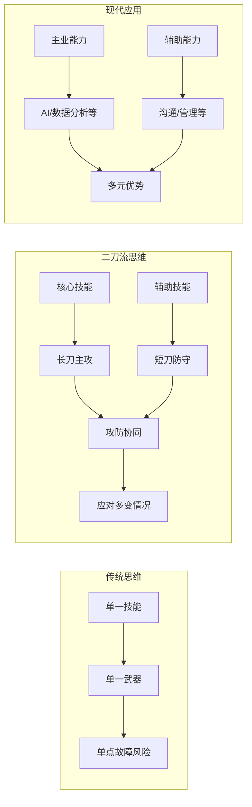
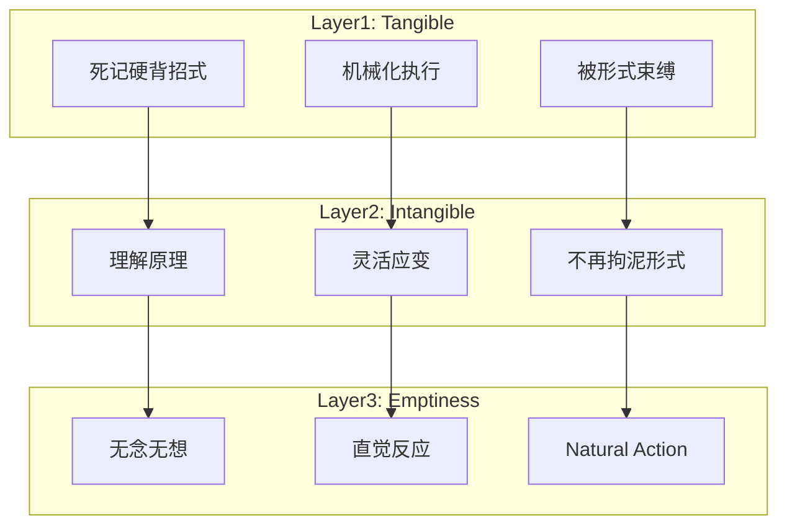
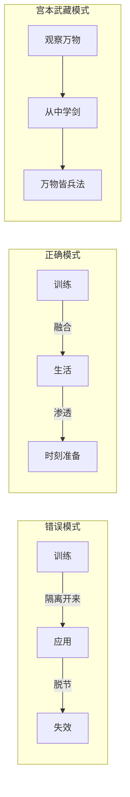
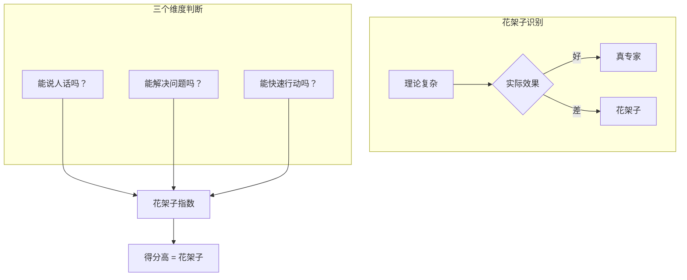
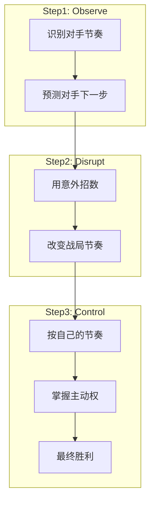
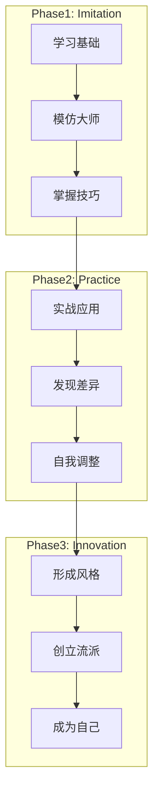

# 《五轮书》拆解记录

## 这本书要解决什么问题？

**核心困境**：大多数人以为"努力"就是答案，却忽略了三个关键问题——用什么方法努力？用什么心态努力？努力的目的是什么？

宫本武藏用60场决斗验证了一件事：
> 真正的高手不是招式多，而是"空"——心无杂念，随机应变。

**一句话定位**：
> 用二刀流思维对抗单一技能风险，用空之哲学超越形式束缚，400年前就看透了竞争的本质。

### 作者站在什么位置说这些话？

| 维度 | 定位 |
|------|------|
| 主领域 | 东方武道哲学 / 兵法策略 |
| 跨界领域 | 心理学（直觉决策）、管理学（战略思维）、禅宗哲学 |
| 作者背景 | 日本剑圣、二天一流创始人、一生决斗60余次从未败北，画家、雕塑家、书法家 |
| 历史语境 | 1645年临终前完成，与《孙子兵法》《战争论》并称世界三大兵书，被翻译成30多种语言。武藏站在战国末世浪人剑客的位置，输出的是个人生死搏杀的经验，而非庙堂之上的理论 |

### 和其他书有什么关系？

| 关联书籍 | 关联关系 | 共同底层逻辑 |
|----------|----------|--------------|
| [[孙子兵法-拆解记录]] | 同系列-战略层 | 孙子讲战略，武藏讲战术，东方兵法两大经典 |
| [[兵法家传书-柳生宗矩-拆解记录]] | 同系列-心法层 | 武藏讲战斗，柳生讲不战，日本武道双子星 |
| [[穷查理宝典-拆解记录]] | 思维模型类比 | 二刀流 = 多元思维模型，拒绝单一工具 |
| [[道德经-老子-拆解记录]] | 哲学源头 | "空"之哲学来自禅宗+老子"致虚极" |
| [[原则-拆解记录]] | 系统化方法 | 武藏的五卷结构 = 系统化思维框架 |
| [[庄子-庄子-拆解记录]] | 心法相通 | "无构之构" = 庄子"逍遥游"的境界 |

### 知识网络图

---

## 作者的核心论点

### 二刀流思维：对抗单一技能风险

宫本武藏最著名的武器是比普通武士刀更长的"大木刀"。他在岩流岛决斗中，用长木刀击败手持三尺长刀的佐佐木小次郎。但武藏的核心理论是二刀流：一手持太刀（长刀），一手持肋差（短刀）。

| 长刀（太刀） | 短刀（肋差） | 协同效应 |
|--------------|--------------|----------|
| 主攻力量 | 辅助防守 | 攻防一体 |
| 远程打击 | 近身搏斗 | 覆盖全距离 |
| 强力劈斩 | 灵活刺击 | 多样化攻击 |
| 主方向压制 | 反向防守 | 双向控制 |

单一武器的致命弱点在于可预测。敌人攻击时，只有一把刀的武士只能用一种方式应对；而二刀流同时拥有主攻和防守两条路径，让对手无法预判。这个道理放到今天同样成立：只会编程的程序员在AI时代失业，只会设计的UI设计师被生成工具替代，只会做销售的职场人在直播带货时代被淘汰。

宫本武藏的二刀流和芒格的多元思维模型，本质上是同一件事——拒绝"锤子综合症"。芒格攒了80-90个跨学科模型，武藏只用两把刀，但思路一致：你拥有的武器越多，你能应对的情况就越多。

> **二刀流定律**：在复杂多变的竞争中，单一技能的优势会被快速复制，而多元能力的组合效应是竞争对手难以模仿的护城河。

下次遇到"要不要学个新技能"的犹豫，我不会再问"值不值得花时间"，而是问"我现在是不是只有一把刀"。

有了多元武器，下一个问题就是：怎么用？

### "空"的哲学：超越形式的直觉境界

武藏说："空者，无始无终，无内无外。因为空，所以不被外物束缚，可以既入乎其内，又出乎其外。具体地说，就是掌握了方法，却不拘泥于方法。"

这句话听起来很玄，但放到日常场景里就很清楚了：学了无数游泳技巧的人，真正溺水时还是慌；背了无数面试技巧的人，真正面试时大脑空白；研究了无数恋爱方法的人，真正遇见喜欢的人不知所措。问题不是方法不够多，而是方法太多，反而成了负担。

武藏说的"空"，其实是一个三层递进的过程。第一层是"有形"——依赖外部规则和框架，照猫画虎。第二层是"无形"——理解了规则，开始灵活运用，不再死板。第三层是"空"——规则已经内化为本能，根本不需要思考，直接反应。庄子的"无待"和武藏的"空"指向同一个境界：超越外在束缚，达到真正的自由。

> **空之定律**：真正的专家，不是掌握最多方法的人，而是将方法内化为本能，能在无意识中做出正确决策的人。

这个观点打碎了我的一个假设。我一直以为高手是"想得更多"的人，是头脑中储备更多策略的人。但武藏说的是反过来的——高手是"想得更少"的人。不是因为他们无知，而是因为他们已经把方法练到了化境，不需要思考，直接反应。当你还在分析局面的时候，高手已经出招了。

武器的数量和使用的境界都有了，但这些都建立在同一个前提上：你随时准备着。

### 平时如战时：生活从不给你准备时间

武藏说了一句很重的话："我从来没有'在练剑'这回事，因为我的每一刻都是练剑。"

这意味着他不区分"训练时间"和"战斗时间"。走路、吃饭、观察木匠干活——万物皆兵法。他从木匠用锯子的节奏中悟出剑法的节奏，从观察自然界的万物中提炼战术原则。

| 层次 | 内容 | 例子 |
|------|------|------|
| 技能层 | 日常练习 = 实战应用 | 走路、吃饭都在练剑 |
| 心理层 | 日常心态 = 战场心态 | 随时保持警惕和专注 |
| 哲学层 | 万物皆兵法 | 从木匠之道悟出兵法之道 |

这个道理和达利欧的《原则》异曲同工。达利奥从每一次失败中提炼原则，武藏从万物中提炼兵法。两个人都在做同一件事：把日常生活变成训练场。区别在于，达利欧用系统化的方式记录，武藏用直觉的方式内化。

以前我觉得"准备"是一个阶段——先准备，再上场。现在意识到这个思维本身就是陷阱。真正的准备不是一个阶段，而是一种状态。如果你需要"准备好"才能上场，那你永远上不了场。

> **日常即战场定律**：如果你不能在日常生活中保持专业水准，你就无法在关键时刻超越自己。真正的强者，是随时都在准备的人。

但这还只是第一步，武藏对"准备"的质量有更苛刻的要求。

### 警惕"花架子"：理论复杂的人，通常不太会干

武藏对同时代的剑术流派有三个批评：过于注重架势的流派——外表好看但实战无效；依赖大太刀的流派——靠蛮力而非技巧；使用小太刀的流派——过于局限，缺乏适应性。

武藏的兵法三原则很简单：不做没有意义的事（效率优先）；方法比气力更重要（技巧优先）；简单有效（实战优先）。

用大白话说就是：PPT做得很漂亮的人，实际工作能力往往一般；理论说得天花乱坠的人，实战经常翻车；课程买了很多的人，问题依然没有解决。能说人话的人，才是真专家。

这打碎了我对"专业"的迷信。以前以为专家就是理论复杂、术语高深的人。现在意识到，恰恰相反——真正的高手能用最简单的语言说清楚最复杂的道理。理论越复杂，越可能是花架子；方法越简单，越可能是真功夫。

> **简单有效定律**：在复杂系统中，真正有效的解决方案往往是最简单的。如果你觉得某个方法太复杂，大概率它不是最好的方法。

有了武器、境界、心态和质量标准，最后一个问题是：如何掌握主动权？

### 节奏感：节奏 = 主动权

武藏说："一切事物皆有其固定的节拍，兵法也如此。兵法的特殊节拍需要刻苦的磨炼方能熟练掌握。兵法的节奏用于兵法时，就是掌握敌人的节奏，用敌人意想不到的招数，打乱敌人的节奏，同时以自己的节奏发动进攻。"

节奏控制分三步：第一步，识别对手的节奏，预测他下一步会做什么；第二步，用意外的招数打乱他的节奏；第三步，按自己的节奏掌控局面。

武藏的节奏控制有三术："先发制人"（圧胜）——主动出击，掌控节奏；"后发先至"（後の先）——等待对方攻击，快速反击；"二次跃出"——假装攻击，再真正出击。和霍华德·马克斯的周期思维一样，核心都是识别节奏、掌握节奏。

以前我总觉得"节奏"是个抽象的词，没什么实际意义。现在意识到节奏就是主动权——谁掌控节奏，谁就掌控局面。当你被别人的节奏带着走，你已经输了。下次面对竞争，我不会再问"对手比我强吗"，而是问"节奏是谁在掌控"。

> **节奏定律**：在任何竞争中，掌握了节奏的人就掌握了主动权。被别人的节奏带着走的人，永远是被动的。

节奏只是战术层面，武藏最后还要回答一个问题：你的终极目标是什么？

### 成为你自己：模仿是起点，不是终点

武藏说："你不需要成为我，你需要成为更好的你自己。"

他的成长路径清晰地分为三阶段。第一阶段是模仿——学习基础，模仿大师，掌握技巧。第二阶段是实践——实战应用，发现差异，自我调整。第三阶段是创新——形成风格，创立流派，成为自己。

从模仿到创新有三个关键：学其神，不学其形——学核心逻辑而非表面招式；在实践中验证——实战是检验真理的唯一标准；在差异中创新——你的独特性才是你的竞争力。

这打碎了我对"学习"的理解。以前觉得学习就是要学得和老师一模一样，越接近原版越好。但武藏说的是反过来的——模仿只是起点，终点是成为你自己。你学的是方法，不是人。学别人的方法是为了找到自己的路。

> **自我定律**：你可以学习别人的方法，但你必须走自己的路。因为每个人的资源、环境、天赋都不同，最有效的策略一定是最适合你的策略。

---

## 这本书的局限

> 《五轮书》是一部从60场生死决斗中提炼的武道心法，但有它的边界。

| 批评点 | 谁在批评 | 怎么说 | 实际情况 |
|--------|---------|--------|---------|
| 文本真实性争议 | 学术界 | 版本差异大，原文可能有后人篡改 | 核心思想一致，但具体措辞需谨慎引用 |
| 时代局限性 | 现代读者 | 17世纪武士的经验能否适用于21世纪 | 核心竞争原则普适，但具体战术需转化 |
| 个人英雄主义 | 管理学界 | 强调个人修养和单打独斗，缺乏团队维度 | 武藏是浪人，不是将领，视角天然偏向个人 |
| 过度神秘化 | 理性主义者 | "空"等概念难以操作化验证 | 东方哲学重体验轻论证，需结合现代认知科学理解 |

**一句话总结局限性**：
> 武藏的个人决斗经验提炼出的竞争心法极具穿透力，但缺乏团队协作和系统化验证的维度，需要和现代管理理论互补。

---

## 最值得记住的话

**原书说的**：
1. "敌人可以用任何方式攻击你，你为什么只能用一种方式反击？"
2. "你的心应该像水一样——不预设、不抵抗、不执念。"
3. "我从来没有'在练剑'这回事，因为我的每一刻都是练剑。"
4. "你不需要成为我，你需要成为更好的你自己。"
5. "空者，无始无终，无内无外。因为空，所以不被外物束缚。"
6. "不做没有意义的事。"
7. "方法比气力更重要。"
8. "掌握敌人的节奏，用敌人意想不到的招数，打乱敌人的节奏。"

**翻译成人话**：
1. 单一技能 = 单点故障
2. 高手不是想得多，而是想得少
3. 生活从不给你准备时间
4. 理论复杂的人，通常不太会干
5. 节奏 = 主动权
6. 模仿是起点，不是终点
7. 当方法成为本能，你就不需要思考，直接反应
8. 你不需要成为每个领域的专家，只需要1个核心技能+1个互补技能
9. 能说人话的人，才是真专家
10. 跟着别人的节奏跑，你就已经输了

---

## 讲给没读过的人听

你有没有发现，那些总在"准备"的人，永远上不了场？

宫本武藏也是这么想的。他说："我从来没有'在练剑'这回事，因为我的每一刻都是练剑。"他观察木匠用锯子的节奏，从中悟出了剑法的节奏。他走路、吃饭、看风景，万物皆兵法。

他一生决斗60余次，从未败北。不是因为他招式多，恰恰相反——他追求的是"空"。掌握了方法，却不拘泥于方法。当方法成为本能，你就不需要思考，直接反应。

他还强调二刀流——一手持长刀主攻，一手持短刀防守。因为敌人可以用任何方式攻击你，你为什么只能用一种方式反击？单一技能就是单点故障。

最后他说：你不需要成为我，你需要成为更好的你自己。模仿是起点，不是终点。

---

## 用来检验理解的问题

**基础回忆**：
1. Q: 武藏的"二刀流"核心思想是什么？
   A: 一手持长刀主攻，一手持短刀防守，攻防一体。核心是多元能力组合，对抗单一技能风险。

2. Q: "空"的三个层次是什么？
   A: 有形（依赖规则）→ 无形（灵活运用）→ 空（内化为本能）。

3. Q: 武藏对"花架子"的批评针对什么？
   A: 注重外在形式但实战无效的流派。他认为真正有效的方法往往是最简单的。

**理解验证**：
1. Q: 为什么武藏说"我从来没有'在练剑'这回事"？
   A: 因为他不区分训练时间和战斗时间，万物皆兵法，每一刻都是练习。

2. Q: 节奏控制的三步是什么？
   A: 识别对手节奏→用意外招数打乱→按自己的节奏掌控局面。

3. Q: 二刀流和芒格的多元思维模型有什么共同点？
   A: 都拒绝单一工具，强调多元能力的组合效应。

**实际应用**：
1. Q: 你的"第一把刀"和"第二把刀"分别是什么？
   A: 核心是识别自己的主技能和互补技能，确保攻防一体。

2. Q: 你最近在哪个方面"想太多"了？用"空"的哲学怎么处理？
   A: 关键是把方法练到化境，不再需要思考，直接反应。

**深度分析**：
1. Q: 武藏和柳生宗矩的核心区别是什么？
   A: 武藏教你怎么打，柳生教你怎么不打。一个是技击之剑，一个是治国之剑。

2. Q: 《五轮书》和《孙子兵法》分别适合什么场景？
   A: 孙子适合战场、商战、大规模竞争（战略层）；武藏适合个人技能、职场竞争、实战技巧（战术层）。

---

## 和其他书的对话

孙子和武藏隔着两千多年，但拼在一起恰好构成完整的竞争体系。孙子站在统帅的高度讲"知彼知己，不战而屈人之兵"，是宏观战略框架；武藏站在剑客的地面讲"二刀流、节奏控制、空之哲学"，是微观战术执行。读了孙子，你知道该不该打；读了武藏，你知道怎么打。

武藏和柳生宗矩是日本武道的双子星，但方向相反。武藏是浪人剑客，一生在野，创立二天一流，教你怎么在战斗中取胜；柳生是幕府将军的兵法指导，身在朝堂，创立新阴流"活人剑"，教你怎么让对方失去战斗意志而不必动刀。一个讲"打"，一个讲"不打"，合在一起才是完整的竞争哲学——知道什么时候该打，什么时候不该打。

芒格如果读到《五轮书》，大概会心一笑。武藏的二刀流就是芒格的多元思维模型的前身——都是拒绝"锤子综合症"，都是用多元工具替代单一工具。区别在于，芒格攒了80-90个跨学科模型，武藏只用两把刀。但精髓一样：你拥有的武器越多，你能应对的情况就越多。

武藏的"空"和老子、庄子一脉相承。老子说"致虚极，守静笃"，庄子追求"逍遥游"的"无待"境界，武藏说"掌握了方法却不拘泥于方法"。三个东方哲人从不同角度指向同一个东西——超越形式束缚，达到直觉反应的自由。

达利欧和武藏都在从日常生活中提炼普遍规律。达利欧从每一次失败中提炼原则，武藏从万物中提炼兵法。一个是华尔街的系统化方法，一个是战国日本的直觉化心法，但底层逻辑惊人一致：生活即训练场。

---

*拆解日期：2026-02-15*
*下次回访：1周后回顾「讲给没读过的人听」和「检验问题」*
