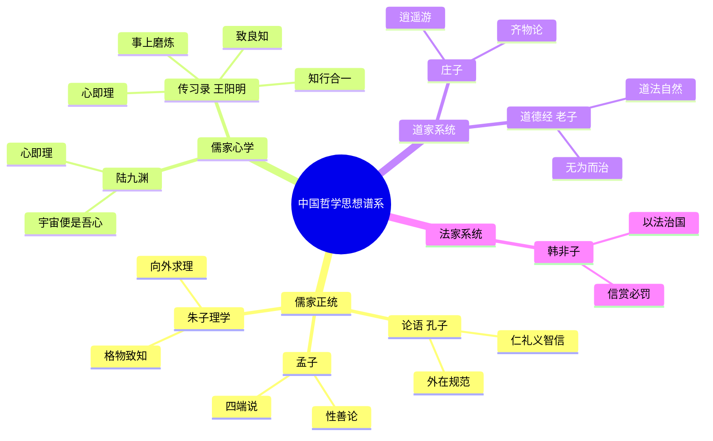
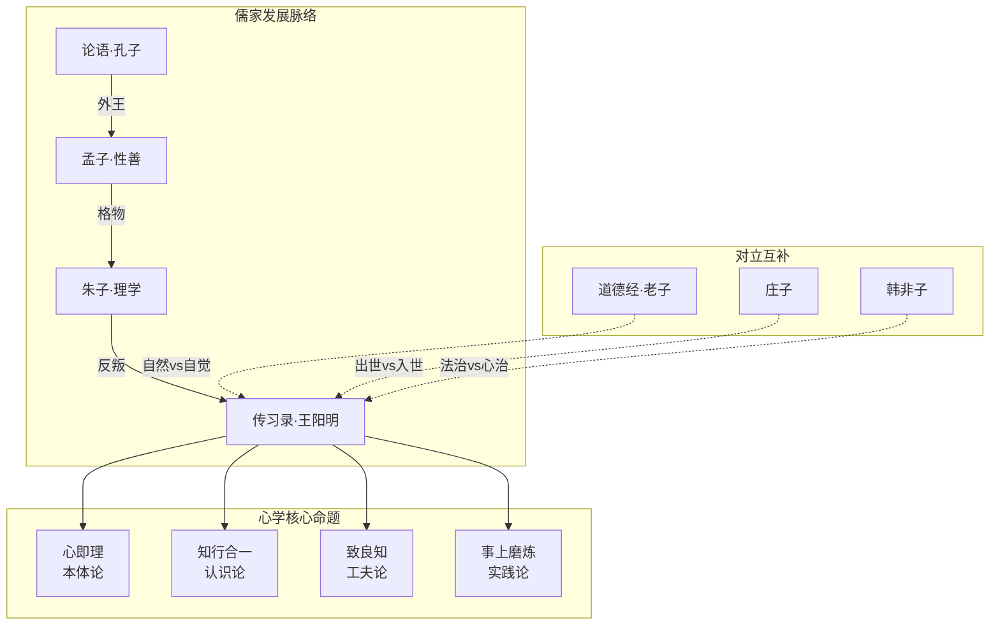
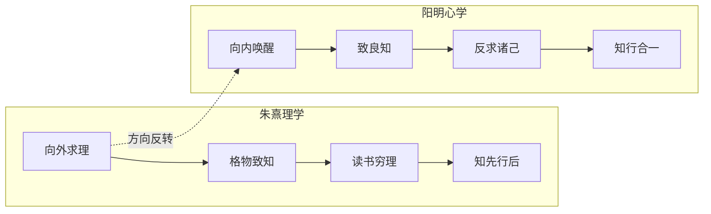
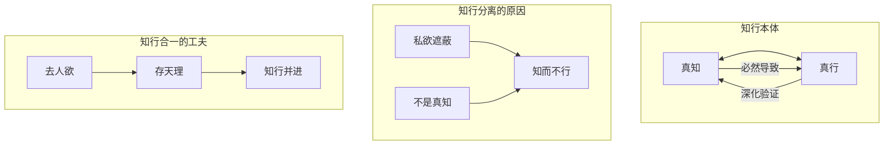
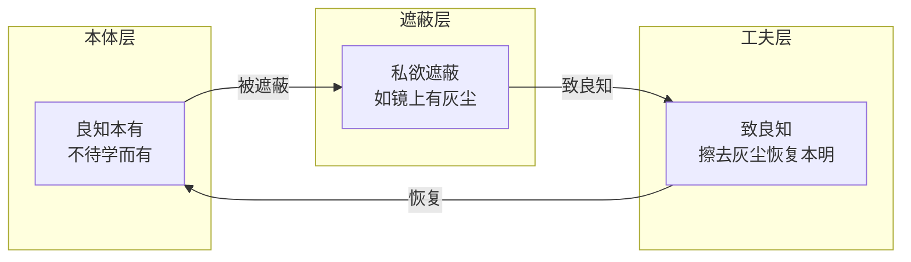
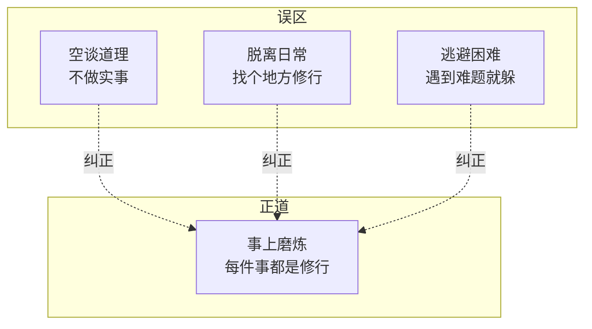
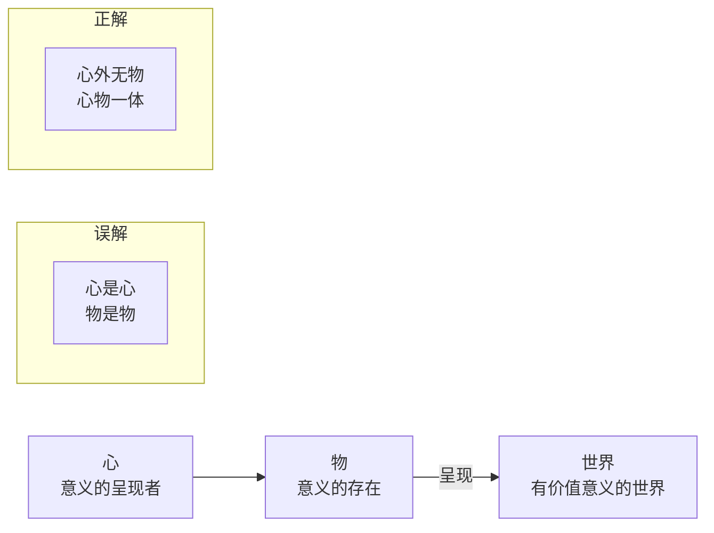

# 《传习录》拆解记录

## 这本书要解决什么问题？

**核心困境**：为什么"知道很多道理，却依然过不好这一生"？朱熹理学"向外求理"导致知行分离，学得越多越迷茫。王阳明给出答案：真理不在外面，在你心里；不是学更多，是唤醒本有。

**一句话定位**：
> 圣人之道，吾性自足——答案在你心，不假外求。

### 作者站在什么位置说这些话？

| 维度 | 定位 |
|------|------|
| 主领域 | 儒家心学（心性哲学高峰） |
| 跨界领域 | 认识论、道德哲学、实践哲学 |
| 作者背景 | 明代思想家、军事家、教育家，陆王心学集大成者，"真三不朽"（立德、立功、立言） |
| 历史地位 | 中国心学巅峰，影响中国、日本、朝鲜半岛五百年 |

### 和其他书有什么关系？

| 关联书籍 | 关联关系 | 共同底层逻辑 |
|----------|----------|--------------|
| [[论语-孔子-拆解记录]] | 继承发展 | 外在礼教→内在心学：从"克己复礼"到"致良知" |
| [[道德经-老子-拆解记录]] | 对立互补 | 自然天赋（道法自然）vs 道德自觉（致良知） |
| [[庄子-庄子-拆解记录]] | 对立 | 入世担当（事上磨炼）vs 出世逍遥（齐物逍遥） |
| [[韩非子-韩非-拆解记录]] | 对立 | 心治（致良知）vs 法治（信赏必罚） |
| [[思考快与慢-拆解记录]] | 互补 | 认知偏误机制 vs 良知遮蔽机制 |

### 知识网络图

---

## 作者的核心论点

### 心即理 —— 答案在你心里，不在外面

1508年，王阳明被贬贵州龙场。那是个瘴气弥漫的蛮荒之地，他住在漏雨的草棚里，身边没有书，没有朋友，连食物都不够。按朱熹理学的方法，他应该继续"格物致知"——观察万事万物的道理。但他在那个中夜的顿悟，彻底否定了自己二十年"向外格物"的方向。

他悟到的是："圣人之道，吾性自足，不假外求。"

弟子徐爱后来问他：朱子说"事事物物皆有定理"，先生怎么说"心即理"？王阳明的回答很直接——在事事物物上求至善，是"义外"，是向外面求道理。天下没有心外之事，没有心外之理。

这个认知方向的转变可以用一张图说清楚：

传统理解把心和理分开——心是心，理是理，要向外格物穷理，读书越多越明理。阳明心学直接把这翻转了：心即理，心不被私欲遮蔽，就是天理。不是学更多，是擦亮本心。

> **心即理定律**：真理不在外物上，而在你心里。心不被私欲遮蔽，就是天理。不是学更多，是擦亮本心。

用大白话说就是：你不需要向外寻找答案，你只需要向内唤醒良知。心不被欲望遮蔽，答案自然显现。

为什么学得越多越迷茫？因为方向错了——向外求理，求之不得。专家说的都有道理，听谁的？问问你的良知。知识焦虑怎么解？不是学更多，是唤醒本有。

这个观点打碎了我对"学习"的迷信。我一直以为迷茫是因为学得不够多、了解得不够广，但王阳明说问题出在方向上——你以为答案在外面，越找越远，越远越慌。下次遇到信息过载、不知道听谁的的时候，我不会再疯狂搜集更多观点，而是停下来问自己：我的良知怎么说？

既然答案在心，那知和行是什么关系？王阳明的回答更出人意料——它们根本就是一件事。

### 知行合一 —— 知和行是一件事

"知是行的主意，行是知的功夫；知是行之始，行是知之成。"这句名言背后，藏着一个被忽视了很久的误区。

古人一直说知先行后——先学明白，再去做。王阳明说这恰恰是问题所在。程朱将知行割裂，造成"离行求知"，所得不是真知。他的核心判断只有一句："未有知而不行者，知而不行只是未知。"

知和行的本体关系：

知行有三个理解层次。最常见的是错误层：知先行后，知行分离，先学完再做。正确层是：知行合一，一件事两面，知和行同时发生。更深入的是：一念发动便是行——念头一动，行动就开始了。

> **知行合一定律**：真知必然导致行，不行是因为不是真知。知和行是一件事的两个方面，不是两件事。

知道但不做，不是真知道。真知道的人，自然会去行动。一念动了，行动就开始了。

健身计划总失败？不是意志力差，不是方法不对——王阳明会说，你根本不是真想练。买了课不学？囤积信息不是真知，只是在焦虑。拖延症的根源不在行动力，在认知层——你以为你知道了，其实你不知道。

下次遇到"知道但做不到"的情况，我不会再去找时间管理工具或意志力技巧，而是诚实地问自己：我真的知道吗？如果我真的知道这件事的重要性，为什么不做？那个"不真知"的环节在哪里？

知和行是一件事，那怎么判断自己是否"真知"？王阳明的答案是：良知。

### 致良知 —— 唤醒内在道德直觉

"个个人心有仲尼。"王阳明说每个人心里都有个孔子。

这不是夸张。他对良知的定义来自孟子——"良知者，孟子所谓'是非之心'，人皆有之，不待学而有，不待虑而知者也。"用大白话说：你本来就知道什么是对错，只是欲望遮蔽了你的判断。致良知就是擦亮这面镜子。

良知的三个层次：

很多人把"致知"理解为学更多知识，越学越明白，向外求。阳明心学的正解恰恰相反：致知是唤醒本有良知，擦亮本心就明白，向内唤醒。

王阳明晚年总结出四句教，浓缩了整个心学工夫论：无善无恶心之体，有善有恶意之动，知善知恶是良知，为善去恶是格物。

> **致良知定律**：良知是人先天具有的道德直觉，能自然分辨善恶。致良知就是擦去私欲灰尘，恢复本心的光明。

"千圣皆过影，良知乃吾师。"一千个圣人都是过眼云烟，你的良知才是你永远的老师。遇到道德困境，你的良知早就告诉你答案了，不用问别人。后悔当初的选择？当初良知提醒过你，只是你没听。

这打碎了我对"道德判断"的依赖。以前遇到伦理困境，我总想找个权威来告诉我"正确答案"，查书籍、问专家、看别人的做法。但王阳明说，你的良知早就知道答案了——你只是不敢相信自己的判断，或者不愿意面对那个答案。下次遇到两难选择，我不会再急着向外寻找"标准答案"，而是先静下来听听自己内心的声音。

致良知给出了内在的道德罗盘。但王阳明没有让人闭门修行——他要求你在真实的事情中磨炼这面镜子。

### 事上磨炼 —— 修行不是打坐

"人须在事上磨，方立得住，方能静亦定，动亦定。"

王阳明自己就是这样做的。他不是坐在书斋里的学者，他平定宁王叛乱，在军务中磨炼心性；他治理地方，在政务中致良知；他讲学授徒，在教育中体证心学。每一件事都是修行的道场。

修行的三个误区：

事上磨炼的应用无处不在：职场里讨厌的同事、难搞的领导，在关系中磨心；家庭里吵架、误解、代沟，在亲情中磨心；项目中的压力、挫折、失败，在做事中磨心；愤怒、焦虑、恐惧，在情绪中磨心。

> **事上磨炼定律**：真正的修行不是离开世间去打坐，而是在具体事情中磨炼心性。静亦定，动亦定，才是真定。

别逃离生活去"修行"，你遇到的每件事都是修行的机会。讨厌的同事、难搞的领导，都是你的道场。真定不是找个安静的地方坐下来，而是动静都能定——工作再忙心不乱，环境再差心不慌。

以前我总想找个清净的地方来修炼心性，觉得工作和生活太吵太乱，妨碍我修行。现在我明白了：不是环境妨碍我，是我把修行和生活分开了。下次遇到烦心事，我不会再想着"等有空了再修行"，而是直接把它当成道场——就在这件事里磨。

从心即理到知行合一，到致良知，再到事上磨炼，王阳明构建了一个完整的心学体系。但还有一个最根本的命题需要面对——心和世界到底是什么关系？

### 心外无物 —— 世界由心呈现

友人问了一个刁钻的问题：花树在深山自开自落，与我心何干？

王阳明的回答成了中国哲学史上最著名的公案之一："你未看此花时，此花与汝心同归于寂；你来看此花，则此花颜色一时明白起来。便知此花不在你心外。"

这不是说你不看花、花就不存在。阳明说的是：花的意义和价值，由你的心来呈现。

三个理解层次。常识层：客观世界独立存在，花在那里我看不看都在。阳明层：心外无物，花的意义由心呈现。融合层：心物一体，你看见，世界才亮起来。

> **心外无物定律**：客观世界因你的存在而有价值和意义。心是世界的光源，心暗了，世界就黑了。

你看见，世界才亮。心是世界的光源。心变了，世界就变了。

工作没意义？意义由你的心决定。生活很空虚？也许是你忘了心是光源。世界很冷漠？心外无物，先问问你的心——要世界亮起来，先让自己亮起来。

这引出了我对"意义"的重新理解。我一直以为意义是客观存在的——工作本身有意义或没意义，生活本身有意义或没意义。但阳明告诉我，意义是你心赋予的。同一份工作，有人做得热气腾腾，有人做得死气沉沉——区别不在工作，在心。下次觉得某件事"没意义"，我不会再抱怨事情本身，而是问自己：我的心是不是暗了？

---

## 这本书的局限

> 阳明心学是从明代儒学内部反叛中产生的哲学体系，它有自己的边界和争议。

| 批评点 | 谁在批评 | 怎么说 | 实际情况 |
|--------|---------|--------|---------|
| "知行合一"销行归知 | 王夫之（明清之际大儒） | 知行合一把行消解到知里去了 | 阳明说的是知行并进合一，非以知代行，但确实容易被误解为"想明白就够了" |
| "阳儒阴释"涉佛教空观 | 理学正统派 | 心学骨子里是佛教那一套 | 阳明强调"一循于理"，与佛教本质不同，但确实受到禅宗影响 |
| "无善无恶"模仿禅宗 | 东林学派等 | 四句教的第一句像禅宗 | 四句教是工夫论非本体论，但表述确实容易引发歧义 |
| "六经注我"曲解经典 | 考据学派 | 阳明借经典阐发己意，不顾原文 | 这是哲学创造的方式，但确实不是严谨的经学方法 |
| 过度内省的风险 | 现代心理学视角 | "向内求"可能导致自我封闭和忽视外部信息 | 心学强调"事上磨炼"而非闭门反省，但实践中的确有人走偏 |

**一句话总结局限性**：
> 心即理和致良知的直觉洞察力极强，但"向内"的倾向需要"事上磨炼"来平衡——没有外部检验的内心体悟，容易变成自我确认偏差。

---

## 最值得记住的话

**原书说的**：
1. "心即理也。天下又有心外之事，心外之理乎？"
2. "圣人之道，吾性自足，不假外求。"
3. "知是行的主意，行是知的功夫；知是行之始，行是知之成。"
4. "未有知而不行者；知而不行，只是未知。"
5. "一念发动处便即是行。"
6. "良知者，孟子所谓'是非之心'，人皆有之。"
7. "千圣皆过影，良知乃吾师。"
8. "个个人心有仲尼。"
9. "人须在事上磨，方立得住，方能静亦定，动亦定。"
10. "你未看此花时，此花与汝心同归于寂；你来看此花，则此花颜色一时明白起来。"
11. "无善无恶心之体，有善有恶意之动，知善知恶是良知，为善去恶是格物。"
12. "去人欲，存天理。"
13. "种树者必培其根，种德者必养其心。"
14. "虚灵不昧，众理具而万事出。"
15. "向之求理于事物者，误矣。"

**翻译成人话**：
1. 真理不在书本，在你心里；答案向外求，永远不够
2. 知道但不做，不是真知道；真知道的人自然会去行动
3. 一念动了，行动就开始；控制念头就是控制行动
4. 你本来就足够，不需要向外求
5. 每件事都是道场，每个人都是磨刀石
6. 心是世界的光源，心暗了世界就黑了
7. 擦去私欲灰尘，恢复本心光明
8. 不是要学更多，是要唤醒本有的智慧
9. 别逃离生活去修行，你遇到的每件事都是修行的机会
10. 你看见，世界才亮

---

## 讲给没读过的人听

你有没有这种感觉：学了很多道理，听了很多课，读了很书，但生活还是老样子？每次听完课热血沸腾，过几天就打回原形。

五百年前有个人跟你一模一样。他叫王阳明，年轻时信奉朱熹的"格物致知"——对着竹子格了七天七夜，什么道理也没格出来，反而病了一场。他学了二十年，越学越迷茫。

直到1508年，他被贬到贵州龙场，在那个连生存都成问题的地方，他突然悟了：答案不在外面，在你心里。你以为要多读书、多学习、多请教高人才能明白的道理，其实你的良知早就知道。只是欲望和杂念太多，把那面镜子蒙住了。

怎么擦亮这面镜子？不是关起门来打坐，而是在每一件具体的事情中磨炼。讨厌的同事是你的磨刀石，难搞的项目是你的道场。在事上磨，磨出来的才是真功夫。

还有一条：知道但不做，不是真知道。你说你知道健康重要，但你不锻炼——王阳明会说，你其实不知道。真知道的人，自然会去做。

所以心学就四件事：心即理（答案在你心）、致良知（擦亮镜子）、知行合一（知道就做）、事上磨炼（在事中炼）。不是学更多，是唤醒本有。

---

## 用来检验理解的问题

**基础回忆**：
1. Q: 龙场悟道的核心内容是什么？
   A: "圣人之道，吾性自足，不假外求"——彻底否定二十年"向外格物"的方向，转向向内唤醒。

2. Q: 四句教的内容是什么？
   A: 无善无恶心之体，有善有恶意之动，知善知恶是良知，为善去恶是格物。

3. Q: 王阳明说的"一念发动处便即是行"是什么意思？
   A: 念头一动就是行动的开始，控制念头就是控制行动。

**理解验证**：
1. Q: 为什么"知而不行只是未知"？
   A: 真知必然导致行动。如果你说知道但不做，说明那个"知"只是信息层面的了解，没有真正内化。

2. Q: "致良知"的"致"字怎么理解？
   A: 不是"达到"或"获取"外面的良知，而是"推致""扩充"——把你本有的良知推扩到每一件事上去。

3. Q: 心学跟朱熹理学的根本分歧在哪？
   A: 理在心中还是理在物中。朱熹说格物致知——到万事万物上去找道理；阳明说心即理——道理在你心中，擦亮本心就能看到。

**实际应用**：
1. Q: 你最近有什么"知道但做不到"的事？用知行合一的视角重新审视。
   A: 关键是追问：我是真知吗？如果真知道为什么不做？那个"不真知"的环节在哪里？

2. Q: 选一个让你头疼的人际关系，用"事上磨炼"的方法重新理解。
   A: 这个人不是麻烦，是磨刀石。在和他相处中磨炼的耐心、觉察力、包容心，就是你的修行。

**深度分析**：
1. Q: 阳明心学的"向内"和现代心理学说的"内省"有什么区别？
   A: 心学的向内不是自我分析，而是去除遮蔽恢复本明。更像擦镜子而不是研究镜子。而且心学强调"事上磨炼"——在具体事情中验证，不是闭门反思。

2. Q: 为什么阳明心学对日本影响这么大？
   A: 日本武士道精神与心学的"知行合一""事上磨炼"高度契合——强调行动、实践、在事中修炼，正好匹配日本文化的实践导向。

---

## 和其他书的对话

孔子和王阳明之间隔着将近两千年，但有一条清晰的继承线。孔子说"克己复礼"，把规矩放在外面——你要约束自己来符合礼的标准。王阳明说"致良知"，把规矩搬到里面——你的良知自然知道什么是对错，擦亮它就行。从"外在礼教"到"内在心学"，儒学完成了一次内向的转折。读《论语》你能看到儒学的起点，读《传习录》你能看到儒学的自我革命。

老子和王阳明在人性观上走的是完全不同的路。老子说"道法自然"——人性是自然赋予的，顺着来就好；王阳明说"致良知"——人性需要道德自觉，要主动擦亮镜子。但在"做减法"这件事上，两人出奇一致：老子说"为道日损"，王阳明说"去人欲存天理"。一个减去多余的知识，一个减去多余的欲望，方向不同，但都相信人的本性是好的。

庄子和王阳明是最有趣的对子。庄子要你出世逍遥，齐物论说万物平等无分别；王阳明要你入世担当，良知说知善知恶有分别。但这两套哲学恰恰互补——道家出世的智慧给你超越的视角，儒家入世的担当给你行动的力量。完整的人生哲学，可能两者都需要。

韩非子根本不信任人性。他说人性本恶，必须用刑罚和制度来约束；王阳明说人性本善，良知天然知道对错，只需要擦亮。法治还是心治？两千年后看，可能都需要——好制度约束人性的阴暗面，好修养激发人性的光明面。韩非子防范最坏的情况，王阳明追求最好的可能。

卡尼曼在《思考，快与慢》里用实验证明人类认知有系统性的偏误，达利欧用"头脑极度开放"来克服。王阳明五百年前就说了类似的话——人的认知会被"私欲遮蔽"，需要"致良知"来恢复。现代心理学用实验数据说话，阳明心学用直觉洞察说话，但指向同一个结论：人的天然认知不可靠，需要修炼才能看清真相。

---

*拆解日期：2026-02-14*
*下次回访：1周后回顾「讲给没读过的人听」和「检验问题」*
