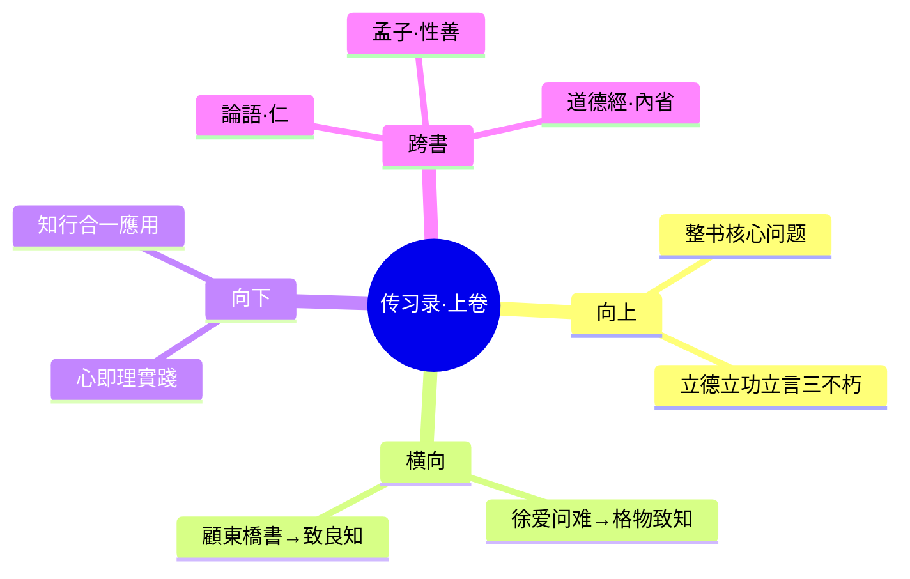

# 第1卷 徐爱录

## 📍 章节定位

### 全书位置
> 第一章是整书的理论奠基，确立心学基本纲领，回应理学争议，为后续"致良知"理论提供基础。

- **全书核心问题**: 何为圣人之道？人在世间该如何修行？
- **本章回答的问题**: 本章确立"心即理"和"知行合一"两大核心命题，回答了圣人之道不在于格物外求，而在于向内致良知的问题。
- **角色类型**: 开篇定位型（为整书建立理论基础）
- **论证位置**: 开篇第一章，论证起点

### 章节序列
| 方向 | 章节标题 | 逻辑连接 |
|------|----------|----------|
| 前章 | 无 | 开篇章节，理论奠基 |
| 后章 | [[第2卷-答顾东桥书]] | 承接本章的"致知"概念，深入探讨致良知工夫 |

### 一句话定位
> 第1卷徐爱录是《传习录》开篇定位，确立"心即理"与"知行合一"两大核心命题，奠定阳明心学理论基础。

---

## 🎯 核心观点

### 第一层：表层案例

| 案例名称 | 简要描述 | 页码 | 关键引文 |
|----------|----------|------|----------|
| 徐爱问难 | 徐爱质疑朱子"事事物物皆有定理"与阳明"心即理"的矛盾 | p.7 | "至善只求诸心，恐於天下事君、事父、交友、治民，俱不得其本領。" |
| 龙场悟道 | 王阳明贬谪龙场，彻悟格物致知之旨 | p.10 | "圣人之道，吾性自足，向之求理於事物者误也。" |
| 治疾用药 | 王阳明用治疗疾病比喻圣人之学与功利之学的区别 | p.15 | "犹之用药也者，一草皆有针对，宜用参，不宜用耆。所用之宜在參，非专用參之為是也。" |

### 第二层：中层机制

| 机制名称 | 组成要素 | 因果链条 | 证据来源 |
|----------|----------|----------|----------|
| 认知方向转变 | 向外求理 vs 向内致良知 | 朱熹理学→格物外求→知行分离 → 王阳明心学→反求诸心→知行合一 | 徐爱问难、龙场悟道 |
| 知行互证 | 真知、实行 | 真知必然导致实行，不行说明不是真知 | 王阳明对学者知孝、知悌的阐述 |
| 心理一元 | 心、理不可分 | 心之本体即理，理不在心外，心正理正 | 徐爱问难、龙场悟道 |

### 第三层：底层规律

| 规律陈述 | 抽象层级 | 知识连接 | 适用范围 |
|----------|----------|----------|----------|
| 心即理定律 | 本体论基础 | [[论语-孔子]]、[[道德经-老子]] | 人生哲学、决策指导 |
| 知行合一律 | 认识论基础 | [[思考快与慢]]认知一致性 | 学习行为、实践指导 |
| 反求诸己律 | 修行论基础 | [[孟子]]「反求诸己」 | 个人修养、品德实践 |

---

## 💬 降维翻译

### 观点1: 心即理

#### 原文表达
> "心即理也。天下又有心外之事，心外之理乎？"
> —— 王阳明答复徐爱关于"朱子以事事物物各有定理，而求之於外；先生以心即理，而欲求之於中"的问题

#### 降维翻译（中学生能懂）
真理不在外面，就在你心里。你不需要到处去寻找答案，只需要问问自己的内心。如果你向外界寻找道理，就会迷失方向。

#### 日常类比（奶奶能懂）
就像我们说"良心"一样，你做人怎么样，不在于读了多少书，也不在于听了多少人的话，而在于你心里那个"良心"。做人凭良心就行，良心就是道理。

#### 检验
- Q: 如果一个中学生问你这是什么意思？
- A: 就是告诉你，真正的智慧和道理不是书本上或别人告诉你的，而是在你自己内心深处的东西，你只要问问自己的良心就明白了。

### 观点2: 知行合一

#### 原文表达
> "知是行的主意，行是知的功夫；知是行之始，行是行之成。"
> —— 王阳明对知行关系的根本界定

#### 降维翻译（中学生能懂）
真正知道了一个道理，你就一定会去做；如果你不做，说明你还不是真的知道。知道和做到是一个事的两个面，不是一个知道然后一个做到。

#### 日常类比（奶奶能懂）
你饿了就会吃饭，渴了就会喝水，这就是知道和做到是一回事——如果你说你饿了却不去吃，那你可能并没有真的饿，或者你有其他原因不能吃。真正饿了是必然会吃的。

#### 检验
- Q: 如果一个中学生问你这是什么意思？
- A: 比如说你知道熬夜不好但还是熬夜，王阳明会说你并不是真的知道熬夜不好，如果真的知道了立刻就不会这样做了。

---

## ✨ 金句库

### 原书金句
| 金句 | 页码 | 适用场景 |
|------|------|----------|
| "心即理也。天下又有心外之事，心外之理乎？" | p.7 | 微博/哲理分享 |
| "知是行的主意，行是知的功夫；知是行之始，行是行之成。" | p.12 | 人生思考 |
| "圣人之道，吾性自足，不假外求。" | p.10 | 励志语录 |
| "凡看经书，要取有益於學，不可徒留一经之名。" | p.20 | 学习方法 |

### 降维金句
| 金句 | 来源观点 | 适用场景 |
|------|----------|----------|
| 真理不在外面，在你心里 | 心即理 | 励志/哲理 |
| 知道但不做，不是真知道 | 知行合一 | 学习/成长 |
| 真正想知道答案，问问你内心 | 心即理 | 焦虑解惑 |
| 实践是检验知道的标准 | 知行合一 | 自我反思 |

## 🔗 当下映射

### 💰 财富应用
| 场景 | 具体行动 | 预期效果 | 风险提示 |
|------|----------|----------|----------|
| 投资决策 | 不盲从专家，问问内心的直觉和良知 | 减少跟风损失 | 避免完全忽视客观分析 |
| 创业选择 | 回归初心，问良心做企业的目的 | 提升决策质量 | 避免仅凭感觉而忽略现实 |

### 💼 职场应用
| 场景 | 具体行动 | 所需能力 | 适用职级 |
|------|----------|----------|----------|
| 团队管理 | 以身作则而非单纯教条 | 感召领导力 | 中高层管理 |
| 沟通协调 | 设身处地，用心感受对方立场 | 同理心 | 所有层级 |
| 工作规划 | 不断反省自己内心的真实动机 | 自我觉察力 | 所有层级 |

### 🏠 生活应用
| 场景 | 具体行动 | 可行性 | 见效时间 |
|------|----------|--------|----------|
| 夫妻关系 | 用心体会真爱而非仅仅履行义务 | 高 | 1-4周 |
| 育儿教育 | 注重品德心性而非成绩分数 | 中 | 1-3月 |
| 自我成长 | 静心内省寻找人生方向 | 高 | 72小时内可见变化 |

### 72小时行动计划
1. **明天可以做的第一件事**: 静坐10分钟，问自己今天要做什么事是真正有意义的
2. **本周内可以尝试的事**: 在一项小事上实践"知行合一"（比如知道健康重要就立刻去锻炼）
3. **需要准备资源才能做的事**: 选一个困扰已久的决策问题，关闭外界声音，问问自己的内心

---

## 🕸️ 章节关联

### 向上关联 → 整书
- **贡献**: 本章确立心学两大基石命题，为整书提供理论基础
- **位置**: 理论奠基篇，整个心学体系的出发点

### 横向关联 → 章节间
| 章节编号 | 章节标题 | 关联类型 | 连接描述 |
|----------|----------|----------|----------|
| 第2卷 | 答顾东桥书 | 铺垫关系 | 本章提出"格物"概念，第2卷进一步阐述 |
| 第3卷 | 钱德洪附录 | 铺垫关系 | 本章奠基，后面进一步完善四句教 |

### 向下关联 → 具体应用
| 应用场景 | 难度 | 前置知识 |
|----------|------|----------|
| 冥想静修 | 低 | 了解心本体概念 |
| 知行合一实践 | 中 | 理解真假知区别 |
| 内观修行 | 高 | 系统掌握心学原理 |

### 跨书关联 → 知识网络
| 书籍 | 概念 | 关系 | 备注 |
|------|------|------|------|
| [[论语]] | 仁义道德 | 延伸发展 | 心学继承儒家道德基础 |
| [[道德经]] | 内省自修 | 对立互补 | 同强调内在，但道家偏无为 |
| [[孟子]] | 性善论 | 理论支撑 | 孟子性善为阳明心学提供了依据 |
| [[思考快与慢| 系统性认知 | 对比反思 | 现代认知偏误对比古典心学 |

### 关联可视化

---

## ❓ 问答设计

### Q1: 心即理的含义是什么？（理解型）
**认知层次**: 理解
**难度**: 低
**答案要点**:
- 心和理是一个东西，不是两个东西
- 真理不在心外，而在心内
- 圣人之道吾性自足

### Q2: 为什么说"向之求理于事物者误矣"？（分析型）
**认知层次**: 分析
**难度**: 中
**答案要点**:
- 认知方向错误，向外求而不知内求
- 知行容易分离，知而不做
- 永远得不到终极答案

### Q3: 举例说明知行合一在现代生活中的应用。（应用型）
**认知层次**: 应用
**难度**: 中
**答案要点**:
- 说自己重视健康就一定会锻炼
- 真正关心环保会有具体行动
- 不行动说明并非真知

### Q4: 如何区分什么叫"真知"什么叫"假知"？（分析型）
**认知层次**: 分析
**难度**: 中
**答案要点**:
- 真知必然产生相应行为
- 假知停留在认知层面
- 真知有情感和意志成分

### Q5: 知行合一理论的局限性有哪些？（评价型）
**认知层次**: 评价
**难度**: 高
**答案要点**:
- 可能低估客观世界的独立性
- 实践中知行分离有其合理性
- 需要考虑外部条件制约

### Q6: 王阳明为何认为"心即理"胜过朱熹的"格物致知"？（分析型）
**认知层次**: 分析
**难度**: 中
**答案要点**:
- 方向正确：内求 vs 外求
- 效率更高：一通百通
- 知行合一：避免分离

### Q7: 徐爱提出了哪些质疑？王阳明是如何回应的？（记忆型）
**认知层次**: 记忆
**难度**: 低
**答案要点**:
- 徐爱担心只求诸心无法应对实际事务
- 王阳明强调心正则理正，心正则事正

### Q8: 龙场悟道对王阳明思想发展的意义？（理解型）
**认知层次**: 理解
**难度**: 中
**答案要点**:
- 彻底否定早期格竹失败的经历
- 确立心学理论基础
- 提供实修经验

### Q9: 如何在教育实践中应用知行合一理念？（应用型）
**认知层次**: 应用
**难度**: 中
**答案要点**:
- 强调躬身实践
- 知行并进
- 品德教育与行为实践统一

### Q10: "诚意、正心、修身"与"知行合一"有何关联？（综合型）
**认知层次**: 综合
**难度**: 高
**答案要点**:
- 两者都强调身心合一
- 都注重实践工夫
- 互相支撑的理论体系

### Q11: 如何区分"心"和"私意、妄念"？（分析型）
**认知层次**: 分析
**难度**: 高
**答案要点**:
- 心是本体，纯善无恶
- 私意是私欲遮蔽
- 需要去欲存理工夫

### Q12: 现代心理学如何看待"心即理"观点？（评价型）
**认知层次**: 评价
**难度**: 高
**答案要点**:
- 认知偏向理论的相关
- 主观建构主义的支持
- 但也需客观实证验证

### Q13: 心学与理学在政治治理上的差异？（分析型）
**认知层次**: 分析
**难度**: 中
**答案要点**:
- 理学重制度规范
- 心学重教化内省
- 各有优势场景

### Q14: "知行合一"对现代企业管理的启示？（应用型）
**认知层次**: 应用
**难度**: 中
**答案要点**:
- 文化与行为一致
- 避免知行悖离
- 强调领导示范

### Q15: 当今社会知识焦虑的根源与"心即理"的对策？（应用型）
**认知层次**: 应用
**难度**: 高
**答案要点**:
- 焦虑源于向外过度求而不得
- 应转向内求，发挥本性之善
- 适度学习，重点内修

---
