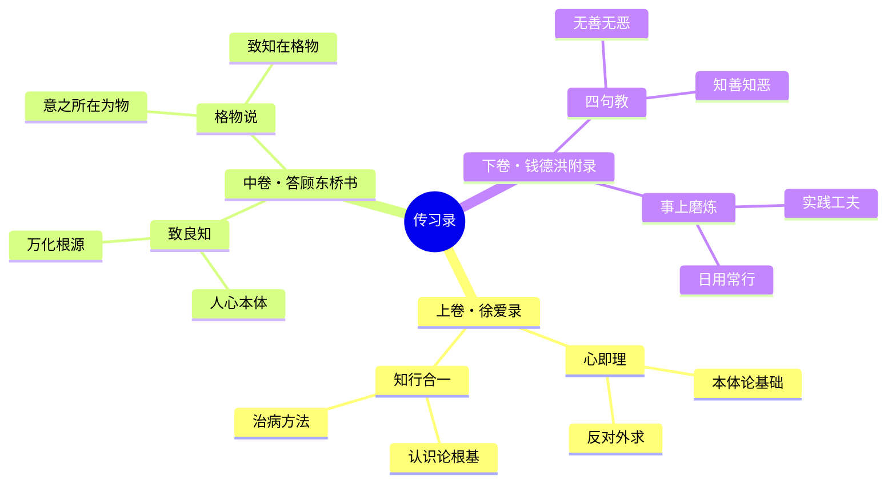
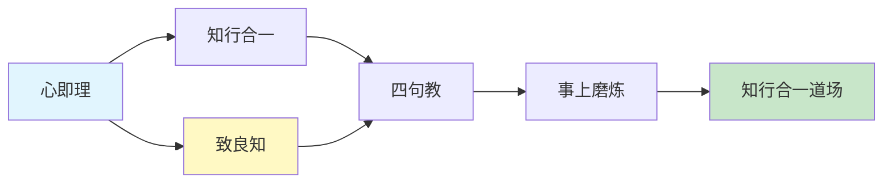

# 《传习录》 - 章节导航

> 作者: 王阳明
> 总章节: 3 卷（上卷徐爱录・中卷答顾东桥书等・下卷钱德洪附录）
> 最后更新: 2026-02-27

---

## 📚 章节结构（Mermaid Mindmap）

---

## 🔗 核心概念关联图

---

| 章节 | 标题 | 状态 | 完成日期 | 核心收获 |
|------|------|------|----------|----------|

---

## 🚀 快速跳转

### 按章节跳转
- [[第1卷-徐爱录]]
- [[第2卷-答顾东桥书]] 
- [[第3卷-钱德洪附录]]

### 按主题跳转
- 心即理
- 知行合一
- 致良知
- 四句教
- 事上磨炼

### 相关资源
- [[传习录-王阳明]] - 主拆解笔记
- 儒家心学 - 相关知识卡片
