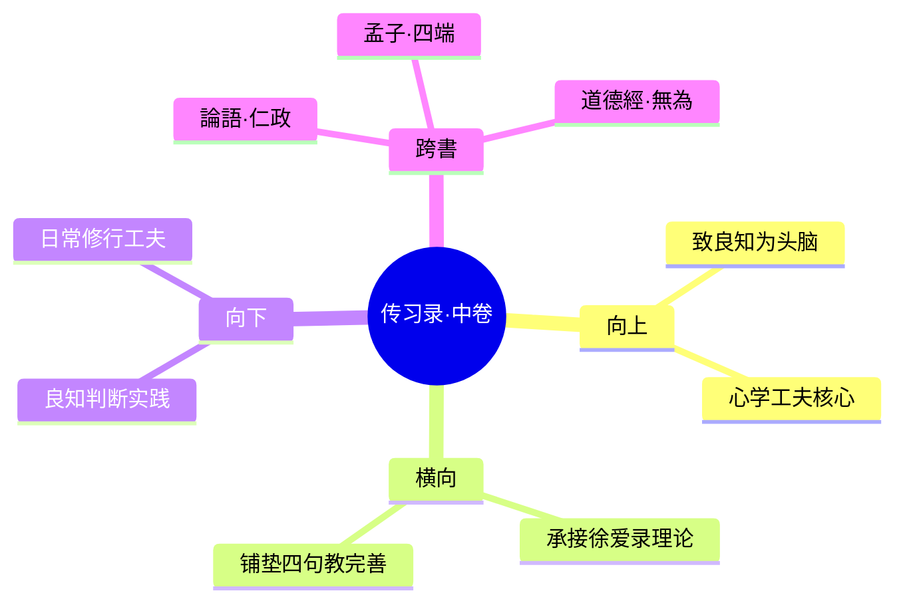

---

category:
  - 书籍拆解

status: completed
chapter:
number: 2
title: 答顾东桥书（中卷）
links:

  - "[[_导航]]"
  - "[[第1卷-徐爱录]]"
  - "[[第3卷-钱德洪附录]]"
created: 2026-02-27
tags:
  - 传习录
  - 王阳明
  - 致良知
  - 顾东桥
  - 格物说
  - 心学工夫
---

# 第2卷 答顾东桥书

## 📍 章节定位

### 全书位置
> 第二章是全书核心理论深化，详细阐释"致良知"学说，回应学术界对其格物说的根本性质疑。

- **全书核心问题**: 心学的究竟工夫落在何处？如何指导实践修行？
- **本章回答的问题**: 本章明确提出"致良知"是心学工夫的头脑，回答了学者关于格物、致知关系的根本疑问，确立了心学工夫的简易直接性。
- **角色类型**: 核心概念型（展开关键理论）
- **论证位置**: 全书理论展开的核心章节，上接心即理，下达四句教

### 章节序列
| 方向 | 章节标题 | 逻辑连接 |
|------|----------|----------|
| 前章 | [[第1卷-徐爱录]] | 承接本章"心即理"理论，深化为"致良知"工夫 |
| 后章 | [[第3卷-钱德洪附录]] | 本章展开的致良知理论，下章总结为四句教 |

### 一句话定位
> 第2卷答顾东桥书是《传习录》的理论高潮，首次系统阐述"致良知"学说，为心学工夫确立根本指导。

---

## 🎯 核心观点

### 第一层：表层案例

| 案例名称 | 简要描述 | 页码 | 关键引文 |
|----------|----------|------|----------|
| 顾东桥疑虑 | 顾东桥质问"致知在格物"，王阳明回应格物即格心 | p.46 | "夫'致知'云者，致吾心之良知之谓也。格物云者，即物穷理以格吾心之物也。" |
| 朱陆异同 | 王阳明辩析朱熹格物说与陆九渊心学的根本差异 | p.42 | "朱子格物之说，是以吾心而求理於外也，故失之深晦，而卒无得於心。陸子之說，是去吾心之上而求之也，故失之淺略，而亦無以見理之在於心而不可離也。" |
| 大端工夫 | 王阳明强调学者须先立大端，勿拘於小文 | p.50 | "近世末学术業，所以相攻以夸聖門學者，大抵多出於此類。若果有諸已，雖或不盡合聖人，聖人有所弗取也。"

### 第二层：中层机制

| 机制名称 | 组成要素 | 因果链条 | 证据来源 |
|----------|----------|----------|----------|
| 致良知机制 | 良知（心之本体）→致（推广实现）→知善知恶+为善去恶 | 人人皆有良知，只需致之，则能知善恶、行善去恶，不必向外求理 | 顾东桥疑难解答 |
| 格物工夫转化 | 朱熹：向外求理 → 王阳明：格心正意 | 不是从外物上穷理，而是从心意正起，使物不乱其本体 | 朱陆异同辨析 |
| 简易工夫机制 | 立大端（核心宗旨）→简易直接 → 圣人之学 | 专注核心，避免支离破碎，直达本心 | 大端工夫说明 |

### 第三层：底层规律

| 规律陈述 | 抽象层级 | 知识连接 | 适用范围 |
|----------|----------|----------|----------|
| 致良知定律 | 工夫论基石 | [[道德经-老子]]无为而治、[[论语-孔子]]为政以德 | 个人修身、领导管理 |
| 简中求繁律 | 学习方法论 | [[道德经-老子]]少则得、[[孙子兵法]]击其要害 | 认知策略、时间管理 |
| 内生动力率 | 行为改变论 | 马斯洛自我实现、内在动机理论 | 心理咨询、激励管理 |

---

## 💬 降维翻译

### 观点1: 致良知

#### 原文表达
> "致知在格物者，致吾心之良知於事事物物也。吾心之良知，即所謂天理也。致吾心良知之天理於事事物物，则事事物物皆得其理矣。"
> —— 王阳明回复顾东桥关于"致知在格物"的核心阐述

#### 降维翻译（中学生能懂）
什么是致良知？就是把你天生具备的"是非之心"推广到所有事情上去。每个人都天生知道什么是对什么是错，只要把自己的这个判断力用到每件事上，事情就能做好。

#### 日常类比（奶奶能懂）
每个人心里都有一杆秤，天然能分清好坏。比如孩子欺负别的孩子，你会觉得不对，这就是良知。致良知就是用这种"天然的正义感"来指导生活，看到不好的就纠正，看到好的就支持。

#### 检验
- Q: 如果一个中学生问你这是什么意思？
- A: 比如说你在路上看到有人摔倒，你第一反应应该是去扶起他，如果不去扶，那就是让你天生的善良（良知）睡着了，要"致良知"就是要时刻保持这种善良的清醒状态。

### 观点2: 简中求繁

#### 原文表达
> "今之學者，務養其耳目口體，以求知之所自出，而不務養其所養，此所以日紛紜而日亂也。"
> —— 王阳明对当时学子支离破碎学风的批判

#### 降维翻译（中学生能懂）
现在的学者只关心表面的学问和知识，不关心内心的根本修养，所以学问越多反而越混乱。真正的学问应该抓住根本，不要陷入细枝末节。

#### 日常类比（奶奶能懂）
就像做生意，有些人整天盯着报表数字、管理技巧这些细枝末节，忘记了做生意的根本是为顾客提供好产品。王阳明说，先把做人的良心放在第一位，生意自然就好了。

#### 检验
- Q: 如果一个中学生问你这是什么意思？
- A: 就是要抓重点，比如学习的根本是培养思考能力，而不是死记硬背知识点。掌握了根本方法，学习其他东西就简单多了。

---

## ✨ 金句库

### 原书金句
| 金句 | 页码 | 适用场景 |
|------|------|----------|
| "致良知是学问大头脑，是圣人教人第一义。" | p.48 | 学习方法/人生指导 |
| "吾心之良知即所謂天理也。" | p.46 | 哲理分享 |
| "立大端，简易直接。" | p.50 | 方法论/做事原则 |
| "凡學之不勤，必其志之尚未篤也。" | p.47 | 励志/学习 |

### 降维金句
| 金句 | 来源观点 | 适用场景 |
|------|----------|----------|
| 每个人心里都有善良的指南针，只要跟着走就行了 | 致良知 | 自我指导 |
| 抓住根本，简单直接，不用把事情搞复杂 | 简中求繁 | 解决问题 |
| 听你内心的正直判断，别被外在杂音迷惑 | 致良知 | 决策指导 |
| 真正的学问在于内心觉悟，不只在知识积累 | 致良知 | 学习观 |

## 🔗 当下映射

### 💰 财富应用
| 场景 | 具体行动 | 预期效果 | 风险提示 |
|------|----------|----------|----------|
| 投资决策 | 依循商业伦理和内心原则，不只是技术分析 | 建立可持续商业模式 | 避免过分理想化忽视市场现实 |
| 商业选择 | 商业决策基于良知和长远价值，而非短期利润 | 建立良好声誉 | 避免道德绑架和教条化 |

### 💼 职场应用
| 场景 | 具体行动 | 所需能力 | 适用职级 |
|------|----------|----------|----------|
| 组织决策 | 重大决定时询问内心良知，考量多方利益 | 伦理判断力 | 中高层干部 |
| 个人发展 | 职业规划基于内心价值观，而非纯粹利益 | 自我觉察力 | 所有层级 |
| 团队管理 | 以诚待人，激发下属道德自觉 | 领导力感召 | 所有管理岗位 |

### 🏠 生活应用
| 场景 | 具体行动 | 可行性 | 见效时间 |
|------|----------|--------|----------|
| 家庭教育 | 与其灌输规则，不如启发孩子的良知感知是非 | 高 | 3-6个月可见变化 |
| 社交关系 | 待人处事凭良心，真诚而非功利 | 中 | 立即可行 |
| 个人成长 | 每日反省是否遵循良知指导，及时调整 | 高 | 72小时内可见变化 |

### 72小时行动计划
1. **明天可以做的第一件事**: 今天做每一个决定时问一句："按我的良心，应该怎么选择？"
2. **本周内可以尝试的事**: 从本周开始每天记录一个"按良知指导的行为"，哪怕很小
3. **需要准备资源才能做的事**: 选一件平时纠结的道德选择问题，暂时屏蔽外在评判，只问内心做出判断

---

## 🕸️ 章节关联

### 向上关联 → 整书
- **贡献**: 将"心即理"的第一原理转化为实践工夫"致良知"，为整书提供核心修行方法
- **位置**: 全书理论展开的核心环节

### 横向关联 → 章节间
| 章节编号 | 章节标题 | 关联类型 | 连接描述 |
|----------|----------|----------|----------|
| 第1卷 | 徐爱录 | 承接关系 | 本章延续"心即理"，深化为致良知工夫 |
| 第3卷 | 钱德洪附录 | 铺垫关系 | 本章"致良知"为下卷四句教提供基础 |

### 向下关联 → 具体应用
| 应用场景 | 难度 | 前置知识 |
|----------|------|----------|
| 良知判断训练 | 低 | 心即理概念 |
| 致良知日课 | 中 | 基本的内心觉察能力 |
| 简易工夫实践 | 高 | 完整的心学理论基础 |

### 跨书关联 → 知识网络
| 书籍 | 概念 | 关系 | 备注 |
|------|------|------|------|
| [[道德经-老子]] | 无为而治 | 深化发展 | 道家的无为思想到心学的道德自觉 |
| [[论语-孔子]] | 为政以德 | 儒学深化 | 从外在礼制到内在德性 |
| [[孟子-孟子]] | 良知良能 | 理论溯源 | 孟子"是非之心"的进一步发展 |
| [[思考快与慢-丹尼尔·卡尼曼]] | 道德直觉 | 现代验证 | 为古典良知说提供认知科学解释 |

### 关联可视化

---

## ❓ 问答设计

### Q1: 什么是"致良知"？（理解型）
**认知层次**: 理解
**难度**: 低
**答案要点**:
- 致良知是推广内心本有的是非之心
- 按良知指导行事知善知恶
- 是学问的大头脑（根本工夫）

### Q2: 为何说"致良知"胜过朱熹向外穷理？（分析型）
**认知层次**: 分析
**难度**: 中
**答案要点**:
- 人人都有良知，不用外求
- 省却寻觅理的繁难过程
- 知行合一，避免脱节

### Q3: 在现代商业环境中如何应用"致良知"？（应用型）
**认知层次**: 应用
**难度**: 中
**答案要点**:
- 商业决策考虑各方利益
- 企业经营秉持诚信原则
- 个人职业选择遵循内心价值观

### Q4: 王阳明如何回应"致知在格物"的传统解释？（分析型）
**认知层次**: 分析
**难度**: 中
**答案要点**:
- 格物不是向外求理，而是格心
- 致知是推广心中的良知
- 物理在我心中求得

### Q5: "致良知"学说可能面临什么批评？（评价型）
**认知层次**: 评价
**难度**: 高
**答案要点**:
- 可能过于主观，缺乏客观标准
- 对复杂社会问题判断可能简单化
- 需要与客观事实相结合

### Q6: 王阳明认为"简易直接"的工夫有什么优势？（理解型）
**认知层次**: 理解
**难度**: 低
**答案要点**:
- 避免支离破碎
- 集中精力于根本
- 学者容易掌握

### Q7: 试比较朱陆异同的要点。（分析型）
**认知层次**: 分析
**难度**: 中
**答案要点**:
- 朱熹外向格物
- 陆九渊内心体验
- 阳明融会贯通，致良知工夫

### Q8: "致良知"对于个人品格修养的意义？（应用型）
**认知层次**: 应用
**难度**: 中
**答案要点**:
- 建立内在道德标准
- 持续的自我监督
- 知行合一的实践

### Q9: 如何在教育实践中应用"致良知"理念？（应用型）
**认知层次**: 应用
**难度**: 中
**答案要点**:
- 培养学生道德直觉
- 鼓励内在道德判断
- 以身作则而非单纯说教

### Q10: 结合现代社会特点，论述"致良知"的现实意义。（综合型）
**认知层次**: 综合
**难度**: 高
**答案要点**:
- 应对信息爆炸的价值选择混乱
- 提供内在道德定力
- 个人与社会和谐基础

### Q11: "致良知"与现代心理学的道德发展理论有何联系？（分析型）
**认知层次**: 分析
**难度**: 高
**答案要点**:
- 科胡特自体心理学的对应
- 道德情感与理智判断统一
- 柯尔伯格道德发展阶段的支持

### Q12: 为何王阳明强调学者要先立"大端"？（理解型）
**认知层次**: 理解
**难度**: 中
**答案要点**:
- 避免学而无本的流弊
- 建立根本的人生方向
- 以本驭末的智慧

### Q13: "致良知"工夫与佛教的"明心见性"有什么异同？（分析型）
**认知层次**: 分析
**难度**: 高
**答案要点**:
- 共同点：都强调内心觉悟
- 不同点：儒家入世担当，佛家解脱出世
- 阳明更强调道德践履

### Q14: 当代企业伦理建设如何借鉴"致良知"思想？（应用型）
**认知层次**: 应用
**难度**: 中
**答案要点**:
- 建立企业内在伦理准则
- 领导者的道德示范作用
- 内在约束比外在规章更有效

### Q15: "致良知"说对当代教育改革有何启示？（评价型）
**认知层次**: 评价
**难度**: 高
**答案要点**:
- 从知识传授到品德培养
- 内在动机激发比外在激励重要
- 完整人格教育的重要性

---
