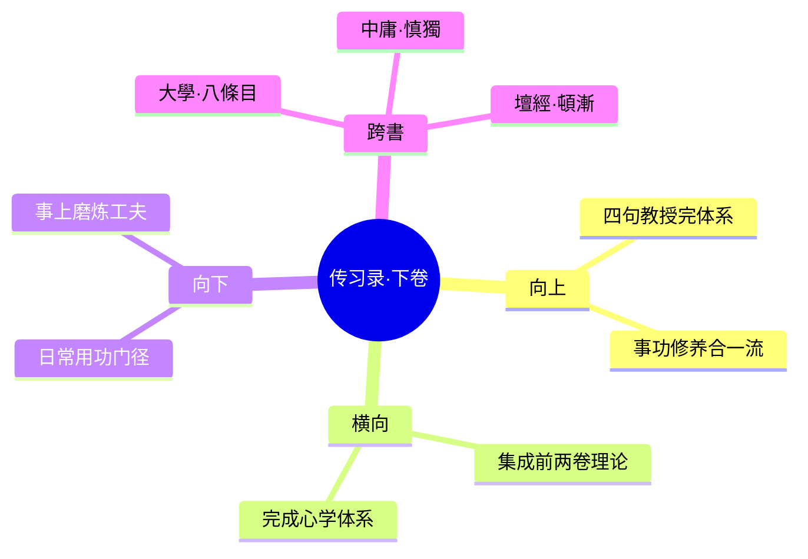

---

category:
  - 书籍拆解

status: completed
chapter:
number: 3
title: 钱德洪附录（下卷）
links:

  - "[[_导航]]"
  - "[[第2卷-答顾东桥书]]"
created: 2026-02-27
tags:
  - 传习录
  - 王阳明
  - 四句教
  - 钱德洪
  - 事上磨炼
  - 终身修养
---

# 第3卷 钱德洪附录

## 📍 章节定位

### 全书位置
> 第三章是全书理论总结与工夫完善，通过"四句教"体系化心性修养工夫，完成心学理论建构的收官之作。

- **全书核心问题**: 心学修行的整体工夫体系及境界层次
- **本章回答的问题**: 通过四句教完整呈现心学工夫的渐教体系，并阐述工夫在日用常行中的具体落实
- **角色类型**: 整合升华型（总结全书理论，并提出实践路径）
- **论证位置**: 理论完善与实践指导的终结

### 章节序列
| 方向 | 章节标题 | 逻辑连接 |
|------|----------|----------|
| 前章 | [[第2卷-答顾东桥书]] | 承接本章"致良知"学说，总结为四句教体系 |
| 后章 | 无 | 全书终章，理论与实践的总结 |

### 一句话定位
> 第3卷钱德洪附录是《传习录》的理论集大成，以四句教完成心学工夫体系构建，并提供工夫在日用常行中的具体落实路径。

---

## 🎯 核心观点

### 第一层：表层案例

| 案例名称 | 简要描述 | 页码 | 关键引文 |
|----------|----------|------|----------|
| 四句教释义 | 王阳明对四句教的完整解说：无善无恶心之体，有善有恶意之动，知善知恶是良知，为善去恶是格物 | p.119 | "无善无恶心之体，有善有恶意之动，知善知恶是良知，为善去恶是格物。" |
| 师友之间 | 王阳明论师友之间以诚相待的重要性及实践方法 | p.135 | "朋友之间，本有毫毛事，不可不放在心上。" |
| 志与学 | 王阳明关于志向与学习关系的具体指导 | p.125 | "志不立，天下无可成之事。虽曰有志，志向不坚，终归浮沉。" |

### 第二层：中层机制

| 机制名称 | 组成要素 | 因果链条 | 证据来源 |
|----------|----------|----------|----------|
| 四句教工夫体系 | 心之体-意之动-知善恶-为善恶 | 人心本体→意念发动→良知察辨→道德践履，构成完整修养流程 | 王阳明晚年定论 |
| 渐顿圆融工夫 | 渐修工夫（格物致知）→顿悟契机（龙场悟道）→圆融境界（事上磨炼） | 逐步修养中偶然顿悟，最终达成日用常行圆融状态 | 阳明生平实例及教导 |
| 日用常行工夫 | 军务政务+教学育人 → 事上磨炼 → 日久天成 | 离却具体事宜无工夫可言，工夫即实践 | 阳明平乱治政实例 |

### 第三层：底层规律

| 规律陈述 | 抽象层级 | 知识连接 | 适用范围 |
|----------|----------|----------|----------|
| 修养层次律 | 本体工夫论 | [[孟子-孟子]]性善论、[[大学]]八条目 | 人格养成、领导培育 |
| 渐顿圆融律 | 修养方法论 | [[坛经]]顿渐之争、[[中庸]]慎独自修 | 学习发展、技能习得 |
| 日用是道律 | 实践哲学论 | [[庄子-庄子]]在世修行、[[菜根谭-洪应明]]处处是道 | 生活指导、职场修行 |

---

## 💬 降维翻译

### 观点1: 四句教

#### 原文表达
> "无善无恶心之体，有善有恶意之动，知善知恶是良知，为善去恶是格物。"
> —— 王阳明晚年精要概括，心学工夫体系的完整表达

#### 降维翻译（中学生能懂）
人的本心本质上没有善恶，就像一张干净的白纸；一旦产生了念头，就有了善恶之分；良知天生知道什么是善什么是恶；修行就是要按照良知的指引，做善事去恶事。这是一个完整的道德修养流程。

#### 日常类比（奶奶能懂）
就像孩子刚出生时心地单纯，没什么善恶观念，长大后有了各种想法才分善恶。但是你内心有一个本能知道什么是好的什么是坏的，只要跟着这个本能指导你的行为，就是最好的修行了。

#### 检验
- Q: 如果一个中学生问你这是什么意思？
- A: 就是说每个人本性都是纯净的，后来被世俗染污了。但你心底的那个"好人"知道什么该做什么不该做，听从"好人"的话去行动，就是在修炼自己。

### 观点2: 事上磨炼

#### 原文表达
> "人须在事上磨炼做功夫乃有益。若只好静，遇事便乱，终无长进。那静时功夫亦差似收敛，而实放溺也。"
> —— 王阳明对于修养工夫在具体事物中实践的重要性的指导

#### 降维翻译（中学生能懂）
要想修炼自己，必须在具体的工作和生活中磨练，而不是专门找个地方静坐。如果只喜欢安静修行，一遇到事情就慌乱，这样是没有进步的。

#### 日常类比（奶奶能懂）
就像学游泳，光在岸上做动作是学不会的，一定要到水里练。做人也是，光想着做好人不够，在实际和人打交道、做事情中保持好人本色，才是真本事。

#### 检验
- Q: 如果一个中学生问你这是什么意思？
- A: 就比如说学好不走样，不光是自己一个人的时候要做好，更重要的是一遇到各种诱惑和困难时也能坚持做好，这才是真的品格。

---

## ✨ 金句库

### 原书金句
| 金句 | 页码 | 适用场景 |
|------|------|----------|
| "无善无恶心之体，有善有恶意之动，知善知恶是良知，为善去恶是格物。" | p.119 | 人生哲学/道德修养 |
| "人须在事上磨炼做功夫乃有益。" | p.130 | 实践指导/励志语录 |
| "志不立，天下无可成之事。" | p.125 | 励志/目标设定 |
| "日间工夫觉纷扰，则静坐。觉懒看书，则且看书。是亦因病而药。" | p.140 | 学习方法/自我调节 |

### 降维金句
| 金句 | 来源观点 | 适用场景 |
|------|----------|----------|
| 心本来干净，善恶是后来加的 | 四句教 | 自我认知/心理修复 |
| 修炼不在庙堂，就在日常生活 | 事上磨炼 | 实践修行/生活指导 |
| 遇事不乱，才是真功夫 | 事上磨炼 | 能力素质/心理定力 |
| 内在有个判断官，照它做事就不会错 | 四句教 | 决策指导/道德准则 |
| 日用即道，平凡即是修 | 事上磨炼 | 生活哲学/价值观 |

## 🔗 当下映射

### 💰 财富应用
| 场景 | 具体行动 | 预期效果 | 风险提示 |
|------|----------|----------|----------|
| 投资决策 | 投资之前问问自己的良知和初心 | 减少盲目跟风损失 | 避免过分理想化而忽视市场现实 |
| 商业运营 | 按良心和良知指导公司决策 | 建立长久品牌信誉 | 避免商业伦理冲突 |

### 💼 职场应用
| 场景 | 具体行动 | 所需能力 | 适用职级 |
|------|----------|----------|----------|
| 压力处理 | 在工作压力和困难中磨炼心性 | 心态调节力 | 所有层级 |
| 领导决策 | 依循道义原则而不限于功利 | 价值观决策力 | 中高层管理 |
| 人际关系 | 在与同事、客户的交往中锻炼德行 | 情商和修养 | 所有层级 |

### 🏠 生活应用
| 场景 | 具体行动 | 可行性 | 见效时间 |
|------|----------|--------|----------|
| 日常修行 | 把每天的平凡事当作修炼机会 | 高 | 立即可行 |
| 家庭生活 | 在家庭关系中落实四句教修养 | 高 | 1-4周内可感变化 |
| 自我成长 | 每晚按照四句教自省今日言行 | 高 | 72小时内有觉察 |

### 72小时行动计划
1. **明天可以做的第一件事**: 利用今天的一个具体事务（如上班、做饭、交流）来实践"事上磨炼"的理念
2. **本周内可以尝试的事**: 每日按四句教自省（心之体态、意之发动、善恶判断、行为践履）
3. **需要准备资源才能做的事**: 选定一项挑战性任务，专门用来练习遇事不乱的心性

---

## 🕸️ 章节关联

### 向上关联 → 整书
- **贡献**: 完善心学工夫体系，总结全书理论为实用的修养方法
- **位置**: 全书理论集大成篇，为心学提供完整修行体系

### 横向关联 → 章节间
| 章节编号 | 章节标题 | 关联类型 | 连接描述 |
|----------|----------|----------|----------|
| 第1卷 | 徐爱录 | 终成关系 | 本章的四句教为前两章的"心即理""知行合一"提供完整践履路径 |
| 第2卷 | 答顾东桥书 | 集成关系 | 本章的四句教完善前卷的"致良知"理论，形成工夫体系 |

### 向下关联 → 具体应用
| 应用场景 | 难度 | 前置知识 |
|----------|------|----------|
| 日常四句教自省 | 中 | 了解心即理和致良知 |
| 事上磨炼实践 | 中 | 掌握知行合一理念 |
| 本心涵养功夫 | 高 | 完整心学理论基础 |

### 跨书关联 → 知识网络
| 书籍 | 概念 | 关系 | 备注 |
|------|------|------|------|
| [[大学]] | 八条目 | 整合完善 | 阳明以格致诚正为身心一体工夫 |
| [[中庸]] | 慎独自修 | 发展深化 | 从独处修炼到事上磨炼 |
| [[菜根谭-洪应明]] | 处世智慧 | 理念源头 | 传习录为其提供的哲学基础 |
| [[坛经]] | 顿渐圆融 | 对话互补 | 两家修养方法的对比与参照 |

### 关联可视化

---

## ❓ 问答设计

### Q1: 什么是"四句教"，每句分别什么意思？（理解型）
**认知层次**: 理解
**难度**: 低
**答案要点**:
- 无善无恶心之体：本心本自纯净
- 有善有恶意之动：念头才有善恶
- 知善知恶是良知：良知能分辨善恶
- 为善去恶是格物：实践善念

### Q2: 为什么说"人须在事上磨炼做功夫乃有益"？（分析型）
**认知层次**: 分析
**难度**: 中
**答案要点**:
- 静坐易流于空虚
- 遇事心方显真假
- 实践检验真工夫

### Q3: 在现代职场中如何践行"事上磨炼"理念？（应用型）
**认知层次**: 应用
**难度**: 中
**答案要点**:
- 在工作挑战中保持定力
- 在人际冲突中修炼忍耐
- 在道德取舍时遵循良知

### Q4: "四句教"体现的心性修养层次是什么？（分析型）
**认知层次**: 分析
**难度**: 中
**答案要点**:
- 本体层：心性本净
- 发用层：意念善恶辨析  
- 察知层：良知觉照
- 践履层：知善行善

### Q5: 王阳明"事上磨炼"思想相比静坐修行有什么优势？（评价型）
**认知层次**: 评价
**难度**: 高
**答案要点**:
- 避免了空谈玄理
- 直接受实践检验
- 更符合儒家入世精神

### Q6: 朱熹格物理论与王阳明格物理论有何根本不同？（理解型）
**认知层次**: 理解
**难度**: 低
**答案要点**:
- 朱熹：向外穷理
- 阳明：内心反求
- 关注点和途径完全不同

### Q7: 如何理解"志不立，天下无可成之事"的深刻含义？（理解型）
**认知层次**: 理解
**难度**: 中
**答案要点**:
- 志向为一切行动的指向
- 缺乏根本方向的努力会散乱
- 定立人生总方向的重要性

### Q8: 阳明心学的工夫论与程朱理学有什么系统性差别？（分析型）
**认知层次**: 分析
**难度**: 高
**答案要点**:
- 工夫出发点：心/理分歧
- 工夫途径：内/外之别
- 工夫目标：本体/功夫关系

### Q9: 在家庭教育中如何运用四句教思想？（应用型）
**认知层次**: 应用
**难度**: 中
**答案要点**:
- 保护孩子心性本纯
- 指导其意念趋向善美
- 培养是非善恶辨别能力
- 在实践中落实道德行为

### Q10: 结合现代心理学，分析"无善无恶心之体"的说法。（综合型）
**认知层次**: 综合
**难度**: 高
**答案要点**:
- 与人性本源的研究关联
- 道德发生论的心理基础
- 心性发展的深层机制

### Q11: 如何看待王阳明对于"静坐"工夫的局限性认识？（评价型）
**认知层次**: 评价
**难度**: 高
**答案要点**:
- 指出了纯粹静功的流弊
- 强调了实践检验的重要性
- 但也可能忽视了静修的价值

### Q12: "日用即道"的观念与禅宗"平常心是道"有何异同？（分析型）
**认知层次**: 分析
**难度**: 高
**答案要点**:
- 相同：都在日常中修行
- 不同：儒家入世担当 v s 佛教超脱出世
- 价值取向有显著差异

### Q13: 试述四句教在现代心理咨询治疗中的借鉴意义。（应用型）
**认知层次**: 应用
**难度**: 高
**答案要点**:
- 本心潜能开发理念
- 意念觉照技术训练
- 认知行为整合方法

### Q14: "因病与药"的教育方法体现了怎样的修养智慧？（分析型）
**认知层次**: 分析
**难度**: 中
**答案要点**:
- 对症下药因材施教
- 顺势利导的灵活性
- 个体化指导的智慧

### Q15: 从修养工夫的角度评价心学"简易直截"的特点。（评价型）
**认知层次**: 评价
**难度**: 中
**答案要点**:
- 优点：直接有效、易于践履
- 风险：可能低估修养难度
- 适宜：入门易但深造难

---
