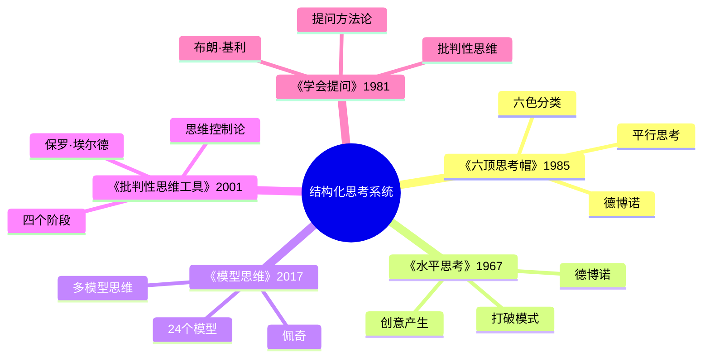
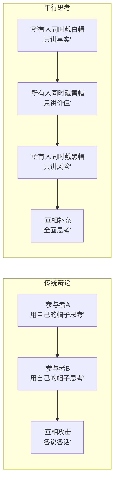
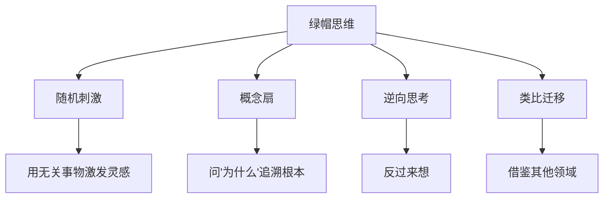
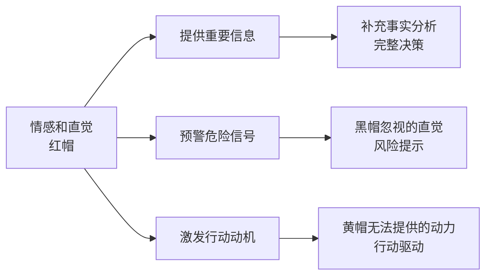
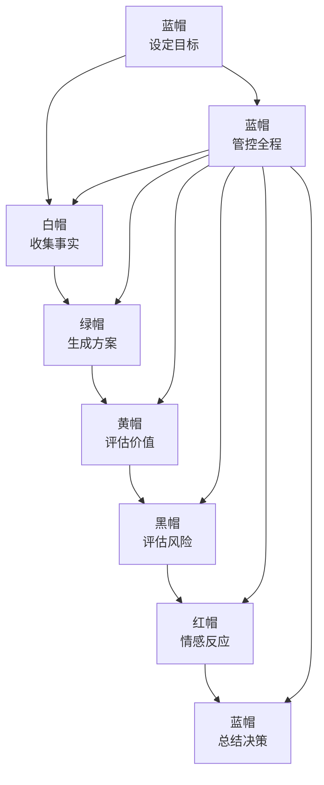

# 《六顶思考帽》读书笔记

## 这本书要解决什么问题？

**核心困境**：会议讨论低效——各说各话、情绪混杂、没有结构。为什么开会总是吵架？为什么决策总是片面？因为大家在用不同的"思考频道"对话。

**一句话定位**：
> 把混乱的思考变成有序的流程——一次只戴一顶帽子，一次只做一种思考。

### 作者站在什么位置说这些话？

| 维度 | 定位 |
|------|------|
| 主领域 | 认知科学、决策科学、会议管理 |
| 跨界领域 | 创新思维、心理学、组织行为学、领导力 |
| 作者背景 | 医学博士、心理学家、"水平思考"创始人、"创新思维之父" |
| 历史语境 | 1985年出版，德博诺从医学和心理学视角切入，把认知科学工具化为企业可用的会议框架 |

### 和其他书有什么关系？

| 关联书籍 | 关联关系 | 共同底层逻辑 |
|----------|----------|--------------|
| [[水平思考-德博诺]] | 同作者姊妹篇 | 六帽是水平思考的工具化实施框架 |
| [[模型思维-佩奇]] | 互补延伸 | 多模型思维 = 六帽思维的扩展版 |
| [[批判性思维工具-保罗]] | 方法互补 | 思维控制论 + 六顶思考帽 = 结构化思考的完整版 |
| [[学会提问-布朗]] | 技能互补 | 提问技巧 + 思考框架 = 完整对话系统 |
| [[金字塔原理-明托]] | 结构互补 | 金字塔原理是表达结构，六顶思考帽是思考结构 |

### 知识网络图

---

## 作者的核心论点

### 平行思考：一次只做一种思考

你有没有参加过这样的会议？有人讲事实，有人讲情绪，有人讲想法，最后变成吵架。德博诺说，问题不是这些人能力差，而是大家在用不同的"思考频道"对话——就像六个人同时用六种语言发言，谁也听不懂谁。

传统辩论的模式是：每个人用自己的帽子思考，互相攻击。目的是赢，情绪混杂，效率极低。平行思考则完全反过来：所有人同时用同一顶帽子思考，互相补充。目的是对，情绪分离，效率高。

> **平行思考定律**：当所有人用同一个"思考频道"对话时，混乱的杂音会变成和谐的和声。传统辩论是"你对我错"，平行思考是"我们一起对"。

这打碎了我对"开会"的迷信。以前觉得会议效率低是因为参会的人不行，现在意识到问题出在结构——不是人的问题，是"频道"的问题。换掉思考频道，不换人，就能彻底改变讨论质量。

有了平行思考的框架，下一步是确定从哪个频道开始。

### 白帽与黄帽：事实优先，然后寻找价值

白帽是所有讨论的起点。只讲客观信息，不加判断，不表达观点，不表达情绪——像照相机一样记录。核心问题是：我们知道什么？我们需要知道什么？还有哪些信息缺失？

没有事实，所有观点都是空中楼阁。事实不一定导致正确决策，但缺乏事实的决策必然是错误的。

黄帽紧随其后。它要求刻意寻找积极面，做有逻辑的乐观推理——这有什么好处？价值在哪里？为什么可能成功？

黄帽和"天生乐观"完全不同。天生乐观是无条件地相信，盲目自信，忽视风险。黄帽是基于事实的正面推理，有逻辑的支持，是在了解风险之后仍然看到价值。结构化的乐观，不是天真的乐观。

> **白帽定律**：没有事实，所有观点都是空中楼阁。事实不一定导致正确决策，但缺乏事实的决策必然是错误的。

> **黄帽定律**：乐观不是天赋，而是可以训练的思维习惯。刻意戴黄帽思考，能让大脑从"自动批评"切换到"自动寻找价值"。

以前我总觉得"乐观"是性格问题，有些人天生乐观，有些人天生悲观。现在意识到乐观是可以训练的思维习惯——你刻意练习寻找价值，大脑就会逐渐从"自动批评"切换到"自动寻找价值"。下次开会，我不会再让批评抢跑，而是先问"价值在哪里"。

有了事实和价值，还要面对风险和创意。

### 黑帽与绿帽：风险管理，然后释放创意

黑帽是很多人最喜欢的帽子——它允许你批评。但黑帽和情绪攻击有本质区别。黑帽对事不对人，有逻辑依据，目的是风险管理，所有人都可以用，是建设性的。情绪攻击则恰恰相反。

| 黑帽思维 | 情绪攻击 |
|----------|----------|
| 对事不对人 | 对人不对事 |
| 有逻辑依据 | 纯情绪发泄 |
| 目的是风险管理 | 目的是攻击对方 |
| 所有人都可以用 | 个人攻击 |
| 建设性 | 破坏性 |

批评不是为了伤人，批评是为了找风险。黑帽像"安全检查员"，不是"敌人"。

绿帽则是黑帽的解药。黑帽负责发现问题，绿帽负责解决问题。绿帽的核心是不评判——提出新想法、新可能，暂停所有批评。还有其他方式吗？全新方案是什么？如果没有限制，怎么做？

> **黑帽定律**：没有风险意识的乐观是危险的，但只有风险没有价值的悲观是无用的。黑帽的价值在于"建设性批评"。

> **绿帽定律**：创意不是天赋，而是可以训练的思维模式。绿帽提供的安全空间，让大脑暂时关闭"自动批评系统"，释放创造力。

这个观点打碎了我的一个假设。我一直以为批评是最有价值的思考，发现问题才能解决问题。但德博诺说的是，批评和创意需要分开——黑帽负责发现问题，绿帽负责解决问题。如果你只有黑帽没有绿帽，批评就变成了单纯的否定。下次别人提出想法，我不会再立刻说"这不行"，而是先问"有没有其他可能"。

事实、价值、风险、创意都有了，但还有一个被忽视的维度：情感。

### 红帽：直觉与情感

红帽解决了一个很多人不敢面对的问题：讨论中能不能表达情绪？

德博诺的答案是可以，而且必须有专门的时间来做这件事。红帽允许表达感受和直觉，不需要解释——我感觉如何？我的直觉告诉我什么？我喜欢还是不喜欢？

情感和直觉不是思考的敌人，而是重要的信息源。它们能提供事实分析遗漏的信息，预警黑帽忽视的直觉风险，激发黄帽无法提供的行动动力。压抑情感不会让决策更理性，反而会遗漏关键信息。

> **红帽定律**：情感和直觉不是思考的敌人，而是重要的信息源。压抑情感不会让决策更理性，反而会遗漏关键信息。

以前我认为理性决策就应该排除情绪，"不要感情用事"是最高准则。但德博诺让我意识到，压抑情绪不等于理性，反而会让情绪在暗处干扰你的判断。给情绪一个合法的表达空间，它反而不再捣乱。

红帽给了情绪一个出口，但谁来管这六顶帽子？这引出了最后一个角色。

### 蓝帽：控制与组织

蓝帽是六顶帽子中唯一"管帽子"的帽子。它的核心任务是流程管理——控制思考过程和帽子切换；总结决策——整合所有信息，得出结论和行动步骤；焦点控制——确保讨论不跑题。

蓝帽设计的标准思考序列是：蓝帽设定目标→白帽收集事实→绿帽生成方案→黄帽评估价值→黑帽评估风险→红帽情感反应→蓝帽总结决策。

> **蓝帽定律**：没有控制的思考就像没有指挥的乐队——每个人都自己演奏，结果是一团混乱。蓝帽是思考过程的"指挥家"。

下次主持会议，我不会再让大家"随便讨论"，而是先说"我们现在戴白帽，只讲事实"，然后有序切换。

---

## 这本书的局限

> 德博诺的六顶思考帽是一个优雅的思维框架，但框架本身不是万能药。

| 批评点 | 谁在批评 | 怎么说 | 实际情况 |
|--------|---------|--------|---------|
| 尴尬感问题 | 实践者 | 有些人觉得戴帽子很尴尬、不自然 | 框架需要训练才能熟练，初期确实不适应 |
| 时间成本 | 管理者 | 六顶帽子都需要时间，可能延长会议 | 短会确实不适用，但重要决策的讨论时间本来就该充足 |
| 工具化局限 | 学术界 | 六顶帽子是工具，不能替代内容本身 | 框架帮你想得全面，但想得对不对取决于你的知识和经验 |
| 文化适应性 | 跨文化研究者 | 等级文化可能不习惯平等参与，含蓄文化可能不适应红帽 | 需要根据文化环境调整使用方式 |

**一句话总结局限性**：
> 六顶思考帽提供了结构化思考的优秀框架，但它本身不生产内容，且需要训练和文化适配才能真正生效。

---

## 最值得记住的话

**原书说的**：
1. "六顶思考帽是一种平行思考的方法，它确保所有人在同一时间关注和思考同一个主题。"
2. "混乱的思考导致混乱的决策。"
3. "情绪是思考的一部分，不是思考的敌人。"
4. "一次只戴一顶帽子，一次只做一种思考。"
5. "创意不是天赋，而是可以训练的技能。"
6. "批评的目的是风险管理，不是攻击。"
7. "没有控制的思考就像没有指挥的乐队。"

**翻译成人话**：
1. 会议效率低的根源：每个人都在用不同的帽子思考
2. 传统辩论：你对我错；平行思考：我们一起对
3. 白帽：事实像地基，没有地基，楼盖再高也会塌
4. 黄帽：乐观不是天赋，是可以"练出来"的
5. 黑帽：批评不是为了伤人，是"安全检查员"
6. 绿帽：想法傻不重要，重要的是敢想
7. 红帽：不需要解释感受，只需要表达感受
8. 蓝帽：思考需要指挥家，不是大杂烩
9. 一次只做一种思考，比一次做所有思考更有效
10. 换掉"思考频道"，而不是换掉"人"

---

## 讲给没读过的人听

你有没有发现，开会的时候经常变成吵架？不是因为大家不聪明，而是因为每个人在用不同的方式思考——有人讲数据，有人讲感受，有人讲风险，有人讲创意，搅在一起就乱了。

德博诺的解决方案出奇地简单：一次只做一种思考。

他设计了六顶不同颜色的"帽子"。白帽只讲事实和数据；黄帽只找价值和好处；黑帽只看风险和问题；绿帽只管创意和可能性；红帽只表达感受和直觉；蓝帽负责控制整个流程。

所有人同时戴同一顶帽子。戴白帽的时候，所有人都只讲事实——不评判，不批评，不表达情绪。戴黄帽的时候，所有人都只找价值——不泼冷水，不挑毛病。戴黑帽的时候，所有人都可以尽情批评——因为这是专门用来找风险的时间。

结果就是：每个人都被"听到"了，每种思考方式都有专属时间，讨论不再吵架，变成了有序的流程。

---

## 用来检验理解的问题

**基础回忆**：
1. Q: 六顶思考帽分别代表什么？
   A: 白帽（事实）、黄帽（价值）、黑帽（风险）、绿帽（创意）、红帽（情感）、蓝帽（控制）。

2. Q: 平行思考和传统辩论的核心区别？
   A: 传统辩论每个人用自己的帽子思考，互相攻击；平行思考所有人用同一顶帽子思考，互相补充。

3. Q: 蓝帽的独特角色是什么？
   A: 蓝帽是"管帽子的帽子"，负责控制流程、设计思考序列、总结决策。

**理解验证**：
1. Q: 为什么黄帽不是"天生乐观"？
   A: 黄帽是基于事实的有逻辑的乐观推理，不是盲目自信。它是在了解风险之后仍然刻意寻找价值。

2. Q: 黑帽和情绪攻击有什么区别？
   A: 黑帽对事不对人，有逻辑依据，目的是风险管理。情绪攻击对人不对事，纯发泄，目的是攻击。

3. Q: 红帽的价值是什么？
   A: 提供事实分析遗漏的直觉信息，预警危险信号，激发行动动机。

**实际应用**：
1. Q: 选一个你最近要做的决策，用六帽序列走一遍。
   A: 白帽（收集事实）→绿帽（生成方案）→黄帽（评估价值）→黑帽（评估风险）→红帽（感受反应）→蓝帽（总结决策）。

2. Q: 你的团队最缺哪顶帽子？
   A: 观察团队讨论模式——如果总在吵架，缺蓝帽；如果总看到负面，缺黄帽；如果缺少新方案，缺绿帽。

**深度分析**：
1. Q: 六顶思考帽和金字塔原理怎么配合使用？
   A: 六帽是思考的结构——帮你"想清楚"；金字塔是表达的结构——帮你"说清楚"。先用六帽想，再用金字塔表达。

2. Q: AI能替代蓝帽的角色吗？
   A: AI擅长白帽（信息收集）和蓝帽的流程管理部分，但不擅长红帽（情感表达）、绿帽（创意激发）和黄帽（价值判断）。人机协作是最优解。

---

## 和其他书的对话

德博诺自己写了《水平思考》和《六顶思考帽》这两本姊妹篇，前后相差18年。《水平思考》教你"如何产生创意"——打破既定模式，换个地方挖洞；《六顶思考帽》教你"如何使用创意"——让所有人一起挖同一个洞。前者是创新思维的方法论，后者是会议思考的操作系统。读了前者你知道怎么想出新点子，读了后者你知道怎么让团队一起想。

佩奇的《模型思维》和《六顶思考帽》是"多模型"的两个版本。佩奇提供24个学术模型，德博诺提供6个实践模型。24个模型像专业工具箱，6顶帽子像瑞士军刀。前者需要系统训练，后者上手快。如果你的问题是复杂的学术分析，用佩奇；如果你的问题是明天的团队会议，用德博诺。

保罗和埃尔德的《批判性思维工具》是个人版，德博诺的六帽是团队版。保罗教你"如何控制自己的思维"——思维要素分析、思维标准检验，是个人思维升级。德博诺教你"如何管理团队的思维"——平行思考、帽子切换，是团队思维升级。个人升级加团队升级，才是完整的思维系统。

布朗和基利的《学会提问》教你怎么问，德博诺教你怎么想。提问是获取信息的技能，帽子是组织思考的框架。问得好加上想得好，讨论效果才好。具体来说，白帽阶段的"我们知道什么？还需要知道什么？"就是提问技巧的最佳应用场景。

明托的《金字塔原理》是表达的模型——结论先行，MECE原则。德博诺的六帽是思考的模型——一次一帽，全面覆盖。想清楚（六帽），才能说清楚（金字塔）。帽子是思考的骨架，金字塔是表达的结构。

---

*拆解日期：2026-02-15*
*下次回访：1周后回顾「讲给没读过的人听」和「检验问题」*
