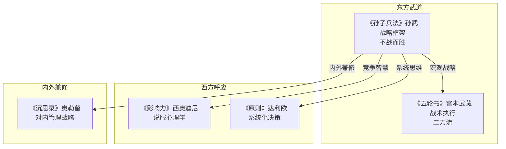

# 《孙子兵法》读书笔记

## 这本书要解决什么问题？

**核心困境**：战争是人类最极端的竞争形式——赌注是生死，资源永远不够，信息永远不全。在这种极端条件下，怎么做出正确的决策？孙子问的问题不是"如何取得胜利"，而是一个更根本的问题：如何不战而屈人之兵？

**一句话定位**：
> 最高明的战争，不是打赢对方，而是让对方丧失战斗的意愿和能力——不战而胜。

### 作者站在什么位置说这些话？

| 维度 | 定位 |
|------|------|
| 主领域 | 军事哲学、战略思维 |
| 跨界领域 | 领导力、决策方法、商业竞争、博弈论 |
| 作者背景 | 孙武，春秋战国时期（约公元前5世纪）军事家、战略家。不是武士，是统帅——教的是如何指挥军队，不是如何挥剑 |
| 历史语境 | 春秋战国，战乱频繁。孙子站在统帅的位置，研究的是如何在生死博弈中取胜。他的智慧不限于战场——商场、职场、人生，凡是有竞争的地方，都适用 |

### 和其他书有什么关系？

| 关联书籍 | 关联关系 | 共同底层逻辑 |
|----------|----------|--------------|
| [[五轮书]] | 不同层面 | 个人武道（武士） vs 战略指挥（统帅） |
| [[韩非子-韩非]] | 跨域呼应 | 军事之术 vs 国家之法 |
| [[影响力-西奥迪尼]] | 东西方呼应 | 东方竞争战略 vs 西方说服心理学 |
| [[沉思录-马可·奥勒留]] | 内外兼修 | 对外竞争战略 vs 对内管理战略 |

### 知识网络图

---

## 作者的核心论点

### 不战而屈人之兵——最高明的竞争是让对方不知道该怎么竞争

孙子开篇就定下了基调："百战百胜，非善之善者也；不战而屈人之兵，善之善者也。"

百战百胜不是最好的。最好的是根本不用打，对方就服了。这不是理想主义——孙子给出了具体的操作路径：上兵伐谋（瓦解对方的战略），其次伐交（破坏对方的联盟），其次伐兵（正面交战），其下攻城（硬打）。越往后，代价越大。

用大白话说就是：让对方失去战斗力，比你自己打垮他更有效。在职场中，不是拼命烧钱、恶性竞争，而是避实击虚、攻其软肋。在商业中，不是打价格战、广告轰炸，而是创造差异化价值。在人际中，不是正面对抗、互不相让，而是用策略化解矛盾。

> **不战而胜定律**：最高明的胜利不是消灭对手，而是让对手丧失战斗的意志和能力；代价最小的胜利，才是最好的胜利。

下次遇到竞争，我不会再想"怎么硬碰硬赢过对方"，而是问"有没有办法让对方根本不想跟我争"。

但要实现不战而胜，前提是你得了解对手也了解自己。

### 知彼知己——信息优势就是战斗力

"知彼知己，百战不殆；不知彼而知己，一胜一负；不知彼不知己，每战必殆。"

孙子把竞争的结果分成了三档：完全了解双方信息，百战不败；只了解自己不了解对手，胜负各半；双方信息都不掌握，必败。这不是常识吗？是常识。但绝大多数人做决策的时候，连"知己"都没做到——更别说"知彼"了。

在不同场景中，知彼知己的具体含义不同。职场：我的优势是什么？竞争者的核心能力是什么？弱点在哪里？创业：我适合什么？市场需要什么？我的差异化在哪？投资：这家公司真的好吗？风险在哪里？人生：我真正想要什么？环境的制约是什么？

> **信息优势定律**：掌握更多信息的一方，胜算更大；知己知彼不是空话，是战略的起点。

这个观点看似简单，执行起来却极难。因为人天然高估自己、低估对手——"知己"比"知彼"更难。下次做重大决策，先问两个问题：我真的了解自己吗？我真的了解对手吗？

有了信息优势，孙子接下来要讲的是：怎么利用信息差。

### 兵者诡道——让对方猜不透你的意图

"兵者，诡道也。故能而示之不能，用而示之不用，近而示之远，远而示之近。"

战争是欺骗的艺术。你能打，装作不能打；要用兵，装作不用兵；近处进攻，装作远处进攻。虚虚实实，声东击西。

这不是教你撒谎，是教你制造信息不对称。在商业谈判中，故意泄露虚假信息，示弱引对手，制造信息差。在产品发布中，保密到最后时刻，制造神秘感，获取关注。在竞争策略中，不暴露真实意图，让对手猜不透下一步。

> **诡道定律**：让对方猜不透你真正的意图，你就掌握了主动权；信息不对称是竞争的核心武器。

这打碎了我对"诚实"的一个误解。诚实不等于透明——你可以诚实做人，但不需要把底牌亮给对手看。在信息不对称的时代，保密就是战斗力。

知道了怎么用信息差，孙子还要教你一个更根本的事：别在小事上纠结，要看大局。

### 上兵伐谋——战略高于战术，整体优于局部

"上兵伐谋，其次伐交，其次伐兵，其下攻城。"

孙子把战争手段分了四个优先级：瓦解对方战略最好，破坏对方联盟次之，正面交战又次之，强攻城池最差。代价越来越大，收益越来越小。

用大白话说：不要计较一城一地的得失，要看整个战局。职场中，不要只关注眼前KPI，要思考行业趋势和个人长期发展。投资中，不要追涨杀跌，要从资产配置角度思考。项目管理中，不要只赶进度冲目标，要从整体最优角度规划资源。

> **战略优先定律**：不要赢了战役，却输了战争；一切战略要服务于终极目标。

我以前总觉得"先把眼前的事做好再说"，现在意识到这完全错了。如果方向错了，眼前做得越好，离目标越远。战略高于战术，整体优于局部——先问"我在打什么仗"，再问"怎么打这一仗"。

战略想清楚了，接下来要讲的是速度。

### 兵贵胜不贵久——速战速决，拖则失机

"兵闻拙速，未睹巧之久也。"

孙子说：宁愿笨一点但快速行动，也不要精巧但拖延太久。时间就是战斗力，拖得越久越不利。

原因很直接：战争（和任何竞争）都在消耗资源。拖得越久，资源越少，士气越低，变数越多。产品开发中，长期研发会错失市场时机。项目执行中，议而不决消耗团队士气。职场决策中，迟迟不决失去先机。人生选择中，总是等待时机不等人。

> **速战速决定律**：最快的决策，往往优于最完美的决策；时间就是成本，拖延消耗的不仅是资源，还有先机。

下次在"要不要做"和"怎么做最好"之间犹豫的时候，记住孙子的话：先做了再说。80%的决策质量来自前20%的思考时间，剩下80%的思考只提升20%的质量——不划算。

除了以上五个核心观点，孙子还提供了三个关键的战术机制。

### 三个战术机制

**五事分析**：道（政治环境/共识）、天（天时/时机）、地（地形/条件）、将（人才/能力）、法（制度/方法）。战略决策要同时考虑这五个维度。用大白话说：天时地利人和，缺一不可。

**攻守转换**：实力优势时进攻，速战速决；实力劣势时防守，待机破敌；力量相当时相持，寻找战机。用大白话说：打得赢就打，打不赢就守。不要硬拼——实力决定战略选择。

**以逸待劳**：让敌人疲劳，自己保持充沛。在资源战中，对方加班烧钱，你休息蓄力。在信息战中，对方频繁沟通，你保持沉默。在心理战中，制造假象，分散对方注意力。用大白话说：让对手在你设计的战场，按你的规则打仗。

> **实力-策略定律**：实力是基础，策略是放大器。没有实力，策略再好也有限。策略的作用是让实力发挥到最大。不要指望以弱胜强，要避开强者的锋芒。

这打碎了我对"策略"的迷信。以前总觉得有了好策略就能赢，现在意识到：策略只是放大器，不是创造器。如果你的实力不够，再好的策略也无法凭空创造胜算。孙子教我们的是：实力决定战略选择，打得赢就打，打不赢就守——认清自己，比盲目自信更重要。

---

## 这本书的局限

> 孙子的战略智慧是从春秋战场的生死博弈中提炼的，这套方法有它的边界。

| 批评点 | 谁在批评 | 怎么说 | 实际情况 |
|--------|---------|--------|---------|
| "诡道"的道德边界 | 伦理学家 | 欺骗在商业中可能不道德 | 战争和商业的规则不同，"诡道"在和平竞争中需要划定边界 |
| 过于功利 | 人文主义者 | 一切为了胜利，忽视了道德和人性 | 战场确实是生死博弈，但把所有竞争都当作战争来打，会失去信任 |
| 缺乏对合作的讨论 | 现代管理学家 | 只讲竞争不讲合作 | 春秋战国确实是零和博弈，但现代很多场景是正和博弈 |
| 难以直接应用 | 普通读者 | 太抽象，不知道怎么落地 | 战略思维需要练习，不能指望读完就会用 |
| 时代局限 | 历史学家 | 古代战争和现代商业差异太大 | 底层逻辑（信息优势、战略优先、速战速决）不变，但具体方法需要转化 |

**一句话总结局限性**：
> 孙子的竞争战略思维（知己知彼、不战而胜、速战速决）普适性极强，但"诡道"在非零和博弈中需要道德边界——不是所有的竞争都是战争。

---

## 最值得记住的话

**原书说的**：
1. "兵者，诡道也。"
2. "知彼知己，百战不殆。"
3. "不战而屈人之兵，善之善者也。"
4. "兵贵胜，不贵久。"
5. "上兵伐谋，其次伐交。"
6. "凡战者，以正合，以奇胜。"
7. "兵无常势，水无常形。"
8. "攻其无备，出其不意。"
9. "三军可夺气，将军可夺心。"
10. "善战者，求之于势，不责于人。"

**翻译成人话**：
1. 竞争中虚虚实实，让对方猜不透你
2. 了解自己也了解对手，才能立于不败
3. 最好的胜利是根本不用打
4. 速战速决，拖延只会消耗自己
5. 瓦解对方战略比打败对方军队更有效
6. 正面牵制，奇兵制胜
7. 没有固定的套路，要灵活应变
8. 在对方没准备的时候出手
9. 打击对方的士气，比消灭对方的军队更有效
10. 好的统帅创造有利条件，而不是苛求下属
11. 你打的不是仗，是战略；你争的不是胜，是不败
12. 在信息不对称的时代，保密就是战斗力
13. 不要赢了战役，却输了战争

---

## 讲给没读过的人听

你有没有觉得，有些人好像天生会"赢"？不是因为他们更拼命，而是因为他们懂得怎么竞争。

2500年前，一个叫孙武的人把这件事研究透了。他说：百战百胜不是最厉害的，最厉害的是根本不用打就赢了。

怎么做到？三个关键。

第一，了解自己也了解对手。你知道自己有多大能耐，也搞清了对手的底牌，才能做对决策。这不是空话——大多数人连自己都不了解，更别说了解对手了。

第二，让对方猜不透你。你能打，装作不能打。你要往东，装作要往西。虚虚实实，声东击西。你不需要撒谎，但你不需要把底牌亮给所有人看。

第三，速度比完美重要。宁可笨一点但快速行动，也不要精巧但拖延太久。时间拖得越久，你的资源越少，对手的机会越多。

孙子的核心就一句话：最高明的竞争，不是硬碰硬，而是让对方根本不知道该怎么跟你竞争。

---

## 用来检验理解的问题

**基础回忆**：
1. Q: "不战而屈人之兵"的四个优先级是什么？
   A: 上兵伐谋（瓦解战略）→ 其次伐交（破坏联盟）→ 其次伐兵（正面交战）→ 其下攻城（强攻）。越往后代价越大。

2. Q: "五事分析"是哪五事？
   A: 道（共识）、天（时机）、地（条件）、将（人才）、法（制度）。天时地利人和缺一不可。

3. Q: "诡道"的核心是什么？
   A: 制造信息不对称——能而示之不能，用而示之不用，近而示之远。让对方猜不透你的真实意图。

**理解验证**：
1. Q: 为什么"兵贵胜，不贵久"？
   A: 竞争消耗资源，拖得越久资源越少、士气越低、变数越多。最快的决策往往优于最完美的决策。

2. Q: "上兵伐谋"在商业竞争中怎么理解？
   A: 不要打价格战（伐兵），而是创造差异化价值（伐谋）；不要正面硬碰，而是找到对方的弱点。

3. Q: 实力和策略的关系是什么？
   A: 实力是基础，策略是放大器。策略让实力发挥到最大，但不能凭空创造实力。打不赢就守，不要硬拼。

**实际应用**：
1. Q: 用孙子的思维，如何在一次重要谈判中占据优势？
   A: 五事分析（了解双方条件）→ 知彼知己（搞清对方底线）→ 制造信息不对称（不暴露自己的底线）→ 速战速决（不要拖延）。

2. Q: "以逸待劳"如何应用于职场竞争？
   A: 不要用消耗战（加班、拼体力），而是让对手疲劳（心理、信息、资源），自己保持充沛，在最佳时机出击。

**深度分析**：
1. Q: 孙子的"诡道"和西奥迪尼的"影响力"有什么区别？
   A: 孙子靠制造信息不对称，让对方猜不透；西奥迪尼靠心理学原理（互惠、承诺、社会认同），让对方心甘情愿。一个靠控制信息，一个靠影响心理。两者结合才是完整的竞争策略。

2. Q: "不战而胜"在现代商业中有哪些实例？
   A: 苹果不做低价竞争（不伐兵），而是通过生态系统锁定用户（伐谋）。平台企业通过网络效应让对手根本无法进入（不战而屈人之兵）。关键是找到"伐谋"的路径，而不是在"伐兵"的层面消耗。

---

## 和其他书的对话

宫本武藏和孙武都在讲"怎么赢"，但完全不同的层面。孙武是统帅，教你如何指挥军队、制定战略；宫本武藏是剑客，教你如何磨炼个人技能、一对一决胜。一个是宏观战略框架，一个是微观战术执行。读了《孙子兵法》再去读《五轮书》，你会从"怎么设计战场"升级到"怎么在战场上战斗"。

韩非和孙武在不同领域做同样的事。孙武讲军事战略——战场上的知彼知己、避实击虚；韩非讲国家治理——朝堂上的法术势、二柄。都是"术"的层面，底层逻辑相同：信息优势决定胜负，策略比蛮力重要。一个教你在战场上赢，一个教你在朝堂上稳。

西奥迪尼和孙武是东西方竞争智慧的呼应。孙武的"诡道"是制造信息不对称，让对方猜不透；西奥迪尼的六种影响力武器是利用心理规律，让对方说"好"。一个靠控制信息，一个靠影响心理。但目的相同：让对方按照你的意图行动。两者结合——既懂战略又懂心理学——才是完整的竞争能力。

奥勒留和孙武则构成了一组"内外兼修"的关系。孙武教对外竞争——知彼知己、不战而胜；奥勒留教对内管理——控制可控、保持理性。一个教你怎么在外面赢，一个教你怎么在里面稳。两者结合，就是完整的战略思维体系：外有竞争战略，内有心理防线。

---

*拆解日期：2026-02-14*
*下次回访：1周后回顾「讲给没读过的人听」和「检验问题」*
