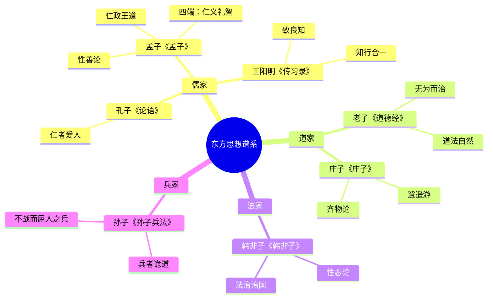
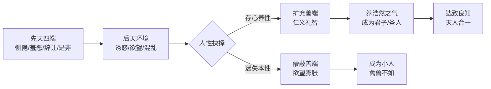
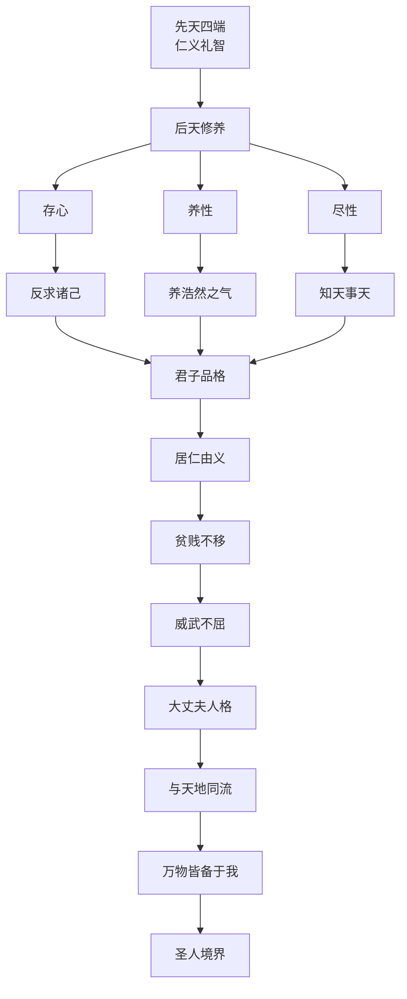
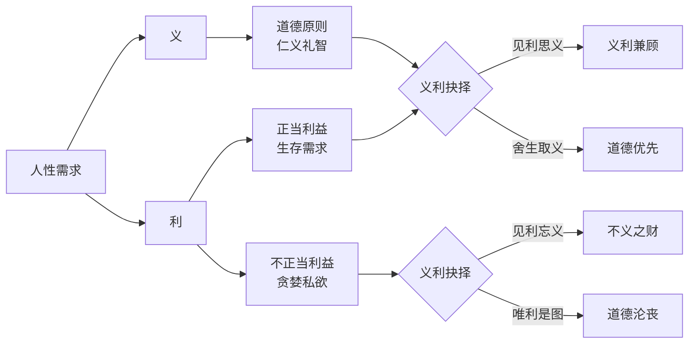
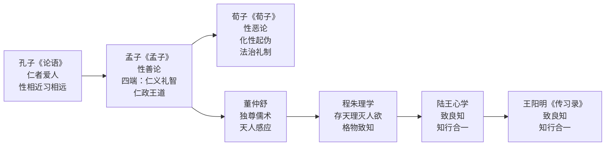

# 《孟子》读书笔记

## 这本书要解决什么问题？

**核心困境**：战国时期，各国争霸，民不聊生。如何拯救这个失序的世界？孟子给出的答案是：人性本善，通过仁政唤醒人心的善意，重建秩序。

**一句话定位**：
> 人性本善，只要唤醒你内心的善意，世界就会好起来。

### 作者站在什么位置说这些话？

| 维度 | 定位 |
|------|------|
| 主领域 | 儒家哲学（政治哲学+伦理学） |
| 跨界领域 | 教育心理学、政治学、管理哲学 |
| 作者背景 | 亚圣，儒家第二位圣人，继承孔子"仁"学思想，周游列国推行仁政 |
| 知识定位 | 儒家哲学的核心人物，性善论和仁政思想的集大成者 |

### 和其他书有什么关系？

| 关联书籍 | 关联关系 | 共同底层逻辑 |
|----------|----------|--------------|
| [[论语-孔子]] | 同学派/继承 | 孔子的"仁"→孟子的"仁政"，孔子的"仁者爱人"→孟子的"性善论" |
| [[道德经-老子]] | 对立观点 | 道家的"道法自然"vs儒家的"性善论"，无为而治vs仁政教化 |
| [[庄子-庄子]] | 对立/互补 | 庄子的"逍遥自由"vs孟子的"性善束缚"，自由精神vs入世责任 |
| [[传习录-王阳明]] | 理论继承 | 王阳明心学继承孟子"性善论"："致良知"vs"扩充四端" |
| [[韩非子-韩非]] | 对立观点 | 法家的"性恶论+法治"vs儒家的"性善论+德治"，法治vs德治 |
| [[孙子兵法]] | 互补视角 | 孙子的"军事战略"vs孟子的"王道政治"，霸道vs王道，以力服人vs以德服人 |

### 知识网络图

---

## 作者的核心论点

### 性善论：孺子将入于井，你的本能是什么？

设想一个场景：你看到一个小孩快掉进井里。你的第一反应是什么？

不是思考，不是计算，不是权衡利弊。你本能地感到惊恐、怜悯，想冲上去救他。

孟子说：这就是"恻隐之心"，证明人性本善。这种反应不需要学习，不需要教导，是先天的。

孟子提出四端体系：

- **恻隐之心** → 仁之端（同情心）
- **羞恶之心** → 义之端（羞耻心）
- **辞让之心** → 礼之端（谦让心）
- **是非之心** → 智之端（辨别心）

"人皆有不忍人之心...无恻隐之心，非人也；无羞恶之心，非人也；无辞让之心，非人也；无是非之心，非人也。"

翻译成大白话：你生来就有善意，只是被欲望蒙蔽了。找回善意，你就能成为好人。

孟子 vs 荀子的根本分歧：

| 维度 | 孟子性善论 | 荀子性恶论 |
|------|------------|------------|
| 人性本质 | 人性本善，四端在心 | 人性本恶，好利欲 |
| 道德来源 | 扩充先天善端 | 后天教育纠正 |
| 教育目的 | 唤醒善端，养浩然之气 | 化性起伪，矫正恶习 |
| 政治主张 | 仁政德治 | 法治礼制 |

性善论的心理机制：

> **性善定律**：人的本性是善良的，恶是由于后天环境和欲望的蒙蔽。道德教育的本质不是从零塑造，而是唤醒先天善端。

这个观点打碎了我对"坏人"的假设。我一直以为有些人天生就是坏人，孟子却说：他们不是天生坏，是后天蒙蔽了善端。下次遇到"坏人"，我不会再想"这人无可救药"，而是想"是什么蒙蔽了他的善端"。

但孟子不只是论证人性善。他把性善论推到了政治领域——如果人性本善，那么统治应该靠什么？不是靠武力，是靠仁义。

### 仁政思想：民为贵，社稷次之，君为轻

梁惠王问孟子："何以利吾国？"

孟子毫不客气："王何必曰利？亦有仁义而已矣！"

你讲什么利益，应该讲仁义！

"民为贵，社稷次之，君为轻。"百姓最重要，国家其次，君主最轻。"得乎丘民而为天子；得乎天子而为诸侯。"

这不是空话。历史给了证明：

- **秦始皇**统一六国靠力，但暴政→秦朝15年灭亡
- **周武王**伐纣靠仁，百姓欢迎→周朝800年
- **英国殖民**日不落帝国靠力，但虐待奴隶→殖民地独立

王道 vs 霸道：

| 维度 | 王道（孟子） | 霸道（现实） |
|------|---------------|---------------|
| 治国方式 | 以德服人 | 以力服人 |
| 百姓态度 | 心悦诚服 | 力不能服 |
| 国家稳固 | 长治久安 | 短暂辉煌 |
| 统治者 | 贤能政治 | 强权政治 |

> **仁政定律**：得民心者得天下，失民心者失天下。统治者的权力来自百姓的认可，而非武力的征服。君主权力 = 百姓认可 + 天命所归，失去民心=失去权力。

以前我总觉得"仁政"太理想化，现实世界靠的是实力。但孟子让我重新看：秦始皇统一六国确实靠力，但15年就亡了。周武王800年。为什么？民心。下次分析一个组织的兴衰，我不会只看它的资源，还会看它是否"得民心"。

但孟子的体系不只关心怎么治国，还关心怎么做人——如何修炼出"大丈夫"的人格。

### 修身哲学：养浩然之气，做大丈夫

孟子的理想人格有三个层次：

- **君子**：居仁由义，修己安人
- **大丈夫**：富贵不能淫，贫贱不能移，威武不能屈
- **圣人**：与天地同流，万物皆备于我

"我善养吾浩然之气。其为气也，至大至刚，以直养而无害，则塞于天地之间。"

什么是浩然之气？正直、正义、无畏，塞于天地之间。不是虚的，是一种真实的人格力量。

"天将降大任于斯人也，必先苦其心志，劳其筋骨，饿其体肤，空乏其身，行拂乱其所为，所以动心忍性，曾益其所不能。"

成功需要熬。苦心志、劳筋骨、饿体肤。天将降大任，必先考验你。

修身的路径：

> **修身定律**：人可以通过后天的修养，将先天的善端扩充至极致，达到与天地同流的圣人境界。先天善端 + 后天修养 = 理想人格。

这打碎了我对"气场"的迷信。我一直以为气场来自外在成就——职位、收入、名气。孟子却说：气场来自内在修养——正直、正义、无畏，塞于天地之间。下次遇到困难觉得自己撑不住，我会想起孟子：天将降大任，必先考验你。成功是熬出来的，气场是可以养的。

不过，修身不只是内在修炼，还涉及面对利益时的选择——义和利，你怎么选？

### 义利之辨：鱼与熊掌不可得兼

"鱼，我所欲也；熊掌，亦我所欲也。二者不可得兼，舍鱼而取熊掌者也。生亦我所欲也；义亦我所欲也。二者不可得兼，舍生而取义者也。"

"王何必曰利？亦有仁义而已矣。"

孟子和告子辩论过人性。告子说"食色性也"——人的本性就是吃饭和繁衍；孟子说"仁义礼智才是人性"——人的本性高于动物本能。

义利关系：

| 维度 | 义（道义） | 利（利益） |
|------|------------|------------|
| 正当利益+道德原则 | 见利思义 | 义利兼顾 |
| 不正当利益+无道德 | 见利忘义 | 道德沦丧 |

> **义利定律**：正当的利益可以追求，但不能违背道义。当义利冲突时，舍生取义是最高境界。

孟子不是说不能赚钱。他说的是：赚钱可以，但不能不择手段。见利思义，义利兼顾，才是君子。当生命和道义冲突时，舍生取义——这是最高境界，也是内心的选择。

以前我总觉得"舍生取义"太极端，现实中谁会遇到这种选择？这个观点打碎了我的假设：义利冲突每天都在发生——要不要作弊、要不要撒谎、要不要踩别人上位。每次选择都在塑造你的人格。下次面临利益诱惑，我不会再问"能不能过关"，而是问"过了关，我还是我吗"。

---

## 这本书的局限

> 孟子的仁政体系有其时代局限，不是所有场景都适用。

| 批评点 | 谁在批评 | 怎么说 | 实际情况 |
|--------|---------|--------|---------|
| 性善论天真 | 荀子、韩非子 | 人性本恶，需要法治约束 | 孟子说的是善的潜能，不是善的现实；但确实对人性过于乐观 |
| 仁政不现实 | 法家、现代政治学 | 在弱肉强食的战国，仁政行不通 | 孟子周游列国未被采纳，本身就是证明；但仁政的长期逻辑成立 |
| 等级观念 | 现代平等主义 | 孟子强调"君子""小人"之分 | 儒家的等级是道德等级，不是出身等级；但确实容易被滥用 |
| 过于理想 | 韩非子 | "以德服人"在现实中效率低 | 法治效率高但人心离散，德治效率低但人心凝聚；需配合使用 |

**一句话总结局限性**：
> 孟子的性善论是道德理想，韩非子的性恶论是政治现实。两者配合——用仁政凝聚人心，用法治约束底线——才是完整的治理体系。

---

## 最值得记住的话

**原书说的**：

1. "民为贵，社稷次之，君为轻。" ——《尽心下》
2. "恻隐之心，仁之端也；羞恶之心，义之端也；辞让之心，礼之端也；是非之心，智之端也。" ——《公孙丑上》
3. "天将降大任于斯人也，必先苦其心志，劳其筋骨，饿其体肤，空乏其身。" ——《告子下》
4. "生，亦我所欲也；义，亦我所欲也。二者不可得兼，舍生而取义者也。" ——《告子上》
5. "我善养吾浩然之气。其为气也，至大至刚，以直养而无害，则塞于天地之间。" ——《公孙丑上》
6. "富贵不能淫，贫贱不能移，威武不能屈，此之谓大丈夫。" ——《滕文公下》
7. "老吾老以及人之老，幼吾幼以及人之幼。" ——《梁惠王上》
8. "虽有智慧，不如乘势；虽有镃基，不如待时。" ——《公孙丑上》

**翻译成人话**：

1. 看到小孩快掉进井里，你的本能是救他。这就是恻隐之心，证明你本性善良。
2. 做领导，讲仁义比讲利益重要。得民心者得天下，失民心者失天下。
3. 想有气场？养浩然之气：正直、正义、无畏，塞于天地之间。
4. 成功需要熬：苦心志、劳筋骨、饿体肤。天将降大任，必先考验你。
5. 赚钱可以，但不能不择手段。见利思义，义利兼顾，才是君子。
6. 当生命和道义冲突，舍生取义。这是最高境界，也是内心的选择。
7. 虽有智慧，不如乘势；虽有工具，不如待时。时机比能力更重要。

---

## 讲给没读过的人听

你有没有想过：人性是善的还是恶的？

2300多年前，孟子给出了一个反直觉的答案：人性本善。

他不是空口说的。他让你设想一个场景：看到一个小孩快掉进井里，你的第一反应是什么？不是思考，不是计算——你本能地感到惊恐，想冲上去救他。

孟子说：这就是"恻隐之心"，证明你本性善良。你的问题不是"缺少善良"，而是"善良被蒙蔽了"。恻隐之心、羞恶之心、辞让之心、是非之心——这四端，你生来就有。

他还说：做领导，讲仁义比讲利益重要。梁惠王问他"怎么让国家获利"，他说"王何必曰利？亦有仁义而已矣"。得民心者得天下。秦始皇靠武力统一六国，15年就亡了。周武王靠仁义伐纣，800年。

他说：想有气场？养浩然之气。正直、正义、无畏，塞于天地之间。天将降大任于你，必先苦心志、劳筋骨、饿体肤。成功是熬出来的。

他说：赚钱可以，但不能不择手段。鱼和熊掌不可得兼时，舍鱼取熊掌；生命和道义不可得兼时，舍生取义。

---

## 用来检验理解的问题

**基础回忆**：

1. Q: 孟子"四端"是什么？
   A: 恻隐之心（仁之端）、羞恶之心（义之端）、辞让之心（礼之端）、是非之心（智之端）。

2. Q: "民为贵，社稷次之，君为轻"什么意思？
   A: 百姓最重要，国家其次，君主最轻。权力来自百姓认可，不是武力征服。

3. Q: "大丈夫"的三个标准是什么？
   A: 富贵不能淫，贫贱不能移，威武不能屈。

**理解验证**：

1. Q: 为什么孟子说"人性本善"，荀子说"人性本恶"？
   A: 孟子说的是善的潜能（四端），荀子说的是恶的现实（好利欲）。两者看的是人性的不同面。

2. Q: "王道"和"霸道"的本质区别？
   A: 王道以德服人，百姓心悦诚服，长治久安；霸道以力服人，百姓力不能服，短暂辉煌。

3. Q: "舍生取义"是不是要求牺牲生命？
   A: 不一定。核心是：当利益和道义冲突时，选择道义。极端情况才是牺牲生命。

**实际应用**：

1. Q: 用孟子的"仁政"思想分析你所在的组织——它靠什么凝聚人心？
   A: 关键步骤：检查组织是"以力服人"还是"以德服人"→检查员工的归属感→问"失去了什么，员工会离开？"

2. Q: 你现在的气场来自什么？是外在标签（职位、收入），还是内在修养（浩然之气）？
   A: 孟子说：外在标签随时可能失去，浩然之气是真正的力量。正直、正义、无畏。

---

## 和其他书的对话

孔子是孟子的思想源头。孔子提出"仁者爱人"，孟子把"仁"扩展成"仁政"。孔子讲个人修养，孟子讲治国理政。孔子说"性相近，习相远"，孟子直接断言"人性本善"。孔子给了方向，孟子建了体系。

老子和孟子是对立的。老子说"道法自然"，人应该顺应天道；孟子说"性善论"，人应该扩充善端。老子主张"无为而治"，让百姓自生自灭；孟子主张"仁政教化"，主动引导百姓向善。一个偏自然，一个偏人文。

庄子和孟子也是对立的。庄子追求"逍遥游"——精神绝对自由，超越世俗；孟子追求"仁义礼智"——入世担当，以天下为己任。庄子说"至人无己"，孟子说"富贵不能淫，贫贱不能移，威武不能屈"。一个出世，一个入世。但两者可以互补：精神困境用庄子，现实困境用孟子。

韩非子是孟子最大的对手。孟子说人性本善，韩非子说人性本恶；孟子主张德治，韩非子主张法治。现实中两者都需要：用仁政凝聚人心，用法治约束底线。德治是上限，法治是下限。

王阳明是孟子的继承者。孟子的"性善论"和"四端"思想，直接影响了王阳明的"致良知"。孟子说"扩充四端"，王阳明说"致良知"；孟子说"万物皆备于我"，王阳明说"心即理"。从孟子到王阳明，儒家心学一脉相承。

孙子讲霸道——以力服人，不战而屈人之兵；孟子讲王道——以德服人，仁政得民心。孙子适合战场，孟子适合治国。但两者可以结合：对外有实力（孙子），对内有仁德（孟子）。

儒家思想的演进：

---

*拆解日期：2026-02-15*
*下次回访：1周后回顾「讲给没读过的人听」和「检验问题」*