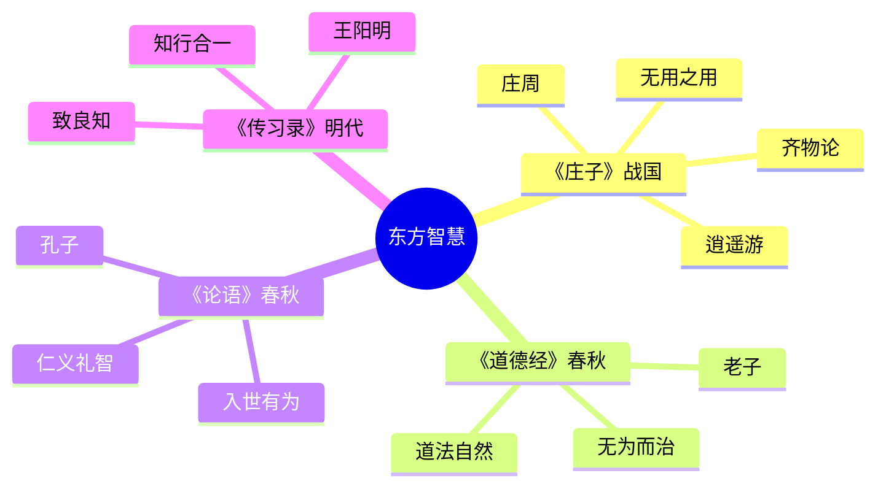
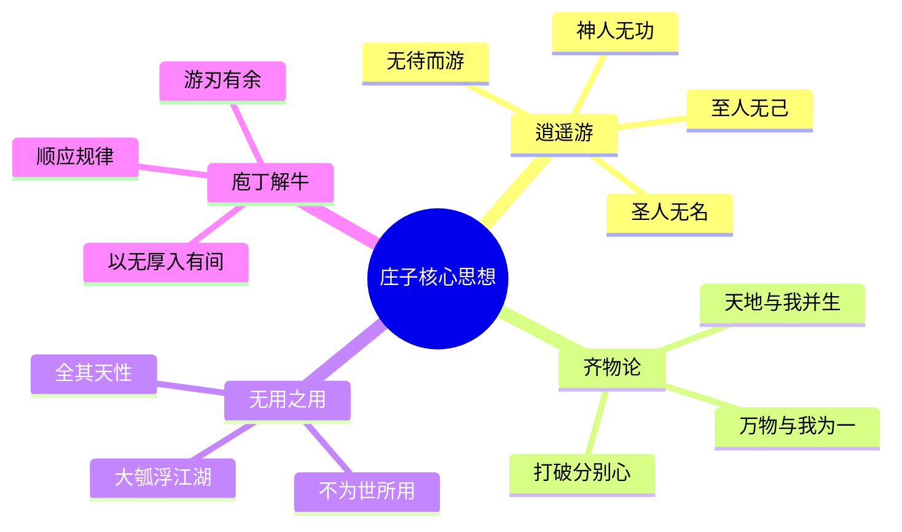

# 《庄子》拆解记录

> **"天地与我并生，万物与我为一"** —— 庄子·齐物论

## 这本书要解决什么问题？

**核心困境**：世俗名利枷锁的束缚、自我与他人的对立冲突、物质追求与精神空虚的矛盾、是非争论带来的精神内耗——这些困境在战国中期就存在，两千多年后依然困扰着现代人。

**一句话定位**：
> 超越外在依赖，实现精神绝对自由。不为世俗价值服务，保留天性，全其本来面目。

### 作者站在什么位置说这些话？

| 维度 | 定位 |
|------|------|
| 主领域 | 道家哲学（与老子并列） |
| 跨界领域 | 精神自由、齐物平等、自然无为 |
| 作者背景 | 庄周（约前369-前286年），战国中期，与孟子同时代。不求仕途，甘愿做漆园小吏，一生贫困却精神富足 |
| 知识定位 | 道家双璧之一，中国浪漫主义文学源头，个人自由哲学的开创者 |

### 和其他书有什么关系？

| 关联书籍 | 关联关系 | 共同底层逻辑 |
|----------|----------|--------------|
| [[道德经-老子-拆解记录]] | 理论继承 | 老子讲"道法自然"，庄子讲"逍遥游"；老子偏政治哲学，庄子偏个人自由 |
| [[论语-孔子-拆解记录]] | 对立互补 | 儒家讲"入世有为"，庄子讲"出世逍遥"；阳与阴的互补 |
| [[传习录-王阳明-拆解记录]] | 精神呼应 | 王阳明的"致良知"与庄子的"坐忘"相通，都追求超越外在束缚 |
| [[心流-契克森米哈赖-拆解记录]] | 跨时空共鸣 | 庄子的"庄周梦蝶"与契克森米哈赖的"自我意识消失"都是超越自我的境界 |
| [[被讨厌的勇气-岸见一郎-拆解记录]] | 自由呼应 | 阿德勒的"活出自己"与庄子的"逍遥游"都追求不被外界评价绑架 |
| [[影响力-西奥迪尼-拆解记录]] | 反向应用 | 西奥迪尼教你如何说服人，庄子教你如何不被说服 |

### 知识网络图

---

## 作者的核心论点

### 逍遥游：从鲲鹏到无待的自由之路

北冥有条鱼叫鲲，不知几千里大。它化成鸟叫鹏，翼若垂天之云，抟扶摇直上九万里。蜩与学鸠笑它："我们飞到榆枋就够啦，何必飞那么远？"

这个开场寓言讲的不只是大小之分。庄子问了一个更根本的问题：你的自由，依赖什么？

鹏飞九万里，但需要六月息（大风）。它飞得再高，还是"有所待"——依赖风力。蜩鸠满足于榆枋，依赖的是小范围的安逸。两者都没达到真正的自由。

真正的自由是什么？庄子给出三层答案：

1. **第一层：蜩鸠层次**——满足于小范围（榆枋之间），眼界小，自由也小
2. **第二层：鹏鸟层次**——能飞九万里，但依赖风力，有所待
3. **第三层：至人神人圣人**——无待而游，不依赖任何外物

"至人无己，神人无功，圣人无名。"翻译成人话：忘掉自己，不追求功利回报，不在乎名声评价。三样都放下，你才可能真正自由。

> **逍遥定律**：自由 = 1 - 外在依赖度。当依赖度为零时，自由达到最大值——无待而游。

这个观点打碎了我对"成功"的假设。我一直以为追求晋升、加薪、名声是正常的，庄子却问：如果这些都没了，你还是谁？你的自由是不是也跟着没了？下次遇到职场焦虑，我不会再问"我够不够努力"，而是问"我的自由依赖什么"。

但庄子知道，外在依赖只是表层问题。更深的困境在于：我们用分别心把世界切割成好坏、美丑、高低——这种切割本身就是烦恼的根源。这把他引向了更根本的一步。

### 齐物论：毛嫱丽姬，鱼鸟各自看

有个问题困扰了庄子很久：为什么人们总是争论不休？

他发现了一个悖论。人觉得毛嫱丽姬美若天仙，但鱼见了深入水底，鸟见了高飞远走。谁的标准是对的？人的？鱼的？鸟的？

答案是：没有标准是对的。标准本身就是问题。

"天地与我并生，万物与我为一。"庄子说：我和万物本质相同，没有高低贵贱。分别心——我们给事物贴标签的行为——才是烦恼根源。

认知有三个陷阱：

1. **以人为中心**——人本位偏见，觉得人觉得美的就是美
2. **以我为中心**——自我中心主义，觉得我觉得对的就是对
3. **以名为标准**——语言概念的虚妄，用标签替代真实

庄子用"朝三暮四"的故事说明：狙公给猴子栗子，说"朝三暮四"，猴子怒；改说"朝四暮三"，猴子喜。名义变了，本质没变。猴子被名义骗了。人也是。

> **齐物定律**：分别心 = 烦恼源。去掉主观标签，万物平等。你的"可以"只是因为你说了"可"，你的"不可"只是因为你说了"不可"。

我以前总觉得政治观点之争、品牌粉丝对立是立场问题，现在意识到这完全错了。庄子让我看到：立场不同是必然的，但非要争个你死我活，是分别心在作祟——我把我的标准当成了唯一真理。

不过，知道了分别心是问题，如何才能放下？庄子给了个很意外的答案：不是靠思想，而是靠行动——找到规律，顺势而为。

### 庖丁解牛：十九年刀刃若新

庖丁给文惠君解牛，刀走如神。文惠君问："你怎么做到的？"

庖丁说："臣之所好者道也，进乎技矣。"他追求的不是技术，是道。刀在牛骨间游走，"以无厚入有间，恢恢乎其于游刃必有余地矣"。

十九年了，刀刃还像新的。为什么？因为他不硬砍骨头，而是找到骨节的缝隙，顺势游走。

技艺有三境界：

1. **初境**——看见全牛，被表象迷惑
2. **中境**——未尝见全牛，看到内部结构
3. **上境**——以神遇不以目视，直觉把握规律

庖丁的秘诀是：不靠蛮力，靠理解规律、找到切入点。"族庖月更刀"（普通厨师每月换刀），是因为硬砍；庖丁十九年不换刀，是因为顺势。

> **游刃定律**：效率 = 对规律的顺应度 ÷ 蛮力的使用度。顺应度越高，蛮力越少，效率越高。

这个观点让我重新理解了"能力"。新手程序员死磕代码，高手理解底层逻辑。庄子说：找到"间"（规律），游刃有余。不是你不够努力，是你在用蛮力而不是顺势。

但顺势不代表放弃。庄子对"不可奈何"的事有另一套智慧——接纳，而不是对抗。

### 安之若命：知其不可奈何而安之若命

"知其不可奈何而安之若命，德之至也。"

翻译：知道有些事无法改变，像接受命运一样接纳，不内耗，这是最高的德。

这不是消极认命。庄子说的是控制二分法：

1. **不可控的**——安之若命（接纳）：生死、时代、出身、他人的评价
2. **可控的**——尽力而为（行动）：当下的选择、自己的反应

很多人35岁焦虑，是因为在与不可控对抗——为什么我老了？为什么行业衰退了？庄子说：这是自然规律，对抗它=内耗。接纳它=转型智慧。

亲人离世、疾病、裁员——悲是自然的，但不与"为什么会这样"对抗。安之若命不是躺平，是停止内耗后，把精力用在能改变的地方。

> **安之若命定律**：心理健康 = 专注当下 - 纠结过去 - 担忧未来。当纠结和担忧为零时，心理健康达到最大值。

以前我遇到挫折总会问"为什么是我"，陷入无尽的自我怀疑。庄子让我看到：这不是命运不公平，而是我在对抗不可控的东西。下次遇到无法改变的事，我不会再内耗纠结"为什么"，而是接纳后马上问"我能做什么"。

但这引出了另一个问题：接纳之后，该如何找到自己的价值？庄子有个反直觉的答案。

### 无用之用：大葫芦做筏子浮江湖

惠子跟庄子抱怨："魏王送我大葫芦种子，长成后装不下水，做瓢又太大，没用，我把它砸了。"

庄子笑了："夫子固拙于用大矣。何不虑以为大樽而浮乎江湖？"

你嫌它装不下水，是因为你只想让它装水。换个场景——做筏子浮江湖——无用变成大用。

"人皆知有用之用，而莫知无用之用也。"

价值有三维度：

1. **世俗之用**——满足当前需求（装水）
2. **本性之用**——保留自身完整（做筏子）
3. **无用之用**——不迎合，得自由（不被工具化）

庄子说：惠子的问题不是葫芦没用，是他只想让葫芦服务于世俗需求（装水）。如果葫芦不装水，保持完整，反而可以浮江湖。

人也是。热门行业=有用之用（易被替代）；冷门特长=无用之用（可能成大师）。内向=不善社交？不=善于独处思考。

> **无用之用定律**：价值 = 场景匹配度 × 天性保留度。换场景，无用变有用；保留天性，才是真正的价值。

这打碎了我对"核心竞争力"的迷信。我一直以为要追逐热门、成为"有用的人"，庄子却问：当热门变冷门，你的价值还在吗？下次面临"要不要转型"的抉择，我不会再问"哪个行业热门"，而是问"我的天性在哪个场景能发光"。

---

## 这本书的局限

> 庄子的逍遥游是对战国乱世的一种精神逃离，这套智慧有它的边界。

| 批评点 | 谁在批评 | 怎么说 | 实际情况 |
|--------|---------|--------|---------|
| 过度出世 | 儒家学者 | "知其不可奈何而安之若命"是消极逃避，应该"知其不可而为之" | 庄子不是放弃，是区分可控与不可控；但确实容易被误解为躺平 |
| 不够实操 | 现代读者 | 寓言太抽象，职场中怎么"逍遥游"？ | 原则可借鉴，但需要自己翻译成行动 |
| 否定价值判断 | 哲学界 | "齐物论"否定是非标准，会导致道德相对主义 | 庄子说的是"标准是主观的"，不是"没有标准"；但确实容易滑向相对主义 |
| 难以证伪 | 科学视角 | "至人无己"等境界无法用科学方法验证 | 灵修哲学重体验，非实证科学 |

**一句话总结局限性**：
> 庄子的智慧最适合精神困境（焦虑、内耗、比较），但面对现实困境（贫穷、疾病、压迫），需要儒家的入世力量配合。

---

## 最值得记住的话

**原书说的**：

1. "至人无己，神人无功，圣人无名。" ——《逍遥游》
2. "天地与我并生，万物与我为一。" ——《齐物论》
3. "举世誉之而不加劝，举世非之而不加沮，定乎内外之分，辩乎荣辱之境。" ——《逍遥游》
4. "以无厚入有间，恢恢乎其于游刃必有余地矣。" ——《养生主》
5. "知其不可奈何而安之若命，德之至也。" ——《人间世》
6. "人皆知有用之用，而莫知无用之用也。" ——《人间世》
7. "相濡以沫，不如相忘于江湖。" ——《大宗师》
8. "吾生也有涯，而知也无涯。以有涯随无涯，殆已。" ——《养生主》
9. "夏虫不可以语于冰者，笃于时也。" ——《秋水》
10. "君子之交淡如水，小人之交甘若醴。" ——《山木》

**翻译成人话**：

1. 忘掉自己，不追求功名，不在乎评价——这才是真自由
2. 我和万物一样，没有高低——分别心是烦恼根源
3. 全世界夸我不更努力，全世界骂我不更沮丧——内外分明
4. 找到规律顺势而为，不要蛮力硬砍——游刃有余
5. 不可控的事接纳它，不内耗——这是最高德行
6. 没人看上的东西，换个场景可能是宝贝——无用之用
7. 互相依赖不如各自逍遥——相忘于江湖
8. 生命有限知识无限，追不完——承认局限
9. 夏天的虫不懂冰，因为它活在那个时间维度里——标准不同
10. 淡的交情长久，浓的交情短暂——君子之交

---

## 讲给没读过的人听

你有没有发现，你总是焦虑？

庄子两千年前就问了：你的焦虑来自什么？是不是因为你追求的东西（晋升、加薪、名声）一旦没了，你就觉得自己完了？是不是因为你总是跟别人比较，觉得别人比你强？是不是因为你总在想"应该这样""不应该那样"？

庄子说：这些烦恼，都来自你的"有所待"——你依赖外物。鹏飞九万里，还要靠风力；你追求成功，要靠老板认可。都不是真自由。

真正的自由是"无待而游"——忘掉自己，不追求功利，不在乎名声。这三样都放下，你才可能真正自由。

庄子还说：你跟别人争论，是因为你觉得你的标准是对的。但庄子问：鱼觉得水好，人觉得火暖，谁的标准是对的？没有标准是对的，标准本身就是问题。去掉分别心，万物平等。

庄子教庖丁解牛：不要硬砍骨头，找到骨节的缝隙顺势游走。十九年刀刃还像新的。不是你不够努力，是你在用蛮力。

庄子还说：有些事不可奈何——年龄、时代、别人的评价——接纳它，不内耗。安之若命不是躺平，是把精力用在能改变的地方。

庄子甚至说：不要追求"有用"。惠子嫌大葫芦没用砸了，庄子说：做筏子浮江湖啊。换场景，无用变成大用。你的"缺点"，换个场景可能是优点。

---

## 用来检验理解的问题

**基础回忆**：

1. Q: "逍遥游"的三层自由是什么？
   A: 蜩鸠（小范围安逸）、鹏鸟（有所待）、至人神人圣人（无待而游）。

2. Q: "至人无己，神人无功，圣人无名"什么意思？
   A: 忘掉自己，不追求功利回报，不在乎名声评价。

3. Q: "齐物论"的核心观点是什么？
   A: 分别心是烦恼根源。去掉主观标签，万物平等。

**理解验证**：

1. Q: 为什么鹏鸟飞九万里还不是真自由？
   A: 它依赖风力，有所待。真正的自由是无待。

2. Q: 庖丁十九年刀刃若新，秘诀是什么？
   A: 以无厚入有间，找到骨节缝隙顺势游走，不蛮力硬砍。

3. Q: "安之若命"和躺平的区别？
   A: 安之若命是区分可控与不可控，接纳不可控，专注可控。躺平是对可控的也放弃。

**实际应用**：

1. Q: 你现在的焦虑，依赖什么外物？如果这些外物没了，你还是谁？
   A: 关键步骤：列出依赖项→问"没了之后我是谁"→思考如何无待。

2. Q: 最近一次争论，你的标准和对方的标准是什么？用齐物论重新看。
   A: 关键：承认标准不同是必然的，不把我的标准当成唯一真理。

---

## 和其他书的对话

老子是庄子的思想源头。老子讲"道法自然"，庄子把"自然"具体化成个人自由的追求。老子偏宇宙论（"道生一，一生二"），庄子偏人生论（"天地与我并生"）。老子的"见素抱朴"变成庄子的"无用之用"——不为世俗价值服务，保留天性。

孔子和庄子是阴阳两极。儒家说"知其不可而为之"，道家说"知其不可奈何而安之若命"。儒家追求立德立功立言，庄子说"至人无己，神人无功，圣人无名"。一个入世，一个出世。但你可能需要两者配合：现实困境用儒家，精神困境用庄子。

芒格和庄子都在打破单一视角。芒格攒了100多个多元思维模型，遇到问题就拿不同武器；庄子用齐物论打破是非、美丑、高下的分别。一个是认知工具箱，一个是认知哲学。芒格用实验方法，庄子用寓言方法。

契克森米哈赖和庄子跨越两千年的共鸣。庄子的"庄周梦蝶"是物我两忘；契克森米哈赖的"自我意识消失"是心流状态。东方讲"无为"，西方讲"最优体验"。两者都指向同一个境界：超越自我的那一刻，最愉悦。

西奥迪尼教你如何说服人，庄子教你如何不被说服。西奥迪尼研究互惠、承诺一致、社会认同——人类心理弱点如何被利用；庄子说"举世誉之而不加劝，举世非之而不加沮"——不被外界评价绑架。《影响力》是进攻，《庄子》是防守。

---

*拆解日期：2026-02-14*
*下次回访：1周后回顾「讲给没读过的人听」和「检验问题」*