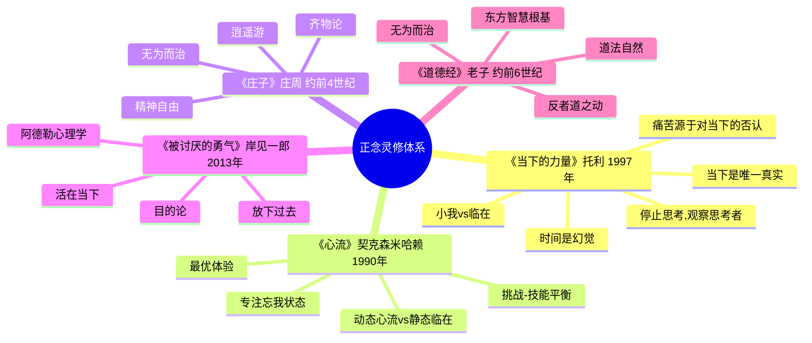

# 《当下的力量》读书笔记

> **"当下是唯一真实的存在。过去是记忆,未来是想象,只有此刻是真实的。"** —— 埃克哈特·托利

## 这本书要解决什么问题？

**核心困境**：我们的大脑总是活在"过去"和"未来"，从不肯活在"当下"。我们用过去的创伤定义自己，用未来的担忧消耗能量，结果就是——痛苦。托利问：如果时间只是幻觉，当下是唯一的真实，会怎样？

**一句话定位**：
> 你不等于你的思维,你就是那个"观察思维"的意识——当思维停止,你才真正活着。

### 作者站在什么位置说这些话？

| 维度 | 定位 |
|------|------|
| 主领域 | 灵修、正念、非二元哲学 |
| 跨界领域 | 心理学(创伤疗愈)、哲学(存在主义)、脑科学(意识研究) |
| 作者背景 | 埃克哈特·托利(Eckhart Tolle, 1948-)，29岁抑郁濒死体验后觉醒,无正式宗教训练,自称"开悟" |
| 知识定位 | 现代灵修经典,连接东方智慧与西方心理学的桥梁 |

### 和其他书有什么关系？

| 关联书籍 | 关联关系 | 共同底层逻辑 |
|----------|----------|--------------|
| [[心流-契克森米哈赖]] | 互补视角 | 心流(专注活动) vs 临在(专注存在)——都是"忘我"状态,但动态vs静态 |
| [[庄子-庄子]] | 哲学呼应 | 逍遥游(精神自由) ≈ 临在(当下意识)——超越外在依赖 |
| [[被讨厌的勇气-岸见一郎]] | 应用互补 | 目的论(活在当下) ≈ 临在(觉察当下)——放下过去,活出自我 |
| [[道德经-老子]] | 智慧呼应 | 道法自然(顺应规律) ≈ 临在(接纳当下)——不对抗,顺应 |
| [[思考快与慢]] | 对立互补 | 系统2慢思考 vs 停止思维——理性分析vs直觉觉察 |

### 知识网络图

---

## 作者的核心论点

### 时间是幻觉，当下是唯一的真实

托利29岁时持续焦虑，陷入自杀式抑郁。某夜醒来，内心极度恐惧，一个声音在说"I can't live with myself any longer"。

突然他停住了。等等——"I cannot live with myself"？如果我不能和自己一起生活，那必须有两个我："I"和"myself"。

哪个是真的？

那一刻他领悟了："I"是观察者，"myself"是思维。思维不是"我"。

这个觉醒瞬间改变了他的人生。他后来描述：意识从思维中抽离，进入一种深沉的宁静。

托利问：你有没有发现，你的脑子从来不停？总在想过去、担心未来？就像看电影时只看这一帧，不会同时看上一帧和下一帧。生命也一样，当下这帧是唯一真实的。过去已逝，未来未到。但你的思维总在时间线里跑，从不肯停在当下。

时间幻觉模式 vs 当下临在模式：

| 时间幻觉模式 | 当下临在模式 |
|------------|------------|
| 时间线思维：活在过去/未来 | 当下觉察：只关注此刻 |
| 记忆驱动：用过去定义自己 | 观察者模式：观察思维,不认同思维 |
| 焦虑循环：担心未来,后悔过去 | 接纳当下：接纳此刻,无论好坏 |
| 痛苦产生：抗拒当下=痛苦 | 痛苦消融：接纳当下=平静 |

> **托利定律**：痛苦不是来自当下,而是来自对当下的抗拒。时间=思维创造的幻觉，当下=唯一真实的存在。

我以前总觉得焦虑是正常的，是"我在为未来做准备"。现在意识到这完全错了。托利让我看到：未来是思维制造的幻觉，我此刻依然是完整的。下次遇到焦虑，我不会再问"未来怎么办"，而是问"此刻我有什么问题"——通常答案是"没有"。

但托利知道，理解"当下"只是第一步。更关键的问题是：为什么我们总是抗拒当下？痛苦到底怎么产生的？

### 痛苦源于对当下的否认

牙痛的时候，你越抗拒越疼。你完全接纳它，它就只是"痛觉"这个感觉。

堵车的时候，你越愤怒越痛苦。你接纳它，就只是"车不动"这个情境。

托利的洞见是：负面情绪本身不是问题，问题是我们认同情绪，把情绪当作"我"。

负面情绪的来源：

- **焦虑** = 对未来的恐惧
- **抑郁** = 对过去的执念
- **愤怒** = 对当下的抗拒
- **内疚** = 对过去的后悔

痛苦公式：痛苦 = 情境 × 抗拒度。抗拒度=0，痛苦=0；抗拒度=1，痛苦=100%。

解脱公式：自由 = 情境 × 接纳度。接纳度=100%，痛苦消融为经验。

> **痛苦消融定律**：痛苦是对当下的抗拒,而非当下本身。完全接纳此刻,无论痛苦或愉悦,痛苦会转化为平静的经验。

这个观点打碎了我对"负面情绪"的假设。我一直以为愤怒、焦虑、抑郁是问题，要消灭它们。托利却说：情绪只是流经你的能量,你不等于情绪。你可以只是"观察到有愤怒在体内流动"，而不是"我很生气"。

但为什么我们这么容易认同情绪？托利说，因为有个叫"小我"的东西在不断制造需求。

### 超越小我，连接本体存在

你脑子里那个喋喋不休的声音，不是你。

托利称之为"小我"——大脑中那个需要"认同"才能存活的声音。它永不满足，总需要"更多"、"更好"、"不同"。它用过去定义自己，用未来寻求满足。它害怕死亡，因为小我就是思维，而思维终将消失。

临在是什么？"观察小我"的那个意识。不依赖任何思维/记忆/身份。完全活在这一刻。平静、稳定、永恒。

小我的特征：

| 特征 | 表现 | 能量状态 |
|------|------|----------|
| 需要认同 | "我是..."、"我需要..." | 高消耗 |
| 依赖时间 | "我过去..."、"我将来..." | 高消耗 |
| 永不满足 | "我要更多"、"我要更好" | 高消耗 |
| 害怕死亡 | 小我=思维，临在=思维消失 | 恐惧驱动 |

临在的特征：

| 特征 | 表现 | 能量状态 |
|------|------|----------|
| 不需要认同 | 只是观察,不评判 | 低消耗 |
| 活在当下 | "此刻我感到..." | 低消耗 |
| 知足 | "此刻已足够" | 低消耗 |
| 不怕死亡 | 临在=意识永恒,不依赖形式 | 平静 |

> **小我悖论定律**：小我越被认同,越强大;不被认同,就消散。你不是你的思维/情绪/身体,你是那个"觉察"的意识。

托利的练习很简单：

- **觉察思维**：像看云一样看思想飘过
- **身体扫描**：感受身体的感觉,而非思维
- **深度倾听**：完全专注听,不思考回应
- **日常行动**：洗碗时,只感知水流+温度,不思考其他

这打碎了我对"自我"的假设。我一直以为脑子里的声音就是"我"，托利却说：那个声音只是"小我"，真正的你是观察它的意识。下次听到脑子里那个声音说"我需要这个才能快乐"，我会停一下，问自己："这是小我在说话，还是临在？"小我永远说"我需要"，临在永远说"此刻已足够"。

---

## 这本书的局限

> 托利的灵修体系有其边界，不是万能药。

| 批评点 | 谁在批评 | 怎么说 | 实际情况 |
|--------|---------|--------|---------|
| 闭系统 | 学术批评 | 自我封闭的信念系统,任何批评都被强化 | 体验验证重于理论解释，但确实难以反驳 |
| 否定负面情绪 | 心理学家 | 将愤怒/焦虑都视为"小我",忽视其适应性功能 | 托利说"情绪本身不坏,认同才是问题"，但容易被误解 |
| 不可证伪 | 科学哲学 | 波普尔式批评：无法科学证伪,如占星术 | 灵修重实用,非科学理论，但确实缺乏实证支持 |
| 概念混淆 | 哲学界 | "小我"定义模糊,混用不同哲学传统 | 实用主义重于逻辑严谨性，但概念确实不够清晰 |

**一句话总结局限性**：
> 托利的方法最适合精神困境（焦虑、内耗、创伤），但面对现实困境（贫穷、疾病、压迫），需要行动派的智慧配合。

---

## 最值得记住的话

**原书说的**：

1. "Realize deeply that the present moment is all you have. Make the NOW the primary focus of your life."（深刻意识到当下是你拥有的一切。让当下成为你生活的焦点。）
2. "Time isn't precious at all, because it is an illusion."（时间根本不珍贵,因为它是幻觉。）
3. "The primary cause of unhappiness is never the situation but your thoughts about it."（不幸福的主要原因从来不是情境,而是你对情境的思考。）
4. "Suffering is caused by resisting what is."（痛苦是由抗拒现状造成的。）
5. "You are not your mind, you are the awareness watching the mind."（你不是你的思维,你是那个观察思维的意识。）
6. "The moment you become aware of your ego, you are no longer the ego."（当你觉察到小我的那一刻,你就不再是小我。）
7. "Accept - then act. Whatever the present moment contains, accept it as if you had chosen it."（接纳——然后行动。无论当下包含什么,接纳它,就像是你选择的一样。）

**翻译成人话**：

1. 时间就像电影,你只能看这一帧,不能同时看上一帧和下一帧。生命也一样,当下这帧是唯一真实的。
2. 那个在你脑海里喋喋不休的声音,不是你——你是那个"听到声音"的人。
3. 你不会因为停止思考就死掉,相反,你只会第一次真正活着。
4. 痛苦不是因为当下糟糕,而是因为你抗拒当下。
5. 牙痛时,你越抗拒越疼;你完全接纳它,它就只是"痛觉"这个感觉。
6. 小我就像个需要认同才能活着的寄生虫——你不喂养它(不认同),它就饿死。
7. 焦虑就是思维用过去吓唬你,用未来恐吓你。
8. 临在就是:洗碗时,只感受水流和温度,不思考"今天还有什么任务"。

---

## 讲给没读过的人听

你有没有发现,你的脑子永远停不下来？总是在想过去、担心未来？

托利也一样。他29岁时抑郁到想自杀。但就在那个绝望的夜晚,他突然领悟了一件事:"我不能和自己一起生活"——如果我不能和自己一起生活,那必须有两个我。一个是"我",一个是"自己"。

哪个是真的？他发现:"我"是观察者,"自己"是思维。思维不是"我"。

那一刻他觉醒了。意识从思维中抽离,进入一种深沉的宁静。

托利说:时间是思维的创造物。过去是记忆,未来是想象,只有当下是真实的。你越活在过去和未来,越错过当下这个最珍贵的东西。

他还说:痛苦不是来自当下,而是来自对当下的抗拒。牙痛时,你越抗拒越疼;你接纳它,它就只是"痛"这个感觉。堵车时,你越愤怒越痛苦;你接纳它,就只是"车不动"这个情境。

他说:你脑子里那个喋喋不休的声音叫"小我",它需要你的认同才能活着。你不认同它,它就饿死。你不需要消灭它,你只需要停止认同它——就像看着一个无聊的室友叨叨,你不用赶走它,也不用跟它聊天,就让它说,你继续做你的事。

---

## 用来检验理解的问题

**基础回忆**：

1. Q: 托利的觉醒瞬间发生了什么？
   A: 他意识到"I can't live with myself"意味着有两个我——"I"(观察者)和"myself"(思维)。思维不是"我"。

2. Q: 为什么时间是幻觉？
   A: 时间是思维的创造物。过去是记忆,未来是想象,只有当下是可感知的真实。

3. Q: "小我"和"临在"的区别是什么？
   A: 小我是那个喋喋不休的思维,需要认同才能存活;临在是观察小我的意识,不依赖任何外在。

**理解验证**：

1. Q: 为什么痛苦 = 情境 × 抗拒度？
   A: 痛苦不是来自情境本身,而是来自对情境的抗拒。接纳度=100%时,痛苦消融为经验。

2. Q: "觉察思维"和"停止思维"的区别？
   A: 觉察是看着思维飘过,不认同它;停止思维是让思维消失。觉察是第一步,停止是结果。

3. Q: 小我最怕什么？
   A: 小我最怕"不存在"——所以它总制造危机,让你需要它。但你不认同它,它就消散。

**实际应用**：

1. Q: 下次焦虑时,用托利的方法怎么处理？
   A: 关键步骤：觉察"我在焦虑"→问"这是小我还是临在"→接纳此刻,不抗拒→焦虑消融。

2. Q: 洗碗的时候,什么是"临在"的状态？
   A: 只感受水流和温度,不思考"今天还有什么任务"。全然在当下这个动作里。

---

## 和其他书的对话

契克森米哈赖和托利都在研究"忘我"。契克森米哈赖的"心流"是动态忘我——专注活动中，技能与挑战匹配时，自我意识消失；托利的"临在"是静态忘我——觉察存在中，观察思维而不认同。心流适合工作、运动、创作；临在适合等待、休息、独处。两者结合，动静皆可活在当下。

庄子两千年前的"坐忘"和托利的"临在"异曲同工。庄子说"堕肢体，黜聪明，离形去知，同于大通，此谓坐忘"；托利说"停止思考，观察思考者"。东方用寓言表达，西方用对话体。庄子的"逍遥游"是超越外在依赖；托利的"临在"是超越小我。智慧相通，表达不同。

阿德勒的"目的论"和托利的"活在当下"形成共鸣。阿德勒说：过去无法改变，但你可以改变对过去的目的；托利说：过去只是幻觉，不值得认同。阿德勒更社会性——活在关系中的当下；托利更精神性——独处中的当下。两者结合：既活在关系又活在觉察。

老子的"无为"是托利"停止思维"的东方源头。老子说"致虚极，守静笃"；托利说"觉察当下，观察思维"。《道德经》偏宇宙论，"反者道之动"；《当下的力量》偏实践指导。托利将东方智慧翻译成西方可操作的方法。

卡尼曼和托利是对立的。卡尼曼研究思维机制——系统1和系统2怎么运作，如何优化慢思考；托利说要停止思维——你不是你的思维，超越它。卡尼曼教你如何更好地"使用"思维；托利教你如何"超越"思维。两者结合：既善用思维，又不被思维奴役。

---

*拆解日期：2026-02-15*
*下次回访：1周后回顾「讲给没读过的人听」和「检验问题」*