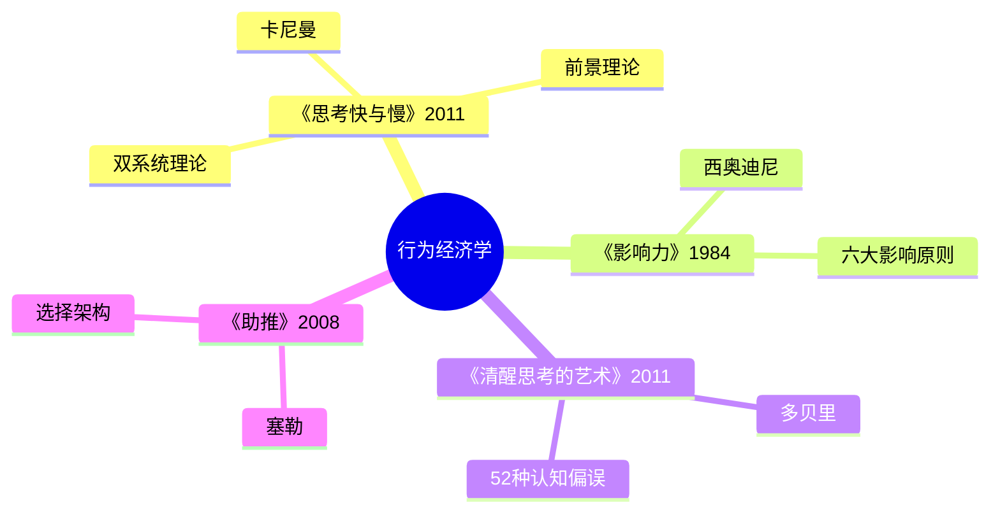

# 《思考，快与慢》拆解记录

## 这本书要解决什么问题？

**核心困境**：人类总以为自己是理性的，但90%的决策由直觉完成。为什么我们明知正确的事却做不到？为什么投资总是"赚小亏大"？为什么事后总觉得自己"早就知道"？

**一句话定位**：
> 你的大脑里有两个人在打架——一个快、一个慢。快的那个总是赢，但赢的代价是错误。

### 作者站在什么位置说这些话？

| 维度 | 定位 |
|------|------|
| 主领域 | 认知心理学 |
| 跨界领域 | 行为经济学、决策科学、神经科学 |
| 作者背景 | 2002年诺贝尔经济学奖得主（作为心理学家获经济学奖），行为经济学奠基人，与特沃斯基共同创立"前景理论" |
| 历史语境 | 2011年出版，改变了经济学"理性人"假设的基石 |

### 和其他书有什么关系？

| 关联书籍 | 关联关系 | 共同底层逻辑 |
|----------|----------|--------------|
| [[影响力-西奥迪尼-拆解记录]] | 理论互补 | 系统1易被6大原理影响，系统2可识别防御 |
| [[清醒思考的艺术-多贝里-拆解记录]] | 理论到应用 | 卡尼曼提供理论框架，多贝里提供52偏误清单 |
| [[穷查理宝典-拆解记录]] | 方法论互补 | 多元思维模型 vs 双系统理论 |
| [[非对称风险-塔勒布-拆解记录]] | 风险认知 | 损失厌恶与切身利益的关联 |
| [[助推-理查德·塞勒-拆解记录]] | 延伸应用 | 基于卡尼曼理论的选择架构设计 |

### 知识网络图

---

## 作者的核心论点

### 双系统理论——你的脑子里住着两个人

看一张愤怒的脸，你立刻知道她生气了——这是系统1。计算17×24，你需要停下来慢慢算——这是系统2。点菜时点了太多吃不完——系统1的冲动。如果让你慢慢规划，别人都吃完走了——系统2的迟缓。

系统1像24小时在线的自动驾驶，快速、无意识、依赖直觉。系统2像懒惰的司机，费力、缓慢、有意识、依赖逻辑。问题在于：系统2经常"罢工"，让系统1接管了方向盘。

| 系统1（快思考） | 系统2（慢思考） |
|----------------|----------------|
| 自动、快速、无意识 | 费力、缓慢、有意识 |
| 依赖直觉和情感 | 依赖逻辑和推理 |
| 24小时在线 | 懒惰，经常"罢工" |
| 容易出错 | 相对准确但耗能 |

系统互动的机制其实不复杂。正常情况下，系统1持续运行，提供直觉和印象，系统2处于放松状态，接受系统1的建议然后行动。但当系统1遇到困难时，会向系统2求助，系统2被激活，仔细分析后修正决定。

系统2为什么懒惰？脑力资源有限，血糖消耗大；进化选择的是"够用"而非"完美"；多数情况下系统1足够应付。

> **卡尼曼定律**：系统1主导日常决策，系统2仅在必要时被激活。由于系统2懒惰，多数决策（约90%）由系统1完成——包括很多"重要决策"。

用大白话说就是：你以为自己在"思考"，其实你在"反应"。大多数决定都是直觉自动完成的，理性只是偶尔来"签到"。

我以前总后悔自己做冲动决定，现在意识到这完全不是"不够聪明"的问题——是系统1在自动驾驶。下次遇到重要决定，我不会再问"我够不够理性"，而是问"系统2上线了吗？"

但这还没完，系统1的自动驾驶只是问题的开始——更糟糕的是，它还会扭曲我们对得失的判断。

---

### 损失厌恶——亏100的痛苦=赚250的快乐

股市里有个怪现象：股票涨了10%赶紧卖，"落袋为安"；股票跌了50%死扛，"等它涨回来"。结果：赚小钱、亏大钱。丢100块的痛苦，远大于捡到100块的快乐。面对收益时规避风险，面对损失时追求风险。

卡尼曼的前景理论揭示了背后的机制。价值函数有三个关键特征：收益区域是凹函数，导致风险规避；损失区域是凸函数，导致风险追求；参照点不对称，损失曲线更陡峭。

损失厌恶系数约为2-2.5倍。这意味着亏100元的痛苦，需要赚200-250元才能抵消。这不是心态问题，是人性的出厂设置。

> **损失厌恶定律**：人类对损失的敏感度远高于对收益的敏感度（约2-2.5倍），这导致我们在面对收益时规避风险，面对损失时追求风险。

亏100的痛苦，是赚100快乐的2.5倍。这不是心态问题，这是人性的出厂设置。

这个观点打碎了我的一个假设。我一直以为股票"赚小亏大"是自己心态不好，现在发现是损失厌恶在起作用——我的大脑把亏钱的痛苦放大了2.5倍。下次投资时，我不会再问"心态够不够好"，而是预设止损点写在纸上，用系统对抗人性。

有了损失厌恶，还需要理解另一个更隐蔽的心理陷阱——第一印象如何绑架我们的判断。

---

### 锚定效应——第一印象决定一切

有个神奇的实验：问问题1"甘地去世时比144岁大还是小？"，再问问题2"甘地去世时多少岁？"结果受144这个"锚"影响，人们给出的答案偏高。商家标高原价，打折后你觉得便宜；谈判时先开高价的人占优势；房产中介先带你去看贵的房子。

锚定效应的机制是系统1自动激活相关联想，后续判断围绕锚点调整，但调整永远不充分。关键洞察：锚点可以是完全无关的随机数字；即使知道锚定效应存在，也会被影响；系统1自动进行"调整"，但调整永远不充分。

> **锚定效应定律**：第一眼看到的信息会成为"锚"，后续判断不自觉地围绕这个锚进行调整，且调整永远不充分。

你脑子里有个秤，但砣是别人放的。你以为在称重，其实在围着别人的砣打转。

下次遇到砍价场景，我不会再让对方先报价——我要先开价。因为第一眼看到的信息会成为锚，我要做那个放砣的人。

这引出了另一个问题——锚定效应让我们被当下信息绑架，而还有一种偏误让我们被过去绑架。

---

### 后见之明——你的记忆会骗你

"2020年我就说这只股票会涨"、"当年我就看好这个行业"、"我就知道会这样"。这些话很常见，但心理真相是：事情发生后，大脑自动修改记忆，让你觉得自己"早就知道"，其实当时你并没有那么确定。

后见之明的危害：让人高估自己的预测能力，导致过度自信，阻碍从错误中学习。事件发生前你的预测不确定，事件发生后大脑重构记忆，你"记得我早就知道"，过度自信让你下次预测更大胆。

> **后见之明定律**：人类大脑倾向于在事后修改记忆，让自己觉得"早就知道"结果，这导致我们高估自己的预测能力。

你以为的"我就知道"，其实是大脑在骗你。如果真的知道，你早就行动了。

下次听到自己说"我就知道会这样"，我会停下来问：我真的知道吗？还是大脑在骗我？如果真的知道，我应该记下预测，用数据说话。

锚定效应和后见之明，都在扭曲我们对当下的判断。但这还只是硬币的一面，另一面是我们在面对风险时的系统性错误。

---

### 前景理论——人不是理性的

经典问题：问题A，确定得100万，vs 50%概率得200万；问题B，确定亏100万，vs 50%概率亏200万。大多数人选择：问题A选确定得100万（风险规避），问题B选50%概率亏200万（风险追求）。同样的概率，面对收益和损失时选择相反。

前景理论的四象限决策模式：高概率收益时风险规避，落袋为安；低概率收益时风险追求，买彩票；高概率损失时风险追求，孤注一掷；低概率损失时风险规避，买保险。

> **前景理论定律**：人们对收益和损失的决策不对称——面对收益时风险规避，面对损失时风险追求；对损失的敏感度远高于收益。

人不是理性的计算器，人是情绪的动物。收益时想"落袋为安"，亏损时想"赌一把"。

这打碎了我对"理性决策"的迷信。以前我总以为投资失败是自己不够冷静，现在发现人类大脑天生就不是理性计算器——面对收益时天然想"落袋为安"，面对亏损时天然想"赌一把"。下次做决策，我不会再说"要理性"，而是先问自己："我现在是在面对收益还是损失？"

---

## 这本书的局限

| 批评点 | 谁在批评 | 怎么说 | 实际情况 |
|--------|---------|--------|---------|
| 可重复性危机 | 心理学界 | 书中引用的研究12%-46%可复制 | 启动效应研究结果存疑，但核心理论经受检验 |
| 系统分类过于简化 | 部分学者 | 实际上大脑有多重系统，不是只有两个 | 卡尼曼回应：这是"有用的简化模型" |
| 跨文化适用性 | 跨文化研究者 | 大部分实验基于西方受试者 | 不同文化背景的人，偏误表现可能不同 |
| 书太长太复杂 | 普通读者 | 500页，不适合快速阅读 | 核心理论有价值，但需要简化版 |
| 效应规模问题 | 统计学家 | 许多"显著"效应实际影响很小 | 相关系数r=0.09，效应确实有限 |

**一句话总结局限性**：
> 核心理论（双系统、损失厌恶、前景理论）经受住检验，部分案例需重新审视。

---

## 最值得记住的话

**原书说的**：
1. "认识自己的局限，是智慧的开始。"
2. "你的大脑比你想象的更懒惰，也更不可靠。"
3. "丢100块的痛苦，需要捡200-250块才能抵消。"
4. "智慧不是没有偏误，而是知道偏误在哪里，然后绕开它。"
5. "当我们跳到结论，得出完整条理的故事时，我们对自己的感觉过于自信。"

**翻译成人话**：
1. 你脑子里住着两个人——一个快，一个慢
2. 90%的决策由系统1完成——包括很多"重要决策"
3. 亏100的痛苦，是赚100快乐的2.5倍
4. 你脑子里有个锚，但砣是别人放的
5. 你以为的"我就知道"，其实是大脑在骗你
6. 人不是理性的计算器，人是情绪的动物
7. 收益时想"落袋为安"，亏损时想"赌一把"
8. 知道偏误在哪里，是克服它的第一步
9. 你不能重装大脑，但可以学会打补丁

---

## 讲给没读过的人听

你以为自己在"思考"，其实你在"反应"。

你的大脑里有两个人在打架：一个叫系统1，他反应快、直觉强、但总犯错；一个叫系统2，他反应慢、逻辑强、但总睡觉。悲剧是：你大部分时间都在听系统1的。

卡尼曼做过一个实验：问人们球拍和球共卖1.10美元，球拍比球贵1.00美元，球多少钱？大多数人直觉回答0.10美元——错了，正确答案是0.05美元。系统1接管了思考，系统2还在睡觉。

更可怕的是损失厌恶。亏100块的痛苦，需要赚200-250块才能抵消。所以你股票赚一点就跑（风险规避），亏很多还死扛（风险追求）。这不是心态问题，是出厂设置。

下次做重要决定，问自己一个问题：系统2上线了吗？

---

## 用来检验理解的问题

**基础回忆**：
1. Q: 系统1和系统2有什么区别？
   A: 系统1快速、自动、无意识；系统2缓慢、费力、有意识。系统2懒惰，经常"罢工"。

2. Q: 损失厌恶系数是多少？
   A: 约为2-2.5倍。亏100元的痛苦需要赚200-250元才能抵消。

3. Q: 锚定效应是什么？
   A: 第一眼看到的信息成为"锚"，后续判断围绕锚进行调整，调整永远不充分。

**理解验证**：
1. Q: 为什么"赚小亏大"不是心态问题？
   A: 损失厌恶放大了亏钱的痛苦。这不是你能靠意志力克服的，需要系统对抗。

2. Q: 如何避免被锚定？
   A: 谈判时先开价，做放砣的人。忘掉对方的价格，重新评估价值。

3. Q: 为什么"后见之明"有害？
   A: 让你高估预测能力，过度自信，阻碍从错误中学习。

**实际应用**：
1. Q: 最近一次后悔的决定是什么？用卡尼曼的方法怎么分析？
   A: 问自己：是系统1还是系统2做的决定？如果是系统1，下次需要延迟24小时让系统2上线。

2. Q: 投资时如何对抗损失厌恶？
   A: 预设止损点写在纸上，不让系统2懒惰。问自己："如果现在没有持仓，会买吗？"

**深度分析**：
1. Q: 核心理论和部分案例有什么区别？
   A: 双系统、损失厌恶、前景理论经受检验；启动效应研究结果存疑。核心理论仍是行为经济学基石。

---

## 和其他书的对话

多贝里和卡尼曼站在同一条战线的不同位置。卡尼曼用实验揭示系统1为什么容易被骗，多贝里提供52个具体偏误的路标。卡尼曼给你理论地图，多贝里给你实用清单——理论加清单等于完整防御体系。

西奥迪尼从另一个方向进攻同一座城。卡尼曼告诉你大脑有什么"漏洞"，西奥迪尼告诉你如何"按下漏洞按钮"。理解漏洞才能防御，理解按钮才能影响。

芒格和卡尼曼都是识破人类非理性的大师。卡尼曼用实验揭示人性弱点，芒格用投资验证人性弱点。卡尼曼告诉你人为什么犯错，芒格告诉你如何避免犯错——互补的视角，完整的决策智慧。

塞勒是卡尼曼的学生，把心理学正式引入经济学。卡尼曼搭建了行为经济学的理论大厦，塞勒把理论变成政策设计。师徒二人，联手颠覆了传统经济学"理性人"假设。

塔勒布关注极端事件，卡尼曼关注日常偏误。卡尼曼教你避开日常陷阱，塔勒布教你应对黑天鹅。日常加极端，等于完整的生存指南。

---

*拆解日期：2026-02-14*
*下次回访：1周后回顾「讲给没读过的人听」和「检验问题」*