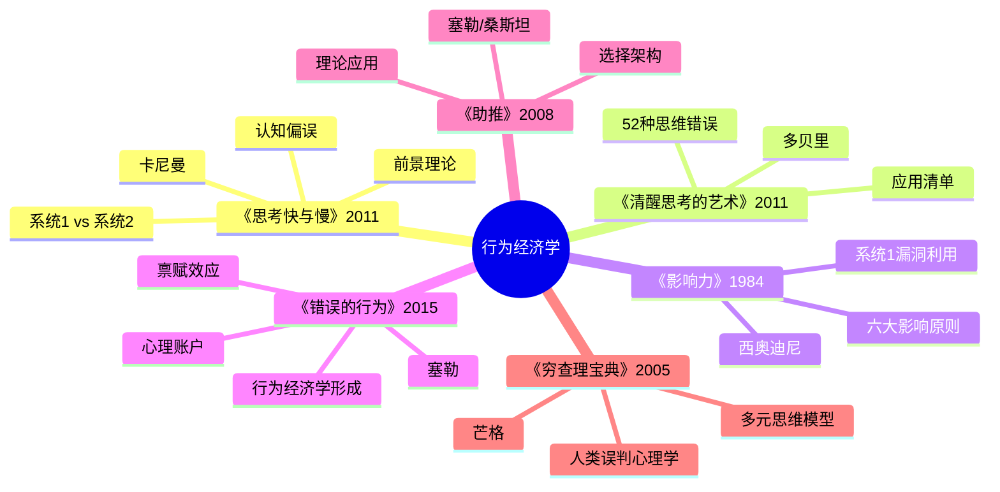

# 《思考，快与慢》读书笔记

## 这本书要解决什么问题？

**核心困境**：人们以为自己是在"理性决策"，但实际上90%的决策是由大脑的自动反应系统完成的。为什么我们总做后悔的决定？因为我们的大脑有两个系统，系统1（快思考）主导了我们的生活，而系统2（慢思考）常常被忽略。

**一句话定位**：
> 你的大脑有两个人在打架：系统1像自动驾驶，系统2像小心司机。大部分时候，自动驾驶在开车，小心司机在睡觉。

### 作者站在什么位置说这些话？

| 维度 | 定位 |
|------|------|
| 主领域 | 认知心理学 |
| 跨界领域 | 行为经济学、决策科学、神经科学 |
| 作者背景 | 2002年诺贝尔经济学奖得主（心理学家获奖第一人）、认知科学奠基人 |
| 历史语境 | 2011年出版，行为经济学的"圣经"，认知决策学的里程碑 |
| 理论贡献 | 前景理论（Prospect Theory）、系统1/系统2理论 |

### 和其他书有什么关系？

| 关联书籍 | 关联关系 | 共同底层逻辑 |
|----------|----------|--------------|
| [[清醒思考的艺术-多贝里]] | 理论到应用 | 卡尼曼提供系统1/2框架，多贝里提供52个偏误清单 |
| [[影响力-西奥迪尼]] | 机制基础 | 系统1是六大影响力原则的"漏洞入口" |
| [[错误的行为-理查德·塞勒]] | 同源理论 | 卡尼曼是塞勒的老师，前景理论是行为经济学基础 |
| [[助推-理查德·塞勒]] | 应用延伸 | 塞勒将卡尼曼理论应用于政策设计 |
| [[穷查理宝典]] | 互补视角 | 芒格的"人类误判心理学"与卡尼曼的"认知偏误"高度重合 |

### 知识网络图

---

## 作者的核心论点

### 系统1 vs 系统2 - 大脑的两套操作系统

球拍和球共卖1.10美元，球拍比球贵1.00美元，球多少钱？大多数人回答0.10美元。正确答案是0.05美元。这是系统1的直觉错误。

琳达问题更经典：琳达31岁，单身，直言不讳，主修哲学，作为学生，她非常关心歧视和社会公正问题，还参加了反核示威游行。问题：琳达更可能是银行柜员，还是银行柜员且积极参加了女权运动？大多数人选后者——错误。系统1喜欢"故事"，后者故事更完整。

| 系统1特点 | 系统2特点 |
|-----------|-----------|
| 快速、自动、无意识、省力、情感化 | 缓慢、费力、有意识、逻辑化、计算 |
| 负责：直觉、印象、感觉、冲动 | 负责：推理、比较、规划、决策 |

系统1是"出厂设置"，系统2是"升级包"。系统1持续运行，系统2只在必要时激活。但系统2很懒，不愿意工作——认知吝啬原则。系统2容易被系统1"催眠"——认知放松效应。

> **双系统定律**：人类思维由两个系统主导——系统1（快速、直觉、自动）和系统2（缓慢、理性、计算）。系统1主导日常决策，系统2负责复杂推理，但系统2懒惰，容易被系统1的直觉误导。

你的大脑里住着两个人：一个叫"快思考"，他反应快、直觉强、但总犯错；一个叫"慢思考"，他反应慢、逻辑强、但总睡觉。悲剧的是：你大部分时间都在听"快思考"的。

以前我总后悔自己做冲动决定，觉得是自己意志力不够。现在我明白了——这不是意志力问题，是系统2太懒惰了。下次做重要决定，我不会再说"要冷静"，而是问自己：系统2上线了吗？

但这还只是第一步——双系统理论揭示了大脑如何运作，下一步要理解的是大脑如何在风险决策中犯错。

---

### 前景理论 - 为什么你赚小亏大？

损失厌恶实验揭示了一个惊人的发现。问题1：给你1000元，然后让你选A（50%概率赢1000元）vs B（肯定得500元）。大多数人选B。问题2：给你2000元，然后让你选C（50%概率丢1000元）vs D（肯定丢500元）。大多数人选C。人们对损失的反应比收益强烈2-2.5倍。

框架效应更直接：表述1"手术成功率90%"，表述2"手术死亡率10%"——同一个事实，不同表述导致不同决策。

前景理论价值函数的四个核心机制：参照点依赖——价值判断是相对于参照点，不是绝对值；损失厌恶——损失痛苦大于收益快乐（约2.5倍）；敏感度递减——离参照点越远，影响越小；概率权重——小概率高估，大概率低估。

> **前景理论定律**：人们在面临收益时倾向于风险规避，在面临损失时倾向于风险偏好。损失带来的痛苦是等量收益带来的快乐的2-2.5倍。价值判断相对于参照点，而非绝对值。

你赚100的快乐，抵不上亏100的痛苦。所以你总赚小亏大——赚了一点就跑了（风险规避），亏了很多还死扛（风险偏好）。这不是心态问题，是出厂设置。

这个观点打碎了我的一个假设。我一直以为投资"赚小亏大"是自己心态不好，现在发现是前景理论在起作用。下次投资时，我不会再问"心态够不够好"，而是预设止损点写在纸上，改变参照点。

前景理论揭示了我们对得失的系统性偏见，而这只是大脑bug的冰山一角。

---

### 认知偏误 - 大脑的52个bug

锚定效应：先让参与者转"幸运轮"，然后问联合国非洲国家占比。结果：轮盘数字影响回答——即使明显无关。第一眼信息成为"锚"，后续判断围绕它。

可得性启发法：哪种更致命？飞机坠毁还是恐怖袭击？大多数人认为恐怖袭击更致命。事实是飞机坠毁致死率更高，但恐怖袭击更"令人印象深刻"。容易想起的事件被高估概率。

光环效应：给学生看一段演讲录像（有声音vs无声音）。结果：有声音时，外貌好的讲师被评价为更有才华。单一正面特征影响整体判断。

确认偏误：给参与者看两组数字，判断规律。大多数人只寻找符合自己假设的证据。自动过滤矛盾信息，强化既有观点。

| 类别 | 核心偏误 | 机制 |
|------|----------|------|
| 信息过滤 | 锚定效应、可得性启发法、光环效应 | 系统1依赖"容易获取"的信息 |
| 概率判断 | 基础概率忽视、赌徒谬误、小数法则 | 系统1不擅长理解概率 |
| 因果判断 | 后见之明、结果偏误、归因错误 | 系统1喜欢"故事胜过统计" |
| 社会影响 | 从众心理、群体迷思、权威偏误 | 系统1依赖"他人的选择" |
| 价值判断 | 损失厌恶、禀赋效应、沉没成本 | 系统1的"参照点"依赖 |

> **认知偏误定律**：人类大脑进化出大量"启发法"（思维捷径），这些启发法在原始社会快速高效，但在现代复杂环境中导致系统性的认知错误。认知偏误是系统1的"出厂bug"，无法消除，只能识别。

你不能重装大脑，但可以学会打补丁。你的大脑有52个bug（认知偏误），知道bug在哪里，才能绕开它。

下次遇到营销套路，我不会再说"不够警惕"，而是问"哪个认知偏误被利用了？"——知道bug在哪里，才能防御。

认知偏误解释了我们为什么会犯错，但还有一个统计规律常被误读——极端表现之后的回落。

---

### 回归平均 - 为什么极端会回落？

飞行训练中有个奇怪现象：教练发现表扬好的飞行表现，下次表现变差；批评差的飞行表现，下次表现变好。结论是"表扬有害，批评有益"？卡尼曼发现不对——这是回归均值现象。极端表现（极好或极差）后，自然倾向于回到平均水平。

高尔夫实验同样：第一轮打得好的人，第二轮变差；第一轮打得差的人，第二轮变好。这不是"状态问题"，是统计学规律。

任何测量都有随机成分，极端结果通常包含"运气"成分。下次测量，运气成分变化，结果自然趋向平均水平。

> **回归均值定律**：极端表现后，下一次测量自然会趋向平均水平。人们常错误地将回归均值归因于外部因素（如表扬或批评），但实际上这是统计学规律。

超常发挥后，别期待下次更好；表现糟糕后，别担心下次更糟。极端会回归平均，这是自然规律。不要把运气当实力，也不要把均值当失败。

下次看到孩子的成绩忽高忽低，我不会再问"老师教得好不好"，而是问"这是回归均值吗？"——极端会自然回落。

---

## 这本书的局限

| 批评点 | 谁在批评 | 怎么说 | 实际情况 |
|--------|---------|--------|---------|
| 可重复性危机 | 心理学界 | 书中引用的研究部分无法复现 | 第3章和第4章社会启动研究R-index仅19 |
| 系统分类简化 | 部分学者 | 实际大脑有多重系统，不是只有两个 | 卡尼曼回应：这是"有用的简化模型" |
| 跨文化适用性 | 跨文化研究者 | 大部分实验基于西方受试者 | 不同文化背景的人，偏误表现可能不同 |
| 书太长太复杂 | 普通读者 | 500页，不适合快速阅读 | 核心理论有价值，但需要简化版 |
| 效应规模问题 | 统计学家 | 许多"显著"效应实际影响很小 | 相关系数r=0.09，效应确实有限 |

**一句话总结局限性**：
> 核心理论（双系统、前景理论、损失厌恶）经受检验，部分案例需重新审视。

---

## 最值得记住的话

**原书说的**：
1. "我们的大脑有两个系统：系统1是快速、直觉、自动的；系统2是缓慢、费力、有意识的。"
2. "损失带来的痛苦，是等量收益带来的快乐的2-2.5倍。"
3. "人们不是风险厌恶，而是损失厌恶。"
4. "聪明人会犯系统性的愚蠢错误，这是因为系统1的主导。"
5. "系统2很懒，它不愿意工作，除非系统1被卡住。"

**翻译成人话**：
1. 你脑子有两个人：一个叫快思考，一个叫慢思考。快思考在开车，慢思考在睡觉
2. 赚100的快乐，抵不上亏100的痛苦。所以你总赚小亏大
3. 你拥有的，看起来更值钱——这就是禀赋效应
4. 你只看到你想看的——这就是确认偏误
5. 第一眼看到的信息，成了你脑子里的锚
6. 你记住的，不等于常发生的
7. 极端会回归平均，别把运气当实力
8. 你不能重装大脑，但可以学会打补丁

---

## 讲给没读过的人听

你有个大脑，但你的大脑在骗你。

卡尼曼发现，你的大脑里有两个人在打架。一个叫系统1，他是自动驾驶——快速、直觉、无意识，24小时在线。一个叫系统2，他是小心司机——缓慢、费力、有意识，但经常睡觉。

大部分时候，系统1在开车，系统2在睡觉。你以为你在"思考"，其实你在"反应"。

更可怕的是损失厌恶。卡尼曼做过实验：给你1000元，让你选——肯定得500元，还是50%概率得1000元？大多数人选肯定得500元，"落袋为安"。但如果给你2000元，让你选——肯定丢500元，还是50%概率丢1000元？大多数人选赌一把，"不甘心"。

同一个概率，面对收益和损失时，你的选择完全相反。亏100元的痛苦，需要赚200-250元才能抵消。这不是心态问题，是人性的出厂设置。

下次做重要决定，问自己一个问题：系统2上线了吗？

---

## 用来检验理解的问题

**基础回忆**：
1. Q: 系统1和系统2有什么区别？
   A: 系统1快速、自动、无意识、省力；系统2缓慢、费力、有意识。系统2懒惰，经常"罢工"。

2. Q: 损失厌恶系数是多少？
   A: 约为2-2.5倍。亏100元的痛苦需要赚200-250元才能抵消。

3. Q: 什么是框架效应？
   A: 同一个事实，不同表述导致不同决策。"手术成功率90%"vs"手术死亡率10%"效果完全不同。

**理解验证**：
1. Q: 为什么投资"赚小亏大"？
   A: 前景理论：面对收益时风险规避（赚一点就跑），面对损失时风险追求（亏很多还死扛）。

2. Q: 如何对抗锚定效应？
   A: 谈判时先开价，做放砣的人。忘掉对方的价格，重新评估价值。

3. Q: 回归均值告诉我们什么？
   A: 极端表现后会自然回落。不要把运气当实力，不要把均值当失败。

**实际应用**：
1. Q: 投资时如何对抗损失厌恶？
   A: 预设止损点写在纸上，不让系统2懒惰。问自己："如果现在没有持仓，会买入吗？"

2. Q: 团队决策如何避免群体迷思？
   A: 预设检查清单，匿名投票减少锚定，指定反方寻找反对意见，延迟决策过夜再定。

**深度分析**：
1. Q: 哪些理论经受检验，哪些需要审视？
   A: 双系统、前景理论、损失厌恶经受检验；启动效应研究结果存疑。核心理论仍是行为经济学基石。

---

## 和其他书的对话

多贝里站在卡尼曼的肩膀上向下俯瞰。卡尼曼给你理论框架，多贝里给你实用清单。双系统理论告诉你"为什么"，52个偏误清单告诉你"是什么"——理论加清单等于完整防御体系。

西奥迪尼拿着卡尼曼的地图进攻同一座城。卡尼曼告诉你大脑有什么"漏洞"，西奥迪尼告诉你如何"按下漏洞按钮"。六大影响力原则正是利用系统1的漏洞——理解漏洞才能防御，理解按钮才能影响。

塞勒是卡尼曼的学生，把心理学正式引入经济学。卡尼曼搭建了行为经济学的理论大厦，塞勒把理论变成选择架构设计。知道系统1的bug，就可以设计"助推"——不是强迫人做正确的事，而是让正确的事更容易做。

芒格和卡尼曼都是识破人类非理性的大师。卡尼曼用实验揭示人性弱点，芒格用投资验证人性弱点。卡尼曼告诉你人为什么犯错，芒格告诉你如何避免犯错——互补的视角，完整的决策智慧。

塔勒布关注极端事件，卡尼曼关注日常偏误。卡尼曼教你避开日常陷阱，塔勒布教你应对黑天鹅。日常加极端，等于完整的生存指南。

---

*拆解日期：2026-02-16*
*下次回访：1周后回顾「讲给没读过的人听」和「检验问题」*