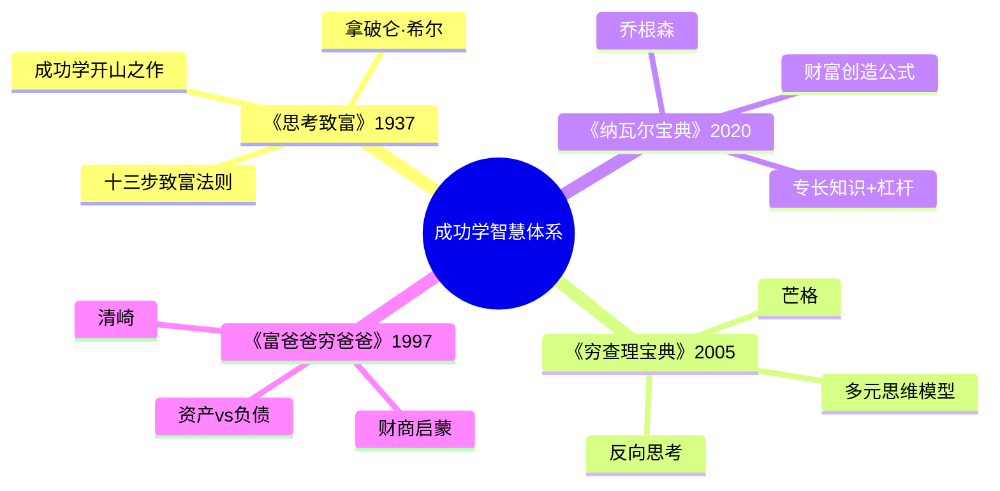
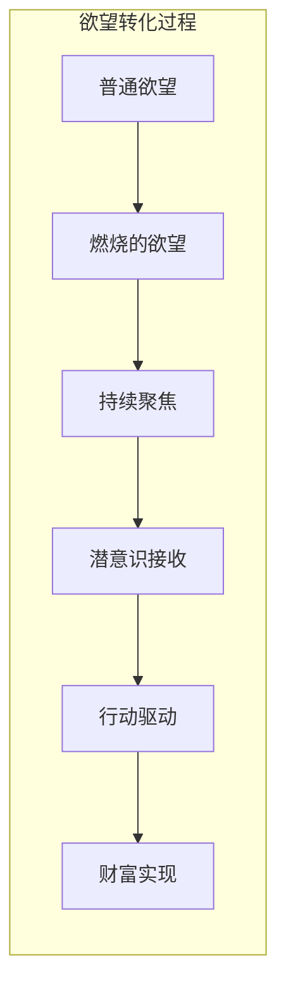
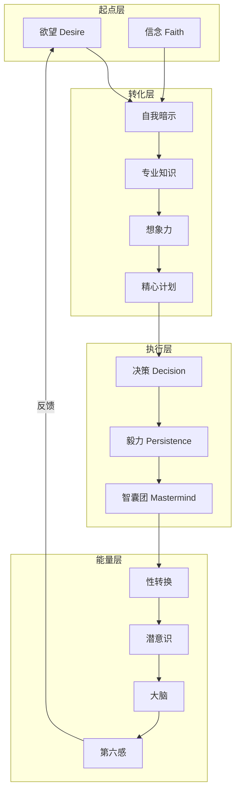
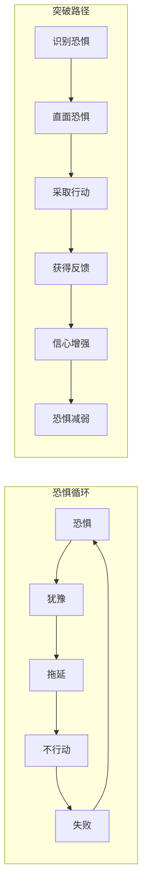
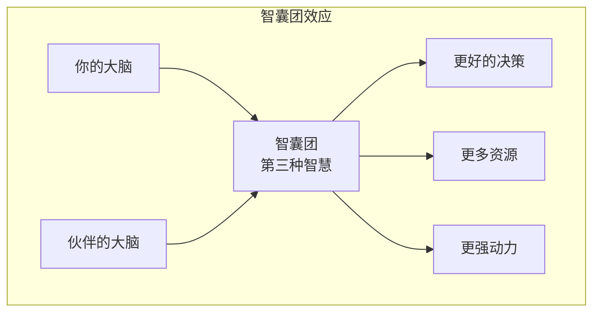

# 《思考致富》拆解记录

## 这本书要解决什么问题？

**核心困境**：不是问"如何变富？"，而是问"为什么有些人白手起家能致富，而有些人终其一生都在为钱挣扎？"希尔认为，财富的根本来源不是外在条件，而是内在心态。

**一句话定位**：
> 财富始于意念——想得到，才能做得到。

### 作者站在什么位置说这些话？

| 维度 | 定位 |
|------|------|
| 主领域 | 成功学 / 心态致富哲学 |
| 跨界领域 | 心理学、行为学、财富哲学 |
| 作者背景 | 声称受安德鲁·卡内基委托，用25年研究500多位成功人士，"百万富翁制造者"。注意：希尔本人存在诚信争议，卡内基家人否认与他会面，希尔曾多次破产 |
| 历史语境 | 1937年大萧条时期出版，全球销量7000万册。成功学开山之作，影响了清崎、罗宾斯等后来几乎所有的成功学作者 |

### 和其他书有什么关系？

| 关联书籍 | 关联关系 | 共同底层逻辑 |
|----------|----------|--------------|
| [[纳瓦尔宝典-乔根森-拆解记录]] | 继承延伸 | 希尔：信念创造财富；纳瓦尔：专长知识+杠杆创造财富 |
| [[穷查理宝典-拆解记录]] | 互补 | 希尔：心态决定命运；芒格：思维模型决定决策 |
| [[富爸爸穷爸爸-清崎-拆解记录]] | 精神启蒙 | 清崎承认受《思考致富》影响，强调"财商也是心态" |
| [[影响力-西奥迪尼-拆解记录]] | 方法互补 | 希尔：内在心态；西奥迪尼：外在影响技巧 |
| [[原则-拆解记录]] | 系统延伸 | 希尔：成功公式；达利欧：成功系统化 |

### 知识网络图

---

## 作者的核心论点

### 欲望+信念=致富的起点

1908年，一个叫巴恩斯的人一心想成为爱迪生的合伙人。他不是想想而已——他身无分文，站在爱迪生实验室门口，不走了。最后他真的成了爱迪生的商业合伙人。希尔用这个故事说明一个核心论断："所有的成就、所有辛苦所得的财富，都有其意念的源泉。"

关键不是"希望"，而是"燃烧的欲望"（Burning Desire）。普通欲望让你想一想要不就算了，燃烧的欲望让你没有退路。

希尔给了一套六步致富法：确定你想要的具体金额；确定你愿意付出什么代价；设定具体实现日期；制定明确计划并立即行动；写下以上所有内容；每天早晚大声朗读。

这六步看似简单，但背后有一个精密的自我承诺机制。西奥迪尼在《影响力》里说"承诺一致性"——公开承诺更容易执行；希尔说"写下目标+每天朗读"——本质上是把意图转化为承诺，承诺驱动行动。两个人从不同角度揭示了同一个机制。

> **希尔欲望定律**：欲望+具体化+重复暗示=潜意识编程=自动行动=财富实现

这打碎了我对"立flag"的看法。以前觉得写目标、念目标是形式主义。但希尔的逻辑链条是这样的：模糊的欲望不会驱动行动，只有具体化、写下来、反复朗读，才能把欲望"编入"潜意识。你不是在立flag，你是在给自己装程序。

有了燃料，还需要系统化的路径。

### 十三步致富法则：系统化成功路径

希尔提炼了13个步骤，可以分成四层。起点层是欲望和信念——想得到，并且相信自己能做到。转化层是自我暗示、专业知识、想象力、精心计划——把欲望变成具体的行动方案。执行层是决策、毅力、智囊团——果断行动，坚持到底。能量层是性转换、潜意识、大脑、第六感——调动更深层的心理力量。

其中三个法则值得展开。

**决策法则**：成功者快速决策，如果需要改变也慢慢改变；失败者慢慢决策，如果需要改变也快速改变。和芒格的"能力圈"异曲同工——在自己懂的领域果断行动。

**毅力法则**：多数人在成功前夕放弃。希尔说"每一个逆境都包含着等量或更大利益的种子"。和达利欧的"痛苦+反思=进步"是同一个底层逻辑——挫折不是终点，是转折点。

**智囊团法则**：两个人的智慧大于一个人。亨利·福特、托马斯·爱迪生、哈维·费尔斯通经常聚会交流，他们各自的成就都不是孤立的。

> **希尔成功定律**：成功 = （欲望 + 信念 + 行动） x 毅力 x 智囊团

以前我总觉得成功没有公式，现在意识到希尔说的不是"照着做就一定能成"，而是"缺少这些要素几乎一定不成"。心态是必要条件，不是充分条件。

不过，阻止人们走上这条路的，往往不是缺少方法，而是恐惧。

### 六种恐惧：成功的隐形杀手

希尔识别了六种基本恐惧：贫穷恐惧——担心没钱、焦虑未来、不敢冒险；批评恐惧——怕被嘲笑、怕被否定、从众心理；病痛恐惧——担心健康、过度焦虑、疑病；失去爱恐惧——怕被拒绝、讨好型人格、依赖他人；衰老恐惧——怕变老、焦虑外貌、抗拒变化；死亡恐惧——怕死、逃避思考、活在恐惧中。

恐惧的运作机制是一个自我强化的循环：恐惧→犹豫→拖延→不行动→失败→更大的恐惧。最致命的是，恐惧会自我实现。贫穷恐惧让你更焦虑、更难致富；批评恐惧让你从众、更难创新。

突破恐惧只有一条路：行动。识别恐惧→直面恐惧→采取行动→获得反馈→信心增强→恐惧减弱。行动是消除恐惧的唯一方法。

西奥迪尼在《影响力》里说的"稀缺原理"和希尔的"贫穷恐惧"是同一枚硬币的两面。西奥迪尼揭示的是恐惧如何让人做出冲动决策（害怕失去所以抢购），希尔揭示的是恐惧如何让人不敢决策（害怕贫穷所以不敢冒险）。一个讲恐惧的外在利用，一个讲恐惧的内在破坏。

> **恐惧定律**：恐惧=不确定 x 想象放大。行动是消除恐惧的唯一方法。

下次面对一个让我犹豫的决定，我不会再问"万一失败了怎么办"，而是问"我不行动的恐惧来自六种里的哪一种"。

克服恐惧只是清除障碍，真正推动成功的还需要另一个力量。

### 智囊团：1+1>2的力量

希尔说："没有两个人的头脑聚集在一起，不会因此产生第三个看不见的无形力量。"这个判断来自他对500多位成功人士的观察——成功者几乎都有"智囊团"。

亨利·福特、托马斯·爱迪生、哈维·费尔斯通经常聚会交流。他们三个人各自的天赋不同——福特懂制造、爱迪生懂发明、费尔斯通懂橡胶——但在一起的时候，能产生任何一个人单独都想不到的想法。

| 维度 | 单打独斗 | 智囊团 |
|------|----------|--------|
| 知识范围 | 有限 | 指数扩展 |
| 决策质量 | 受限于自己的盲点 | 多视角纠偏 |
| 资源获取 | 靠自己积累 | 网络效应 |
| 心理支持 | 孤独 | 互相激励 |

纳瓦尔说"与长期的人玩长期的游戏"，希尔说"组建智囊团"。一个用现代语言，一个用80年前的语言，说的都是同一件事：你的圈子决定你的层次。

这打碎了我对"独立成功"的幻想。以前总觉得成功是个人奋斗的结果，一个人越强就越能成功。但希尔让我意识到，真正的成功几乎都不是孤立的——福特、爱迪生、费尔斯通三个人经常聚会，产生的想法远超任何一个人单独能想到的。下次设定目标，我不会再只问"我要怎么做"，而是先问"谁可以和我一起做"。

> **智囊团定律**：智慧 = 个人知识 x 协作人数 x 信任度

---

## 这本书的局限

> 必须直面对希尔本人的争议，再谈书中理念的边界。

| 批评点 | 谁在批评 | 怎么说 | 实际情况 |
|--------|---------|--------|---------|
| 作者诚信问题 | 历史研究者 | 希尔声称采访过500多位名人，但卡内基家人否认与希尔会面；希尔曾多次破产，有诈骗和邪教活动记录 | 需要分离信息与信使。即使作者有争议，书中理念仍有价值 |
| 科学性问题 | 认知科学家 | "潜意识编程"、"第六感"、"性转换"等概念缺乏科学依据，弗洛伊德理论已被现代认知科学部分否定 | 心态的重要性有现代心理学支持（如成长型思维），但不必全盘接受 |
| 过度简化 | 社会学家 | "只要想就能致富"忽略了运气、出身、时代等外在因素，存在幸存者偏差 | 希尔的方法是"必要条件"不是"充分条件"，心态对+方法对=提高成功概率，不是保证成功 |
| 时代局限 | 现代读者 | 1937年的美国社会环境和今天完全不同 | 核心心态原则普适，但具体方法需要结合当代实操书使用 |

**一句话总结局限性**：
> 把它当"思维框架"而非"科学真理"。希尔提供的是心态基础，需要和实操书（如《纳瓦尔宝典》《富爸爸穷爸爸》）结合才能落地。

---

## 最值得记住的话

**原书说的**：
1. "所有的成就、所有辛苦所得的财富，都有其意念的源泉。"
2. "只要头脑能构思和相信，就能达成。"
3. "成功者快速决策，如果需要改变，也慢慢改变。失败者慢慢决策，如果需要改变，也快速改变。"
4. "每一个逆境都包含着等量或更大利益的种子。"
5. "知识只是潜在的力量，只有组织成明确的行动计划时，才成为真正的力量。"
6. "恐惧只是心理状态，可以被控制。"
7. "成功不需要解释，失败不允许借口。"

**翻译成人话**：
1. 想得到，才能做得到
2. 脑子先有，现实中才有
3. 穷人和富人最大的区别：一个说"我买不起"，一个说"我怎样才能买得起"
4. 失败是个骗子，它喜欢在成功近在咫尺时把你绊倒
5. 犹豫是恐惧的温床，行动是恐惧的解药
6. 一个人走得快，一群人走得远
7. 你害怕什么，什么就控制你
8. 知识和行动之间的距离，就是穷人和富人之间的距离
9. 成功者和失败者的区别：前者果断决策，后者拖延犹豫
10. 每天给自己洗脑，洗着洗着就信了，信着信着就成了

---

## 讲给没读过的人听

你有没有想过，为什么有些人白手起家能致富，而大多数人一辈子都在为钱挣扎？

希尔用了25年研究500多位成功人士，发现了一个共同点：不是运气好，不是出身好，而是心态对。具体来说，他们都有一套"成功公式"。

首先是欲望——不是普通的"想赚钱"，而是"想赚钱想疯了"。巴恩斯身无分文站在爱迪生实验室门口不走了，最后真的成了爱迪生的合伙人。关键是把欲望具体化：写下来具体金额、设定日期、制定计划、每天早晚朗读。

然后是恐惧。希尔发现六种恐惧阻止了大多数人：贫穷恐惧让你不敢冒险，批评恐惧让你从众，病痛恐惧让你焦虑……恐惧会自我实现——越怕穷越穷，越怕被批评越从众。唯一的解药是行动。

最后是圈子。成功者几乎都有"智囊团"——几个比你聪明的人经常在一起交流。福特、爱迪生、费尔斯通三个人经常聚会，产生的想法远超任何一个人单独能想到的。

希尔说的不是"照着做就一定能成"，而是"缺少这些要素几乎一定不成"。心态是必要条件，不是充分条件。

---

## 用来检验理解的问题

**基础回忆**：
1. Q: 希尔的六步致富法是什么？
   A: 确定具体金额→确定付出代价→设定实现日期→制定明确计划→写下所有内容→每天早晚朗读。

2. Q: 六种基本恐惧是什么？
   A: 贫穷恐惧、批评恐惧、病痛恐惧、失去爱恐惧、衰老恐惧、死亡恐惧。

3. Q: 十三步法则的四个层次是什么？
   A: 起点层（欲望+信念）→转化层（自我暗示+知识+想象力+计划）→执行层（决策+毅力+智囊团）→能量层（性转换+潜意识+大脑+第六感）。

**理解验证**：
1. Q: 为什么"燃烧的欲望"和"普通欲望"不同？
   A: 普通欲望不会驱动行动，燃烧的欲望让人没有退路。关键在于具体化、写下来、反复朗读，把欲望编入潜意识。

2. Q: 恐惧为什么会"自我实现"？
   A: 贫穷恐惧→更焦虑→更难致富→更恐惧。批评恐惧→从众→更难创新→更被批评。恐惧的循环是：恐惧→犹豫→拖延→不行动→失败→更大的恐惧。

3. Q: 智囊团的本质是什么？
   A: 两个头脑产生"第三种智慧"——任何一个人单独都想不到的想法。核心公式：智慧=个人知识 x 协作人数 x 信任度。

**实际应用**：
1. Q: 你最强烈的恐惧是六种里的哪一种？用一个具体行动去面对它。
   A: 识别恐惧类型→设定一个小的直面行动→执行→获得反馈→信心增强。

2. Q: 你的"智囊团"是谁？如果没有，准备找谁？
   A: 列出3-5个你佩服的人，主动联系其中1个人寻求建议。

**深度分析**：
1. Q: 希尔的成功学和纳瓦尔的财富哲学本质区别是什么？
   A: 希尔提供心态基础——信念、欲望、克服恐惧；纳瓦尔提供方法工具——专长知识、杠杆、长期游戏。希尔告诉你"想得到才能做得到"，纳瓦尔告诉你"怎么做得到"。两个一起读才完整。

2. Q: 为什么说希尔的方法是"必要条件"不是"充分条件"？
   A: 心态对+方法对=提高成功概率，不是保证成功。运气、出身、时代等外在因素同样重要。希尔只解决了心态这一个问题。

---

## 和其他书的对话

希尔和纳瓦尔跨越83年做了一场财富对话。希尔是精神内核，纳瓦尔是实践手册。希尔告诉你"心态决定命运"——想得到才能做得到，克服恐惧才能行动，组建智囊团才能走得远。纳瓦尔告诉你"如何用心态创造财富"——找到专长知识，加上杠杆，与长期的人玩长期的游戏。读了希尔你知道该用什么心态，读了纳瓦尔你知道该用什么方法。希尔的问题是没有给出具体操作，纳瓦尔正好补上。

芒格会怎么看希尔？大概是"心态对了，但工具不够"。芒格攒了100多个多元思维模型，遇到问题就拿武器；希尔只守着一套"欲望+信念+行动"。芒格说"避免愚蠢比追求聪明重要"，希尔说"战胜六种恐惧"。两个人都在讲克服弱点是成功的关键，但芒格走的是理性分析路线，希尔走的是心理建设路线。心态+工具，才是完整的成功系统。

清崎亲口承认受《思考致富》影响。《富爸爸穷爸爸》里的"穷爸爸思维"——说"我买不起"而不是"我怎样才能买得起"——正是希尔批评的贫穷恐惧的表现。希尔教你怎么想，清崎教你怎么做。先读希尔建立心态基础，再读清崎建立财商框架。

西奥迪尼研究的是外在影响——别人怎么用稀缺原理、社会认同、权威效应来影响你的决策。希尔研究的是内在障碍——恐惧、犹豫、缺乏信念怎么阻止你行动。一个是外在的影响力，一个是内在的障碍力。读了西奥迪尼你知道别人怎么影响你，读了希尔你知道怎么克服自己内心的障碍。

达利欧把希尔想做但没做成的事做到了——系统化。希尔说"从500个成功人士中提炼成功公式"，达利欧说"从每一次失败中提炼原则"。希尔停留在心态层面，达利欧深入到操作系统层面。希尔告诉你"成功需要系统"，达利欧给你一套"具体的系统"。

---

*拆解日期：2026-02-14*
*下次回访：1周后回顾「讲给没读过的人听」和「检验问题」*
