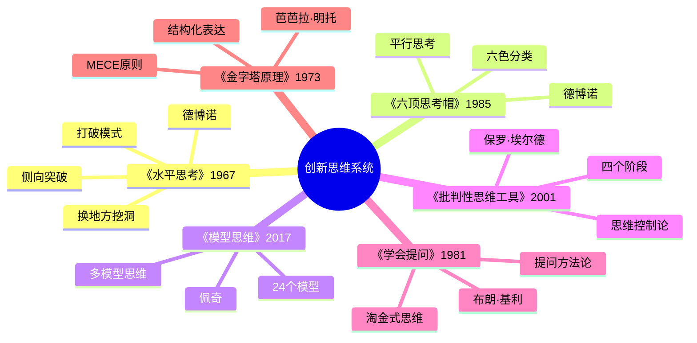
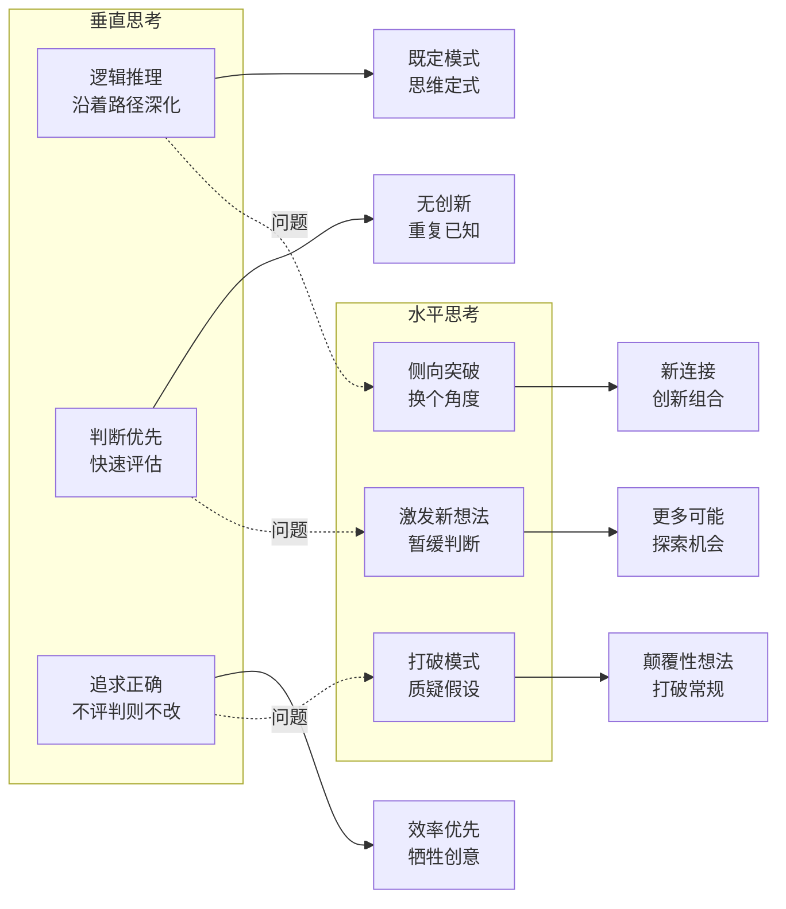

# 《水平思考》读书笔记

## 这本书要解决什么问题？

**核心困境**：垂直思考（逻辑推理）只能沿着既定路径深入，无法产生真正的新想法。大脑喜欢模式，创意需要打破模式。为什么聪明人也会陷入思维定式？因为大脑为了效率，自动沿着熟悉的路径思考。

**一句话定位**：
> 垂直思考是挖深同一个洞，水平思考是换个地方挖洞。

### 作者站在什么位置说这些话？

| 维度 | 定位 |
|------|------|
| 主领域 | 创新思维、认知科学、问题解决方法论 |
| 跨界领域 | 心理学、教育学、管理学、设计思维 |
| 作者背景 | 牛津、剑桥、哈佛等多所大学教职，被誉为"创新思维之父"，"水平思考"创始人 |
| 历史语境 | 1967年出版，是侧向思维的开创性著作，《六顶思考帽》的理论基础 |

### 和其他书有什么关系？

| 关联书籍 | 关联关系 | 共同底层逻辑 |
|----------|----------|--------------|
| [[六顶思考帽-德博诺]] | 同作者姊妹篇 | 水平思考是理论基础，六顶思考帽是操作化工具 |
| [[模型思维-佩奇]] | 方法互补 | 多模型提供24个框架，水平思考提供打破框架的方法 |
| [[批判性思维工具-保罗]] | 机制基础 | 批判性思维识别缺陷，水平思考提供打破路径的工具 |
| [[学会提问-布朗]] | 工具配套 | 提问质疑一切，水平思考侧向寻找新答案 |
| [[金字塔原理-明托]] | 结构延伸 | 金字塔原理结构化表达，水平思考产生新想法 |

### 知识网络图

### 水平思考的核心逻辑流程

---

## 作者的核心论点

### 垂直思考 vs 水平思考——你是在挖洞还是在找洞？

一个公司要"提高员工满意度"。垂直思考者想到"加薪"——沿着既定路径深化。水平思考者想到"弹性工作制""家庭日活动"——换个角度。同一个问题，有人想了100次，想法都差不多。专业人士在领域内越深入，创新反而越少。"专家"容易陷入路径依赖，无法看到新可能。

| 维度 | 垂直思考 | 水平思考 |
|------|----------|----------|
| 方向 | 向下深化 | 侧向突破 |
| 目标 | 沿着路径走得越深越好 | 换个地方看看 |
| 时间线 | 逻辑递进 | 跳跃思维 |
| 判断 | 即时评估 | 暂缓判断 |
| 创意 | 在既有基础上优化 | 打破重新组合 |

大脑的模式化机制是这样的：输入信息后，大脑自动归类到已知模式，沿着熟悉路径思考（垂直），快速判断评估是否合理，效率优先但牺牲新可能。水平思考则是刻意打破模式，质疑假设，侧向切换换个角度，激发新连接重组信息，暂缓判断保持开放。

> **模式识别定律**：大脑为了效率，自动将信息归类到既定模式。创意的本质是打破这些模式，建立新连接。

大脑像高速公路，垂直思考是沿着老路走得更远，水平思考是下高速，换条新路。

以前我总觉得"脑子不够灵光"是自己不够聪明，现在明白这不是智商问题，而是大脑为了效率自动进入"省电模式"。下次遇到问题想不出新方案，我不会再责怪自己，而是刻意练习"换个地方挖洞"。

理解了垂直和水平思考的区别，下一步是学会如何打破既定模式。

---

### 打破既定模式——你的大脑在自动导航

你开车回家，从不看路，自动走老路。你解决问题，总是用熟悉的方法。每个人都有"思维惯性"，自己都意识不到。大脑的"自动导航"是你效率最高的模式，但也是创新的敌人。

德博诺提出的水平思考四步法（PO）：第一步Po（Point of Focus），明确焦点，集中注意力不分散；第二步Po（Point of View），切换视角，换个角度看问题；第三步O（Observation），产生观察，生成新想法暂不评判；第四步O（Oscillation），振荡切换，多个视角来回切换激发更多想法。

> **模式打破定律**：每个问题都有无数解决角度，但大脑习惯用最熟悉的那一个。水平思考通过强制切换视角，打破思维定式。

你的大脑像老司机，熟悉的路开得快，但永远到不了新地方。水平思考是偶尔走错路，才能发现新风景。

这个观点打碎了我的一个假设。我一直以为创新靠天赋，现在发现创新是可以训练的技能——关键是刻意切换视角，打破大脑的自动导航。

打破模式是第一步，但如何找到打破模式的入口？答案藏在每个"理所当然"背后。

---

### 质疑假设——每个"理所当然"背后都藏着"为什么"

"客户需要更便宜的产品"——假设"价格是唯一因素"。"会议需要更高效"——假设"效率是唯一目标"。"营销需要更有创意"——假设"创意是营销部门的事"。每个结论都建立在显性或隐性的假设之上，但人们很少质疑这些假设。

质疑假设有三个层次：显性假设（明确说出的前提，如"我们的产品是高端的"）；隐性假设（没说但默认的前提，如"客户不会接受降价"）；深层假设（基本信念，如"品牌就是一切"）。

随机词法是质疑假设的利器：随机翻字典找一词，强制将词与当前问题关联，激发意外连接。看起来完全不相关，往往是最相关的。

> **假设定律**：每个结论都建立在显性或隐性假设之上。质疑假设是找到新解的前提。

每个"理所当然"背后，都藏着一个"为什么"。问出这个"为什么"，就找到了创新的钥匙。

下次遇到问题卡住，我不会再沿着同一条路深入，而是问："我对这个问题的哪些假设是错的？"

质疑假设让我们找到问题的症结，但有时我们需要更意外的启发来打破思维定式。

---

### 随机刺激——创新来自意料之外

苹果公司Logo来自一个被咬了一口的苹果——乔布斯参加苹果节时得到的灵感。尼龙搭扣来自一卷失败的设计。创意常常来自意外联想，但大多数人只会沿着熟悉路径找灵感。

随机词法的操作流程：当前问题（如"如何提高会议效率"），随机选词（翻字典选到"香蕉"），强制关联（香蕉和会议有什么关系？），如果建立不了连接就选下一个词重新尝试，如果建立了连接就激发新想法（香蕉弯曲联想到柔性议程），暂时不评判，记录所有想法。

> **随机刺激定律**：创新往往来自意料之外。用无关事物强制关联，能打破模式，建立新连接。

创意像拼图，你需要的碎片往往在看起来完全不相关的地方。随机词就是那个"看起来完全不相关"的地方。

下次想不出新点子，我不会再坐在办公室冥思苦想，而是随手翻一页字典，让随机词帮我建立意外连接。

随机刺激帮我们跳出框架，但还有一种方法能让创意更加系统化——从"怎么做"转向"为什么要做"。

---

### 概念提取与概念扇——从"怎么做"到"为什么要做"

问题："如何提高客户满意度？"直接答案："做客户满意度调查""增加售后服务"。这是方案思维——直接回答"怎么做"。

概念提取："为什么要提高满意度？"——"让客户感受被重视"。这才是真正的目标。现在问：有哪些方式能让客户感受被重视？答案一下子多了——不仅限于调查和售后。

概念扇工具的优势：向上扇，从具体到抽象，发现更高层次目标；向下扇，从抽象到具体，发现更多实现方式。避免路径依赖——不是直接回答"怎么做"，而是探索"为什么要做"。

> **概念定律**：向上扇发现真正的目标，向下扇发现创新的路径。概念思维比方案思维更开放。

直接回答"怎么做"，像给答案填空题。概念思维像提问，先问"为什么要做"，再发现"怎么做"。

以前我遇到问题总是急着找方案，现在我学会了先问"为什么"。这打碎了我对"快速行动"的迷信——有时候慢下来问对问题，比急着找答案更重要。下次遇到难题，我不会直接问"怎么做"，而是先问"为什么要做这件事"。

---

## 这本书的局限

| 批评点 | 谁在批评 | 怎么说 | 实际情况 |
|--------|---------|--------|---------|
| 缺乏实证研究 | 认知心理学家Robert Weisberg | 创意过程可以用传统逻辑思维、试验试错、反馈迭代来解释 | 确实缺少严格的科学实验验证 |
| 概念重复 | 评论者 | 德博诺写了67本书，但核心观点重复 | 核心方法确实集中在少数几个工具 |
| 过度简化 | 学者 | 将复杂的创造过程简化为几个工具 | 简化正是其普及价值所在 |
| 忽视传统智慧 | 哲学界 | 德博诺声称西方思维过度强调对抗性辩论，被认为是对苏格拉底的误读 | 部分批评有道理 |
| 时代变化 | 读者 | 1967年出版，AI时代很多技巧可能被自动化 | 核心思维方法仍有价值 |

**一句话总结局限性**：
> 核心方法（打破模式、质疑假设、随机刺激、概念扇）有实践价值，但缺少严格的实证研究支撑，部分内容在67本书中重复。

---

## 最值得记住的话

**原书说的**：
1. "垂直思考是挖深同一个洞，水平思考是换个地方挖洞。"
2. "大脑喜欢模式，创意需要打破模式。"
3. "创新不是天赋，而是可以训练的技能。"
4. "暂缓判断，让新想法有呼吸的空间。"
5. "每个'理所当然'背后，都藏着一个假设。"
6. "水平思考是改变而不是选择。"

**翻译成人话**：
1. 大脑像老司机，熟悉的路开得快，但永远到不了新地方
2. 每个"理所当然"背后，都藏着一个"为什么"
3. 垂直思考是在既定轨道上加速，水平思考是跳出轨换个轨道
4. 创新像拼图，你需要的碎片往往在完全不相关的地方
5. 最可怕的不是缺乏想法，而是只有一个想法
6. 专业素养有时是创新的障碍——你太懂"正确"的方法了
7. 暂缓判断，不是拖延，是给新想法成长的机会
8. 换个地方挖洞，不是放弃原来的洞，而是意识到还有其他地方可能有宝藏

---

## 讲给没读过的人听

你有没有发现，你解决问题的方法总是差不多？不是因为问题一样，而是因为你的大脑在走老路。

德博诺管这叫"垂直思考"——沿着既定路径越挖越深。问题是你挖的可能是同一个洞。水平思考不一样：不是挖深，而是换个地方挖。

比如一个公司要"提高员工满意度"。垂直思考者想到"加薪"。水平思考者先问"为什么要提高满意度"——答案可能是"让员工感受被重视"。然后再问"有哪些方式让员工感受被重视"——弹性工作制、家庭日活动、内部培训计划......答案一下子多了。

最有趣的工具是随机词法：翻字典随便找一个词，强制和你的问题关联。比如你在想"如何提高会议效率"，翻到"香蕉"。香蕉和会议有什么关系？香蕉是弯曲的——也许会议需要"柔性议程"而不是死板的流程。

创新不是等灵感，而是刻意训练"换个地方挖洞"。

---

## 用来检验理解的问题

**基础回忆**：
1. Q: 垂直思考和水平思考有什么区别？
   A: 垂直思考沿着既定路径深化，水平思考换个角度突破。一个是挖深同一个洞，一个是换个地方挖洞。

2. Q: 水平思考四步法（PO）是什么？
   A: Point of Focus（明确焦点）→ Point of View（切换视角）→ Observation（产生观察）→ Oscillation（振荡切换）。

3. Q: 随机词法怎么用？
   A: 随机翻字典找一词，强制将词与当前问题关联，激发意外连接。

**理解验证**：
1. Q: 为什么专家反而缺乏创新？
   A: 路径依赖——专业素养等于模式固化，你太懂"正确"的方法了，反而看不到新可能。

2. Q: 概念扇的向上扇和向下扇有什么区别？
   A: 向上扇从具体到抽象，发现真正的目标；向下扇从抽象到具体，发现创新的路径。

3. Q: 为什么"暂缓判断"很重要？
   A: 即时判断会杀死新想法。暂缓判断不是拖延，是给新想法成长的空间。

**实际应用**：
1. Q: 下次遇到问题卡住，该怎么做？
   A: 先质疑假设（每个"理所当然"背后的"为什么"），再用随机词法建立意外连接，最后用概念扇探索更多路径。

2. Q: 如何让团队更有创意？
   A: 不要直接讨论"怎么做"，先讨论"为什么要做"。用随机词强制关联，暂缓评判。

**深度分析**：
1. Q: 水平思考和批判性思维有什么关系？
   A: 批判性思维识别思维缺陷和路径依赖（体检），水平思考提供打破路径的工具（手术）。体检加手术等于思维健康。

---

## 和其他书的对话

六顶思考帽是本书的操作化版本。水平思考教你"如何突破"，六顶思考帽教你"如何组织"。一个是创新思维的方法论，一个是会议思考的操作系统。两者结合，是完整的职场创新系统。

佩奇的模型思维和水平思考站在创新的两端。多模型思维提供"看清世界的24副眼镜"，水平思考教你"摘下眼镜换个角度"。框架加上突破，等于完整的认知升级。先有模型看世界，再打破模型看新世界。

批判性思维是水平思考的"体检"。保罗的批判性思维告诉你思维有哪些缺陷，德博诺的水平思考告诉你怎么打破这些缺陷。一个是发现问题，一个是解决问题——体检加手术，思维才健康。

布朗的学会提问和水平思考是完整的创新路径。学会提问教你"如何质疑"，水平思考教你"如何转向"。质疑加转向，从发现问题到找到新答案。

明托的金字塔原理和水平思考是职场的双武器。金字塔原理让你的想法"说清楚"，水平思考让你的想法"想清楚"。表达清晰加上想法创新，等于职场双技能。

---

*拆解日期：2026-02-15*
*下次回访：1周后回顾「讲给没读过的人听」和「检验问题」*