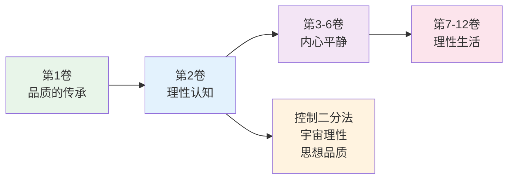
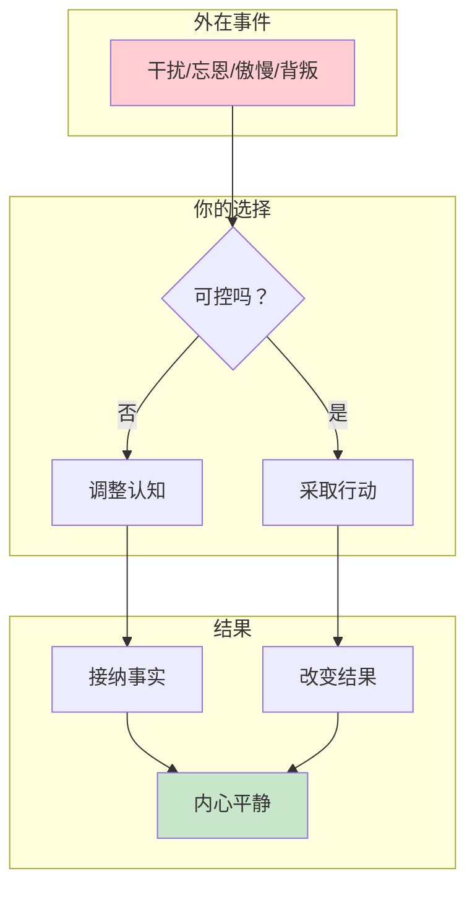
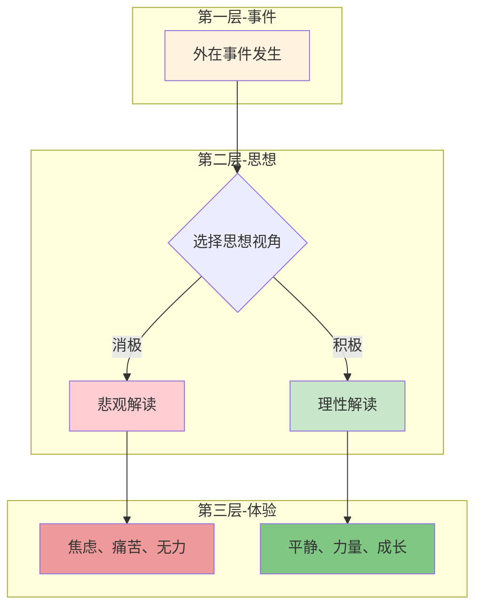
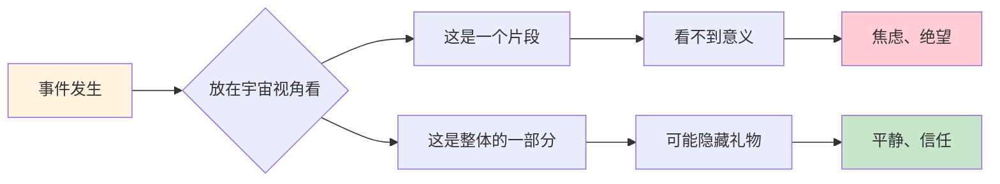
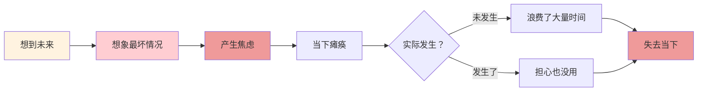

# 《沉思录》第2卷：在逆境中保持理性

> **核心主题**：理性认知与内心平静——如何在外部混乱中保持清醒
> **章节定位**：哲学思考的真正开始，斯多葛核心思想的首次展开
> **阅读时间**：约20分钟

---

## 一、章节定位

### 1.1 这一卷在解决什么问题？

**核心问题**：当外在世界充满混乱和不可控时，我们如何保持内心的平静和理性？

**一句话定位**：
> 外在世界你无法控制，但你可以控制你的思想——真正的力量在内心，而不在外在。

---

### 1.2 这一卷在整本书中的位置



| 维度 | 定位 |
|------|------|
| **功能** | 从品格传承转向哲学思考，建立理性认知框架 |
| **内容** | 控制二分法、宇宙理性、思想品质三大核心 |
| **风格** | 从具体转向抽象，从感恩转向内省 |
| **目的** | 建立面对逆境的心理防御机制 |

---

### 1.3 与第1卷的关联

| 第1卷 | 第2卷 | 递进关系 |
|------|------|----------|
| 从他人身上学习品质 | 从自己内心找到力量 | 外 → 内 |
| 具体的人和事 | 抽象的宇宙理性 | 具体 → 抽象 |
| 感恩清单 | 思想修炼 | 输入 → 内化 |

**递进逻辑**：
```
第1卷：品格从他人传承 → 感恩心态
    ↓
第2卷：力量从内心产生 → 理性认知
    ↓
后续卷：在外在混乱中实践 → 内心平静
```

---

## 二、核心观点（三层提取）

### 观点1：你可以控制你的思想，但不能控制外在事件

#### 【表层】现象层

**奥勒留的原文**（2.1）：
> "Begin each day by telling yourself: Today I shall be meeting with interference, ingratitude, insolence, disloyalty, ill-will, and selfishness..."
> （每天开始时告诉自己：今天我会遇到干扰、忘恩负义、傲慢、背叛、恶意和自私……）

**日常场景**：
- 早上出门，计划被意外打乱
- 工作中，同事的无理取闹
- 生活中，他人的不理解和不配合
- 市场中，不可预测的波动

**降维翻译**：
> **外在世界你可以预料会有麻烦，但你无法阻止麻烦——你能控制的是你如何反应。**

---

#### 【中层】机制层

**控制二分法的心理机制**：



**可控vs不可控的界限**：

| 维度 | 可控 | 不可控 |
|------|------|--------|
| **事件** | 你的选择和行动 | 他人行为、外部环境 |
| **思想** | 你的看法和判断 | 事实本身 |
| **结果** | 你的努力程度 | 最终结果 |
| **时间** | 当下的专注 | 过去和未来 |

---

#### 【底层】规律层

> **控制二分法定律**：真正的自由不是改变外在世界，而是改变你对外在世界的看法。你无法控制发生什么，但永远可以控制你如何反应。

**降维翻译**：
> 你不能阻止下雨，
> 但你可以选择打伞还是淋雨。
> 外在世界你无法决定，
> 但你的反应永远由你选择。

---

### 观点2：人生的幸福取决于思想的品质

#### 【表层】现象层

**奥勒留的原文**（2.2-2.5）：
> "Such as are your habitual thoughts, such also will be the character of your mind..."
> （你习惯性的思想如何，你心灵的品格也将如何……）

**日常场景**：
- 同样的加班，有人抱怨，有人把它看作机会
- 同样的失败，有人消沉，有人把它看作学习
- 同样的批评，有人愤怒，有人把它看作反馈
- 同样的困境，有人绝望，有人把它看作挑战

**降维翻译**：
> **不是发生在你身上的事决定你的体验，而是你如何看待这些事。**

---

#### 【中层】机制层

**思想品质的三层机制**：



**思想品质的三个维度**：

| 维度 | 低品质思想 | 高品质思想 |
|------|------------|------------|
| **时间导向** | 活在过去（后悔）或未来（焦虑） | 活在当下（行动） |
| **归因方式** | 外归因（都是别人的错） | 内归因（我能做什么） |
| **情绪管理** | 被情绪驱动 | 驾驭情绪 |

---

#### 【底层】规律层

> **思想品质定律**：同样的外在事件，不同的人会有完全不同的体验。决定幸福的关键不是发生了什么，而是你怎么看待发生的事。

**降维翻译**：
> 事件是中性的石头，
> 你的思想是雕刻刀。
> 同一块石头，
> 有人刻出痛苦，有人刻出力量。

---

### 观点3：宇宙是有序的理性整体

#### 【表层】现象层

**奥勒留的原文**（2.1-2.4）：
> "All things are interwoven with one another; a sacred bond unites them..."
> （万物相互交织，神圣的纽带将它们联系在一起……）

**日常场景**：
- 塞翁失马，焉知非福——坏事可能变成好事
- 今天的挫折，可能是明天的礼物
- 失去一个机会，可能得到更好的机会
- 被人误解，可能是认清真相的契机

**降维翻译**：
> **每一件事都是宇宙大网的一部分，你永远不知道一个"坏事"会如何变成"好事"。**

---

#### 【中层】机制层

**宇宙理性的认知框架**：



**宇宙理性的三个视角**：

| 视角 | 狭隘视角 | 宇宙视角 |
|------|----------|----------|
| **时间** | 只看当下 | 看到长远 |
| **因果** | 只看片段 | 看到整体 |
| **意义** | 只看表面 | 看到深层 |

---

#### 【底层】规律层

> **宇宙理性定律**：宇宙是有序的整体，万物相互联系。你无法看到全貌，但可以相信每件事都是大计划的一部分。

**降维翻译**：
> 你是一本书中的一个字，
> 你看不到整本书的内容，
> 但每一个字都有它的位置。
> 相信整体，相信过程。

---

### 观点4：专注当下，不为未来担忧

#### 【表层】现象层

**奥勒留的原文**（2.12-2.14）：
> "Do not be disturbed. Be simple. Does someone do wrong? He does wrong to himself..."
> （不要被干扰。保持简单。有人做错了吗？他是对自己做错……）

**日常场景**：
- 为还没发生的工作焦虑
- 为不会发生的风险担心
- 为不确定的未来恐惧
- 为可能的结果预设痛苦

**降维翻译**：
> **为将来担忧，是对当下的双重浪费——既浪费了当下，又不会改变将来。**

---

#### 【中层】机制层

**担忧的心理陷阱**：



**担忧vs准备的对比**：

| 行为 | 担忧 | 准备 |
|------|------|------|
| **焦点** | 想象最坏情况 | 做好当下能做的 |
| **情绪** | 焦虑、恐惧 | 平静、专注 |
| **行动** | 瘫痪 | 有力 |
| **结果** | 浪费时间 | 有备无患 |

---

#### 【底层】规律层

> **当下定律**：为将来担忧是对当下的双重浪费。最有效的是专注当下，做好现在能做的，剩下的交给宇宙。

**降维翻译**：
> 明天自有明天的烦恼，
> 今天已经有今天的事。
> 别用明天的担忧，
> 偷走今天的平静。

---

## 三、金句库

### 原文金句

1. "Begin each day by telling yourself: Today I shall be meeting with interference, ingratitude, insolence, disloyalty, ill-will, and selfishness..."（2.1）
2. "Such as are your habitual thoughts, such also will be the character of your mind..."（2.2）
3. "All things are interwoven with one another; a sacred bond unites them..."（2.4）
4. "Do not be disturbed. Be simple."（2.12）
5. "The universe is transformation; our life is what our thoughts make it."（2.2-2.5整合）
6. "Whatever happens to you has been waiting to happen from time eternal."（2.3）

---

### 降维金句（人话版）

1. **外在世界你可以预料会有麻烦，但你无法阻止——你能控制的是你如何反应。**
2. **不是发生在你身上的事决定你的体验，而是你如何看待这些事。**
3. **每一件事都是宇宙大网的一部分，你永远不知道一个"坏事"会如何变成"好事"。**
4. **为将来担忧，是对当下的双重浪费——既浪费了当下，又不会改变将来。**
5. **你不能阻止下雨，但你可以选择打伞还是淋雨。**
6. **事件是中性的石头，你的思想是雕刻刀。**
7. **你是一本书中的一个字，你看不到整本书，但每一个字都有它的位置。**
8. **明天自有明天的烦恼，今天已经有今天的事。**

---

## 四、当下映射

### 2026年读者的困惑

|------|------------|----------|
| 为什么我总是焦虑？ | 你在试图控制不可控的事 | "原来如此" |
| 如何面对不确定的未来？ | 专注当下，做好现在能做的 | "有方法了" |
| 为什么同样的事，别人不痛苦，我痛苦？ | 思想品质不同，体验就不同 | "原来可以改变" |
| 如何在混乱中保持平静？ | 控制你控制的，接受你不能控制的 | "释然了" |

---

### 现代应用场景

**场景1：职场不确定性**
- 外在事件：公司裁员、行业变化、AI替代
- 可控：提升技能、保持学习、建立人脉
- 不可控：公司决策、行业趋势、技术发展
- 应用：专注可控的，接受不可控的

**场景2：人际关系冲突**
- 外在事件：他人的误解、批评、背叛
- 可控：你的反应、你的沟通、你的边界
- 不可控：他人的想法、行为、选择
- 应用：不为他人的错误惩罚自己

**场景3：投资市场波动**
- 外在事件：市场涨跌、黑天鹅事件
- 可控：你的仓位、你的策略、你的情绪
- 不可控：市场走势、他人行为、宏观环境
- 应用：做你该做的，接受你改变不了的

---

## 五、章节关联

### 与《沉思录》其他章节的关联

| 章节 | 关联类型 | 共同逻辑 |
|------|----------|----------|
| **第1卷** | 承接 | 品格传承 → 内心力量 |
| **第2卷** | 核心 | 理性认知框架 |
| **第3卷** | 延伸 | 当下专注的深化 |
| **第4卷** | 应用 | 内心平静的实践 |
| **第5卷** | 行动 | 理性生活的展开 |

**核心思想递进**：
```
第2卷：控制二分法（认知）
    ↓
第4卷：内心平静（结果）
    ↓
第8卷：理性生活（实践）
```

---

### 与其他书籍的关联

| 书籍 | 关联类型 | 共同底层逻辑 |
|------|----------|--------------|

**东西方智慧共鸣**：
```
《沉思录》：宇宙理性 → 顺应宇宙 → 内心平静
《道德经》：道法自然 → 顺应自然 → 无为而治
共同逻辑：接受大于你力量的事物，专注你能控制的
```

---

## 六、问答设计

### Q1：为什么奥勒留每天早上都要预设会遇到麻烦？这不是很悲观吗？

**A**: 这不是悲观，而是真正的乐观。你预设会遇到麻烦，所以当麻烦来临时，你不会被打乱——你早就准备好了。真正的乐观不是相信一切都会顺利，而是相信无论发生什么，你都能应对。

---

### Q2：控制二分法听起来很简单，但做起来很难，怎么办？

**A**: 三个步骤：
1. **觉察**：当你感到焦虑或愤怒时，问自己"这是我能控制的吗？"
2. **分类**：把事情分成可控和不可控两类
3. **行动**：对可控的采取行动，对不可控的调整认知

这是一个需要练习的技能，越练习越自然。

---

### Q3：宇宙理性听起来太玄了，我如何相信它？

**A**: 你不需要"相信"，你只需要"试用"。当你遇到一件"坏事"时，试着问自己：
- 这件事放在更长的时间看，可能有什么意义？
- 有没有可能这是一个隐藏的礼物？
- 塞翁失马，焉知非福？

你不必相信宇宙有计划，但你可以相信你无法看到全貌。这种谦卑会带来平静。

---

### Q4：我的思想品质很低，总是消极悲观，如何提升？

**A**: 三个练习：
1. **命名你的思想**：当你有消极想法时，给它一个名字，比如"我又在灾难化了"
2. **质疑你的想法**：问自己"这个想法是真的吗？有帮助吗？"
3. **选择新的视角**：问自己"还有其他看待这件事的方式吗？"

思想品质像肌肉，可以通过练习增强。

---

### Q5：第2卷和第1卷有什么区别？为什么要分开？

**A**: 第1卷讲的是"品格从哪里来"——从他人身上传承。第2卷讲的是"力量从哪里来"——从自己内心产生。第1卷是感恩，第2卷是内省。它们共同构成了斯多葛哲学的基础：外在有榜样，内在有力量。

---

## 七、实践练习

### 练习1：每天早上的"麻烦预设"

按照奥勒留的方式，每天早上对自己说：

> "今天我会遇到干扰、忘恩负义、傲慢、背叛、恶意和自私。这些都是因为人们不知道什么是善什么是恶。但我不会被他们伤害，因为我深知什么是善什么是恶，我不会被任何人的错误所伤害。"

然后问自己：
- 今天可能遇到什么麻烦？
- 哪些是我能控制的？
- 我如何准备好应对？

---

### 练习2：控制二分法日记

遇到让你焦虑或愤怒的事时，填写以下表格：

| 事件 | 可控的部分 | 不可控的部分 | 我的行动 |
|------|-----------|-------------|----------|
| 示例：老板批评 | 我的反应、我的改进 | 老板的情绪、老板的评价 | 吸收有用反馈，忽略情绪攻击 |
|  |  |  |  |

---

### 练习3：思想品质升级

当你发现自己有消极想法时：

1. **觉察**：写下你的消极想法
2. **质疑**：这个想法是真的吗？有帮助吗？
3. **替换**：找到一个更有帮助的想法

| 消极想法 | 是真的吗？ | 有帮助吗？ | 替换想法 |
|----------|-----------|-----------|----------|
| 示例：这事一定会失败 | 不一定 | 没有 | 我不知道结果，但我可以做最好的准备 |
|  |  |  |  |

---

## 八、章节总结

### 核心公式

```
逆境中保持理性 = 控制二分法 + 思想品质管理 + 宇宙理性视角 + 专注当下
```

### 一句话总结

> 外在世界你可以预料会有麻烦，但你无法阻止——你能控制的是你的思想、你的选择、你的反应。真正的力量不在外在，而在内心。

### 第2卷的核心贡献

1. **控制二分法**：区分可控与不可控，专注可控
2. **思想品质**：你的思想决定你的体验
3. **宇宙理性**：相信整体，相信过程
4. **当下专注**：不为未来担忧，活在当下

这四个工具，构成了面对逆境的理性防御系统。

---
