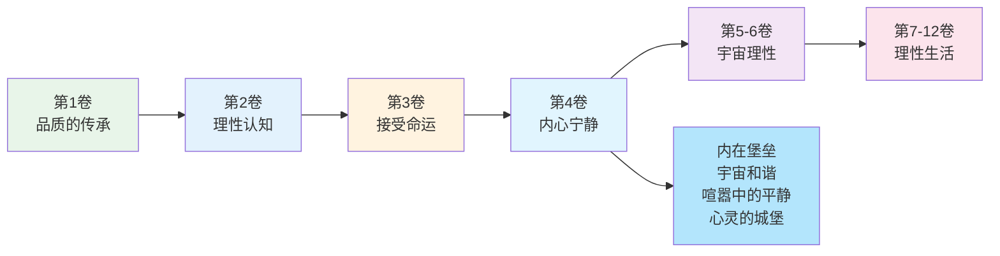
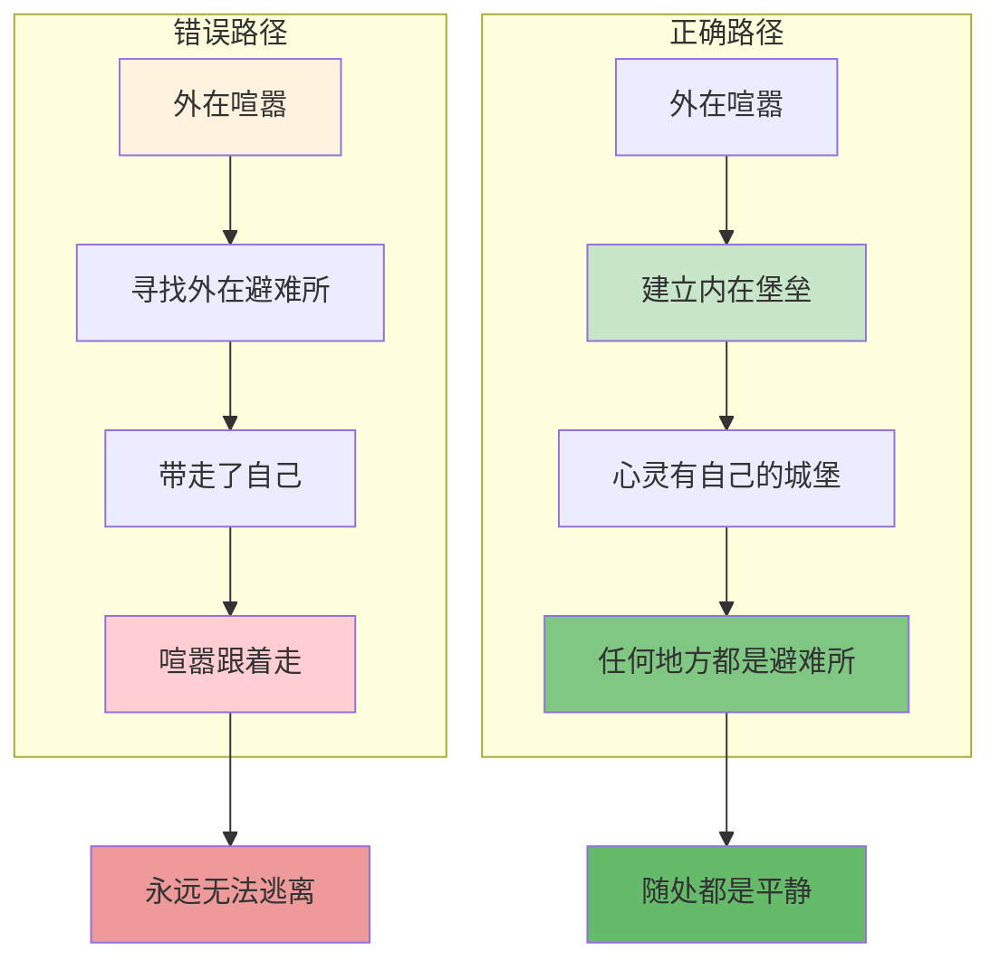
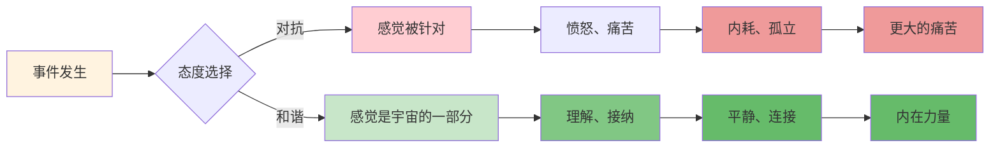
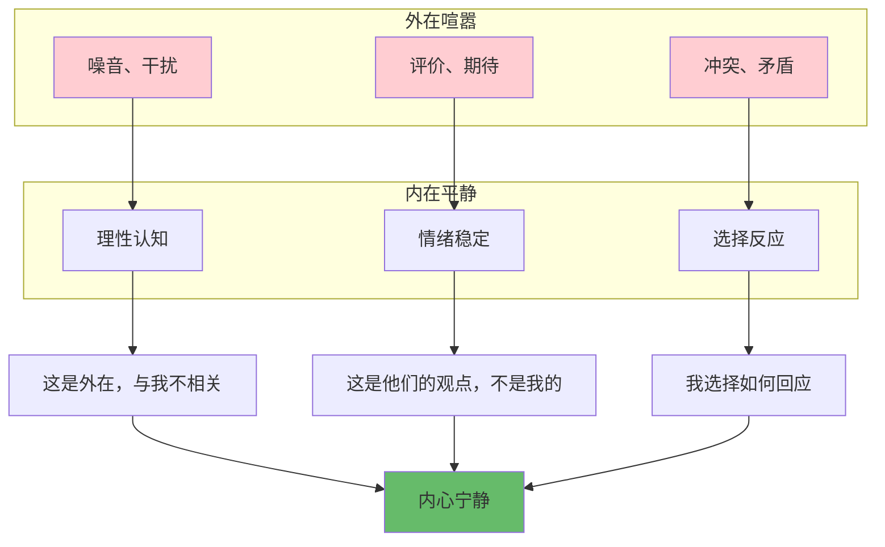
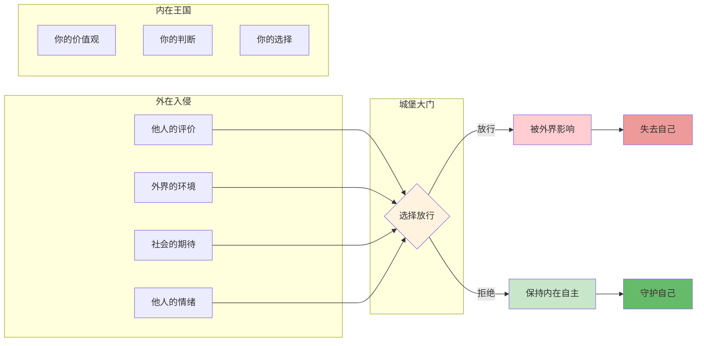

# 《沉思录》第4卷：内心的宁静

> **核心主题**：内心的宁静——如何在喧嚣中保持内心平静
> **章节定位**：从接受命运转向内在状态，建立不可动摇的内在堡垒
> **阅读时间**：约30分钟

---

## 一、章节定位

### 1.1 这一卷在解决什么问题？

**核心问题**：外在世界永远充满喧嚣和混乱，我们如何在外在纷扰中保持内心的宁静？如何建立一个不受外界干扰的"内在堡垒"？

**一句话定位**：
> 外在世界可以喧嚣，但你的内心可以是一座安静的城堡——真正的平静不是外在没有风暴，而是内在找到避风港。

---

### 1.2 这一卷在整本书中的位置



| 维度 | 定位 |
|------|------|
| **功能** | 从生命态度转向内在状态，建立不可动摇的内在平静 |
| **内容** | 内在堡垒、宇宙和谐、喧嚣中的平静、心灵的城堡四大核心 |
| **风格** | 更加内在和深刻，从"如何活着"转向"如何存在" |
| **目的** | 建立一个不受外界干扰的内在避风港 |

---

### 1.3 与第3卷的关联

| 第3卷 | 第4卷 | 递进关系 |
|------|------|----------|
| 接受命运 | 内心宁静 | 态度 → 状态 |
| 面对无常 | 建立堡垒 | 应对外 → 建构内 |
| 专注当下 | 宇宙和谐 | 时间观 → 存在观 |
| 生命有限 | 永恒的当下 | 有限 → 无限感 |

**递进逻辑**：
```
第2卷：控制二分法 → 专注可控
    ↓
第3卷：接受命运 → 珍惜当下
    ↓
第4卷：建立内在堡垒 → 内心宁静
```

---

## 二、核心观点（三层提取）

### 观点1：建立你的内在堡垒

#### 【表层】现象层

**奥勒留的原文**（4.3, 4.25）：
> "Men seek retreats for themselves, houses in the country, seashores, and mountains... but this is altogether a mark of the most common sort of men... retreat into this little plot of land and there be free."
> （人们为自己寻找隐居之地，乡间别墅、海边、山中……但这只是最普通的人的做法……退回到这个小块土地上，在那里获得自由。）

**日常场景**：
- 周末逃离城市，却带去了焦虑
- 休假去度假，却还在处理工作
- 一个人待着，脑子里还是乱糟糟
- 以为换个环境就能获得平静

**降维翻译**：
> **真正的平静不在远方，而在内心——你可以逃到世界尽头，但带不走的是你自己。**

---

#### 【中层】机制层

**内在堡垒的建构机制**：



**外在避难所vs内在堡垒的对比**：

| 维度 | 外在避难所 | 内在堡垒 |
|------|-----------|----------|
| **位置** | 海边、山中、乡间 | 你的心灵 |
| **成本** | 需要金钱和时间 | 随时可用 |
| **携带性** | 无法携带 | 随身携带 |
| **效果** | 临时缓解 | 永久有效 |
| **依赖** | 依赖外在条件 | 依赖自己 |

---

#### 【底层】规律层

> **内在堡垒定律**：真正的平静不在外在环境，而在内在状态。建立一个不受外界干扰的心灵城堡，你才能在任何地方、任何情况下保持平静。

**降维翻译**：
> 你可以逃到海边，
> 但带不走的是你自己。
> 真正的避难所，
> 是你心灵里的那座城堡。

---

### 观点2：与宇宙和谐，而非对抗

#### 【表层】现象层

**奥勒留的原文**（4.23, 4.46）：
> "All things are implicated with one another... the whole world is a kind of communal body."
> （所有事物都相互关联……整个世界就像一个共同体。）

**日常场景**：
- 感觉自己和世界格格不入
- 总是对抗发生的事
- 抱怨"为什么是我"
- 觉得命运在和自己作对

**降维翻译**：
> **你不是宇宙的敌人，而是宇宙的一部分——与它和谐，而不是对抗。**

---

#### 【中层】机制层

**与宇宙和谐的心理机制**：



**对抗vs和谐的对比**：

| 维度 | 与宇宙对抗 | 与宇宙和谐 |
|------|-----------|-----------|
| **态度** | "为什么是我" | "这是宇宙的一部分" |
| **感觉** | 被针对、孤立 | 连接、归属 |
| **能量** | 消耗在抗拒 | 用于接纳和成长 |
| **结果** | 痛苦、疲惫 | 平静、力量 |

---

#### 【底层】规律层

> **宇宙和谐定律**：你不是一个孤独的个体，而是宇宙整体的一部分。当你的意志与宇宙的意志一致时，你就获得了平静。不是宇宙应该改变来适应你，而是你应该适应宇宙。

**降维翻译**：
> 你不是宇宙的敌人，
> 你是宇宙的一部分。
> 当你和它一致时，
> 你就找到了平静。

---

### 观点3：喧嚣中的平静

#### 【表层】现象层

**奥勒留的原文**（4.49）：
> "Be like the cliff against which the waves continually break; but it stands firm and tames the fury of the water around it."
> （像那块悬崖，海浪不断拍打它，但它依然矗立，平息周围海水的愤怒。）

**日常场景**：
- 办公室的噪音和干扰
- 家人的吵闹和需求
- 社交媒体的信息轰炸
- 外界的评价和期待

**降维翻译**：
> **平静不是没有风暴，而是风暴中的宁静——像悬崖一样，海浪拍打，但依然矗立。**

---

#### 【中层】机制层

**喧嚣中保持平静的机制**：



**两种应对喧嚣的方式**：

| 维度 | 被喧嚣淹没 | 在喧嚣中保持平静 |
|------|-----------|------------------|
| **态度** | 反应、抵抗 | 观察、选择 |
| **结果** | 疲惫、焦虑 | 平静、有力 |
| **能量** | 被消耗 | 被保留 |
| **自我** | 被外界定义 | 由自己定义 |

---

#### 【底层】规律层

> **喧嚣中的平静定律**：平静不是外在环境的缺失，而是内在态度的选择。真正的平静是在喧嚣中找到宁静，在混乱中找到秩序，在风暴中找到稳定——像悬崖一样，任凭海浪拍打，依然矗立。

**降维翻译**：
> 平静不是没有风暴，
> 而是风暴中的宁静。
> 不是世界安静了，
> 而是你的心安静了。

---

### 观点4：心灵的城堡

#### 【表层】现象层

**奥勒留的原文**（4.3）：
> "Within your will alone is your happiness... keep this fortress of your own."
> （在你的意志里，有你的幸福……守护好你自己的这座堡垒。）

**日常场景**：
- 被别人的评价轻易影响
- 被外界的环境轻易干扰
- 被他人的情绪轻易传染
- 被社会的标准轻易绑架

**降维翻译**：
> **你的心灵是一座城堡，只有你能决定谁能进入——守护好它，你的幸福在里面。**

---

#### 【中层】机制层

**心灵城堡的守护机制**：



**城堡大门的守卫标准**：

| 入侵者 | 是否放行 | 理由 |
|--------|----------|------|
| 他人的评价 | 拒绝 | 这是他们的观点，不是我的事实 |
| 外界的环境 | 选择 | 我无法改变，但可以选择反应 |
| 社会的期待 | 拒绝 | 我有自己的价值观 |
| 他人的情绪 | 拒绝 | 这是他们的情绪，不是我的 |

---

#### 【底层】规律层

> **心灵城堡定律**：你的心灵是你唯一的王国，只有你能决定谁能进入。当你让别人随意进入，你就失去了自己。守护好城堡的大门，你的幸福在里面。

**降维翻译**：
> 你的心灵是一座城堡，
> 你是唯一的守门人。
> 放谁进来，
> 决定你是谁。

---

## 三、金句库

### 原文金句

1. "Retreat into this little plot of land and there be free."（4.3）
2. "Be like the cliff against which the waves continually break."（4.49）
3. "Within your will alone is your happiness."（4.3）
4. "All things are implicated with one another."（4.23）
5. "The universe is change; life is opinion."（4.3）
6. "Take away your opinion, and there is taken away the complaint."（4.7）
7. "It is in your power to withdraw yourself whenever you desire."（4.29）
8. "Where it is possible to live, it is possible to live well."（4.33）

---

### 降维金句（人话版）

1. **真正的避难所不在远方，而在你的心灵里。**
2. **像悬崖一样，海浪拍打，但依然矗立——平静不是没有风暴，而是风暴中的宁静。**
3. **你的幸福在你的意志里，不在外在条件里。**
4. **你不是宇宙的敌人，而是宇宙的一部分——与它和谐，而不是对抗。**
5. **世界是什么样子，取决于你怎么看它——改变你的观点，就改变了你的世界。**
6. **拿走你的抱怨，就拿走了你的痛苦——抱怨是你自己加给自己的。**
7. **你可以随时从任何情境中撤退——这是你的权力。**
8. **哪里可以活着，哪里就可以活好——问题不在环境，而在态度。**

---

## 四、当下映射

### 2026年读者的困惑

|------|------------|----------|
| 为什么我总是感到焦虑，换个环境也没用？ | 因为你带走的是你自己——真正的平静在内在，不在外在 | "原来如此" |
| 如何在信息轰炸中保持清醒？ | 建立心灵城堡，只放行有价值的信息 | "有方法了" |
| 如何不被他人的评价影响？ | 你的心灵是城堡，你是守门人——拒绝入侵 | "有力量了" |
| 为什么感觉和世界格格不入？ | 你在对抗，而不是和谐——接纳你是宇宙的一部分 | "释然了" |
| 如何在混乱中找到平静？ | 平静不是外在没有风暴，而是内在找到宁静 | "方向明确了" |

---

### 现代应用场景

**场景1：城市生活焦虑**
- 困惑：城市太喧嚣，总想逃离
- 根源：以为平静在外在环境
- 应用：建立内在堡垒，任何地方都是避难所

**场景2：社交媒体内耗**
- 困惑：被他人的展示和评价影响
- 根源：城门大开，所有人随意进出
- 应用：建立城门守卫标准，只放行有价值的信息

**场景3：职场人际关系**
- 困惑：被他人的情绪和评价影响
- 根源：把城门钥匙给了别人
- 应用：收回城门钥匙，自己决定被什么影响

**场景4：生活不确定性**
- 困惑：感觉世界在和自己作对
- 根源：在与宇宙对抗，而不是和谐
- 应用：接纳你是宇宙的一部分，与它一致

---

## 五、章节关联

### 与《沉思录》其他章节的关联

| 章节 | 关联类型 | 共同逻辑 |
|------|----------|----------|
| **第2卷** | 基础 | 控制二分法 → 内在堡垒的边界 |
| **第3卷** | 承接 | 接受命运 → 宇宙和谐 |
| **第4卷** | 核心 | 内在堡垒、宇宙和谐、喧嚣中的平静 |
| **第5卷** | 深化 | 内在宁静 → 理性生活 |
| **第8卷** | 应用 | 内在堡垒的实践 |

**核心思想递进**：
```
第2卷：控制你控制的（边界）
    ↓
第3卷：接受你无法控制的（态度）
    ↓
第4卷：建立内在堡垒（状态）
    ↓
第5卷：理性地生活（实践）
```

---

### 与其他书籍的关联

| 书籍 | 关联类型 | 共同底层逻辑 |
|------|----------|--------------|
| **《道德经》** | 🔗跨时空呼应 | 致虚极守静笃 ≈ 内在堡垒 |
| **《庄子》** | 🔗心灵自由 | 心斋 ≈ 内心的宁静 |
| **《心流》米哈里** | 🔗现代心理学 | 内在秩序 ≈ 心灵城堡 |
| **《被讨厌的勇气》阿德勒** | 🔗自我主张 | 课题分离 ≈ 城门守卫 |

**东西方智慧共鸣**：
```
《沉思录》：建立内在堡垒 → 喧嚣中的平静
《道德经》：致虚极守静笃 → 内心的宁静
《庄子》：心斋 → 精神的自由
共同逻辑：建立内在的避难所，在外在喧嚣中保持平静
```

---

## 六、问答设计

### Q1：什么是"内在堡垒"？如何建立？

**A**: 内在堡垒是一个心灵的避难所——一个在任何情况下都可以退回到的内在空间。

**如何建立**：

1. **划定边界**：知道什么是你控制的，什么不是
2. **建立守卫**：有意识地问"这是否值得进入我的心灵"
3. **练习撤退**：每天花时间退回到这个内在空间
4. **反复强化**：像盖房子一样，一块砖一块砖地建

**练习方法**：
每天花10分钟，闭上眼睛，想象你的心灵是一座城堡。问自己：今天我让什么进入了这座城堡？有什么是不该进入的？

---

### Q2：如何在喧嚣的环境中保持平静？

**A**: 三个实用方法：

1. **悬崖心态**：想象自己是一块悬崖，海浪（噪音、干扰）拍打你，但你依然矗立。不是海浪不存在，而是你不被它推动。

2. **观察者模式**：把喧嚣当成电影，你是观众。不是你在喧嚣中，而是喧嚣在你周围发生。

3. **选择反应**：问自己"这件事值得我消耗能量吗？"如果不值得，就选择不反应。

**记住**：平静不是外在没有风暴，而是内在找到宁静。

---

### Q3：如何不被他人的评价影响？

**A**: 建立城门守卫标准：

| 评价类型 | 守卫决策 | 理由 |
|----------|----------|------|
| 建设性批评 | 放行并学习 | 可以帮助你成长 |
| 情绪化攻击 | 拒绝 | 这是他们的情绪，不是你的事实 |
| 社会比较 | 拒绝 | 你有自己的价值观 |
| 专业反馈 | 放行并评估 | 这是事实，不是观点 |

**关键问题**：问自己"这个评价是事实还是观点？"如果是观点，你可以选择不接受。

---

### Q4：与宇宙和谐是什么意思？这听起来很抽象？

**A**: 与宇宙和谐不是玄学，而是一种态度转变：

**对抗的心态**：
- "为什么是我？"
- "这不公平"
- "世界在和我作对"

**和谐的心态**：
- "这是宇宙的一部分"
- "这不是针对我，而是自然发生"
- "我能从中学到什么"

**实践方法**：当不愉快的事发生时，不要问"为什么是我"，而是问"这是宇宙在教我什么"。

---

### Q5：第4卷和第3卷有什么区别？都是讲平静，有什么不同？

**A**: 第3卷和第4卷的区别：

| 第3卷 | 第4卷 |
|------|------|
| 接受命运 | 建立内在堡垒 |
| 面对无常的态度 | 保持平静的状态 |
| 生命有限 | 宇宙无限 |
| 专注当下 | 与宇宙和谐 |

**递进关系**：第3卷教你怎么看待发生的事（接受），第4卷教你怎么保持内在状态（平静）。接受了（第3卷），才能建立堡垒（第4卷）。

---

## 七、实践练习

### 练习1：内在堡垒冥想

每天花10分钟：

1. 闭上眼睛，想象你的心灵是一座城堡
2. 想象城堡有高高的城墙和坚固的大门
3. 问自己：今天我让什么进入了这座城堡？
4. 有什么是该被拒绝在门外的？
5. 加固城墙，明天更严格地守卫

这个练习会让你意识到你让多少不该进入的东西进入了你的心灵。

---

### 练习2：城门守卫日记

每天晚上花5分钟填写：

| 今天进入我心灵的是什么 | 是我选择的还是被动接受的 | 明天我会如何守卫 |
|------------------------|------------------------|-----------------|
| 示例：同事的抱怨 | 被动接受 | 告诉他我不想听负面内容 |
|  |  |  |
|  |  |  |

---

### 练习3：悬崖心态练习

当你感到被外界干扰时：

1. 闭上眼睛，深呼吸
2. 想象自己是一块悬崖
3. 外界的喧嚣是海浪，拍打你
4. 你依然矗立，不被推动
5. 对自己说："海浪存在，但我不被它推动"

这个练习可以在任何时候做，只需要30秒。

---

## 八、章节总结

### 核心公式

```
内心宁静 = 建立内在堡垒 + 与宇宙和谐 + 喧嚣中的平静 + 守护心灵城堡
```

### 一句话总结

> 外在世界可以喧嚣，但你的内心可以是一座安静的城堡——真正的平静不是外在没有风暴，而是内在找到避风港。

### 第4卷的核心贡献

1. **内在堡垒**：真正的避难所在心灵里，不在外在环境
2. **宇宙和谐**：你是宇宙的一部分，与它和谐而不是对抗
3. **喧嚣中的平静**：平静不是没有风暴，而是风暴中的宁静
4. **心灵城堡**：你是城门的守卫，决定谁能进入

这四个工具，构成了在喧嚣世界中保持内心宁静的完整体系。

---
