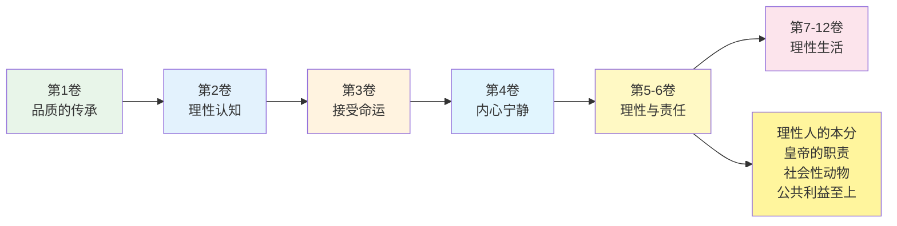
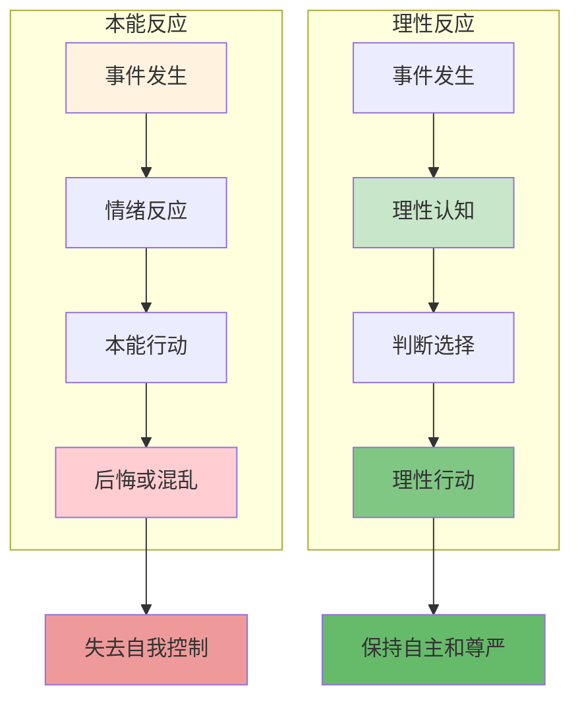
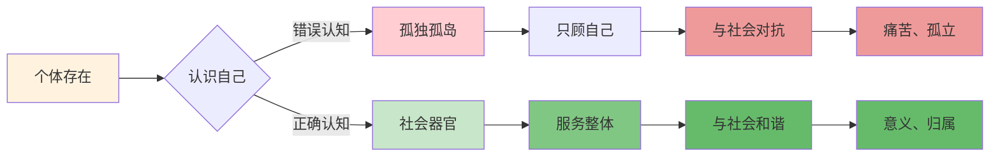
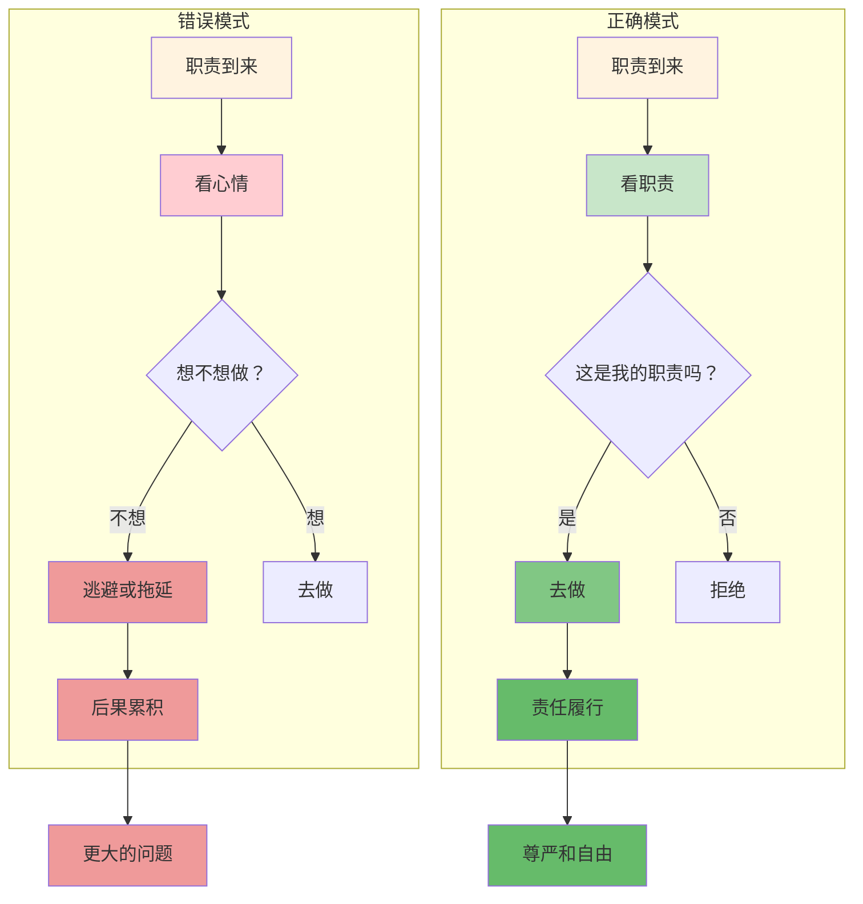
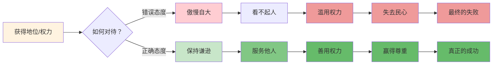

# 《沉思录》第5卷：理性与责任

> **核心主题**：理性与责任——作为理性人的本分和作为皇帝的职责
> **章节定位**：从内在状态转向外在行动，理性如何指导责任实践
> **阅读时间**：约35分钟

---

## 一、章节定位

### 1.1 这一卷在解决什么问题？

**核心问题**：作为一个理性的人，我们有什么责任？作为一个有社会角色的人，我们如何用理性履行职责？奥勒留作为皇帝，如何在繁重的责任中保持理性和尊严？

**一句话定位**：
> 理性不是逃避责任,而是更好地履行责任——你的理性应该服务于公共利益,而不是逃避社会责任。

---

### 1.2 这一卷在整本书中的位置



| 维度 | 定位 |
|------|------|
| **功能** | 从内在状态转向外在行动，理性如何指导责任实践 |
| **内容** | 理性人的本分、社会性动物的责任、皇帝的职责、公共利益 |
| **风格** | 更加实践和具体，从"如何存在"转向"如何行动" |
| **目的** | 建立理性生活的实践框架，用理性指导责任履行 |

---

### 1.3 与第4卷的关联

| 第4卷 | 第5卷 | 递进关系 |
|------|------|----------|
| 内在宁静 | 理性责任 | 状态 → 行动 |
| 建立堡垒 | 履行职责 | 内在 → 外在 |
| 守护心灵 | 服务社会 | 自我 → 他人 |
| 内向关注 | 外向行动 | 独处 → 共处 |

**递进逻辑**：
```
第2卷：控制二分法 → 专注可控
    ↓
第3卷：接受命运 → 珍惜当下
    ↓
第4卷：建立内在堡垒 → 内心宁静
    ↓
第5卷：理性指导行动 → 履行责任
```

---

## 二、核心观点（三层提取）

### 观点1：理性是人的本质，也是人的责任

#### 【表层】现象层

**奥勒留的原文**（5.1, 5.16）：
> "Rational creatures are formed for one another... to act against one's will is to offend against nature."
> （理性的生物是为了彼此而存在的……违背自己的意志行事就是违背自然。）

**日常场景**：
- 放纵情绪，不做理性判断
- 明知该做却拖延不做
- 被本能和欲望驱动，而非理性
- 逃避本该履行的责任

**降维翻译**：
> **你的理性不是装饰品，而是你的本质——用理性指导行动，才是真正的人。**

---

#### 【中层】机制层

**理性指导行动的机制**：



**本能驱动vs理性驱动的对比**：

| 维度 | 本能驱动 | 理性驱动 |
|------|---------|---------|
| **决策依据** | 情绪、欲望 | 事实、逻辑 |
| **时间视野** | 即时满足 | 长期利益 |
| **后果承担** | 后悔 | 无悔 |
| **自我感觉** | 被控制 | 自主 |

---

#### 【底层】规律层

> **理性责任定律**：理性不是让你逃避责任，而是让你更好地履行责任。违背理性就是违背你的本质，用理性指导行动才是真正的人。

**降维翻译**：
> 理性不是枷锁，
> 而是你的指南针。
> 顺着它走，
> 才是真正的自由。

---

### 观点2：人是社会性动物，为公共利益而存在

#### 【表层】现象层

**奥勒留的原文**（5.16, 5.22）：
> "We are made for cooperation, like feet, like hands, like eyelids, like the rows of the upper and lower teeth."
> （我们是为了合作而生的，就像脚、手、眼睑、上下牙齿一样。）

**日常场景**：
- 只顾自己的利益，不顾他人
- 逃避团队和社会责任
- 认为自己可以独自成功
- 把他人当工具而非伙伴

**降维翻译**：
> **你不是孤独的孤岛，而是社会的一部分——你的存在意义，在于为公共利益服务。**

---

#### 【中层】机制层

**社会性动物的责任机制**：



**个体vs整体的对比**：

| 维度 | 孤独个体 | 社会器官 |
|------|---------|---------|
| **自我定位** | 孤立存在 | 整体的一部分 |
| **行动目标** | 个人利益 | 公共利益 |
| **存在意义** | 自我实现 | 服务整体 |
| **内在感受** | 孤独、对抗 | 归属、和谐 |

---

#### 【底层】规律层

> **社会性定律**：人天生是社会性动物。你的存在不是为了你自己，而是为了整体。当你把自己当成社会的一个器官，你就找到了存在的意义。

**降维翻译**：
> 你不是孤岛，
> 你是大陆的一部分。
> 为整体服务，
> 你的生命才有意义。

---

### 观点3：履行你的职责，不管心情如何

#### 【表层】现象层

**奥勒留的原文**（5.1, 5.6）：
> "At dawn, when you have trouble getting out of bed, tell yourself: 'I have to go to work — as a human being.'"
> （黎明时分，当你难以起床时，告诉自己：'作为一个人类，我必须去工作。'）

**日常场景**：
- 不想起床，不想工作
- 心情不好，就想逃避
- 觉得太累，就推卸责任
- 没有动力，就想放弃

**降维翻译**：
> **你的职责不因你的心情而改变——该做的事,不管你想不想,都要做。**

---

#### 【中层】机制层

**职责履行的机制**：



**两种决策方式**：

| 维度 | 心情驱动 | 职责驱动 |
|------|---------|---------|
| **决策标准** | 我想不想 | 我该不该 |
| **后果考虑** | 即时感受 | 长期责任 |
| **自我定位** | 情绪的奴隶 | 责任的主人 |
| **内在状态** | 被动、混乱 | 主动、有序 |

---

#### 【底层】规律层

> **职责定律**：职责不因心情而改变。真正成熟的人，是做了该做的事，不管想不想。你的尊严在于履行职责，而不在于随心所欲。

**降维翻译**：
> 成熟就是：
> 该做的事，不管想不想，都去做。
> 不该做的事，不管多想，都不做。
> 这就是自由。

---

### 观点4：作为皇帝，如何保持理性和谦逊

#### 【表层】现象层

**奥勒留的原文**（5.16, 5.17）：
> "Remember that you are an emperor's son... but do not be arrogant about this."
> （记住你是皇帝的儿子……但不要因此傲慢。）

**日常场景**：
- 地位高了，就看不起人
- 权力大了，就忘乎所以
- 成功了，就自以为是
- 被奉承，就飘飘然

**降维翻译**：
> **你的地位是外在的，你的品格是内在的——不要让地位腐蚀了你的品格。**

---

#### 【中层】机制层

**权力与谦逊的平衡机制**：



**两种对待权力的态度**：

| 维度 | 傲慢 | 谦逊 |
|------|------|------|
| **自我定位** | 凌驾他人 | 服务他人 |
| **权力用途** | 个人利益 | 公共利益 |
| **对待他人** | 轻视、利用 | 尊重、服务 |
| **长期结果** | 失去民心 | 赢得尊重 |

---

#### 【底层】规律层

> **权力谦逊定律**：地位和权力是外在的赋予，品格和智慧是内在的修养。真正强大的人，是有权力但保持谦逊，有地位但服务他人。权力不是让你傲慢，而是让你更好地服务。

**降维翻译**：
> 地位是你的座位，
> 品格是你的样子。
> 别让座位改变了样子，
> 要用品格坐稳座位。

---

## 三、金句库

### 原文金句

1. "At dawn, when you have trouble getting out of bed, tell yourself: 'I have to go to work — as a human being.'"（5.1）
2. "We are made for cooperation, like feet, like hands, like eyelids."（5.16）
3. "Rational creatures are formed for one another."（5.1）
4. "To act against one's will is to offend against nature."（5.16）
5. "What brings no benefit to the hive brings none to the bee."（5.22）
6. "Men exist for the sake of one another."（5.16）
7. "Either the gods have power or they have not."（5.30）
8. "No longer talk at all about the kind of man a good man ought to be, but be such."（5.16）

---

### 降维金句（人话版）

1. **早上起不来？告诉自己：作为一个人，我有我的职责。**
2. **我们生来就是为了合作——像手脚、眼睑、上下牙齿一样配合。**
3. **理性的生物是为彼此而存在的——你不是孤岛，你是大陆的一部分。**
4. **违背自己的意志行事，就是违背自然——用理性指导行动，才是真正的人。**
5. **对蜂群无益的，对蜜蜂也无益——你的利益在公共利益里。**
6. **人是为了彼此而存在的——你的存在意义，在于服务他人。**
7. **要么神有能力，要么没有——担心也没用，行动才有用。**
8. **别再说什么是好人，去做一个好人——行动比语言更有力。**

---

## 四、当下映射

### 2026年读者的困惑

|------|------------|----------|
| 为什么我总是拖延，不想承担责任？ | 你在用心情驱动，而不是用职责驱动 | "原来如此" |
| 为什么要为他人、为社会服务？ | 你是社会性动物，你的意义在整体中 | "找到意义了" |
| 如何在繁重的工作中保持尊严？ | 把工作当成职责，而不是苦役 | "有尊严了" |
| 地位高了，如何保持谦逊？ | 地位是外在的，品格是内在的 | "清醒了" |
| 如何用理性指导行动？ | 问"我该不该"，而不是"我想不想" | "有方法了" |

---

### 现代应用场景

**场景1：职场责任逃避**
- 困惑：总是拖延，不想承担责任
- 根源：用心情驱动，而不是职责驱动
- 应用：每天问"这是我该做的吗？"如果是，就去做

**场景2：社会冷漠**
- 困惑：只顾自己，不愿为他人服务
- 根源：把自己当成孤岛，而不是社会器官
- 应用：认识到你的意义在服务他人中

**场景3：权力傲慢**
- 困惑：地位高了，看不起人
- 根源：把地位当成自己的本质
- 应用：地位是外在的，品格才是你的本质

**场景4：情绪化决策**
- 困惑：总是被情绪驱动，后悔
- 根源：用"我想不想"而不是"我该不该"
- 应用：建立理性决策机制，用理性指导行动

---

## 五、章节关联

### 与《沉思录》其他章节的关联

| 章节 | 关联类型 | 共同逻辑 |
|------|----------|----------|
| **第2卷** | 基础 | 控制二分法 → 理性决策的边界 |
| **第3卷** | 承接 | 接受命运 → 接受职责 |
| **第4卷** | 转折 | 内在宁静 → 理性责任 |
| **第5卷** | 核心 | 理性人的本分、社会性动物、皇帝的职责 |
| **第6卷** | 深化 | 理性责任 → 宇宙理性 |
| **第7-8卷** | 应用 | 责任感的持续实践 |

**核心思想递进**：
```
第2卷：控制你控制的（边界）
    ↓
第3卷：接受你无法控制的（态度）
    ↓
第4卷：建立内在堡垒（状态）
    ↓
第5卷：理性指导责任（行动）
    ↓
第6卷：与宇宙理性一致（升华）
```

---

### 与其他书籍的关联

| 书籍 | 关联类型 | 共同底层逻辑 |
|------|----------|--------------|
| **《论语》孔子** | 🔗跨时空呼应 | 入世有为 ≈ 履行职责 |
| **《道德经》老子** | 🔗视角互补 | 无为而治 ≈ 谦逊服务 |
| **《责任与判断》阿伦特** | 🔗现代深化 | 平庸之恶 ≈ 逃避责任 |
| **《原则》达里奥** | 🔗系统化 | 理性决策 ≈ 职责驱动 |

**东西方智慧共鸣**：
```
《沉思录》：理性指导责任 → 服务公共利益
《论语》：入世有为 → 仁义礼智
《道德经》：无为而治 → 谦逊服务
共同逻辑：理性地履行社会责任，在服务他人中找到意义
```

---

## 六、问答设计

### Q1：为什么要为社会、为他人服务？这不是利他主义吗？

**A**: 斯多葛哲学的回答是：这不是利他主义，而是认识到你的本质。

**核心理由**：
1. **你是社会性动物**：像手脚、眼睑、牙齿一样，你生来就是为了配合
2. **你的意义在整体中**：对蜂群无益的，对蜜蜂也无益
3. **利他就是利己**：为整体服务，你才能找到真正的意义

**降维翻译**：
> 你不是孤岛，你是大陆的一部分。
> 为整体服务，不是牺牲自己，而是实现自己。

---

### Q2：如何克服"不想做"的心理？

**A**: 奥勒留给了我们一个具体的练习方法：

**早上起床练习**：
1. 当你不想起床时，告诉自己：
2. "作为一个人类，我有我的职责"
3. "别人也在工作，我不是例外"
4. "逃避职责会带来更大的麻烦"

**关键心态转变**：
- 从"我想不想" → "我该不该"
- 从"心情驱动" → "职责驱动"
- 从"被动承受" → "主动履行"

**记住**：成熟的人，从不问"我想不想"，只问"我该不该"。

---

### Q3：作为领导/管理者，如何保持谦逊？

**A**: 奥勒留作为皇帝的三个原则：

1. **记住地位的来源**：地位是外在赋予的，品格是内在修养的
2. **记住权力的用途**：权力是服务他人的工具，不是个人享受的特权
3. **记住自己的本质**：你和社会中的其他人一样，都是理性动物

**实践方法**：
- 每天问自己："我今天是在服务他人，还是在享受权力？"
- 遇到问题时，问："如果我没有这个地位，我会怎么做？"
- 对待下属时，想："他们和我一样，都是有尊严的人"

---

### Q4：理性和情绪是什么关系？要压抑情绪吗？

**A**: 不是压抑情绪，而是不让情绪主导决策。

**正确关系**：
- **情绪**：是信号，告诉你发生了什么
- **理性**：是决策者，决定怎么做

**机制**：
```
事件 → 情绪反应 → 理性判断 → 理性行动
        ↑           ↑
      感受信号    选择回应
```

**不是**：压抑情绪 → 没有情绪
**而是**：有情绪但不被驱动 → 用理性选择行动

**记住**：理性不是没有情绪，而是不被情绪控制。

---

### Q5：第5卷和第4卷有什么区别？都是讲理性生活？

**A**: 第4卷和第5卷的区别：

| 第4卷 | 第5卷 |
|------|------|
| 内在宁静 | 理性责任 |
| 建立内在堡垒 | 履行外在职责 |
| 守护心灵 | 服务社会 |
| 向内关注 | 向外行动 |
| 如何存在 | 如何行动 |

**递进关系**：
- 第4卷：建立内在的平静状态
- 第5卷：用理性指导外在行动

**结合**：先有内在平静（第4卷），才能理性地履行责任（第5卷）。

---

## 七、实践练习

### 练习1：职责驱动日记

每天晚上花5分钟填写：

| 今天的职责是什么 | 我用心情驱动还是职责驱动 | 明天如何改进 |
|----------------|----------------------|------------|
| 示例：完成报告 | 心情驱动，拖延了 | 设定时间，到时就开始 |
|  |  |  |
|  |  |  |

---

### 练习2：社会器官觉察

每周一次，花10分钟：

1. 问自己："我在社会中扮演什么角色？"
2. 问自己："我如何为整体服务？"
3. 问自己："我对蜂群的贡献是什么？"
4. 问自己："对蜂群无益的，对我有益吗？"

这个练习会让你意识到你不是孤岛，而是社会的一部分。

---

### 练习3：权力谦逊检查

（如果你有领导/管理职责）

每周一次，问自己：

1. "我这周是在服务他人，还是在享受权力？"
2. "我的决策是为公共利益，还是为个人方便？"
3. "我对待下属，是否尊重他们的尊严？"
4. "如果没有这个地位，我会如何评价自己？"

---

## 八、章节总结

### 核心公式

```
理性责任 = 理性指导行动 + 社会性动物 + 职责驱动 + 权力谦逊
```

### 一句话总结

> 理性不是让你逃避责任，而是让你更好地履行责任——用理性指导行动，为公共利益服务，这才是真正的人。

### 第5卷的核心贡献

1. **理性本质**：理性是人的本质，用理性指导行动才是真正的人
2. **社会性责任**：人是社会性动物，你的意义在服务整体中
3. **职责驱动**：成熟的人，从不问"我想不想"，只问"我该不该"
4. **权力谦逊**：地位是外在的，品格是内在的，权力是为了服务

这四个工具，构成了用理性指导责任生活的完整体系。

---
