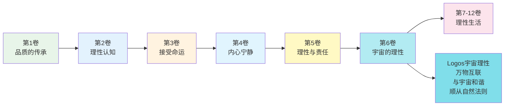
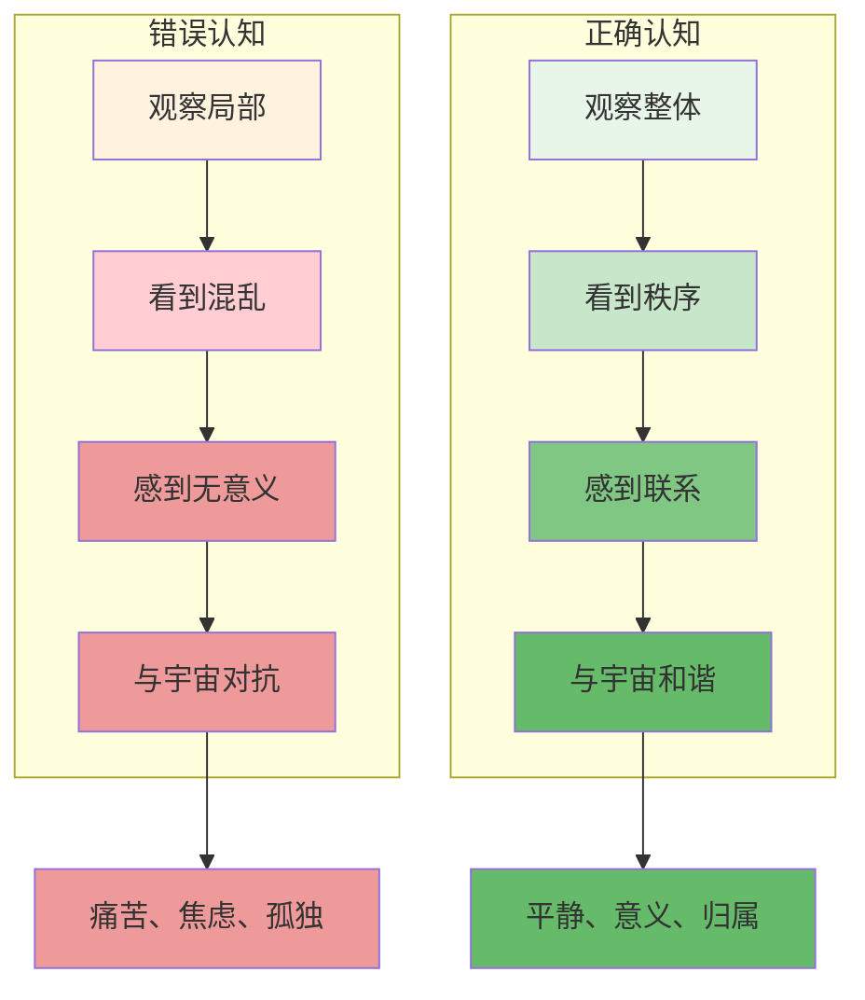
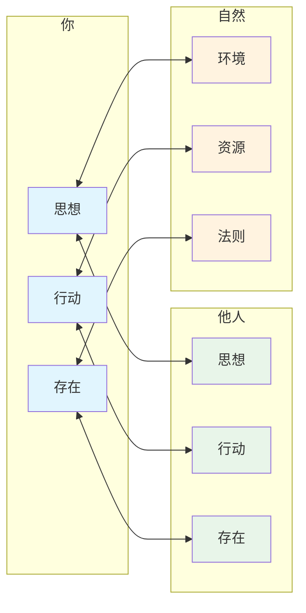
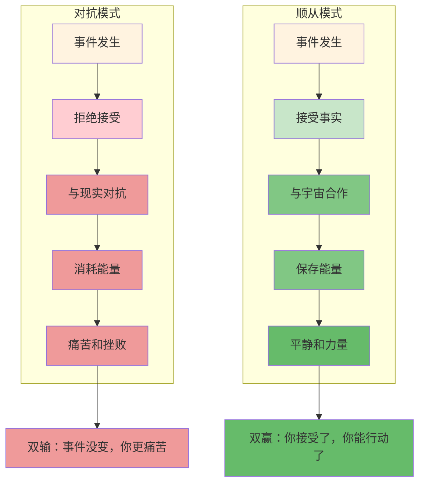
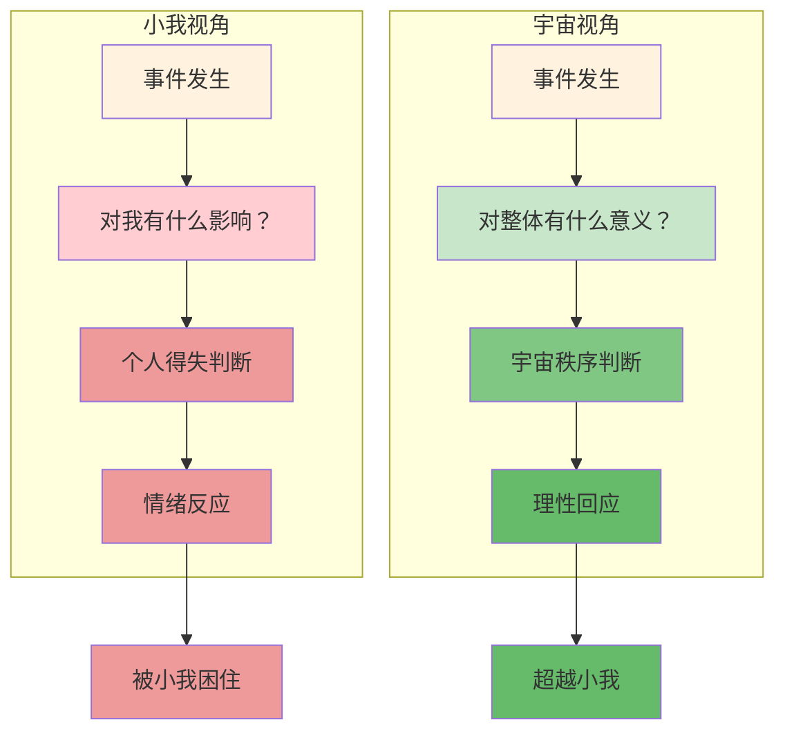
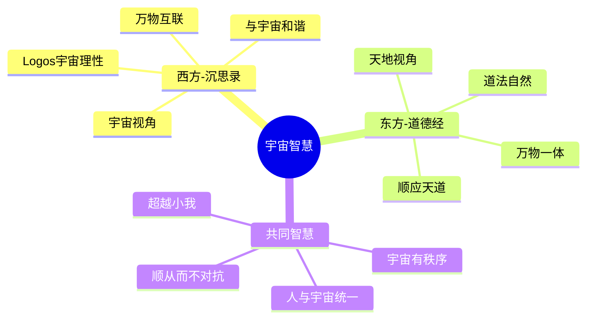

# 《沉思录》第6卷：宇宙的理性

> **核心主题**：宇宙的理性（Logos）——与宇宙和谐共处
> **章节定位**：从个体责任上升到宇宙视角，理解你与宇宙的关系
> **阅读时间**：约40分钟

---

## 一、章节定位

### 1.1 这一卷在解决什么问题？

**核心问题**：宇宙是有理性的吗？如果有，我如何与它和谐共处？如果没有，我如何面对混乱？奥勒留的答案是：宇宙有理性，你的理性是宇宙理性的一部分，与宇宙和谐共处就是最高的智慧。

**一句话定位**：
> 宇宙是有序的整体，你的理性是宇宙理性的一部分——与宇宙和谐，就是与自己和谐。

---

### 1.2 这一卷在整本书中的位置



| 维度 | 定位 |
|------|------|
| **功能** | 从个体视角上升到宇宙视角，建立宏大坐标系 |
| **内容** | 宇宙理性（Logos）、万物相互联系、与宇宙和谐、顺从自然法则 |
| **风格** | 更加形而上和哲学，从"如何行动"转向"如何存在" |
| **目的** | 建立与宇宙和谐的世界观，在宏大秩序中找到自己的位置 |

---

### 1.3 与第5卷的关联

| 第5卷 | 第6卷 | 递进关系 |
|------|------|----------|
| 理性责任 | 宇宙理性 | 个体 → 宇宙 |
| 社会器官 | 宇宙一部分 | 社会 → 宇宙 |
| 履行职责 | 顺从自然 | 行动 → 存在 |
| 为公共利益 | 为宇宙秩序 | 部分 → 整体 |

**递进逻辑**：
```
第2卷：控制二分法 → 专注可控
    ↓
第3卷：接受命运 → 珍惜当下
    ↓
第4卷：建立内在堡垒 → 内心宁静
    ↓
第5卷：理性指导行动 → 履行责任
    ↓
第6卷：理解宇宙理性 → 与宇宙和谐
```

---

## 二、核心观点（三层提取）

### 观点1：宇宙是有理性的整体，不是混乱的随机

#### 【表层】现象层

**奥勒留的原文**（6.1, 6.9）：
> "The universe is transformation; our life is what our thoughts make it."
> "All things are interwoven with one another; a sacred bond unites them."
> （宇宙是变化的；我们的生活是我们思想的产物。万物相互交织；一种神圣的纽带将它们联系在一起。）

**日常场景**：
- 看到世界的混乱，觉得没有意义
- 遇到挫折，觉得宇宙在针对自己
- 怀疑一切是否有秩序和目的
- 感到孤独，觉得与宇宙没有联系

**降维翻译**：
> **宇宙不是随机的混乱，而是有序的整体——你看到的混乱，是因为你没有看到整体。**

---

#### 【中层】机制层

**宇宙理性的机制**：



**局部vs整体的对比**：

| 维度 | 局部视角 | 整体视角 |
|------|---------|---------|
| **看到什么** | 混乱、随机、无意义 | 秩序、联系、目的 |
| **感觉什么** | 孤独、焦虑、对抗 | 归属、平静、和谐 |
| **行动什么** | 与宇宙对抗 | 与宇宙合作 |
| **结果什么** | 痛苦和挫败 | 意义和安宁 |

---

#### 【底层】规律层

> **宇宙理性定律**：宇宙是有理性的整体，万物相互联系。你的理性是宇宙理性的一部分，与宇宙和谐就是与自己的本质和谐。

**降维翻译**：
> 宇宙有它的秩序，
> 你有你的理性。
> 它们本是同一个东西，
> 与宇宙和谐，就是与自己和解。

---

### 观点2：万物相互联系，你不是孤立的

#### 【表层】现象层

**奥勒留的原文**（6.38, 6.39）：
> "All things are implicated with one another, and the bond is sacred... for there is one universe made up of all things."
> （万物相互联系，这种纽带是神圣的……因为有一个由万物组成的宇宙。）

**日常场景**：
- 觉得自己可以独立于他人
- 认为自己的行为不影响他人
- 忽视自己与自然的联系
- 割裂地看待事物

**降维翻译**：
> **你不是孤立的存在，而是宇宙网络中的一个节点——你与万物相互联系，无法分离。**

---

#### 【中层】机制层

**万物互联的机制**：



**联系的三个层面**：

| 层面 | 联系 | 意义 |
|------|------|------|
| **与他人** | 社会、文化、情感 | 你是社会性动物 |
| **与自然** | 环境、资源、生存 | 你是自然的一部分 |
| **与宇宙** | 理性、法则、秩序 | 你的理性是宇宙理性的一部分 |

---

#### 【底层】规律层

> **万物互联定律**：没有任何事物是孤立存在的。你的每一次呼吸、每一个思想、每一个行动，都与宇宙万物相互联系。孤立是一个幻觉，联系才是真相。

**降维翻译**：
> 你以为你是孤岛，
> 其实你是大海的一朵浪花。
> 浪花和大海从未分离，
> 你和宇宙也是一体。

---

### 观点3：顺从宇宙的安排，就是最高的智慧

#### 【表层】现象层

**奥勒留的原文**（6.39, 6.44）：
> "What is not good for the swarm is not good for the bee."
> "Adapt yourself to the things among which your lot has been cast and love the people with whom your destiny is bound up."
> （对蜂群不利的，对蜜蜂也不利。适应你命运所处的环境，热爱与你命运相连的人。）

**日常场景**：
- 总是与现实对抗，不接受发生的事
- 想要改变不可改变的
- 抱怨环境，而不是适应环境
- 与命运斗争，感到疲惫

**降维翻译**：
> **不是宇宙要适应你，而是你要适应宇宙——顺从宇宙的安排，就是最高的智慧。**

---

#### 【中层】机制层

**顺从vs对抗的机制**：



**两种对待命运的态度**：

| 维度 | 对抗命运 | 顺从命运 |
|------|---------|---------|
| **态度** | 为什么是我？ | 这就是我。 |
| **能量** | 消耗在对抗中 | 保存用于行动 |
| **结果** | 痛苦加事件本身 | 平静加可能的改变 |
| **智慧** | 试图改变不可控 | 专注可控的部分 |

---

#### 【底层】规律层

> **顺从定律**：顺从不是放弃，而是接受你无法改变的，专注你能够改变的。与宇宙对抗是双输，与宇宙合作是双赢。最高的智慧是：不是你想怎样，而是宇宙怎样，你就怎样。

**降维翻译**：
> 顺从不是认输，
> 而是知道什么时候该放弃。
> 不是你想让河流倒流，
> 而是你顺着河流的方向游泳。

---

### 观点4：像宇宙一样思考，你就与宇宙和谐了

#### 【表层】现象层

**奥勒留的原文**（6.30, 6.54）：
> "Take away your opinion, and there is taken away the complaint, 'I have been harmed.' Take away the complaint, 'I have been harmed,' and the harm is taken away."
> "Let that which is best in you stand at the helm of your soul."
> （去掉你的意见，就没了"我受伤害了"的抱怨。去掉抱怨，伤害就被去掉了。让你最好的部分——理性——掌管你的灵魂。）

**日常场景**：
- 用狭隘的视角看问题
- 被小我的利益驱动
- 陷入琐碎的得失
- 忘记更大的图景

**降维翻译**：
> **你的理性是宇宙理性的一部分——用宇宙的视角看问题，你就超越了小我的得失。**

---

#### 【中层】机制层

**视角转换的机制**：



**两种视角的对比**：

| 维度 | 小我视角 | 宇宙视角 |
|------|---------|---------|
| **关注点** | 这对我有什么影响？ | 这对整体有什么意义？ |
| **判断标准** | 个人得失 | 宇宙秩序 |
| **情绪反应** | 被小我驱动 | 被理性引导 |
| **结果** | 被困在琐碎中 | 超越到更大的图景 |

---

#### 【底层】规律层

> **宇宙视角定律**：你的理性是宇宙理性的一部分。当你用宇宙的视角看问题，你就超越了小我的得失，与宇宙和谐共处。这是最高的视角，也是最高的自由。

**降维翻译**：
> 蚂蚁看到的是一粒米，
> 人看到的是整个田野。
> 小我看到的是得失，
> 宇宙看到的是秩序。
> 选择你的视角，
> 就是选择你的自由。

---

## 三、金句库

### 原文金句

1. "The universe is transformation; our life is what our thoughts make it."（6.1）
2. "All things are interwoven with one another; a sacred bond unites them."（6.38）
3. "What is not good for the swarm is not good for the bee."（6.54）
4. "Adapt yourself to the things among which your lot has been cast."（6.39）
5. "Take away your opinion, and the harm is taken away."（6.30）
6. "Let that which is best in you stand at the helm of your soul."（6.54）
7. "All things are implicated with one another."（6.39）
8. "There is one universe made up of all things."（6.38）

---

### 降维金句（人话版）

1. **宇宙是变化的，你的生活是你思想的产物——你怎么想，就怎么活。**
2. **万物相互联系，这种纽带是神圣的——你不是孤岛，你是大海的一部分。**
3. **对蜂群不利的，对蜜蜂也不利——你的利益在整体中，不在自我中心里。**
4. **适应你命运所处的环境——不是宇宙适应你，是你适应宇宙。**
5. **去掉你的意见，伤害就被去掉了——伤害不是事件本身，而是你对事件的看法。**
6. **让你最好的部分——理性——掌管你的灵魂——用宇宙视角看问题。**
7. **万物相互联系——你的每一次呼吸都与宇宙相连。**
8. **有一个由万物组成的宇宙——你与万物一体，无法分离。**

---

## 四、当下映射

### 2026年读者的困惑

|------|------------|----------|
| 世界这么混乱，有秩序吗？ | 混乱是你没看到整体，宇宙有它的理性 | "有希望了" |
| 我感到孤独，与世界没有联系 | 你与万物互联，孤立是幻觉 | "被治愈了" |
| 为什么要接受我不喜欢的事？ | 与宇宙对抗是双输，顺从是智慧 | "释然了" |
| 如何超越小我的得失？ | 用宇宙视角看问题，你就自由了 | "升华了" |
| 我的理性有什么意义？ | 你的理性是宇宙理性的一部分 | "找到意义了" |

---

### 现代应用场景

**场景1：面对世界混乱**
- 困惑：看到新闻，觉得世界越来越混乱
- 根源：用局部视角看问题，没有看到整体
- 应用：记住宇宙有它的秩序，你的理性是它的一部分

**场景2：感到孤独孤立**
- 困惑：在现代社会感到孤独，与世界没有联系
- 根源：相信孤立的幻觉，忘记万物互联
- 应用：你的每一次呼吸都与宇宙相连，孤立是幻觉

**场景3：与命运对抗**
- 困惑：总是与现实对抗，不接受发生的事
- 根源：想改变不可改变的，消耗能量
- 应用：顺从不是放弃，而是专注你能改变的

**场景4：被小我困住**
- 困惑：总是陷入个人得失，无法超越
- 根源：用小我视角看问题，没有宇宙视角
- 应用：用宇宙视角看问题，你就超越了小我

---

## 五、章节关联

### 与《沉思录》其他章节的关联

| 章节 | 关联类型 | 共同逻辑 |
|------|----------|----------|
| **第2卷** | 基础 | 控制二分法 → 顺从不可控 |
| **第3卷** | 承接 | 接受命运 → 适应宇宙安排 |
| **第4卷** | 深化 | 内在宁静 → 与宇宙和谐 |
| **第5卷** | 扩展 | 社会责任 → 宇宙责任 |
| **第6卷** | 核心 | 宇宙理性、万物互联、顺从自然 |
| **第7-8卷** | 应用 | 宇宙视角的持续实践 |

**核心思想递进**：
```
第2卷：控制你控制的（边界）
    ↓
第3卷：接受你无法控制的（态度）
    ↓
第4卷：建立内在堡垒（状态）
    ↓
第5卷：理性指导责任（行动）
    ↓
第6卷：理解宇宙理性（升华）
    ↓
第7-12卷：理性生活的持续实践
```

---

### 与其他书籍的关联

| 书籍 | 关联类型 | 共同底层逻辑 |
|------|----------|--------------|

**东西方智慧共鸣**：
```
《沉思录》：宇宙理性（Logos）→ 万物互联 → 与宇宙和谐
《道德经》：道法自然 → 万物一体 → 顺应天道
共同逻辑：宇宙有秩序，你是宇宙的一部分，与宇宙和谐就是最高的智慧
```

---

### 与《道德经》的深度对比

| 维度 | 《沉思录》奥勒留 | 《道德经》老子 | 共鸣点 |
|------|----------------|---------------|--------|
| **核心概念** | 宇宙理性（Logos） | 道 | 宇宙的秩序 |
| **人与宇宙** | 你的理性是宇宙理性的一部分 | 人法地，地法天，天法道 | 人与宇宙统一 |
| **态度** | 顺从宇宙安排 | 顺应自然 | 不对抗 |
| **视角** | 宇宙视角 | 天地视角 | 超越小我 |
| **智慧** | 与宇宙和谐 | 与道合一 | 最高境界 |

**跨时空共鸣**：
> 奥勒留的Logos ≈ 老子的道
> 东西方在2000年前，看到了同一个宇宙真理

---

## 六、问答设计

### Q1：宇宙理性是科学还是信仰？

**A**: 奥勒留的宇宙理性可以理解为：
- **科学视角**：宇宙有物理法则，万物遵循因果律
- **哲学视角**：宇宙有秩序，不是随机的混乱
- **信仰视角**：相信宇宙有意义，虽然我们不一定理解

**关键洞察**：无论宇宙理性是否存在，相信它有理性，会让你的生活更有意义。

**降维翻译**：
> 宇宙是否有理性不重要，
> 重要的是相信它有理性，
> 会让你的生活更有意义。

---

### Q2：顺从宇宙，是不是就是放弃努力？

**A**: 不是。顺从的含义是：
- **接受**你已经无法改变的
- **专注**你还能够改变的
- **合作**与宇宙而不是对抗

**机制**：
```
对抗模式：拒绝接受 → 消耗能量 → 痛苦加无行动
顺从模式：接受事实 → 保存能量 → 平静加可能的行动
```

**关键区别**：
- 顺从 = 接受现实 + 专注行动
- 放弃 = 接受现实 + 不再行动

**记住**：顺从不是放弃，而是更聪明地行动。

---

### Q3：如何培养宇宙视角？

**A**: 三个练习方法：

**方法1：放大时间尺度**
- 想象100年后，这件事还重要吗？
- 想象宇宙的尺度，你的烦恼有多渺小？

**方法2：从个体到整体**
- 问自己：这对整体有什么意义？
- 问自己：如果我是一滴水，大海是什么？

**方法3：从得失到秩序**
- 问自己：这是个人得失还是宇宙秩序？
- 问自己：小我看到什么？宇宙看到什么？

**记住**：宇宙视角是可以练习的，每次遇到问题，问自己"宇宙怎么看？"

---

### Q4：万物互联和现代科学有什么关系？

**A**: 奥勒留的万物互联与现代科学惊人地一致：

**物理学**：
- 量子纠缠：粒子之间可以瞬间相互影响
- 生态系统：蝴蝶效应，一个变化影响整体

**生物学**：
- 食物链：一个物种的变化影响整个生态系统
- 微生物组：你体内的细菌影响你的健康

**社会学**：
- 网络效应：一个人的行为影响整个网络
- 社会系统：每个人都与他人相互联系

**关键洞察**：现代科学正在验证奥勒留2000年前的直觉。

---

### Q5：第6卷和第5卷有什么区别？

**A**: 第5卷和第6卷的区别：

| 第5卷 | 第6卷 |
|------|------|
| 理性责任 | 宇宙理性 |
| 社会器官 | 宇宙一部分 |
| 履行职责 | 顺从自然 |
| 社会视角 | 宇宙视角 |
| 如何行动 | 如何存在 |

**递进关系**：
- 第5卷：你是社会的一部分，为公共利益服务
- 第6卷：你是宇宙的一部分，与宇宙和谐共处

**结合**：先理解你在社会中的责任（第5卷），再理解你在宇宙中的位置（第6卷）。

---

## 七、实践练习

### 练习1：宇宙视角日记

每天晚上花5分钟填写：

| 今天发生的事 | 小我看到什么 | 宇宙看到什么 | 我的转变 |
|------------|------------|------------|---------|
| 示例：工作不顺 | 我被针对了 | 这是学习的机会 | 从抱怨到思考 |
|  |  |  |  |

---

### 练习2：万物互联觉察

每周一次，花10分钟：

1. 问自己："我今天与谁产生了联系？"
2. 问自己："我的行动如何影响了他人？"
3. 问自己："我与自然、与宇宙的联系是什么？"
4. 问自己："如果万物互联，我的意义在哪里？"

这个练习会让你意识到你不是孤岛，而是宇宙网络中的一个节点。

---

### 练习3：顺从vs对抗觉察

每当遇到不顺心的事，花3分钟：

1. 问自己："我在与现实对抗吗？"
2. 问自己："这件事我能改变吗？"
3. 如果不能，问："我如何接受并专注我能改变的？"
4. 选择：与宇宙对抗（双输）还是与宇宙合作（双赢）

---

### 练习4：宇宙理性冥想

每周一次，花15分钟：

1. 闭上眼睛，深呼吸
2. 想象你是一滴水，融入大海
3. 想象宇宙的尺度，你的烦恼变得渺小
4. 想象宇宙的秩序，你的理性是它的一部分
5. 感受与宇宙的和谐与联系

---

## 八、章节总结

### 核心公式

```
宇宙和谐 = 宇宙理性 + 万物互联 + 顺从安排 + 宇宙视角
```

### 一句话总结

> 宇宙有理性，你的理性是它的一部分——与宇宙和谐，就是与自己和谐；用宇宙视角看问题，你就超越了小我的得失。

### 第6卷的核心贡献

1. **宇宙理性**：宇宙是有序的整体，不是随机的混乱
2. **万物互联**：你与万物相互联系，孤立是幻觉
3. **顺从智慧**：与宇宙对抗是双输，顺从是双赢
4. **宇宙视角**：用宇宙的视角看问题，你就超越了小我

这四个工具，构成了与宇宙和谐共处的完整世界观。

---

### 与《道德经》的终极共鸣



**跨时空的共鸣**：
> 奥勒留在罗马，老子在中国，相隔2000年、相距万里，却看到了同一个宇宙真理——宇宙有秩序，人是宇宙的一部分，与宇宙和谐就是最高的智慧。

---
