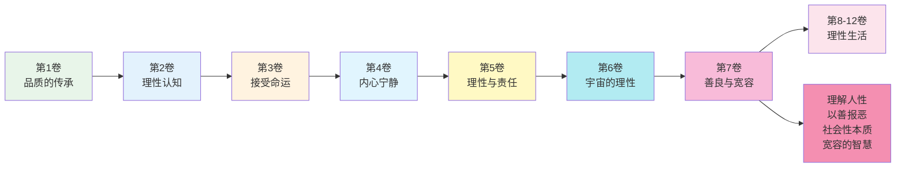
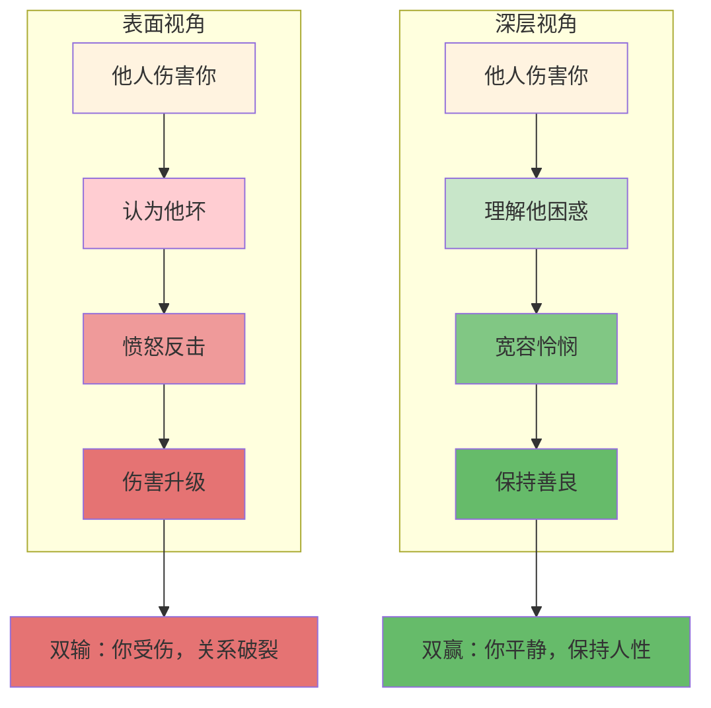
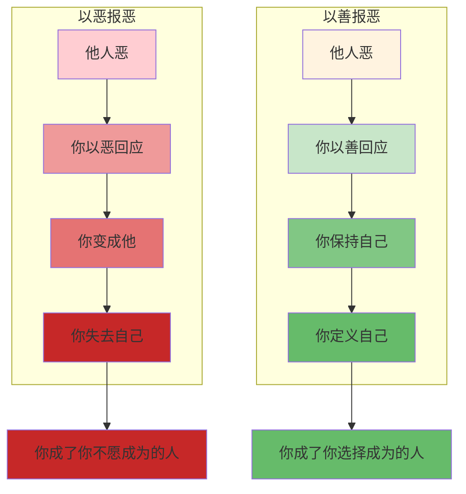
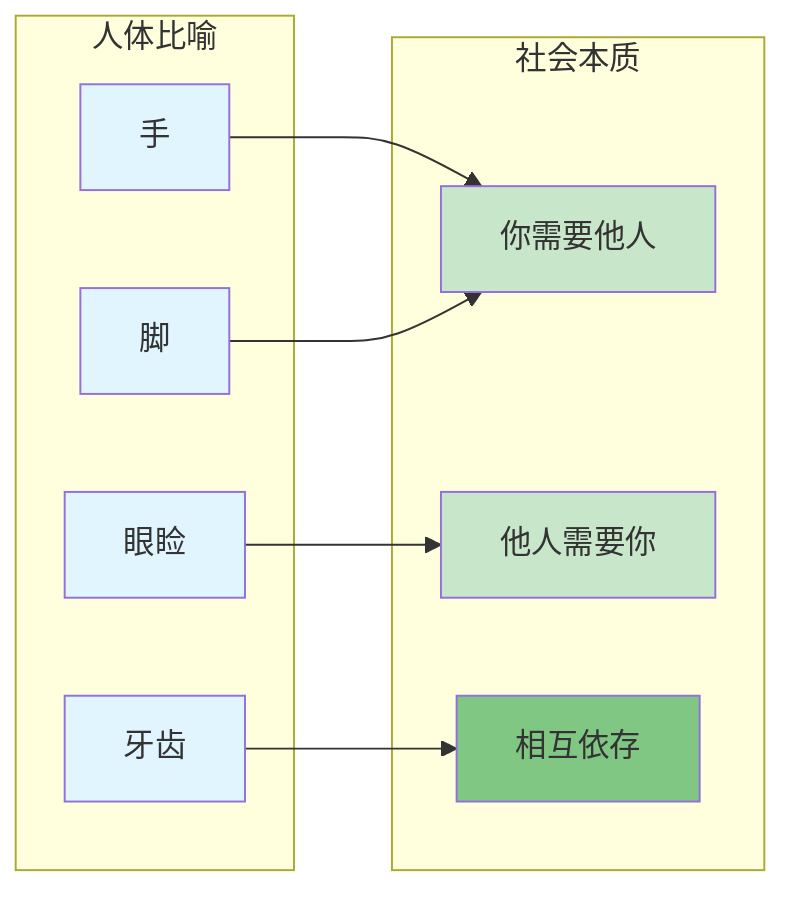
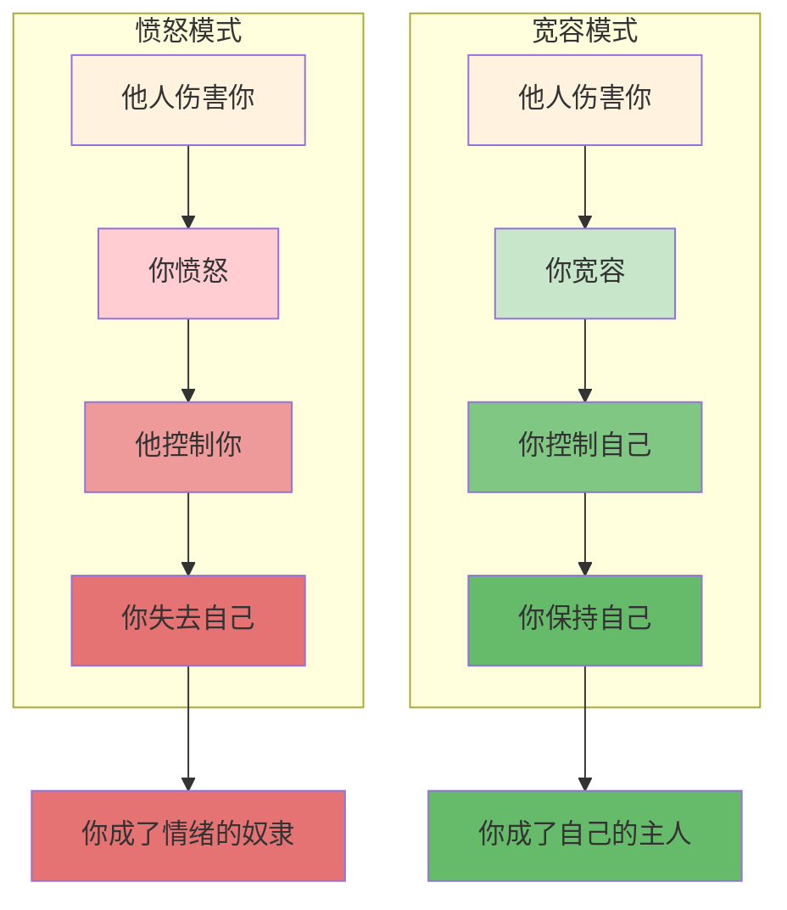
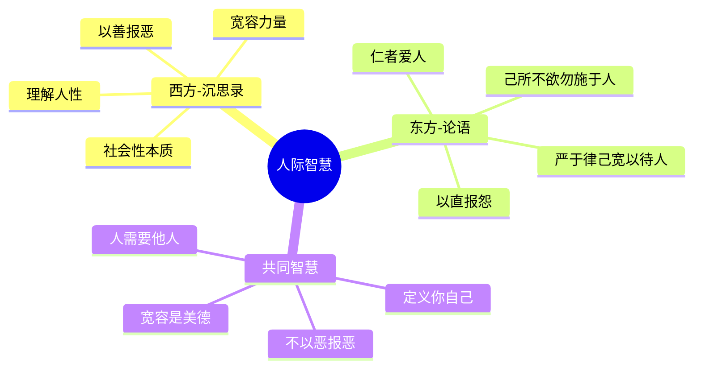

# 《沉思录》第7卷：善良与宽容

> **核心主题**：如何对待他人——善良、宽容、理解人性
> **章节定位**：从宇宙视角回到人际关系，实践如何在人群中保持理性与善良
> **阅读时间**：约45分钟

---

## 一、章节定位

### 1.1 这一卷在解决什么问题？

**核心问题**：他人总是让我失望、伤害我、误解我——我该如何对待他们？奥勒留的答案是：理解人性，以善报恶，因为你的善良不是为了他们，而是为了你自己。

**一句话定位**：
> 别人对你的伤害，只能到达你的判断为止——你的善良不是因为他们值得，而是因为你选择成为那样的人。

---

### 1.2 这一卷在整本书中的位置



| 维度 | 定位 |
|------|------|
| **功能** | 从宇宙视角回到人际关系，实践善良与宽容 |
| **内容** | 理解人性、以善报恶、社会性本质、宽容的智慧 |
| **风格** | 更具实践性和人际导向，从"如何存在"转向"如何对待他人" |
| **目的** | 建立健康的人际关系观，在不完美的人群中保持善良 |

---

### 1.3 与第6卷的关联

| 第6卷 | 第7卷 | 递进关系 |
|------|------|----------|
| 宇宙理性 | 人性理解 | 宏观 → 微观 |
| 与宇宙和谐 | 与人和谐 | 宇宙 → 人群 |
| 万物互联 | 人际互联 | 整体 → 关系 |
| 顺从宇宙 | 宽容他人 | 自然 → 人性 |

**递进逻辑**：
```
第6卷：理解宇宙理性 → 与宇宙和谐
    ↓
第7卷：理解人性 → 与人和谐
    ↓
核心转换：宇宙视角 → 人际实践
```

---

## 二、核心观点（三层提取）

### 观点1：理解人性，你就不会对他人失望

#### 【表层】现象层

**奥勒留的原文**（7.3, 7.22）：
> "When people injure you, ask yourself, 'What good or harm do I think would come to them if they did what they believe is right?'"
> "Look at their minds. When people are cruel, it's because they're confused about what's good and what's bad."
> （当人们伤害你时，问自己："如果他们做了他们认为正确的事，他们能得到什么好处或坏处？"看看他们的心智。当人们残忍时，是因为他们对什么是好、什么是坏感到困惑。）

**日常场景**：
- 朋友背叛你，你感到愤怒
- 同事背后说你坏话，你想要反击
- 家人不理解你，你感到委屈
- 陌生人对你无礼，你想以牙还牙

**降维翻译**：
> **他人伤害你不是因为他们坏，而是因为他们不知道什么是真正的好——理解这一点，你就不会对他们失望。**

---

#### 【中层】机制层

**理解人性的机制**：



**两种视角的对比**：

| 维度 | 表面视角 | 深层视角 |
|------|---------|---------|
| **看到什么** | 他人是坏人 | 他人是困惑的人 |
| **解释什么** | 他故意伤害我 | 他不知道什么是真正的好 |
| **感受什么** | 愤怒、仇恨 | 怜悯、宽容 |
| **行动什么** | 反击、报复 | 理解、保持善良 |

---

#### 【底层】规律层

> **人性理解定律**：没有人会因为自己认为正确的事而故意做错。他人伤害你，是因为他们对什么是好、什么是坏感到困惑。理解这一点，你就会从愤怒转向怜悯，从报复转向宽容。

**降维翻译**：
> 坏人不是生来就坏，
> 是他们不知道什么是真正的好。
> 理解这一点，
> 你就放下了愤怒的刀。

---

### 观点2：以善报恶，不是因为他人值得，而是因为你值得

#### 【表层】现象层

**奥勒留的原文**（7.22, 7.26）：
> "The best revenge is not to be like your enemy."
> "It is absurd to be angry with others because they are wicked; for if they are wicked, they harm themselves more than they harm you."
> （最好的报复不是成为像你的敌人那样的人。因为别人邪恶而对他们愤怒是荒谬的；如果他们是邪恶的，他们对自己的伤害超过对你的伤害。）

**日常场景**：
- 有人对你说谎，你想也说谎
- 有人对你冷漠，你也想冷漠
- 有人对你恶语相向，你想骂回去
- 有人以怨报德，你想放弃善良

**降维翻译**：
> **以善报恶不是因为他们值得，而是因为你选择成为那样的人——你的善良定义了你，而不是他们的行为定义你。**

---

#### 【中层】机制层

**以善报恶的机制**：



**两种回应的对比**：

| 维度 | 以恶报恶 | 以善报恶 |
|------|---------|---------|
| **逻辑** | 他恶，我也恶 | 他恶，我仍善 |
| **结果** | 我变成他 | 我保持我 |
| **代价** | 失去自己 | 需要勇气 |
| **收获** | 暂时痛快 | 长久尊严 |

---

#### 【底层】规律层

> **善良定义定律**：你的善良不是由他人如何对待你决定的，而是由你选择成为什么样的人决定的。以善报恶不是因为他人值得，而是因为你值得保持你的人性。

**降维翻译**：
> 他人如何对你，
> 是他人的事。
> 你如何对他人，
> 是你的事。
> 选择善良，
> 是选择你是谁。

---

### 观点3：人是社会性动物，你不能脱离他人

#### 【表层】现象层

**奥勒留的原文**（7.5, 7.16）：
> "We are made for cooperation, like feet, like hands, like eyelids, like the rows of the upper and lower teeth."
> "No man is an island; every man is a piece of the continent."
> （我们是为了合作而生的，像脚、像手、像眼睑、像上下牙齿的排列。没有人是一座孤岛；每个人都是大陆的一部分。）

**日常场景**：
- 想要远离所有人，独自生活
- 觉得人际关系太累，想逃避
- 认为自己可以不需要他人
- 对社交感到厌倦

**降维翻译**：
> **你生来就是社会性动物，与他人合作是你的本性——你无法脱离他人而完整地存在。**

---

#### 【中层】机制层

**社会性本质的机制**：



**人体部位对比社会角色**：

| 人体部位 | 特点 | 社会对应 |
|---------|------|----------|
| **手** | 不能没有脚 | 你不能没有他人 |
| **眼睑** | 保护眼睛 | 你保护他人，他人保护你 |
| **上下牙齿** | 相互配合才能咀嚼 | 合作才能完成大事 |
| **整体** | 部分无法独立 | 人无法脱离社会 |

---

#### 【底层】规律层

> **社会性定律**：人是社会性动物，你的存在依赖于与他人的关系。孤立不是自由，而是残缺。真正的自由是在人群中保持善良，而不是逃离人群。

**降维翻译**：
> 手不能没有脚，
> 牙齿需要配合才能咀嚼。
> 你不能没有他人，
> 因为你生来就是社会的一部分。

---

### 观点4：宽容不是软弱，而是力量

#### 【表层】现象层

**奥勒留的原文**（7.14, 7.33）：
> "Be tolerant with others and strict with yourself."
> "To feel anger at someone is to give them power over you."
> （对他人宽容，对自己严格。对某人感到愤怒，就是给他们控制你的力量。）

**日常场景**：
- 认为宽容就是软弱
- 觉得不反击就是懦夫
- 把愤怒当作力量的证明
- 以牙还牙才觉得解气

**降维翻译**：
> **宽容不是软弱，而是更高的力量——愤怒让他人控制你，宽容让你保持自己。**

---

#### 【中层】机制层

**宽容vs愤怒的机制**：



**两种反应的对比**：

| 维度 | 愤怒 | 宽容 |
|------|------|------|
| **谁控制谁** | 他人控制你 | 你控制自己 |
| **你的状态** | 情绪的奴隶 | 自己的主人 |
| **你的力量** | 被动反应 | 主动选择 |
| **你的尊严** | 丢失 | 保持 |

---

#### 【底层】规律层

> **宽容力量定律**：愤怒让他人控制你的情绪，宽容让你保持自己的力量。真正的强者不是能伤害别人，而是能不被别人伤害。

**降维翻译**：
> 愤怒是交给别人的钥匙，
> 宽容是握在自己手里的锁。
> 谁能让你愤怒，
> 谁就控制了你。
> 选择宽容，
> 就是选择力量。

---

## 三、金句库

### 原文金句

1. "The best revenge is not to be like your enemy."（7.14）
2. "Be tolerant with others and strict with yourself."（7.14）
3. "We are made for cooperation, like feet, like hands, like eyelids."（7.5）
4. "When people are cruel, it's because they're confused about what's good."（7.22）
5. "It is absurd to be angry with others because they are wicked."（7.26）
6. "To feel anger at someone is to give them power over you."（7.33）
7. "No man is an island."（7.16，借约翰·多恩之语）
8. "Look at their minds, and you'll see they mean no harm."（7.22）

---

### 降维金句（人话版）

1. **最好的报复不是成为像你的敌人那样的人——你成为你，就是最大的胜利。**
2. **对他人宽容，对自己严格——别把标准搞反了。**
3. **我们是为了合作而生的，像手和脚、像上下牙齿——你不能独自完成一切。**
4. **他人残忍不是因为他们坏，而是因为他们对好坏感到困惑——理解这一点，你就不会失望。**
5. **对恶人愤怒是荒谬的——他们伤害自己比伤害你更多。**
6. **对某人愤怒，就是给他们控制你的力量——宽容才是真正的力量。**
7. **没有人是一座孤岛——你是大陆的一部分，无法脱离。**
8. **看看他们的心，你会发现他们本无意伤害——只是他们不知道什么是真正的好。**

---

## 四、当下映射

### 2026年读者的困惑

|------|------------|----------|
| 总是对他人失望怎么办？ | 理解人性，他们不是坏，是困惑 | "释然了" |
| 该以牙还牙吗？ | 最好的报复不是成为你的敌人 | "升华了" |
| 善良会被欺负吗？ | 善良定义你是谁，不是他们 | "坚定了" |
| 想逃离人际关系？ | 你是社会性动物，不能脱离 | "接受了" |
| 宽容是软弱吗？ | 宽容是力量，愤怒是被控制 | "觉醒了" |

---

### 现代应用场景

**场景1：面对职场伤害**
- 困惑：同事背后说你坏话，你想反击
- 根源：用表面视角看，认为他是坏人
- 应用：理解他可能是嫉妒或困惑，选择不成为他那样的人

**场景2：面对家人误解**
- 困惑：家人不理解你的选择，你感到委屈
- 根源：期待他们应该理解你
- 应用：理解他们也只是在做他们认为对的事，保持善良

**场景3：面对社交厌倦**
- 困惑：觉得人际关系太累，想逃离
- 根源：忘了自己是社会性动物
- 应用：接受你需要他人，在人群中找到你的位置

**场景4：面对愤怒情绪**
- 困惑：总是被他人激怒，无法控制
- 根源：把情绪的控制权交给了他人
- 应用：记住愤怒是给他人的权力，选择宽容

---

## 五、章节关联

### 与《沉思录》其他章节的关联

| 章节 | 关联类型 | 共同逻辑 |
|------|----------|----------|
| **第2卷** | 基础 | 控制二分法 → 控制你如何对待他人 |
| **第3卷** | 承接 | 接受命运 → 接受他人的不完美 |
| **第4卷** | 深化 | 内在宁静 → 在人群中的平静 |
| **第5卷** | 扩展 | 社会责任 → 对他人的善良 |
| **第6卷** | 升华 | 宇宙理性 → 人性理解 |
| **第7卷** | 核心 | 善良、宽容、社会性、理解人性 |
| **第8-9卷** | 应用 | 人际关系的持续实践 |

**核心思想递进**：
```
第2卷：控制你控制的（边界）
    ↓
第3卷：接受你无法控制的（态度）
    ↓
第4卷：建立内在堡垒（状态）
    ↓
第5卷：理性指导责任（行动）
    ↓
第6卷：理解宇宙理性（升华）
    ↓
第7卷：理解人性，以善待人（人际）
    ↓
第8-12卷：理性生活的持续实践
```

---

### 与其他书籍的关联

| 书籍 | 关联类型 | 共同底层逻辑 |
|------|----------|--------------|
| **《论语》孔子** | 🔗跨时空呼应 | 以直报怨 ≈ 理性善良 |
| **《道德经》老子** | 🔗智慧共鸣 | 不争 ≈ 宽容 |
| **《被讨厌的勇气》阿德勒** | 🔗现代验证 | 课题分离 ≈ 你的善良你的事 |
| **《非暴力沟通》卢森堡** | 🔗实践方法 | 理解他人需要 ≈ 理解人性 |

**东西方智慧共鸣**：
```
《沉思录》：以善报恶 → 理解人性 → 保持善良
《论语》：以直报怨 → 己所不欲勿施于人 → 理性善良
共同逻辑：你的反应定义你是谁，不是他人的行为定义你
```

---

### 与《论语》的深度对比

| 维度 | 《沉思录》奥勒留 | 《论语》孔子 | 共鸣点 |
|------|----------------|-------------|--------|
| **对待恶人** | 以善报恶 | 以直报怨 | 都不主张以恶报恶 |
| **自我要求** | 对自己严格 | 严于律己 | 高标准要求自己 |
| **对待他人** | 对他人宽容 | 宽以待人 | 宽容是美德 |
| **理解人性** | 他人是困惑的 | 性相近，习相远 | 人性本相近 |
| **社会性** | 人是社会性动物 | 仁者爱人 | 人需要他人 |

**跨时空共鸣**：
> 奥勒留的"以善报恶"与孔子的"以直报怨"
> 一个选择超越，一个选择公正
> 但都不主张以恶报恶——东西方对人性的理解惊人地一致

---

## 六、问答设计

### Q1：以善报恶和以直报怨有什么区别？

**A**: 两种不同的智慧路径：

**以善报恶（奥勒留）**：
- 超越对错，选择善良
- 你的善良定义你是谁
- 更高的精神境界

**以直报怨（孔子）**：
- 公正回应，不纵容恶
- 维护社会正义
- 更实际的人际智慧

**共同点**：
- 都不主张以恶报恶
- 都要求保持自己的人格
- 都理解人性的局限

**应用建议**：
- 日常小事 → 以善报恶，选择宽容
- 重大伤害 → 以直报怨，维护正义

---

### Q2：如何区分宽容和软弱？

**A**: 三个关键区别：

| 维度 | 宽容 | 软弱 |
|------|------|------|
| **动机** | 选择善良 | 害怕冲突 |
| **内心** | 平静有力 | 恐惧焦虑 |
| **行为** | 可以反击但不选择 | 不敢反击 |
| **结果** | 保持尊严 | 失去尊严 |

**关键判断**：
- 宽容 = 我有能力反击，但我选择不
- 软弱 = 我没有能力反击，只能忍受

**记住**：宽容需要力量，软弱没有选择。

---

### Q3：理解人性会不会变成为恶人开脱？

**A**: 不会。理解人性不等于认可行为：

**理解 vs 认可**：
```
理解：我知道他为什么这样做（困惑、无知）
认可：我认为他这样做是对的
```

**正确的态度**：
1. **理解**他人的困惑和局限
2. **不认可**他们的错误行为
3. **不报复**因为你想保持自己
4. **必要时**维护正义（以直报怨）

**关键**：理解是为了让你不被愤怒控制，不是为了让恶人免责。

---

### Q4：如何在被伤害后保持善良？

**A**: 四步转化法：

**Step 1：承认伤害**
- 不要压抑愤怒
- 承认你被伤害了

**Step 2：理解人性**
- 问自己：他为什么这样做？
- 答案：他不知道什么是真正的好

**Step 3：选择回应**
- 问自己：我想成为什么样的人？
- 选择：我想保持善良

**Step 4：保持边界**
- 善良不等于纵容
- 必要时保持距离

**记住**：善良不是没有底线，而是在底线之上选择善良。

---

### Q5：第7卷和第6卷有什么区别？

**A**: 第6卷和第7卷的区别：

| 第6卷 | 第7卷 |
|------|------|
| 宇宙理性 | 人性理解 |
| 与宇宙和谐 | 与人和谐 |
| 万物互联 | 人际互联 |
| 顺从宇宙 | 宽容他人 |
| 宏观视角 | 微观实践 |

**递进关系**：
- 第6卷：理解你在宇宙中的位置
- 第7卷：实践你如何对待人群

**结合**：先建立宇宙视角（第6卷），再应用到人际关系（第7卷）。

---

## 七、实践练习

### 练习1：人性理解日记

每天晚上花5分钟填写：

| 今天谁让我失望？ | 他为什么这样做？ | 他是否困惑？ | 我如何保持善良？ |
|----------------|----------------|------------|----------------|
| 示例：同事抢功 | 他需要认可 | 是 | 不计较，做好自己 |
|  |  |  |  |

---

### 练习2：以善报恶练习

每当有人伤害你，花3分钟：

1. 问自己："我想成为像他那样的人吗？"
2. 问自己："如果我也这样做，我失去了什么？"
3. 选择：保持善良，因为我值得
4. 行动：用善良回应，或者保持沉默

---

### 练习3：宽容vs愤怒觉察

每当感到愤怒，花2分钟：

1. 问自己："我为什么愤怒？"
2. 问自己："我的愤怒给了他什么？"
3. 选择：拿回控制权，选择宽容
4. 感受：从被动到主动的转变

---

### 练习4：社会性觉察

每周一次，花10分钟：

1. 问自己："我今天与谁产生了联系？"
2. 问自己："我如何需要他人？"
3. 问自己："他人如何需要我？"
4. 感受：你与他人相互依存的本质

---

## 八、章节总结

### 核心公式

```
人际和谐 = 理解人性 + 以善报恶 + 社会性本质 + 宽容力量
```

### 一句话总结

> 他人伤害你不是因为他们坏，而是因为他们困惑——你的善良不是因为他们值得，而是因为你值得。理解人性，你就不会失望；以善报恶，你就保持自己。

### 第7卷的核心贡献

1. **理解人性**：他人不是坏人，是困惑的人
2. **以善报恶**：你的善良定义你是谁
3. **社会性本质**：你不能脱离他人而完整
4. **宽容力量**：宽容是力量，愤怒是被控制

这四个工具，构成了在人群中保持善良与宽容的完整智慧。

---

### 与《论语》的终极共鸣



**跨时空的共鸣**：
> 奥勒留在罗马，孔子在中国，相隔万里、相距千年，却看到了同一个人际真理——你的反应定义你是谁，不是他人的行为定义你。

---
