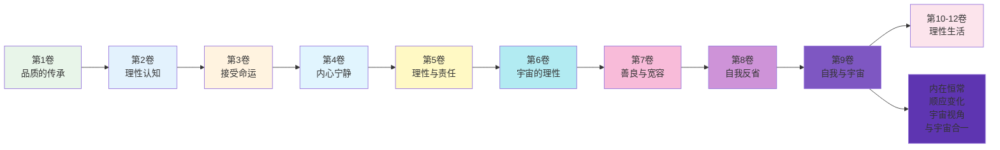
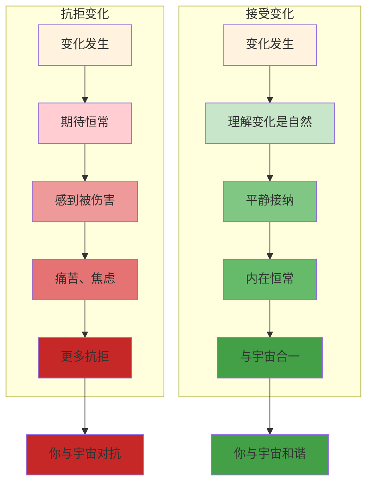
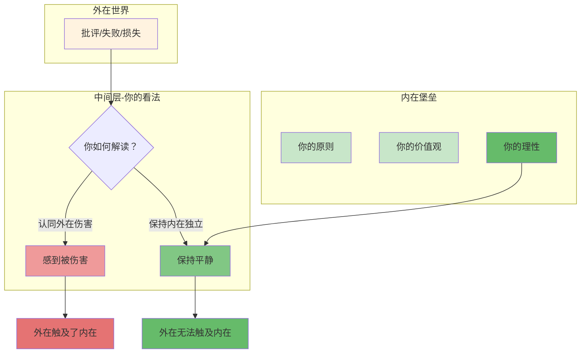
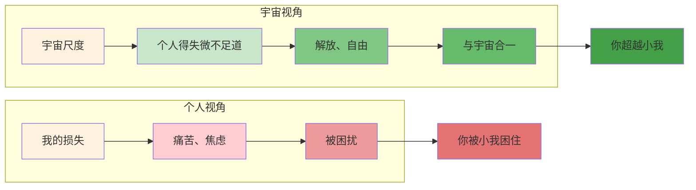
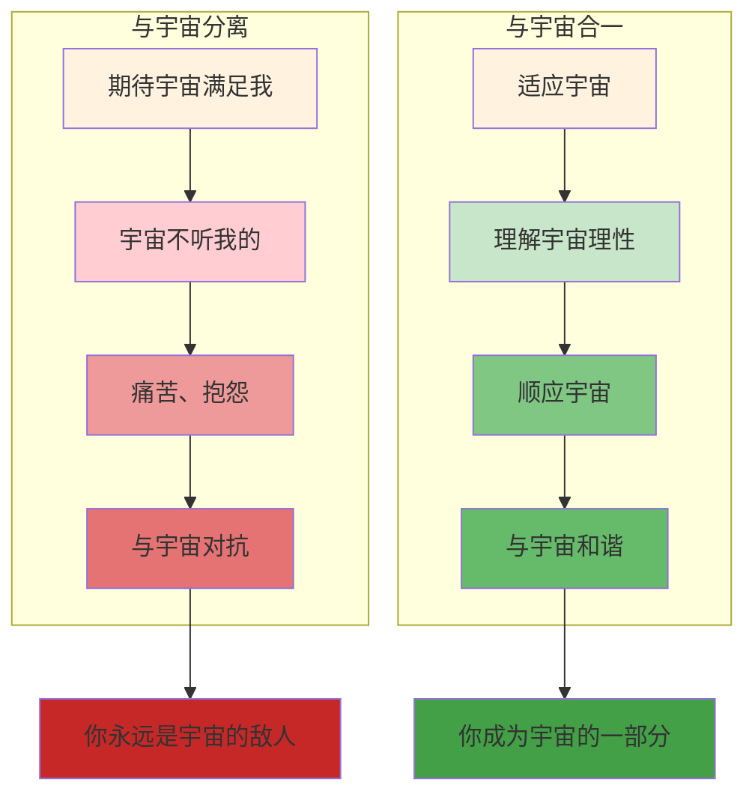
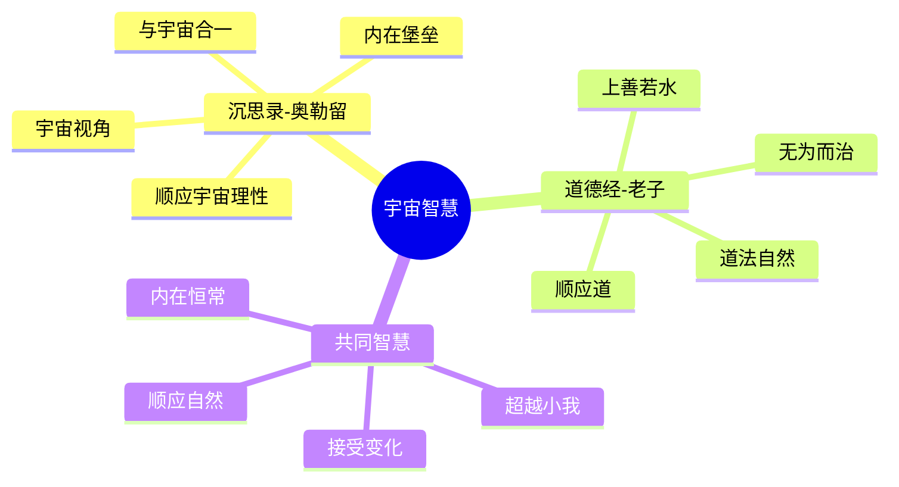

# 《沉思录》第9卷：自我与宇宙

> **核心主题**：自我与宇宙——如何在变化中保持恒常
> **章节定位**：从自我反省转向宇宙视角，建立内在的恒常性
> **阅读时间**：约55分钟

---

## 一、章节定位

### 1.1 这一卷在解决什么问题？

**核心问题**：外在世界一切都在变化——帝国的兴衰、亲人的离去、财富的得失——我们如何在变化中找到恒常？奥勒留的答案是：建立内在的堡垒，与宇宙理性合一，因为变化是自然的本质，恒常在于你的内在态度。

**一句话定位**：
> 外在世界的一切都在流变，但你的内在可以成为恒常的堡垒——不是抗拒变化，而是在变化中保持不变的自己。

---

### 1.2 这一卷在整本书中的位置



| 维度 | 定位 |
|------|------|
| **功能** | 从自我反省升级到宇宙视角，建立内在的恒常性 |
| **内容** | 变化与恒常、内在堡垒、宇宙视角、与宇宙合一 |
| **风格** | 哲学升华，从个人修养上升到宇宙意识的层面 |
| **目的** | 帮助读者在变化中找到恒常，建立不可动摇的内在核心 |

---

### 1.3 与第8卷的关联

| 第8卷 | 第9卷 | 递进关系 |
|------|------|----------|
| 自我反省 | 自我与宇宙 | 个体 → 宇宙 |
| 认识自己 | 认识自己在宇宙中的位置 | 小我 → 大我 |
| 内在对话 | 与宇宙对话 | 自我 → 超越 |
| 以诚待己 | 与宇宙合一 | 自我 → 无我 |

**递进逻辑**：
```
第8卷：认识自己，以诚待己（向内）
    ↓
第9卷：认识自己在宇宙中的位置，与宇宙合一（向上）
    ↓
核心转换：自我反省 → 宇宙视角
```

---

### 1.4 与第6卷的呼应

| 第6卷 | 第9卷 | 呼应关系 |
|------|------|----------|
| 宇宙理性（理论） | 宇宙视角（实践） | 理论 → 应用 |
| 理解宇宙 | 成为宇宙的一部分 | 认知 → 身份 |
| 顺应宇宙理性 | 在变化中保持恒常 | 原则 → 方法 |

**呼应逻辑**：
```
第6卷：理解宇宙理性是什么（认知）
    ↓
第9卷：如何在变化中实践宇宙理性（方法）
    ↓
核心转换：认知宇宙 → 实践宇宙视角
```

---

## 二、核心观点（三层提取）

### 观点1：变化是宇宙的本质，接受变化就是接受自然

#### 【表层】现象层

**奥勒留的原文**（9.1, 9.19, 9.35）：
> "All things are in process of change. You yourself are in the process of change, and in a sense are being destroyed every moment."
> "Nature which governs the whole will soon change all the things you see, and out of their substance other things will be made."
> （一切事物都在变化中。你自己也在变化中，某种意义上每时每刻都在被毁灭。统治一切的自然很快会改变你看到的一切，并从它们的物质中制造其他东西。）

**日常场景**：
- 身体会衰老，这是自然
- 关系会结束，这是自然
- 财富会消散，这是自然
- 帝国会衰落，这是自然

**降维翻译**：
> **不是变化在伤害你，而是你对变化的抗拒在伤害你——变化是宇宙的本质，接受变化就是与宇宙合一。**

---

#### 【中层】机制层

**接受vs抗拒变化的机制**：



**变化的三个层次**：

| 层次 | 变化类型 | 自然性 | 应对方式 |
|------|----------|--------|----------|
| **第一层** | 外在事物（财富、地位、关系） | 完全自然 | 接受 |
| **第二层** | 身体（健康、外貌、能力） | 完全自然 | 接受 |
| **第三层** | 内在态度（你的看法、反应） | 你可控 | 保持恒常 |

---

#### 【底层】规律层

> **变化定律**：一切事物都在变化中，包括你自己。变化不是敌人，抗拒变化才是。与宇宙合一的方式不是阻止变化，而是在变化中保持内在的恒常——你的态度、你的原则、你的价值观。

**降维翻译**：
> 河流永远在变，
> 但水始终是水。
> 你也在变，
> 但你的内在可以是恒常的。
> 不是不变，而是态度不变。

---

### 观点2：建立内在的堡垒，外在无法触及

#### 【表层】现象层

**奥勒留的原文**（9.2, 9.13, 9.32）：
> "The things which are external cannot touch the soul, but stand inactive outside. Trouble comes only from within, from your own opinions."
> "Do away with the opinion, and the complaint is gone: 'I have been harmed.' Do away with the complaint, and the harm is gone."
> （外在的事物无法触及灵魂，它们在外部静止不动。麻烦只来自内部，来自你自己的看法。消除这个看法，抱怨就消失了：'我被伤害了。'消除抱怨，伤害就消失了。）

**日常场景**：
- 别人的批评真的能伤害你吗？还是你的看法在伤害你？
- 失去财富真的能伤害你吗？还是你对财富的执着在伤害你？
- 疾病真的能伤害你吗？还是你对疾病的恐惧在伤害你？

**降维翻译**：
> **外在世界可以触及你的身体，但无法触及你的灵魂——真正的伤害不是来自外在，而是来自你对外在的看法。**

---

#### 【中层】机制层

**内在堡垒的机制**：



**内在堡垒的三个支柱**：

| 支柱 | 内容 | 功能 |
|------|------|------|
| **原则** | 你坚持的真理 | 不会被外在动摇 |
| **价值观** | 你认为重要的 | 不会被外在改变 |
| **理性** | 你看待世界的方式 | 不会被外在情绪化 |

---

#### 【底层】规律层

> **内在堡垒定律**：外在世界可以触及你的身体、你的财富、你的地位，但无法触及你的灵魂。真正的伤害来自你对事件的看法，而不是事件本身。建立内在堡垒，外在就失去了伤害你的能力。

**降维翻译**：
> 别人的话可以刺破你的耳朵，
> 但无法刺破你的灵魂。
> 失败可以打倒你的身体，
> 但无法打倒你的信念。
> 你有一座堡垒，
> 钥匙在你手里。

---

### 观点3：用宇宙视角看待一切，个人的得失微不足道

#### 【表层】现象层

**奥勒留的原文**（9.6, 9.30, 9.32）：
> "Think of the universe as one living being, with one substance and one soul. How all things are transformed into the same, and how all things play a part in the same process."
> "You have been a citizen in this great state the world. What difference does it make to you whether for five years or a hundred?"
> （把宇宙想象成一个生命体，有一种物质和一个灵魂。一切事物如何转化为同一事物，一切事物如何在同一过程中扮演角色。你一直是这个世界这个伟大国家的公民。对你来说，五年还是一百年有什么区别？）

**日常场景**：
- 你的损失在宇宙尺度上算什么？
- 你的一百年在宇宙尺度上算什么？
- 你的痛苦在宇宙尺度上算什么？

**降维翻译**：
> **在宇宙视角下，你的一切得失都微不足道——这不是贬低你，而是解放你，因为你不再被个人的得失所困扰。**

---

#### 【中层】机制层

**宇宙视角的机制**：



**三种视角的对比**：

| 视角 | 时间尺度 | 空间尺度 | 情绪状态 |
|------|----------|----------|----------|
| **个人视角** | 几十年 | 个人生活 | 被得失困扰 |
| **历史视角** | 几百年 | 文明历程 | 相对超脱 |
| **宇宙视角** | 亿万年 | 宇宙演化 | 完全超越 |

---

#### 【底层】规律层

> **宇宙视角定律**：你的得失在宇宙尺度上微不足道，这不是否定你的价值，而是解放你的束缚。用宇宙视角看待一切，你就能从个人的痛苦中解放出来，因为你看到自己在宇宙中的真实位置。

**降维翻译**：
> 你的一百年，
> 在宇宙中是一瞬间。
> 你的得失，
> 在宇宙中是尘埃。
> 不是你渺小，
> 而是宇宙太大。
> 用宇宙视角看，
> 你就自由了。

---

### 观点4：与宇宙合一，就是顺应宇宙理性

#### 【表层】现象层

**奥勒留的原文**（9.10, 9.22, 9.31）：
> "Either the gods have power or they have not. If they have not, why pray? If they have, instead of praying to be given what you want, pray rather to be spared what you don't want—or better, pray to be able to do without either."
> "All things are interwoven, and the web is holy. None of its parts are strangers to each other. They are all coordinated, and together they compose the world."
> （神有权力或没有。如果没有，为什么要祈祷？如果有，与其祈祷得到你想要的，不如祈祷你能不需要任何东西。一切事物都交织在一起，这张网是神圣的。没有一个部分是彼此陌生的。它们都协调一致，共同组成世界。）

**日常场景**：
- 与其祈祷得到你想要的，不如祈祷你能不需要
- 不是让宇宙适应你，而是你适应宇宙
- 不是抵抗宇宙的安排，而是顺应宇宙的安排

**降维翻译**：
> **与宇宙合一不是让宇宙来满足你，而是你去适应宇宙——不是宇宙为你而存在，而是你是宇宙的一部分。**

---

#### 【中层】机制层

**与宇宙合一的机制**：



**与宇宙关系的三个层次**：

| 层次 | 关系 | 状态 | 结果 |
|------|------|------|------|
| **第一层** | 与宇宙对抗 | 期待宇宙满足自己 | 痛苦、抱怨 |
| **第二层** | 理解宇宙 | 知道宇宙有自己的规律 | 接受、平静 |
| **第三层** | 与宇宙合一 | 成为宇宙的一部分 | 和谐、自由 |

---

#### 【底层】规律层

> **与宇宙合一定律**：你不是宇宙的中心，你是宇宙的一部分。与宇宙合一的方式不是让宇宙来满足你，而是你去适应宇宙。当你不再期待宇宙为你而改变，你就成为了宇宙的一部分。

**降维翻译**：
> 不是河流要改变方向，
> 而是你要学会游泳。
> 不是宇宙要适应你，
> 而是你要适应宇宙。
> 当你不再对抗，
> 你就成为了它的一部分。

---

## 三、金句库

### 原文金句

1. "All things are in process of change."（9.1）
2. "The things which are external cannot touch the soul."（9.2）
3. "Do away with the opinion, and the complaint is gone."（9.2）
4. "Think of the universe as one living being."（9.6）
5. "Either the gods have power or they have not."（9.10）
6. "All things are interwoven, and the web is holy."（9.22）
7. "You have been a citizen in this great state the world."（9.30）
8. "Do away with the complaint, and the harm is gone."（9.32）

---

### 降维金句（人话版）

1. **一切事物都在变化中——不是变化在伤害你，而是你对变化的抗拒在伤害你。**
2. **外在世界可以触及你的身体，但无法触及你的灵魂——真正的伤害来自你的看法。**
3. **消除"我被伤害了"这个看法，伤害就消失了——你的看法决定了你的感受。**
4. **把宇宙想象成一个生命体——你是它的一部分，不是它的中心。**
5. **与其祈祷得到你想要的，不如祈祷你能不需要任何东西——真正的自由是无所求。**
6. **一切事物都交织在一起——没有一个部分是孤立的，你与万物相连。**
7. **你一直是这个世界这个伟大国家的公民——五年还是一百年有什么区别？**
8. **消除抱怨，伤害就消失——你的痛苦来自你对事件的解读。**

---

## 四、当下映射

### 2026年读者的困惑

|------|------------|----------|
| 害怕变化怎么办？ | 变化是自然，接受变化就是与宇宙合一 | "被解放了" |
| 如何不被外在伤害？ | 建立内在堡垒，外在无法触及你的灵魂 | "找到方法了" |
| 个人得失太痛苦？ | 用宇宙视角看，你的得失微不足道 | "释然了" |
| 如何与宇宙和谐？ | 不是让宇宙适应你，而是你适应宇宙 | "清晰了" |
| 如何在变化中保持恒常？ | 保持内在态度的恒常，接受外在的变化 | "有系统了" |

---

### 现代应用场景

**场景1：面对职业变化**
- 困惑：行业变化太快，担心被淘汰
- 根源：期待恒常，抗拒变化
- 应用：接受变化是自然，在变化中保持内在的恒常（持续学习的心态）

**场景2：面对他人评价**
- 困惑：被批评就很痛苦
- 根源：让外在触及了内在
- 应用：建立内在堡垒，别人的评价无法触及你的灵魂

**场景3：面对人生焦虑**
- 困惑：总是担心未来
- 根源：被个人得失困扰
- 应用：用宇宙视角看，你的一切得失都微不足道

**场景4：面对控制欲**
- 困惑：总是想让世界按自己的方式运转
- 根源：与宇宙对抗
- 应用：不是让宇宙适应你，而是你适应宇宙

---

## 五、章节关联

### 与《沉思录》其他章节的关联

| 章节 | 关联类型 | 共同逻辑 |
|------|----------|----------|
| **第2卷** | 基础 | 控制二分法 → 接受你无法控制的变化 |
| **第3卷** | 承接 | 接受命运 → 接受变化是命运的一部分 |
| **第4卷** | 深化 | 内在宁静 → 内在堡垒 |
| **第5卷** | 扩展 | 理性责任 → 宇宙理性的责任 |
| **第6卷** | 呼应 | 宇宙理性（理论） → 宇宙视角（实践） |
| **第7卷** | 对比 | 理解他人 → 理解宇宙 |
| **第8卷** | 递进 | 认识自己 → 认识自己在宇宙中的位置 |
| **第9卷** | 核心 | 变化与恒常、内在堡垒、宇宙视角、与宇宙合一 |
| **第10-12卷** | 应用 | 持续的宇宙视角实践 |

**核心思想递进**：
```
第2卷：控制你控制的（边界）
    ↓
第6卷：理解宇宙理性（理论）
    ↓
第8卷：认识自己（自我）
    ↓
第9卷：认识自己在宇宙中的位置（超越）
    ↓
核心转换：自我 → 宇宙
```

---

### 与其他书籍的关联

| 书籍 | 关联类型 | 共同底层逻辑 |
|------|----------|--------------|
| **《道德经》老子** | 🔗宇宙观共鸣 | 道法自然 ≈ 顺应宇宙理性 |
| **《庄子》庄周** | 🔗超越小我 | 逍遥游 ≈ 宇宙视角 |
| **《当下的力量》托利** | 🔗内在恒常 | 内在平静 ≈ 内在堡垒 |
| **《臣服实验》辛格** | 🔗顺应宇宙 | 臣服 ≈ 与宇宙合一 |

**东西方智慧共鸣**：
```
《沉思录》：与宇宙合一 → 顺应宇宙理性 → 在变化中保持恒常
《道德经》：道法自然 → 顺应道 → 无为而治
共同逻辑：不是你改变宇宙，而是宇宙改变你
```

---

### 与《道德经》的深度对比

| 维度 | 《沉思录》奥勒留 | 《道德经》老子 | 共鸣点 |
|------|----------------|---------------|--------|
| **宇宙观** | 宇宙理性（Logos） | 道法自然 | 顺应宇宙规律 |
| **态度** | 接受变化 | 无为而治 | 不抗拒自然 |
| **目标** | 与宇宙合一 | 与道合一 | 超越小我 |
| **方法** | 理性认知 | 自然无为 | 不同路径，同一终点 |
| **恒常** | 内在堡垒 | 上善若水 | 内在不变 |

**跨时空共鸣**：
> 奥勒留的"与宇宙合一"与老子的"道法自然"
> 一个用理性，一个用直觉
> 但都是关于同一个真理：顺应宇宙，超越小我
> 这就是东西方宇宙观的完美共鸣

---

## 六、问答设计

### Q1：如何在变化中保持恒常？

**A**: 三个层次：

| 层次 | 外在/内在 | 你的应对 |
|------|-----------|----------|
| **第一层** | 外在事物在变化 | 接受，不要抗拒 |
| **第二层** | 你的身体在变化 | 接受，这是自然 |
| **第三层** | 你的内在态度 | 保持恒常 |

**关键区分**：
- 外在的变化 = 你无法控制，接受
- 内在的态度 = 你可以控制，保持恒常

**记住**：不是不让事物变化，而是让你的态度不随事物变化。

---

### Q2：内在堡垒怎么建立？

**A**: 三个支柱：

**支柱1：原则**
- 问自己：我坚持的真理是什么？
- 这些原则不会被外在动摇
- 例如：诚实、善良、理性

**支柱2：价值观**
- 问自己：我认为最重要的是什么？
- 这些价值观不会被外在改变
- 例如：成长、贡献、意义

**支柱3：理性**
- 问自己：我如何看待外在事件？
- 用理性而不是情绪看待
- 例如：这是自然，这是客观，这是可控/不可控

**记住**：内在堡垒是逐渐建立的，从一个小支柱开始。

---

### Q3：宇宙视角会不会让我变得消极？

**A**: 不会。相反，宇宙视角会让你更积极：

**消极的宇宙视角（误解）**：
- "我太渺小了，做什么都没意义"
- "一切都会消失，努力有什么用"

**积极的宇宙视角（正确）**：
- "我的得失微不足道，所以我不被得失困扰"
- "一切都在变化，所以我可以放下对恒常的执着"
- "我是宇宙的一部分，所以我与宇宙合一"

**关键区别**：
- 错误的宇宙视角 = 否定自我价值
- 正确的宇宙视角 = 超越小我的束缚

**记住**：宇宙视角不是让你消极，而是让你自由。

---

### Q4：与宇宙合一是不是很玄？

**A**: 不玄，三个步骤：

**步骤1：理解宇宙理性**
- 宇宙有自己的规律
- 变化是宇宙的本质
- 一切都相互联系

**步骤2：适应宇宙**
- 不是让宇宙适应你
- 而是你适应宇宙
- 接受你无法控制的变化

**步骤3：成为宇宙的一部分**
- 你不是宇宙的中心
- 你是宇宙的一部分
- 当你不再对抗，你就合一了

**记住**：与宇宙合一不是一个神秘的状态，而是一种生活态度——接受变化，顺应自然。

---

### Q5：第9卷和第8卷有什么区别？

**A**: 第8卷和第9卷的区别：

| 第8卷 | 第9卷 |
|------|------|
| 自我反省 | 自我与宇宙 |
| 认识自己 | 认识自己在宇宙中的位置 |
| 向内看 | 向上看 |
| 个体视角 | 宇宙视角 |
| 自我 → 自我认知 | 自我 → 超越自我 |

**递进关系**：
- 第8卷：认识自己（个体层面）
- 第9卷：认识自己在宇宙中的位置（宇宙层面）

**结合**：先认识自己（第8卷），再认识自己在宇宙中的位置（第9卷），两者结合才是完整的智慧。

---

## 七、实践练习

### 练习1：变化接受练习

每当遇到变化，花5分钟：

1. 问自己："这个变化是自然的吗？"
2. 问自己："我对这个变化的抗拒是什么？"
3. 问自己："如果接受这个变化，我会怎样？"
4. 选择：接受这个变化是自然的一部分

---

### 练习2：内在堡垒建立

每周一次，花15分钟：

| 我的坚持是什么？ | 为什么坚持？ | 外在能动摇吗？ |
|------------------|--------------|----------------|
| 示例：诚实 | 因为这是我 | 不能 |
|  |  |  |

---

### 练习3：宇宙视角冥想

每周一次，花20分钟：

1. 找一个安静的地方
2. 想象自己从宇宙看地球
3. 看到地球上的自己，如此渺小
4. 问自己："我的得失在宇宙中算什么？"
5. 感受宇宙的广阔和你的平静

---

### 练习4：与宇宙合一练习

每天花5分钟：

1. 问自己："今天有什么变化？"
2. 问自己："我能控制这些变化吗？"
3. 选择：接受我不能控制的，保持我能控制的（内在态度）
4. 感受：我不是与宇宙对抗，而是与宇宙合一

---

## 八、章节总结

### 核心公式

```
在变化中保持恒常 = 接受变化 + 建立内在堡垒 + 宇宙视角 + 与宇宙合一
```

### 一句话总结

> 外在世界一切都在变化，但你的内在可以成为恒常的堡垒——用宇宙视角看待一切，与宇宙合一，你就在变化中找到了不变的自己。

### 第9卷的核心贡献

1. **接受变化**：变化是宇宙的本质，接受变化就是接受自然
2. **内在堡垒**：外在无法触及你的灵魂，真正的伤害来自你的看法
3. **宇宙视角**：用宇宙尺度看，你的得失微不足道
4. **与宇宙合一**：不是让宇宙适应你，而是你适应宇宙

这四个工具，构成了在变化中保持恒常的完整机制。

---

### 与《道德经》的终极共鸣



**跨时空的共鸣**：
> 奥勒留在罗马，老子在中国，相隔千年，却看到了同一个真理——与宇宙合一，顺应自然，在变化中找到恒常。一个用理性，一个用直觉，但都是为了同一个目标：超越小我，与宇宙和谐。

---
