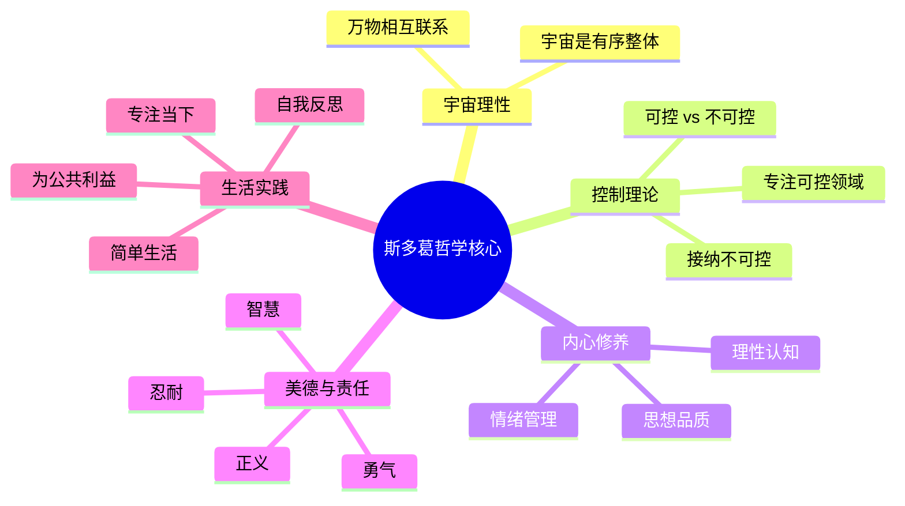
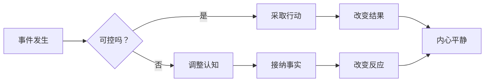
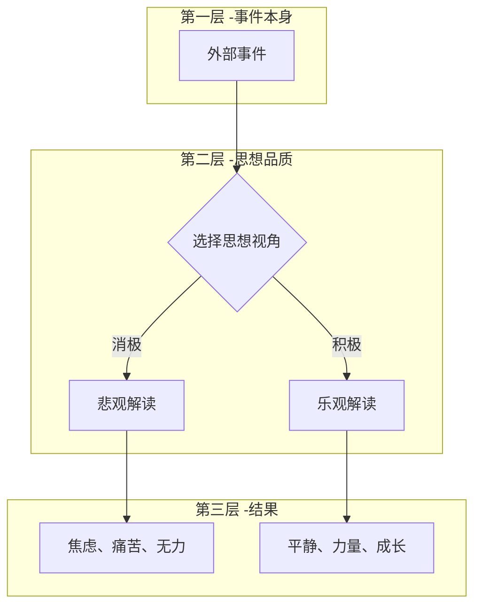
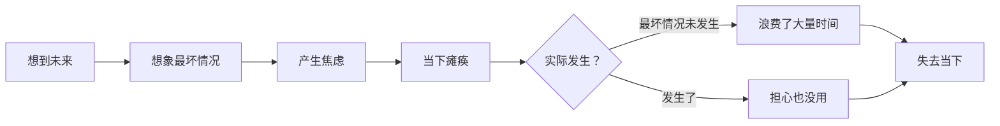
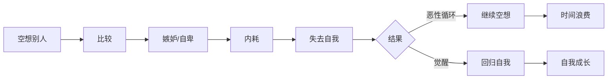
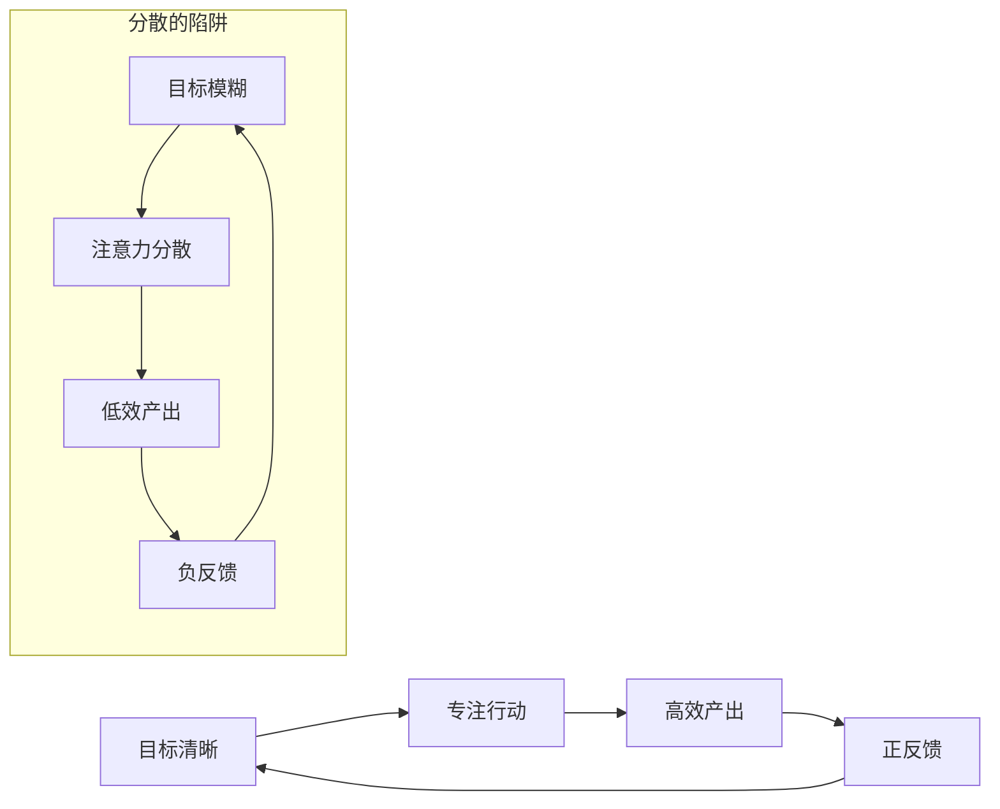
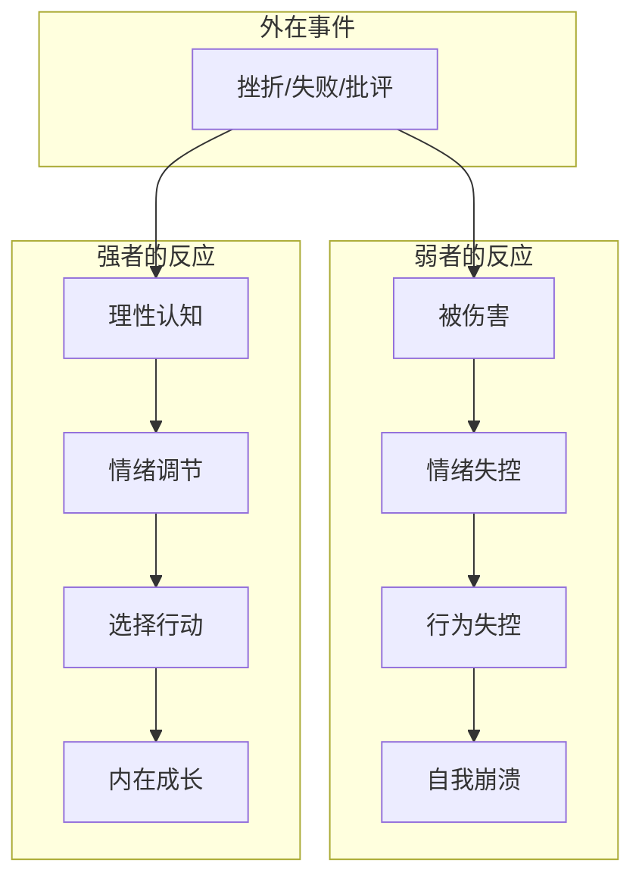

# 《沉思录》读书笔记

## 这本书要解决什么问题？

**核心困境**：外在世界充满混乱和不可控——战争、瘟疫、政治斗争，我们如何保持内心的平静和理性？我们是否只能被外在事件驱动？

**一句话定位**：
> 外在世界你无法控制，但你可以控制你的思想——真正的自由在内心，而不在外在。

### 作者站在什么位置说这些话？

| 维度 | 定位 |
|------|------|
| 主领域 | 斯多葛哲学（西方古代哲学三大支柱之一） |
| 跨界领域 | 心理学、认知科学、领导力、自我管理 |
| 作者背景 | 罗马帝国"五贤帝"时代最后一位皇帝，哲学家皇帝，斯多葛派晚期代表，公元170-180年间写成此书 |
| 知识定位 | 西方个人修养类经典，与东方《论语》并称 |

### 和其他书有什么关系？

| 关联书籍 | 关联关系 | 共同底层逻辑 |
|----------|----------|--------------|
| [[道德经-老子]] | 跨时空呼应 | 道法自然 ≈ 顺应宇宙理性——老子的"道"与奥勒留的"宇宙理性"都强调顺应自然规律 |
| [[庄子-庄子]] | 心灵自由 | 逍遥游 ≈ 内心平静——庄子超越外在依赖，奥勒留控制内在反应 |
| [[原则]] | 系统化人生 | 痛苦+反思=进化——奥勒留的自我反思 = 达利欧的痛苦反思机制 |
| [[五轮书-宫本武藏]] | 空之哲学 | 空 ≈ 无念无想——武藏的"空"与奥勒留的"无念观物"都是超越外在的境界 |
| [[孙子兵法]] | 战略思维 | 知彼知己 ≈ 认识自己与外在——孙子的信息优势 = 奥勒留的理性认知 |

### 知识网络图

---

## 作者的核心论点

### 你可以控制你的思想，但不能控制外在事件

公元170年代的罗马帝国，瘟疫横行，边境战争不断，宫廷阴谋层出不穷。马可·奥勒留作为帝国的最高统治者，每天面对的混乱比我们大多数人多得多。但他在军帐中写下了这句话："You have power over your mind – not outside events. Realize this, and you will find strength."

这不是空洞的心灵鸡汤——这是一个同时管理半个已知世界的皇帝，在最混乱的环境中总结出来的生存法则。

市场崩盘，你控制不了，但可以控制你的恐惧。同事无理取闹，你控制不了他，但可以控制你的愤怒。天下雨了，你控制不了天气，但可以控制你的失望。

控制二分法的心理机制：

四个维度的区分：你的看法、判断、态度是可控的，事实本身、他人行为是不可控的；你的选择、努力、决定是可控的，他人反应、外部环境是不可控的；你的情绪、回应方式是可控的，事件发生的结果是不可控的；你能影响的部分是可控的，最终结果是不可控的。

> **斯多葛控制定律**：真正的自由不是改变外在世界，而是改变你对外在世界的看法。你无法控制发生什么，但永远可以控制你如何反应。

你不能阻止下雨，但你可以选择是否打伞。外在世界你无法决定，但你的思想永远由你选择。

这个观点打碎了我对"自由"的理解。我一直以为自由是能改变环境、控制结果，但奥勒留说真正的自由发生在内心——即使你什么外在条件都改变不了，你仍然可以选择你如何看待这件事。下次遇到失控的局面，我不会再试图掌控一切，而是先分清"什么是可控的"，把精力只花在那里。

但光知道"控制可控"还不够。同样的事件，不同的人反应完全不同——这引出了下一个问题：什么决定了一个人的反应？

### 人生的幸福，取决于思想的品质

"The happiness of your life depends upon the quality of your thoughts." 这句话听起来像自助书的标题，但出自一个每天面对战争、瘟疫和背叛的皇帝之手，分量完全不同。

同样的加班，有人抱怨，有人把它看作提升机会。同样的失败，有人消沉，有人把它看作学习机会。同样的困难，有人恐惧，有人把它看作挑战。事件是中性的，你的思想给它染上颜色。

思想品质有三个维度：时间导向上，低品质的人活在过去或未来，高品质的人活在当下；价值判断上，低品质的人以外界评价为标准，高品质的人以内在价值观为标准；情绪管理上，低品质的人被情绪驱动，高品质的人驾驭情绪。

> **思想品质定律**：同样的外在事件，不同的人会有完全不同的体验。决定幸福的关键不是发生了什么，而是你怎么看待发生的事。

选择积极的视角，幸福就随之而来。这不是自我欺骗——奥勒留不是让你假装一切很好，而是让你看清事实的中性本质，然后选择最有力的解读方式。

以前我以为幸福取决于外在条件——工作顺利就幸福，遭遇挫折就痛苦。但奥勒留告诉我，事件是中性的，我的思想给它上了颜色。同一件事，不同的人有完全不同的体验，区别只在思想品质。下次遇到不顺的事，我不会再抱怨"为什么是我"，而是问自己：我能不能换一个更有力的视角来看这件事？

但光知道"思想品质决定幸福"还不够。最消耗思想品质的东西是什么？奥勒留指出了两个最大的敌人：为将来担忧，和空想别人。

### 不要为将来担忧

"Do not indulge in dreams of having what you have not, but reckon up the chief of the blessings you do possess." 奥勒留的这番话，在1800年后的焦虑社会里听起来格外刺耳。

为还没发生的工作焦虑，为不会发生的风险担心，为不确定的未来恐惧——这些现代人的日常，奥勒留全部经历过。作为皇帝，他每天面对的都是真正关乎生死存亡的不确定性。

担忧有三个陷阱。第一，把可能性当必然性——你想象的"最坏情况"大多不会发生。第二，当下瘫痪——因为担忧未来，无法在当下采取有效行动。第三，改变不了——担心不会改变结果，只会消耗你的精力。

> **当下定律**：为将来担忧，是对当下的双重浪费——既浪费了当下的时间，又不会改变将来的结果。最有效的是专注当下，做好现在能做的。

明天自有明天的烦恼，今天已经有今天的事。别用明天的担忧偷走今天的平静。

这打碎了我对"焦虑"的理解。我一直以为焦虑是对未来的合理准备——担心最坏情况才能避免它。但奥勒留指出，担忧是双重浪费：既浪费了当下的时间，又不会改变未来的结果。我担心的那些"最坏情况"大多不会发生，就算发生了，担忧也不会有任何帮助。下次陷入焦虑漩涡，我不会再继续想象"万一怎么办"，而是停下来问自己：我现在能做什么？做完了就放下，剩下的事交给时间。

为将来担忧消耗一个人的思想，但还有一个更隐蔽的消耗者——对他人生活的执念。

### 不要浪费残生去空想别人的事

奥勒留说："Do not waste what remains of your life in speculating about your neighbors." 如果他能看到1800年后的人类每天花几个小时刷社交媒体，盯着别人的生活看，他大概会摇头。

空想别人的心理机制是一个恶性循环：盯着别人 → 比较 → 嫉妒或自卑 → 内耗 → 失去自我 → 继续空想 → 时间浪费。觉醒的人会从这个循环中跳出来，回归自我成长。

空想别人有三个代价：本可以用于成长的时间被浪费，情绪能量被消耗，迷失在他人的世界里忘了自己是谁。替代方案是专注自我成长，专注可控之事，回归内在价值观。

> **专注自我定律**：你无法改变别人，但可以改变自己。空想别人是对自己生命的浪费，回归自我是智慧的开始。

别人的生活是别人的，你的生活是你的。把时间花在别人身上，就是对自己生命的背叛。

这个观点直击我的软肋。我每天花多少时间刷社交媒体，盯着别人的生活看？那些时间本可以用来读书、锻炼、工作，却被"空想别人"吞噬了。更糟糕的是，看完之后不是嫉妒就是自卑——双重损耗。下次手指不自觉地滑向社交软件时，我会先问自己：看这个对我有什么帮助？如果没有，就把这份时间还给自己。

知道了要控制可控、培养思想品质、不为未来担忧、不空想别人之后，还需要一个统摄性的行动原则。

### 做事不可迟缓，言谈不可杂乱，思想不可游移

奥勒留用一句话概括了他对行动、表达和思考的统一要求："Let nothing be done hastily, nothing in a disorderly way." 专注是贯穿这三个维度的核心力量。

专注和分散会各自形成循环。专注循环：目标清晰 → 专注行动 → 高效产出 → 正反馈 → 目标更清晰。分散循环：目标模糊 → 注意力分散 → 低效产出 → 负反馈 → 更加模糊。你进入哪个循环，就走向哪种人生。

三个维度上：行动上，迟缓拖延的反面是坚定持续；言谈上，杂乱矛盾的反面是清晰一致；思想上，游移不定的反面是稳定专注。

> **专注定律**：专注是最高效的力量。把你的能量集中在最重要的少数事情上，比分散在无数不重要的事情上更有价值。

一件事做到极致，胜过平庸地做十件事。不要追十只兔子，专注抓一只。

以前我总觉得"多线程"是高效的标志——同时处理好几件事，显得我很忙很能干。但奥勒留让我看到，分散的能量是低效的。追十只兔子的人，最后一只也抓不到。专注的人看似慢，实际走得最快。下次手头同时开着好几个任务时，我不会再觉得自己"效率高"，而是诚实地问自己：我真的在推进重要的事，还是在制造忙碌的幻觉？

但这只是方法层面的修炼。当外在的打击足够大时——战争、瘟疫、背叛——你的内心还能站得住吗？奥勒留给出的答案是：可以。

### 心灵是不可征服的

"Your mind will be like a palace whose doors are wide open to all comers. Or it will be like a strongroom, with its iron-bound doors shut and sealed." 奥勒留用宫殿和保险库的对比，描述了心灵的两种状态。

这不是空洞的比喻。奥勒留本人经历了瘟疫、战争、叛乱、背叛——他的宫殿被反复攻击，但他的内心始终没有被征服。

面对同样的挫折，弱者的链条是：被伤害 → 情绪失控 → 行为失控 → 自我崩溃。强者的链条是：理性认知 → 情绪调节 → 选择行动 → 内在成长。区别不在事件本身，在于内在的应对方式。

不可征服的心灵有三个层次。第一层：理性认知——认清事件本质，不把它放大也不缩小。第二层：情绪调节——不被情绪驱动，观察情绪而不被它控制。第三层：行动选择——坚持内在价值观，做正确的事而不是舒服的事。

> **心灵不可征服定律**：没有任何外在事件能征服一个理性的人。真正的强大不是从不受伤害，而是从伤害中恢复，并保持内在的平静。

外在世界可以伤害你的身体，但无法征服你的心灵。只要你的思想由你掌控，你就永远是自由的。

这引出了我对"强大"的重新定义。我一直以为强大是外在的——有钱、有权、有地位、有资源。但奥勒留告诉我，真正的强大在内在。外在的一切都可能被剥夺，但你的思想永远属于你。一个被关在牢里的人，如果内心不被征服，他仍然是自由的。下次遭遇挫折或打击，我不会再抱怨"为什么偏偏是我"，而是问自己：这件事能征服我的思想吗？如果不能，我就仍然是自己命运的主人。

---

## 这本书的局限

> 《沉思录》是罗马皇帝的私人日记，从未打算公开出版，这决定了它的特点和盲区。

| 批评点 | 谁在批评 | 怎么说 | 实际情况 |
|--------|---------|--------|---------|
| 过于理性忽略情感 | 现代心理学家 | 斯多葛哲学压抑情感，不利于心理健康 | 奥勒留说的是"驾驭情感"不是"消灭情感"，但确实容易被误解为情感压抑 |
| 皇帝的特权视角 | 社会评论家 | 奥勒留是皇帝，说"接受命运"容易——他有权力改变命运 | 奥勒留面对的困境比普通人更极端（战争、瘟疫），但"接受命运"对没有权力的人来说确实更难实践 |
| 缺乏系统性 | 哲学史家 | 这是日记不是论文，观点分散、重复、没有结构 | 正因为不是论文才更真实，但作为哲学入门确实不够清晰 |
| 罗素评价"过于顺从" | 罗素 | 斯多葛学派削弱了反抗精神 | 接受不可控的是心态，改变可控的是行动——两者并不矛盾，但实践中确实可能滑向消极 |
| 现代适用性存疑 | 当代读者 | 1800年前的皇帝智慧能指导现代生活吗？ | 人性的基本困境没变——焦虑、恐惧、愤怒、比较——奥勒留面对的还是这些问题 |

**一句话总结局限性**：
> 核心洞察（控制二分法、思想品质）穿越时空依然有效，但"接受命运"的部分需要与现代的"主动改变"精神平衡使用。

---

## 最值得记住的话

**原书说的**：
1. "You have power over your mind – not outside events. Realize this, and you will find strength."
2. "The happiness of your life depends upon the quality of your thoughts."
3. "Everything we hear is an opinion, not a fact. Everything we see is a perspective, not the truth."
4. "When you arise in the morning, think of what a precious privilege it is to be alive, to breathe, to think, to enjoy, to love."
5. "The best revenge is not to be like your enemy."
6. "Loss is nothing else but change, and change is Nature's delight."
7. "Waste no more time arguing about what a good man should be. Be one."
8. "The impediment to action advances action. What stands in the way becomes the way."
9. "Very little is needed to make a happy life; it is all within yourself, in your way of thinking."
10. "Choose not to be harmed, and you won't feel harmed. Don't feel harmed, and you haven't been."
11. "No man is free who is not master of himself."
12. "Be tolerant with others and strict with yourself."
13. "Do not act as if you were going to live ten thousand years."
14. "Accept the things to which fate binds you, and love the people with whom fate brings you together, but do so with all your heart."
15. "If someone is able to show me that what I think or do is not right, I will happily change, for I seek the truth, by which no one was ever truly harmed."

**翻译成人话**：
1. 外在世界你无法控制，但你的思想永远由你选择
2. 不是发生了什么决定你的幸福，而是你怎么看
3. 一切你听到的都是观点不是事实，一切你看到的都是视角不是真理
4. 每天醒来都是奇迹——能活着、能呼吸、能思考、能爱
5. 最好的报复不是成为像你敌人那样的人
6. 失去就是变化，变化是自然的快乐
7. 别争论什么是好人，做一个就是了
8. 障碍就是道路，困难就是机会
9. 幸福很简单，全在你的思想品质里
10. 选择不被伤害，你就不会感到被伤害
11. 不能掌控自己的人不配谈自由
12. 对他人宽容，对自己严格
13. 不要活得好像你还能活一万年
14. 接受命运，爱命运，全心全意地
15. 如果有人能证明我错了，我会高兴地改变——因为我在寻求真理

---

## 讲给没读过的人听

想象一下：你是全世界最有权力的人。你统治的帝国横跨三大洲，你的命令可以改变千万人的命运。但同时，你的帝国正在被瘟疫吞噬，边境有蛮族入侵，你的将军可能叛变，你的亲生儿子不像你能接班。

这就是马可·奥勒留的日常。他是罗马帝国的皇帝，公元170年代，每天处理的就是这些事。但他在军帐里，在行军途中，在一切间隙时间里，写了一本给自己看的日记。这本日记后来被称为《沉思录》。

日记里没有治国方略，没有军事谋略，有的只是一个问题：外在世界这么混乱，我怎么保持内心平静？

他的答案简单到让人不舒服：你控制不了外在世界，但你能控制你的思想。市场崩盘你控制不了，但你能控制你的恐惧。别人对你无礼你控制不了，但你能控制你的愤怒。天要下雨你控制不了，但你能控制你的失望。

这听起来像在说"认命"？不是。奥勒留说的恰恰是——在你控制不了的事情上不要浪费精力，把所有力量集中在你控制得了的事情上：你的判断、你的选择、你的行动。

他还说了一件更反直觉的事：你的幸福不取决于发生了什么，而取决于你怎么看待发生的事。同样的加班，有人痛苦，有人当成学习机会。事件是中性的，你的思想给它上了色。

这本1800年前一个皇帝写给自己的日记，到今天还能打动人，原因很简单：人性的基本困境没变。我们还是会焦虑、会恐惧、会愤怒、会跟别人比较。奥勒留没有给出解决方案，他给的是一种思维习惯——每次失控的时候，问自己：这件事我控制得了吗？控制不了就放下，控制得了就行动。

---

## 用来检验理解的问题

**基础回忆**：
1. Q: 斯多葛哲学的"控制二分法"是什么？
   A: 把一切分为可控和不可控。思想、态度、选择是可控的；外在事件、他人行为、最终结果是不可控的。把精力集中在可控领域。

2. Q: 奥勒留对"思想品质"的定义包含哪三个维度？
   A: 时间导向（活在当下 vs 活在过去/未来）、价值判断（内在标准 vs 外界评价）、情绪管理（驾驭情绪 vs 被情绪驱动）。

3. Q: "障碍就是道路"是什么意思？
   A: 阻碍你前进的东西，恰恰是你成长的契机。困难不是要避开的障碍，而是要通过的路。

**理解验证**：
1. Q: 为什么"为将来担忧"是双重浪费？
   A: 既浪费了当下的时间（你本可以做有价值的事），又不会改变将来的结果（担忧不改变事实）。

2. Q: 奥勒留说"选择不被伤害，你就不会感到被伤害"，这是自我欺骗吗？
   A: 不是。他的意思是：伤害不在事件本身，而在你对事件的判断。同样一句批评，有人受伤，有人无感——区别在于你如何解读它。

3. Q: "心灵不可征服"的三个层次是什么？
   A: 第一层是理性认知（看清事件本质），第二层是情绪调节（不被情绪驱动），第三层是行动选择（坚持内在价值观）。

**实际应用**：
1. Q: 选一个你正在焦虑的事情，用控制二分法分析。
   A: 分清：哪些部分是可控的（你的准备、你的态度），哪些是不可控的（结果、他人的反应）。只把精力花在可控部分。

2. Q: 你每天花多少时间"空想别人的事"（刷社交媒体、比较、关注他人的评价）？用奥勒留的方法怎么调整？
   A: 意识到这是在浪费生命。每次想看别人的生活时，问自己：这对我有什么帮助？如果没有，回到自己的事情上。

**深度分析**：
1. Q: 奥勒留的"接受命运"和消极被动有什么区别？
   A: 接受命运是心态层面的——不抗拒已经发生的事实。但在行动层面，奥勒留强调"做你该做的事"。他自己是皇帝，每天处理政务、指挥军队，绝对不是消极的。关键是：接受你改变不了的，全力以赴改变你能改变的。

2. Q: 斯多葛哲学和佛教的"放下"有什么异同？
   A: 两者都强调不被外在事物控制内心。但斯多葛哲学更强调理性和行动——用理性认知来驾驭情绪，然后在现实中采取行动。佛教的"放下"更偏向彻底的超越——看破执着的根源。斯多葛是"战斗中的平静"，佛教更接近"超越战斗本身"。

---

## 和其他书的对话

老子和奥勒留是跨越时空的灵魂伴侣。老子的"道法自然"和奥勒留的"顺应宇宙理性"说的几乎是同一件事——宇宙有自己的运行规律，人类最聪明的做法不是对抗，而是顺应。老子的"无为而治"和奥勒留的"控制可控"也相通——都是在不可控中找到可控。但有一个微妙的差异：老子更超脱，像站在山顶看风景；奥勒留更入世，像在战场中央保持冷静。一个教你退出游戏，一个教你在游戏中保持清醒。读完《道德经》再读《沉思录》，你会发现东西方智慧的最高境界殊途同归。

庄子要你"逍遥游"——超越一切束缚，物我两忘。奥勒留要你"控制可控"——在束缚中找到自己能掌控的部分。看起来方向相反，其实是同一个追求的不同表达：庄子用出世的方式获得自由，奥勒留用入世的方式获得平静。"齐物论"说万物平等无分别，"思想品质"说改变视角就能改变体验——都是告诉你：你以为的现实，只是你视角的产物。庄子教你换一个更大的视角来看问题，奥勒留教你用理性的视角来看问题。

达利欧的"痛苦+反思=进化"和奥勒留的自我反思是同一套成长机制。两个人都从痛苦中提炼智慧，都坚持每天反思，都把失败当成学习的机会。区别在于：达利欧把反思系统化为"原则"，要可复制、可验证；奥勒留把反思内化为"思想品质"，是个人修养。一个是现代投资家的操作系统，一个是古代皇帝的精神日记。但内核一样：从经历中学习，从痛苦中成长。

宫本武藏和奥勒留都在追求一种超越外在的内在状态。武藏的"空之哲学"和奥勒留的"无念观物"本质相通——不被外在形式束缚，在行动中达到自由。武藏说"平时如战时"，奥勒留说"静亦定动亦定"——都要你在任何环境下保持内心的稳定。区别在于武藏的战场是剑术对决，奥勒留的战场是人生本身。一个是武士的修行，一个是皇帝的修行。

孙子的"知彼知己"和奥勒留的"控制二分法"都是关于认清自己与外在世界的关系。孙子用在战场，奥勒留用在人生。孙子的核心是信息优势——了解自己和敌人的真实情况；奥勒留的核心是认知优势——了解什么是可控的什么是不可控的。一个追求"不战而胜"，一个追求"内心平静"——都是避免无谓消耗的智慧。

---

*拆解日期：2026-02-15*
*下次回访：1周后回顾「讲给没读过的人听」和「检验问题」*
