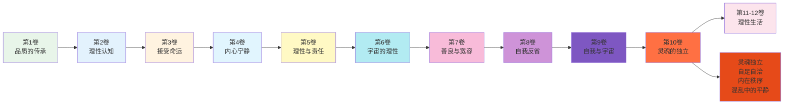
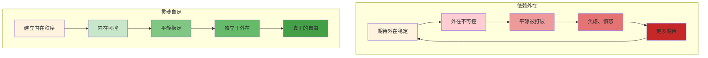
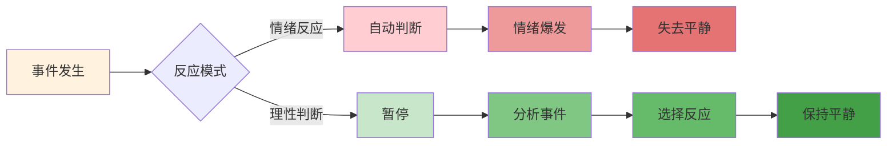
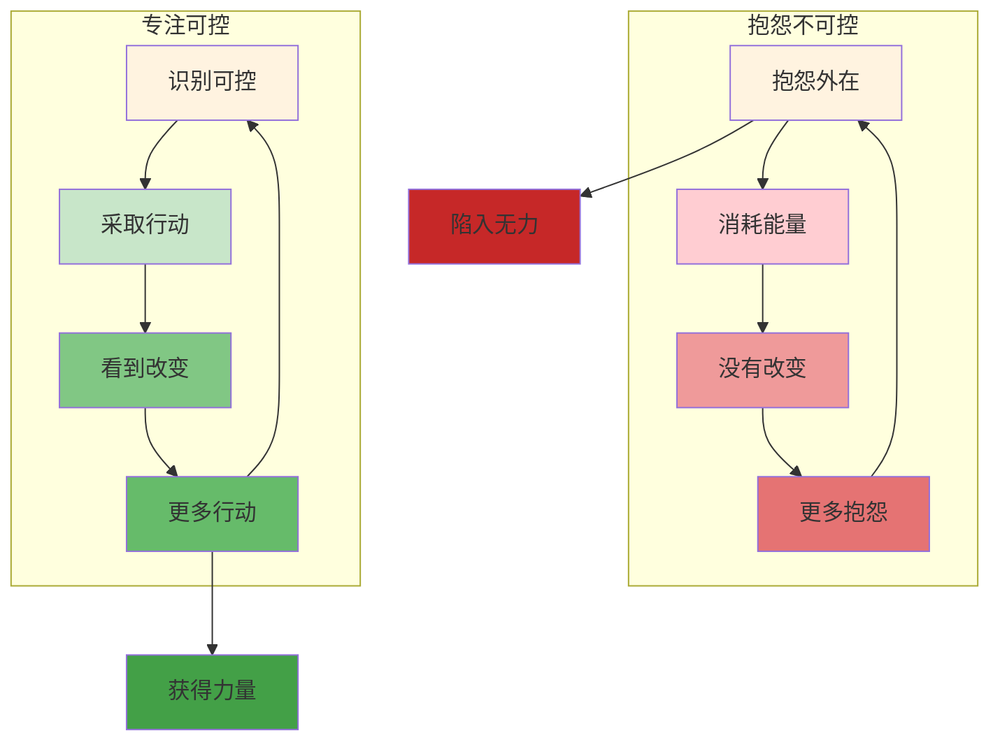
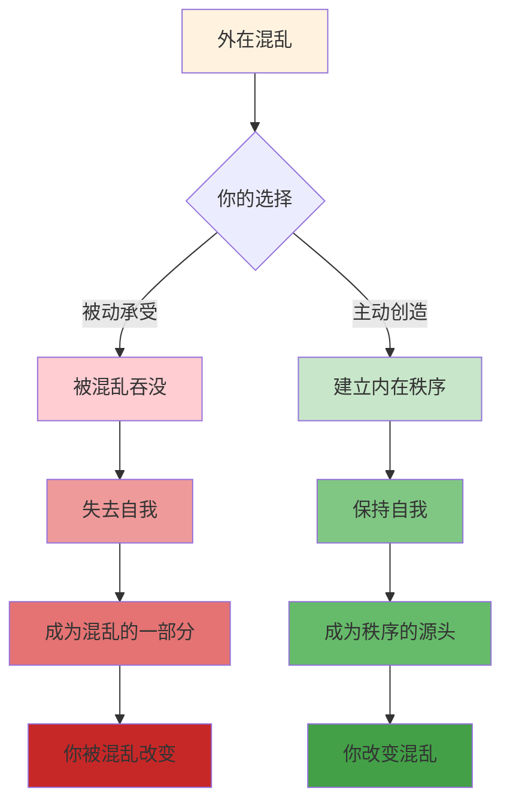
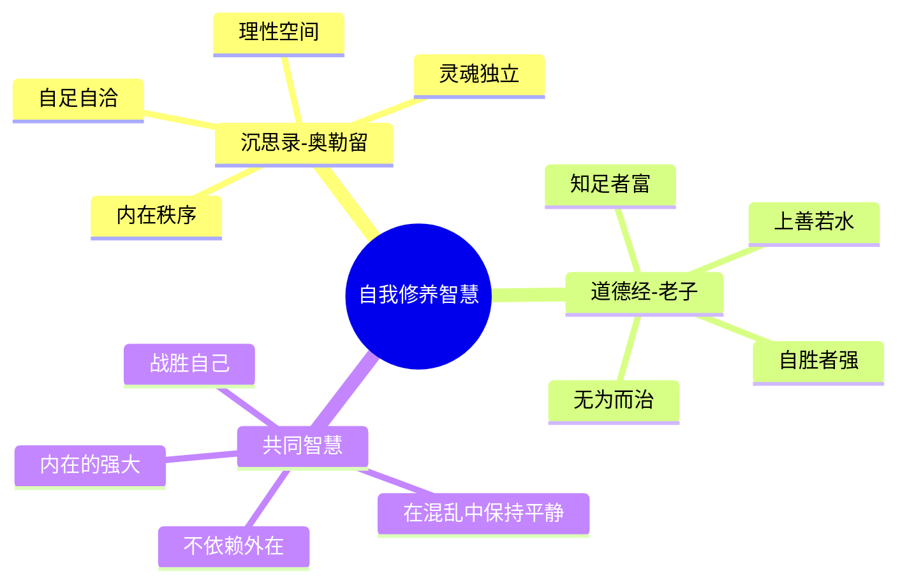

# 《沉思录》第10卷：灵魂的独立

> **核心主题**：灵魂的独立——如何在混乱中保持内心平静
> **章节定位**：从宇宙视角回归到灵魂实践，建立独立于外在的内在秩序
> **阅读时间**：约60分钟

---

## 一、章节定位

### 1.1 这一卷在解决什么问题？

**核心问题**：外在世界永远充满混乱——战争、瘟疫、政治阴谋、他人的恶意——我们如何在这些混乱中保持内心的平静？奥勒留的答案是：灵魂必须独立于外在，建立自己的秩序，不依赖外在的稳定来获得内在的稳定。

**一句话定位**：
> 真正的平静不是外在没有混乱，而是灵魂有足够的独立，能在混乱中创造自己的秩序。

---

### 1.2 这一卷在整本书中的位置



| 维度 | 定位 |
|------|------|
| **功能** | 从宇宙视角落实到灵魂实践，建立独立于外在的内在秩序 |
| **内容** | 灵魂独立、自足自洽、内在秩序、混乱中的平静、自我治理 |
| **风格** | 实践导向，从理论转向行动 |
| **目的** | 帮助读者建立灵魂的独立，在混乱中创造内在的秩序 |

---

### 1.3 与第9卷的关联

| 第9卷 | 第10卷 | 递进关系 |
|------|------|----------|
| 与宇宙合一 | 灵魂独立 | 宇宙 → 个体 |
| 宇宙视角 | 灵魂实践 | 理论 → 行动 |
| 在变化中保持恒常 | 在混乱中保持平静 | 抽象 → 具体 |
| 超越小我 | 建立内在秩序 | 超越 → 建设 |

**递进逻辑**：
```
第9卷：与宇宙合一，理解自己在宇宙中的位置（向上）
    ↓
第10卷：灵魂独立，建立自己的内在秩序（向内）
    ↓
核心转换：宇宙视角 → 灵魂实践
```

---

### 1.4 与第4卷的呼应

| 第4卷 | 第10卷 | 呼应关系 |
|------|------|----------|
| 内心的宁静（目标） | 灵魂的独立（方法） | 目标 → 手段 |
| 不被外在打扰 | 建立内在秩序 | 结果 → 过程 |
| 接受无法改变的 | 主动创造内在秩序 | 接受 → 创造 |

**呼应逻辑**：
```
第4卷：什么是内心的宁静（描述目标）
    ↓
第10卷：如何建立灵魂的独立（提供方法）
    ↓
核心转换：目标 → 手段
```

---

## 二、核心观点（三层提取）

### 观点1：灵魂必须自足，不依赖外在获得平静

#### 【表层】现象层

**奥勒留的原文**（10.1, 10.6, 10.23）：
> "The soul of man does violence to itself, first of all, when it becomes an abscess and, as it were, a tumor on the universe... when it turns away from any man, or even opposes him, with intent to harm him."
> "If any man has offended against you, consider first: What is my relation to men, and that we are made for one another; and in another respect, I was made to be set over them, as a ram over the flock or a bull over the herd."
> （人的灵魂首先伤害自己，当它变成一个脓肿，就像宇宙上的一个肿瘤...当它背离任何人，甚至反对他，意图伤害他。如果有人冒犯了你，首先考虑：我与人类的关系是什么，我们是为彼此而造的；另一方面，我被造来管理他们，就像公羊管理羊群或公牛管理牛群。）

**日常场景**：
- 期待他人的认可来获得平静
- 期待环境的稳定来获得平静
- 期待事情的顺利来获得平静
- 一旦期待落空，平静就崩溃

**降维翻译**：
> **你的平静如果依赖外在，你就永远不可能真正平静——因为外在永远不可控，真正的平静必须来自灵魂的自足。**

---

#### 【中层】机制层

**自足vs依赖的机制**：



**灵魂自足的三个维度**：

| 维度 | 依赖外在 | 灵魂自足 |
|------|----------|----------|
| **认可** | 需要他人认可才能平静 | 自己认可自己 |
| **环境** | 需要环境稳定才能平静 | 任何环境都平静 |
| **结果** | 需要事情顺利才能平静 | 接受任何结果都平静 |

---

#### 【底层】规律层

> **灵魂自足定律**：真正的平静不是外在没有混乱，而是灵魂足够独立，不需要外在的稳定来获得内在的稳定。灵魂自足的人，在任何环境下都能创造自己的秩序。

**降维翻译**：
> 你不需要外在来填充你，
> 你的灵魂本身就是完整的。
> 不是外在给你平静，
> 而是你给外在平静。
> 你就是平静的源头。

---

### 观点2：用理性判断替代情绪反应

#### 【表层】现象层

**奥勒留的原文**（10.3, 10.16, 10.25）：
> "Consider that before long you will be nobody and nowhere, nor will any of these things exist which you now see, nor any of those who are now living. For all things are formed by nature to change, be turned, and to perish, in order that other things may come into being in their turn."
> "Let the part of your soul which is superior and has authority over the rest stand aloof from the movements of the flesh, whether they be gentle or violent, and let it not mix with them, but bind its own parts together and limit them to their proper functions."
> （考虑一下，不久你将是什么都不是，也不存在于任何地方，你现在看到的一切都将不存在，现在活着的任何人也都将不存在。因为一切事物都被自然造来改变、转化和消亡，以便其他事物可以依次出现。让你灵魂中优越并有权威的部分远离肉体的运动，无论它们是温和的还是剧烈的，不要与它们混合，而是把自己部分绑在一起，限制它们在适当的功能内。）

**日常场景**：
- 被冒犯时立刻愤怒
- 被批评时立刻反击
- 被误解时立刻辩解
- 情绪反应比理性判断更快

**降维翻译**：
> **不是事件让你失去平静，而是你对事件的判断让你失去平静——在事件和反应之间，有一个空间，那个空间就是你的理性。**

---

#### 【中层】机制层

**理性判断vs情绪反应的机制**：



**理性判断的三个步骤**：

| 步骤 | 内容 | 目的 |
|------|------|------|
| **暂停** | 在事件和反应之间创造空间 | 阻断自动反应 |
| **分析** | 用理性看待事件本身 | 看清真相 |
| **选择** | 选择符合原则的反应 | 保持内在一致 |

---

#### 【底层】规律层

> **理性空间定律**：在事件和反应之间有一个空间，那个空间就是你的理性。大多数人没有这个空间，所以他们的反应是自动的。智慧的人扩大这个空间，在空间里选择自己的反应。

**降维翻译**：
> 刺激和反应之间，
> 有一个空间。
> 在那个空间里，
> 有你选择反应的自由。
> 扩大那个空间，
> 你就扩大了你的自由。

---

### 观点3：专注于你能控制的事情

#### 【表层】现象层

**奥勒留的原文**（10.11, 10.17, 10.34）：
> "Hear all opinions, but be guided only by those that are sound."
> "Let no one any longer hear from you any fault-finding, nor any self-indulgence in word or deed, nor any selfish complaining, nor any effeminacy or aversion."
> （听取所有意见，但只接受那些合理的。让任何人不再从你那里听到任何挑剔，任何言语或行为中的自我放纵，任何自私的抱怨，任何柔弱或厌恶。）

**日常场景**：
- 抱怨天气，天气不会改变
- 抱怨他人，他人不会改变
- 抱怨过去，过去不会改变
- 越抱怨，越痛苦

**降维翻译**：
> **抱怨是你能做的最无用的事——它改变不了外在，只会消耗你的内在。专注你能控制的，接受你不能控制的。**

---

#### 【中层】机制层

**专注可控vs抱怨不可控的机制**：



**可控vs不可控的区分**：

| 类型 | 可控 | 不可控 |
|------|------|--------|
| **过去** | 从中学习 | 改变它 |
| **他人** | 你的回应 | 他们的行为 |
| **结果** | 你的努力 | 最终结果 |
| **当下** | 你的选择 | 外在环境 |

---

#### 【底层】规律层

> **专注可控定律**：你的能量是有限的，把能量花在不可控的事情上是浪费。专注你能控制的：你的思想、你的行动、你的态度。当你专注可控，你就获得了真正的力量。

**降维翻译**：
> 抱怨解决不了问题，
> 行动才能。
> 专注你能改变的，
> 接受你不能改变的。
> 智慧在于区分这两者。

---

### 观点4：在混乱中创造内在的秩序

#### 【表层】现象层

**奥勒留的原文**（10.6, 10.31, 10.38）：
> "Either the gods have power or they have not... pray to be able to do without either."
> "Let your mind feed on the idea that it is your duty to be good, simple, and to preserve these qualities in all that you think, say, and do."
> （神有权力或没有...祈祷你能不需要任何东西。让你的心灵以这个想法为食：你的责任是善良、简单，并在你所有思想、言语和行为中保持这些品质。）

**日常场景**：
- 外在越混乱，内在越需要秩序
- 别人越失态，你越需要克制
- 环境越糟糕，你越需要冷静
- 不是被动承受，而是主动创造

**降维翻译**：
> **混乱不是你失去平静的理由，而是你创造秩序的机会——真正的强者不是生活在没有混乱的环境中，而是在混乱中创造自己的秩序。**

---

#### 【中层】机制层

**在混乱中创造秩序的机制**：



**创造内在秩序的三个要素**：

| 要素 | 内容 | 功能 |
|------|------|------|
| **原则** | 你坚持不变的东西 | 在混乱中找到方向 |
| **节奏** | 你日常的规律 | 在混乱中找到稳定 |
| **边界** | 你不越线的地方 | 在混乱中找到安全 |

---

#### 【底层】规律层

> **内在秩序定律**：混乱是外在的常态，秩序是你内在的选择。真正的强者不是等待外在变得有序，而是在任何混乱中都能创造自己的秩序。你不是被环境塑造，而是用你的秩序去影响环境。

**降维翻译**：
> 外在永远是混乱的，
> 但你的内在可以是秩序的。
> 不是等混乱过去，
> 而是在混乱中建立秩序。
> 你是平静的创造者，
> 不是混乱的受害者。

---

## 三、金句库

### 原文金句

1. "The soul of man does violence to itself when it becomes an abscess on the universe."（10.1）
2. "Consider that before long you will be nobody and nowhere."（10.3）
3. "Hear all opinions, but be guided only by those that are sound."（10.11）
4. "Let no one any longer hear from you any fault-finding."（10.17）
5. "Either the gods have power or they have not—pray to be able to do without either."（10.6）
6. "Let your mind feed on the idea that it is your duty to be good and simple."（10.31）
7. "The universe is transformation; life is opinion."（10.33）
8. "Loss is nothing else but change."（10.34）

---

### 降维金句（人话版）

1. **你的平静如果依赖外在，你就永远不可能真正平静——真正的平静必须来自灵魂的自足。**
2. **不是事件让你失去平静，而是你对事件的判断让你失去平静——在刺激和反应之间，有你的自由。**
3. **抱怨是你能做的最无用的事——它改变不了外在，只会消耗你的内在。**
4. **混乱不是你失去平静的理由，而是你创造秩序的机会。**
5. **真正的强者不是生活在没有混乱的环境中，而是在混乱中创造自己的秩序。**
6. **刺激和反应之间有一个空间，在那个空间里，有你选择反应的自由。**
7. **你的能量是有限的，把能量花在不可控的事情上是浪费。**
8. **你不是被环境塑造，而是用你的秩序去影响环境。**

---

## 四、当下映射

### 2026年读者的困惑

|------|--------------|----------|
| 总是被外在影响怎么办？ | 建立灵魂的独立，不依赖外在获得平静 | "找到方法了" |
| 如何控制情绪？ | 在刺激和反应之间创造空间，用理性判断替代情绪反应 | "可以做到" |
| 抱怨有用吗？ | 抱怨是最无用的事，专注你能控制的 | "觉醒了" |
| 环境太混乱怎么办？ | 在混乱中创造自己的秩序，成为秩序的源头 | "有力量了" |
| 如何保持内心平静？ | 灵魂自足，专注可控，建立内在秩序 | "系统清晰了" |

---

### 现代应用场景

**场景1：社交媒体焦虑**
- 困惑：总是被他人的生活影响
- 根源：灵魂依赖外在认可
- 应用：建立灵魂的独立，不需要外在认可来获得平静

**场景2：职场冲突**
- 困惑：被同事冒犯就失去冷静
- 根源：没有理性空间，情绪反应太快
- 应用：在冒犯和反应之间创造空间，选择理性回应

**场景3：经济不确定性**
- 困惑：担心经济形势，焦虑不安
- 根源：专注不可控，抱怨太多
- 应用：专注你能控制的，接受你不能控制的

**场景4：家庭矛盾**
- 困惑：家庭环境混乱，无法平静
- 根源：被混乱吞没，没有创造自己的秩序
- 应用：在家庭混乱中创造自己的内在秩序，成为平静的源头

---

## 五、章节关联

### 与《沉思录》其他章节的关联

| 章节 | 关联类型 | 共同逻辑 |
|------|----------|----------|
| **第2卷** | 基础 | 控制二分法 → 专注可控，接受不可控 |
| **第4卷** | 呼应 | 内心宁静（目标）→ 灵魂独立（方法）|
| **第6卷** | 承接 | 宇宙理性 → 在混乱中顺应宇宙 |
| **第8卷** | 准备 | 自我反省 → 认识自己才能独立 |
| **第9卷** | 递进 | 与宇宙合一 → 灵魂独立（理论→实践）|
| **第10卷** | 核心 | 灵魂独立、理性空间、专注可控、内在秩序 |
| **第11-12卷** | 应用 | 持续的灵魂独立实践 |

**核心思想递进**：
```
第2卷：控制你控制的（边界）
    ↓
第4卷：什么是内心宁静（目标）
    ↓
第8卷：认识自己（准备）
    ↓
第9卷：与宇宙合一（理论）
    ↓
第10卷：灵魂独立（实践）
    ↓
核心转换：理论 → 实践
```

---

### 与其他书籍的关联

| 书籍 | 关联类型 | 共同底层逻辑 |
|------|----------|--------------|

**东西方智慧共鸣**：
```
《沉思录》：灵魂独立 → 自足自洽 → 在混乱中创造秩序
《道德经》：自胜者强 → 知足者富 → 无为而治
共同逻辑：真正的强大是内在的，不是外在的
```

---

### 与《道德经》的深度对比

| 维度 | 《沉思录》奥勒留 | 《道德经》老子 | 共鸣点 |
|------|------------------|---------------|--------|
| **自我修养** | 灵魂独立 | 自胜者强 | 战胜自己 |
| **自足** | 自足自洽 | 知足者富 | 不依赖外在 |
| **应对混乱** | 在混乱中创造秩序 | 无为而治 | 超越混乱 |
| **方法** | 理性控制 | 自然无为 | 不同路径，同一终点 |

**跨时空共鸣**：
> 奥勒留的"灵魂独立"与老子的"自胜者强"
> 一个用理性，一个用自然
> 但都是关于同一个真理：真正的强大在内不在外
> 这就是东西方自我修养的完美共鸣

---

## 六、问答设计

### Q1：灵魂独立是什么意思？

**A**: 灵魂独立有四个层次：

| 层次 | 内容 | 标志 |
|------|------|------|
| **第一层** | 不依赖他人认可 | 你不需要别人说你很好 |
| **第二层** | 不依赖环境稳定 | 你在任何环境都平静 |
| **第三层** | 不依赖结果顺利 | 你接受任何结果都平静 |
| **第四层** | 成为平静的源头 | 你给外在平静，而不是外在给你 |

**关键区别**：
- 不是不需要外在，而是不依赖外在获得平静
- 不是与外在隔离，而是在外在中有内在

**记住**：灵魂独立不是孤立，而是独立于外在的稳定。

---

### Q2：如何在刺激和反应之间创造空间？

**A**: 三个步骤：

**步骤1：暂停**
- 当你感到情绪升起时，先暂停
- 不立刻反应，给自己几秒钟

**步骤2：问自己**
- 这个事件本身是什么？
- 我的判断是什么？
- 我的判断有必要吗？

**步骤3：选择**
- 选择符合你原则的反应
- 不是自动反应，而是理性选择

**练习方法**：
- 每次情绪升起时，默数3秒再反应
- 每天反思一次今天的反应，哪些可以更好

**记住**：空间是可以扩大的，越练习，空间越大。

---

### Q3：专注可控具体怎么做？

**A**: 三个步骤：

**步骤1：识别**
- 问自己：这件事我能控制什么？
- 区分可控和不可控

**步骤2：分类**
| 类型 | 你的态度 |
|------|----------|
| 过去 | 从中学习，不抱怨 |
| 他人 | 你如何回应，不期待改变 |
| 结果 | 你尽力，接受任何结果 |
| 当下 | 你选择什么行动 |

**步骤3：行动**
- 把能量放在可控的部分
- 不浪费能量在不可控的部分

**记住**：专注可控不是放弃，而是把能量用在最有价值的地方。

---

### Q4：如何在混乱中创造内在秩序？

**A**: 三个要素：

**要素1：原则**
- 确定你不改变的原则
- 例如：诚实、善良、理性
- 在混乱中，这些原则是你的指南针

**要素2：节奏**
- 建立你的日常节奏
- 例如：早起、读书、运动
- 在混乱中，这些节奏是你的锚

**要素3：边界**
- 确定你不越线的地方
- 例如：不发火、不抱怨、不妥协原则
- 在混乱中，这些边界是你的安全区

**记住**：内在秩序是你主动创造的，不是等外在给你的。

---

### Q5：第10卷和第9卷有什么区别？

**A**: 第9卷和第10卷的区别：

| 第9卷 | 第10卷 |
|------|------|
| 与宇宙合一 | 灵魂独立 |
| 宇宙视角 | 灵魂实践 |
| 理论 | 行动 |
| 向上（宇宙） | 向内（灵魂）|
| 超越小我 | 建立自我 |

**递进关系**：
- 第9卷：理解你在宇宙中的位置（认知）
- 第10卷：在混乱中实践你的独立（行动）

**结合**：先有宇宙视角（第9卷），再落实到灵魂实践（第10卷），两者结合才是完整的智慧。

---

## 七、实践练习

### 练习1：灵魂独立检查

每周一次，花15分钟：

| 我依赖什么获得平静？ | 这个依赖是必要的吗？ | 我可以如何减少依赖？ |
|----------------------|----------------------|----------------------|
| 示例：他人的认可 | 不是 | 建立自己的认可标准 |
|  |  |  |

---

### 练习2：理性空间扩大

每天一次，花5分钟：

1. 回忆今天你情绪反应最快的一件事
2. 问自己："在刺激和反应之间，我有空间吗？"
3. 问自己："如果我有空间，我会如何选择反应？"
4. 记录下来，下次类似情况尝试扩大空间

---

### 练习3：可控vs不可控分类

每周一次，花10分钟：

| 让我焦虑的事 | 我能控制的 | 我不能控制的 | 我的行动 |
|--------------|------------|--------------|----------|
| 示例：经济形势 | 我的消费、我的储蓄 | 市场走向 | 减少开支，增加储蓄 |
|  |  |  |  |

---

### 练习4：内在秩序建立

每周一次，花15分钟：

**我的原则**：
1. 
2. 
3. 

**我的节奏**：
- 早上：
- 中午：
- 晚上：

**我的边界**：
1. 我不...
2. 我不...
3. 我不...

---

## 八、章节总结

### 核心公式

```
在混乱中保持平静 = 灵魂自足 + 理性空间 + 专注可控 + 内在秩序
```

### 一句话总结

> 真正的平静不是外在没有混乱，而是灵魂足够独立，能在任何混乱中创造自己的秩序——自足、理性、专注、有序。

### 第10卷的核心贡献

1. **灵魂自足**：不依赖外在获得平静，平静来自内在
2. **理性空间**：在刺激和反应之间创造空间，选择反应
3. **专注可控**：把能量用在你能控制的事情上
4. **内在秩序**：在混乱中主动创造秩序，成为平静的源头

这四个工具，构成了灵魂独立的完整机制。

---

### 与《道德经》的终极共鸣



**跨时空的共鸣**：
> 奥勒留在罗马，老子在中国，相隔千年，却看到了同一个真理——真正的强大在内不在外，灵魂的独立是一切修养的基础。一个用理性，一个用自然，但都是为了同一个目标：在混乱的世界中，成为一个独立、自足、有序的人。

---
