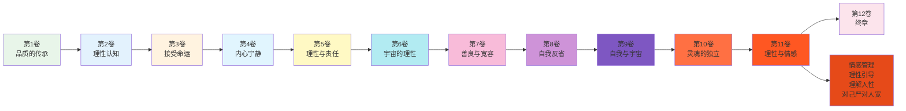
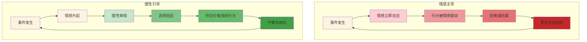
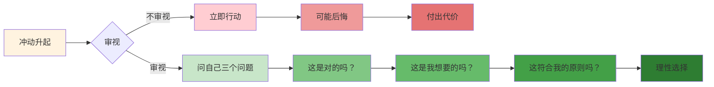
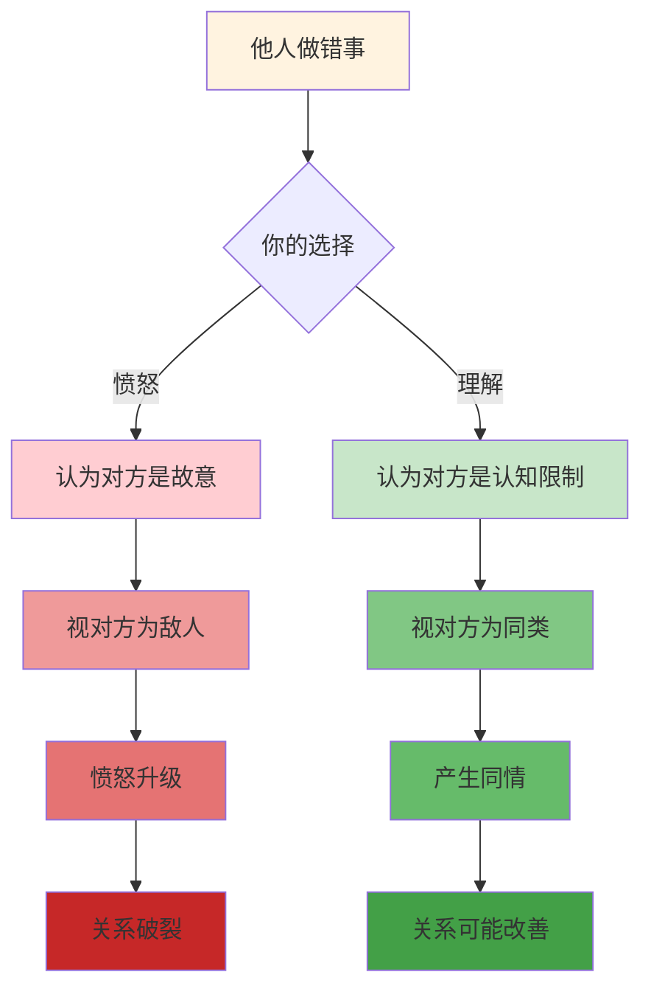
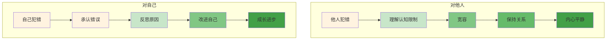
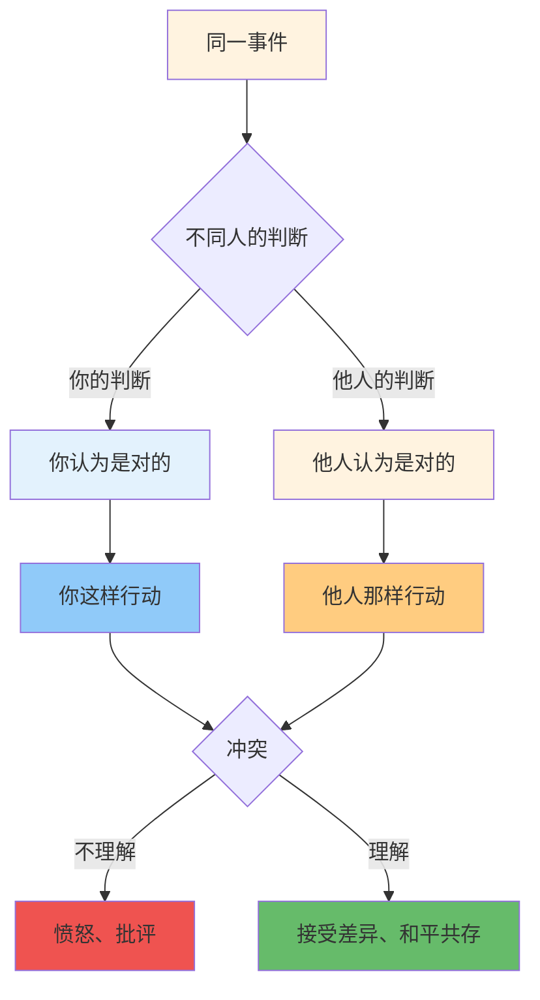
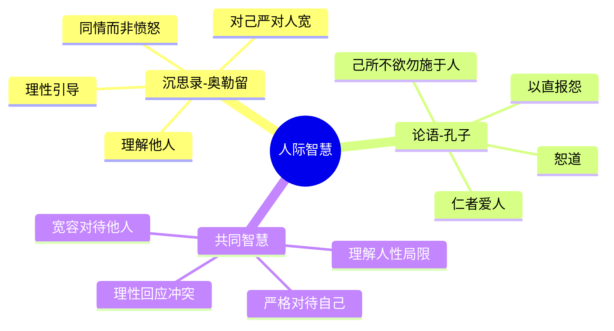

# 《沉思录》第11卷：理性与情感

> **核心主题**：理性与情感——如何用理性驾驭情感
> **章节定位**：从灵魂独立到情感管理，建立理性与情感的和谐关系
> **阅读时间**：约50分钟

---

## 一、章节定位

### 1.1 这一卷在解决什么问题？

**核心问题**：情感是人类最原始的力量——愤怒、欲望、恐惧、贪婪——它们来得快，去得慢，常常主导我们的行为。我们如何不被情感控制，而是用理性来驾驭情感？奥勒留的答案是：情感不是敌人，但需要理性的引导。你不必消灭情感，但必须让理性成为舵手。

**一句话定位**：
> 情感是马，理性是骑手——不是要杀死马，而是要学会骑马。

---

### 1.2 这一卷在整本书中的位置



| 维度 | 定位 |
|------|------|
| **功能** | 从灵魂独立深入到情感管理，建立理性与情感的和谐关系 |
| **内容** | 理性控制、情感管理、理解人性、对己严对人宽、认识判断 |
| **风格** | 实践导向，从灵魂修养转向日常情感管理 |
| **目的** | 帮助读者用理性驾驭情感，不被情感主导 |

---

### 1.3 与第10卷的关联

| 第10卷 | 第11卷 | 递进关系 |
|------|------|----------|
| 灵魂独立 | 理性驾驭情感 | 独立 → 管理 |
| 建立内在秩序 | 管理内在情感 | 秩序 → 细节 |
| 在混乱中保持平静 | 在情感中保持理性 | 宏观 → 微观 |
| 成为平静的源头 | 成为情感的主人 | 结果 → 过程 |

**递进逻辑**：
```
第10卷：灵魂独立，建立内在秩序（结构）
    ↓
第11卷：理性驾驭情感，管理内在波动（过程）
    ↓
核心转换：独立 → 管理
```

---

### 1.4 与第2卷的呼应

| 第2卷 | 第11卷 | 呼应关系 |
|------|------|----------|
| 理性认知（基础） | 理性控制（应用） | 理论 → 实践 |
| 认识控制二分法 | 用理性控制情感 | 认知 → 行动 |
| 理解可控与不可控 | 情感是可控的 | 原则 → 具体化 |

**呼应逻辑**：
```
第2卷：理性认知，理解什么是可控的（认知基础）
    ↓
第11卷：理性控制，把认知应用到情感管理（实践应用）
    ↓
核心转换：认知 → 实践
```

---

## 二、核心观点（三层提取）

### 观点1：情感不是敌人，但需要理性的引导

#### 【表层】现象层

**奥勒留的原文**（11.1, 11.18, 11.19）：
> "These are the properties of the rational soul: it sees itself, analyzes itself, and makes itself such as it chooses... it reaches out in all directions and comprehends the whole universe."
> "When a man has done you a wrong, immediately consider with what opinion about good or evil he has done wrong. For when you see this, you will pity him, and be neither surprised nor angry."
> （理性灵魂的属性是：它看见自己，分析自己，使自己成为它选择的样子……它向四面八方延伸，理解整个宇宙。当一个人对你做了错事，立即考虑他对善恶有什么看法。因为当你看到这一点，你会同情他，既不惊讶也不愤怒。）

**日常场景**：
- 被冒犯时立刻愤怒
- 被诱惑时立刻冲动
- 被恐惧时立刻逃避
- 情感来得比理性快

**降维翻译**：
> **情感来得快，去得慢，如果你不管理它，它就会管理你。情感不是敌人，但必须让理性成为舵手。**

---

#### 【中层】机制层

**理性与情感的关系机制**：



**情感vs理性的对比**：

| 维度 | 情感 | 理性 |
|------|------|------|
| **速度** | 快，瞬间 | 慢，需要时间 |
| **方向** | 短期利益 | 长期价值 |
| **稳定性** | 波动大 | 稳定 |
| **作用** | 提供动力 | 提供方向 |
| **危险** | 容易失控 | 可能冷漠 |

---

#### 【底层】规律层

> **理性骑手定律**：情感是马，理性是骑手。马有力量，骑手有方向。不是要杀死马，而是要学会骑马。没有情感的人是冷漠的，没有理性的人是冲动的，真正的智慧是让理性引导情感。

**降维翻译**：
> 情感给你力量，
> 理性给你方向。
> 不是要消灭情感，
> 而是要驾驭情感。
> 马需要骑手，
> 情感需要理性。

---

### 观点2：用理性审视每一个冲动

#### 【表层】现象层

**奥勒留的原文**（11.29, 11.33, 11.35）：
> "Is any man afraid of change? Why, what can take place without it? ... Can you yourself take your warm bath without the firewood being changed? Can you be fed without the food being changed? And can anything else be done without something being changed?"
> "How ridiculous and how strange to be surprised at anything which happens in life."
> （有人害怕变化吗？什么能没有变化发生？你能不用木头变化就洗热水澡吗？你能不吃食物变化就被喂养吗？其他任何事情能没有变化就完成吗？生活中发生的任何事都感到惊讶是多么荒谬和奇怪。）

**日常场景**：
- 冲动购物，买完后悔
- 冲动发言，说完后悔
- 冲动决定，做后后悔
- 每次冲动都留下痕迹

**降维翻译**：
> **冲动是你最大的敌人——它在几秒钟内做出的决定，可能需要几年去弥补。用理性审视每一个冲动，问自己：这是我想成为的人会做的事吗？**

---

#### 【中层】机制层

**审视冲动的机制**：



**审视冲动的三个问题**：

| 问题 | 目的 | 如果答案是"否" |
|------|------|----------------|
| **这是对的吗？** | 道德判断 | 不要做 |
| **这是我想要的吗？** | 长期利益 | 不要做 |
| **这符合我的原则吗？** | 价值观一致性 | 不要做 |

---

#### 【底层】规律层

> **冲动审视定律**：冲动是瞬间的，后果是长久的。每一次冲动都是一次选择——你选择让冲动控制你，还是你控制冲动。用理性审视每一个冲动，在几秒钟内问自己三个问题，可能改变你一生的轨迹。

**降维翻译**：
> 冲动是一瞬间的火焰，
> 后果是长久的灰烬。
> 在冲动和行动之间，
> 有你选择的空间。
> 问自己三个问题，
> 把冲动变成选择。

---

### 观点3：理解他人，原谅他人

#### 【表层】现象层

**奥勒留的原文**（11.13, 11.18, 11.20）：
> "To feel affection for people even when they make mistakes is uniquely human. You can do it, if you simply recognize: that they're human too, that they act out of ignorance, against their will, and that you'll both be dead before long."
> "When a man has done you a wrong, immediately consider with what opinion about good or evil he has done wrong. For when you see this, you will pity him, and be neither surprised nor angry."
> （即使人们犯错也对他们感到喜爱，这是人类独有的。你可以做到，如果你简单地认识到：他们也是人，他们出于无知行事，违背他们的意愿，你们两个很快都会死。当一个人对你做了错事，立即考虑他对善恶有什么看法。因为当你看到这一点，你会同情他，既不惊讶也不愤怒。）

**日常场景**：
- 别人做错事，立刻愤怒
- 别人冒犯你，立刻反击
- 别人不理解你，立刻委屈
- 总是把别人当敌人

**降维翻译**：
> **每个人都和你一样，是被自己的认知所限制的人。理解他们的局限，你就会同情而不是愤怒——他们不是故意做错，只是不知道更好的做法。**

---

#### 【中层】机制层

**理解vs愤怒的机制**：



**理解他人的三个角度**：

| 角度 | 内容 | 效果 |
|------|------|------|
| **他们也是人** | 和你一样不完美 | 降低期待 |
| **他们出于无知** | 不知道更好的做法 | 产生同情 |
| **你们都会死** | 生命短暂 | 珍惜当下 |

---

#### 【底层】规律层

> **理解人性定律**：愤怒来自于你认为对方是故意的。但如果你认识到每个人都是被自己的认知所限制，你就不会愤怒，只会同情。理解不是纵容，而是用更高的视角看待他人，这既保护了你自己，也可能帮助对方。

**降维翻译**：
> 别人做错事，
> 不是故意，
> 而是不知道更好的。
> 理解这一点，
> 你就会同情而不是愤怒。
> 愤怒伤己，
> 理解解己。

---

### 观点4：对自己严格，对他人宽容

#### 【表层】现象层

**奥勒留的原文**（11.5, 11.12, 11.39）：
> "Let your mind constantly dwell on the whole universe and eternity, thinking what a mere fragment of time each individual thing is, compared with eternity: a mere speck of a seed in the universe."
> "How to act: Never against truth, and never without due consideration of the circumstances."
> （让你的心灵不断思考整个宇宙和永恒，思考每个个体事物与永恒相比是多么微小的时间碎片：宇宙中的一粒种子。如何行动：永远不要违背真理，永远不要没有充分考虑情况。）

**日常场景**：
- 对别人要求高，对自己要求低
- 别人犯错不可原谅，自己犯错有理由
- 总是用放大镜看别人，用滤镜看自己
- 双重标准

**降维翻译**：
> **对别人宽容，因为你无法控制他们；对自己严格，因为你能控制自己。双标是人类最大的伪善，也是最大的痛苦来源。**

---

#### 【中层】机制层

**对己严对人宽的机制**：



**对己vs对人的标准**：

| 维度 | 对自己 | 对他人 |
|------|--------|--------|
| **要求** | 严格 | 宽容 |
| **原因** | 你能控制自己 | 你无法控制他人 |
| **焦点** | 如何改进 | 如何理解 |
| **结果** | 成长 | 关系和谐 |

---

#### 【底层】规律层

> **对己严对人宽定律**：你唯一能控制的是你自己，所以对自己的要求要严格。你无法控制他人，所以对他人的要求要宽容。这不是软弱，而是智慧——把你能控制的做到最好，接受你不能控制的。

**降维翻译**：
> 对自己严格，
> 因为你可以改变自己。
> 对他人宽容，
> 因为你无法改变他人。
> 这不是软弱，
> 而是把力量用在正确的地方。

---

### 观点5：认识到每个人都根据自己的判断行事

#### 【表层】现象层

**奥勒留的原文**（11.10, 11.18, 11.30）：
> "Say to yourself: 'Suppose this man acts this way because he thinks it is the right thing to do. It is impossible he should do otherwise; how then can I be angry with him for acting as he thinks right?'"
> "Wherever a man can live, there he can also live well."
> （对自己说：'假设这个人这样做是因为他认为这是对的。他不可能做别的；那我怎么能因为他做了他认为对的事而生气呢？'无论一个人能在哪里生活，他都能在那里生活得好。）

**日常场景**：
- 别人不认同你，你就生气
- 别人和你不一样，你就批评
- 总是认为自己是"对"的
- 无法接受不同的判断

**降维翻译**：
> **每个人都根据自己的判断行事，他们的"对"和你的"对"可能不同。理解这一点，你就不会愤怒，只会接受差异。**

---

#### 【中层】机制层

**判断差异的机制**：



**判断差异的三个层次**：

| 层次 | 内容 | 你的选择 |
|------|------|----------|
| **认知不同** | 信息和知识不同 | 理解 |
| **价值观不同** | 重视的东西不同 | 尊重 |
| **利益不同** | 追求的目标不同 | 接受 |

---

#### 【底层】规律层

> **判断差异定律**：每个人都根据自己的判断行事，没有人是故意做"错"事——他们只是根据自己的认知做他们认为"对"的事。理解这一点，你就不会愤怒，只会接受差异，或者尝试沟通。

**降维翻译**：
> 别人做"错"事，
> 是因为他们的"对"和你的不同。
> 没有人故意做错，
> 每个人都在做自己认为对的事。
> 理解差异，
> 减少冲突。

---

## 三、金句库

### 原文金句

1. "These are the properties of the rational soul: it sees itself, analyzes itself, and makes itself such as it chooses."（11.1）
2. "To feel affection for people even when they make mistakes is uniquely human."（11.13）
3. "When a man has done you a wrong, immediately consider with what opinion about good or evil he has done wrong."（11.18）
4. "How ridiculous and how strange to be surprised at anything which happens in life."（11.33）
5. "Say to yourself: 'Suppose this man acts this way because he thinks it is the right thing to do.'"（11.10）
6. "Wherever a man can live, there he can also live well."（11.30）
7. "Never against truth, and never without due consideration."（11.12）
8. "Let your mind constantly dwell on the whole universe and eternity."（11.5）

---

### 降维金句（人话版）

1. **情感是马，理性是骑手——不是要杀死马，而是要学会骑马。**
2. **冲动是一瞬间的火焰，后果是长久的灰烬。**
3. **每个人都根据自己的判断行事，他们的"对"和你的"对"可能不同。**
4. **对别人宽容，因为你无法控制他们；对自己严格，因为你能控制自己。**
5. **别人做错事不是故意，而是不知道更好的——理解这一点，你就会同情而不是愤怒。**
6. **在冲动和行动之间，有你选择的空间——问自己三个问题，把冲动变成选择。**
7. **愤怒来自于你认为对方是故意的，理解来自于你认识到对方是认知限制的。**
8. **双标是人类最大的伪善，也是最大的痛苦来源。**

---

## 四、当下映射

### 2026年读者的困惑

|------|--------------|----------|
| 总是控制不住情绪怎么办？ | 让理性成为舵手，不是消灭情感，而是引导情感 | "可以做到" |
| 冲动购物、冲动发言怎么破？ | 审视每一个冲动，问自己三个问题 | "有方法了" |
| 别人做错事，我总是很愤怒？ | 理解他人是认知限制，不是故意做错 | "释然了" |
| 如何处理人际关系？ | 对己严对人宽，理解差异，接受不同 | "系统清晰了" |
| 为什么总是双标？ | 对别人要求高，对自己要求低是人性弱点 | "被点醒了" |

---

### 现代应用场景

**场景1：社交媒体争论**
- 困惑：别人观点不同就生气
- 根源：认为对方是故意"错"
- 应用：理解对方根据自己的判断行事，接受差异

**场景2：职场冲突**
- 困惑：同事做错事影响我
- 根源：愤怒，认为对方是故意的
- 应用：理解对方可能不知道更好的做法，产生同情

**场景3：家庭矛盾**
- 困惑：家人不理解自己
- 根源：认为家人应该理解
- 应用：对家人宽容，理解他们的认知限制

**场景4：冲动消费**
- 困惑：总是买完后悔
- 根源：冲动没有审视
- 应用：买之前问自己三个问题，把冲动变成选择

---

## 五、章节关联

### 与《沉思录》其他章节的关联

| 章节 | 关联类型 | 共同逻辑 |
|------|----------|----------|
| **第2卷** | 基础 | 理性认知 → 理性控制 |
| **第7卷** | 呼应 | 善良与宽容 → 对己严对人宽 |
| **第10卷** | 递进 | 灵魂独立 → 理性驾驭情感 |
| **第11卷** | 核心 | 情感管理、理解人性、对己严对人宽、审视冲动 |

**核心思想递进**：
```
第2卷：理性认知，理解可控与不可控（认知基础）
    ↓
第7卷：善良与宽容，如何对待他人（人际基础）
    ↓
第10卷：灵魂独立，建立内在秩序（内在结构）
    ↓
第11卷：理性驾驭情感，管理内在波动（日常实践）
    ↓
核心转换：认知 → 人际 → 结构 → 实践
```

---

### 与其他书籍的关联

| 书籍 | 关联类型 | 共同底层逻辑 |
|------|----------|--------------|

**东西方智慧共鸣**：
```
《沉思录》：对己严对人宽 → 理解他人 → 理性引导情感
《论语》：己所不欲勿施于人 → 以直报怨 → 恕道
共同逻辑：用理性对待他人，用宽容化解冲突
```

---

### 与《论语》的深度对比

| 维度 | 《沉思录》奥勒留 | 《论语》孔子 | 共鸣点 |
|------|------------------|---------------|--------|
| **对待他人** | 对己严对人宽 | 己所不欲勿施于人 | 恕道 |
| **理解他人** | 理解认知限制 | 仁者爱人 | 同理心 |
| **应对冲突** | 产生同情，不愤怒 | 以直报怨 | 理性回应 |
| **方法** | 理性审视 | 仁义礼智 | 不同路径，同一终点 |

**跨时空共鸣**：
> 奥勒留的"对己严对人宽"与孔子的"己所不欲勿施于人"
> 一个用理性，一个用仁爱
> 但都是关于同一个真理：用宽容对待他人，用严格对待自己
> 这就是东西方人际智慧的完美共鸣

---

## 六、问答设计

### Q1：理性和情感是什么关系？

**A**: 理性和情感不是敌对关系，而是骑手和马的关系：

| 角色 | 功能 | 健康状态 |
|------|------|----------|
| **情感** | 提供动力和能量 | 存在但不主导 |
| **理性** | 提供方向和判断 | 引导但不压抑 |

**关键理解**：
- 不是要消灭情感——情感让你是人
- 而是要让理性引导情感——理性让你是智慧的人
- 没有情感的人是冷漠的，没有理性的人是冲动的

**记住**：情感是马，理性是骑手。马有力量，骑手有方向。

---

### Q2：如何审视冲动？

**A**: 三个步骤：

**步骤1：暂停**
- 当冲动升起时，先暂停
- 不立刻行动，给自己几秒钟

**步骤2：问自己三个问题**
| 问题 | 目的 |
|------|------|
| 这是对的吗？ | 道德判断 |
| 这是我想要的吗？ | 长期利益 |
| 这符合我的原则吗？ | 价值观一致性 |

**步骤3：选择**
- 如果三个问题都是"是"，可以行动
- 如果有任何一个是"否"，不要行动

**练习方法**：
- 每次冲动时，默数3秒再反应
- 每天反思今天的冲动，哪些可以避免

**记住**：冲动是瞬间的，后果是长久的。审视冲动，把冲动变成选择。

---

### Q3：如何理解他人的错误？

**A**: 三个角度：

**角度1：他们也是人**
- 和你一样不完美
- 也会犯错，也会迷茫
- 降低对他们的期待

**角度2：他们出于无知**
- 不知道更好的做法
- 根据自己的判断行事
- 他们不是故意做"错"，只是不知道"对"

**角度3：你们都会死**
- 生命短暂
- 珍惜当下
- 不值得为小事愤怒

**关键转换**：
```
愤怒：他们认为我是敌人，故意伤害我
    ↓
理解：他们和我一样，是被认知限制的人，不知道更好的做法
    ↓
结果：同情而不是愤怒
```

**记住**：愤怒伤己，理解解己。理解不是纵容，而是保护自己。

---

### Q4：如何做到对己严对人宽？

**A**: 两个方向：

**对自己严格**：
| 维度 | 内容 |
|------|------|
| **原因** | 你能控制自己 |
| **焦点** | 如何改进 |
| **标准** | 你能做到的最好 |
| **结果** | 成长进步 |

**对他人宽容**：
| 维度 | 内容 |
|------|------|
| **原因** | 你无法控制他人 |
| **焦点** | 如何理解 |
| **标准** | 他们能做到的最好 |
| **结果** | 关系和谐 |

**避免双标**：
- 不要用放大镜看别人，用滤镜看自己
- 对别人要求高，对自己要求低是人性弱点
- 真正的高手：对己严到极致，对人宽到天际

**记住**：把力量用在你能控制的——你自己。

---

### Q5：第11卷和第10卷有什么区别？

**A**: 第10卷和第11卷的区别：

| 第10卷 | 第11卷 |
|------|------|
| 灵魂独立 | 理性驾驭情感 |
| 建立内在秩序 | 管理内在波动 |
| 结构 | 过程 |
| 宏观（整体状态） | 微观（具体情感） |

**递进关系**：
- 第10卷：建立灵魂的独立结构（框架）
- 第11卷：在框架内管理日常情感（细节）

**结合**：先有灵魂独立的结构（第10卷），再落实到日常情感管理（第11卷），两者结合才是完整的智慧。

---

## 七、实践练习

### 练习1：情感日记

每天一次，花10分钟：

| 今天的主要情感 | 触发事件 | 理性审视 | 更好的回应 |
|----------------|----------|----------|------------|
| 示例：愤怒 | 同事批评 | 他可能不知道更好的做法 | 同情，理性回应 |
|  |  |  |  |

---

### 练习2：冲动审视

每次冲动时，花1分钟：

1. 暂停3秒
2. 问自己三个问题：
   - 这是对的吗？
   - 这是我想要的吗？
   - 这符合我的原则吗？
3. 记录结果

| 冲动 | 三个问题的答案 | 是否行动 |
|------|----------------|----------|
|  |  |  |

---

### 练习3：理解他人

每周一次，花15分钟：

| 让我愤怒的人 | 他们的认知限制 | 我如何理解他们 | 我更好的回应 |
|--------------|----------------|----------------|--------------|
| 示例：批评我的同事 | 他不知道更好的表达方式 | 他是在帮助我，只是方式不好 | 感谢他的建议，忽略他的方式 |
|  |  |  |  |

---

### 练习4：对己严对人宽

每周一次，花10分钟：

**我对自己的要求**：
1. 
2. 
3. 

**我对他人应该更加宽容的地方**：
1. 
2. 
3. 

---

## 八、章节总结

### 核心公式

```
理性驾驭情感 = 理性引导 + 审视冲动 + 理解他人 + 对己严对人宽
```

### 一句话总结

> 情感是马，理性是骑手——不是要消灭情感，而是让理性引导情感，审视每一个冲动，理解他人的认知限制，对自己严格，对他人宽容。

### 第11卷的核心贡献

1. **理性引导**：让理性成为情感的舵手，不是消灭情感，而是引导情感
2. **审视冲动**：在冲动和行动之间创造空间，用三个问题审视每一个冲动
3. **理解他人**：认识到每个人都是认知限制的，产生同情而不是愤怒
4. **对己严对人宽**：把力量用在你能控制的——你自己

这四个工具，构成了理性驾驭情感的完整机制。

---

### 与《论语》的终极共鸣



**跨时空的共鸣**：
> 奥勒留在罗马，孔子在中国，相隔千年，却看到了同一个真理——真正的智慧不是用愤怒回应冲突，而是用理解化解冲突。一个用理性，一个用仁爱，但都是为了同一个目标：在人际关系的复杂中，成为一个有智慧、有宽容的人。

---
