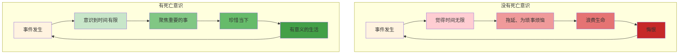
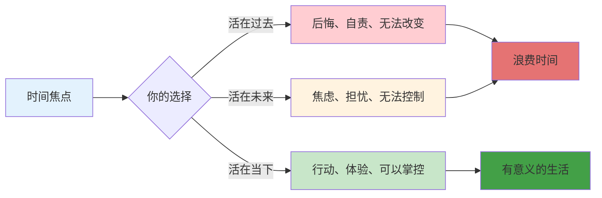
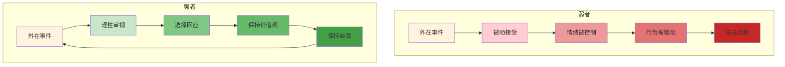
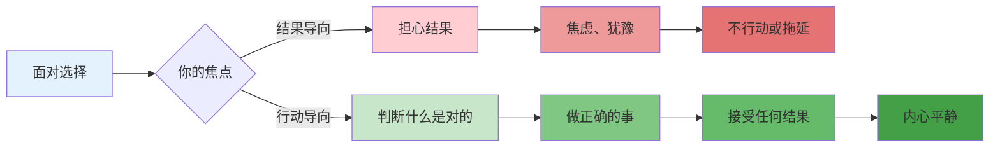
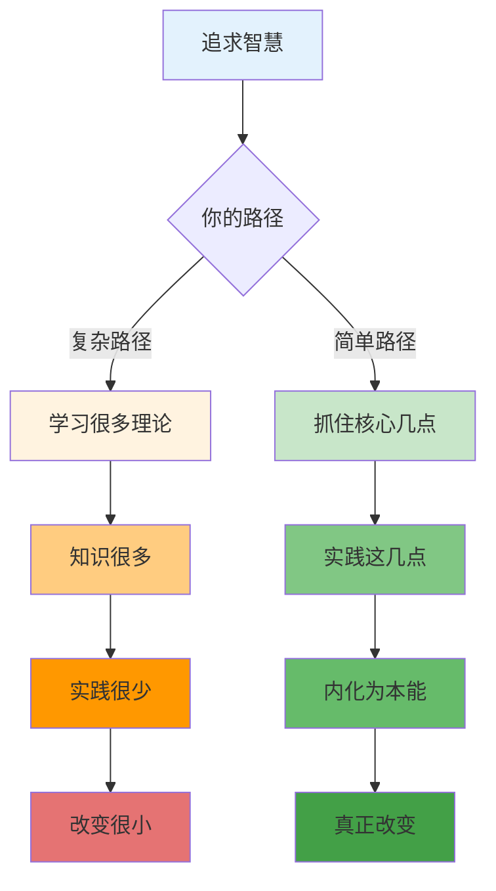
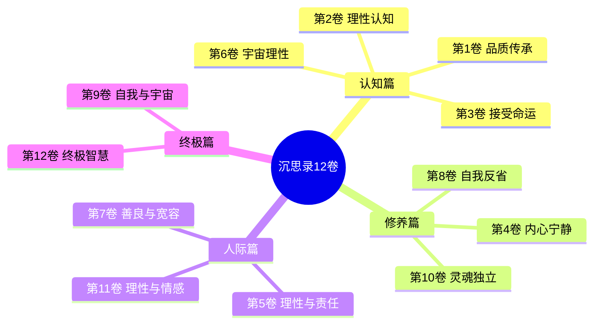
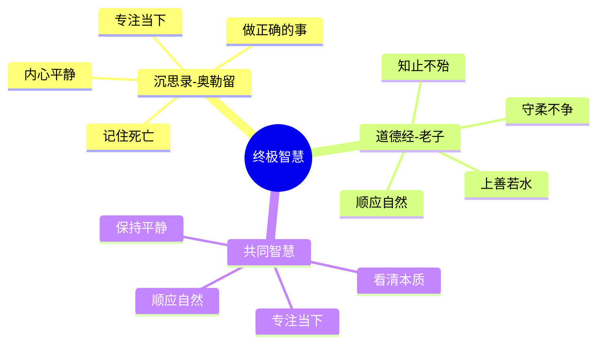

# 《沉思录》第12卷：人生的终极智慧

> **核心主题**：人生的终极智慧——如何在混乱中保持平静
> **章节定位**：全书终章，总结奥勒留核心哲学，从个体修养上升到人生智慧
> **阅读时间**：约40分钟

---

## 一、章节定位

### 1.1 这一卷在解决什么问题？

**核心问题**：如果你只能记住一件事，那会是什么？当生命走到尽头，什么是真正重要的？奥勒留的回答是：记住你能控制什么、不能控制什么；记住你终将死去，所以珍惜当下；记住你的心灵是不可征服的堡垒。终极智慧不是复杂的理论，而是简单的实践。

**一句话定位**：
> 终极智慧 = 记住死亡 + 专注当下 + 保持内心平静 + 做正确的事

---

### 1.2 这一卷在整本书中的位置

```mermaid
flowchart LR
    A[第1卷<br/>品质的传承] --> B[第2卷<br/>理性认知]
    B --> C[第3卷<br/>接受命运]
    C --> D[第4卷<br/>内心宁静]
    D --> E[第5卷<br/>理性与责任]
    E --> F[第6卷<br/>宇宙的理性]
    F --> G[第7卷<br/>善良与宽容]
    G --> H[第8卷<br/>自我反省]
    H --> I[第9卷<br/>自我与宇宙]
    I --> J[第10卷<br/>灵魂的独立]
    J --> K[第11卷<br/>理性与情感]
    K --> L[第12卷<br/>终极智慧]
    
    L --> M[死亡意识<br/>专注当下<br/>内心堡垒<br/>做正确的事]
    
    style A fill:#e8f5e9
    style B fill:#e3f2fd
    style C fill:#fff3e0
    style D fill:#e1f5fe
    style E fill:#fff9c4
    style F fill:#b2ebf2
    style G fill:#f8bbd9
    style H fill:#ce93d8
    style I fill:#7e57c2
    style J fill:#ff7043
    style K fill:#ff5722
    style L fill:#9c27b0
    style M fill:#6a1b9a
```



| 维度 | 定位 |
|------|------|
| **功能** | 全书终章，总结核心哲学，从实践上升到智慧 |
| **内容** | 死亡意识、专注当下、内心堡垒、做正确的事 |
| **风格** | 凝练总结，回归本质，升华全书主题 |
| **目的** | 帮助读者记住最重要的几件事，用简单实践复杂 |

---

### 1.3 与第11卷的关联

| 第11卷 | 第12卷 | 递进关系 |
|------|------|----------|
| 理性驾驭情感 | 终极智慧 | 细节 → 总结 |
| 日常情感管理 | 人生整体智慧 | 微观 → 宏观 |
| 如何处理冲动 | 如何活出意义 | 过程 → 终点 |
| 理性引导 | 死亡意识+专注当下 | 工具 → 目的 |

**递进逻辑**：
```
第11卷：理性驾驭情感，管理日常波动（工具）
    ↓
第12卷：记住死亡，专注当下，活出意义（目的）
    ↓
核心转换：工具 → 目的
```

---

### 1.4 与第1卷的呼应（全书闭环）

| 第1卷 | 第12卷 | 呼应关系 |
|------|------|----------|
| 品质的传承 | 终极智慧 | 起点 → 终点 |
| 从他人学到什么 | 自己领悟什么 | 学习 → 内化 |
| 他人的品质 | 自己的智慧 | 外在 → 内在 |

**全书闭环逻辑**：
```
第1卷：品质的传承（向他人学习）
    ↓
中间10卷：各种实践（理性、接受、反省、独立、情感...）
    ↓
第12卷：终极智慧（内化为自己的）
    ↓
核心转换：学习 → 实践 → 内化 = 完整闭环
```

---

## 二、核心观点（三层提取）

### 观点1：记住你会死，所以珍惜当下

#### 【表层】现象层

**奥勒留的原文**（12.35, 12.36）：
> "You may leave this life at any moment: have this possibility in your mind in all that you do or say or think... Time is a kind of river, a rushing stream passing by, and the things that come into being are carried along; scarcely has one been seen than it is carried away, and another comes to take its place."
> （你随时可能离开这个世界：在你所做、所说、所想的一切中，都要有这种可能性的意识……时间是一种河流，一条奔腾而过的溪流，产生的事物被带走；一个刚被看见就被带走，另一个来取代它的位置。）

**日常场景**：
- 总是觉得时间还很多
- 把重要的事推到"以后"
- 为琐事烦恼，忘了生命有限
- 在社交媒体上浪费大量时间

**降维翻译**：
> **记住你会死——这不是悲观，而是清醒。死亡意识让你明白什么是重要的，什么是浪费时间。珍惜当下，因为当下是你唯一拥有的。**

---

#### 【中层】机制层

**死亡意识的转化机制**：



**死亡意识的力量**：

| 维度 | 没有死亡意识 | 有死亡意识 |
|------|------------|-----------|
| **时间观** | 觉得时间无限 | 知道时间有限 |
| **优先级** | 琐事和重要的事混在一起 | 清楚什么是重要的 |
| **行动力** | 拖延 | 立即行动 |
| **情绪** | 为小事烦恼 | 放下琐事 |
| **结果** | 浪费生命 | 活出意义 |

---

#### 【底层】规律层

> **死亡意识定律**：记住你会死，你就不会浪费时间在琐事上。死亡意识不是悲观，而是清醒——它帮你看清什么是重要的，什么是可以放下的。真正的智慧是带着死亡意识去活，而不是逃避死亡。

**降维翻译**：
> 记住你会死，
> 你就不会浪费时间。
> 死亡意识不是悲观，
> 而是最清醒的智慧。
> 带着死亡意识去活，
> 每一刻都有意义。

---

### 观点2：专注当下，因为过去已去，未来未来

#### 【表层】现象层

**奥勒留的原文**（12.26, 12.28）：
> "Let every action aim solely at the common good... The present moment is equal for all; what is past or future is not ours. The loss, therefore, is limited to this present moment which is infinitesimally small."
> （让每个行动都只瞄准共同利益……当下对所有人都是平等的；过去或未来不属于我们。因此，损失仅限于当下这一瞬间，它是无限微小的。）

**日常场景**：
- 为过去的错误后悔
- 为未来的不确定担忧
- 错过当下的美好
- 总是活在过去或未来

**降维翻译**：
> **过去已经过去，未来还没到来，你拥有的只有当下。为过去后悔是浪费，为未来担忧是无用，专注当下才是智慧。**

---

#### 【中层】机制层

**时间焦点的机制**：



**时间分配的智慧**：

| 时间 | 你的控制权 | 应对策略 |
|------|-----------|---------|
| **过去** | 零 | 接受，学习，放下 |
| **未来** | 部分 | 准备，不担忧 |
| **当下** | 完全 | 专注，行动，体验 |

---

#### 【底层】规律层

> **当下定律**：你唯一能掌控的是当下这一刻。过去已经过去，无法改变；未来还没到来，无法确定；只有当下是你能行动、能体验、能改变的。真正的智慧是把所有能量都聚焦在当下。

**降维翻译**：
> 过去是灰烬，
> 未来是云烟，
> 只有当下是火。
> 把你的能量，
> 都放在火上，
> 而不是灰烬或云烟。

---

### 观点3：你的心灵是不可征服的堡垒

#### 【表层】现象层

**奥勒留的原文**（12.3, 12.22）：
> "The mind of the universe is social... it has made the inferior things for the sake of the superior, and it has harmonized the superior things with one another... Your mind will take on the character of your most frequent thoughts: souls are dyed by thoughts."
> （宇宙的心灵是社会的……它为了 superior 事物创造了 inferior 事物，并且将 superior 事物彼此和谐……你的心灵将呈现你最频繁思想的特点：灵魂被思想染色。）

**日常场景**：
- 被外界事件轻易影响
- 被他人评价轻易伤害
- 被环境改变自己
- 失去内在的稳定性

**降维翻译**：
> **外在世界可以伤害你的身体，但无法征服你的心灵。你的心灵是一座堡垒，除非你主动打开门，否则没有任何东西能进来伤害你。**

---

#### 【中层】机制层

**内心堡垒的机制**：



**内心堡垒的三个层次**：

| 层次 | 内容 | 练习 |
|------|------|------|
| **第一层** | 理性认知 | 认清事件本质 |
| **第二层** | 情绪调节 | 不被情绪驱动 |
| **第三层** | 价值坚守 | 坚持内在原则 |

---

#### 【底层】规律层

> **内心堡垒定律**：真正的强大不是从不受伤害，而是从伤害中恢复，并保持内在的平静。你的心灵是你最后的堡垒，没有任何外在事件能征服一个坚持内在价值观的人。记住：你的思想是你唯一能完全控制的。

**降维翻译**：
> 外在世界是战场，
> 你的心灵是堡垒。
> 堡垒的门由你控制，
> 除非你主动打开，
> 否则无人能伤害你。
> 保持堡垒的完整，
> 你就永远是自由的。

---

### 观点4：做正确的事，不管结果如何

#### 【表层】现象层

**奥勒留的原文**（12.1, 12.20）：
> "All those things which you pray to attain by a long detour, you can have now—if you don't refuse them to yourself. That is, if you leave behind the past, trust the future to providence, and direct the present to holiness and justice."
> （所有那些你祈祷通过漫长绕道才能得到的东西，你现在就能拥有——如果你不拒绝它们给你自己。也就是说，如果你把过去抛在身后，把未来托付给天意，把当下引向神圣和正义。）

**日常场景**：
- 做事之前先想结果
- 因为怕失败而不行动
- 因为怕别人评价而不敢做
- 总是等待"完美时机"

**降维翻译**：
> **做正确的事，因为这是正确的事，不管结果如何。你控制不了结果，但你能控制你的行动。专注于你能控制的，接受你不能控制的。**

---

#### 【中层】机制层

**行动焦点的机制**：



**行动vs结果的对比**：

| 维度 | 结果导向 | 行动导向 |
|------|---------|---------|
| **焦点** | 结果（不可控） | 行动（可控） |
| **情绪** | 焦虑、担忧 | 平静、坚定 |
| **决策** | 犹豫不决 | 迅速果断 |
| **结果** | 可能不行动 | 至少做了正确的事 |

---

#### 【底层】规律层

> **行动定律**：你控制不了结果，但你能控制你的行动。做正确的事，因为这是正确的事，不管结果如何。这就是斯多葛哲学的核心——专注于你能控制的，接受你不能控制的。真正的智慧不是预测结果，而是在任何情况下都做正确的事。

**降维翻译**：
> 你控制不了结果，
> 但你能控制你的行动。
> 做正确的事，
> 因为这是正确的事，
> 不管结果如何。
> 这就是智慧——
> 专注可控，接受不可控。

---

### 观点5：终极智慧是简单实践，不是复杂理论

#### 【表层】现象层

**奥勒留的原文**（12.36, 12.39）：
> "Short therefore is the life of every man... Let this be ever in your mind, and no time will be long enough... How ridiculous and strange to be surprised at anything which happens in life."
> （因此每个人的生命是短暂的……让这永远在你的心中，没有时间会太长……对生活中发生的任何事感到惊讶是多么荒谬和奇怪。）

**日常场景**：
- 追求复杂的理论和方法
- 寻找"秘诀"和"捷径"
- 忽略简单的道理
- 把简单的问题复杂化

**降维翻译**：
> **终极智慧不是复杂的理论，而是简单的实践：记住死亡、专注当下、保持内心平静、做正确的事。知道很多不如做到一点。**

---

#### 【中层】机制层

**复杂vs简单的机制**：



**简单智慧的核心**：

| 复杂追求 | 简单智慧 |
|---------|---------|
| 读100本书 | 记住1个道理并实践 |
| 学习10种方法 | 用好1种方法 |
| 追求完美 | 做到足够好 |
| 思考很多 | 行动一点 |

---

#### 【底层】规律层

> **简单智慧定律**：真正的智慧不是复杂，而是简单。复杂的东西是给头脑的，简单的东西是给生活的。终极智慧可以总结为：记住死亡、专注当下、保持内心平静、做正确的事。知道很多不如做到一点。

**降维翻译**：
> 智慧不是复杂，
> 而是简单到可以实践。
> 知道100个道理，
> 不如做到1个道理。
> 复杂是给别人看的，
> 简单是给自己活的。

---

## 三、金句库

### 原文金句

1. "You may leave this life at any moment: have this possibility in your mind in all that you do or say or think."（12.35）
2. "Time is a kind of river, a rushing stream passing by, and the things that come into being are carried along."（12.28）
3. "The present moment is equal for all; what is past or future is not ours."（12.26）
4. "Your mind will take on the character of your most frequent thoughts: souls are dyed by thoughts."（12.3）
5. "Short therefore is the life of every man... Let this be ever in your mind, and no time will be long enough."（12.36）
6. "How ridiculous and strange to be surprised at anything which happens in life."（12.13）
7. "Leave behind the past, trust the future to providence, and direct the present to holiness and justice."（12.1）
8. "All those things which you pray to attain by a long detour, you can have now—if you don't refuse them to yourself."（12.1）

---

### 降维金句（人话版）

1. **记住你会死，你就不会浪费时间在琐事上。死亡意识不是悲观，而是最清醒的智慧。**
2. **过去已经过去，未来还没到来，你拥有的只有当下。把能量放在火上，而不是灰烬或云烟。**
3. **外在世界是战场，你的心灵是堡垒。堡垒的门由你控制，无人能伤害你。**
4. **做正确的事，因为这是正确的事，不管结果如何。专注可控，接受不可控。**
5. **终极智慧不是复杂理论，而是简单实践：记住死亡、专注当下、保持内心平静、做正确的事。**
6. **知道100个道理，不如做到1个道理。复杂是给别人看的，简单是给自己活的。**
7. **生命短暂，让这个意识永远在你心中，任何时间都不够浪费在琐事上。**
8. **对生活中发生的任何事感到惊讶是荒谬的——一切都在变化，接受是智慧的开始。**

---

## 四、全书总结（第12卷的特殊意义）

### 4.1 全书思想谱系



### 4.2 第12卷的四大核心

| 核心 | 内容 | 对应章节 |
|------|------|---------|
| **死亡意识** | 记住你会死，珍惜当下 | 12.35, 12.36 |
| **专注当下** | 过去已去，未来未来 | 12.26, 12.28 |
| **内心堡垒** | 你的心灵不可征服 | 12.3, 12.22 |
| **正确行动** | 做正确的事，不管结果 | 12.1, 12.20 |

### 4.3 全书闭环

```
第1卷：品质的传承（向他人学习）
    ↓
第2-11卷：各种实践（理性、接受、反省、独立、情感...）
    ↓
第12卷：终极智慧（内化为自己的）
    ↓
核心公式：学习 + 实践 + 内化 = 完整闭环
```

---

## 五、当下映射

### 2026年读者的困惑

|------|--------------|----------|
| 总是拖延怎么办？ | 记住你会死，时间有限 | "警醒了" |
| 为过去后悔、为未来担忧？ | 专注当下，过去已去，未来未来 | "释然了" |
| 总是被外界影响？ | 你的心灵是堡垒，门由你控制 | "有力量了" |
| 如何判断什么是对的？ | 做正确的事，不管结果如何 | "清晰了" |
| 人生的意义是什么？ | 记住死亡、专注当下、做正确的事 | "明白了" |

---

### 现代应用场景

**场景1：职业选择**
- 困惑：不知道选什么职业
- 根源：担心未来，害怕失败
- 应用：做正确的事，专注当下能做的

**场景2：人际关系**
- 困惑：总是被他人评价影响
- 根源：内在堡垒不牢固
- 应用：你的心灵是堡垒，门由你控制

**场景3：时间管理**
- 困惑：总是浪费时间在琐事上
- 根源：没有死亡意识
- 应用：记住你会死，时间有限

**场景4：焦虑和担忧**
- 困惑：总是为未来担忧
- 根源：活在未来，而非当下
- 应用：专注当下，未来还没到来

---

## 六、章节关联

### 与《沉思录》其他章节的关联

| 章节 | 关联类型 | 共同逻辑 |
|------|----------|----------|
| **第1卷** | 全书闭环 | 学习 → 内化 |
| **第2卷** | 认知基础 | 控制二分法 → 专注可控 |
| **第6卷** | 宇宙视角 | 宇宙理性 → 接受变化 |
| **第11卷** | 递进总结 | 情感管理 → 终极智慧 |

**核心思想递进**：
```
第1卷：品质的传承，向他人学习（起点）
    ↓
第2-6卷：认知建立（理性、接受、宇宙）
    ↓
第7-11卷：实践深入（人际、反省、独立、情感）
    ↓
第12卷：终极智慧，内化为自己的（终点）
    ↓
核心转换：学习 → 认知 → 实践 → 内化 = 完整闭环
```

---

### 与其他书籍的关联

| 书籍 | 关联类型 | 共同底层逻辑 |
|------|----------|--------------|

**东西方智慧共鸣**：
```
《沉思录》：死亡意识 → 专注当下 → 内心平静
《道德经》：知止不殆 → 守柔不争 → 上善若水
《庄子》：齐生死 → 逍遥游 → 心斋坐忘
共同逻辑：认清本质 → 专注当下 → 保持平静
```

---

### 与《道德经》的深度对比

| 维度 | 《沉思录》奥勒留 | 《道德经》老子 | 共鸣点 |
|------|------------------|----------------|--------|
| **死亡观** | 记住死亡，珍惜当下 | 死生一如，顺其自然 | 看清生死 |
| **时间观** | 专注当下 | 活在当下 | 当下力量 |
| **内在观** | 内心堡垒 | 致虚守静 | 内在平静 |
| **行动观** | 做正确的事 | 为无为，无为而无不为 | 顺应自然 |

**跨时空的共鸣**：
> 奥勒留在罗马，老子在中国，相隔千年，却看到了同一个真理——
> 记住死亡，你就能珍惜当下；
> 专注当下，你就能找到平静；
> 保持内在平静，你就能做正确的事。
> 这就是东西方智慧的终极共鸣。

---

## 七、问答设计

### Q1：为什么要记住死亡？

**A**: 记住死亡不是为了悲观，而是为了清醒：

| 没有 | 有 |
|------|------|
| 觉得时间无限 | 知道时间有限 |
| 为琐事烦恼 | 聚焦重要的事 |
| 拖延 | 立即行动 |
| 浪费生命 | 活出意义 |

**关键理解**：
- 死亡意识让你看清什么是重要的
- 死亡意识让你不再浪费时间在琐事上
- 死亡意识让你珍惜当下

**记住**：记住你会死，你就不会浪费时间。死亡意识是最清醒的智慧。

---

### Q2：如何专注当下？

**A**: 三个步骤：

**步骤1：意识到**
- 当你为过去后悔时，意识到：过去已经过去
- 当你为未来担忧时，意识到：未来还没到来

**步骤2：回到当下**
- 问自己：现在我能做什么？
- 把注意力从过去/未来拉回当下

**步骤3：行动**
- 在当下采取行动
- 体验当下的一切

**练习方法**：
- 每天3次"当下检查"：我在想过去？未来？还是当下？
- 每次做一件事时，全神贯注在这件事上

**记住**：过去是灰烬，未来是云烟，只有当下是火。把你的能量都放在火上。

---

### Q3：如何建立内心堡垒？

**A**: 三个层次：

**第一层：理性认知**
- 认清事件本质：这是什么？
- 区分可控与不可控

**第二层：情绪调节**
- 接纳情绪的存在
- 不被情绪驱动

**第三层：价值坚守**
- 坚持内在价值观
- 在任何情况下都做正确的事

**练习方法**：
- 每天问自己：今天有什么事影响了我的内在平静？
- 分析：我为什么让它影响我？下次如何更好？

**记住**：外在世界是战场，你的心灵是堡垒。堡垒的门由你控制。

---

### Q4：如何知道什么是"正确的事"？

**A**: 三个判断标准：

**标准1：符合价值观**
- 这件事是否符合我想成为的人？
- 这件事是否符合我的原则？

**标准2：长期利益**
- 这件事在长期看是有益的吗？
- 这件事是我想做的，还是我该做的？

**标准3：社会责任**
- 这件事对他人/社会有帮助吗？
- 这件事是自私的，还是利他的？

**记住**：做正确的事，因为这是正确的事，不管结果如何。

---

### Q5：《沉思录》读完，我应该记住什么？

**A**: 四个核心：

| 核心 | 记住 | 实践 |
|------|------|------|
| **死亡意识** | 你随时可能离开 | 珍惜当下 |
| **专注当下** | 只有当下是你的 | 把能量放在当下 |
| **内心堡垒** | 你的心灵不可征服 | 保持内在平静 |
| **正确行动** | 你控制不了结果 | 做正确的事 |

**终极公式**：
```
智慧人生 = 记住死亡 + 专注当下 + 保持内心平静 + 做正确的事
```

**记住**：知道100个道理，不如做到这4个。

---

## 八、实践练习

### 练习1：死亡意识日记

每天一次，花5分钟：

| 如果今天是我最后一天 | 我会做什么 | 我不会做什么 |
|---------------------|-----------|-------------|
|  |  |  |

---

### 练习2：当下检查

每天3次，问自己：

| 时间 | 我在想什么？ | 过去/未来/当下？ | 如何回到当下？ |
|------|------------|-----------------|--------------|
| 上午 |  |  |  |
| 下午 |  |  |  |
| 晚上 |  |  |  |

---

### 练习3：内心堡垒强化

每周一次，花10分钟：

**本周有什么事影响了我的内在平静？**

| 事件 | 为什么影响我 | 我如何更好地回应 |
|------|------------|----------------|
|  |  |  |

---

### 练习4：正确行动清单

每周一次，花10分钟：

**这周我要做的正确的事**：
1. 
2. 
3. 

**判断标准**：
- 符合价值观吗？是/否
- 长期利益吗？是/否
- 社会责任吗？是/否

---

## 九、章节总结

### 核心公式

```
终极智慧 = 记住死亡 + 专注当下 + 内心堡垒 + 正确行动
```

### 一句话总结

> 记住你会死，你就不会浪费时间；专注当下，你就能创造未来；保持内心平静，你就不可征服；做正确的事，不管结果如何——这就是人生的终极智慧。

### 第12卷的核心贡献

1. **死亡意识**：记住你会死，珍惜当下，不再浪费时间
2. **专注当下**：过去已去，未来未来，只有当下是你的
3. **内心堡垒**：你的心灵是堡垒，门由你控制
4. **正确行动**：做正确的事，因为这是正确的事，不管结果如何

这四个核心，构成了《沉思录》的终极智慧。

---

### 全书终极总结

```
《沉思录》12卷，最终只说了4件事：
1. 记住死亡
2. 专注当下
3. 保持内心平静
4. 做正确的事

知道100个道理，
不如做到这4个。

这就是奥勒留1800年前留给我们的终极智慧。
```

---

### 东西方智慧的终极共鸣



**跨时空的终极共鸣**：
> 奥勒留在罗马，老子在中国，相隔千年，却看到了同一个真理——
> 看清本质（死亡/道），你就能专注当下；
> 专注当下，你就能找到平静；
> 保持平静，你就能做正确的事。
> 这就是东西方智慧的终极共鸣，也是《沉思录》留给我们的最后礼物。

---
