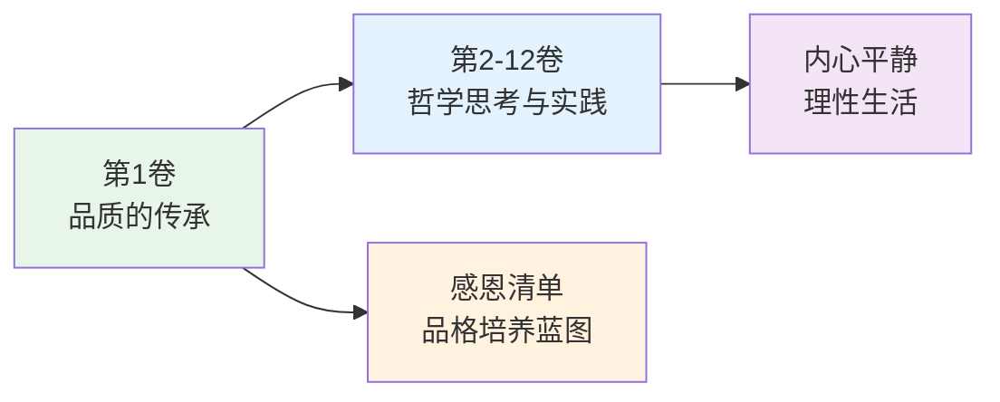
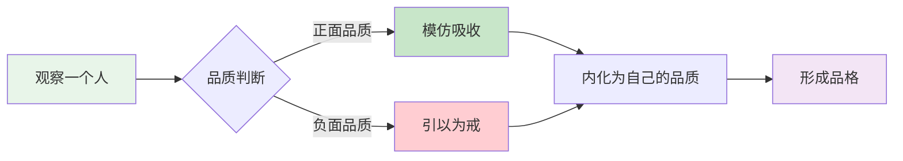
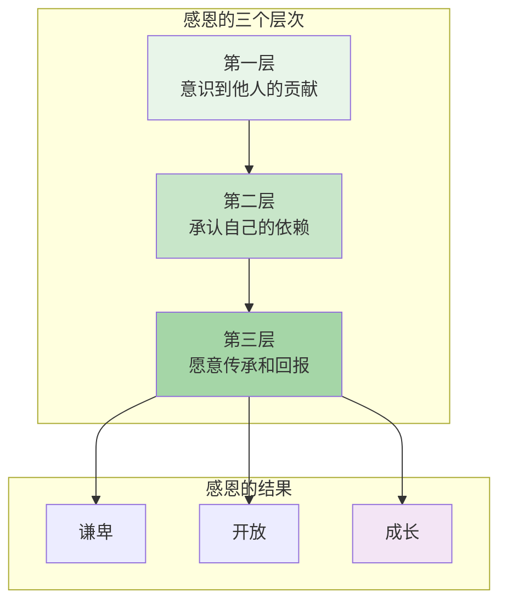
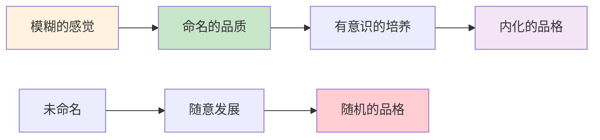
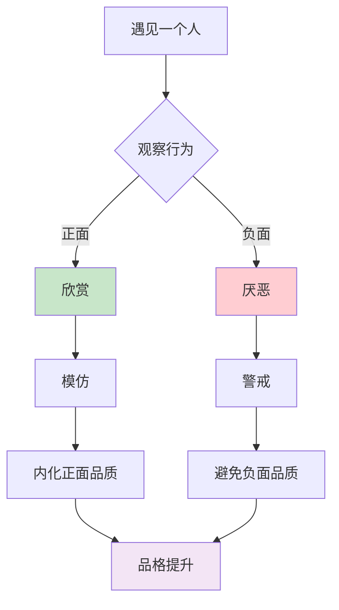

# 《沉思录》第1卷：品质的传承

> **核心主题**：感恩与品质传承——从家人和老师身上学到的品质
> **章节定位**：开篇之作，品格培养的蓝图，感恩的清单
> **阅读时间**：约15分钟

---

## 一、章节定位

### 1.1 这一卷在解决什么问题？

**核心问题**：一个人的品格是如何形成的？我们如何从身边的人身上学习和成长？

**一句话定位**：
> 你不是从零开始塑造自己，而是站在巨人的肩膀上——你从每个人身上都能学到品质，也能学到教训。

---

### 1.2 这一卷在整本书中的位置



| 维度 | 定位 |
|------|------|
| **功能** | 开篇立意，建立感恩心态 |
| **内容** | 17位榜样，每人一个品质 |
| **风格** | 简洁、具体、实用 |
| **目的** | 承认自己的成长来源于他人 |

---

### 1.3 与主书的关联

- **主书主题**：如何在外在混乱中保持内心平静
- **第1卷贡献**：展示品格是如何通过"传承"和"感恩"形成的
- **底层逻辑**：你的品质不是凭空而来，而是从他人身上学习和提炼

---

## 二、核心观点（三层提取）

### 观点1：从每个人身上都能学到东西

#### 【表层】现象层

**奥勒留的原文**（1.1-1.17）：
> 他逐一列举从17个人身上学到的品质——从祖父、父亲、母亲，到老师、朋友、养父。

**日常场景**：
- 有些人让你愤怒，但你从他身上学到了"不要成为那样的人"
- 有些人让你敬佩，你从他身上学到了"我想成为那样的人"
- 每个人都是你的老师，正面或反面

**降维翻译**：
> **每个人都是你的老师——正面教你怎么做，反面教你怎么不做。**

---

#### 【中层】机制层

**品质传承的心理机制**：



**品质传承的三种模式**：

| 模式 | 描述 | 示例 |
|------|------|------|
| **正面模仿** | 学习别人的优点 | 从老师学逻辑，从母亲学虔诚 |
| **反面教训** | 从别人的错误中学习 | 从顽固的人学不要固执 |
| **综合提炼** | 结合多人优点 | 形成自己独特的品格 |

---

#### 【底层】规律层

> **品质传承定律**：你不是从零开始塑造自己。你的品格是所有你遇见过的人的总和——正面吸收，反面警戒。

**降维翻译**：
> 你身上的每个好品质，
> 都是从某个人身上学来的。
> 感恩他们，并继续传承下去。

---

### 观点2：感恩是品格培养的起点

#### 【表层】现象层

**奥勒留的原文**（1.1）：
> "我从我的祖父维鲁斯那里学到了良好的品格和自我克制。"

**日常场景**：
- 回想你的父母，他们教会了你什么？
- 回想你的老师，哪个影响了你的一生？
- 回想你的朋友，谁让你变得更好？

**降维翻译**：
> **感恩不是礼貌，而是一种认知——承认你的成长来源于他人。**

---

#### 【中层】机制层

**感恩的心理机制**：



**感恩的双重作用**：

| 维度 | 作用 | 结果 |
|------|------|------|
| **对内** | 认识自己的成长来源于他人 | 谦卑 |
| **对外** | 承认他人的价值 | 开放 |

---

#### 【底层】规律层

> **感恩起点定律**：品格培养从感恩开始。如果你不承认自己的成长来源于他人，你就会陷入傲慢，停止成长。

**降维翻译**：
> 感恩是成长的起点，
> 傲慢是成长的终点。
> 承认你从他人身上学到了东西，
> 你才能继续学到更多。

---

### 观点3：品质是可以被命名的

#### 【表层】现象层

**奥勒留的原文**（1.5-1.7）：
> "我从老师那里学到了……不要迷恋赛马、角斗、养鸟……"

**日常场景**：
- 你能说清楚你从父母身上学到了哪三个品质吗？
- 你能说清楚你最敬佩的人有什么品质吗？
- 你能命名你自己最珍视的三个品质吗？

**降维翻译**：
> **如果你不能命名一个品质，你就无法培养它。**

---

#### 【中层】机制层

**命名品质的力量**：



**奥勒留命名的17个品质**（部分）：

| 榜样 | 学到的品质 | 命名 |
|------|-----------|------|
| 祖父维鲁斯 | 良好品格、自我克制 | 克制 |
| 父亲 | 谦逊、果敢 | 谦逊 |
| 母亲 | 虔诚、仁爱、简朴 | 虔诚 |
| 老师 | 不要迷恋琐事 | 专注 |
| 养父安东尼 | 温和、不固执 | 温和 |

---

#### 【底层】规律层

> **命名定律**：命名是培养的第一步。如果你不能清晰地命名一个品质，你就无法有意识地培养它。

**降维翻译**：
> 给品质一个名字，
> 它就从模糊变得具体。
> 从具体变成可培养，
> 从培养变成你的品格。

---

### 观点4：同时学习"要做什么"和"不要做什么"

#### 【表层】现象层

**奥勒留的原文**（1.17）：
> 他不仅从好榜样学习，也从坏榜样学习——学习不要成为那样的人。

**日常场景**：
- 从一个愤怒的人身上，学到不要轻易发怒
- 从一个贪婪的人身上，学到不要被欲望控制
- 从一个虚伪的人身上，学到要真诚待人

**降维翻译**：
> **每个人都是你的老师——正面教你怎么做，反面教你怎么不做。**

---

#### 【中层】机制层

**正反学习的机制**：



**正反学习对比**：

| 学习类型 | 触发情绪 | 学习方式 | 结果 |
|----------|----------|----------|------|
| **正面学习** | 欣赏、敬佩 | 模仿 | 获得品质 |
| **反面学习** | 厌恶、警惕 | 避免 | 避免缺陷 |

---

#### 【底层】规律层

> **双向学习定律**：智慧的人从每个人身上学习——正面学"怎么做"，反面学"怎么做"。傻瓜只从一种人身上学习，甚至不学习。

**降维翻译**：
> 聪明人从每个人身上学到东西，
> 愚蠢的人从谁身上都学不到。
> 正面学怎么做，
> 反面学怎么做。

---

## 三、金句库

### 原文金句

1. "我从我的祖父维鲁斯那里学到了良好的品格和自我克制。"（1.1）
2. "我从父亲那里学到了谦逊和果敢。"（1.2）
3. "我从母亲那里学到了虔诚和仁爱，以及不追求奢侈的生活。"（1.3）
4. "我从老师那里学到了……不要迷恋赛马、角斗、养鸟……"（1.5-1.7）
5. "我从养父安东尼那里学到了温和。"（1.16）
6. "我对所有这些都心存感激。"（1.17）

---

### 降维金句（人话版）

1. **你不是从零开始塑造自己，而是站在巨人的肩膀上。**
2. **每个人都是你的老师——正面教你怎么做，反面教你怎么不做。**
3. **感恩不是礼貌，而是一种认知——承认你的成长来源于他人。**
4. **如果你不能命名一个品质，你就无法培养它。**
5. **你的品格是所有你遇见过的人的总和。**
6. **正面学怎么做，反面学怎么做——两者都是老师。**
7. **感恩是成长的起点，傲慢是成长的终点。**
8. **给品质一个名字，它就从模糊变得具体。**

---

## 四、当下映射

### 2026年读者的困惑

|------|------------|----------|
| 我该如何培养品格？ | 从你遇到的人身上学习，正面或反面 | "原来如此简单" |
| 我该如何感恩？ | 命名你从每个人身上学到的品质 | "我可以试试" |
| 我该如何成长？ | 承认你的成长来源于他人，继续学习 | "原来我一直被帮助" |
| 我该如何看待讨厌的人？ | 他们是你的反面老师 | "释然了" |

---

### 现代应用场景

**场景1：写一份感恩清单**
- 像奥勒留一样，列出你从家人、老师、朋友身上学到的品质
- 命名这些品质，让它们变得具体
- 感恩他们的贡献

**场景2：从讨厌的人身上学习**
- 不是学习他们的行为，而是学习不要成为那样的人
- 每个人都是你的老师，包括反面老师

**场景3：培养命名品质的习惯**
- 每学到一个好品质，给它一个名字
- 命名让它从模糊变成具体，从具体变成可培养

---

## 五、章节关联

### 与《沉思录》其他章节的关联

| 章节 | 关联类型 | 共同逻辑 |
|------|----------|----------|
| **第1卷** | 品格传承 | 从他人身上学习 |
| **第2卷** | 理性认知 | 认识你自己和世界 |
| **第3卷** | 当下专注 | 活在当下 |
| **第4卷** | 内心平静 | 外在世界不可控 |
| **第5卷** | 理性生活 | 按照理性行动 |

**章节递进逻辑**：
```
第1卷：品格传承 → 从他人身上学习
    ↓
第2-3卷：理性认知 → 认识你自己和世界
    ↓
第4-6卷：内心平静 → 控制可控，接受不可控
    ↓
第7-12卷：理性生活 → 在实践中践行
```

---

### 与其他书籍的关联

| 书籍 | 关联类型 | 共同逻辑 |
|------|----------|----------|

---

## 六、问答设计

### Q1：为什么要用整整一卷来感恩？

**A**: 因为品格培养从感恩开始。如果你不承认自己的成长来源于他人，你就会陷入傲慢，停止成长。奥勒留开篇这样做，是在提醒自己：你不是凭空成为现在的样子，你是站在很多人的肩膀上。

---

### Q2：奥勒留列出的17个人，每个人都教了他什么？

**A**: 主要品质包括：

| 榜样 | 品质 |
|------|------|
| 祖父维鲁斯 | 良好品格、自我克制 |
| 父亲 | 谦逊、果敢 |
| 母亲 | 虔诚、仁爱、简朴 |
| 曾祖父 | 节俭 |
| 老师 | 专注、不迷恋琐事 |
| 养父安东尼 | 温和、不固执、公正 |

---

### Q3：如果我的父母没有教我好品质怎么办？

**A**: 你可以从反面学习。奥勒留的方法是：正面学"怎么做"，反面学"怎么做"。如果你的父母有缺点，你就学到不要成为那样的人。每个人都是你的老师，包括反面老师。

---

### Q4：我如何实践第1卷的教导？

**A**: 三个步骤：
1. **写一份感恩清单**：列出你从家人、老师、朋友身上学到的品质
2. **命名这些品质**：让它们从模糊变得具体
3. **继续传承**：把这些品质传给下一个人

---

### Q5：第1卷和整本书的关系是什么？

**A**: 第1卷是整本书的根基。它告诉你：你的品格不是凭空而来的，而是从他人身上传承的。这个认知让你保持谦卑，让你愿意继续学习。后续章节讲的理性认知、内心平静、控制二分法，都是建立在这个品格根基之上的。

---

## 七、实践练习

### 练习1：写你的感恩清单

按照奥勒留的格式，写出你从以下人身上学到的品质：

| 人物 | 学到的品质 |
|------|-----------|
| 祖父母 | |
| 父母 | |
| 老师 | |
| 朋友 | |
| 讨厌的人 | （反面学习） |

---

### 练习2：命名你最珍视的三个品质

1. 品质名称：______
   - 从谁身上学到的：______
   - 如何在日常生活中体现：______

2. 品质名称：______
   - 从谁身上学到的：______
   - 如何在日常生活中体现：______

3. 品质名称：______
   - 从谁身上学到的：______
   - 如何在日常生活中体现：______

---

### 练习3：从反面学习

想一个你不喜欢的人，回答以下问题：
- 他有什么让你不喜欢的行为？
- 这教你要避免什么品质？
- 你如何在日常生活中避免这种品质？

---

## 八、章节总结

### 核心公式

```
品格传承 = 感恩心态 + 命名品质 + 正反学习 + 持续传承
```

### 一句话总结

> 你不是从零开始塑造自己，而是站在巨人的肩膀上——从每个人身上学习品质，正面或反面，然后继续传承下去。

---
