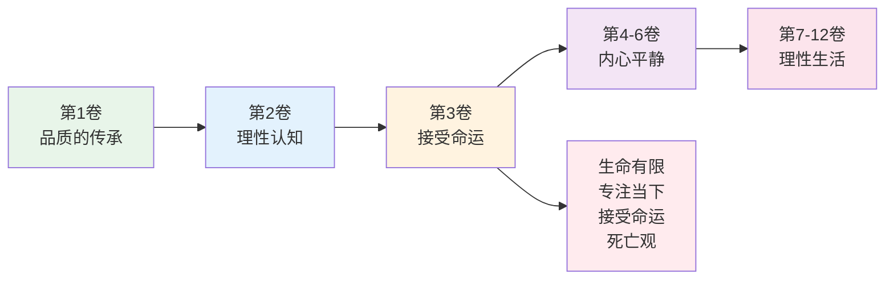
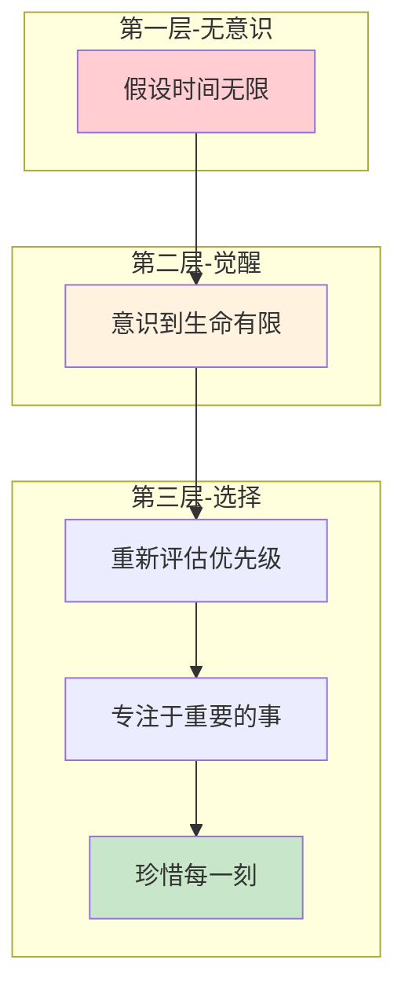
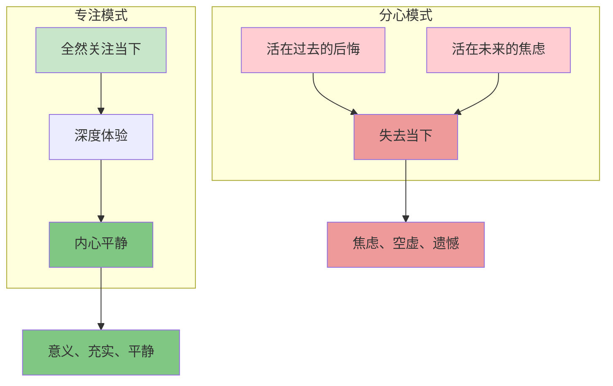
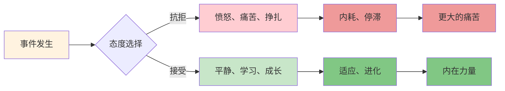
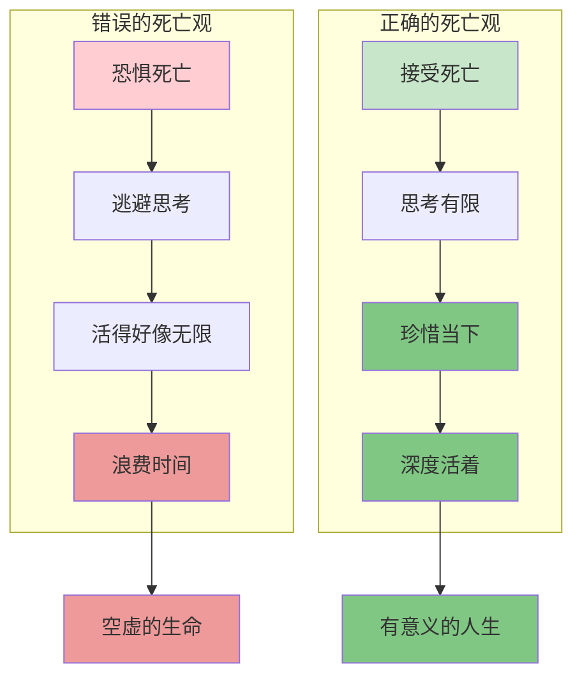

# 《沉思录》第3卷：接受命运

> **核心主题**：专注当下与接受命运——如何在变幻莫测的世界中保持平静
> **章节定位**：从理性认知转向生命哲学，建立面对无常的内在力量
> **阅读时间**：约25分钟

---

## 一、章节定位

### 1.1 这一卷在解决什么问题？

**核心问题**：生命如此短暂，世界如此无常，我们如何在有限的时间里找到意义，在变幻莫测中保持平静？

**一句话定位**：
> 你无法延长生命的长度，但你可以决定生命的深度——专注于当下，接受你无法改变的，珍惜你所拥有的。

---

### 1.2 这一卷在整本书中的位置



| 维度 | 定位 |
|------|------|
| **功能** | 从理性框架转向生命哲学，建立面对无常的内在力量 |
| **内容** | 生命有限、专注当下、接受命运、死亡观四大核心 |
| **风格** | 更加深刻和凝重，从"如何思考"转向"如何活着" |
| **目的** | 建立对生命本质的深刻理解，培养面对无常的勇气 |

---

### 1.3 与第2卷的关联

| 第2卷 | 第3卷 | 递进关系 |
|------|------|----------|
| 控制你控制的 | 接受你无法控制的 | 主动 → 被动接受 |
| 专注当下行动 | 意识到生命有限 | 方法 → 动力 |
| 理性认知框架 | 生命哲学深化 | 工具 → 智慧 |
| 面对外在混乱 | 面对生命无常 | 外 → 内 |

**递进逻辑**：
```
第2卷：控制二分法 → 专注可控
    ↓
第3卷：意识到生命有限 → 珍惜当下
    ↓
第4卷：接受命运 → 内心平静
```

---

## 二、核心观点（三层提取）

### 观点1：生命有限，时间是珍贵的礼物

#### 【表层】现象层

**奥勒留的原文**（3.1-3.7）：
> "Do not act as if you were going to live ten thousand years... while you live, while it is in your power, be good."
> （不要活得好像你还能活一万年……趁你还活着，趁你还有力量，做一个好人。）

**日常场景**：
- 刷手机时，时间悄悄流逝
- 为琐事争吵时，生命在浪费
- 活在过去或未来，错过了当下
- 拖延重要的事，等到"以后"

**降维翻译**：
> **你的时间是有限的，每一分钟都在减少——你用时间做什么，决定你的生命质量。**

---

#### 【中层】机制层

**时间意识的觉醒机制**：



**有限时间vs无限假设的对比**：

| 态度 | 假设时间无限 | 意识到时间有限 |
|------|-------------|---------------|
| **选择** | 拖延、浪费 | 珍惜、专注 |
| **关系** | 忽视、伤害 | 重视、珍惜 |
| **目标** | 明天再说 | 今天就做 |
| **体验** | 匆忙、焦虑 | 深度、意义 |

---

#### 【底层】规律层

> **时间有限定律**：生命不是无限的资源。当你意识到时间的珍贵，你才会开始真正地活着。不是活得久，而是活得深，这才是生命的质量。

**降维翻译**：
> 你不拥有无限的时间，
> 每一分钟都是借来的礼物。
> 问题不是你会活多久，
> 而是你现在这一刻活得如何。

---

### 观点2：专注于当下的力量

#### 【表层】现象层

**奥勒留的原文**（3.10-3.12）：
> "Confine yourself to the present."
> （把自己限制在当下。）

**日常场景**：
- 吃饭时想工作，工作时想晚餐
- 睡前回想今天的失误，无法入眠
- 和家人在一起时，脑子在想明天的事
- 走路时看手机，错过身边的美景

**降维翻译**：
> **过去已经过去，未来还没到来——你真正拥有的，只有当下这一刻。**

---

#### 【中层】机制层

**专注当下的心理机制**：



**活在当下vs活在别处的对比**：

| 维度 | 活在别处（过去/未来） | 活在当下 |
|------|---------------------|----------|
| **注意力** | 分散 | 聚焦 |
| **情绪** | 后悔/焦虑 | 平静/专注 |
| **行动** | 瘫痪 | 有力 |
| **体验** | 匆忙、空虚 | 深度、充实 |
| **生命** | 浪费 | 珍惜 |

---

#### 【底层】规律层

> **当下定律**：过去和未来都不存在——过去是记忆，未来是想象，唯有当下是真实的。把注意力从过去和未来收回，专注于当下，你才能开始真正地活着。

**降维翻译**：
> 过去是幽灵，
> 未来是幻影，
> 只有当下是真实的。
> 抓住它，
> 它就是你的人生。

---

### 观点3：接受命运，顺应自然

#### 【表层】现象层

**奥勒留的原文**（3.2-3.4）：
> "Accept whatever comes to you woven in the pattern of your destiny, for what could more aptly fit your needs?"
> （接受命运织入你生命图案的一切，因为什么能更适合你的需要？）

**日常场景**：
- 求而不得时的痛苦
- 计划被意外打乱时的愤怒
- 失去后的悲伤和不甘
- 不愿意接受现实的挣扎

**降维翻译**：
> **命运给你的，就是最适合你的——不是你想要的，而是你需要的。**

---

#### 【中层】机制层

**接受命运的心理转化**：



**接受vs抗拒的对比**：

| 维度 | 抗拒 | 接受 |
|------|------|------|
| **能量** | 消耗在内耗 | 用于适应和成长 |
| **情绪** | 愤怒、痛苦 | 平静、学习 |
| **结果** | 停滞、更大的痛苦 | 成长、内在力量 |
| **时间** | 浪费在"为什么是我" | 用于"我能做什么" |

---

#### 【底层】规律层

> **接受命运定律**：抗拒已发生的事是徒劳的，接受它才能获得自由。命运给你的不是你想要的，而是你需要的——每一次挫折都是成长的机会。

**降维翻译**：
> 你可以和雨对抗，
> 也可以学会打伞。
> 你可以和命运对抗，
> 也可以学会接受。
> 抗拒带来痛苦，
> 接受带来自由。

---

### 观点4：正确的死亡观

#### 【表层】现象层

**奥勒留的原文**（3.3-3.8）：
> "Do not despise death, but be well content with it, since this too is one of those things which nature wills."
> （不要鄙视死亡，而要满足于它，因为这也是自然意志的一部分。）

**日常场景**：
- 对死亡的恐惧和逃避
- 不敢谈论死亡
- 活得好像永远不会死
- 对逝去的人过度悲伤

**降维翻译**：
> **死亡是自然的一部分，不是敌人——接受它，你才能真正活着。**

---

#### 【中层】机制层

**死亡观的转化机制**：



**死亡观的两种态度**：

| 维度 | 恐惧死亡 | 接受死亡 |
|------|----------|----------|
| **态度** | 逃避、恐惧 | 接受、理解 |
| **影响** | 活得虚假 | 活得真实 |
| **选择** | 拖延重要的事 | 立即做重要的事 |
| **关系** | 忽视、伤害 | 珍惜、和解 |
| **生命质量** | 浅薄、焦虑 | 深度、平静 |

---

#### 【底层】规律层

> **死亡观定律**：死亡不是生命的敌人，而是生命的一部分。当你接受死亡，你才能开始真正地活着。不是因为怕死而活着，而是因为接受死而活得深。

**降维翻译**：
> 死亡是生命的镜子，
> 照出什么最重要。
> 接受你会死，
> 你才知道如何活。

---

## 三、金句库

### 原文金句

1. "Do not act as if you were going to live ten thousand years."（3.7）
2. "Confine yourself to the present."（3.10）
3. "Accept whatever comes to you woven in the pattern of your destiny."（3.2）
4. "Do not despise death, but be well content with it."（3.3）
5. "While you live, while it is in your power, be good."（3.7）
6. "Everything is ephemeral—both the rememberer and the remembered."（3.10）
7. "How ridiculous and how strange to be surprised at anything which happens in life."（3.8）

---

### 降维金句（人话版）

1. **不要活得好像你还能活一万年——你的时间是有限的。**
2. **把自己限制在当下——过去已去，未来未来，唯有当下是真实的。**
3. **命运给你的，就是最适合你的——不是你想要的，而是你需要的。**
4. **死亡是自然的一部分，不是敌人——接受它，你才能真正活着。**
5. **趁你还活着，趁你还有力量，做一个好人。**
6. **一切都是短暂的——记住的人和被记住的人，都会消失。**
7. **对生活中的任何事感到惊讶，是多么可笑和奇怪。**
8. **你不拥有无限的时间，每一分钟都是借来的礼物。**

---

## 四、当下映射

### 2026年读者的困惑

|------|------------|----------|
| 为什么我总是感到时间不够用？ | 你假设时间无限，所以浪费 | "原来如此" |
| 如何面对命运的不公？ | 命运给你的是你需要的，不是你想要的 | "有方法了" |
| 如何克服对死亡的恐惧？ | 接受死亡，你才能真正活着 | "释然了" |
| 如何活得更充实？ | 专注于当下，珍惜每一刻 | "方向明确了" |
| 如何面对失去？ | 抗拒已发生的事是徒劳的，接受它才能获得自由 | "放下了" |

---

### 现代应用场景

**场景1：时间管理焦虑**
- 困惑：总觉得时间不够用，却不知道时间去哪了
- 根源：假设时间无限，所以随意浪费
- 应用：意识到生命有限，重新评估优先级，专注于重要的事

**场景2：命运的不公**
- 困惑：为什么别人那么幸运，我却总是倒霉
- 根源：想要的是你认为好的，命运给的是你真正需要的
- 应用：停止抗拒，接受现实，从中学习和成长

**场景3：失去和变化**
- 困惑：失去工作、关系、健康时，无法接受
- 根源：把变化当成敌人，而不是自然的一部分
- 应用：接受失去是生命的一部分，从中找到新的方向

**场景4：拖延和犹豫**
- 困惑：总是拖延重要的事，等到"以后"
- 根源：假设以后还有很多时间
- 应用：意识到生命有限，今天就做重要的事

---

## 五、章节关联

### 与《沉思录》其他章节的关联

| 章节 | 关联类型 | 共同逻辑 |
|------|----------|----------|
| **第2卷** | 承接 | 理性认知 → 生命哲学 |
| **第3卷** | 核心 | 专注当下、接受命运、死亡观 |
| **第4卷** | 延伸 | 内心平静的深化 |
| **第6卷** | 呼应 | 宇宙理性与个人命运 |
| **第8卷** | 应用 | 理性生活的实践 |

**核心思想递进**：
```
第2卷：控制二分法（认知工具）
    ↓
第3卷：接受命运（生命态度）
    ↓
第4卷：内心平静（内在状态）
```

---

### 与其他书籍的关联

| 书籍 | 关联类型 | 共同底层逻辑 |
|------|----------|--------------|

**东西方智慧共鸣**：
```
《沉思录》：接受命运 → 专注当下 → 内心平静
《道德经》：知足常乐 → 少私寡欲 → 内心宁静
《庄子》：齐生死 → 逍遥游 → 精神自由
共同逻辑：接受生命的本质，专注当下，超越对外在的执着
```

---

## 六、问答设计

### Q1：接受命运是不是认命？这听起来很消极？

**A**: 接受命运不是认命，而是停止内耗。认命是放弃努力，接受命运是接受已发生的事，然后从中找到成长的机会。两者的区别：

| 认命 | 接受命运 |
|------|----------|
| 放弃努力 | 放弃抗拒 |
| "没办法，就这样了" | "这是发生了，我能从中学到什么？" |
| 消极等待 | 积极适应 |
| 停滞 | 成长 |

真正的接受不是"这很好"，而是"这是事实，我接受它，然后继续前进"。

---

### Q2：如何做到专注于当下？我总是活在过去的后悔或未来的焦虑中？

**A**: 三个实用方法：

1. **命名你的注意力**：当你发现自己在想过去或未来时，说"我在想过去"或"我在想未来"，然后把注意力拉回当下。

2. **单任务练习**：做一件事时，只做这一件事。吃饭时只吃饭，不看手机；走路时只走路，不听播客。

3. **当下锚点**：找一个身体感觉作为锚点，比如呼吸、脚底踩地的感觉。当注意力飘走时，回到这个锚点。

这是一个需要练习的技能，像肌肉一样，越练越强。

---

### Q3：我害怕死亡，这很正常吗？如何克服？

**A**: 害怕死亡很正常，但过度的恐惧会阻碍你活着。奥勒留的死亡观是：

- **接受死亡是自然的**：就像出生一样，死亡是生命的一部分
- **思考死亡让你珍惜生命**：不是因为怕死，而是因为接受死而活得深
- **死亡不是敌人**：它是提醒你专注当下的老师

一个练习：每周花5分钟想象这是你生命的最后一周。你会做什么？你会见谁？你会说什么？这会帮你发现什么最重要。

---

### Q4：命运给我的不是我想要的，我怎么相信它是我需要的？

**A**: 你不需要"相信"，你只需要"回看"。想一想：

- 三年前，有没有一件当时觉得是"坏事"的事，现在看来是礼物？
- 有没有一次失去，后来带来了更好的获得？
- 有没有一个挫折，教会了你重要的功课？

命运不是让你相信的，而是让你回看时理解的。你不需要现在就理解，你只需要接受，然后继续前进。

---

### Q5：第3卷和第2卷有什么区别？都是讲接受，有什么不同？

**A**: 第2卷和第3卷的区别：

| 第2卷 | 第3卷 |
|------|------|
| 接受你**无法控制**的 | 接受**命运给你的** |
| 认知工具（控制二分法） | 生命态度（接受命运） |
| 如何**思考** | 如何**活着** |
| 理性框架 | 生命哲学 |

第2卷给你工具，第3卷给你动力。知道了你无法控制外在（第2卷），你还需要接受命运给你的（第3卷），才能真正获得平静。

---

## 七、实践练习

### 练习1：有限时间冥想

每天早上花5分钟：

1. 闭上眼睛，想象这是你生命的最后一天
2. 问自己：今天我会做什么？我会见谁？我会说什么？
3. 睁开眼睛，带着这种意识开始这一天

这个练习会让你重新评估什么重要，什么不重要。

---

### 练习2：命运接受日记

遇到挫折或失去时，填写以下表格：

| 发生了什么 | 我的第一反应 | 如果我接受它 | 我能学到什么 |
|-----------|-------------|-------------|-------------|
| 示例：失业 | 恐惧、愤怒 | 平静、寻找新机会 | 我真正想要什么？ |
|  |  |  |  |

---

### 练习3：当下专注练习

选择一件日常活动（吃饭、走路、洗澡），练习全然专注：

1. 关掉所有干扰（手机、音乐、播客）
2. 全然关注当下的感官体验
3. 当注意力飘走时，温柔地拉回来
4. 练习10-15分钟

这会训练你的"当下肌肉"。

---

## 八、章节总结

### 核心公式

```
接受命运 = 意识到生命有限 + 专注当下 + 接受命运 + 正确的死亡观
```

### 一句话总结

> 你无法延长生命的长度，但你可以决定生命的深度——专注于当下，接受你无法改变的，珍惜你所拥有的。

### 第3卷的核心贡献

1. **生命有限**：时间是珍贵的礼物，不要浪费
2. **专注当下**：过去和未来都不存在，唯有当下是真实的
3. **接受命运**：命运给你的是你需要的，不是你想要的
4. **死亡观**：接受死亡，你才能真正活着

这四个工具，构成了面对生命无常的内在力量。

---
