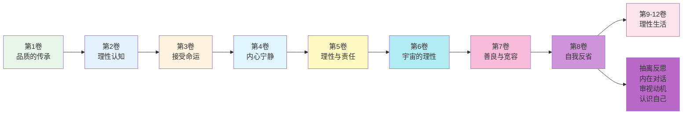
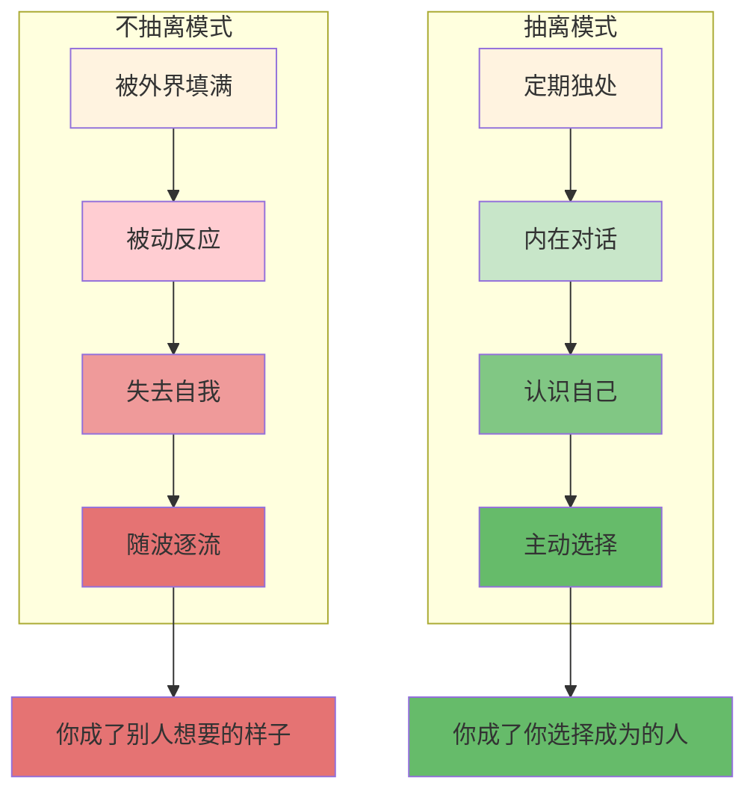
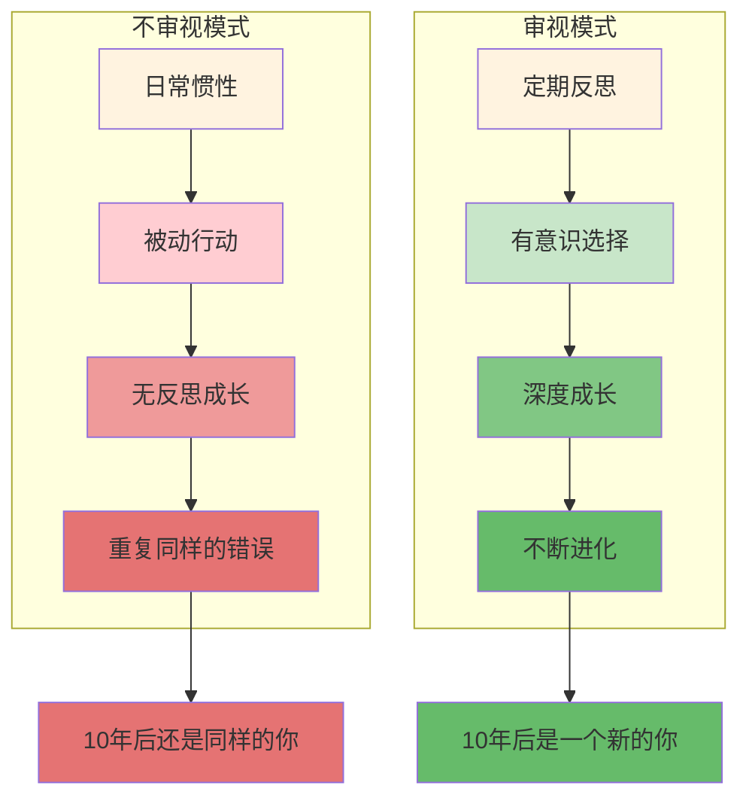
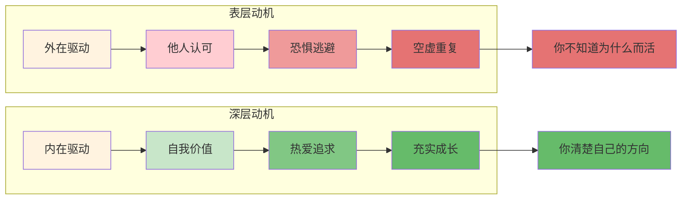
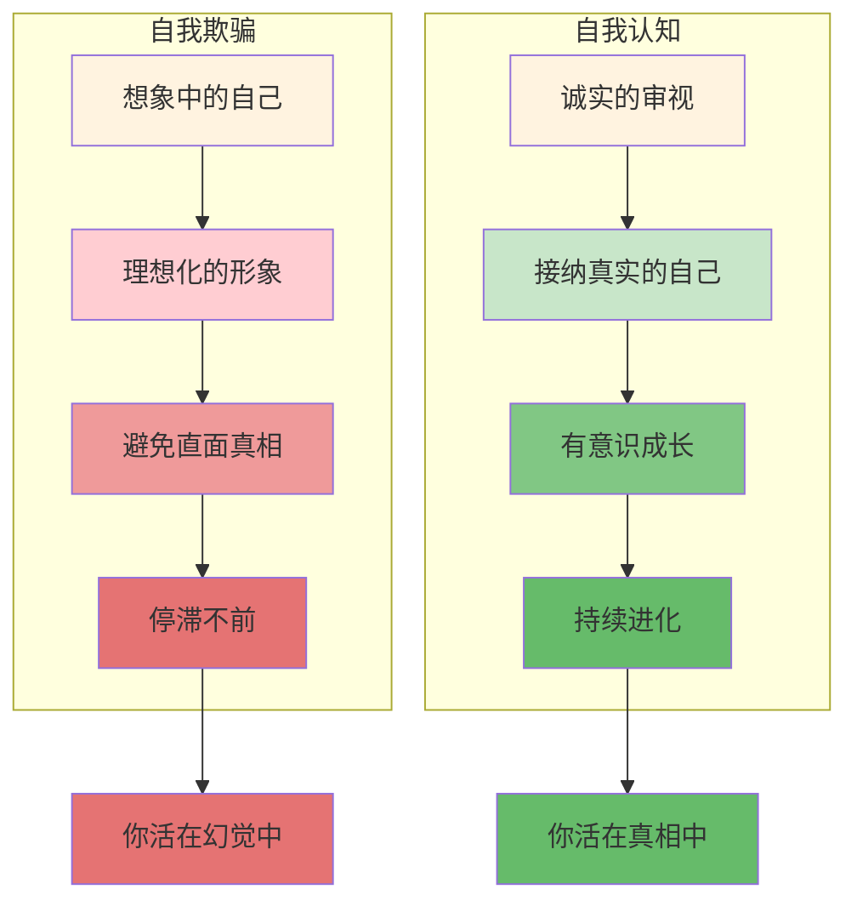
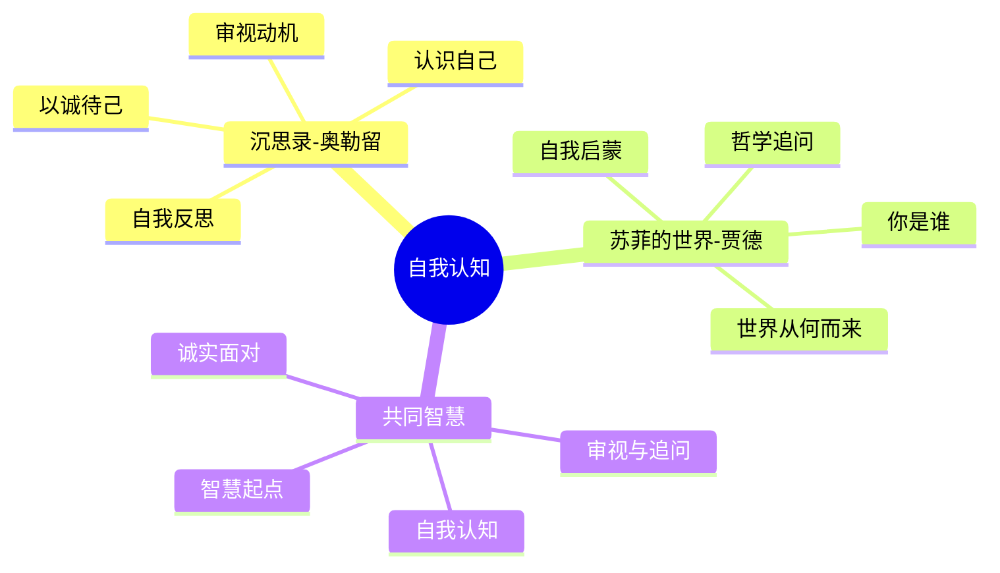

# 《沉思录》第8卷：自我反省

> **核心主题**：自我反省——如何在孤独中认识自己
> **章节定位**：从人际善良转向内在审视，建立持续的自我反思机制
> **阅读时间**：约50分钟

---

## 一、章节定位

### 1.1 这一卷在解决什么问题？

**核心问题**：在繁忙的日常中，我们总是被外界的事务填满，很少停下来审视自己——我是谁？我在做什么？我应该成为什么样的人？奥勒留的答案是：定期抽离，在孤独中与自己对话，因为未经审视的生活是不值得过的。

**一句话定位**：
> 你花那么多时间了解世界，却花那么少时间了解自己——在孤独中与自己对话，是智慧的开始。

---

### 1.2 这一卷在整本书中的位置



| 维度 | 定位 |
|------|------|
| **功能** | 从外在世界抽离，转向内在的自我审视 |
| **内容** | 自我反省、内在对话、审视动机、认识自己 |
| **风格** | 更加内省和个人化，从"如何对待他人"转向"如何对待自己" |
| **目的** | 建立持续的自我反思机制，在繁忙中保持清醒 |

---

### 1.3 与第7卷的关联

| 第7卷 | 第8卷 | 递进关系 |
|------|------|----------|
| 善良与宽容 | 自我反省 | 外在 → 内在 |
| 理解他人 | 认识自己 | 他 → 己 |
| 人际关系 | 内在对话 | 关系 → 独处 |
| 以善报人 | 以诚待己 | 待人 → 待己 |

**递进逻辑**：
```
第7卷：理解人性，以善待人（人际）
    ↓
第8卷：认识自己，以诚待己（自省）
    ↓
核心转换：外在关系 → 内在审视
```

---

## 二、核心观点（三层提取）

### 观点1：你需要定期从人群中抽离，与自己独处

#### 【表层】现象层

**奥勒留的原文**（8.1, 8.16）：
> "This, then, is the first thing you must do: retire into yourself."
> "People who retreat into themselves are not isolating themselves, but rather finding their true company."
> （这是你必须做的第一件事：退回到你自己之中。退回到自己之中的人不是在孤立自己，而是在找到真正的伴侣。）

**日常场景**：
- 总是被社交填满，害怕独处
- 一有空就刷手机，不敢面对自己
- 周末安排满满的，不给思考留时间
- 觉得独处是孤独，是失败者的状态

**降维翻译**：
> **你不是在人群中最清醒，而是在独处中最真实——定期抽离，与自己对话，是智慧的第一步。**

---

#### 【中层】机制层

**抽离vs不抽离的机制**：



**两种状态的对比**：

| 维度 | 不抽离 | 抽离 |
|------|--------|------|
| **状态** | 被外界填满 | 有内在空间 |
| **反应** | 被动应对 | 主动选择 |
| **自我** | 迷失在外界 | 认识自己 |
| **决策** | 随波逐流 | 有意识地活 |

---

#### 【底层】规律层

> **抽离定律**：如果你不定期从人群中抽离，你就会被人群塑造，而不是塑造自己。智慧需要空间，空间需要独处，独处需要勇气。

**降维翻译**：
> 在人群中，你是别人眼中的你。
> 在独处中，你是你自己眼中的你。
> 你想成为谁？
> 先给自己一个选择的空间。

---

### 观点2：未经审视的生活是不值得过的

#### 【表层】现象层

**奥勒留的原文**（8.8, 8.36）：
> "Examine your own life; but what need is there of it? For the past is gone, the future is not yet come, and the present, if you consider it, how brief it is."
> "Whatever this is, it is a fragment of time, a point in an infinite sea."
> （审视你自己的生活；但有什么必要呢？因为过去已去，未来未来，而现在，如果你考虑它，是多么短暂。）

**日常场景**：
- 每天忙忙碌碌，从不问自己在做什么
- 一年过去，不知道自己学到了什么
- 人生过半，不知道自己想成为谁
- 被惯性推着走，从不主动选择

**降维翻译**：
> **如果你从不停下来问自己"我在做什么"，你就只是在活着，而不是在生活——审视是意义的前提。**

---

#### 【中层】机制层

**审视vs不审视的机制**：



**不审视的三个代价**：

| 代价 | 描述 | 审视的收益 |
|------|------|------------|
| **重复错误** | 没有反思，不断犯同样的错 | 从错误中学习 |
| **失去方向** | 被惯性推着走，不知去哪 | 清楚自己想要什么 |
| **虚度生命** | 活了一辈子，不知为何而活 | 每一天都有意义 |

---

#### 【底层】规律层

> **审视定律**：成长不是自动发生的，它需要审视。未经审视的生活是重复，审视的生活是进化。苏格拉底说"未经审视的生活是不值得过的"，因为审视是赋予生活意义的唯一方式。

**降维翻译**：
> 不审视，你只是活着。
> 审视，你才是生活。
> 一字之差，
> 天壤之别。

---

### 观点3：审视你的动机，因为动机决定行为的本质

#### 【表层】现象层

**奥勒留的原文**（8.14, 8.49）：
> "Examine your own motives. Why are you doing what you're doing?"
> "Look within. Within is the fountain of good, and it will ever bubble up, if you will ever dig."
> （审视你自己的动机。你为什么做你正在做的事？向内看。善的源泉在内部，如果你愿意挖掘，它就会不断涌出。）

**日常场景**：
- 做事从不问为什么，只是习惯
- 为了别人的认可，而不是自己的价值
- 为了逃避恐惧，而不是追求渴望
- 口口声声说为自己，其实从未审视过

**降维翻译**：
> **你做的每件事都有动机，但你有几个动机是你自己审视过的？——动机决定行为的本质，不审视动机，就不知道自己是谁。**

---

#### 【中层】机制层

**审视动机的机制**：



**动机的三个层次**：

| 层次 | 动机类型 | 特征 | 结果 |
|------|----------|------|------|
| **第一层** | 外在驱动 | 为他人、为认可、为恐惧 | 空虚、焦虑 |
| **第二层** | 内在驱动 | 为价值、为热爱、为成长 | 充实、稳定 |
| **第三层** | 本质驱动 | 为善本身、为宇宙理性、为和谐 | 超越、自由 |

---

#### 【底层】规律层

> **动机定律**：行为的本质不在于你做什么，而在于你为什么做。同样的行为，不同的动机，是完全不同的事。审视动机，就是审视你是谁。

**降维翻译**：
> 同样的捐款，
> 一个为了名声，一个为了善。
> 同样的努力，
> 一个为了逃避，一个为了追求。
> 行为一样，动机不同，
> 你是完全不同的人。

---

### 观点4：认识你自己，是一切智慧的起点

#### 【表层】现象层

**奥勒留的原文**（8.48, 8.52）：
> "No man is free who is not master of himself."
> "Everything we hear is an opinion, not a fact. Everything we see is a perspective, not the truth."
> （不能掌控自己的人是不自由的。我们听到的一切都是观点，不是事实。我们看到的一切都是视角，不是真理。）

**日常场景**：
- 以为自己知道自己想要什么，其实从未想过
- 以为自己了解自己，其实只是在自我欺骗
- 以为自己很理性，其实被情绪驱动
- 以为自己很独特，其实只是环境的产物

**降维翻译**：
> **你以为你认识自己，但你可能只是在认识你想成为的那个自己——真正的自我认知需要诚实的审视，而不是自欺的想象。**

---

#### 【中层】机制层

**认识自己的机制**：



**认识自己的三个维度**：

| 维度 | 问题 | 自我欺骗 | 自我认知 |
|------|------|----------|----------|
| **动机** | 我为什么做？ | 为别人 | 诚实面对自己 |
| **能力** | 我能做什么？ | 高估或低估 | 客观评估 |
| **价值** | 我想要什么？ | 社会告诉你的 | 内心告诉你的 |

---

#### 【底层】规律层

> **自我认知定律**：认识你自己是一切智慧的起点。如果你不了解自己，你就不可能掌控自己；如果你不能掌控自己，你就不可能自由。自由不是外在的解放，而是内在的掌控。

**降维翻译**：
> 不认识自己，
> 你是自己的陌生人。
> 认识自己，
> 你才开始真正的生活。
> 这是智慧的起点，
> 也是自由的起点。

---

## 三、金句库

### 原文金句

1. "Retire into yourself."（8.1）
2. "Examine your own life."（8.8）
3. "Examine your own motives. Why are you doing what you're doing?"（8.14）
4. "No man is free who is not master of himself."（8.48）
5. "Look within. Within is the fountain of good."（8.49）
6. "Everything we hear is an opinion, not a fact."（8.52）
7. "People who retreat into themselves are finding their true company."（8.16）
8. "Whatever this is, it is a fragment of time."（8.36）

---

### 降维金句（人话版）

1. **退回到你自己之中——你不是在孤立自己，而是在找到真正的伴侣。**
2. **审视你自己的生活——因为如果你不审视，你就只是在活着，而不是在生活。**
3. **审视你自己的动机——你为什么做你正在做的事？动机决定行为的本质。**
4. **不能掌控自己的人是不自由的——真正的自由是内在的掌控。**
5. **向内看，善的源泉在内部——如果你愿意挖掘，它就会不断涌出。**
6. **我们听到的一切都是观点，不是事实；我们看到的一切都是视角，不是真理。**
7. **独处不是孤独，而是与自己对话——这是最真实的陪伴。**
8. **这一刻是时间的碎片——把握当下，就是把握永恒。**

---

## 四、当下映射

### 2026年读者的困惑

|------|------------|----------|
| 总是被外界填满怎么办？ | 定期抽离，与自己独处 | "找到方法了" |
| 一年过去不知道学了什么？ | 定期审视，反思成长 | "觉醒了" |
| 不知道自己为什么而活？ | 审视动机，找到内在驱动 | "清晰了" |
| 以为自己了解自己？ | 诚实审视，避免自我欺骗 | "被点醒了" |
| 如何在繁忙中保持清醒？ | 建立自我反省机制 | "有系统了" |

---

### 现代应用场景

**场景1：面对信息过载**
- 困惑：被信息填满，没有思考空间
- 根源：害怕独处，不敢面对自己
- 应用：每天15分钟独处，与自己对话

**场景2：面对职业迷茫**
- 困惑：不知道自己想要什么
- 根源：从未审视过自己的动机
- 应用：问自己"我为什么做这份工作？"

**场景3：面对自我欺骗**
- 困惑：以为自己很了解自己
- 根源：只看到理想化的自己
- 应用：诚实地问"我真的想要这个吗？"

**场景4：面对重复错误**
- 困惑：总是犯同样的错误
- 根源：没有定期反思
- 应用：建立每周审视机制

---

## 五、章节关联

### 与《沉思录》其他章节的关联

| 章节 | 关联类型 | 共同逻辑 |
|------|----------|----------|
| **第2卷** | 基础 | 控制二分法 → 审视你能控制的动机 |
| **第3卷** | 承接 | 接受命运 → 审视你的态度 |
| **第4卷** | 深化 | 内在宁静 → 审视你的内在 |
| **第5卷** | 扩展 | 理性责任 → 审视你的责任 |
| **第6卷** | 升华 | 宇宙理性 → 审视你的位置 |
| **第7卷** | 延伸 | 理解他人 → 认识自己 |
| **第8卷** | 核心 | 自我反省、审视动机、认识自己 |
| **第9-12卷** | 应用 | 持续的自我审视实践 |

**核心思想递进**：
```
第2卷：控制你控制的（边界）
    ↓
第3卷：接受你无法控制的（态度）
    ↓
第4卷：建立内在堡垒（状态）
    ↓
第5卷：理性指导责任（行动）
    ↓
第6卷：理解宇宙理性（升华）
    ↓
第7卷：理解人性，以善待人（人际）
    ↓
第8卷：认识自己，以诚待己（自省）
    ↓
第9-12卷：理性生活的持续实践
```

---

### 与其他书籍的关联

| 书籍 | 关联类型 | 共同底层逻辑 |
|------|----------|--------------|

**东西方智慧共鸣**：
```
《沉思录》：退回到自己之中 → 审视动机 → 认识自己
《苏菲的世界》：你是谁？世界从何而来？ → 哲学追问 → 自我认知
共同逻辑：审视和追问是自我认知的两个维度
```

---

### 与《苏菲的世界》的深度对比

| 维度 | 《沉思录》奥勒留 | 《苏菲的世界》贾德 | 共鸣点 |
|------|----------------|-----------------|--------|
| **方法** | 自我反思（日记） | 哲学追问（小说） | 都是自我认知 |
| **核心问题** | 我为什么这样做？ | 你是谁？ | 追问本质 |
| **目标** | 内心平静、理性生活 | 自我认知、哲学启蒙 | 认识自己 |
| **时代** | 罗马帝国（170-180年） | 现代（1991年） | 跨时空共鸣 |
| **流派** | 斯多葛哲学 | 西方哲学启蒙 | 都是自我探索 |

**跨时空共鸣**：
> 奥勒留的自我反思与贾德的哲学追问
> 一个用日记式反思，一个用小说式追问
> 但都是关于同一个问题：你是谁？
> 这就是自我认知的两个维度——反思与追问

---

## 六、问答设计

### Q1：如何区分独处和孤独？

**A**: 三个关键区别：

| 维度 | 独处 | 孤独 |
|------|------|------|
| **动机** | 主动选择 | 被动接受 |
| **内心** | 平静、充实 | 焦虑、空虚 |
| **功能** | 与自己对话 | 与自己失联 |
| **结果** | 更了解自己 | 更远离自己 |

**关键判断**：
- 独处 = 我选择与自己在一起
- 孤独 = 我被迫与自己分离

**记住**：独处是智慧的选择，孤独是被动的状态。

---

### Q2：我应该多久进行一次自我反省？

**A**: 奥勒留的建议是每天，但可以从简单开始：

**每日反省（5分钟）**：
- 今天我做了什么？
- 我为什么这样做？
- 明天我想做什么不同？

**每周反省（30分钟）**：
- 本周我学到了什么？
- 我重复了什么错误？
- 下周我想改进什么？

**每月反省（1小时）**：
- 这个月我成长了什么？
- 我离目标近了多少？
- 下个月我想专注什么？

**记住**：频率不重要，坚持才重要。

---

### Q3：审视动机会不会让我更焦虑？

**A**: 不会。相反，审视动机会让你更清晰：

**不审视的焦虑**：
- 不知道自己为什么做
- 被外在驱动，感到空虚
- 做了却不满足

**审视后的清晰**：
- 知道自己为什么做
- 能选择内在驱动
- 做了就满足

**关键区别**：
- 审视 = 从混沌到清晰
- 不审视 = 从混沌到更混沌

**记住**：审视不是增加负担，而是减轻负担。

---

### Q4：如何避免自我欺骗？

**A**: 四个方法：

**方法1：诚实提问**
- 问自己"我真的想要这个吗？"
- 问自己"我是在为别人还是为自己？"
- 不回避不舒服的答案

**方法2：行为验证**
- 看你的行为，而不是你的想法
- 如果你说想早起，但你每天都晚睡，你的行为说明了真相
- 行为比想法更诚实

**方法3：他人反馈**
- 问信任的人"你觉得我是什么样的？"
- 接纳他们的反馈，即使不舒服
- 外人的视角比你更客观

**方法4：定期审视**
- 不只是一次，而是持续
- 每周问自己"我还在自我欺骗吗？"
- 诚实的审视需要持续

**记住**：自我欺骗是人之常情，关键是持续审视。

---

### Q5：第8卷和第7卷有什么区别？

**A**: 第7卷和第8卷的区别：

| 第7卷 | 第8卷 |
|------|------|
| 善良与宽容 | 自我反省 |
| 理解他人 | 认识自己 |
| 人际关系 | 内在对话 |
| 以善待人 | 以诚待己 |
| 外在视角 | 内在视角 |

**递进关系**：
- 第7卷：理解人性，以善待人（向外）
- 第8卷：认识自己，以诚待己（向内）

**结合**：先学会对待他人（第7卷），再学会对待自己（第8卷），两者结合才是完整的智慧。

---

## 七、实践练习

### 练习1：自我反省日记

每天晚上花10分钟填写：

| 今天我做了什么？ | 我为什么这样做？ | 这是我真正想要的吗？ | 明天我想做什么不同？ |
|----------------|----------------|-------------------|-------------------|
| 示例：加班到很晚 | 想完成项目 | 不完全是 | 设定边界，早点下班 |
|  |  |  |  |

---

### 练习2：动机审视练习

每当要做重要决定，花5分钟：

1. 问自己："我为什么想做这件事？"
2. 问自己："这是内在驱动还是外在驱动？"
3. 问自己："如果没人知道，我还会做吗？"
4. 选择：诚实地面对你的动机

---

### 练习3：独处冥想

每周一次，花20分钟：

1. 找一个安静的地方
2. 关掉手机和电脑
3. 问自己："我是谁？"
4. 问自己："我想要什么？"
5. 问自己："我为什么做我做的事？"
6. 诚实地倾听内心的答案

---

### 练习4：行为验证法

每周一次，花10分钟：

1. 回顾你本周的行为
2. 问："我的行为和我想成为的人一致吗？"
3. 找出不一致的地方
4. 制定下周的行动计划

---

## 八、章节总结

### 核心公式

```
自我反省 = 定期抽离 + 审视生活 + 审视动机 + 认识自己
```

### 一句话总结

> 你花那么多时间了解世界，却花那么少时间了解自己——未经审视的生活是不值得过的，认识你自己是一切智慧的起点。

### 第8卷的核心贡献

1. **定期抽离**：从人群中退回到自己之中
2. **审视生活**：未经审视的生活是不值得过的
3. **审视动机**：动机决定行为的本质
4. **认识自己**：是一切智慧的起点

这四个工具，构成了自我反省的完整机制。

---

### 与《苏菲的世界》的终极共鸣



**跨时空的共鸣**：
> 奥勒留在罗马，贾德在挪威，相隔2000年，却看到了同一个真理——认识你自己是一切智慧的起点。奥勒留用反思，贾德用追问，但都是为了同一个目标：成为更清醒、更自由的自己。

---
