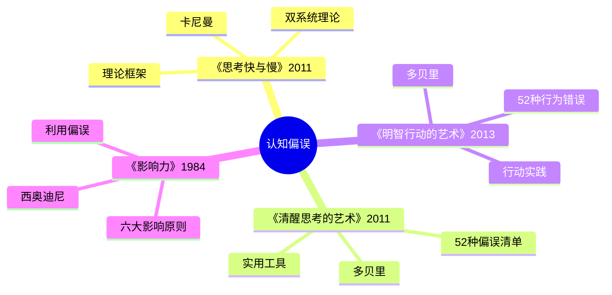

# 《清醒思考的艺术》读书笔记

## 这本书要解决什么问题？

**核心困境**：人类看似理性，实则充满认知偏误。我们每天都在做愚蠢的决定，却以为自己很聪明。问题不是"如何更聪明"，而是"如何避免脑子里的bug"。

**一句话定位**：
> 这是给普通人的"认知bug修复手册"——52种思维错误，每一种都在偷走你的判断力。

### 作者站在什么位置说这些话？

| 维度 | 定位 |
|------|------|
| 主领域 | 认知心理学 |
| 跨界领域 | 行为经济学、决策科学 |
| 作者背景 | 瑞士圣加仑大学企管硕士、经济哲学博士，getAbstract创始人，与塔勒布有学术交流 |
| 历史语境 | 2011年德文版出版，行为经济学从学术走向大众的普及链条中关键一环 |

### 和其他书有什么关系？

| 关联书籍 | 关联关系 | 共同底层逻辑 |
|----------|----------|--------------|
| [[思考快与慢]] | 理论到应用 | 卡尼曼提供双系统框架，多贝里提供52偏误清单 |
| [[明智行动的艺术-多贝里]] | 姊妹篇 | 思考+行动=完整决策系统 |
| [[影响力-西奥迪尼]] | 利用vs防御 | 影响力利用认知偏误，清醒思考识别并防御 |
| [[穷查理宝典]] | 高度重合 | 芒格的误判心理学与52个偏误高度重合 |

### 知识网络图

---

## 作者的核心论点

### 幸存偏误——成功者的墓地，你从来不去逛

你看到马斯克、乔布斯，没看到千万失败者。你看到巴菲特，没看到破产的股民。这就是幸存偏误——只看到成功者，忽略失败者，导致高估成功概率。我们只能看到被筛选后的结果，看不到被筛选掉的。

为什么这很重要？创业圈里人人都讲成功故事，好像创业成功很容易。但你从来没去过失败者的墓地。每一个"从车库到独角兽"的故事背后，是成千上万个从车库到破产的故事。

> **幸存偏误定律**：人类只能看到被筛选后的成功结果，看不到被筛选掉的失败者，这导致系统性地高估成功概率。

如果你想成功，先去失败者的墓地逛逛。

下次听到创业成功故事，我不会再热血沸腾，而是问："失败的概率是多少？我看到了多少失败案例？"

幸存偏误让我们高估成功概率，但这只是认知陷阱的开始——更隐蔽的是，我们还会主动过滤掉自己不爱听的信息。

---

### 确认偏误——你只看到你想看的

刷短视频时，你越看什么，算法越推什么。你关注的博主都说你认同的话。你以为世界和你想的一样——其实你只看到了算法想让你看到的。这就是确认偏误：大脑自动过滤掉与现有观点相矛盾的信息，只留下"顺眼"的。

确认偏误是信息茧房的核心机制。大脑喜欢一致性，排斥冲突信息。你只关注认同你的人，社交媒体加深了这种偏误。

> **确认偏误定律**：人类大脑自动过滤矛盾信息，强化既有观点，导致认知越来越狭窄。

事实不会因为你忽视而消失。

这个观点打碎了我的一个假设。我一直以为多看多学就能更客观，现在发现信息越多，确认偏误越严重——因为你只吸收认同的信息。下次看到一个观点，我不会只找支持它的证据，而是主动问："什么能证明我是错的？"

确认偏误让我们只看自己想看的，而沉没成本让我们无法放手已经投入的。

---

### 损失厌恶与沉没成本——过去的钱不该绑架现在的决定

"来都来了""都看一半了""都投这么多了"——这些话的共同点是什么？都在用过去的投入绑架现在的决定。这就是沉没成本谬误：因为已经投入而继续错误的决定。

沉没成本的背后是损失厌恶——损失的痛苦是收益快乐的2-2.5倍。禀赋效应则是损失厌恶的另一种表现：你拥有的东西，在你眼里更值钱。二手交易时，为什么你觉得值钱，买家觉得不值？因为你拥有它。

> **沉没成本定律**：人类因已投入而难以割舍，损失厌恶让过去的投入绑架未来的决策，导致越沉越深。

过去的钱，不该绑架现在的决定。

下次想说"来都来了"的时候，我会停下来问自己："如果之前没投入任何东西，我现在会做这个选择吗？"

损失厌恶让我们难以割舍，而从众心理让我们跟着别人犯错——这又是一重认知枷锁。

---

### 从众心理与权威偏误——大家都在做的，不一定对

排队两小时的网红店，吃完发现一般般。你为什么要排？因为大家都在排。这就是从众心理：看到别人怎么做，就跟着做。进化中的从众生存策略在原始社会有用，在今天让你集体犯错。

权威偏误更隐蔽：100万经济学家没一个预测到金融危机，但你还是信专家。白大褂不代表永远正确。人类进化中服从权威的生存策略，在今天让你盲信专家。

> **从众偏误定律**：人类在进化中发展出从众和服从权威的生存策略，这些策略在现代复杂环境中导致系统性的群体错误。

就算数百万人声称蠢事是对的，蠢事也不会变聪明。

以前我总相信"大家都在做的应该没错"，现在我会问：大家都在做的，真的对吗？下次看到排队两小时的网红店，我不会再跟着排队，而是问自己：我是真的想吃，还是只是跟着大家？

从众让我们跟着别人走，但这还不够——我们对概率的直觉判断也充满漏洞。

---

### 概率盲区——你记住的，不等于常发生的

恐怖主义和心脏病，哪个更致命？大多数人认为恐怖主义。事实是心脏病致死率远高于恐怖主义。但恐怖主义更"令人印象深刻"，媒体更爱报道——这就是可得性启发法：容易想起的信息被高估概率。

基率忽视同样普遍：戴眼镜、爱莫扎特的男性——更可能是卡车司机还是教授？大多数人选教授，但卡车司机的基数远大于教授。典型性不等于可能性。

赌徒谬误：连跌5天该涨了？不一定。随机就是随机，没有平衡力量。没有命运在记仇。

> **概率盲区定律**：人类不擅长直觉理解概率，容易把记忆强度等同于事件概率，把典型性等同于可能性。

新闻不是世界的地图。别让生动淹没统计。

下次看到一个"震撼"数据，我不会直接相信，而是问："这是常发生的，还是容易记住的？"

概率盲区让我们误判风险，而最后一重认知陷阱是我们对自己的高估。

---

### 过度自信与后见之明——你比你想象的更普通

84%的法国男人认为自己是好情人。这不可能——因为那意味着只有16%不是。这就是过度自信效应：系统性地高估自己的能力。能力不足也会促进过度自信——达克效应。

自利偏误是过度自信的搭档：成功归自己，失败归环境。你从不自责——不是因为没问题，是因为自我保护机制让你看不到自己的问题。

事后诸葛亮：事后觉得"我早就知道"。如果真的知道，你早就行动了。大脑在重构记忆，让你觉得"早就知道"，这导致过度自信，下次预测更大胆。

> **自我高估定律**：人类系统性地高估自己的能力和预测水平，成功归因于自己，失败归因于环境，事后修改记忆让自己觉得"早就知道"。

你比你想象的更普通。

以前我总觉得自己是例外，现在意识到过度自信本身就是一种认知偏误。下次觉得自己"特别厉害"的时候，我会问：我是真的厉害，还是过度自信在作祟？

---

## 这本书的局限

| 批评点 | 谁在批评 | 怎么说 | 实际情况 |
|--------|---------|--------|---------|
| 覆盖面广，深度有限 | 读者、评论者 | 每个偏误只用千余字讲解 | 确实是清单而非深度研究 |
| 部分偏误有重叠 | 学者 | 不同偏误可能是同一机制的不同表现 | 确实存在概念重叠 |
| 缺少系统性整合 | 读者 | 52个偏误没有形成统一的理论框架 | 需要结合《思考快与慢》补充理论底座 |
| 作者背景偏实践 | 学者 | 多贝里是企业家而非心理学家 | 实践视角反而让内容更接地气 |

**一句话总结局限性**：
> 清单实用但深度有限，需要搭配卡尼曼的理论框架形成完整认知。

---

## 最值得记住的话

**原书说的**：
1. "就算有数百万人声称某件蠢事是对的，这件蠢事也不会因此成为聪明之举。"
2. "纠缠于沉没成本，你会越沉越深。"
3. "给予的开始，就是索取的开始。"
4. "我们怕的不是不确定，而是和别人不一样。"
5. "事实不会因为你忽视而消失。"

**翻译成人话**：
1. 成功者的墓地，你从来不去逛
2. 你只看到你想看的
3. 专家的话，也可能是错的
4. 好听的故事，不一定是真的
5. 新闻不是世界的地图
6. 过去的钱，不该绑架现在的决定
7. 亏100的痛苦大于赚100的快乐
8. 大家都在做的，不一定对
9. 免费的东西，最贵
10. 你比你想象的更普通
11. 你不能重装大脑，但可以学会打补丁

---

## 讲给没读过的人听

你知道你的大脑有52个bug吗？

多贝里写了一本书，把人类最容易犯的52种思维错误列成清单。每一个bug你每天都在犯，但你自己不知道。

比如幸存偏误：你只看到成功者，看不到失败者。你以为创业成功很容易，因为你只听过成功故事。但成功者的墓地，你从来不去逛。

比如沉没成本：你说"来都来了""都投这么多了"。其实过去的钱不该绑架现在的决定——损失厌恶让你越沉越深。

比如确认偏误：你只看认同的信息，只关注认同你的人。你以为世界和你想的一样，其实你只看到了你想看到的。

知道bug在哪里，才能绕开它。这就是多贝里给你的：不是理论，是一份认知偏误的杀毒软件清单。

---

## 用来检验理解的问题

**基础回忆**：
1. Q: 幸存偏误是什么？
   A: 只看到成功者，忽略失败者，导致高估成功概率。成功者的墓地，你从来不去逛。

2. Q: 确认偏误的机制是什么？
   A: 大脑自动过滤矛盾信息，强化既有观点。信息茧房就是确认偏误的产物。

3. Q: 损失厌恶系数是多少？
   A: 约为2-2.5倍。亏100的痛苦需要赚200-250才能抵消。

**理解验证**：
1. Q: 为什么"免费的东西最贵"？
   A: 互惠偏误——别人对你好，你感到有义务回报。免费试用让你不好意思不买。

2. Q: 为什么专家也可能错？
   A: 权威偏误——人类进化中服从权威的生存策略，在今天导致盲信专家。

3. Q: 如何对抗确认偏误？
   A: 主动寻找反驳自己观点的信息。问自己："什么能证明我是错的？"

**实际应用**：
1. Q: 投资时如何对抗损失厌恶？
   A: 设置止损点提前写在纸上。不要用"成本价"作为卖出标准。问自己：如果现在没有持仓，会买吗？

2. Q: 如何在信息过载中保持清醒？
   A: 主动寻找反观点，延迟判断，区分事实和故事，警惕生动性。

**深度分析**：
1. Q: 多贝里的52偏误清单和卡尼曼的理论框架有什么关系？
   A: 卡尼曼提供理论底座（系统1/系统2），多贝里提供实用清单。理论加清单等于完整防御体系。

---

## 和其他书的对话

卡尼曼是多贝里的理论底座。《思考，快与慢》告诉你系统1和系统2怎么打架，认知偏误有哪些机制；多贝里把这些偏误列成52个清单，让你一个一个识别。卡尼曼给你理论地图，多贝里给你52个路标。先读卡尼曼理解为什么，再读多贝里知道是什么。

西奥迪尼从另一个方向利用同样的人性弱点。影响力教你怎么利用认知偏误影响别人，清醒思考教你怎么识别和防御。一面是攻击手册，一面是防御手册。读懂了西奥迪尼，你就知道营销在怎么套路你；读懂了多贝里，你就知道怎么不被套路。

芒格和多贝里发现了同一片矿脉。芒格的"人类误判心理学"和多贝里的52个偏误高度重合。但芒格从投资实战出发，多贝里从大众科普出发。芒格说"如果我知道我会死在哪里，我永远不会去那里"，多贝里把那52个"死地"标上了路标。

《明智行动的艺术》是本书的姊妹篇。这本讲思考的偏误，那本讲行动的偏误。思考加行动，等于完整决策系统。

塔勒布为多贝里的书写了序。认识认知偏误是应对黑天鹅的第一步——你连自己的bug都不知道，怎么应对不可预测的世界？

---

*拆解日期：2026-02-14*
*下次回访：1周后回顾「讲给没读过的人听」和「检验问题」*