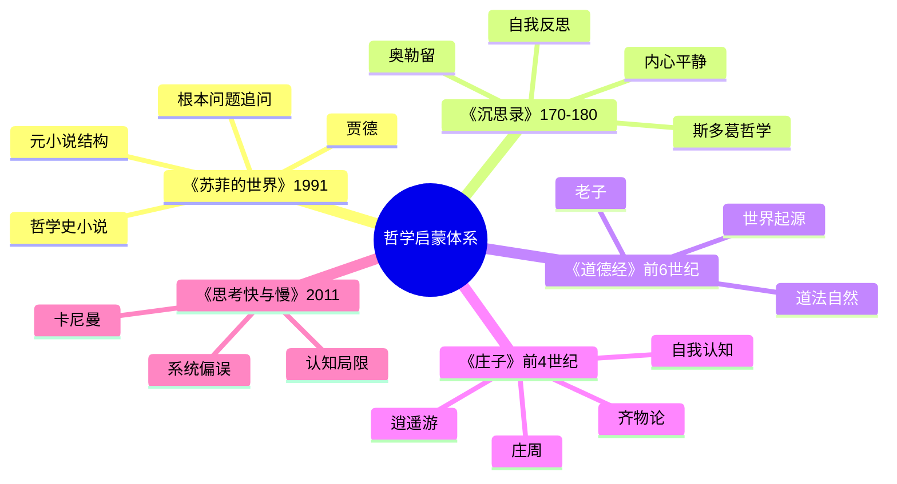

# 《苏菲的世界》读书笔记

> **作者**：乔斯坦·贾德（Jostein Gaarder，1952-）
> **成书**：1991年
> **地位**：全球最畅销的哲学入门书，被翻译成50多种语言，销量超过5000万册

## 这本书要解决什么问题？

**核心困境**：我们对"我是谁？""世界从何而来？"这些根本问题早已麻木，习惯了这个世界的理所当然，失去了对生命的惊叹和好奇。

**一句话定位**：
> 你太习惯这个世界了,才会对任何事情都不感到惊奇——哲学就是重新学会惊讶的艺术。

### 作者站在什么位置说这些话？

| 维度 | 定位 |
|------|------|
| 主领域 | 西方哲学史、哲学启蒙 |
| 跨界领域 | 元小说、成长小说、教育哲学、认知科学 |
| 作者背景 | 高中哲学教师多年，精通哲学史与教学法 |
| 知识定位 | 哲学入门典范级 - 西方哲学的"上下五千年" |

### 和其他书有什么关系？

| 关联书籍 | 关联关系 | 共同底层逻辑 |
|----------|----------|--------------|
| [[庄子-庄子]] | 哲学探索 | "你是谁？"的永恒追问 - 庄子的"齐物论" vs 贾德的哲学追问 |
| [[道德经-老子]] | 根本问题 | "世界从何而来？" - 老子的"道生一" vs 贾德的哲学启蒙 |
| [[沉思录-马可·奥勒留]] | 自我反思 | "未经审视的生活" - 奥勒留的自我反思 vs 苏菲的哲学追问 |
| [[思考快与慢-丹尼尔·卡尼曼]] | 认知偏误 | "习惯化麻木" - 卡尼曼的系统1自动思维 vs 苏菲的"太习惯这个世界" |
| [[心流-契克森米哈赖]] | 深度体验 | "沉浸其中" - 契克森米哈赖的忘我体验 vs 苏菲的哲学探索投入 |
| [[被讨厌的勇气-岸见一郎]] | 目的论 | "存在意义" - 阿德勒的活出自己 vs 贾德的自我认知 |

### 知识网络图

---

## 作者的核心论点

### 你太习惯这个世界了，才会对任何事情都不感到惊奇

"How terribly sad it was that people are made in such a way that they get used to something as extraordinary as living."

托尔斯泰说：人最大的悲哀，就是太习惯这个世界了。

太阳东升西落，你觉得理所当然。生命奇迹般诞生，你觉得稀松平常。宇宙的浩瀚神秘，你觉得与自己无关。每一天的新生，你觉得只是重复的昨天。

苏菲收到一封神秘信件，上面只有一个问题："你是谁？"

她开始思考。她想到自己的名字、长相、家庭。但这些都是她被动接受的。她没有选择要成为什么人。她甚至不曾选择要做人。

苏菲意识到：我们活着，却不知道自己在活着——这就是最大的悲哀。

习惯化麻木 vs 哲学觉醒：

| 维度 | 习惯化状态 | 哲学唤醒后 |
|------|-----------|-----------|
| 对生命的态度 | 理所当然 | 充满惊叹 |
| 对问题的态度 | 拒绝思考 | 主动追问 |
| 对世界的好奇 | 麻木不仁 | 充满好奇 |
| 日常体验 | 重复无聊 | 新鲜有趣 |

> **哲学唤醒定律**：真正的哲学不是复杂的理论,而是重新学会惊讶——对生命、对世界、对自己的存在感到惊叹。

这个观点打碎了我对"正常生活"的假设。我一直以为每天上班下班、吃饭睡觉是正常的，庄子说"夏虫不可以语于冰"，贾德说"你太习惯这个世界了"。下次觉得生活无聊，我不会再问"怎么打发时间"，而是问"我什么时候失去了好奇"。

但贾德知道，唤醒好奇心只是第一步。更关键的是：如何保持对根本问题的追问？苏格拉底给出了答案。

### 未经审视的生活是不值得过的

苏格拉底在雅典街头拦住人，问：什么是正义？什么是美德？什么是善？

雅典人起初觉得他烦。后来他们发现：苏格拉底在逼他们思考自己从未思考过的问题。

大家都这么活，所以我也这么活。社会要我做什么，我就做什么。从不质疑自己的选择是否正确。人生就像自动驾驶，从不思考方向盘在谁手里。

苏格拉底的名言：未经审视的生活是不值得过的。

如果你不思考自己在为什么活，那你和一台机器有什么区别？

审视 vs 不审视：

| 维度 | 不审视的生活 | 审视后的生活 |
|------|------------|--------------|
| 选择依据 | 别人怎么做 | 自己想要什么 |
| 时间维度 | 活在过去/未来 | 活在当下 |
| 责任归属 | 责怪外在 | 自己负责 |
| 意义感 | 虚无感 | 明确方向 |

> **自我审视定律**：未经审视的生活不是真正的生活,只是活着。审视自己的选择,才能找到自己的道路。

以前我总觉得随大流是安全的，大家都这么活，我跟着就行。现在意识到这完全错了——不审视的人生就像自动驾驶，方向盘在谁手里我都不知道。下次面临人生选择——职业、婚姻、生活方式——我会停下来问自己：这是我自己选的，还是随大流？问清楚再往前走。

但苏格拉底的追问不仅关于生活，更关于自我——我是谁？

### 我是谁？——自我认知的哲学追问

苏菲的信件上写着三个问题：

1. 你是谁？
2. 世界从何而来？
3. 生命的意义是什么？

她开始思考第一个问题。她想到自己的名字、长相、家庭、工作。但这些都是外在标签，是她被动接受的。她没有选择要成为什么人。

苏菲意识到：你是谁，不是由外在标签决定的，而是由你内在选择定义的。剥离所有标签，你才是真实的自己。

社会标签 vs 自我定义：

| 维度 | 社会标签 | 自我定义 |
|------|---------|----------|
| 来源 | 外在赋予 | 内在发现 |
| 稳定性 | 随环境变化 | 相对稳定 |
| 真实性 | 可能虚假 | 更加真实 |
| 力量 | 限制你 | 解放你 |

> **自我认知定律**：你是谁,不是由外在标签决定的,而是由你内在选择定义的。剥离所有标签,你才是真实的自己。

这个观点让我重新审视自己。我一直用"我是程序员""我是父亲""我是中国人"来定义自己。但如果剥离这些标签，我还剩什么？贾德说：那才是真实的你——你的选择、你的价值观、你想要成为谁。

苏菲继续追问第二个问题：世界从何而来？这个问题把她引向更深的哲学思考。

### 世界从何而来？——宇宙起源的哲学追问

世界会不会一直存在？每一件事物是不是都有个开始？"无"中怎么能生出"有"？宇宙的起点在哪里？

三种答案对比：

| 视角 | 答案 | 价值 |
|------|------|------|
| 宗教 | 上帝创造 | 给予信仰和意义 |
| 科学 | 大爆炸、进化论 | 给予知识和解释 |
| 哲学 | 持续追问本身 | 给予思维和智慧 |

贾德的洞见是：追问"世界从何而来"的目的不是得到最终答案，而是保持对宇宙的敬畏和好奇。

科学解决"如何"，哲学解决"为何"。天文望远镜看到宇宙深处，你觉得渺小？宇宙的浩瀚，正是哲学思考的起点。

> **追问定律**：追问"世界从何而来"的目的不是得到最终答案,而是保持对宇宙的敬畏和好奇。

以前我以为追问宇宙起源是科学家的事，普通人不需要关心。这个观点打碎了我的假设：追问不是为了得到答案，而是保持敬畏。下次仰望星空觉得渺小，我不会再逃避这种感觉，而是让它成为思考的起点——宇宙这么大，我这么小，我的烦恼又算什么？

不过，贾德还有一个更反直觉的观点：正是死亡，让生命有意义。

### 如果你没有意识到人终将死去，就不能体会活着的滋味

"If you don't realize that people will die, you can't appreciate what it means to be alive."

我们总以为还有时间，所以不珍惜当下。我们总想等将来，所以忘了现在。我们总在焦虑未来，所以错过今天。我们总觉得死亡离自己很远，所以活着感觉像永恒。

正是因为死亡存在，生命才珍贵——不是因为活着是永恒，而是因为活着是有限的。

有死亡意识 vs 无死亡意识：

| 维度 | 有死亡意识 | 无死亡意识 |
|------|-----------|-----------|
| 时间观 | 有限,珍惜 | 以为无限,浪费 |
| 行动 | 当下就做 | 总是拖延 |
| 意义 | 活出自己 | 随波逐流 |
| 满足感 | 深度满足 | 表面快乐 |

> **死亡意识定律**：正是因为死亡,生命才有意义。意识到生命的有限性,才能活得有深度和质量。

这个观点让我重新理解"向死而生"。我一直以为死亡是终点，贾德却说：死亡是意义的起点。正因为生命会结束，每一刻才值得珍惜。下次觉得"还有时间"而拖延，我会问自己：如果今天就是最后一天，这件事还值得做吗？

这引出了另一个问题：如果死亡赋予生命意义，那么"真实"本身是否值得质疑？

### 元小说——苏菲发现自己只是书中人物

苏菲收到神秘哲学信件，跟随导师艾伯特学习哲学史。她逐渐发现线索：自己是书中人物。她的世界其实是席德父亲为女儿创作的虚构世界。

你以为你活在真实世界，但你可能也只是别人故事里的人物——你如何证明自己的真实？

三层世界结构：

| 层级 | 世界 | 创造者 | 质疑 |
|------|------|--------|------|
| 第一层 | 席德的世界 | 现实 | 我们真的活在现实吗？ |
| 第二层 | 苏菲的世界 | 席德父亲 | 苏菲的世界是真实的吗？ |
| 第三层 | 我们的阅读世界 | 贾德 | 我们的世界是真实的吗？ |

> **元小说定律**：通过故事质疑故事的真实性,最终质疑现实的真实性——哲学的核心就是追问什么是"真实"。

这打碎了我对"现实"的迷信。我一直理所当然地认为我活在真实世界，贾德却用三层嵌套让我动摇：苏菲质疑她的世界，我凭什么不质疑我的世界？下次觉得"这就是现实"时，我会停一下问：如果我也是某个更大故事里的人物，我该如何证明自己的真实？

---

## 这本书的局限

> 贾德的哲学入门有其边界，不是哲学的全部。

| 批评点 | 谁在批评 | 怎么说 | 实际情况 |
|--------|---------|--------|---------|
| 过于简化 | 哲学专业 | 西方哲学史被压缩成入门故事，深度不够 | 作为入门书是优点，但确实不能替代专业哲学学习 |
| 西方中心 | 东方学者 | 几乎没有涉及东方哲学，只有古希腊到存在主义 | 书名就定位为"西方哲学入门"，但确实有局限 |
| 元小说 gimmick | 文学评论 | 元小说结构是噱头，分散对哲学内容的关注 | 元小说结构恰恰是哲学追问的体现——什么是真实？ |
| 过于乐观 | 批判哲学家 | 哲学问题被处理得好像都有答案 | 贾德确实偏向启蒙向，批判性可以更强 |

**一句话总结局限性**：
> 《苏菲的世界》是最好的哲学入门书之一，但读完需要继续深入专业哲学，才能真正理解哲学的复杂性和争议性。

---

## 最值得记住的话

**原书说的**：

1. "Wisest is she who knows she does not know."（最聪明的人是知道自己无知的人）
2. "How terribly sad it was that people are made in such a way that they get used to something as extraordinary as living."（人被造成这样,实在很悲哀——太习惯这个世界了,才会对任何事情都不感到惊奇）
3. "If you don't realize that people will die, you can't appreciate what it means to be alive."（如果你没有意识到人终将死去,就不能体会活着的滋味）
4. "It's not a silly question if you can't answer it."（如果你不能回答,这就不是愚蠢的问题）
5. "The unexamined life is not worth living."（苏格拉底：未经审视的生活是不值得过的）

**翻译成人话**：

1. 你太习惯这个世界了,才会对任何事情都不感到惊奇
2. 如果你不思考自己在为什么活,那你和一台机器有什么区别？
3. 最聪明的人不是知道最多的人,而是知道自己不知道的人
4. 你叫什么名字,这不重要；重要的是,你自己定义的"你是谁"是什么
5. 我们活着,却不知道自己在活着——这就是最大的悲哀
6. 哲学不是教你懂道理,而是教你重新学会惊讶
7. 正因为死亡存在,生命才珍贵——不是因为活着是永恒,而是因为活着是有限的
8. 停止和死亡对抗,开始珍惜生命——死亡是提醒不是威胁
9. 追问世界从哪里来,不是为了得到答案,而是保持对宇宙的敬畏和好奇

---

## 讲给没读过的人听

你有没有发现，你从来不问"为什么"了？

太阳每天升起，你觉得正常。生命诞生，你觉得正常。宇宙存在，你觉得正常。你太习惯这个世界了。

苏菲收到一封信，上面只有一个问题："你是谁？"她开始思考，发现名字、长相、家庭都是外在标签，她没选择过。她甚至不曾选择要做人。

苏格拉底两千年前就在雅典街头问人：什么是正义？什么是善？他的结论是：未经审视的生活是不值得过的。

贾德用一本小说，把西方哲学史讲完了。从古希腊到存在主义，从苏格拉底到萨特。但核心只有一个问题：你为什么不思考？

你可能觉得哲学太抽象。但贾德说：哲学不是教你懂道理，而是教你重新学会惊讶。对生命惊讶，对世界惊讶，对自己的存在惊讶。

他还问：你有没有意识到你会死？正因为死亡存在，生命才珍贵。你以为还有无限时间，所以拖延。意识到生命有限，你才会珍惜当下。

苏菲最后发现：自己是书中人物。她在质疑自己的世界是否真实。那你的世界呢？真的"真实"吗？

---

## 用来检验理解的问题

**基础回忆**：

1. Q: 苏菲收到的三个哲学问题是什么？
   A: 你是谁？世界从何而来？生命的意义是什么？

2. Q: 苏格拉底的名言是什么？
   A: 未经审视的生活是不值得过的。

3. Q: "元小说"结构是什么意思？
   A: 苏菲发现自己只是书中人物，通过故事质疑现实的真实性。

**理解验证**：

1. Q: 为什么"最聪明的人是知道自己无知的人"？
   A: 承认无知是思考的开始。以为自己知道的人，停止了追问。

2. Q: 为什么死亡意识让生命有意义？
   A: 正因为生命会结束，每一刻才珍贵。以为无限，才会浪费。

3. Q: "你是谁"这个问题的答案是什么？
   A: 没有标准答案。关键是剥离外在标签后，你自己选择成为谁。

**实际应用**：

1. Q: 用贾德的方法，重新审视你的生活——哪些是你自己选的，哪些是随大流？
   A: 关键步骤：列出你的人生选择→问"这是我选的吗"→区分自我定义和社会标签。

2. Q: 下次觉得生活无聊，用什么问题唤醒好奇？
   A: 问自己：我什么时候失去了对世界的惊讶？太阳为什么升起？生命为什么存在？

---

## 和其他书的对话

庄子和贾德都在追问"我是谁"。庄子的"庄周梦蝶"问的是：我是庄周还是蝴蝶？苏菲的信件问的是：你是谁？庄子用寓言表达，贾德用小说叙事。两千年的跨度，同一个根本问题。东方的答案是"齐物论"——万物平等，打破分别心；西方的答案是"自我认知"——剥离标签，找到真实的自己。

老子和贾德都追问"世界从何而来"。老子的答案是"道生一，一生二，二生三，三生万物"——给出了答案；贾德的答案是"持续追问本身"——问题比答案重要。东方给出确定性的安慰，西方保持不确定性的好奇。但敬畏之心相同。

奥勒留和贾德都强调自我反思。奥勒留用日记体写《沉思录》，每夜审视自己；贾德用小说体写《苏菲的世界》，让苏菲追问自己。斯多葛派说"控制可控的，接纳不可控的"；贾德说"未经审视的生活不值得过"。一个偏向行动，一个偏向思考。

卡尼曼和贾德都在对抗"习惯化"。卡尼曼用心理学实验证明：系统1的自动思维让我们失去觉察；贾德用哲学寓言说：太习惯这个世界，就失去了惊讶。卡尼曼给出方法：激活系统2慢思考；贾德给出方向：重新学会惊讶。

契克森米哈赖和贾德都研究深度体验。心流是忘我沉浸；哲学追问是好奇投入。一个是活动的最优体验，一个是存在意义的深度追问。两者结合：在活动中体验心流，在存在中追问意义。

---

*拆解日期：2026-02-15*
*下次回访：1周后回顾「讲给没读过的人听」和「检验问题」*