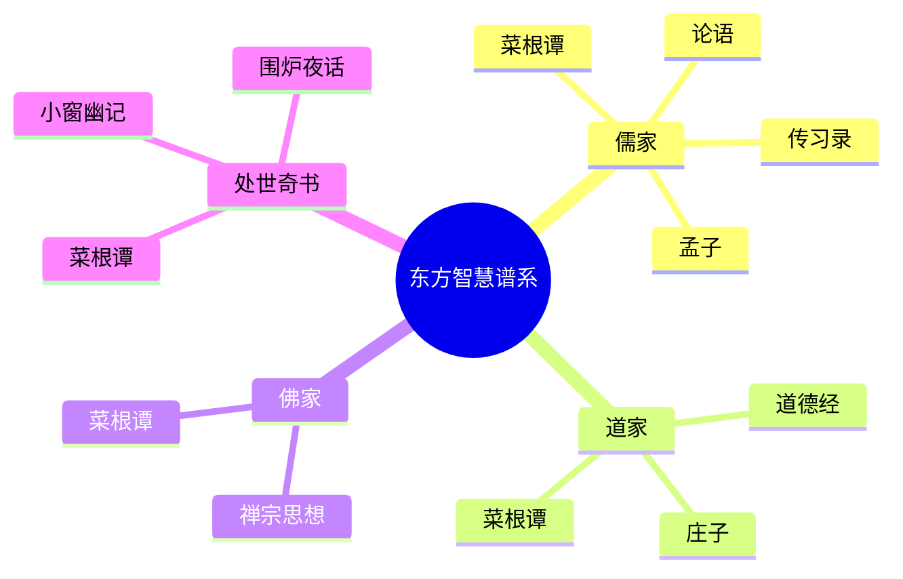

# 《菜根谭》读书笔记

## 这本书要解决什么问题？

**核心困境**：如何在世俗的纷扰中保持内心的宁静与操守？面对名利权势的诱惑，如何既不堕落又不偏激，在入世与出世之间找到平衡？

**一句话定位**：
> 嚼得菜根，方知世味；抱朴守拙，始见人心。儒释道三家智慧，融汇成中国式生存哲学。

### 作者站在什么位置说这些话？

| 维度 | 定位 |
|------|------|
| 主领域 | 修身养性、处世哲学 |
| 跨界领域 | 儒家中庸之道、道家无为思想、佛家出世思想 |
| 作者背景 | 明代思想家洪应明（号还初道人），早年热衷仕途，晚年归隐山林，精通释、道、儒三家思想 |
| 知识定位 | 儒释道三家交汇处的处世哲学经典，与《小窗幽记》《围炉夜话》并称"处世三大奇书" |

### 和其他书有什么关系？

| 关联书籍 | 关联关系 | 共同底层逻辑 |
|----------|----------|--------------|
| [[道德经-老子]] | 理论继承 | "抱朴守拙"直接来自老子"见素抱朴"思想 |
| [[庄子-庄子]] | 理论互补 | 道家的"无为"与《菜根谭》的"闲适"相呼应 |
| [[论语-孔子]] | 理论互补 | 儒家的"修身齐家"与《菜根谭》的"修省应酬"呼应 |
| [[孟子-孟子]] | 理论互补 | 孟子的"养气"与《菜根谭》的"养性"相通 |
| [[传习录-王阳明]] | 时代背景 | 同属明代心学影响下的作品，强调心性修养 |

### 知识网络图

---

## 作者的核心论点

### 抱朴守拙：与其练达，不若朴鲁

"人咬得菜根，则百事可做。"咬菜根需要耐心和韧性，做人处世也一样——经受磨难而不改初心。

书中写道："涉世浅，点染亦浅；历事深，机械亦深。故君子与其练达，不若朴鲁；与其曲谨，不若疏狂。"

翻译成大白话：刚进社会的人，阅历不深，受的不良影响也少；阅历深的人，各种奸谋技巧可能很多。所以一个坚守道德准则的君子，与其过于精明圆滑，不如朴实笃厚；与其谨小慎微曲意迎合，不如坦荡大度。

这个观点反直觉：在这个聪明人过剩的时代，做个朴拙的人反而成了稀缺资源。

朴拙 vs 圆滑的生存策略：

| 朴拙之道 | 圆滑之术 |
|----------|----------|
| 保持初心不变 | 随环境变化而变化 |
| 真诚待人不伪装 | 见人说人话见鬼说鬼话 |
| 宁可吃亏不占便宜 | 处处算计谋求利益 |
| 长远积累口碑 | 短期获得利益 |
| 心安理得 | 提心吊胆 |

背后的心理机制有三层：人们更容易相信简单、直接的人，而非过度包装的人（初心理效应）；看似"笨拙"的人反而更容易获得信任和长期合作（反直觉策略）；不需要维持人设，心理负担轻，反而更有能量应对挑战（内耗减少）。

> **抱朴守拙定律**：复杂的社会系统中，"简单"反而是稀缺资源。信任成本低、决策效率高、积累复利效应——保持初心、不搞心机的人，反而更容易在长期博弈中胜出。

这个观点打碎了我对"精明"的迷信。我一直以为在社会上混得好要靠聪明圆滑，洪应明却说：与其练达，不若朴鲁。真诚不是傻，真诚是最高级的精明——因为真诚没有维护成本。下次在职场面临"要不要伪装"的抉择，我不会再觉得朴拙是劣势。

但抱朴守拙不是一味退让。洪应明对"让利"有更深的理解——让利表面上是损失，实际上是投资。

### 径路窄处，留一步与人行

"径路窄处，留一步与人行；滋味浓的，减三分让人尝，此是涉世一极安乐法。"

在经过狭窄的道路时，要留一步让别人走得过去；在享受甘美的滋味时，要分一些给别人品尝。这就是为人处世中取得快乐的最好方法。

让利背后的博弈逻辑：

| 不让利 | 让利 |
|--------|------|
| 独占全部利益 | 分享部分利益 |
| 短期获得最大化 | 长期建立合作网络 |
| 容易引发对立 | 获得善意回报 |
| 零和博弈 | 正和博弈 |
| 单次交易 | 重复博弈 |

心理机制：人天生有回报善意的倾向（互惠原理）；"让"的行为越少见，越显得珍贵（稀缺性效应）；降低对方预期，反而更容易超越预期（预期管理）。

数学表达：让利一次损失L，获得长期合作收益R。当N次合作的平均收益R/N > L时，让利就是正收益策略。

> **让利定律**：在重复博弈的社会系统中，"让利"表面上是损失,实际上是投资——建立声誉、降低交易成本、扩大合作网络、增强反脆弱。

这打碎了我对"竞争"的假设。我一直以为利益要争取，让利就是吃亏。洪应明却说：让利是投资，不是损失——在重复博弈中，声誉和合作网络比单次利益更有价值。下次遇到职场竞争中两败俱伤的局面，我不会再想"怎么赢"，而是想"怎么让"——格局决定结局。

但洪应明不只讲"让"，他还讲"藏"。

### 君子之心事，天青日白；君子之才华，玉韫珠藏

"君子之心事，天青日白，不可使人不知；君子之才华，玉韫珠藏，不可使人易知。"

有道德有修养的正人君子，他的思想行为应该像青天白日一样光明磊落，没有什么需要隐藏的阴暗行为；而他的才情和能力应该像珍贵的珠宝一样不浮浅外露，从不轻易地向人炫耀。

这是个精妙的组合策略：

| 心事（动机） | 才华（能力） |
|--------------|--------------|
| 天青日白（透明） | 玉韫珠藏（隐藏） |
| 让人知道你的动机 | 不轻易展示全部能力 |
| 建立信任 | 保留底牌 |
| 降低他人的防御心理 | 保持神秘感 |
| 长期合作 | 关键时刻出手 |

背后的心理机制：越是透明的人，越不容易被猜疑（透明度悖论）；隐藏部分能力，反而让已有的能力显得更有价值（能力保留效应）；偶尔展示隐藏能力，产生"惊喜"效应（惊喜管理）。

> **透明-隐藏定律**：动机透明度与能力隐藏度应该形成"高透明-高隐藏"的组合。透明动机让人放心合作，隐藏能力让人保持敬畏，关键时刻展示隐藏能力，产生最大影响力。

以前我总把"真诚"理解为"什么都展示"，洪应明纠正了我：真诚是动机透明，不是才华外露。让人知道你的意图，但不要展示你的全部能力。光明磊落加深不可测，就是最高级的处世智慧。

但透明与隐藏只是策略，洪应明还有一套更根本的原则——名利和德业，你怎么排序？

### 宠利毋居人前，德业毋落人后

"宠利毋居人前，德业毋落人后，受享毋逾分外，修为毋减分中。"

获得名利的事情不要抢在别人前面去争取，积德修身的事情不要落在别人后面；享受不要超过自己的本分，修养不要低于应有的水准。

名利 vs 德业的优先级：

| 宠利（名利） | 德业（品德） |
|--------------|--------------|
| 毋居人前（不争） | 毋落人后（必争） |
| 享受分内 | 修养分中 |
| 不逾分外 | 不减分中 |
| 外部成就 | 内在修养 |

心理机制：越是争名夺利，越容易招致反感（逆向激励）；德业高的人，名利自然追随（道德光环效应）；克制欲望本身就是一种修养（自我控制）。

数学表达：社会评价 S = 德业贡献 D × 时间因子 T^2 - 名利损失 L × 时间因子 T。当时间T足够大时，德业贡献 D 会远远超过名利损失 L。

> **德业优先定律**：在长期的社会评价系统中，德业（内在修养）比宠利（外在成就）具有更高的时间价值。德业随时间积累复利效应，名利随时间衰减；德业高的人抗风险能力更强；德业可以代际传承，名利无法传承。

这打碎了我对"成功"的迷信。我一直以为名利才是硬指标，德业是虚的。洪应明却说：名利像快餐，德业像慢炖——快餐爽一下就没了，慢炖越炖越香。下次面临"要不要争这个利益"的选择，我不会只看眼前得失，还会问：十年后，哪个选择会让我更心安？

有了德业优先的原则，还需要最后一项能力：如何让心不背包袱？

### 事来而心始现，事去而心随空

"风来疏竹，风过而竹不留声；雁渡寒潭，雁去而潭不留影。故君子事来而心始现，事去而心随空。"

风吹过稀疏的竹林，风走后竹子不留风声；大雁飞过寒冷的潭水，大雁走了潭水不留影子。所以君子事情来了心才显现，事情去了心随之空空。

这是《菜根谭》最诗意的段落，也是最实用的心理管理智慧。

| 有事状态 | 无事状态 |
|----------|----------|
| 事来心现 | 事去心空 |
| 专注应对 | 马上放下 |
| 不留执念 | 不留阴影 |
| 全身心投入 | 归于平静 |

心理机制：事情和情绪分离，事情结束情绪也结束（情绪隔离）；快速切换状态，不纠结过去（心理弹性）；只在"现在"有情绪，过去和未来都没有（当下专注）。

> **心空定律**：心理健康指数 = 专注当下 - 纠结过去 - 担忧未来。当纠结和担忧为零时，心理健康达到最大值。情绪是有成本的，持续消耗会耗尽能量；不放下过去的情绪，会累积成心理负担。

以前我总觉得情绪要"处理"，要分析、要消化。洪应明却说：情绪不需要处理，只需要放下——像风过竹林，雁渡寒潭。下次被过去的事情折磨，我会想起这句话：把情绪当过客，不当房客。事情来了就应对，事情走了就放下。不要把情绪当行李，太重了背不动。

---

## 这本书的局限

> 《菜根谭》是明代处世哲学的精华，但有其时代局限。

| 批评点 | 谁在批评 | 怎么说 | 实际情况 |
|--------|---------|--------|---------|
| 过于保守 | 清末《反菜根谭》 | 强调忍让、退守，缺乏进取精神 | 洪应明的退让是策略性的，但确实容易被误解为消极 |
| 阶级局限 | 现代学者 | 明代文人写给士大夫的，不适用于所有人 | 智慧可提炼，但场景需适配现代 |
| 缺乏系统 | 哲学界 | 格言体，缺乏系统的哲学论证 | 格言体的优势是易记易用，但确实碎片化 |
| 过度中庸 | 批判思维者 | 追求平衡可能丧失立场 | 洪应明的中庸是"守正"，不是无原则的妥协 |

**一句话总结局限性**：
> 《菜根谭》的智慧最适合日常处世和心理调适，但面对需要突破和变革的场景，需要更进取的智慧配合。

---

## 最值得记住的话

**原书说的**：

1. 涉世浅，点染亦浅；历事深，机械亦深。故君子与其练达，不若朴鲁；与其曲谨，不若疏狂。
2. 君子之心事，天青日白，不可使人不知；君子之才华，玉韫珠藏，不可使人易知。
3. 势利纷华，不近者为洁，近之而不染者为尤洁；智械机巧，不知者为高，知之而不用者为尤高。
4. 径路窄处，留一步与人行；滋味浓的，减三分让人尝，此是涉世一极安乐法。
5. 交友须带三分侠气，做人要存一点素心。
6. 宠利毋居人前，德业毋落人后，受享毋逾分外，修为毋减分中。
7. 风来疏竹，风过而竹不留声；雁渡寒潭，雁去而潭不留影。故君子事来而心始现，事去而心随空。
8. 地低成海，人低成王。
9. 建功立业者，多虚圆之士；愤世失机者，必执拗之人。
10. 栖守道德者，寂寞一时；依阿权势者，凄凉万古。

**翻译成人话**：

1. 你不需要圆滑世故，你只需要朴实笃厚。信任会自然累积。
2. 让人知道你的动机，但不要展示你的全部能力。光明磊落加深不可测，就是最高级的领导力。
3. 路窄的时候留一步给别人，吃甜的时候分三分给他人。这不是吃亏，是投资。
4. 抢钱不如修德，因为钱会花完，德会越积越多。
5. 事情来了就应对，事情走了就放下。不要把情绪当行李，太重了背不动。
6. 在这个聪明人过剩的时代，做个朴拙的人反而成了稀缺资源。
7. 真诚不是傻，真诚是最高级的精明。因为真诚没有维护成本。
8. 不要把才华当喇叭吹，要把才华当底牌藏。关键时刻亮出来，才有震撼力。
9. 名利像快餐，德业像慢炖。快餐爽一下就没了，慢炖越炖越香。
10. 人生最高明的竞争，是让对方不知道该怎么和你竞争。因为你没有竞争的欲望。

---

## 讲给没读过的人听

你有没有发现，越聪明的人越容易吃暗亏？

洪应明在明代就看透了这件事。他说："涉世浅，点染亦浅；历事深，机械亦深。故君子与其练达，不若朴鲁。"翻译成大白话：与其精明圆滑，不如朴实笃厚。

菜根的隐喻很妙：人咬得菜根，则百事可做。咬菜根需要耐心和韧性，做人也一样。在这个聪明人过剩的时代，做个朴拙的人反而成了稀缺资源。

他还说：路窄的时候留一步给别人，吃甜的时候分三分给他人。这不是吃亏，是投资。因为人在重复博弈的社会里，让利一次损失L，获得长期合作收益R。当R/N > L时，让利就是正收益策略。

他说：让人知道你的意图，但不要展示你的全部能力。动机要像青天白日一样透明，才华要像珠宝一样深藏。光明磊落加深不可测，就是最高级的处世智慧。

他说：抢钱不如修德，因为钱会花完，德会越积越多。名利像快餐，德业像慢炖。

他还说了最诗意的一句话：风吹过竹林，不留声；大雁飞过潭水，不留影。事情来了就应对，事情走了就放下。把情绪当过客，不当房客。

---

## 用来检验理解的问题

**基础回忆**：

1. Q: "抱朴守拙"的"朴"和"拙"分别指什么？
   A: 朴=朴实、真诚；拙=不搞心机、不圆滑。不是真笨，是选择简单。

2. Q: "径路窄处，留一步与人行"的核心智慧是什么？
   A: 让利是投资，不是损失。在重复博弈中，让利建立长期合作网络。

3. Q: "天青日白"和"玉韫珠藏"分别指什么？
   A: 天青日白=动机透明，让人知道你的意图；玉韫珠藏=才华隐藏，不轻易展示全部能力。

**理解验证**：

1. Q: 为什么"真诚是最高级的精明"？
   A: 因为真诚没有维护成本。圆滑需要不断维持人设，消耗心理能量；真诚只需做自己。

2. Q: 为什么德业比名利有更高的时间价值？
   A: 德业随时间积累复利效应，名利随时间衰减。德业高的人抗风险能力更强，且可以代际传承。

3. Q: "事去而心随空"和"躺平"的区别？
   A: 事去心空是情绪管理——事情结束后情绪也结束，不积压。躺平是对事情本身放弃应对。

**实际应用**：

1. Q: 用"透明-隐藏定律"分析你当前的职场处境。
   A: 关键步骤：检查你的动机是否透明→检查你的能力是否过度展示→调整到"高透明+高隐藏"。

2. Q: 下次被过去的事情折磨，用什么方法放下？
   A: 想象自己是竹子或潭水——风来了有声，风走了无声；雁来了有影，雁走了无影。事情结束了，情绪也该下线了。

---

## 和其他书的对话

老子的"见素抱朴"是洪应明"抱朴守拙"的直接源头。《道德经》说"见素抱朴，少私寡欲"；《菜根谭》说"涉世浅，点染亦浅；历事深，机械亦深。故君子与其练达，不若朴鲁"。老子讲理论，洪应明讲实践。老子说"朴"是宇宙本源，洪应明把"朴"翻译成日常处世策略。

庄子追求精神自由，洪应明追求现实平衡。庄子的"至人无己"是完全超脱；《菜根谭》的"事来而心始现，事去而心随空"是现实中的超脱——不逃避世俗，但在世俗中保持内心宁静。庄子出世，洪应明入世而出世。两者配合：庄子给你精神方向，洪应明给你实操方法。

孔子的"君子坦荡荡"是洪应明"天青日白"的原型。《论语》说"君子坦荡荡，小人长戚戚"；《菜根谭》说"君子之心事，天青日白，不可使人不知"。孔子偏道德说教，洪应明偏生存智慧。孔子教你为什么应该坦荡，洪应明教你坦荡的具体策略——动机透明，才华隐藏。

孟子的"养气"和洪应明的"养性"一脉相承。《孟子》说"我善养吾浩然之气"；《菜根谭》说"耳中常闻逆耳之言，心中常有拂心之事，才是进修德行的砥石"。孟子给你理想和方向，洪应明给你具体方法——在挫折中磨炼修养。

王阳明的"知行合一"是洪应明的时代底色。《传习录》说"知行合一"；《菜根谭》说"闲中不放过，忙处有受用；静中不落空，动处有受用"。两者同属明代心学影响，王阳明是理论，洪应明是格言体的实践指南。

---

*拆解日期：2026-02-15*
*下次回访：1周后回顾「讲给没读过的人听」和「检验问题」*