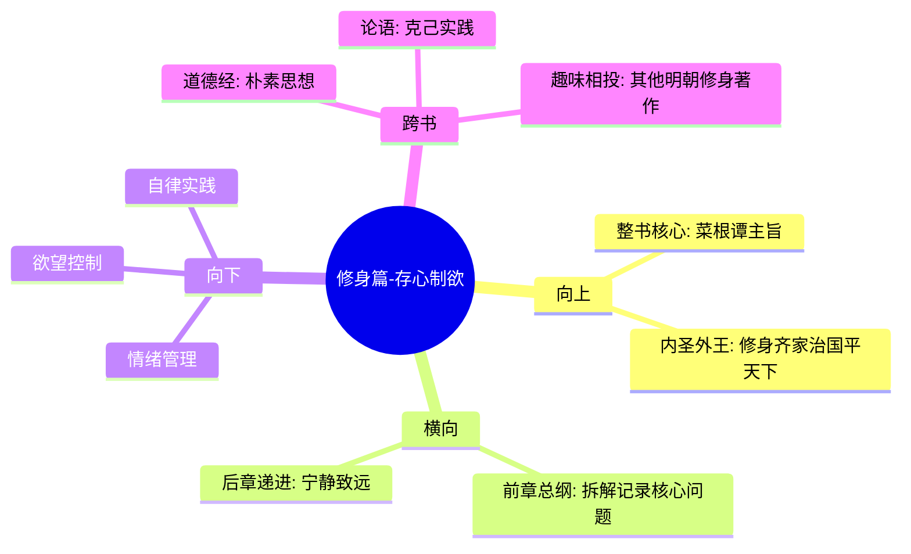

# 第一章 修身篇-存心制欲

## 📍 章节定位

### 全书位置
> 开篇核心章节，确定整本书的精神基调——从自我修养出发，奠定道德根基

- **全书核心问题**: 如何在浮躁的世间保持内心的宁静与品格的操守？
- **本章回答的问题**: 修身的根本在于制欲，存养纯正的心念是立身处世的根本
- **角色类型**: 开篇定位型，奠定整书精神基调
- **论证位置**: 作为整书的第一大主题，是后续所有处世哲学的基础

### 章节序列
| 方向 | 章节标题 | 逻辑连接 |
|------|----------|----------|
| 前章 | [[菜根谭-洪应明-拆解记录]] | 从全书概括到第一主题深入 |
| 后章 | [[第二章-修身篇-宁静致远]] | 从制欲克己到宁静致远的递进 |

### 一句话定位
> 第一章修身篇开篇即点出根本——存心制欲，揭示内心纯净是所有外在修养的基础，奠定了全书"内圣外王"的修养理念框架。

---

## 🎯 核心观点

### 第一层：表层案例
> 章节中的具体格言、戒训、实例

| 格言摘要 | 原文表述 | 核心寓意 |
|----------|----------|----------|
| 心如止水论 | "净从秽出，明从暗生" | 污秽境遇反能成就清净 |
| 制欲格言 | "心体澄澈，常在明镜止水之中" | 内心纯净是修养之本 |
| 修身要诀 | "学者要有胸中气象，又要有身外韵致" | 精神高度与外在修养并重 |
| 觑破机关 | "做人要了心，了心即为勘破生死之境" | 解除内心束缚为关键 |

### 第二层：中层机制
> 制欲与存心的运作机制

| 机制名称 | 组成要素 | 因果链条 | 证据来源 |
|----------|----------|----------|----------|
| 心境转化机制 | 污泥→莲花 | 外境污秽 + 内心纯净 → 品格升华 | 净从秽出格言 |
| 制欲约束机制 | 欲望→节制 | 意志力 + 环境考验 → 品德养成 | 严师益友论证 |
| 宁静致远机制 | 静心→智慧 | 定力 + 内省 → 智慧生发 | 修身养性格言 |

### 第三层：底层规律
> 普遍性的自我修养规律

| 规律陈述 | 抽象层级 | 知识连接 | 适用范围 |
|----------|----------|----------|----------|
| 逆境炼心规律 | 心理成长规律 | [[道德经-老子-拆解记录]]之柔弱胜刚强 | 人格修养 |
| 内外平衡规律 | 精神哲学原理 | [[论语-孔子-拆解记录]]之内圣外王 | 个人成长 |
| 制约相生规律 | 对立统一思维 | [[庄子-庄子-拆解记录]]之相反相成 | 生命智慧 |

---

## 💬 降维翻译

### 观点1: 心如止水，定力生慧

#### 原文表达
> "心体澄澈原从明镜止水中而来，气质昏冥都为宴贪鄙之念所障。"
> —— 说明内心的纯净清澈来源于静中修养，而性格上的昏昧都是因为过度奢贪念头造成的。

#### 降维翻译（中学生能懂）
当我们心里没有杂念干扰的时候，才能看清事物的本质，做出正确的判断。如果我们总是想得到更多好处，心里装满了各种欲望，就会影响我们的判断力和智慧。

#### 日常类比（奶奶能懂）
就像一盆清水，如果你 constantly 搅动，永远看不清底部的东西。但如果让它静下来，就能看清里面的东西。人的心也是这样，要静下来才能想明白事情。

#### 检验
- Q: 如果一个中学生问你什么是"心如止水"？
- A: 就是让心情平静下来，不要总是想着得到这个那好处，这样才能认真思考问题，做对决策。

### 观点2: 修身制欲，品格养成

#### 原文表达
> "做人要了心，了心即为勘破生死之境；做事要开心，开心即为勘破人鬼之关。"
> —— 指出做人要净化内心，净化内心就可以超越生死的困扰；做事要开阔心胸，开阔心胸就可以突破人我关系的阻碍。

#### 降维翻译（中学生能懂）
做人最难的是管住自己的心，如果能把内心的欲望和执着放下，就不会被外界的变化影响情绪；做事要心胸开阔，别计较太多得失，这样才能成大事。

#### 日常类比（奶奶能懂）
做人的窍门是别太在意得失，别老给自己添堵。做事的窍门是眼光放长远一点，别钻牛角尖。

#### 检验
- Q: 如果一个人问怎么做人做事有智慧？
- A: 对自己的欲望要看得淡一点，对别人的得失要看得开一点。

---

## ✨ 金句库

### 原书金句
| 金句 | 页码 | 适用场景 |
|------|------|----------|
| 净从秽出，明从暗生 | 全书各处 | 鼓励教育、困顿解脱 |
| 心体澄澈，常在明镜止水之中 | 全书各处 | 情绪管理、决策建议 |
| 做人要了心，了心即为勘破生死之境 | 全书各处 | 人生哲理、心灵修养 |
| 欲路上事，猛火中砂；人心本定，云雾中月 | 全书各处 | 制欲劝诫 |  
| 闲中不放过，忙处有受用 | 全书各处 | 时间管理、自律培养 |

### 降维金句
| 金句 | 来源观点 | 适用场景 |
|------|----------|----------|
| 污浊的环境反而最能检验品格 | 洪应明思想 | 破产创业圈使用 |
| 越是在困难中，越要看清自己是哪种人 | 修身养性 | 职场逆境时使用 |
| 欲望像火中撒沙，最终留不下什么 | 制欲论 | 戒欲望诱惑 |
| 心静不是逃避，是为了获得真正的智慧 | 宁静致远 | 内心焦虑时使用 |
| 不在无聊时光放纵，困难来时才靠得住 | 闲暇修养 | 学习考试前自我提醒 |

## 🔗 当下映射

### 💰 财富应用
| 场景 | 具体行动 | 预期效果 | 风险提示 |
|------|----------|----------|----------|
| 投资决策 | 面对热门投资项目保持冷静 | 避免冲动作决策 | 可能错过真正的机会 |
| 消费控制 | 购买前问自己是否真的需要 | 戒奢节俭 | 也可能过度节制影响生活品质 |
| 财富观调整 | 把注意力从财富数量转向内心富足 | 获得持久幸福感 | 可能不被主流价值观认同 |

### 💼 职场应用
| 场景 | 具体行动 | 所需能力 | 适用职级 |
|------|----------|----------|----------|
| 职场内卷应对 | 不参与过度竞争，专注于自我提升 | 定力、自制力 | 全职场 |
| 人际关系处理 | 与人为善，但保持适当界限 | 韧性、情绪管理 | 中基层 |
| 决策时刻 | 静心思考后再做评判 | 静定功夫 | 管理者 |

### 🏠 生活应用
| 场景 | 具体行动 | 可行性 | 见效时间 |
|------|----------|--------|----------|
| 情绪管理 | 心烦时暂停反应，静静观察 | 高 | 即刻起效 |
| 学习效率 | 排除干扰，培养专注力 | 高 | 1-2周见成效 |
| 亲子关系 | 用宽容心态对待孩子小毛病 | 高 | 1个月见成效 |

### 72小时行动计划
1. [明天可以做的第一件事]: 在手机上设置一个闹钟，提醒每天早晚安静坐5分钟，观察内心状态
2. [本周内可以尝试的事]: 选择一件平时会冲动消费的物品，遇到时先冷静24小时决定是否购买
3. [需要准备资源才能做的事]: 收集身边人在困境中的优秀品格例子，作为自身修养的参照

---

## 🕸️ 章节关联

### 向上关联 → 整书
- **贡献**: 作为整书开篇第一章，奠定"以修身为基础"的价值观导向
- **位置**: 修身→处世→待人→接物，逻辑链条的第一个环节

### 横向关联 → 章节间
| 章节编号 | 章节标题 | 关联类型 | 连接描述 |
|----------|----------|----------|----------|
| 第二章 | 修身篇-宁静致远 | 递进/铺垫 | 从制欲克己进阶到内心宁静 |
| 第三章 | 处世篇-抱朴守拙 | 承接 | 修身完成后在外在行为上体现 |
| 第四章 | 处世篇-径路让步 | 承接 | 修身养性后的处世策略 |

### 向下关联 → 具体应用
| 应用场景 | 难度 | 前置知识 |
|----------|------|----------|
| 情绪管理实践 | 低 | 需要了解基本心理知识 |
| 欲望管理 | 中 | 需具备一定意志力 |
| 修身规划 | 高 | 需长期践行 |

### 跨书关联 → 知识网络
| 书籍 | 概念 | 关系 | 备注 |
|------|------|------|------|
| [[道德经-老子-拆解记录]] | 见素抱朴 | 继承 | "制欲"思想直接继承老子的朴实观念 |
| [[论语-孔子-拆解记录]] | 克己复礼 | 发展 | 更注重个人内心修养而非社会礼制 |
| [[小窗幽记-陈继儒-拆解记录]] | 格言集修身 | 同类 | 对修身的重视程度一致 |
| [[围炉夜话-王永彬-拆解记录]] | 处世修身 | 呼应 | 共同构成明代修身思想 |

### 关联可视化

---

## ❓ 问答设计

### Q1: [记忆型问题]
**如何理解"净从秽出，明从暗生"？**
**认知层次**: 记忆
**难度**: 低
**答案要点**:
- 字面含义：清澈从污浊中产生，明亮从黑暗中生成
- 深层含义：恶劣环境反而是检验和锻炼品德的试金石
- 实践启示：不应逃避困境，而应将其视为修炼机会

### Q2: [理解型问题]
**为何洪应明认为心体澄澈对处世至关重要？**
**认知层次**: 理解
**难度**: 中
**答案要点**:
- 认知层面：心静才能明辨是非
- 情绪层面：内心平稳不易感情用事
- 行为层面：基于智慧而非欲望做决策

### Q3: [应用型问题]
**结合现代生活，如何运用"闲中不放过，忙处有受用"指导时间管理？**
**认知层次**: 应用
**难度**: 中
**答案要点**:
- 闲时修炼：利用空闲时间提升自己而非娱乐消遣
- 技能储备：掌握的能力在忙碌时发挥作用
- 习惯养成：平时养成的好习惯在压力下维持稳定

### Q4: [分析型问题]
**"了心"与现代心理学中"自我调节"理论有何异同？**
**认知层次**: 分析
**难度**: 高
**答案要点**:
- 相同：都强调内在状态控制的重要性
- 不同："了心"更重视道德伦理维度，心理学侧重技术维度
- 联系：两者都承认内在调节对行为的重要影响

### Q5: [评价型问题]
**有人说存心制欲的观点过于消极，你怎么看？**
**认知层次**: 评价
**难度**: 高
**答案要点**:
- 积极方面：有助于专注和深思
- 消极方面：过度节制可能压抑创造力和动力
- 平衡观点：应在必要制欲和适度放纵之间找平衡

### Q6: [创造型问题]
**基于"心体澄澈"理念，设计一套21天内在修养训练计划**
**认知层次**: 创造
**难度**: 高
**答案要点**:
- 每日静心练习（如冥想、反思）
- 欲望觉察训练（记录每日内心活动）
- 情绪管理技巧（观察而不被情绪左右）

### Q7: [记忆型问题]
**洪应明关于修身的三个重点是什么？**
**认知层次**: 记忆
**难度**: 低
**答案要点**:
- 制欲：控制无理欲望
- 节制：在行为上保持分寸
- 养性：培养良好的品格

### Q8: [理解型问题]
**为何洪应明认为困难环境有益于品格锤炼？**
**认知层次**: 理解
**难度**: 中
**答案要点**:
- 舒适环境难以发现内心弱点
- 挑战激发潜能和韧性
- 实践检验比理论学习更重要

### Q9: [应用型问题]
**当面临重大决策时，如何应用"心体澄澈"原则？**
**认知层次**: 应用
**难度**: 中
**答案要点**:
- 暂停冲动反应
- 冷静分析各种可能性
- 回归初心做决定而不被利益驱动

### Q10: [分析型问题]
**制欲与现代心理学中的延迟满足有何异同？**
**认知层次**: 分析
**难度**: 高
**答案要点**:
- 相似：都强调自我控制的重要性
- 不同：制欲更侧重道德层面，延迟满足更关注心理实验
- 结合：两者都可以提高生活质量

### Q11: [评价型问题]
**"抱朴守拙"的价值观在快速变化的时代还有意义吗？**
**认知层次**: 评价
**难度**: 高
**答案要点**:
- 意义：提供稳定的心理支撑点
- 适应：并非反对学习而是强调基础
- 融合：结合创新与保守找到平衡

### Q12: [创造型问题]
**如何根据"闲中不放过"设计日常技能学习计划？**
**认知层次**: 创造
**难度**: 高
**答案要点**:
- 块时间利用：如通勤时间学习
- 微学习：碎片时间中的点滴积累
- 渐进式：从易到难的系统进阶

### Q13: [记忆型问题]
**什么是"窥破一己个假我，则另觅一个真我"？**
**认知层次**: 记忆
**难度**: 中
**答案要点**:
- 认清自我中虚假部分（如虚荣、偏见）
- 发现真实的内在自我
- 通过反思实现真实的自我发展

### Q14: [应用型问题]
**在社交媒体时代，如何做到"心不随境转"？**
**认知层次**: 应用
**难度**: 高
**答案要点**:
- 设定使用时间限制
- 关注内在感受而非外部认可
- 定期断网实践静心

### Q15: [创造型问题]
**结合AI技术，设计一个"数字化修身训练应用"**
**认知层次**: 创造
**难度**: 高
**答案要点**:
- 冥想引导和监测功能
- 欲望记录和反思系统
- 自律挑战和进步追踪
- 社群互相鼓励机制

---
