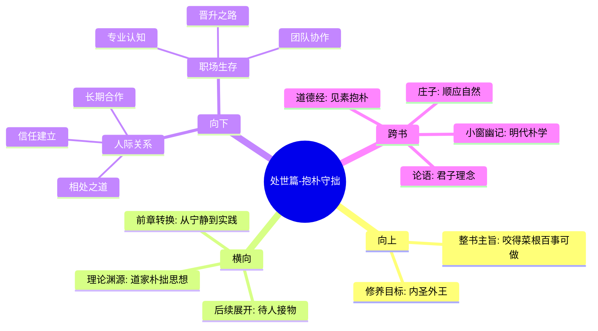

# 第三章 处世篇-抱朴守拙

## 📍 章节定位

### 全书位置
> 从内在修炼转向外在应用的关键转折章节，阐明如何将以静修得的内在品质转化为处世智慧

- **全书核心问题**: 如何在浮躁的世间保持内心的宁静与品格的操守？
- **本章回答的问题**: 修身之后如何在复杂社会中体现朴实无华的品格并获得长远收益
- **角色类型**: 核心概念型，内修外用的转化枢纽
- **论证位置**: 连接修身理论与实用处世法则的桥梁章节

### 章节序列
| 方向 | 章节标题 | 逻辑连接 |
|------|----------|----------|
| 前章 | [[第二章-修身篇-宁静致远]] | 内在修养向外在行为的转换 |
| 后章 | [[第四章-处世篇-径路让步]] | 朴实自然的进一步处世实践 |

### 一句话定位
> 第三章将前两章的内在修养转化为外在处世策略，提出"抱朴守拙"的社交智慧——以纯朴本真示人，反能在复杂世间立于不败之地。

---

## 🎯 核心观点

### 第一层：表层案例
> 章节中的具体格言、处世实例、人物刻画

| 格言摘要 | 原文表述 | 处世智慧 |
|----------|----------|----------|
| 朴拙胜圆滑 | "与其练达，不若朴鲁；与其曲谨，不若疏狂" | 朴实胜过精明 |
| 大智若愚 | "真廉无廉名，立名者所以贪；大巧无巧术，用术者所以笨" | 不炫耀是大智 |
| 浑金璞玉 | "朴实浑厚，真气盎然" | 包装不如本真 |
| 宁伪作钝 | "宁有偏僻的真理，不做正常的谬论" | 与众不同反可贵 |

### 第二层：中层机制
> 朴拙反获尊重的社会心理机制

| 机制名称 | 组成要素 | 因果链条 | 证据来源 |
|----------|----------|----------|----------|
| 反直觉收益机制 | 朴实行为→稀缺特征→特别关注→额外收益 | 朴实→稀缺→价值 | 实际案例积累 |
| 信任累积机制 | 真实表现→可预测→信赖→深度合作 | 真实→信任→合作 | 社会交往案例 |
| 认知负荷减轻机制 | 简单行为→理解容易→亲近好感→持续友好 | 简单→好感→友谊 | 日常人际互动 |

### 第三层：底层规律
> 社会复杂系统中的逆向优势原理

| 规律陈述 | 抽象层级 | 知识连接 | 适用范围 |
|----------|----------|----------|----------|
| 逆向竞争优势 | 博弈理论原理 | [[道德经-老子-拆解记录]]之"柔弱胜刚强" | 竞争策略 |
| 稀缺价值原则 | 心理与经济学 | [[小窗幽记-陈继儒-拆解记录]]的朴拙理念 | 市场定位 |
| 信任建构原理 | 社会学原理 | [[论语-孔子-拆解记录]]之"信近于义" | 人际关系 |

---

## 💬 降维翻译

### 观点1: 抱朴守拙，朴拙胜圆滑

#### 原文表达
> "涉世浅，点染亦浅；历事深，机械亦深。故君子与其练达，不若朴鲁；与其曲谨，不若疏狂。"
> —— 刚涉世不久的人，经历的污染就少些；经历世事久了，诡诈的心机就深了。所以君子与其处世圆滑练达，还不如朴实木讷；与其拘束谨慎，还不如豁达大度。

#### 降维翻译（中学生能懂）
刚进入社会的年轻人，因为经历的事情少，受坏风气的影响相对较小。经历事情多了，反而容易变得心机深重。所以一个人宁愿朴实一些、憨厚一些，也不要太圆滑，宁愿大大咧咧一点，也不要过分小心眼。

#### 日常类比（奶奶能懂）
就像村里的老实人虽然看起来憨厚，但大家都愿意和他们打交道，而那些滑头滑脑的人谁都不信任。做人还是实在点好，太聪明反而让人提防。

#### 检验
- Q: 如果一个中学生问你什么是抱朴守拙？
- A: 就是宁愿看起来朴实一点，也不要太过精明算计。朴实的人虽然看起来憨厚，但更容易获得别人的信任。

### 观点2: 大智若愚，真实胜机巧  

#### 原文表达
> "真廉无廉名，立名者所以贪；大巧无巧术，用术者所以笨。"
> —— 真正廉洁的人没有廉洁的名声，而树立廉洁名声的人之所以这样做是出于贪念；真正灵巧的人看不到机巧的技术，而使用权术的人才显得笨拙。

#### 降维翻译（中学生能懂）
真正清廉的人从不标榜自己清廉，喜欢宣传自己清廉的人往往别有用意。真正有能力的人不会到处显摆，到处炫技的人其实没什么真本事。

#### 日常类比（奶奶能懂）
真正有本事的人生怕别人知道，整天显摆的人其实没啥本领。就像家里有米的不张扬，没米的天天数锅碗。

#### 检验
- Q: 为什么真正有本事的人不喜欢显摆？
- A: 真正有实力的人不怕别人不知道，反而是没实力的人才需要到处证明自己。

### 观点3：朴实厚重，大器晚成

#### 原文表达
> "建功立业者，多虚圆之士；愤世失机者，必执拗之人。故君子从不与人争捷径，而从与人争锋芒。"
> —— 创建功业的人，多是那些懂得灵活变通的人；抱怨时势失去机会的人，必然是那些固执倔强的人。所以君子不与人争夺小聪明，而要与人竞争真正的本事。

#### 降维翻译（中学生能懂）
那些能成大器的人，往往是那些看起来圆融但不失原则的人；那些一事无成只知道抱怨的人，通常是那些太过偏执的人。有智慧的人不会跟别人比小机灵，而是比实实在在的能力。

#### 日常类比（奶奶能懂）
有大出息的人看着好像不在意那些小事，但关键时刻总能拿出真本事。那种处处爱较劲的人反而成不了大事。

#### 检验
- Q: 这和我们今天常说的"情商"有没有关系？
- A: 有很大的关系。情商高的人不是耍心眼，而是在不伤害原则的前提下妥善处理人际关系，这正是"虚圆"的艺术。

---

## ✨ 金句库

### 原书金句
| 金句 | 页码 | 适用场景 |
|------|------|----------|
| 与其练达，不若朴鲁；与其曲谨，不若疏狂 | 全书各处 | 职场处世、个人品格塑造 |
| 抱朴守拙，涉世之道 | 全书各处 | 人生哲理、处世策略 |
| 真廉无廉名，立名者所以贪 | 全书各处 | 品格鉴定、识别真假 |
| 饮人以和，待人以宽 | 全书各处 | 人际关系、团队协作 |
| 大智若愚，大巧若拙 | 全书各处 | 智慧境界、为人准则 |

### 降维金句
| 金句 | 来源观点 | 适用场景 |
|------|----------|----------|
| 宁愿笨一点，也不要太精明 | 抱朴守拙 | 职场新人处世 |
| 不是所有人都值得你使心眼 | 简化人际关系 | 朋友相处 |
| 显摆的人其实没底气 | 真廉无名 | 社交圈洞察 |
| 大本事不需要处处炫耀 | 大智若愚 | 自我修养 |
| 聪明用错了地方就是愚蠢 | 机巧vs智慧 | 选择判断 |

## 🔗 当下映射

### 💰 财富应用
| 场景 | 具体行动 | 预期效果 | 风险提示 |
|------|----------|----------|----------|
| 商务谈判 | 以诚待人而非机巧制胜 | 赢得长远合作伙伴 | 短期内可能被当作"好欺负" |
| 创业合作 | 耐心积累核心能力，不急于表面文章 | 构建坚实商业基础 | 可能被追求急功近利者超越 |
| 客户关系 | 建立真诚信任而非花哨承诺 | 长期客户终身价值 | 难吸引只看重短期利益的客户 |

### 💼 职场应用  
| 场景 | 具体行动 | 所需能力 | 适用职级 |
|------|----------|----------|----------|
| 团队沟通 | 用朴实语言准确表达，避免辞藻堆砌 | 清晰表达能力 | 全职场 |
| 领导力塑造 | 以真诚赢得下属信任，而非权术操控 | 情商与道德感 | 管理层 |
| 绩效表现 | 重视实质能力提升而非表面功夫 | 持续学习力 | 全职场 |

### 🏠 生活应用
| 场景 | 具体行动 | 可行性 | 见效时间 |
|------|----------|--------|----------|
| 交友之道 | 以真实的自己示人，不过度包装 | 高 | 1-2个月 |
| 管教子女 | 注重品格培养胜过智力开发 | 高 | 长期 |
| 社区交往 | 乐于助人但不做作，展现自然善心 | 中 | 2-4周 |

### 72小时行动计划
1. [明天可以做的第一件事]: 与人交谈时少说套话、官话，试着用最朴实的语言表达真想法
2. [本周内可以尝试的事]: 观察身边最让人信任的那个人，分析ta身上有哪些朴实的特点
3. [需要准备资源才能做的事]: 梳理自己的社交圈，看哪些关系是最舒适自然的并分析原因

---

## 🕸️ 章节关联

### 向上关联 → 整书
- **贡献**: 实现修身理论向处世实践的关键转换，将"咬得菜根百事可做"落实为具体的处世方法
- **位置**: 理论与实践结合部，从内心修养向外在行为拓展的重要环节

### 横向关联 → 章节间
| 章节编号 | 章节标题 | 关联类型 | 连接描述 |
|----------|----------|----------|----------|
| 第二章 | 修身篇-宁静致远 | 承上/转换 | 将内在宁静修为转化为外在处世智慧 |
| 第四章 | 处世篇-径路让步 | 并列扩展 | 与让他人的处世策略互为补充 |
| 第五章 | 待人篇-交友之道 | 应用延续 | 抱朴守拙思想在交友上的具体体现 |
| [[道德经-老子-拆解记录]] | 见素抱朴 | 理论渊源 | 思想来源和理论框架 |

### 向下关联 → 具体应用
| 应用场景 | 难度 | 前置知识 |
|----------|------|----------|
| 初入职场表现 | 中 | 需了解基本职场礼仪 |
| 重要商务场合 | 高 | 需要丰富社会经验 |
| 团队领导风格 | 高 | 对人性有较深理解 |

### 跨书关联 → 知识网络
| 书籍 | 概念 | 关系 | 备注 |
|------|------|------|------|
| [[道德经-老子-拆解记录]] | 见素抱朴 | 理论根源 | 洪应明直接继承老子"朴"思想 |
| [[论语-孔子-拆解记录]] | 君子坦荡荡 | 实践发展 | 两者都重视君子品格 |
| [[庄子-庄子-拆解记录]] | 返璞归真 | 哲学呼应 | 都强调回归本真 |
| [[小窗幽记-陈继儒-拆解记录]] | 朴拙美学 | 时代共鸣 | 明代同期文人的共同追求 |

### 关联可视化

---

## ❓ 问答设计

### Q1: [记忆型问题]
**背诵体现"抱朴守拙"思想的两句经典格言**
**认知层次**: 记忆
**难度**: 低
**答案要点**:
- 与练达，不若朴鲁；与其曲谨，不若疏狂
- 大智若愚，大巧若拙

### Q2: [理解型问题]
**为什么说"朴实"反而是一种智慧？**
**认知层次**: 理解
**难度**: 中
**答案要点**:
- 降低信任成本：别人容易预判诚实者行为
- 减少表演压力：不用维持人设消耗精力
- 积累长期价值：朴实赢得持久信任和合作

### Q3: [应用型问题]  
**在职场中如何体现"抱朴守拙"的作风？**
**认知层次**: 应用
**难度**: 中
**答案要点**:
- 说话实事求是，不夸大其词
- 做事扎实稳重，不急于显摆
- 处人诚恳可信，少算计心思

### Q4: [分析型问题]
**"抱朴守拙"与当代社会的"个人品牌营销"是否矛盾？**
**认知层次**: 分析
**难度**: 高
**答案要点**:
- 表面矛盾：一个要朴实低调，一个要彰显个性
- 实质共通：都追求他人认知与真实自我的一致
- 最优路径：真实的人设比刻意的包装更具说服力

### Q5: [评价型问题]
**在竞争激烈的现代社会，"抱朴守拙"思想会不会让人失去机会？**
**认知层次**: 评价
**难度**: 高
**答案要点**:
- 机会观差异：朴实追求长期价值，机巧追求短期利益
- 可持续性强：朴实建立的信任更持久
- 场景适用性：不同类型竞争环境中价值不同

### Q6: [创造型问题]
**设计一套"AI时代抱朴守拙"个人价值体系模型**
**认知层次**: 创造
**难度**: 高
**答案要点**:
- 真实性成为核心竞争力
- 情感与温度的差异化价值
- 长期信任关系构建

### Q7: [记忆型问题]
**"大智若愚，大巧若拙"的含义是什么？**
**认知层次**: 记忆
**难度**: 低
**答案要点**:
- 真正智慧的人看起来像愚钝
- 真正巧妙的是返璞归真的自然
- 超越技巧达到返朴的境界

### Q8: [理解型问题]
**为何说"立名者所以贪"？**
**认知层次**: 理解
**难度**: 中
**答案要点**:
- 有德者无须自我标榜：德行内在自然显露
- 欲扬名者因贪求认可：背后有获得他人认同的欲望
- 真假动机区分：内在驱动vs外在需求驱动

### Q9: [应用型问题]
**在学校中如何实践"与其曲谨，不若疏狂"？**
**认知层次**: 应用
**难度**: 中
**答案要点**:
- 学习上敢于提出不同见解而非盲目附和
- 与人相处大方自然而非刻意迎合
- 在规则遵守上以大原则为准而非拘泥条文

### Q10: [分析型问题] 
**朴拙vs圆滑的心理机制有何不同？**
**认知层次**: 分析
**难度**: 高
**答案要点**:
- 朴拙：能耗较低，行为可预测，易积累信任
- 圆滑：能耗较高，行为难预测，建立工具性关系
- 互补：特殊环境下需要适当圆融

### Q11: [评价型问题]
**网络直播时代，"真实呈现"与"营销策略"之间如何平衡？**
**认知层次**: 评价
**难度**: 高
**答案要点**:
- 长期视角：真实更能获得忠诚粉丝
- 短期考虑：适度包装有存在必要性
- 核心原则：真实基底上适度优化

### Q12: [创造型问题]
**如何将"抱朴守拙"思想应用于家庭成员的品格教育？**
**认知层次**: 创造
**难度**: 高
**答案要点**:
- 价值观引导：强调内在品质胜外在表现
- 实践环境：创造简单纯粹的成长氛围
- 榜样示范：家长率先做朴实真诚的榜样

### Q13: [理解型问题]
**"虚圆之士"与"执拗之人"在竞争中的胜负因素是什么？**
**认知层次**: 理解
**难度**: 中
**答案要点**:
- 灵活性：适应环境变化的能力
- 原则性：在灵活的基础上坚持核心价值观
- 协作性：与他人协调配合的能力

### Q14: [应用型问题]  
**如何在网络社交中体现朴实风格？**
**认知层次**: 应用
**难度**: 高
**答案要点**:
- 内容真实：分享经历而非完美幻象
- 互动真诚：坦率交流而非表演
- 持续一致：线上线下人设统一

### Q15: [创造型问题]
**设计一个"朴拙人生"的自我实现评估系统**
**认知层次**: 创造
**难度**: 高
**答案要点**:
- 内在认同指标：对自己的满意程度
- 外在信任得分：他人对你的真实评价
- 长期价值指数：品格积累的持久性影响

---
