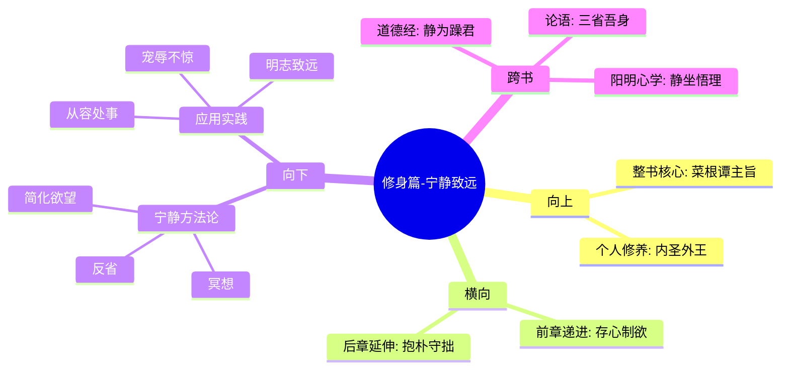

# 第二章 修身篇-宁静致远

## 📍 章节定位

### 全书位置
> 修身篇章的核心章节，深入探讨如何通过保持内心宁静达到人生更高境界的目标

- **全书核心问题**: 如何在浮躁的世间保持内心的宁静与品格的操守？
- **本章回答的问题**: 通过宁静淡泊的心境修养，达到致远的人生目标和精神高度
- **角色类型**: 核心概念型，阐释内在修养的核心机制
- **论证位置**: 从制欲克己递进到宁静致远，是修身理论的深化阶段

### 章节序列
| 方向 | 章节标题 | 逻辑连接 |
|------|----------|----------|
| 前章 | [[第一章-修身篇-存心制欲]] | 从制欲克己到宁静修养的递进关系 |
| 后章 | [[第三章-处世篇-抱朴守拙]] | 由内心修养向处世行为的转化 |

### 一句话定位
> 第二章在制欲基础上进一步阐述修身的根本方法——静心致远，强调只有内心宁静才能获得真正的人生智慧和长远成就。

---

## 🎯 核心观点

### 第一层：表层案例
> 章节中的具体格言、戒训、实例

| 格言摘要 | 原文表述 | 核心寓意 |
|----------|----------|----------|
| 宁静致远论 | "静而后能安，安而后能虑，虑而后能得" | 心静是智慧生成的前提 |
| 澹泊明志说 | "非淡泊无以明志，非宁静无以致远" | 淡泊是志向清晰的条件 |
| 清心寡欲观 | "心如止水，身如磐石，虽风云变幻而不移" | 内在宁静抵御外在变动 |
| 苟能安分语 | "贫得者虽富却贫，知足者虽贫却富" | 知足常乐胜过财富积累 |

### 第二层：中层机制
> 宁静致远的运作机制

| 机制名称 | 组成要素 | 因果链条 | 证据来源 |
|----------|----------|----------|----------|
| 静定生慧机制 | 宁静→安定→思考→收获 | 外境平静 + 内心安宁 → 理性思维 | 静观格言 |
| 澹泊养志机制 | 淡泊外物→志向清晰→目标专一→事半功倍 | 外欲减少 + 精神专注 → 成就提升 | 明志典故 |
| 心境修养机制 | 内观反省→心态调节→行为优化→品德提升 | 反思 + 修正 → 成长 | 自律格言 |

### 第三层：底层规律
> 普遍性的修养与成长规律

| 规律陈述 | 抽象层级 | 知识连接 | 适用范围 |
|----------|----------|----------|----------|
| 心境主导规律 | 心理学与哲学原理 | [[道德经-老子-拆解记录]]之"静为躁君" | 精神修养 |
| 简约高效规律 | 效率原则 | [[论语-孔子-拆解记录]]之一贯原则 | 工作生活 |
| 内外平衡规律 | 系统思维 | [[庄子-庄子-拆解记录]]之内在自足 | 成长发展 |

---

## 💬 降维翻译

### 观点1: 静以修身，俭以养德

#### 原文表达
> "静以修身，俭以养德。非淡泊无以明志，非宁静无以致远。"
> —— 通过宁静来修养身心，通过节俭来培养品德。不恬淡寡欲就无法使志向明确，不宁静安稳就无法实现远大目标。

#### 降维翻译（中学生能懂）
内心平静才能把事情想清楚，生活简朴才能养成好的品行。如果总是想着各种欲望，就不会知道真正想要什么；如果心里总是躁动不安，就做不成任何重要的事。

#### 日常类比（奶奶能懂）
就像种地一样，土地要先平整干净，种子撒下去才能长得好。人心也是一样，先把各种杂念去掉，专心做一件事才能做好。

#### 检验
- Q: 如果一个中学生问你什么叫"宁静致远"？
- A: 就是先把心里的杂七杂八想法放一边，让自己静下心来，专注做一件事才能做成大事情。

### 观点2: 静观时变，泰然处之

#### 原文表达
> "宠辱不惊，闲看庭前花开花落；去留无意，漫随天外云卷云舒。"
> —— 置身荣辱之外，闲看庭院内花儿的盛开凋落；对仕途去留毫不在意，悠然自在地看着天上云彩聚散变化。

#### 降维翻译（中学生能懂）
不要因为受到表扬或批评就特别激动，要用淡定的态度看周围发生的一切变化。对外界的升职加薪等得失都保持平和心态。

#### 日常类比（奶奶能懂）
就像天气好坏不影响你吃饭睡觉一样，工作上的高低起伏也不应该影响你的内心。看开一点，世界照转。

#### 检验
- Q: 如何理解这种"宠辱不惊"的态度？
- A: 就是把得失看得很淡，该做什么还做什么，不受外界变化的影响。

### 观点3: 知足常乐，适可而止

#### 原文表达
> "藜口苋肠者，多冰清玉洁；衮衣玉食者，甘婢膝奴颜。盖志以淡泊明，而节从肥甘丧也。"
> —— 能够粗茶淡饭的人，往往多有如冰清玉洁般的高雅品格；衣着华丽食品丰美的人，往往易于卑躬屈膝献媚于人。这是因为志向从淡泊中得到显现，而节操则在享用丰美中丧失。

#### 降维翻译（中学生能懂）
能够满足于粗茶淡饭的人，通常品格更高尚；而贪图华丽衣服美食的人，往往会丢失尊严去讨好别人。因为人只有不贪求才容易明白自己真正想要什么，过于享受反而会丧失骨气。

#### 日常类比（奶奶能懂）
就像有的人喝白开水就觉得很甜，有的人一定要喝各种饮料零食才舒服。其实越简单，越容易得到满足和快乐，也就越容易坚持正道。

#### 检验
- Q: 这和我们现代社会追求幸福有什么关系？
- A: 真正的幸福不一定来自物质的丰富，有时候简单的欲望反而带来更大的满足感和尊严。

---

## ✨ 金句库

### 原书金句
| 金句 | 页码 | 适用场景 |
|------|------|----------|
| 宁静致远 | 全书各处 | 心灵修养、学业规划 |
| 宠辱不惊，看庭前花开花落 | 全书各处 | 情绪管理、压力疏导 |
| 非淡泊无以明志，非宁静无以致远 | 全书各处 | 志向确立、目标制定 |
| 君子之心事，天青日白；君子之才华，玉韫珠藏 | 全书各处 | 做人准则、职场应用 |
| 知足者仙境，不知足者凡境 | 全书各处 | 价值观修正 |

### 降维金句
| 金句 | 来源观点 | 适用场景 |
|------|----------|----------|
| 内心平静是智慧的土壤 | 宁静致远 | 学习考试前心理调节 |
| 别因为别人夸你两句就上天 | 宠辱不惊 | 职场得失应对 |
| 想要做大事，得先把心静下来 | 宁静生慧 | 重大决策前调整状态 |
| 知道自己要什么比什么都想得到更重要 | 明志 | 人生规划指导 |
| 越简单的生活给人内心越丰富的感觉 | 澹泊明智 | 消费观改造 |

## 🔗 当下映射

### 💰 财富应用
| 场景 | 具体行动 | 预期效果 | 风险提示 |
|------|----------|----------|----------|
| 消费升级陷阱 | 每次购物前列清单，区分需与想要 | 降低冲动消费，提升生活质量 | 可能短期内抑制消费需求 |
| 投资焦虑应对 | 专注自己的投资规划，不受市场情绪影响 | 做出更理性的投资判断 | 可能错过短期上涨机会 |
| 物质vs精神需求平衡 | 定期审视欲望，优先满足精神需求 | 获得长期可持续的幸福 | 可能被人误解为缺乏进取心 |

### 💼 职场应用
| 场景 | 具体行动 | 所需能力 | 适用职级 |
|------|----------|----------|----------|
| 职场浮沉应对 | 保持内心稳定，专注于能控制的因素 | 情绪调节能力 | 全职场 |
| 同事比较心理缓解 | 将焦点从他人转向自身的成长 | 自我认知能力 | 全职场 |
| 绩效管理 | 重视过程中的修炼而非结果本身 | 内驱力建设 | 管理层级 |

### 🏠 生活应用
| 场景 | 具体行动 | 可行性 | 见效时间 |
|------|----------|--------|----------|
| 焦虑情绪管理 | 每天设置"安静时段"反思内心 | 高 | 1-2周 |
| 睡眠质量改善 | 睡前冥想10分钟 | 高 | 1周开始见效 |
| 子女教育理念 | 不攀比孩子的成绩，关注品格塑造 | 中 | 2个月开始见成效 |

### 72小时行动计划
1. [明天可以做的第一件事]: 设定每天早晨起床后的5分钟静心时间，观察内心的状态
2. [本周内可以尝试的事]: 每天晚上列出当天的三个简单感恩之处，培养知足常乐的心态
3. [需要准备资源才能做的事]: 找一个安静的地方建立自己的"宁静角落"，用于反思和静心

---

## 🕸️ 章节关联

### 向上关联 → 整书
- **贡献**: 完善修身篇章理论体系，从制欲进阶到静心致远的境界追求
- **位置**: 是"修身齐家治国平天下"的初始阶段，是向外发展的根基

### 横向关联 → 章节间
| 章节编号 | 章节标题 | 关联类型 | 连接描述 |
|----------|----------|----------|----------|
| 第一章 | 修身篇-存心制欲 | 承接/发展 | 从制欲克己到宁静致远的递进关系 |
| 第三章 | 处世篇-抱朴守拙 | 铺垫 | 内在宁静的外在体现 |
| 第四章 | 处世篇-径路让步 | 铺垫 | 宁静之人心境自然谦让 |
| 第五章 | 待人篇-交友之道 | 远程连接 | 静者自省后知交友之道 |

### 向下关联 → 具体应用
| 应用场景 | 难度 | 前置知识 |
|----------|------|----------|
| 静坐冥想修炼 | 中 | 需要掌握基本的呼吸法 |
| 压力情境应对 | 高 | 要有制欲的基础功夫 |
| 重要决策制定 | 高 | 需结合处世智慧综合判断 |

### 跨书关联 → 知识网络
| 书籍 | 概念 | 关系 | 备注 |
|------|------|------|------|
| [[道德经-老子-拆解记录]] | 清净无为 | 理论源头 | 本章思想直接受老子"静为躁君"启发 |
| [[论语-孔子-拆解记录]] | 克己复礼 | 实践互补 | 孔子更重社会行为，这里更重心性修炼 |
| [[传习录-王阳明-拆解记录]] | 静坐体悟 | 方法呼应 | 两家都强调静中求理的方法 |
| [[围炉夜话-王永彬-拆解记录]] | 内心修养 | 同类呼应 | 明代同题材作品 |

### 关联可视化

---

## ❓ 问答设计

### Q1: [记忆型问题]
**背诵"非淡泊无以明志，非宁静无以致远"这句话的原句及出处？**
**认知层次**: 记忆
**难度**: 低
**答案要点**:
- 原句：非淡泊无以明志，非宁静无以致远  
- 出处：《菜根谭》，源自诸葛亮《诫子书》
- 网状知识：体现传统道德修养的核心理念

### Q2: [理解型问题]
**为何宁静能生智慧？请从心理学角度解释。**
**认知层次**: 理解
**难度**: 中
**答案要点**:
- 注意力分散：喧嚣环境中注意力会被各种刺激打断
- 认知负荷：过多的信息输入增加大脑负担
- 专注效应：安静状态下专注力更强，思考更深

### Q3: [应用型问题]
**当工作中被负面评价打击时，如何运用'宠辱不惊'的智慧？**
**认知层次**: 应用
**难度**: 中
**答案要点**:
- 暂时抽离：先从情绪中走出来观察整个情况
- 理性分析：评价的事实与主观成分
- 专注于自己可以控制的部分

### Q4: [分析型问题]
**对比西方正念冥想与传统的宁静修养有何异同？**
**认知层次**: 分析
**难度**: 高
**答案要点**:
- 相同点：都强调专注和内心平静
- 不同点：东方重道德修行，西方重身心健康
- 结合点：方法可借鉴，目标需调整

### Q5: [评价型问题]
**在追求成功的现代社会，宁静致远思想是否有消极避世之嫌？**
**认知层次**: 评价
**难度**: 高
**答案要点**:
- 消极面：可能错失机遇
- 积极面：提供内在稳定，避免浮躁冒进
- 平衡观：静与动结合，内省与进取并重

### Q6: [创造型问题]
**如何结合现代科技创建适合年轻人的"'宁静致远'生活模式"？**
**认知层次**: 创造  
**难度**: 高
**答案要点**:
- 短时静心App：提供5-10分钟的冥想引导
- 数字极简：定时关闭社交媒体
- 环境营造：音乐、照明配合静心

### Q7: [记忆型问题]
**请列举洪应明关于'宁静'的相关格言三条**
**认知层次**: 记忆
**难度**: 低
**答案要点**:
- 宁静致远
- 静以修身
- 宠辱不惊，看庭前花开花落

### Q8: [理解型问题]
**如何理解'知足者仙境，不知足者凡境'？**
**认知层次**: 理解
**难度**: 中
**答案要点**:
- 心态决定幸福：满足感源于内心而非外物
- 欲望循环：不满足会不断寻求新的满足点
- 境界差别：满足者的内心状态更接近理想

### Q9: [应用型问题]
**怎样在快节奏的现代生活中保持内心的安静与定力？**
**认知层次**: 应用
**难度**: 中
**答案要点**:
- 设置边界：规定特定时间处理信息
- 小块安静时间：利用碎片时间静心
- 简化生活：减少不必要的选择和诱惑

### Q10: [分析型问题]
**从脑科学角度分析'宁静致远'的生理基础是什么？**
**认知层次**: 分析
**难度**: 高
**答案要点**:
- 前额叶功能：宁静下前额叶控制力增强
- 压力激素：静心减少皮质醇等激素
- 神经可塑性：持续宁静改变大脑神经连接

### Q11: [评价型问题]
**'静中求理'相比'实践中求理'有何优势和局限？**
**认知层次**: 评价
**难度**: 高
**答案要点**:
- 优势：系统性强，深入思考
- 局限：可能脱离实际，缺乏灵活性
- 结合：静思与实践相结合效果最佳

### Q12: [创造型问题]
**为青少年设计一套"'宁静致远'入门训练包"包含哪些模块？**
**认知层次**: 创造
**难度**: 高
**答案要点**:
- 呼吸调节：简单的呼吸放松法
- 目标聚焦：练习单一任务专注
- 内心对话：日记记录内心变化
- 自然静心：接触大自然活动

### Q13: [理解型问题]
**如何解释'静'不仅是物理上的安静更是心理上的宁静？**
**认知层次**: 理解
**难度**: 中
**答案要点**:
- 外静内动：物理安静，内心却波涛汹涌
- 内静外动：内心宁静，外表活跃亦可
- 心理调节：重点在心态而非环境

### Q14: [应用型问题]
**如何将'宁静致远'应用在家庭关系中处理矛盾？**
**认知层次**: 应用
**难度**: 高
**答案要点**:
- 冷静回应：不立即反击，先理解对方情绪
- 深度沟通：选择合适时机理性交流
- 期望管理：不期待立竿见影的效果

### Q15: [创造型问题]
**结合当下AI时代特点，如何重述'宁静致远'的价值？**
**认知层次**: 创造
**难度**: 高
**答案要点**:
- 人机区分：只有人才能体验内在宁静
- 价值锚点：在变化中保持不变的核心竞争力
- 创新基础：宁静思维是原创创意的土壤

---
