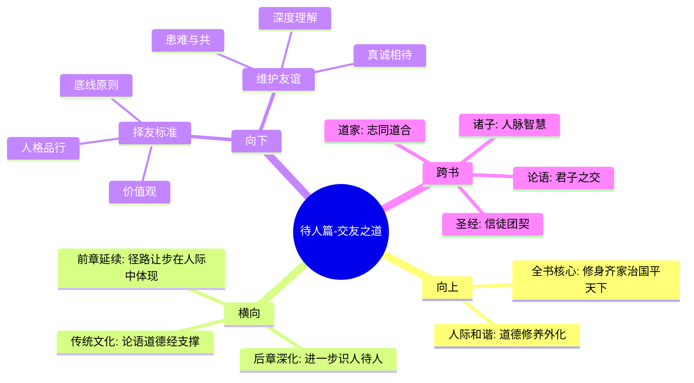

# 第五章 待人篇-交友之道

## 📍 章节定位

### 全书位置  
> 进入具体人际关系领域的指导性章节，阐明择友、处友、助友的系统智慧

- **全书核心问题**: 如何在浮躁的世间保持内心的宁静与品格的操守？
- **本章回答的问题**: 如何结交真正的朋友、识别真朋友与伪君子、维护健康的人际关系
- **角色类型**: 核心概念型，人际关系理论与实践的综合阐述
- **论证位置**: 从个体修养向社会关系的深入扩展，是人际和谐的重要支柱

### 章节序列
| 方向 | 章节标题 | 逻辑连接 |
|------|----------|----------|
| 前章 | [[第四章-处世篇-径路让步]] | 从处世原则落实到具体人脉关系处理 |
| 后章 | [[第六章-待人篇-心迹才略]] | 从交友之道深入到识人待人的更深层次 |

### 一句话定位
> 第五章专门论述"交友"这一重要人生课题，主张"交友须带三分侠气，做人要存一点素心"，强调友情需要真诚与正义感双重保障。

---

## 🎯 核心观点

### 第一层：表层案例
> 章节中的具体格言、朋友类型划分、择友标准

| 格言摘要 | 原文表述 | 交友智慧 |
|----------|----------|----------|
| 交友侠气论 | "交友须带三分侠气，做人要存一点素心" | 真诚与正义并重 |
| 患难识友篇 | "疾风知劲草，烈火验真金" | 经验考验真友情 |
| 君子小人辨 | "君子以小人之心度之，小人以君子之心待之" | 慧眼识人 |  
| 穷通看志节 | "穷当益工，老当益壮，志节可见" | 逆境见真心 |

### 第二层：中层机制
> 友谊建立与维持的互动机制

| 机制名称 | 组成要素 | 因果链条 | 证据来源 |
|----------|----------|----------|----------|
| 诚信积累机制 | 真诚交往→信任建立→深入友谊→长久关系 | 真→信→情→久 | 长期实践验证 |
| 侠义共鸣机制 | 正义感→价值观一致→互相扶持→牢固友情 | 义→同→扶→牢 | 历史典故 |
| 患难筛选机制 | 危机考验→真假朋友区分→去除虚伪→强化真情 | 考→辨→除→强 | 现实观察 |

### 第三层：底层规律
> 人际连接与社会支持的基本原理

| 规律陈述 | 抽象层级 | 知识连接 | 适用范围 |
|----------|----------|----------|----------|
| 价值匹配定律 | 社会心理学原理 | [[论语-孔子-拆解记录]]之"道不同不相为谋" | 人际交往 |
| 投资回报原理 | 社会经济原则 | [[小窗幽记-陈继儒-拆解记录]]的交往心得 | 关系维护 |
| 互补效应规律 | 行为学原理 | [[庄子-庄子-拆解记录]]之相互辅助理念 | 团队协作 |

---

## 💬 降维翻译

### 观点1: 交友须带三分侠气

#### 原文表达
> "交友须带三分侠气，做人要存一点素心。"
> —— 结交朋友需要带有几分义气和公正，做人要保存一颗纯洁朴素的心。

#### 降维翻译（中学生能懂）
交朋友要讲义气，有正能量，对朋友要公平公正；做人要单纯一些，不要把什么都算得太清楚，保持一颗纯真的心。

#### 日常类比（奶奶能懂）
好的朋友就像村里的热心人，谁家有难处都会帮忙，不会算计来算计去。做人也要这样实在一点，真心待人。

#### 检验
- Q: 如果一个中学生问什么叫"三分侠气"？
- A: 就是指要有正义感和勇气，见到不公平的事敢发声，朋友有困难肯帮忙。

### 观点2: 患难见真情

#### 原文表达
> "疾风知劲草，烈火验真金。"
> —— 只有在强劲的风中才能识别坚韧的草，在炽热的火中才能检验出真正的黄金。

#### 降维翻译（中学生能懂）
真正的朋友只有在你遇到困难的时候才看得出来。就像刮大风才能看出哪棵草最坚强，用火烧才能分辨出真正的金子。

#### 日常类比（奶奶能懂）
一个人好不好，要在他倒霉时候才看得出来的。平时在一起吃吃喝喝不算什么，关键时候看他帮不帮你才行。

#### 检验
- Q: 什么样的朋友才算真朋友？
- A: 就是在你最困难的时候，他还愿意留在你身边帮助你的那种人。

### 观点3: 交游以礼

#### 原文表达
> "把握不定者，因事而废；心志不强者，因人而废；情理不明者，因境而废。"
> —— 决断力不够的人，会被事情拖累；意志不坚定的人，会被他人影响；不能明辨情理的人，会被环境束缚。

#### 降维翻译（中学生能懂）
交朋友要看这个人有没有主见、意志坚定与否、能不能明辨是非。这三点不好的人很难成为好朋友。

#### 日常类比（奶奶能懂）
要交那种遇事不慌、有主见、能分是非的人做朋友。那些三心二意、人云亦云的人交不得。

#### 检验
- Q: 择友最重要看什么品质？
- A: 主要是看人家的品格怎么样，有没有原则和坚持，是不是正派。

---

## ✨ 金句库

### 原书金句
| 金句 | 页码 | 适用场景 |
|------|------|----------|
| 交友须带三分侠气，做人要存一点素心 | 全书各处 | 择友标准、人格塑造 |
| 疾风知劲草，烈火验真金 | 全书各处 | 患难识友情 |
| 近朱者赤，近墨者黑 | 全书各处 | 人际选择、环境影响 |
| 君子之交淡如水 | 全书各处 | 友谊本质、关系哲学 |
| 贫居闹市无人问，富在深山有远亲 | 全书各处 | 社会现实、人性透视 |

### 降维金句
| 金句 | 来源观点 | 适用场景 |
|------|----------|----------|
| 真朋友会在你落魄时拉你一把 | 患难真情 | 心理危机时鼓励自己 |
| 朋友不是用来算账的，是用来交心的 | 情谊观 | 友谊商业化反思 |
| 交朋友要看平常如何对待陌生人 | 识人术 | 择友鉴识 |
| 没有原则的人交不得 | 人格标准 | 友谊边界设定 |
| 义气的朋友比利益的朋友可靠 | 价值观交友 | 友谊品质判断 |

## 🔗 当下映射

### 💰 财富应用
| 场景 | 具体行动 | 预期效果 | 风险提示 |
|------|----------|----------|----------|
| 合伙创业 | 优先寻找价值观一致的朋友合作 | 提高合作稳定性 | 情感影响理智决策 |
| 商业圈子 | 不只建立利益关系，培养真心朋友 | 获得非功利性支持 | 可能耽误商业利益最大化 |
| 投融资社交 | 在非盈利场合真诚交往 | 发现更好的项目和伙伴 | 相遇真朋友的概率较低 |

### 💼 职场应用
| 场景 | 具体行动 | 所需能力 | 适用职级 |
|------|----------|----------|----------|
| 职场伙伴关系建设 | 保持原则立场，不盲从上级同事 | 独立判断能力 | 全职场 |
| 团队协作 | 对待同事以诚相待，但原则不变 | 人际交往技能 | 全职场 |
| 面临职场变故 | 依靠真正的职场友谊度过难关 | 心理韧性和社交资本 | 全职场 |

### 🏠 生活应用
| 场景 | 具体行动 | 可行性 | 见效时间 |
|------|----------|--------|----------|
| 社区邻里关系 | 真诚交往不图回报 | 中 | 2-3个月后 |
| 家庭朋友圈建设 | 不仅维系血缘关系，拓展情感朋友圈 | 高 | 长期积累见成效 |
| 危机支持网络 | 平时真心交往，困难时获得帮助 | 高 | 需要有危机时才显现 |

### 72小时行动计划
1. [明天可以做的第一件事]: 整理通讯录，圈出真正的朋友，给他们发一条简单关心的信息
2. [本周内可以尝试的事]: 在一周内主动帮助一次朋友解决一个小问题，不求任何回报  
3. [需要准备资源才能做的事]: 建立自己的"朋友圈子"标准，明确什么才是真正朋友的判定准则

---

## 🕸️ 章节关联

### 向上关联 → 整书
- **贡献**: 将处世哲学细化到具体人脉关系处理，体现"内外和谐"的人生追求
- **位置**: 从个人修养到社会关系的纽带环节，是"安身立命"的重要组成部分

### 横向关联 → 章节间
| 章节编号 | 章节标题 | 关联类型 | 连接描述 |
|----------|----------|----------|----------|
| 第四章 | 处世篇-径路让步 | 延续应用 | 将让步智慧运用到朋友关系中 |
| 第六章 | 待人篇-心迹才略 | 深化扩展 | 进一步深入识人待人的技能 |
| 第三章 | 处世篇-抱朴守拙 | 品格支撑 | 交朋友也要看对方是否朴实守拙 |
| [[论语-孔子-拆解记录]] | 与朋友交不信乎 | 建议来源 | 双重印证了诚信交友的重要性 |

### 向下关联 → 具体应用
| 应用场景 | 难度 | 前置知识 |
|----------|------|----------|
| 危机中求助真心友 | 低 | 需提前建立好友谊 |
| 择偶伴侣选择 | 高 | 需要丰富的阅人经验 |
| 商业伙伴挑选 | 高 | 需具备商业识人能力 |

### 跨书关联 → 知识网络
| 书籍 | 概念 | 关系 | 备注 |
|------|------|------|------|
| [[论语-孔子-拆解记录]] | 有朋自远方来不亦乐乎 | 传统基础 | 孔子的交友观点 |
| [[道德经-老子-拆解记录]] | 善者不辩 | 品格鉴定 | 帮助识人 |
| [[孟子-孟子-拆解记录]] | 天时不如地利，地利不如人和 | 社会支撑 | 强调人际关系重要性 |
| [[围炉夜话-王永彬-拆解记录]] | 友之交，信而守恒 | 同期呼应 | 明清文人交友观一致 |

### 关联可视化

---

## ❓ 问答设计

### Q1: [记忆型问题]
**背诵"交友须带三分侠气，做人要存一点素心"全文及其基本含义**
**认知层次**: 记忆
**难度**: 低  
**答案要点**:
- 原文：交友须带三分侠气，做人要存一点素心
- 基本含义：结交朋友需有正义感，待人需怀纯真之心
- 核心思想：友情需要侠气与素心双重保障

### Q2: [理解型问题]
**为什么说患难中才能检验真友情？**
**认知层次**: 理解
**难度**: 中
**答案要点**:
- 利益考量：平时交往往往掺杂利益因素
- 成本检验：困难中帮助朋友需付出实际代价  
- 情感触碰：逆境更能激发真实情感
- 持久测试：长期困难更能显示持久友情

### Q3: [应用型问题]
**如何在社交媒体平台上筛选真正的朋友？**
**认知层次**: 应用
**难度**: 中
**答案要点**:
- 观察一致性：线上与线下表现相符
- 真诚程度：不只点赞评论，看是否真情交流
- 互助测试：遇困难时是否真正关心帮助
- 价值判断：朋友的价值观与自己相近程度

### Q4: [分析型问题]
**对比古今交友观有何异同？**
**认知层次**: 分析
**难度**: 高
**答案要点**:
- 相同点：都看重品格、忠诚、互助
- 不同点：古代更重义气，现代更重三观相符
- 媒介差异：古代面对面，现代线上线下结合
- 影响因素：古代社会相对稳定，现代变化较快

### Q5: [评价型问题]
**在利益至上的商业社会中，还有"纯友谊"的存在空间吗？**
**认知层次**: 评价
**难度**: 高
**答案要点**:
- 现实挑战：功利性关系挤压纯友谊空间
- 深层需要：人类对纯情谊的需求永恒不变
- 实现路径：需要主体自觉超越功利考量
- 长期价值：纯友谊反而在商业社会更加珍贵

### Q6: [创造型问题]
**构建一个现代人的"友谊质量评估体系"框架**
**认知层次**: 创造
**难度**: 高
**答案要点**:
- 价值观契合度：三观一致程度
- 支持可靠性：困难中可靠度
- 交往真诚度：表里一致性 
- 心灵开放度：深度交流水平

### Q7: [记忆型问题]
**说出两个古人对于交友的格言**
**认知层次**: 记忆
**难度**: 低
**答案要点**:
- 疾风知劲草，烈火验真金
- 君子之交淡如水

### Q8: [理解型问题]
**为什么说"交游以礼"很重要？**
**认知层次**: 理解  
**难度**: 中
**答案要点**:
- 界定关系：礼貌确立交往边界
- 互尊基础：礼让建立相互尊重
- 长久基石：有礼交往更易持久
- 品格体现：通过礼节看出交往态度

### Q9: [应用型问题]
**大学生如何在室友关系中体现交友智慧？**
**认知层次**: 应用
**难度**: 中
**答案要点**:
- 尊重隐私：不在背后谈论室友的隐私
- 按劳分配：公共资源使用要公平
- 危险互助：室友需要帮助时主动伸出援手
- 真诚交流：有矛盾及时沟通，不恶意隐瞒

### Q10: [分析型问题]
**"道不同不相为谋"与"求同存异"在交友问题上如何平衡？**
**认知层次**: 分析
**难度**: 高
**答案要点**:
- 核心原则：大原则上一致，小细节可包容
- 层次分化：在核心价值观上求同，在偏好上存异
- 互动调节：通过良好交流增进理解
- 择友标准：核心价值观一致性优先

### Q11: [评价型问题]
**朋友的朋友可不可以轻易信任？**
**认知层次**: 评价
**难度**: 高
**答案要点**:
- 基础信任理论：有朋友推荐，可给予部分信任
- 渐进入原则：从浅交往逐步加深了解
- 谨慎观察：看其是否对朋友真实
- 人格评估：独立考察新朋友品格

### Q12: [创造型问题]
**设计一个"友谊危机预警系统"包含哪些指标？**
**认知层次**: 创造
**难度**: 高
**答案要点**:
- 交往频率降低：联系次数减少
- 亲密程度下降：不再分享私密问题
- 应答速度延长：回复消息变得更慢
- 语气变化：交谈语气变得公式化

### Q13: [理解型问题]
**为什么真朋友"可遇而不可求"？**
**认知层次**: 理解
**难度**: 中
**答案要点**:
- 机缘巧合：相遇需要合适的时机地点
- 互相了解：深度了解需要长期磨合  
- 价值观一致：需要多方面匹配
- 感情投入：需要双方都珍视这份友谊

### Q14: [应用型问题]
**中年人如何平衡"维持老友"与"结交新友"？**
**认知层次**: 应用
**难度**: 高
**答案要点**:
- 时间分配：合理安排维护老友情感投入
- 价值观筛选：依据成熟价值观结交新友
- 交叉融合：适当安排新老朋友见面
- 优先原则：老友为根基，新友促发展

### Q15: [创造型问题]
**构建一个现代"择友算法"应该考虑哪些变量？**
**认知层次**: 创造
**难度**: 高
**答案要点**:
- 价值观权重：核心价值观的一致性
- 情感稳定度：情绪管理和处理冲突能力
- 个人成长性：对自我完善的积极性
- 社交兼容性：社交需求和方式的匹配

---
