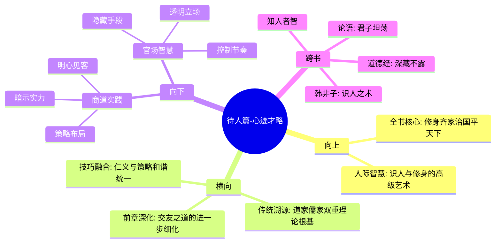

# 第六章 待人篇-心迹才略

## 📍 章节定位

### 全书位置  
> 深度解剖人际交往中最重要的识人察心技能，是整个待人篇章的核心精髓

- **全书核心问题**: 如何在浮躁的世间保持内心的宁静与品格的操守？
- **本章回答的问题**: 如何洞察人心、识别真正的心性品格以及合理展示自身才华
- **角色类型**: 核心概念型，人际智慧的高级阶段
- **论证位置**: 识人待人的综合体现，是"咬得菜根百事可做"的重要支撑技能

### 章节序列
| 方向 | 章节标题 | 逻辑连接 |
|------|----------|----------|
| 前章 | [[第五章-待人篇-交友之道]] | 从择友标准深化到识人细节 |
| 下章 | - | 本篇结束，向下与接物篇衔接 |

### 一句话定位
> 第六章系统阐述"识人艺术"与"修身智慧"，强调君子之心需如"天青日白"般透明，而才华如"玉韫珠藏"般深藏，这体现了东方识人处世的顶级智慧。

---

## 🎯 核心观点

### 第一层：表层案例
> 章节中的具体格言、人物描绘、识人案例

| 格言摘要 | 原文表述 | 识人心法 |
|----------|----------|----------|
| 心如天青日白 | "君子之心事，天青日白，不可使人不知" | 内心光明磊落 |
| 才华玉韫珠藏 | "君子之才华，玉韫珠藏，不可使人易知" | 外示不露才华 |
| 识人术举要 | "势利纷华，不近者洁，近之而不染者尤洁" | 拒绝功利诱惑 |
| 心迹难辨说 | "智识机巧，不知者高，知之而不用者为尤高" | 掌握而不行使 |

### 第二层：中层机制
> 识人察心与修身韬晦的运作机制

| 机制名称 | 组成要素 | 因果链条 | 证据来源 |
|----------|----------|----------|----------|
| 内外反差机制 | 心透明 + 才深藏 | 外表谦逊 + 内心坦荡 → 高度可信 | 实践观察 |
| 韬晦保护机制 | 才华外示风险→深藏保护→安全运用→适时体现 | 观察→保护→运用→展现 | 历史经验 |
| 识人判断机制 | 行为观察→心理剖析→品性归因→价值判断 | 表→心→性→判 | 经验积累 |

### 第三层：底层规律
> 人际关系中信息流动与权力动态的基本原理

| 规律陈述 | 抽象层级 | 知识连接 | 适用范围 |
|----------|----------|----------|----------|
| 透明吸引定律 | 社会心理学原理 | [[论语-孔子-拆解记录]]之"君子坦荡荡" | 人际交往 |
| 才华保护原理 | 安全博弈理论 | [[道德经-老子-拆解记录]]之"不争之德" | 自我保护 |
| 识人智慧规律 | 认知复杂性原理 | [[庄子-庄子-拆解记录]]之"知人者智，自知者明" | 社会互动 |

---

## 💬 降维翻译

### 观点1: 君子之心，天青日白

#### 原文表达
> "君子之心事，天青日白，不可使人不知；君子之才华，玉韫珠藏，不可使人易知。"
> —— 君子的思想行为应当像青天白日一样光明磊落，没有什么可让人怀疑的阴暗；而君子的才情和能力则应当像珍贵的珠宝一样深藏不露，不要轻易地向人炫耀。

#### 降维翻译（中学生能懂）
真正的君子在做人方面要光明磊落，让别人都能够了解你的内心想法，不会觉得你心机很深；但是在能力方面则要懂得收藏，不要轻易展示自己的全部实力和技巧。

#### 日常类比（奶奶能懂）
做人要像蓝天白云一样干净透明，大家都能看见，不会有坏想法。但是你的手艺或者能耐要藏起来，不要到处显摆，用的时候再拿出来。

#### 检验
- Q: 如果一个中学生问什么叫"心地光明"？
- A: 就是你的想法和目的都很正当，别人看了也不会害怕或者防备你。

### 观点2: 玉韫珠藏，才华深藏

#### 原文表达
> "玉韫珠藏，不可使人易知。"
> —— 珍贵的玉石和珍珠需要妥善保管起来，不让人们轻易知道它们的存在。

#### 降维翻译（中学生能懂）
好的才能和本领要像宝贝一样收起来，不能随便给人看。因为一旦被别人完全掌握你的实力，就失去了主动权。

#### 日常类比（奶奶能懂）
就像你有个绝活，要藏在心里，不能让所有人都知道你有多厉害。关键时刻再露一手，人家才会佩服你。

#### 检验
- Q: 为什么不能轻易展示自己的才华？
- A: 因为显示出来就没什么新鲜的了，而且可能会引起别人的嫉妒或者竞争。

### 观点3: 识人察心之术

#### 原文表达
> "势利纷华，不近者为洁，近之而不染者为尤洁。"
> —— 面对势利纷华的功名利禄，不靠近的人是洁身自好的，但靠近了却不受污染的人则更加纯洁。

#### 降维翻译（中学生能懂）
在面对金钱、权力这些诱惑时，不去接近确实是保持纯真的好办法，但如果必须身临其境却能不被影响沾染，这才是最难能可贵的了。

#### 日常类比（奶奶能懂）
就好比集市上卖好东西的人，离它远的确实是干净的，但就在摊子旁边卖，却不被那些假货坏货影响，这才是真有本事的。

#### 检验
- Q: 这和我们现在常说的"出淤泥而不染"是什么意思？
- A: 都是说能够在不太好的环境下保持好自己的品格品德。

---

## ✨ 金句库

### 原书金句
| 金句 | 页码 | 适用场景 |
|------|------|----------|
| 君子之心事，天青日白，不可使人不知 | 全书各处 | 个人品格、人际信誉 |
| 君子之才华，玉韫珠藏，不可使人易知 | 全书各处 | 才华展示、职场策略 |
| 势利纷华，不近者洁，近之而不染者尤洁 | 全书各处 | 诱惑抵抗、品格检验 |
| 知机其神乎，不知机其不神乎 | 全书各处 | 时机把握、识人判断 |
| 智巧有机，不知者高，知而不用者尤高 | 全书各处 | 智慧运用、策略选择 |

### 降维金句
| 金句 | 来源观点 | 适用场景 |
|------|----------|----------|
| 做人要透明，但实力要保留 | 天青日白+玉韫珠藏 | 职场生存 |
| 可以让别人看出你的心思，但不要让人摸清你的底线 | 识人心术 | 人际交往 |
| 真正的高手不是炫耀实力，而是掌控实力的展现时间 | 玉韫珠藏 | 竞争策略 |
| 接触诱惑但不染尘埃，比躲避诱惑更有难度 | 抗诱惑论 | 自律哲学 |
| 知道有很多手段但不用，比不知道更高级 | 智慧克制 | 战略思维 |

## 🔗 当下映射

### 💰 财富应用
| 场景 | 具体行动 | 预期效果 | 风险提示 |
|------|----------|----------|----------|
| 商业合作 | 对方可见的商业能力展示充足，核心技术秘而不宣 | 建立合作信任同时保留核心技术 | 可能让合作伙伴觉得有所保留，影响深度合作 |
| 投资理财 | 财务状况对家人充分透明，投资策略根据关系远近区别对待 | 避免家庭财务风险，但关键策略不外泄 | 家人可能觉得被排除重要决策外 |
| 业务拓展 | 对潜在客户展示专业能力，但不透露商业敏感信息 | 吸引客户合作信任，同时保护商业机密 | 部分客户可能会认为不够开放而失去合作机会 |

### 💼 职场应用
| 场景 | 具体行动 | 所需能力 | 适用职级 |
|------|----------|----------|----------|
| 上下级关系 | 与上司/下属建立公开透明的信任关系，但保持适当的专业边界 | 沟通技巧+边界感 | 全职场 |
| 竞争态势 | 展示足够的竞争力但隐藏全部能力底牌 | 策略思维+表现控制 | 管理层 |
| 项目推进 | 开放项目目标和进展，保留解决问题的具体方法技巧 | 项目管理+保密意识 | 全职场 |

### 🏠 生活应用
| 场景 | 具体行动 | 可行性 | 见效时间 |
|------|----------|--------|----------|
| 夫妻关系 | 内心真实想法充分沟通，保留个人成长空间 | 中 | 需要长期培育信任 |
| 子女教育 | 生活品格做榜样让孩子看到，培养孩子含蓄谦逊品格 | 高 | 长期教育见成效 |
| 朋友界限 | 建立透明真诚友谊，但保留个人隐私界限 | 高 | 短期即可调节 |

### 72小时行动计划
1. [明天可以做的第一件事]: 列出自己朋友圈名单，按关系亲密程度分级处理信息分享
2. [本周内可以尝试的事]: 练习在职场/学校项目中既要展现能力又要保留核心技巧
3. [需要准备资源才能做的事]: 创建个人能力档案，在不同的关系中采用差异化展现策略

---

## 🕸️ 章节关联

### 向上关联 → 整书
- **贡献**: 完成待人篇章的最高层次阐述，是对"咬得菜根百事可做"中心思想的重要支撑
- **位置**: 是"修身齐家"向"治国平天下"过渡的重要环节，是人际关系智慧的顶峰

### 横向关联 → 章节间
| 章节编号 | 章节标题 | 关联类型 | 连接描述 |
|----------|----------|----------|----------|
| 第五章 | 待人篇-交友之道 | 深化衔接 | 从选择朋友到识别人心的深度技能 |
| 第三章 | 处世篇-抱朴守拙 | 品格支撑 | 朴拙理念在识人技艺中的具体体现 |
| [[道德经-老子-拆解记录]] | 深藏若虚 | 理论渊源 | 玉韫珠藏与不争之德呼应 |
| [[论语-孔子-拆解记录]] | 君子坦荡荡 | 理念贯通 | 心如天青日白的儒家理念 |

### 向下关联 → 具体应用
| 应用场景 | 难度 | 前置知识 |
|----------|------|----------|
| 高级商务洽谈 | 高 | 需要丰富的识人实战经验 |
| 政治联盟构建 | 高 | 需熟悉多方势力博弈 |
| 职场权力平衡 | 中 | 需具备人际敏锐度 |

### 跨书关联 → 知识网络
| 书籍 | 概念 | 关系 | 备注 |
|------|------|------|------|
| [[道德经-老子-拆解记录]] | 大智若愚、深藏若虚 | 哲学源泉 | 提供心迹才略的哲学基础 |
| [[论语-孔子-拆解记录]] | 君子坦荡荡 | 人格体现 | 心迹透明思想的儒家表达 |
| [[韩非子-韩非-拆解记录]] | 术势论 | 技术补足 | 洪应明识人之术的先秦借鉴 |
| [[庄子-庄子-拆解记录]] | 知人者智，自知者明 | 哲学深化 | 自知知人的认知境界 |

### 关联可视化

---

## ❓ 问答设计

### Q1: [记忆型问题]
**完整的句子"君子之心事，天青日白，不可使人不知；君子之才华，玉韫珠藏，不可使人易知"是什么意思？**
**认知层次**: 记忆
**难度**: 低  
**答案要点**:
- 上段：君子的思想行为要光明磊落，不能让人猜疑
- 下段：君子的才华要深藏不露，不让轻易了解
- 完整内涵：内外兼修的心迹才略原则

### Q2: [理解型问题]
**为什么强调心迹透明的同时又要求才略深藏？**
**认知层次**: 理解
**难度**: 中
**答案要点**:
- 降低防心：内心透明减少他人戒备
- 保持神秘：才略深藏增加价值和主动权
- 互补效应：二者结合既有信任又有威慑
- 安全平衡：公开动机隐藏实力的智慧

### Q3: [应用型问题]
**在职场面试中如何体现心迹才略的艺术？**
**认知层次**: 应用
**难度**: 中
**答案要点**:
- 心迹透明：积极表态价值观和岗位适配度
- 才略适度：展示足够的能力但保留核心竞争力
- 真诚态度：展现人格魅力和真诚意图
- 适度神秘：让对方感知你还有更多潜力

### Q4: [分析型问题]
**对比西方"360度考核"和东方"心迹才略"的差异？**
**认知层次**: 分析
**难度**: 高
**答案要点**:
- 透明度：西方倡导全方位透明，东方主张选择性开放
- 权力观：西方追求民主平等，东方讲究权力均衡
- 评价机制：西方重视全方位反馈，东方偏向深度理解
- 实施目标：西方重改进，东方重管控

### Q5: [评价型问题]
**在大数据时代，"心迹透明，才略深藏"还有意义吗？**
**认知层次**: 评价
**难度**: 高
**答案要点**:
- 趋势冲突：大数据追求完全透明vs东方保留底线
- 实践价值：信息过载下选择性透明更有价值
- 转化形式：从物理藏匿到选择性展示
- 永恒要素：人格透明度在任何时代都重要

### Q6: [创造型问题]
**设计一个现代职场的"心迹才略"应用模型**
**认知层次**: 创造
**难度**: 高
**答案要点**:
- 档案系统：建立分层信息管理档案
- 展示策略：设计多层次的能力展现计划  
- 识别技术：开发识人能力评估体系
- 防御机制：保护隐私与展现透明的平衡算法

### Q7: [记忆型问题]
**背诵"势利纷华，不近者洁，近之而不染者为尤洁"的意思**
**认知层次**: 记忆
**难度**: 低
**答案要点**:
- 字意：面对功名利禄的诱惑
- 低等境界：远离不沾染是保洁身
- 高等境界：身处其中不染是至洁  
- 比较：身处其间的洁身更难能可贵

### Q8: [理解型问题]
**什么叫"不知者高，知之而不用者为尤高"？**
**认知层次**: 理解  
**难度**: 中
**答案要点**:
- 第一境界：完全不懂机巧
- 第二境界：知道机巧但不去使用
- 评价：后者更加难能可贵
- 原理：克制比无知更需要智慧

### Q9: [应用型问题]
**在社交媒体时代如何在公开性与隐私保护之间平衡？**
**认知层次**: 应用
**难度**: 中
**答案要点**:
- 心迹透明：适当表达真诚的想法和态度
- 才略保留：不公开关键技术/方法/资源
- 分层策略：对不同人群展现不同信息
- 动态调整：根据关系进展调整公开范围

### Q10: [分析型问题]
**"心迹才略"如何在现代企业的企业文化构建中体现？**
**认知层次**: 分析
**难度**: 高
**答案要点**:
- 价值观透明：企业文化和使命愿景明确
- 运营机密：核心技术与商业模式保护
- 组织关系：上下级沟通透明但权限分层
- 竞争策略：公开市场定位但保留策略细节

### Q11: [评价型问题]
**在现代教育体系中推广"心迹才略"是否存在矛盾？**
**认知层次**: 评价
**难度**: 高
**答案要点**:
- 表层冲突：现代教育鼓励展现表达vs东方内敛
- 深层一致：培养内在品格vs展示外表能力
- 平衡路径：品格公开，技能适度
- 审美价值：含蓄之美仍有意义

### Q12: [创造型问题]
**如何将"心迹才略"的理念制作成企业管理培训课程？**
**认知层次**: 创造
**难度**: 高
**答案要点**:
- 案例模块：心迹透明和才略深藏的实际案例
- 技能训练：在不同情境下选择性展示的技巧
- 评估体系：评测学员心迹才略水平
- 实践环节：在真实职场环境中应用该智慧

### Q13: [理解型问题]
**心如天青日白和韬光养晦之间是否矛盾？**
**认知层次**: 理解
**难度**: 中
**答案要点**:
- 不矛盾：一个是关于动机的透明，一个是关于能力的保留
- 对立统一：动机和能力是两个不同层面的事物
- 互补关系：透明动机让对方安心，保留才能掌控局势
- 操作要义：让人心安但不让人看穿底牌

### Q14: [应用型问题]
**夫妻关系中如何体现"心迹才略"的艺术？**
**认知层次**: 应用
**难度**: 高
**答案要点**:
- 心迹透明：对婚姻忠诚度、价值观、人生目标等保持公开
- 才略适度：保留一些个人隐私空间和成长可能性
- 程度把握：核心问题透明，次要问题可保留
- 动态调整：根据婚姻发展的不同阶段调整透明度

### Q15: [创造型问题]
**构建一个人际关系中的"信息层级管理"工具，包含哪些要素？**
**认知层次**: 创造
**难度**: 高
**答案要点**:
- 层级设定：亲人、挚友、一般友人、陌生人等分层
- 内容分类：品格类、能力类、生活类、隐私类等分类  
- 公开程度：不同层级对应不同信息公开度
- 动态调整：根据关系进展实时调整信息开放策略

---
