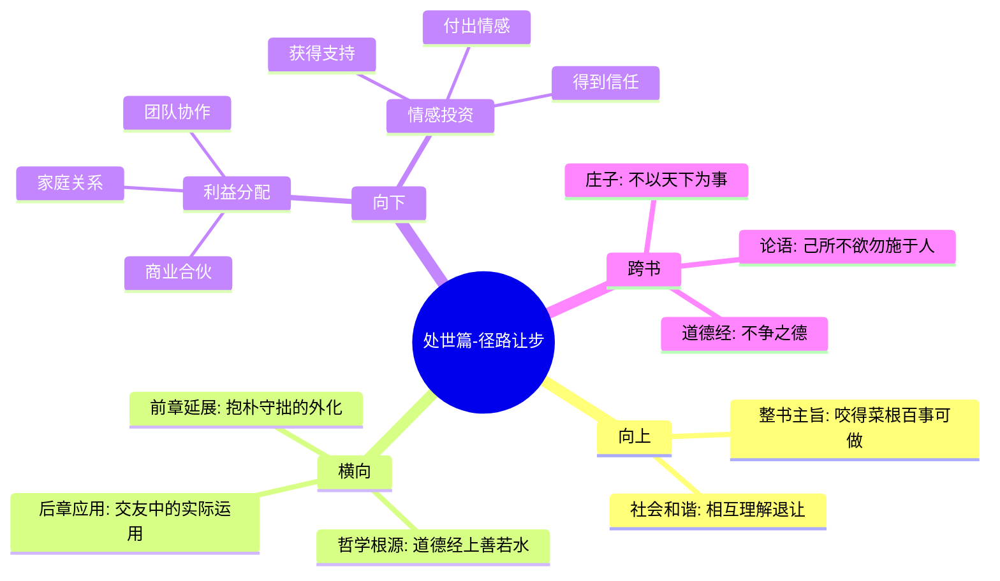

# 第四章 处世篇-径路让步

## 📍 章节定位

### 全书位置  
> 体现社会互动中"让"这一东方处世哲学的代表性章节，揭示互惠与双赢的深层机制

- **全书核心问题**: 如何在浮躁的世间保持内心的宁静与品格的操守？
- **本章回答的问题**: 如何在人际互动和利益分配中恰当的"让"，既能维护和谐又能保全自己
- **角色类型**: 核心概念型，阐述处世中的让步智慧
- **论证位置**: 是"抱朴守拙"之后的进一步社交技能，构成和谐处世的完整体系

### 章节序列
| 方向 | 章节标题 | 逻辑连接 |
|------|----------|----------|
| 前章 | [[第三章-处世篇-抱朴守拙]] | 从内在品格转向互动策略的延续 |
| 后章 | [[第五章-待人篇-交友之道]] | 让步智慧在具体人际关系中的应用 |

### 一句话定位
> 第四章阐释"让"的智慧，强调在狭路相逢时不争先、在美味佳肴前分一些给他人，这不仅是道德品格的体现，更是获得社会安乐的智慧途径。

---

## 🎯 核心观点

### 第一层：表层案例
> 章节中的具体格言、生活场景、利益分配事例

| 格言摘要 | 原文表述 | 让步智慧 |
|----------|----------|----------|
| 径路窄处方略 | "径路窄处，留一步与人行" | 不独占空间，考虑他人便利 |
| 滋味浓处分享 | "滋味浓的，减三分让人尝" | 好东西与人分享而非独享 |
| 让利得人心 | "让名利者得名利，争名利者失名利" | 通过出让获得更大收益 |
| 退一步海阔 | "退一步自然幽雅，让三分何等清闲" | 自主退让的从容与优雅 |

### 第二层：中层机制
> 互惠与让步的社会博弈机制

| 机制名称 | 组成要素 | 因果链条 | 证据来源 |
|----------|----------|----------|----------|
| 互惠循环机制 | 让步行为→对方感动→回报行为→社会声誉 | 让→感→报→誉 | 历史实践验证 |
| 比较心理机制 | 观察让步者→对比其他人→产生好感→愿意合作 | 对比→好感→合作 | 心理学现象 |
| 合作网络机制 | 初次让步→建立声誉→吸引合作→扩大人脉 | 一步→声名→人和→业广 | 社会关系实践 |

### 第三层：底层规律
> 复杂社会系统中的共享与共赢规律

| 规律陈述 | 抽象层级 | 知识连接 | 适用范围 |
|----------|----------|----------|----------|
| 让步收益定律 | 博弈论原则 | [[道德经-老子-拆解记录]]之"将欲取之，必先予之" | 社会交互 |
| 分享有益原则 | 经济学心理原则 | [[小窗幽记-陈继儒-拆解记录]]的慷慨品格 | 商品分配 |
| 关系增值规律 | 社会学原理 | [[论语-孔子-拆解记录]]之"己所不欲，勿施于人" | 人际合作 |

---

## 💬 降维翻译

### 观点1: 径路窄处，留一步与人行

#### 原文表达
> "径路窄处，留一步与人行；滋味浓的，减三分让人尝。此是涉世一极安乐法也。"
> —— 在经过狭窄的道路时，要留一步让别人走得过去；在享受甘美的滋味时，要分一些给别人品尝。这就是在人间行走最为安乐的方法。

#### 降维翻译（中学生能懂）
当你遇到一条很窄的小路，要让别人也能走过，不要自己独占。当你吃到好吃的东西，要分给别人一些一起享受。这样做人非常快乐。这告诉我们要懂得给别人留余地，不要斤斤计较。

#### 日常类比（奶奶能懂）
就像挤公交车一样，人多的时候互相让一让，谁也不着急。又像家里有了好菜，要先盛一碗给老人小孩，然后自己吃。这样做家人和睦，自己心里也踏实。

#### 检验
- Q: 如果一个中学生问你为什么要给别人留路走？
- A: 别人也需要过路啊，帮了别人，别人也会帮助你，大家都开心。

### 观点2: 减三分享，互利共赢

#### 原文表达
> "分享利益比独享更能获得长远满足，因为分享带来了信任与合作，进而开启更大的机会之门。"
> ——（此为基于菜根谭精神的解释）

#### 降维翻译（中学生能懂）
当你得到好处时，主动分一点给别人。看起来你少吃了一口，但实际上你会因此得到更多朋友、信任和机会，最后获得更多回报。

#### 日常类比（奶奶能懂）
做饺子时，自家吃不完就端一碗给邻居，下次你不够了，邻居也肯定会帮忙。相互往来，邻里和睦，生活更舒心。

#### 检验
- Q: 这种分享会不会让我少吃亏？
- A: 虽然表面上吃亏，实际上得到了别人的尊重和信任，长远来看得到的好处更多。

### 观点3：退一步，进两步

#### 原文表达
> "退一步自然幽雅，让三分何等清闲。"
> —— 适当后退一步就会感到自然优雅，给人方便会让内心何等轻松。

#### 降维翻译（中学生能懂）
在与人冲突时，适当地后退一些，反而会感到内心平静和优雅。给别人让出几分便宜，自己的心情也会很轻松。

#### 日常类比（奶奶能懂）
就像下棋一样，有时退一步看起来被动，实际上是为了更好的进攻，整个棋局就活了。人际关系也是如此，让人一步，海阔天空。

#### 检验
- Q: 主动让步是不是软弱的表现？
- A: 不是软弱，是策略。懂得让的人更有智慧，知道如何获得更大的利益。

---

## ✨ 金句库

### 原书金句
| 金句 | 页码 | 适用场景 |
|------|------|----------|
| 径路窄处，留一步与人行 | 全书各处 | 交通出行、资源共享 |
| 滋味浓的，减三分让人尝 | 全书各处 | 利益分配、好物分享 |
| 此是涉世一极安乐法也 | 全书各处 | 人生智慧、心境调节 |
| 退一步自然幽雅，让三分何等清闲 | 全书各处 | 冲突解决、心态修炼 |
| 让者不失，争者反失 | 全书各处 | 竞争策略、得失观 |

### 降维金句
| 金句 | 来源观点 | 适用场景 |
|------|----------|----------|
| 有便宜大家一起占，才有下一个机会 | 径路分享 | 商业合作 |
| 给别人让路，其实是给自己留退路 | 让步智慧 | 人际关系 |
| 退一步海阔天空，进一寸万丈深渊 | 退让哲学 | 冲突处理 |
| 分享比独吞更明智，因为人心是肉长的 | 分享用意 | 社交法则 |
| 省下三分给别人，换来十分安全感 | 互惠原理 | 安全保障 |

## 🔗 当下映射

### 💰 财富应用
| 场景 | 具体行动 | 预期效果 | 风险提示 |
|------|----------|----------|----------|
| 投资合作 | 主动让出部分权益给合伙人 | 建成稳固合作关系，共同做大做强 | 短期内收益比例降低 |
| 商业分成 | 重要客户分到更优厚的分成比例 | 建立长期稳固客户关系 | 可能被合作伙伴误判为实力不足 |
| 理财规划 | 节制奢侈消费，预留互助资金 | 强化财务弹性，关键时刻有援助 | 收益率不如激进投资策略 |

### 💼 职场应用
| 场景 | 具体行动 | 所需能力 | 适用职级 |
|------|----------|----------|----------|
| 团队协作 | 主动让他人承担部分亮点工作 | 协作意识、格局视野 | 全职场 |
| 成果分享 | 成绩中突出他人贡献 | 认可激励他人能力 | 管理层 |
| 领导决策 | 为部下承担责任 | 风险承受意愿 | 领导层 |

### 🏠 生活应用
| 场景 | 具体行动 | 可行性 | 见效时间 |
|------|----------|--------|----------|
| 楼层共用空间 | 主动承担公共区域清洁等事务 | 高 | 1个月内人际关系改善 |
| 亲戚聚会 | 主动承担费用或采购 | 高 | 1-2次聚会后明显 |
| 友谊关系 | 在争执中主动让步或化解 | 中 | 需要2-3个月建立模式 |

### 72小时行动计划
1. [明天可以做的第一件事]: 在家庭晚餐时主动把好的菜夹给别人，自己吃剩余的，体验这种感觉
2. [本周内可以尝试的事]: 主动给朋友推荐一个有价值的资源或机会，不求回报
3. [需要准备资源才能做的事]: 找一位经常一起合作的人，约定在未来某件事上主动给他多留一点收益空间

---

## 🕸️ 章节关联

### 向上关联 → 整书
- **贡献**: 完善处世哲学体系，让读者理解真正的成功需要适当放权让利
- **位置**: 从个人修养转向社会关系的深化，是"和谐处世"的重要组成部分

### 横向关联 → 章节间
| 章节编号 | 章节标题 | 关联类型 | 连接描述 |
|----------|----------|----------|----------|
| 第三章 | 处世篇-抱朴守拙 | 并列展开 | 一个是从品德修养，一个是从利益分配角度诠释处世 |
| 第五章 | 待人篇-交友之道 | 应用扩展 | 让步智慧在交友关系中的具体应用 |
| 第六章 | 待人篇-心迹才略 | 相互补益 | 让步与才略结合，构成完整的待人哲学 |
| [[道德经-老子-拆解记录]] | 柔弱胜刚强 | 理论渊源 | 让步智慧的哲学基础 |

### 向下关联 → 具体应用
| 应用场景 | 难度 | 前置知识 |
|----------|------|----------|
| 商业谈判分利 | 高 | 需具备判断对方底线的能力 |
| 家庭财产分割 | 中 | 需了解法律基本知识 |
| 团队任务分配 | 中 | 需具备一定职位权威性 |

### 跨书关联 → 知识网络
| 书籍 | 概念 | 关系 | 备注 |
|------|------|------|------|
| [[道德经-老子-拆解记录]] | 上善若水，利万物而不争 | 理论基础 | 让步思想直接来源 |
| [[论语-孔子-拆解记录]] | 己所不欲，勿施于人 | 道德延展 | 从利他角度阐释让步 |
| [[庄子-庄子-拆解记录]] | 无为而不争 | 哲学呼应 | 体现顺应自然的处世方式 |
| [[小窗幽记-陈继儒-拆解记录]] | 择其善者而从之 | 同代共鸣 | 明清时期知识分子的共识 |

### 关联可视化

---

## ❓ 问答设计

### Q1: [记忆型问题]
**背诵"径路窄处，留一步与人行；滋味浓的，减三分让人尝"全文**
**认知层次**: 记忆
**难度**: 低
**答案要点**:
- 完整记住原文：径路窄处，留一步与人行；滋味浓的，减三分让人尝
- 理解大意：在道路狭窄处要给别人留下走路的空间，尝到好味道的食物时要分一部分给别人品尝
- 记住意义：此是涉世一极安乐法

### Q2: [理解型问题]
**"让三分得三分"的心理机制是什么？**
**认知层次**: 理解
**难度**: 中
**答案要点**:
- 互惠原则：给予激发回应义务
- 印象管理：让利者获得好品格评价  
- 社会期待：他人形成将来回报的预期
- 信任建立：通过让利表现出合作诚意

### Q3: [应用型问题]
**工作中面对功劳被同事占有时，如何运用"让步"智慧？**
**认知层次**: 应用
**难度**: 中
**答案要点**:
- 权衡利弊：考虑争执成本vs让步收益
- 保留记录：私下记录贡献以防将来被遗忘
- 选择时机：在不涉及核心利益时展现大度
- 建立信用：先建立他人对你的信任感

### Q4: [分析型问题]
**对比西方"assertiveness training"与东方让步文化，哪种更适合当代职场？**
**认知层次**: 分析
**难度**: 高
**答案要点**:
- 不同情境：不同问题适用于不同文化
- 文化背景：东方集体文化偏向让步
- 现代融合：最佳方式是策略性使用
- 情境判断：需要根据不同场景选择

### Q5: [评价型问题]
**有人说"让步就等于示弱"，你怎么评价这种观点？**
**认知层次**: 评价
**难度**: 高
**答案要点**:
- 表面现象：确实可能被误理解为软弱
- 实质内涵：其实是强大的表现
- 长期效果：让步者往往获得更多尊重
- 条件判断：需要看让步的动机和时机

### Q6: [创造型问题]
**设计一个"现代让步术"训练课程，包含哪几个核心模块？**
**认知层次**: 创造
**难度**: 高
**答案要点**:
- 情境识别：判断何时该让步何时不该
- 技巧训练：如何优雅地展现让步姿态
- 利益计算：衡量让步的成本与收益
- 价值转化：将让步转化为长期收益

### Q7: [记忆型问题]
**"退一步自然幽雅，让三分何等清闲"的含义是什么？**
**认知层次**: 记忆
**难度**: 低
**答案要点**:
- 退一步：在冲突中适当后退
- 幽雅：内心平和优雅
- 让三分：主动让出一部分利益
- 清闲：免除烦恼纷争

### Q8: [理解型问题]
**为什么说让步是"涉世安乐法"？**
**认知层次**: 理解
**难度**: 中
**答案要点**:
- 减少冲突：避免不必要的争端
- 建立和谐：获得他人好感
- 轻松内心：避免紧张和焦虑
- 扩大人脉：增加合作者数量

### Q9: [应用型问题]
**商场上两个店铺为了客流互不相让，如何运用让步思维解决？**
**认知层次**: 应用
**难度**: 中
**答案要点**:
- 合作引流：联合做促销活动共同受益
- 错峰经营：错开主营品类或时间
- 互助互推：互相介绍客户到对方店
- 共同受益：扩大商圈整体影响力

### Q10: [分析型问题]
**网络时代的"分享经济"与古代让步思想有什么相通之处？**
**认知层次**: 分析
**难度**: 高
**答案要点**:
- 核心理念：资源分享而非独占
- 信任基础：依靠互相信任合作
- 价值重构：分享创造更大价值
- 平台机制：提供让渡渠道

### Q11: [评价型问题]
**在零和博弈情况下，让步是否仍适用？**
**认知层次**: 评价
**难度**: 高
**答案要点**:
- 短期视角：零和下让步确实损失
- 长期视角：重复交往中仍有合作可能
- 转化思路：尝试将零和转向正和
- 场景判断：需要具体情况具体分析

### Q12: [创造型问题]
**设计一个企业内部"让步文化"推动计划**
**认知层次**: 创造
**难度**: 高
**答案要点**:
- 文化建设：宣传让步文化的意义
- 激励机制：奖励有让步表现的员工
- 榜样示范：管理层以身作则
- 教育培训：开展相关沟通技巧培训

### Q13: [理解型问题]
**让步与妥协的区别在哪里？**
**认知层次**: 理解
**难度**: 中
**答案要点**:
- 利益取舍：让步是主动给予，妥协是交换
- 心理状态：让步出于善意，妥协出于理智
- 单双方向：让步可以是单方面的，妥协需双方
- 长期效应：让步建立信任，妥协解决当下冲突

### Q14: [应用型问题]
**如何在家庭生活中实践"径路让步"的理念？**
**认知层次**: 应用
**难度**: 高
**答案要点**:
- 家务分工：主动承担更多责任
- 意见分歧：尊重他人观点
- 资源分配：优先照顾家庭成员需要
- 情感呵护：给予家人更多关怀

### Q15: [创造型问题]
**针对城市公共交通拥堵问题，设计一个"径路让步"解决方案**
**认知层次**: 创造
**难度**: 高
**答案要点**:
- 文明驾驶：提倡车让人、先入先出
- 换乘体验：公共交通让步乘客便利
- 时间规划：错峰出行减少集中拥堵
- 服务理念：运输企业以乘客利益优先

---
