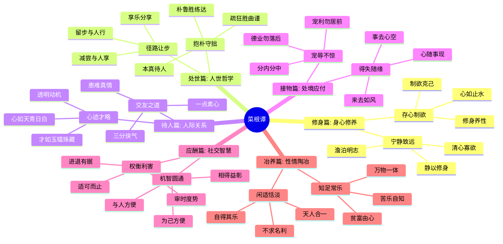
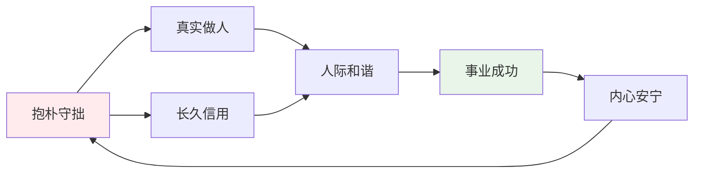

# 《菜根谭》- 章节导航

> 作者: 洪应明
> 总章节: 6大主题（约362则格言）
> 最后更新: 2026-02-27
> 关联书籍: 道德经、论语、庄子、小窗幽记、围炉夜话

---

## 📚 章节结构（Mermaid Mindmap）

---

## 🔗 核心概念关联图

---

| 章节 | 标题 | 状态 | 完成日期 | 核心收获 |
|------|------|------|----------|----------|

---

## 🚀 快速跳转

### 按主题跳转
- [[第一章-修身篇-存心制欲]]
- [[第二章-修身篇-宁静致远]]
- [[第三章-处世篇-抱朴守拙]]
- [[第四章-处世篇-径路让步]]
- [[第五章-待人篇-交友之道]]
- [[第六章-待人篇-心迹才略]]
- [[第七章-接物篇-宠辱不惊]]
- [[第八章-接物篇-得失随缘]]
- [[第九章-应酬篇-机智圆通]]
- [[第十章-应酬篇-权衡利害]]
- [[第十一章-冶养篇-闲适恬淡]]
- [[第十二章-冶养篇-知足常乐]]

### 相关资源
- [[菜根谭-洪应明]] - 主拆解笔记
- [[东方智慧系列]] - 相关知识卡片
- [[道德经-老子]] - 关联书籍
- [[论语-孔子]] - 关联书籍
- [[小窗幽记-陈继儒]] - 同类书籍
- [[围炉夜话-王永彬]] - 同类书籍
