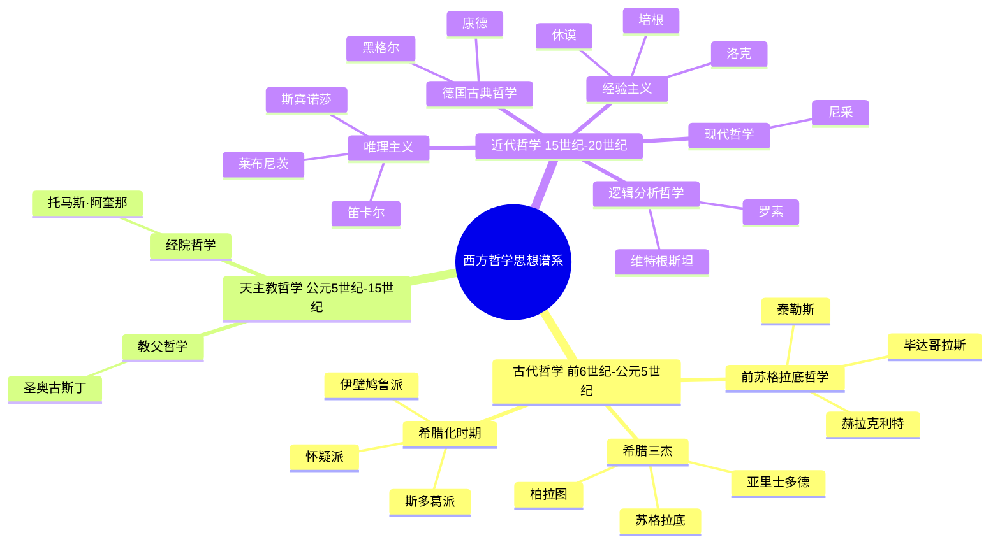
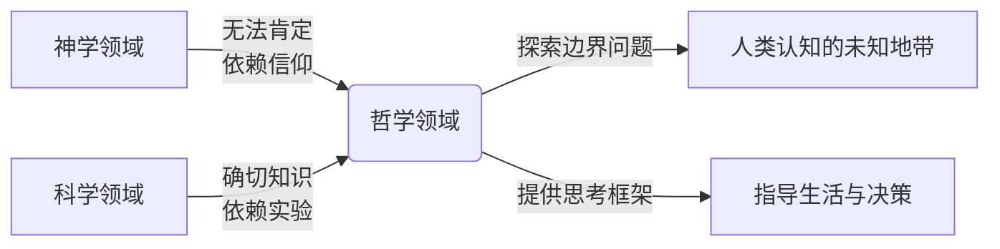
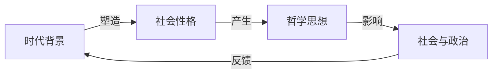
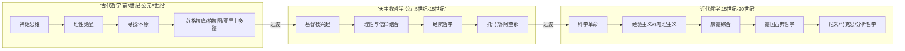
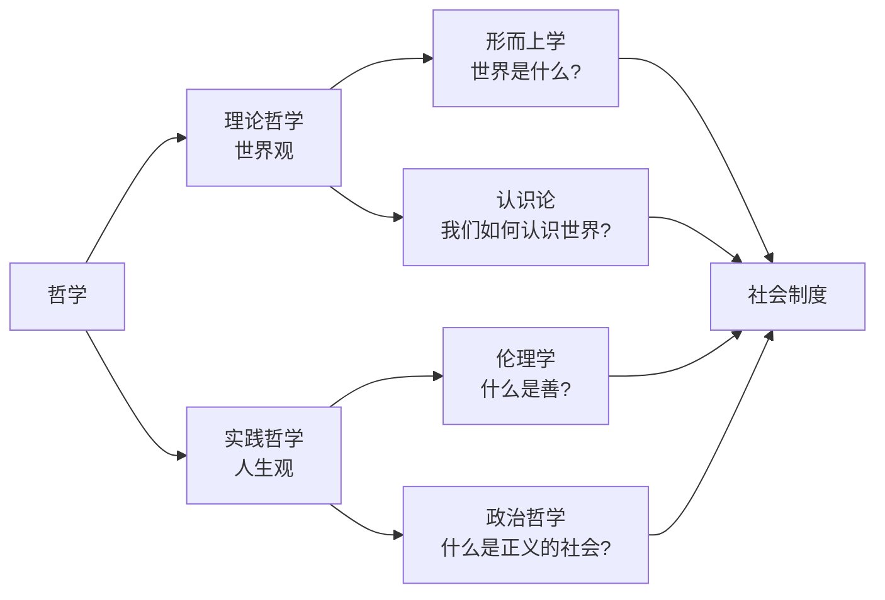

# 《西方哲学史》读书笔记

## 这本书要解决什么问题？

**核心困境**：普通读者想了解西方哲学，但哲学书籍"晦涩难懂"，让哲学成为"象牙塔"里的学问。如何让普通人也能理解西方2500年的哲学发展脉络？

**一句话定位**：
> 西方哲学史不是"哲学家思想罗列"，而是"人类认知觉醒的历程"——从神话到理性，从神学到科学，人类如何一步步学会独立思考。

### 作者站在什么位置说这些话？

| 维度 | 定位 |
|------|------|
| 主领域 | 哲学史、西方思想史 |
| 跨界领域 | 历史学、科学史、政治哲学 |
| 作者背景 | 诺贝尔文学奖得主（1950）、分析哲学创始人、数学家、逻辑学家 |
| 写作风格 | 通俗易懂、文采斐然、脱离学究气 |

### 和其他书有什么关系？

| 关联书籍 | 关联关系 | 共同底层逻辑 |
|----------|----------|--------------|
| [[沉思录-马可·奥勒留]] | 时间跨期 | 罗素专章讲述斯多葛学派，马可·奥勒留是罗马帝国时期斯多葛哲学的集大成者 |
| [[道德经-老子]] | 东西方对比 | 《道德经》中的"道"与希腊哲学的"本原"问题，都在探索宇宙终极规律 |
| [[庄子-庄子]] | 虚无与相对 | 希腊怀疑派（皮浪）与庄子的"齐物论"都质疑人类认知能力 |
| [[论语-孔子]] | 伦理政治 | 儒家伦理学（仁义礼智）与西方伦理学（亚里士多德幸福论）都关注"如何过好一生" |
| [[传习录-王阳明]] | 知行合一 | 培根的"知识就是力量"与王阳明的"知行合一"都强调实践 |

### 知识网络图

---

## 作者的核心论点

### 哲学是"夹缝中的学问"——在神学与科学之间

罗素在序言里给哲学下了个定义，既精确又耐人寻味：哲学是"介于神学和科学之间的东西"。神学研究"无法肯定的事物"——上帝、灵魂、来世，依赖信仰。科学研究"确切知识"——物理、化学、数学，依赖实验。哲学呢？它研究神学和科学之间的那片"无人之域"——自由意志、正义、美、人生意义。

这三个领域的关系：

这一定义有一个直接推论：科学解决"能做什么"，哲学解决"该做什么"。AI越强，哲学越重要——因为技术能力越强，"该不该做"的问题就越紧迫。人生意义是什么？这从来不是科学问题，是哲学问题。价值观冲突怎么办？哲学提供思考框架，不提供标准答案——它不是教条，是工具。

> **哲学的本质**：哲学不是某个学科的分支，而是人类认知的"边界地带"——当科学还无法给出确切答案，当神学已无法满足理性需求时，哲学就开始发挥作用。

这打碎了我对哲学"无用"的偏见。以前我觉得哲学就是一群人坐在象牙塔里争论些没答案的问题，和实际生活无关。罗素让我看到，恰恰是那些科学回答不了、信仰无法解答的问题——自由意志、正义、人生意义——才是最重要的。下次觉得哲学"没用"的时候，我不会再拿它和科学比实用性，而是问自己：那些决定我怎么活的问题，科学能回答吗？

从这个定义出发，罗素展开了更大的野心——他不只想定义哲学，他想解释哲学为什么会变化。

### 哲学发展史 = 社会生活与政治生活的产物

罗素在序言里说了一句经常被引用的话："我的目的是要揭示，哲学乃是社会生活与政治生活的一个组成部分：它并不是卓越的个人所做出的孤立的思考，而是曾经有各种体系盛行过的各种社会性格的产物与成因。"

这段话的含义是：哲学家不是凭空想出那些理论的，每一个哲学体系背后，都有一个特定的社会背景在支撑。

看一个具体案例。雅典城邦实行民主制度，公民需要在广场上辩论公共事务——这种社会性格催生了追求自由与理性的氛围，苏格拉底的批判与对话法就在这样的土壤中生长出来。反过来，苏格拉底的对话法又激发了公民的思考，强化了民主制度的活力。哲学和社会互为因果。

为什么古代哲学强调"美德"，现代哲学强调"权利"？因为古代城邦需要公民奉献，现代社会需要个人自由。为什么现在流行实用主义、功利主义？因为工业化社会强调效率与利益。哲学一直在回应时代的需求——它不是永恒不变的真理集合，而是每个时代对自己处境的思考。

> **罗素定律**：哲学思想不是凭空产生的，而是特定时代、特定社会的产物——每一个哲学体系背后，都有一个特定的社会背景在支撑。

这个观点打碎了我对哲学的想象。我一直以为哲学是超越时空的纯粹思考，但罗素让我看到，每一套哲学理论都是它的时代的孩子。亚里士多德的等级制度对应古希腊奴隶社会，卢梭的平等思想对应法国大革命前夜。下次读任何哲学家的观点，我不会只看他"说了什么"，而会追问"他身处什么时代，面对什么问题"。

理解了哲学和社会的关系，下一个问题自然浮现：西方哲学2500年，整体上走过了一条什么样的路？

### 西方哲学发展的三阶段——从神话到理性，从神学到科学

罗素把西方哲学史划分为三个大时期，每个时期都有自己独特的核心问题和思维方式。

**古代哲学**（前6世纪到公元5世纪）：从"寻找世界的本原"开始。泰勒斯说万物的本原是水，赫拉克利特说万物皆流，毕达哥拉斯说万物皆数。然后苏格拉底、柏拉图、亚里士多德把哲学从自然哲学推向道德和政治哲学——不再只问"世界是什么"，开始问"什么是好生活"。

**天主教哲学**（公元5世纪到15世纪）：基督教兴起后，哲学变成了"神学的婢女"。圣奥古斯丁把柏拉图哲学和基督教信仰结合，托马斯·阿奎那把亚里士多德哲学和基督教教义综合。理性没有消失，但被要求服务于信仰。

**近代哲学**（15世纪到20世纪）：科学革命重新解放了理性。经验主义（培根、洛克、休谟）说一切知识来自经验；唯理主义（笛卡尔、斯宾诺莎、莱布尼茨）说理性本身就能发现真理。康德试图综合两者。然后黑格尔、尼采、马克思把哲学推向新方向，罗素自己开创的分析哲学则把焦点转向语言和逻辑。

> **西方哲学演进规律**：从"神的解释"到"理性的解释"到"科学的解释"，人类认知不断扩张边界，哲学则不断调整自己的位置——从"全部真理"到"与科学分工"到"关注科学的边界问题"。

这三个阶段的演进，本质上就是人类"长大"的过程。小时候问"世界是谁造的"（神话），后来问"世界是什么"（哲学），最后问"世界怎么运转"（科学）。每个阶段，哲学都在重新定义自己的位置。

以前我以为哲学是一个固定的学科，研究的内容从古到晚一脉相承。读完这三阶段我才意识到，哲学一直在"搬家"——古代哲学要解释整个世界，中世纪哲学要服务于信仰，近代哲学要和科学分工。哲学没有死，它只是在不断调整自己的位置。下次有人说"哲学已经过时了"，我不会再附和，而是反问：科学能告诉你该不该做某件事吗？如果不能，哲学就还有它的位置。

有了对哲学三阶段的宏观理解，接下来要回答一个更根本的问题：哲学到底在做什么？罗素的答案是——它在同时做两件事。

### 哲学的两大任务——解释世界 + 指导生活

罗素指出："哲学在其全部历史中一直是由两个不调和地混杂在一起的部分构成的。"第一部分是关于世界本性的理论——世界观。第二部分是关于最佳生活方式的伦理学说或政治学说——人生观。

理论哲学回答"世界是什么样的"——形而上学追问世界是什么，认识论追问我们如何认识世界。实践哲学回答"我们该怎么做"——伦理学追问什么是善，政治哲学追问什么是正义的社会。前者是后者的基础，后者是前者的目的。

这也解释了为什么哲学既"抽象"又"实用"。它抽象，因为要追问世界的根本性质；它实用，因为你的每个选择背后都有一个世界观和人生观在支撑。你以为你不需要哲学，但你的每一个判断——什么是好的、什么是应该的、什么是对的——都是哲学命题的应用。

> **哲学的双重功能**：既要回答"世界是什么样的"（与科学分工），又要回答"我们该怎么做"（指导人生）。前者是后者的基础，后者是前者的目的。

科学告诉你"能做什么"，哲学告诉你"该做什么"。技术越发达，越需要哲学来回答"该不该做"的问题。哲学不是用来争论的，是用来生活的——找到你认同的世界观和人生观，用它来指导决策。

这个观点打碎了我的一个假设——我一直把哲学当成"抽象思考"，觉得它离现实很远。但罗素说哲学同时在做两件事：解释世界和指导生活。你的每一个选择背后都有一套哲学在运作，只是你没意识到。下次面临重大决策，我不会再凭直觉拍脑袋，而是先问自己：我背后的世界观和人生观是什么？这套哲学能不能经得起推敲？

---

## 这本书的局限

> 罗素从分析哲学的立场出发，带着明确的个人偏好来写哲学史，这本书有它的盲区。

| 批评点 | 谁在批评 | 怎么说 | 实际情况 |
|--------|---------|--------|---------|
| 过度概括 | 学术界 | 2500年哲学用一本书讲完，必然简化 | 罗素的叙事确实精彩，但很多哲学家的复杂思想被过度简化 |
| 主观偏见 | 哲学史家 | 罗素对某些哲学家评价过低（如黑格尔、尼采） | 罗素确实有明显的偏好和好恶，分析哲学视角的偏见不可否认 |
| 欧洲中心 | 后殖民学者 | 几乎不提非西方哲学 | 这是时代局限，1950年代的哲学史写作大多如此 |
| 忽视女性哲学家 | 女性主义学者 | 全书几乎没有女性哲学家的位置 | 罗素确实遗漏了阿伦特、西蒙娜·韦伊等重要女性思想家 |
| 文学性过强 | 分析哲学家 | 写得太"好看"，可能牺牲了准确性 | 诺贝尔文学奖不是白拿的，可读性强确实是双刃剑 |

**一句话总结局限性**：
> 这是一部"带有罗素个人色彩的哲学史"，精彩、可读、有立场，但不是客观中立的学术参考书。读它获得的是视角和洞察，不是百科全书式的事实。

---

## 最值得记住的话

**原书说的**：
1. "哲学乃是某种介乎神学和科学之间的东西。"
2. "一切确切的知识都属于科学；一切涉及超乎确切知识以外的教条都属于神学。但介乎这两者之间，有一片受到双方攻击的无人之域，这就是哲学。"
3. "我的目的是要揭示，哲学乃是社会生活与政治生活的一个组成部分。"
4. "哲学在其全部历史中一直是由两个不调和地混杂在一起的部分构成的：一方面是关于世界本性的理论，另一方面是关于最佳生活方式的伦理学说或政治学说。"
5. "科学的领域是有限度的，而科学的限度正好就是哲学的起点。"

**翻译成人话**：
1. 哲学就像夹在神学和科学之间的翻译官——神学说"上帝创造一切"，科学说"大爆炸产生宇宙"，哲学问："那上帝和大爆炸之间是什么关系？"
2. 哲学家不是"天才的怪人"，而是"时代的孩子"——每个哲学体系背后都有一个社会背景
3. 西方哲学史就是人类"长大"的过程——从问"世界是谁造的"到问"世界是什么"到问"世界怎么运转"
4. 你不需要记住苏格拉底说过什么，你只需要学会他"不停追问"的思考方式
5. 哲学不是"背诵课本"，而是"训练大脑"——就像健身让你肌肉发达，哲学让你思考敏捷
6. 科学解决"能做什么"，哲学解决"该不该做"——技术越强，哲学越重要
7. 哲学不给你"标准答案"，只给你"思考工具"——给你地图，不给你目的地
8. 古代哲学重视形而上学，现代哲学重视语言分析——哲学在根据科学调整自己
9. 哲学没死，只是换了战场——AI伦理、认知科学哲学都是新阵地
10. 懂哲学不等于记住哲学家，而是学会像哲学家一样思考

---

## 讲给没读过的人听

你有没有觉得哲学离你很远？一群古代人穿着长袍坐在广场上辩论，跟你的生活有什么关系？

罗素说，关系大了。他用一本书把2500年的西方哲学串成了一个故事——人类"长大"的故事。

最开始，人类用神话解释一切。打雷了？那是宙斯在发怒。丰收了？那是德墨忒尔在高兴。后来有人开始不满足了——泰勒斯说万物的本原不是神，是水。这是人类第一次尝试用理性而非神话来理解世界。哲学就这样诞生了。

然后哲学走了三段大路。古代：从神话到理性，苏格拉底教人追问，柏拉图建构理想国，亚里士多德什么都研究。中世纪：理性被信仰收编，哲学变成神学的婢女，托马斯·阿奎那试图用理性证明上帝存在。近代：科学革命重新解放了理性，经验主义和唯理主义打了三百年，康德出来综合，然后尼采说"上帝死了"，罗素自己把哲学引向语言分析。

罗素最精彩的洞察是：哲学家不是凭空思考的。每个哲学体系都是时代的产物。亚里士多德的等级思想对应奴隶社会，卢梭的平等思想对应革命前夜。你读哲学，读的不只是思想，更是那个时代的精神面貌。

哲学在科学越来越强的今天还有用吗？罗素的答案是：正因为科学越来越强，哲学才越来越重要。科学告诉你能做什么，哲学告诉你该不该做。AI能做什么？科学问题。该不该让AI做决定？哲学问题。

---

## 用来检验理解的问题

**基础回忆**：
1. Q: 罗素对哲学的定义是什么？
   A: 哲学介于神学和科学之间——神学研究无法肯定的事物，科学研究确切知识，哲学研究两者之间的"无人之域"。

2. Q: 西方哲学史的三个时期是什么？
   A: 古代哲学（前苏格拉底到亚里士多德）、天主教哲学（中世纪）、近代哲学（文艺复兴到20世纪）。

3. Q: 哲学的两大任务是什么？
   A: 解释世界（世界观/理论哲学）和指导生活（人生观/实践哲学）。前者是后者的基础，后者是前者的目的。

**理解验证**：
1. Q: 为什么罗素说"哲学是社会生活的产物"？
   A: 每个哲学体系背后都有特定的社会背景。亚里士多德的等级制度对应奴隶社会，卢梭的平等思想对应革命前夜。哲学家不是凭空思考，而是回应时代问题。

2. Q: "科学的限度正好就是哲学的起点"怎么理解？
   A: 科学能回答"是什么"和"怎么运作"，但回答不了"该不该做"和"意义是什么"。科学到达边界的地方，哲学就开始了。

3. Q: 为什么古代哲学重形而上学，现代哲学重语言分析？
   A: 古代科学不发达，哲学要承担解释世界的全部任务。现代科学接管了大部分解释工作，哲学转向思考"如何正确思考"本身。

**实际应用**：
1. Q: 用罗素的框架分析一个当下的哲学问题（如AI伦理）。
   A: AI伦理正是科学到达边界后哲学介入的典型领域。科学知道AI能做什么，但"该不该让AI做医疗诊断的决定"是哲学问题——涉及责任、信任、公正等价值判断。

2. Q: 选一个你关注的哲学问题，追溯它的历史演变。
   A: 比如"自由意志"——古代由命运观引出，中世纪被神学笼罩（上帝全知vs人是否自由），近代被科学挑战（脑神经科学说意识是化学反应的产物），现在变成AI伦理的核心问题。

**深度分析**：
1. Q: 罗素的分析哲学立场如何影响了他的哲学史写作？
   A: 他明显偏爱清晰、逻辑性强的哲学家（如亚里士多德、洛克），对模糊、思辨性强的哲学家（如黑格尔、柏格森）评价偏低。这让他的叙述清晰可读，但也带有偏见。

2. Q: 东西方哲学的根本差异是什么？
   A: 西方哲学偏理性分析和逻辑推理，东方哲学偏直觉领悟和辩证思维。西方追求"确定的规律"，东方追求"不确定的智慧"。但两者都在回答"世界的终极问题"和"如何过好一生"。

---

## 和其他书的对话

罗素和马可·奥勒留之间有一段特殊的关系。罗素在《西方哲学史》里专章讲述了罗马时期的斯多葛哲学，对马可·奥勒留的评价是"高尚的人，但顺从了暴政"。罗素认为斯多葛学派"过于顺从"，削弱了反抗精神——你接受命运，就不会去改变命运。这和《沉思录》中"控制你能控制的，接受你无法控制的"形成了有趣的张力。罗素提供的是理论框架，奥勒留提供的是生活实践，两本书一起读，你对斯多葛哲学的理解才完整。

老子的"道"和希腊哲学的"本原"是跨时空的平行思考。泰勒斯说万物的本原是水，赫拉克利特说万物皆流，老子说道生一、一生二、二生三、三生万物。东西方都在追问"世界的终极是什么"。但方法截然不同：西方用理性分析去解构世界，东方用直觉领悟去体悟世界。赫拉克利特的"万物皆流"和老子的"道法自然"都强调变化的规律和顺应自然，但赫拉克利特还在找"变化背后的不变法则"，老子直接说"道可道非常道"——说不出来的才是真的。读了《西方哲学史》再读《道德经》，你会更清楚地看到东西方思维方式的那条分界线。

庄子的"齐物论"和希腊怀疑派（皮浪）走的是同一条路——都质疑人类认知的绝对性。你以为的"真理"，可能只是你视角的产物。普罗泰戈拉说"人是万物的尺度"，庄子说"子非鱼，安知鱼之乐"——都在提醒你：别太确定你知道的就是真的。读了罗素对怀疑派的讲述再读庄子，你会发现两千多年前的东方智慧，在西方也有精确的对应。

孔子和亚里士多德都在回答"如何过好一生"，但路径完全不同。亚里士多德说幸福是最高善，靠理性来实现；孔子说仁义礼智，靠修身来实现。苏格拉底把教育当成"助产术"——启发学生自己思考；孔子把教育当成"传道授业解惑"——传授知识。柏拉图的《理想国》要哲人王统治，儒家也要君子之德如风。东西方在伦理学和政治哲学上走了平行但不同的路。

王阳明的"知行合一"和培根的"知识就是力量"都强调实践，但出发点不同。培根是在科学革命的语境下说这句话——知识要用来改造自然；王阳明是在理学的语境下说——真知必然导致行动，不行就不是真知。一个向外征服自然，一个向内修炼心性。

---

*拆解日期：2026-02-15*
*下次回访：1周后回顾「讲给没读过的人听」和「检验问题」*
