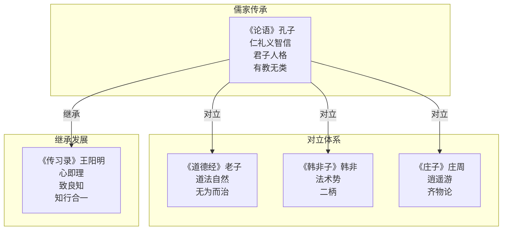

# 《论语》读书笔记

## 这本书要解决什么问题？

**核心困境**：春秋时期，礼崩乐坏，社会秩序混乱。诸侯争霸，臣弑君，子弑父，旧的价值体系全面崩塌。怎么重建道德规范、恢复社会和谐？

孔子给出的答案不是"怎么治国"，而是"怎么做人"。他相信：如果每个人都修身立德，社会秩序自然恢复。君子人格是社会稳定的基石，修身立德是重建秩序的根本。

**一句话定位**：
> 从修身开始，推己及人，用仁爱重建秩序——不是靠制度强制，而是靠人格感化。

### 作者站在什么位置说这些话？

| 维度 | 定位 |
|------|------|
| 主领域 | 儒家人生/教育哲学 |
| 跨界领域 | 政治哲学、伦理学、教育学 |
| 作者背景 | 春秋思想家、教育家，至圣先师。不是君王，不是将军，是一个"知其不可而为之"的老师——周游列国十四年推行理想，处处碰壁，却从未放弃 |
| 历史语境 | 春秋末期，诸侯争霸，礼崩乐坏。孔子站在教育者的位置，试图用道德重建秩序。他不是在写给君王看的统治手册，是在给普通人写的人生指南 |

### 和其他书有什么关系？

| 关联书籍 | 关联关系 | 共同底层逻辑 |
|----------|----------|--------------|
| [[庄子-庄子]] | 对立 | 入世有为 vs 出世逍遥 |
| [[道德经-老子]] | 对立 | 有为政治 vs 无为自然 |
| [[韩非子-韩非]] | 对立 | 德治教化 vs 法治惩罚 |
| [[传习录-王阳明]] | 继承 | 外在礼教 vs 内在心学 |

### 知识网络图

---

## 作者的核心论点

### 仁爱扩展——从身边人开始，推己及人

颜回问孔子：什么是仁？孔子说"克己复礼"。子贡问：有一言可以终身行之？孔子说"其恕乎！己所不欲，勿施于人"。

两个弟子问了同一个问题，孔子给了两个不同的答案。这不是矛盾，是因为颜回和子贡的理解力不同——这正是孔子"因材施教"的体现。但对所有弟子，仁的核心机制是一样的：从身边人开始，一圈一圈往外扩展。

核心圈是父母兄弟（孝悌），往外是朋友熟人（谨而信），再往外是泛爱众（广泛关爱），最外层是亲近仁德者（亲仁）。仁爱不是要求你爱所有人，而是从身边做起，自然扩展。恕道的运作更具体：推己及人——自己的感受，推断他人的感受；己所不欲，勿施于人。

> **仁爱扩展定律**：仁爱从身边人（孝悌）开始，通过推己及人机制扩展到所有人（泛爱众）。

以前我总觉得"仁爱"就是博爱所有人，现在才明白：孔子不讲空泛的博爱，他讲的是从核心圈往外推的"涟漪式关爱"。你不需要爱所有人，你只需要孝顺父母、敬重兄长、对朋友守信、关爱弱者。仁爱会自然扩展。

有了仁爱的内核，孔子接下来要讲的是：用什么规范来约束行为？

### 礼的规范——克制私欲回归秩序

"人而不仁，如礼何？人而不仁，如乐何？"——孔子说得很清楚：没有仁的内核，礼的形式毫无意义。

礼的功能有三个。秩序：长幼有序、君臣有别，让社会有章可循。约束：克己复礼——克制私欲，回归规范。和谐：礼之用，和为贵——守礼不是为了压抑，是为了和谐。机制链条是：克己（约束私欲）→ 复礼（回归礼制）→ 社会秩序恢复。

颜回用"约我以礼"来实践，子路用恭敬有礼来践行。但孔子反复强调：礼不是死板的规矩，仁才是内核。没有仁的礼是虚伪的，没有礼的仁是混乱的。

> **社会秩序定律**：礼是约束私欲、恢复社会秩序的规范体系；每个人克己复礼，社会自然和谐。

下次觉得"守规矩很丢人"的时候，想想孔子的话——你不需要压抑天性，你只需要在合适的时候做合适的事。礼就是社会规范的底线。

礼给了行为规范，但面对利益诱惑时，该用什么标准决策？

### 义利分离——面对利益时，先问对不对

"君子喻于义，小人喻于利"——这是孔子最一刀两断的判断。

君子面对决策，用道义标准；小人面对决策，用利益计算。不是君子不需要利益，而是先后次序不同：义然后取，见利思义。财富来了，先问"该不该拿"；职场站队，先看"价值观合不合"；判断是非，不用利益衡量。

子路以义为行为的本质，颜回行义无悔。孔子不是在说"君子不该赚钱"，而是在说：面对利益的时候，第一个问题不是"我能赚多少"，而是"这样做对吗"。

> **义利分离定律**：君子和小人的根本区别在于决策标准——君子用道义标准，小人用利益计算。

这个观点打碎了我的一个假设。以前觉得"先活下来再谈理想"，现在意识到：正是因为先活下来再谈理想，所以很多人活了一辈子也没开始谈理想。义不是要你放弃利益，而是要你把利益放在正确的位置上。

有了仁、礼、义的内核，孔子描绘了一种理想的人格状态。

### 君子人格——四维修炼体系

"君子坦荡荡，小人长戚戚。"——君子心胸开阔，小人患得患失。

孔子给君子画了四个维度。坦荡荡：心胸开阔，不为小事焦虑。和而不同：可以不同意你，但能和你和谐相处。求诸己：有问题先问自己，不甩锅。喻于义：面对决策用道义标准，不用利益计算。

子路是君子人格的极致体现——"君子死而冠不免"，临死前还要把帽子戴正。颜回则是另一个极端："君子不迁怒，不贰过"，不拿别人出气，同样的错误不犯第二次。一个是刚烈的君子，一个是温润的君子，路径不同，但四维框架一致。

> **人格塑造定律**：君子人格四维（坦荡荡、和而不同、求诸己、喻于义）是稳定心态、应对世界的完整框架。

这打碎了我对"完美人格"的误解。你不需要完美，你只需要四件事：心胸开阔、接受差异、反躬自省、坚持道义。这就是君子人格——不是遥不可及的理想，是可以每天修炼的框架。

有了人格的修炼方法，孔子接下来讲的是：怎么学习才能持续进步？

### 学思结合——学了就用，用了就总结

"学而不思则罔，思而不学则殆"——只学不思，迷惑；只思不学，危险。学和思必须结合。

孔子给出的学习循环是：学 → 思 → 用 → 实践反馈 → 再学。颜回的做法是"退而省其私"——学了之后回去反思；子路的做法是"学而不厌"——持续学习不厌倦。两个人风格不同，但都在做同一件事：学和思交替进行。

孔子的学习观非常现代。好学：敏而好学，学而时习之——学了就用。好思：慎而好思，三省吾身——用了就总结。只学不思的人，知识越多越迷惑；只思不学的人，想得越多越危险。学思结合，才能明晰。

> **学习效率定律**：学和思必须结合——只学不思则罔（迷惑），只思不学则殆（危险），学思结合才能明晰。

下次觉得"学了很多但用不上"，不要怀疑学习的价值，而是问自己：我学完之后反思了吗？用了吗？总结了再学了吗？学习不是积累知识，是建立认知框架。

孔子的最后一个伟大贡献，是改变了一千多年的教育传统。

### 有教无类——教育公平，从孔子开始

"有教无类"——四个字，打破了春秋时期"教育是贵族特权"的铁律。

孔子之前，只有贵族能接受教育，平民被排除在外。孔子说：不。只要你"自行束修以上"——带着一点微薄的学费来——我就教你。不看出身，不看贫富，不看阶层。机会平等。

但他不只是开放了教育机会，还发明了三套教学方法。公平原则：有教无类，机会平等。个性原则：因材施教，尊重差异——同一个问题，颜回和子贡得到不同的答案。时机原则：不愤不启，等学生准备好了再教。

> **教育公平定律**：教育机会应该平等（有教无类），教学方法应该个性化（因材施教），时机要合适（不愤不启）。

这打碎了我对"教育公平"的理解。以前以为公平就是给所有人同样的资源，现在才明白：真正的公平是给所有人同样的机会，但根据每个人的特点用不同的方法。你不需要优越的教育资源，你需要的是"有教无类"的心态：机会平等、方法个性、耐心等待。教育不是筛选，是点亮。

---

## 这本书的局限

> 孔子的思想是从春秋乱世的道德理想主义中生长出来的，这套方法有它的边界。

| 批评点 | 谁在批评 | 怎么说 | 实际情况 |
|--------|---------|--------|---------|
| 德治太理想化 | 法家、现实主义者 | 人性不全是善的，光靠道德感化不够 | 制度和道德需要配合，纯靠德治确实容易失效 |
| 等级秩序固化 | 现代平等主义者 | 长幼有序、君臣有别强化了等级制度 | 礼的初衷是和谐，但确实容易被权力利用来维护等级 |
| 缺乏制度设计 | 政治学家 | 只讲"应该怎样"，不讲"怎么保证" | 孔子关注的是人格修养，制度建设确实不是他的重点 |
| 重义轻利偏颇 | 经济学家 | 不能只讲道义不讲利益 | 义利不是非此即彼，但孔子的表述确实容易走向极端 |
| 女性地位 | 现代女性主义者 | "唯女子与小人难养也" | 这句话的解读争议很大，但儒家体系中女性地位确实受限 |

**一句话总结局限性**：
> 孔子的"仁爱"和"君子人格"是永恒的人生智慧，但"德治"作为治国方略需要法治来补充——理想主义需要现实主义的制衡。

---

## 最值得记住的话

**原书说的**：
1. "学而时习之，不亦说乎？有朋自远方来，不亦乐乎？"
2. "巧言令色，鲜矣仁。"
3. "吾日三省吾身：为人谋而不忠乎？与朋友交而不信乎？传不习乎？"
4. "为政以德，譬如北辰居其所而众星共之。"
5. "朝闻道，夕死可矣。"
6. "君子喻于义，小人喻于利。"
7. "见贤思齐焉，见不贤而内自省也。"
8. "己欲立而立人，己欲达而达人。"
9. "己所不欲，勿施于人。"
10. "知之者不如好之者，好之者不如乐之者。"
11. "君子坦荡荡，小人长戚戚。"
12. "父母在，不远游，游必有方。"
13. "过犹不及。"
14. "学而不思则罔，思而不学则殆。"
15. "有教无类。"

**翻译成人话**：
1. 学了就用，用了就总结——这才是真正的快乐
2. 说得漂亮不如做得真诚
3. 每天问自己三个问题：做事尽力了吗？交友守信了吗？学的东西复习了吗？
4. 用德行来治理，就像北极星，自己不动，众星自然围绕
5. 早上明白了真理，晚上死也值了
6. 君子看对不对，小人看赚多少
7. 看到榜样，向他学习；看到反面教材，反省自己
8. 你想立住，先帮别人立住；你想成功，先帮别人成功
9. 自己不想要的，别强加给别人
10. 知道不如喜欢，喜欢不如享受
11. 心胸开阔，不做小人
12. 父母健在，别走远
13. 做得不够和做得过度都不好
14. 光学不思会迷惑，光思不学很危险
15. 教育不分类别，人人平等

---

## 讲给没读过的人听

你有没有觉得，现在的人越来越不会做人了？人际关系紧张，职场勾心斗角，家庭关系也搞不好。

2500年前，有一个人也看到了同样的问题。那时候比现在还乱——诸侯争霸，臣弑君，子弑父，整个社会的规矩都崩了。

这个人叫孔子。他开出了一个看似简单、实则深刻的药方：从身边人做起。

在家孝敬父母，在外敬重兄长，对朋友守信。然后像水波一样，一圈一圈往外扩展。你自己不想要的，别强加给别人。你想要成功，先帮别人成功。这不叫"博爱"——孔子不讲博爱，他讲的是从核心圈往外推的"仁爱"。

面对利益的时候，先问"这样做对吗"，不要先问"能赚多少"。遇到问题先问自己，别急着甩锅。心胸开阔一点，不必强求一致——可以不同意别人，但要和谐相处。

学东西要学了就用，用了就总结，总结后再学。不要只学不想，那样会迷惑；也不要只想不学，那样很危险。

听起来很简单？是的，孔子就是这样的老师——不讲大道理，只讲你能做到的事。但做到的人，就是君子。

---

## 用来检验理解的问题

**基础回忆**：
1. Q: "仁"的扩展机制是什么？
   A: 从核心圈（孝悌）开始，一圈一圈往外：父母兄弟 → 朋友熟人（谨而信）→ 泛爱众 → 亲仁。

2. Q: 君子人格的四维是什么？
   A: 坦荡荡（心胸开阔）、和而不同（和谐共存）、求诸己（反躬自省）、喻于义（道义优先）。

3. Q: "有教无类"的三原则是什么？
   A: 公平（有教无类）、个性（因材施教）、时机（不愤不启）。

**理解验证**：
1. Q: 为什么"学而不思则罔，思而不学则殆"？
   A: 只学不思，知识越多越迷惑（没有消化）；只思不学，想得越多越危险（没有根基）。学思结合才能明晰。

2. Q: "义"和"利"的关系是什么？
   A: 不是不要利益，而是先问"对不对"再问"赚多少"。义然后取，见利思义。

3. Q: "礼"和"仁"的关系是什么？
   A: 仁是内核，礼是外在规范。没有仁的礼是虚伪，没有礼的仁是混乱。

**实际应用**：
1. Q: 用孔子的思维，如何处理一段紧张的人际关系？
   A: 关键步骤：先求诸己（是不是我的问题）→ 己所不欲勿施于人（换位思考）→ 和而不同（接受差异）→ 谨而信（做事谨慎说话守信）。

2. Q: "仁爱扩展"如何应用于职场社交？
   A: 核心圈（直属团队/核心伙伴）→ 外圈1（跨部门同事）→ 外圈2（行业人脉）。有限精力先照顾核心圈。

**深度分析**：
1. Q: 为什么孔子的"德治"在历史上经常失败？
   A: 德治依赖领导者的道德自觉，但人性不总是善的。没有制度约束的德治，容易被权力者利用或放弃。理想的做法是"外儒内法"——文化建设用儒家，制度设计用法家。

2. Q: 孔子和王阳明的"知行观"有什么本质区别？
   A: 孔子说"学而时习之"——学和行是两步，先学后行。王阳明说"知行合一"——知和行是一件事，真知必须行。孔子给你方法论，王阳明给你哲学本体。

---

## 和其他书的对话

庄子和孔子是中国的"出世"和"入世"。孔子说"知其不可而为之"——明知做不到也要努力，改变世界是知识分子的责任。庄子说"知其不可奈何而安之若命"——做不到就接纳，超越外在束缚才是自由。孔子是阳（入世、秩序），庄子是阴（出世、自由）。两本书都读了，你就有了入世做事和出世安心的双重能力。

老子和孔子都在回答"怎么治"，但方向完全相反。孔子说"为政以德"，用道德引导，用礼制规范；老子说"道法自然"，不要干预，让事物自己运转。孔子折腾，老子自然。但两者都讲秩序——只是方法不同。孔子是有为的秩序，老子是无为的秩序。

韩非是孔子的镜中倒影。孔子相信人性本善，要靠德治教化；韩非相信人性本恶，要靠法治强制。孔子说"有教无类"，韩非说"有功必赏、有罪必罚"。一个向内求德，一个向外求法。但现代最好的组织管理，恰恰综合了两者：制度设计用韩非，文化建设用孔子。

王阳明站在孔子的肩膀上，转了一个方向。孔子的"仁"是外在规范——克己复礼、泛爱众、谨而信。王阳明说，不对，道德标准不在外面，在你心里——"心即理"、"致良知"。孔子教你怎么按规矩做人，王阳明教你怎么从内心出发做人。从孔子到王阳明，儒学完成了从"外在礼教"到"内在心学"的转向。

---

*拆解日期：2026-02-14*
*下次回访：1周后回顾「讲给没读过的人听」和「检验问题」*
