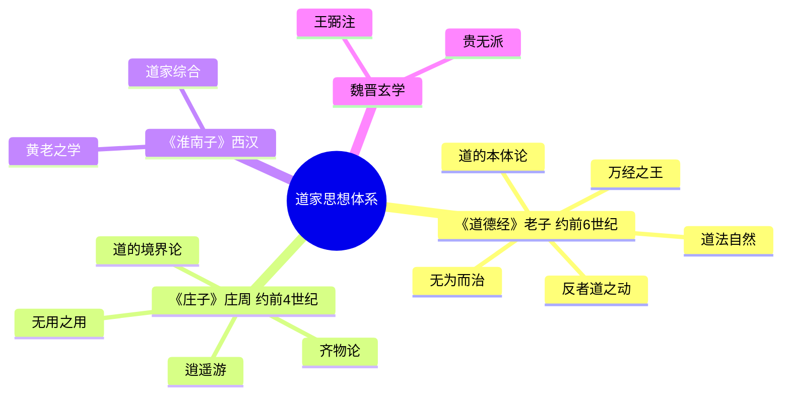
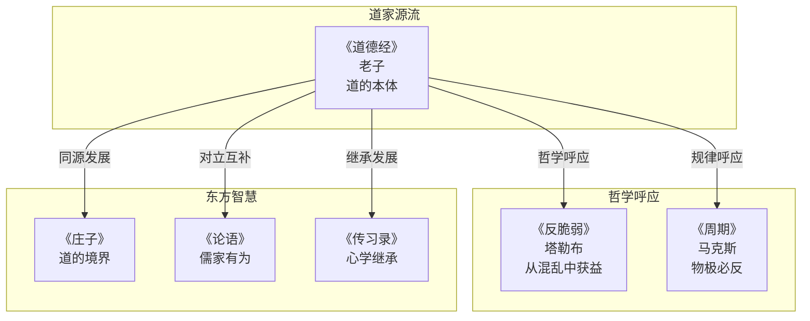

# 《道德经》拆解记录

## 这本书要解决什么问题？

**核心困境**：人类总是试图用"有为"去改变世界，结果越努力越混乱。老子问：如果顺应规律而非对抗规律，会怎样？

这不是在问"如何治理国家"，也不是在问"如何修身养性"——而是在追问一个更根本的问题：什么是道的运行规律？如何与规律共舞而非对抗？

**一句话定位**：
> 最高明的智慧，不是用力改变世界，而是理解规律、顺势而为——让道自己运转。

### 作者站在什么位置说这些话？

| 维度 | 定位 |
|------|------|
| 主领域 | 道家哲学（中国哲学三大支柱之一） |
| 跨界领域 | 政治哲学、管理学、生态学、认知科学 |
| 作者背景 | 周守藏室之史，博古通今，见证周室衰败后弃官归隐。不是君王，不是将军，是一个看透了兴亡规律的档案管理员 |
| 历史语境 | 春秋末期，诸侯争霸，礼崩乐坏。老子站在周室档案管理者的位置，看遍历史兴衰，输出的不是治国方略，而是对文明异化的深刻反思 |

### 和其他书有什么关系？

| 关联书籍 | 关联关系 | 共同底层逻辑 |
|----------|----------|--------------|
| [[反脆弱-塔勒布-拆解记录]] | 哲学呼应 | "反者道之动" 约 "反脆弱"——从混乱中获益 |
| [[庄子-庄子-拆解记录]] | 同源发展 | 道的本体（老子）到 道的境界（庄子） |
| [[论语-孔子-拆解记录]] | 对立互补 | 无为而治（道家）vs 有为政治（儒家） |
| [[周期-拆解记录]] | 规律呼应 | 物极必反 约 钟摆规律——均值回归 |
| [[穷查理宝典-拆解记录]] | 方法呼应 | "反者道之动" 约 "反向思考"——逆向思维 |
| [[传习录-王阳明-拆解记录]] | 继承发展 | 道体（老子）到 心体（王阳明） |

### 知识网络图

---

## 作者的核心论点

### 道法自然——顺应规律的最高智慧

植物不需要被告知如何生长，它自然生长。孩子不需要被强迫学习，好奇心自然驱动。市场不需要被计划，价格自然传递信息。

"人法地，地法天，天法道，道法自然"（第二十五章）——老子用一句话把整个宇宙的层级关系说清楚了。人要遵循地理环境的规律，地理受天时影响，天时遵循道的规律，而道的最高准则就是自然——"自己如此"的状态。

这个机制的运作方式并不复杂。观察规律，理解规律，顺应规律，然后无为而无不为。四个层级对应四种态度：人法地对应因地制宜，地法天对应季节性经营，天法道对应长期主义，道法自然对应不干预。

> **自然法则定律**：最好的管理，是让事物按自己的规律发展，而不是用外力强行改变。

这个观点打碎了我的一个假设。我以前总觉得"管得好"就是"管得多"，现在意识到完全相反——你不需要替植物决定怎么长，你只需要给它阳光、水、土壤，它自己会生长。

懂得了顺应规律，老子接下来要讲的是：怎么做到"不管"反而比"管"更好。

### 无为而治——不妄为的最高管理艺术

"治大国，若烹小鲜"（第六十章）。这是老子最著名的比喻之一。煎小鱼，频繁翻动就碎了；不翻动，反而完整。

高明的厨师知道该翻的时候翻，不该翻的时候不动。伟大的管理者也一样：制定好规则后，让组织自己运转。有为的人过度干预，破坏平衡，最终导致系统崩溃；无为的人制定规则，创造环境，让组织自运行。

| 维度 | 有为（妄为） | 无为（不妄为） |
|------|-------------|---------------|
| 管理 | 微观管理、KPI压力 | 授权赋能、目标管理 |
| 教育 | 填鸭式教学、强迫学习 | 因材施教、激发兴趣 |
| 育儿 | 替孩子决定一切 | 给空间、让天性发展 |
| 结果 | 越管越乱、效率下降 | 无为而无不为 |

> **无为而治定律**：无为不是什么都不做，而是不违背规律地做；最好的管理者，是团队感觉不到他的存在。

下次遇到团队混乱的情况，我不会再问"我该怎么管得更好"，而是问"我是否在瞎折腾"——按规律办事，就是最高明的作为。

但理解了"无为"之后，一个更深层的问题浮现出来：事物发展到极致会怎样？这引出了老子最深刻的洞察。

### 反者道之动——从混乱中获益的哲学

月满则亏，水满则溢。股市涨到极点就会跌，跌到极点就会涨。人生低谷是反弹的起点，高峰是下落的开始。

"反者道之动，弱者道之用"（第四十章）。"祸兮福之所倚，福兮祸之所伏"（第五十八章）。老子观察到，向相反方向转化是道的运动规律——事物发展到极点，必然向对立面转化。

这个循环有四个阶段：上升期要居安思危，极盛期要知止不殆，转折期要接纳变化，低谷期要等待反弹。每个阶段都有对应的智慧，但核心只有一条——物极必反。

> **反者道之动定律**：向相反方向转化是道的运动规律，物极必反是普遍法则；在极端时保持克制，在低谷时保持希望。

这个规律和塔勒布的《反脆弱》形成了跨越2500年的呼应。老子说"反者道之动"，塔勒布说"从混乱中获益"；老子说"祸福相依"，塔勒布说"黑天鹅"；老子说"柔弱胜刚强"，塔勒布说"杠铃策略"。波动不是敌人，是进化的养料——东方和西方，在不同的时代，用不同的语言，说出了同一个道理。

理解了转化的规律之后，老子给出了一个反直觉的答案：为什么弱者反而能赢？

### 柔弱胜刚强——韧性的力量

牙齿硬但先掉，舌头软却长存。大树易被风吹断，小草随风摇摆。刚强者承受全部冲击然后折断，柔弱者化解冲击然后存活。

"天下莫柔弱于水，而攻坚强者莫之能胜"（第七十八章）。水看似最柔弱，却能穿透石头。这不是比喻，这是事实——水滴石穿。刚强者的策略是强硬对抗，结果是承受全部冲击后崩溃折断。柔弱者的策略是灵活适应，结果是化解冲击后存活并进化。

| 维度 | 刚强者 | 柔弱者 |
|------|--------|--------|
| 职场 | 强硬抗压，容易崩溃 | 灵活应变，持续适应 |
| 商业 | 价格战、硬碰硬 | 差异化、生态化 |
| 创新 | 固守技术路线 | 拥抱变化、快速迭代 |
| 人际 | 咄咄逼人、孤立 | 谦逊包容、得道多助 |

> **柔弱胜刚强定律**：柔弱不是软弱，而是韧性和适应性；刚强者易折，柔弱者长存。

这打碎了我对"强大"的迷信。以前觉得强硬就是力量，现在才明白：你的脆弱，正是你以为的刚强。柔弱不是无能，是最高明的生存智慧。

既然柔弱如此强大，那具体该怎么处世？老子用水来回答这个问题。

### 上善若水——利他不争的处世之道

"上善若水。水善利万物而不争，处众人之所恶，故几于道"（第八章）。

水滋养万物却不争功，总是流向低处，不与高处争。最有价值的人，是像水一样滋养别人而不争功的人。老子列出了水的七种品质：居善地（选择正确位置）、心善渊（内心沉静深邃）、与善仁（待人仁爱友善）、言善信（说话诚信可靠）、政善治（治理有序有效）、事善能（做事发挥所长）、动善时（行动把握时机）。

这套逻辑链条很清晰：利万物 → 滋养他人；不争 → 天下莫能与之争；处下 → 赢得尊重。三条路汇向同一个终点——获得真正的价值。

> **上善若水定律**：不争，是最高明的竞争——水不争，但天下莫能与之争；利他，是最高明的利己。

你拼命争的东西，往往得不到。你不争的东西，反而自己来。不争，不是放弃，是最高明的竞争策略。

以前我总觉得"不争"就是认输退让，现在才明白：不争恰恰是最高明的竞争方式。水从来不跟任何人争，但天下没有任何东西能胜过水。

到这里，老子提出了一个关于学习的颠覆性观点。

### 为学日益，为道日损——学习的减法

"为学日益，为道日损。损之又损，以至于无为"（第四十八章）。

学习是做加法，修道是做减法。知识越多，智慧可能越少。减到极致，就悟道了。

这不是在反对学习，而是在说学习的终极境界。积累知识是"为学"，去除杂念是"为道"。前者让你博学，后者让你悟道。两者的方法、目标、过程和终点完全不同：做加法的人越来越多，做减法的人越来越少。减去欲望，减去杂念，减去干扰，直达本质。

> **为道日损定律**：学习的终极境界不是增加，而是减少；减少欲望、减少杂念、减少干扰，直达本质。

下次感到知识焦虑的时候，我不会再想着"还缺什么没学"，而是问自己"什么东西可以减掉"——少即是多，减到极致，就悟道了。

---

## 这本书的局限

> 老子的智慧是从对周室衰败的观察中提炼的，这套思想有它的边界。

| 批评点 | 谁在批评 | 怎么说 | 实际情况 |
|--------|---------|--------|---------|
| "小国寡民"反文明 | 现代化论者 | 理想化的退步社会 | 老子的本意是对文明异化的批判，不是真的要回到原始社会 |
| "无为"太消极 | 入世者、儒家 | 什么都不做，社会怎么进步 | 无为是"不妄为"，不是"不作为"，但确实容易被误解为躺平 |
| 经典误读风险 | 学术界 | 流量逻辑消解经典深度 | 《道德经》高度精炼，断章取义的空间很大 |
| 缺乏操作性 | 实践者 | 五千言太抽象，不知如何落地 | 核心智慧普适，但具体应用需要自行摸索，不像儒家有明确的行为规范 |
| 精英视角 | 社会评论家 | "圣人之道"是统治者的哲学 | 确实带有强烈的"治人者"视角，普通人的日常应用需要转化 |

**一句话总结局限性**：
> 老子的宇宙观和辩证法普适性最强，"小国寡民"的政治理想则需要放在春秋末期去理解；现代人读《道德经》，取其哲学智慧即可，不必照搬其政治主张。

---

## 最值得记住的话

**原书说的**：
1. "道可道，非常道；名可名，非常名。"（第一章）
2. "上善若水。水善利万物而不争。"（第八章）
3. "反者道之动，弱者道之用。"（第四十章）
4. "天下莫柔弱于水，而攻坚强者莫之能胜。"（第七十八章）
5. "治大国，若烹小鲜。"（第六十章）
6. "知人者智，自知者明。"（第三十三章）
7. "天之道，利而不害；圣人之道，为而不争。"（第八十一章）
8. "道生一，一生二，二生三，三生万物。"（第四十二章）
9. "为学日益，为道日损。"（第四十八章）
10. "祸兮福之所倚，福兮祸之所伏。"（第五十八章）
11. "知足不辱，知止不殆。"（第四十四章）
12. "曲则全，枉则直，洼则盈，敝则新。"（第二十二章）
13. "信言不美，美言不信。"（第八十一章）
14. "人法地，地法天，天法道，道法自然。"（第二十五章）
15. "见素抱朴，少私寡欲。"（第十九章）

**翻译成人话**：
1. 凡能说出来的道，都不是永恒的道
2. 水滋养万物却不争功——这才是最高境界
3. 向相反方向转化是道的运动，柔弱是道的运用
4. 水最柔弱，却没有东西能胜过它
5. 治理大国像煎小鱼——别瞎翻
6. 了解别人是智慧，了解自己才是明白
7. 天道利万物不伤害，圣人有作为不争夺
8. 万物都从道中生出——理解了道，就理解了万物
9. 学习是加法，悟道是减法
10. 祸里面藏着福，福里面藏着祸
11. 懂得满足不会受辱，懂得适可而止不会危险
12. 弯曲才能保全，退让才能前进，低洼才能充盈
13. 真话不漂亮，漂亮话不真
14. 人效法地，地效法天，天效法道，道效法自然
15. 保持朴素，减少私欲——少即是多

---

## 讲给没读过的人听

你有没有发现，越拼命的事，往往越做不好？管得越多，团队越乱；抓得越紧，孩子越叛逆；越想赢，越容易输。

2500年前，一个叫老子的周朝档案管理员也观察到了同样的事。他看遍了历代王朝的兴衰，发现了一个规律：凡是用蛮力去改变的，最后都失败了；凡是顺应规律的，反而成了。

他用一个比喻说透了这件事——治大国如烹小鲜。煎小鱼，你老翻它就碎了；不动它，反而完整。

所以老子说"无为"。但无为不是躺平，是"别瞎折腾"。按规律办事，就是最高明的作为。

他还发现一个更反直觉的事：柔弱的东西反而活得久。牙齿硬，先掉了；舌头软，一辈子都在。大树被风吹断，小草随风摇摆。水最柔弱，却能穿透石头。

你拼命争的东西，往往得不到。你不争的东西，反而自己来。这就是老子的智慧——不是教你放弃，而是教你换一种方式去赢。

---

## 用来检验理解的问题

**基础回忆**：
1. Q: "道法自然"中"自然"的含义是什么？
   A: "自然"不是指大自然，而是"自己如此"的状态——让事物按自身规律发展。

2. Q: "无为"到底是什么意思？
   A: 不是什么都不做，而是"不妄为"——不违背规律地做。最好的管理者，是团队感觉不到他的存在。

3. Q: "反者道之动"描述的是什么规律？
   A: 向相反方向转化是道的运动规律——物极必反，祸福相依。

**理解验证**：
1. Q: 为什么"治大国如烹小鲜"？
   A: 频繁翻动小鱼会碎，频繁干预组织会乱。管理的最高境界是不折腾。

2. Q: 柔弱为什么能胜刚强？
   A: 刚强者承受全部冲击后折断，柔弱者化解冲击后存活。柔弱不是软弱，是韧性和适应性。

3. Q: "为学日益"和"为道日损"的区别？
   A: 学习是做加法（积累知识），修道是做减法（去除杂念）。减到极致，直达本质。

**实际应用**：
1. Q: 用老子的思维，你当前最焦虑的事该怎么处理？
   A: 关键步骤：判断是否在违背规律 → 找到"顺应"而非"对抗"的路径 → 做减法而非加法。

2. Q: "反者道之动"如何应用于职业规划？
   A: 高峰时知止不殆，低谷时等待反弹。波动不是敌人，是进化的养料。

**深度分析**：
1. Q: 老子和塔勒布的"反脆弱"本质上在说同一件事吗？
   A: 核心洞察一致——波动是进化的养料。但方向不同：老子偏哲学领悟，塔勒布偏操作策略（杠铃策略）。

2. Q: 为什么《道德经》比《论语》更难应用于日常生活？
   A: 孔子给的是明确的行为规范（仁义礼智信），老子给的是宇宙观和辩证法。前者可直接照做，后者需要自己领悟后转化。

---

## 和其他书的对话

塔勒布和老子是跨越2500年的知音。塔勒布在《反脆弱》里说"从混乱中获益"，老子在《道德经》里说"反者道之动"。一个用现代金融的语言，一个用古代哲学的语言，说的都是同一件事——波动不是你的敌人，是你进化的养料。读了老子再去读塔勒布，你会发现西方人花了2500年才用科学语言重新发现东方人早就悟透的道理。

庄子是老子的精神继承人，但境界完全不同。老子讲"道法自然"是哲学，庄子讲"逍遥游"是人生。老子给你宇宙的运行规律，庄子给你超越世俗的自由境界。读了《道德经》再去读《庄子》，你会从"理解规律"升级到"活在规律里"。

孔子和老子是中国的阴和阳。孔子说"知其不可而为之"——明知不可，也要努力；老子说顺应规律，别逆天而行。孔子折腾，老子自然。一个教你怎么改变世界，一个教你怎么和世界相处。两本书都读了，你就有了入世和出世两套操作系统。

王阳明站在老子的肩膀上，但转了个方向。老子的"道"是外在的宇宙规律，王阳明的"心"是内在的良知。一个向外求道，一个向内求心。但底层逻辑是通的——都是要超越表象，直达本质。从老子到王阳明，中国哲学完成了从"天道"到"心性"的转向。

芒格的"反向思考"和老子的"反者道之动"是同一种思维模式。芒格说"反过来想，总是反过来想"，老子说事物必然向对立面转化。一个用于投资决策，一个用于理解宇宙。但都是在告诉你：不要只看正面，要看反面。

---

*拆解日期：2026-02-14*
*下次回访：1周后回顾「讲给没读过的人听」和「检验问题」*
