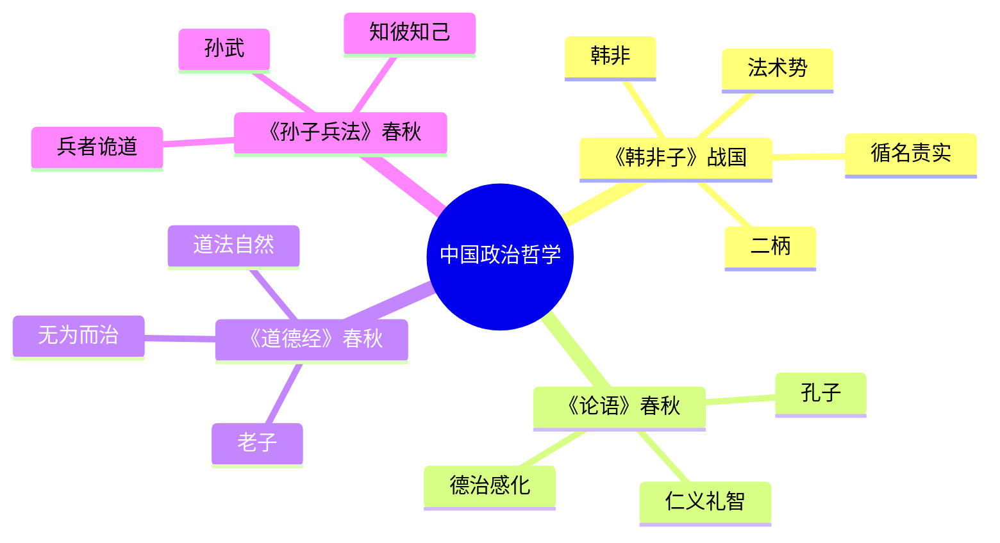
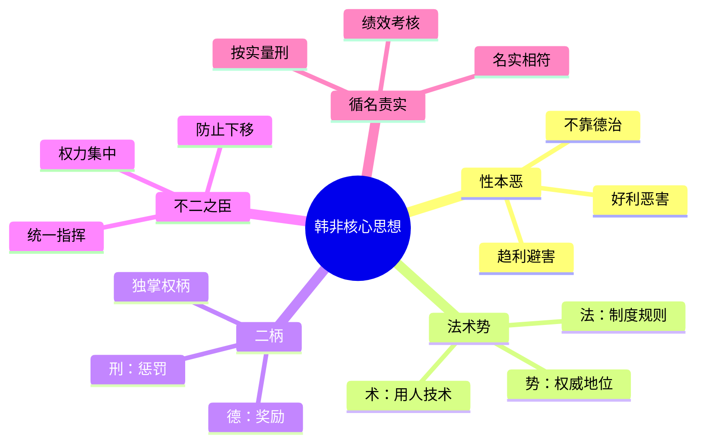

# 《韩非子》拆解记录

## 这本书要解决什么问题？

**核心困境**：春秋战国，礼崩乐坏。儒家说用道德感化人心，可几百年了，天下越来越乱。韩非问了一个冷冰冰的问题：如果人性本恶，靠道德说教有用吗？

他的答案同样冰冷——没用。不能指望人的道德自觉，要靠制度、赏罚和权术。这不是愤世嫉俗，这是韩非从战国乱象中提炼出的冷酷结论。

**一句话定位**：
> 用制度约束人性，用赏罚驱动行为，用权术驾驭臣下——不靠德治，靠法治。

### 作者站在什么位置说这些话？

| 维度 | 定位 |
|------|------|
| 主领域 | 法家思想（与儒家对立互补） |
| 跨界领域 | 政治哲学、组织管理、权力博弈 |
| 作者背景 | 韩国贵族，战国末期（约前280-前233年），与李斯同门师从荀子。不是君王，是给君王写操作手册的术士 |
| 历史语境 | 战国末期，各国争霸，人性中最黑暗的一面在战场上和朝堂上暴露无遗。韩非站在失败者韩国的贵族位置，冷眼看透权力游戏的本质。秦始皇读了他的书，感叹"寡人得见此人与之游，死不恨矣" |

### 和其他书有什么关系？

| 关联书籍 | 关联关系 | 共同底层逻辑 |
|----------|----------|--------------|
| [[论语-孔子-拆解记录]] | 对立 | 德治教化 vs 法治惩罚，人性本善 vs 人性本恶 |
| [[传习录-王阳明-拆解记录]] | 反向 | 致良知（向内） vs 二柄（向外控制） |
| [[孙子兵法-拆解记录]] | 不同层面 | 军事之术 vs 国家之法 |
| [[道德经-老子-拆解记录]] | 对立 | 道法自然 vs 法术驭人 |
| [[影响力-西奥迪尼-拆解记录]] | 跨时空呼应 | 西方说服心理学 vs 东方权力控制术 |

### 知识网络图

---

## 作者的核心论点

### 性本恶论——人性趋利避害，不能指望道德自觉

"好利恶害，夫人之所有也。"——韩非子一句话把人性说穿了：人人都追求好处，厌恶伤害。

他举了一个精妙的例子。造车的人希望你富贵，不是因为仁爱，是因为你富贵了他才能卖车。做棺材的人希望你早死，不是因为残暴，是因为死人多了他才能卖棺材。医生帮人吮吸伤口，不是因为善良，是因为这样才能赚钱。每个人都在趋利避害，道德说教改变不了这个底层逻辑。

这就引出了韩非的核心假设。儒家说人性本善，要用德治感化；法家说人性本恶，要用法治强制。韩非更进一步——人性就是趋利避害，不靠赏罚驱动，光靠说教，没用。

> **人性驱动定律**：人性趋利避害是客观事实，不能用道德感化来改变，只能用制度和赏罚来约束和驱动。

这个观点打碎了我的一个假设。以前总觉得"管理要靠信任和授权"，现在意识到：信任是好的，但制度更重要。别指望员工自觉，人性趋利避害。制度约束比道德感化可靠得多。

既然不能靠道德，那靠什么？韩非给出了三件利器。

### 法术势——统治的三件利器

"法者，宪令著于官府；术者，藏之于胸中；势者，胜众之资也。"

法是公开的规则，写在明面上，人人可见。术是君主心藏的驾驭之术，用来选人、用人、考人。势是权势、威势，是地位带来的力量。三者缺一不可：有法无术，规则会被钻空子；有术无法，臣下无所适从；有法有术无势，说了没人听。

这套体系的运作层级很清晰。公开层是法——制度、规则，摆在那里让所有人遵守。隐蔽层是术——权谋、策略，藏在君主心里。基础层是势——权位、威信，没有势，法和术都是空谈。目标层是"不二之臣"——不允许有第二个权力中心。

> **统治三要素定律**：法（公开规则）、术（驾驭之术）、势（权威地位）构成完整的统治体系，三者缺一不可。

我以前一直以为管理就是定好制度、执行到位，现在意识到这完全不够。制度是法，但还需要用人的策略（术）和创始人的威信（势）。公司治理就是：制度是法，领导权谋是术，创始人权威是势。

有了法术势这个框架，韩非接下来要解决一个更具体的问题：用什么来驱使人？

### 二柄——刑德并用，赏罚分明

"二柄：刑德也。杀戮之谓刑，庆赏之谓德。"

韩非说，君主手里必须握着两样东西：惩罚的权力和奖励的权力。做得好就赏，做得不好就罚，没有中间地带。这两个权柄必须君主独掌——一旦赏罚的权力落入臣下手中，君主就完了。

这其实就是现代管理学中最基本的激励理论，但韩非在2500年前就说透了。KPI的奖惩机制，本质上就是"二柄"。让员工看到利益（使民望利），不要随意惩罚（勿使民壑刑），赏罚必须透明、公开、按规则执行。

> **二柄定律**：赏罚是驱使人的根本机制，赏罚的权力必须集中在最高决策者手中，一旦分散，组织就会失控。

下次遇到团队执行力差的情况，我不会再想"怎么提高大家的积极性"，而是问"我的赏罚机制是不是有问题"——明确奖惩、严格执行，比任何动员讲话都有效。

但光有赏罚还不够。韩非发现，很多君主不是不想赏罚，而是权力被人架空了。怎么防止？

### 不二之臣——防止权力下移

"爱臣太亲，必危其身；人臣太贵，必易其主。"

臣子太亲近君主，会威胁君主安全。臣子地位太高，会轻视君主。韩非看到了一个残酷的规律：权力天然会下移。你不防，它就溜走了。

他设了三道防线。亲近线：亲信关系是双刃剑，太亲近反而危险。地位线：功高盖主，迟早出事。擅权线：授权要看时机，有害时放手信任，无害时严密控制。制度线：君执柄以处臣——君掌决策权，臣只有执行权。

> **权力防线定律**：权力天然会下移，必须通过制度设计防止亲信专权、功高盖主和授权失控。

这打碎了我对"信任团队"的迷信。以前觉得充分授权就是好领导，现在才明白：信任是好事，但人事权和财务权永远不能放。创始人警惕"爱臣太亲"，不是多疑，是生存智慧。

防住了权力下移，下一个问题是：怎么考核臣下的实际表现？

### 循名责实——按实际功劳考核，不看报告

"循名而责实，按实而量刑。"

名是官职和承诺，实是实际表现。韩非说，考核臣下，不看他说了什么，看他做了什么。群臣报告的话，不要全听，要对照实际情况。有功者必赏，有罪者必罚，不感情用事。

四个原则：名实相符——报告和实际必须一致；客观评价——不轻信汇报；严格赏罚——有功必赏，有罪必罚；防止欺瞒——按实际情况量刑。这不就是现代KPI考核的鼻祖吗？目标就是名，结果就是实，名实必须相符。

> **名实考核定律**：考核不看报告看实际，赏罚不主观依规则；名实相符是绩效考核的核心原则。

这个洞察穿越了2500年，至今仍是现代管理的基石。OKR制度：目标就是名，结果就是实，名实必须相符。不看PPT，看数据——循名责实。

以前我总觉得绩效考核就是走形式，现在意识到：问题不是考核本身没用，而是考核的标准不对。循名责实的核心是"按实际结果说话"——只要你用对了标准，考核就是最公平的管理工具。

循名责实解决了"怎么考核"的问题，韩非最后要讲的，是一种看似矛盾实则精妙的领导境界。

### 无为而治——君主隐藏好恶

"虚静无事，以示观臣下之巧拙。"韩非说的"无为"和老子的完全不同。

老子的无为是顺应自然规律，韩非的无为是君主装作没事，暗中观察臣下的真实表现。"藏天于胸中"——隐藏真实目的，不暴露好恶。"去智与巧"——不用聪明技巧，让规则说话。表面上看君主没在做事，实际上在暗中观察、用制度控制。

这套"无为"有三个层次。表面层：虚静无事，君主看起来没在做事。实际层：以示观臣下之巧拙，暗中观察。心理层：藏天于胸中，隐藏真实目的。控制层：去智与巧，不用聪明技巧，用制度控制。

> **韩非无为定律**：君主的最佳状态是隐藏好恶、暗中观察，让制度说话而非靠个人聪明。

看似无为而治，实则用制度控制。这和现代管理学中的"servant leadership"有异曲同工之处——好的领导不在前面瞎指挥，而是建好制度，让团队自己运转。

这打碎了我对"无为"的单一理解。以前以为只有老子的无为才是高明，现在才明白：韩非的无为是另一种境界——不是顺其自然，而是隐藏意图、用制度控制。表面上看是同一个词，骨子里是完全不同的智慧。

---

## 这本书的局限

> 韩非的法术势体系是从战国乱世中提炼的权力操控术，这套方法有它的边界。

| 批评点 | 谁在批评 | 怎么说 | 实际情况 |
|--------|---------|--------|---------|
| 太冷酷没人情 | 儒家、人道主义者 | 把人当工具，用赏罚驱使 | 确实缺乏对人的尊重，但在乱世中"有用"比"好看"重要 |
| 只有君主能用 | 管理学界 | 法术势是帝王术，普通人无法复制 | 核心原则（制度设计、赏罚分明）可简化应用，但集权文化确实不适合现代组织 |
| 人性本恶太极端 | 儒家、心理学家 | 人性不是只有趋利避害 | 趋利避害确实是底层驱动，但人有更高层次的需求（尊重、自我实现） |
| 导致暴政 | 历史学家 | 秦朝用法家治国，二世而亡 | 制度设计需要制衡，韩非只讲集权不讲制衡，确实容易走向暴政 |
| 术的层面太阴暗 | 道德论者 | 驾驭臣下的权谋太阴暗 | 组织政治确实存在，但把一切都当成权力博弈，会失去信任 |

**一句话总结局限性**：
> 韩非的制度设计（法）和考核方法（循名责实）普适性最强，权力操控术（术）则需要在现代语境下大幅调整——集权可以学制度思维，但不能学专制手段。

---

## 最值得记住的话

**原书说的**：
1. "二柄：刑德也。杀戮之谓刑，庆赏之谓德。"
2. "法者，宪令著于官府；术者，藏之于胸中；势者，胜众之资也。"
3. "爱臣太亲，必危其身；人臣太贵，必易其主。"
4. "循名而责实，按实而量刑。"
5. "君执柄以处臣，臣持柄以事君。"
6. "好利恶害，夫人之所有也。"
7. "虚静无事，以示观臣下之巧拙。"
8. "圣人之道，去智与巧。"
9. "有功者必赏，有罪者必罚。"
10. "上以名举，臣以实应。"

**翻译成人话**：
1. 管人就两样东西：赏和罚，必须自己拿着
2. 法是公开规则，术是暗中手段，势是权威地位，三样缺一不可
3. 亲信太亲近会害你，下属太厉害会替代你
4. 考核不看报告看实际，按结果定赏罚
5. 老板掌决策权，员工只有执行权
6. 人性就是趋利避害，别指望道德自觉
7. 好的领导看似没事，其实在暗中观察
8. 别耍小聪明，让规则说话
9. 做得好就奖，做得差就罚，不感情用事
10. 你说目标，他出结果，对得上才行
11. 制度比道德可靠，赏罚比说教有效
12. 权力只能有一个中心，多头管理必乱
13. 聪明人往往失败，因为太依赖聪明
14. 韩非不讲道德，讲人性——制度约束比道德感化可靠

---

## 讲给没读过的人听

你有没有发现，有些管理者整天给团队讲道理、搞团建、谈理想，团队还是一塌糊涂？而有些管理者不怎么说话，团队却运转得很好？

2500年前，韩非就把这事想透了。他说：别指望人的道德自觉——人性就是趋利避害的。造车的人希望你富贵，不是因为善良，是因为你能买他的车。做棺材的人希望你早死，不是因为恶毒，是因为死人多了他能赚钱。

所以怎么办？韩非说用三样东西：法、术、势。法是公开的规则，写在明面上；术是用人的策略，藏在心里；势是你的权威和地位。三者缺一不可。

然后抓住两个权柄：赏和罚。做得好就奖，做得差就罚，别感情用事。这两个权柄必须你自己拿着，一旦放出去，你就管不住了。

还有一个关键：考核不看报告，看实际。名实必须相符——你说你能做到什么，我就看你做到了没有。这不就是今天的KPI吗？

韩非的智慧听起来冷酷，但很实用。制度比道德可靠，赏罚比说教有效。他不是教你做坏人，是教你在人性面前保持清醒。

---

## 用来检验理解的问题

**基础回忆**：
1. Q: 韩非的"法术势"分别指什么？
   A: 法是公开的制度规则，术是君主驾驭臣下的权谋策略，势是权位带来的权威。三者缺一不可。

2. Q: "二柄"是什么？
   A: 刑和德——惩罚和奖励。这两个权柄必须君主独掌，不能落入臣下手中。

3. Q: "循名责实"的核心是什么？
   A: 按照名号（承诺/官职）去查实情，按实际表现定赏罚。不看报告看数据。

**理解验证**：
1. Q: 为什么韩非认为"爱臣太亲，必危其身"？
   A: 亲信关系是双刃剑，太亲近意味着信息不对称减少，臣下容易利用亲密关系扩张权力，最终架空君主。

2. Q: 韩非的"无为"和老子的"无为"有什么不同？
   A: 老子的无为是顺应自然规律；韩非的无为是君主隐藏好恶、暗中观察，用制度控制而非靠个人聪明。

3. Q: 韩非为什么反对德治？
   A: 人性趋利避害，不能指望道德自觉。制度约束比道德感化更可靠、更持久。

**实际应用**：
1. Q: 用韩非的思维，一个创业公司该怎么设计管理体系？
   A: 法=公开透明的制度，术=选人用人的策略，势=创始人的权威和威信。二柄=人事权和财务权必须集中在创始人手中。循名责实=KPI考核不看PPT看数据。

2. Q: 韩非的"不二之臣"在现代组织中怎么理解？
   A: 统一指挥链——一个组织只能有一个决策中心，多头管理必然导致混乱。但这不意味着独裁，而是权责清晰。

**深度分析**：
1. Q: 韩非和孔子，谁的人性观更接近现实？
   A: 两者都有道理。人性确实趋利避害（韩非对），但人也有追求意义和尊重的需求（孔子对）。现代管理学综合了两者：用制度约束底线（法家），用文化激发上限（儒家）。

2. Q: 为什么秦朝用法家治国却二世而亡？
   A: 韩非只讲集权不讲制衡，只讲惩罚不讲激励上限。暴政可以快速统一，但无法持久。制度的刚性在乱世是优势，在治世是劣势。

---

## 和其他书的对话

孔子和韩非是中国政治哲学的两极。孔子说人性本善，要靠德治教化；韩非说人性本恶，要靠法治强制。孔子相信"有教无类"，韩非相信"有功必赏、有罪必罚"。一个向内求德，一个向外求法。但这两种观点不是互斥的——现代最好的组织管理，恰恰是"外儒内法"：制度设计用韩非（赏罚分明、循名责实），文化建设用孔子（仁爱感化、有教无类）。

王阳明和韩非走了完全相反的路。王阳明说"致良知"——向内唤醒每个人的良知；韩非说"二柄"——向外控制臣下的行为。一个修心，一个治术。但两者并不矛盾：韩非管的是底线（人不做什么），王阳明管的是上限（人能成为什么）。底线靠制度，上限靠心性。

孙子和韩非在不同层面做同样的事。孙子讲军事战略——战场上的知彼知己、避实击虚；韩非讲国家治理——朝堂上的法术势、二柄。都是"术"的层面，一个军事，一个政治。但相通的底层逻辑是：信息优势决定胜负，策略比蛮力重要。

西奥迪尼和韩非都在研究"怎么让别人按你的意图行动"。西奥迪尼用心理学原理（互惠、承诺、社会认同），韩非用制度设计（赏罚、考核、权力集中）。一个靠说服，一个靠控制。但两者结合才是完整的：制度设底线，影响力拉上限。

老子是韩非的哲学反面。老子说"道法自然"，让事物自己发展；韩非说"法术势"，用制度控制一切。一个信自然，一个信人为。但有趣的是，韩非的"无为而治"（君主隐藏好恶、暗中观察）明显借鉴了老子的思想——只不过老子是真的无为，韩非是假装无为、暗中操控。

---

*拆解日期：2026-02-14*
*下次回访：1周后回顾「讲给没读过的人听」和「检验问题」*
