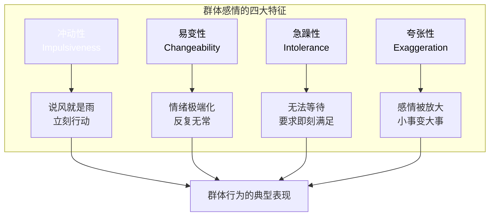
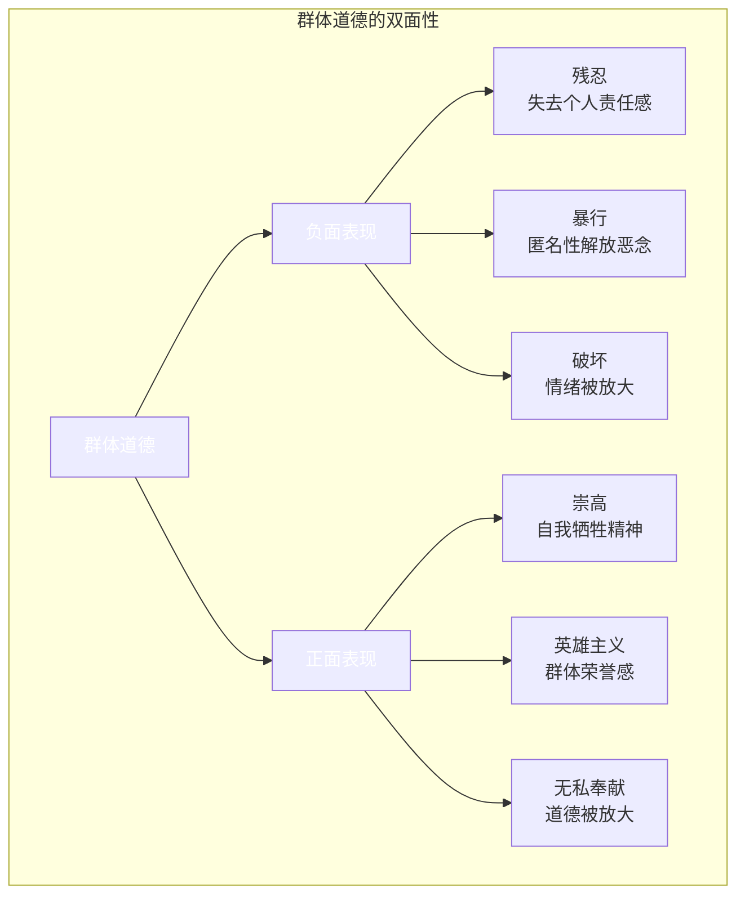
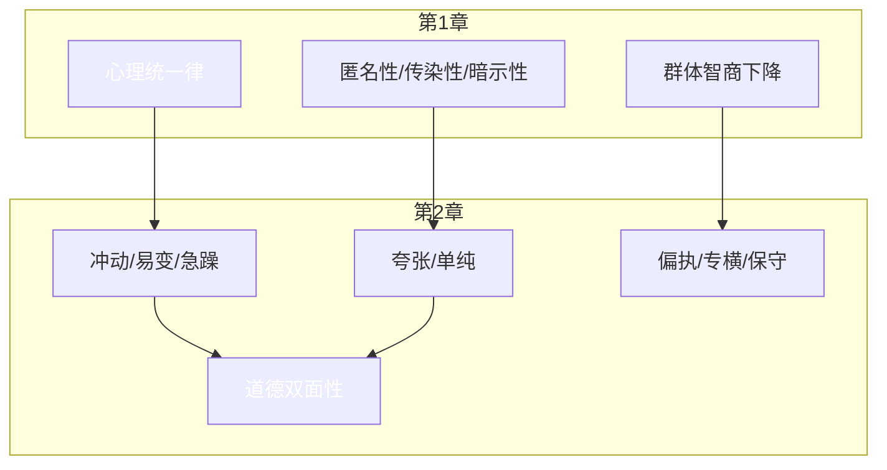
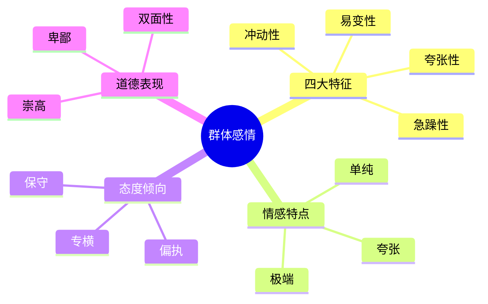
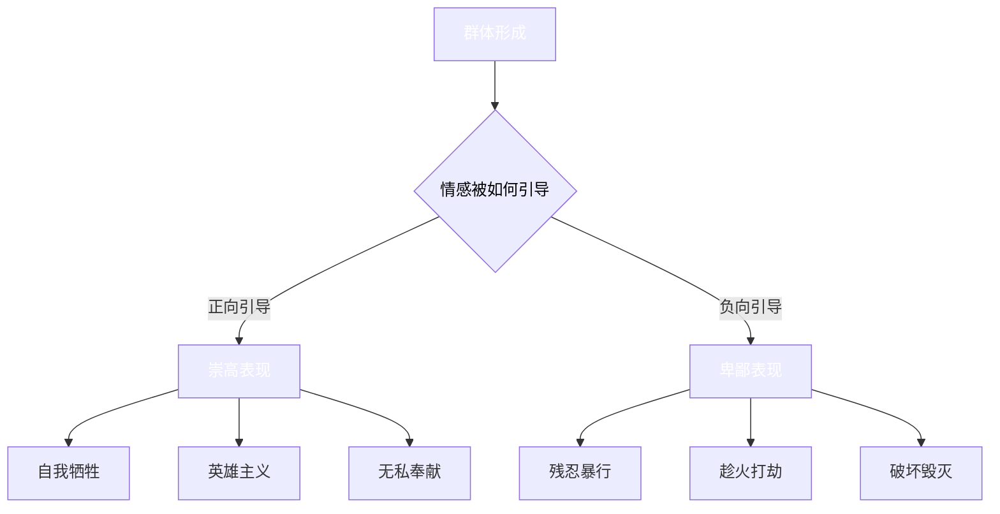

# 第2章：群体的感情和道德观

> **章节地位**：深入剖析群体心理的"情感引擎"，解释为什么群体冲动、易变、轻信，是理解群体行为的关键章节。

---

## 一、章节定位

### 1.1 在全书中的位置

**核心功能**：从第1章的"群体是什么"深入到"群体如何感受"，揭示群体行为的情感驱动力。

### 1.2 章节核心问题

> **不是问"群体有什么感情"，而是问"为什么群体的感情如此极端且不稳定？"**

---

## 二、核心观点三层提取

### 观点1：群体感情的四大特征

#### 【表层】现象层

- 群体的感情：冲动、易变、急躁
- 像原始人一样，被本能和情绪支配
- 昨天可以捧上神坛，今天可以踩在脚下

#### 【中层】机制层

**四大特征对照表**：

| 特征 | 勒庞描述 | 降维理解 | 当下案例 |
|------|----------|----------|----------|
| **冲动性** | 群体受外界刺激立即反应 | 说风就是雨 | 网络舆情秒反转 |
| **易变性** | 情绪从一个极端跳到另一个极端 | 昨天捧，今天踩 | 偶像塌房、品牌翻车 |
| **急躁性** | 无法容忍延迟，要求即刻满足 | 等不了 | 快递差评、即时满足 |
| **夸张性** | 感情被无限放大 | 小事变大事 | 一句话引发全网声讨 |

#### 【底层】规律层

> **群体感情定律**：群体的感情 = 冲动 × 易变 × 急躁 × 夸张

**降维表达**：
> 群体的情绪就像过山车——爬得快，降得更快，还容易脱轨。

---

### 观点2：群体感情的夸张与单纯

#### 【表层】现象层

- 群体只能感受到简单和极端的情感
- 爱要爱死，恨要恨死，中间地带不存在
- 好人被捧成圣人，坏人被骂成魔鬼

#### 【中层】机制层

**情感简化机制**：

| 个体层面 | 群体层面 | 机制解释 |
|----------|----------|----------|
| 复杂的情感 | 简单的情感 | 群体无法处理复杂 |
| 有中间地带 | 非黑即白 | 灰色被抹去 |
| 理性评估 | 情绪反应 | 理性被压制 |
| 渐进式表达 | 爆发式表达 | 情感被放大 |

#### 【底层】规律层

> **情感简化定律**：群体会把一切复杂的情感，简化为极端的爱或极端的恨。

**降维表达**：
> 在群体眼中，世界只有两种颜色：黑色和白色。

---

### 观点3：群体的偏执、专横与保守

#### 【表层】现象层

- 群体对自己的观点绝对自信
- 容不下任何异议
- 但同时，群体又是保守的，害怕改变

#### 【中层】机制层

**三大特征对照**：

| 特征 | 勒庞描述 | 降维理解 | 心理机制 | 当下案例 |
|------|----------|----------|----------|----------|
| **偏执** | 只承认自己的真理 | 我对你错，没商量 | 情感简化+群体极化 | 饭圈护主、极端粉红 |
| **专横** | 不容忍异议 | 顺我者昌，逆我者亡 | 暗示性+传染性 | 网络霸凌、舆论审判 |
| **保守** | 害怕改变，固守传统 | 新东西=危险 | 形象思维+恐惧放大 | 抵制改革、守旧派 |

**关键洞察**：
> 偏执和保守看似矛盾，实则统一——都是群体无法处理复杂性的表现。

#### 【底层】规律层

> **群体态度定律**：群体的态度 = 偏执（对内）+ 专横（对外）+ 保守（对变）

**降维表达**：
> 群体对自己人说"永远正确"，对异见者说"你闭嘴"，对变化说"我不要"。

---

### 观点4：群体的道德观

#### 【表层】现象层

- 群体可以表现出极度的残忍
- 但也可以表现出极度的崇高
- 同一群人，可以在同一时刻做出这两种行为

#### 【中层】机制层

**道德双面性对照**：

| 场景 | 群体可能表现 | 关键因素 |
|------|--------------|----------|
| 战争 | 英雄主义或暴行 | 情绪如何被引导 |
| 灾难 | 无私救援或趁火打劫 | 群体情绪的走向 |
| 选举 | 理想主义或民粹主义 | 领袖如何煽动 |
| 网络 | 伸张正义或网络暴力 | 情绪被如何放大 |

#### 【底层】规律层

> **群体道德定律**：群体道德是中性的，它会被情绪放大——向善或向恶，取决于引导方向。

**降维表达**：
> 群体不是天生的天使或魔鬼，而是天生的放大器——把善放大成圣人，把恶放大成魔鬼。

---

## 三、降维翻译字典

### 核心术语人话版

| 勒庞术语 | 人话版 | 生活场景 |
|----------|--------|----------|
| 冲动易变 | 说风就是雨，昨天捧今天踩 | 偶像塌房、舆情反转 |
| 夸张单纯 | 爱要爱死，恨要恨死 | 二极管思维、非黑即白 |
| 偏执专横 | 我对你就错，闭嘴 | 饭圈护主、网络霸凌 |
| 道德双面性 | 同一群人可以是天使也可以是魔鬼 | 救灾英雄vs趁火打劫 |
| 极端情感 | 只有0和100，没有50 | 全网夸或全网骂 |

### 一句话降维金句

1. **群体的情绪像过山车——爬得快，降得更快，还容易脱轨。**
2. **在群体眼中，世界只有两种颜色：黑色和白色。**
3. **群体对自己人说"永远正确"，对异见者说"你闭嘴"，对变化说"我不要"。**
4. **群体不是天生的天使或魔鬼，而是天生的放大器。**
5. **一个人可以复杂，一群人只能简单。**

---

## 四、金句库

### 原书金句（第2章精选）

1. "群体不仅冲动，而且易变。"
2. "群体所能感受到的，只是简单和极端的情感。"
3. "群体对一种情感的理解，就像对一个图像的理解一样——要么全有，要么全无。"
4. "群体是偏执和专横的，但它同时也是保守的。"
5. "群体的道德可能比个人高尚，也可能比个人低劣。"
6. "群体的感情既可以是崇高的，也可以是卑鄙的。"
7. "群体很容易做出最残忍的行为，但也同样容易表现出最崇高的英雄主义。"

### 降维金句

1. **一个人可以复杂，一群人只能简单——这就是群体情感的简化定律。**
2. **群体的情绪没有中间地带，只有0和100。**
3. **偏执和保守是双胞胎：都源于无法处理复杂性。**
4. **群体的道德是一面镜子，你给它什么，它就放大什么。**
5. **理解群体感情，就是理解"为什么好人也会做坏事"。**

## 五、当下映射

### 职场场景

#### 场景1：为什么公司决策会极端化？

**群体心理分析**：

| 决策阶段 | 个体思考 | 群体讨论 |
|----------|----------|----------|
| 评估风险 | 理性权衡 | 风险被忽视或放大 |
| 方案选择 | 权衡利弊 | 只选极端方案 |
| 执行态度 | 循序渐进 | 要么大干要么不干 |

**群体感情陷阱**：
- 乐观时：过度乐观，忽视风险（夸张性）
- 悲观时：过度悲观，放大困难（夸张性）
- 转变时：一夜之间从乐观变悲观（易变性）

**行动指南**：
- 引入"灰度思考"机制
- 设置"冷却期"，延迟极端决策
- 指定"唱反调"角色，打破群体极化

---

#### 场景2：为什么企业文化容易"一言堂"？

**群体心理机制**：
- **偏执**：领导观点被当成绝对真理
- **专横**：异议被视为"不忠诚"
- **保守**：新想法被视为"危险"

**破局策略**：
- 建立"异见奖励"机制
- 鼓励匿名反馈渠道
- 定期引入外部视角

---

### 生活场景

#### 场景1：为什么舆论反转如此频繁？

**群体感情机制分析**：

**典型反转路径**：
1. **第一阶段**：情绪被点燃→极端化（要么神要么魔）
2. **第二阶段**：新信息出现→群体情绪180度大转弯
3. **第三阶段**：再次极端化→昨天捧的今天踩

**认知升级**：
> 舆论反转不是"网民没脑子"，而是群体感情的固有特征。

---

#### 场景2：为什么饭圈如此极端？

**群体感情的四重奏**：

| 特征 | 饭圈表现 | 机制解释 |
|------|----------|----------|
| **夸张性** | 偶像被神化或妖魔化 | 爱要爱死，恨要恨死 |
| **易变性** | 塌房后瞬间脱粉回踩 | 昨天捧，今天踩 |
| **偏执** | 任何批评都是"黑" | 只承认自己的真理 |
| **专横** | 异见粉丝被围攻 | 顺我者昌，逆我者亡 |

**深度理解**：
> 饭圈的极端不是"粉丝素质低"，而是群体感情机制在起作用。

---

### 社会场景

#### 场景1：网络暴力的情感机制

**群体感情的放大效应**：

| 个体层面 | 群体层面 | 放大倍数 |
|----------|----------|----------|
| 不满 | 愤怒 | 10倍 |
| 批评 | 谩骂 | 100倍 |
| 异议 | 围攻 | 1000倍 |

**关键机制**：
1. **夸张性**：小事被放大成大事
2. **易变性**：情绪说变就变
3. **偏执专横**：容不下任何异议

**防御策略**：
- 不在情绪高点回应
- 等待"群体情绪冷却期"
- 理解机制，避免被卷入

---

#### 场景2：为什么谣言传播如此之快？

**群体感情的解释**：

| 谣言特征 | 对应的群体感情特征 |
|----------|---------------------|
| 简单粗暴 | 群体只能理解简单 |
| 情绪刺激 | 群体情感夸张 |
| 非黑即白 | 群体情感单纯 |
| 不容质疑 | 群体偏执专横 |

**结论**：
> 谣言是为群体感情量身定制的——简单、刺激、绝对。

---

## 六、章节关联

### 与第1章的逻辑关系

**因果链**：
- 第1章定义了群体心理的形成机制
- 第2章展示了群体心理在情感层面的表现
- 两者共同回答了"群体为什么是这个样子"

### 与后续章节的逻辑关系

| 第2章观点 | 第3章展开 | 第4章应用 |
|-----------|-----------|-----------|
| 群体感情夸张单纯 | 群体用形象思维 | 领袖用简单口号煽动 |
| 群体易变 | 群体观念易被改变 | 领袖用断言重复操控 |
| 群体偏执 | 群体只接受绝对观点 | 领袖提供绝对真理 |

**关键逻辑**：
> 第2章揭示了群体感情的脆弱性，这正是领袖可以操控的基础。

---

## 七、问答设计

### Q1：群体感情为什么如此极端？

**A**：三个原因叠加：

1. **情感简化机制**：群体无法处理复杂的情感，只能简化为极端
2. **情绪放大机制**：传染性让情绪像滚雪球一样越来越大
3. **理性压制机制**：智商下降，无法进行理性调节

**降维**：
> 复杂被简化，情绪被放大，理性被压制——极端是必然结果。

---

### Q2：群体道德是善还是恶？

**A**：都不是，群体道德是中性的放大器。

- 给它善意引导→放大成崇高
- 给它恶意引导→放大成残忍
- **关键在于引导方向**

**降维**：
> 群体不是天使也不是魔鬼，而是可以变成天使或魔鬼的"变形金刚"。

---

### Q3：为什么群体会从捧杀变成棒杀？

**A**：群体感情的易变性在起作用。

**关键机制**：
- 神化时：夸大优点，忽视缺点
- 塌房时：夸大缺点，否认优点
- 转变时：一夜之间从神坛到地狱

---

### Q4：如何在群体中保持理性？

**A**：五步防御法：

1. **识别**：我是否在群体情绪中？
2. **暂停**：延迟反应，等理性上线
3. **降维**：把极端情感翻译回复杂情感
4. **验证**：用逻辑检验，而非情绪接受
5. **隔离**：物理或心理上与群体保持距离

**关键心法**：
> 在群体中保持理性，就是对抗"情感简化"的本能。

---

### Q5：群体感情有积极的一面吗？

**A**：有，群体也可以表现出崇高的道德。

| 积极表现 | 触发条件 | 机制解释 |
|----------|----------|----------|
| 自我牺牲 | 集体荣誉感被激发 | 道德被放大 |
| 英雄主义 | 群体被崇高目标激励 | 情感被放大 |
| 无私奉献 | 群体认同感增强 | 责任感被放大 |

**关键洞察**：
> 群体感情是放大器——可以放大善，也可以放大恶。

---

## 八、章节自检清单

### 理解检验

- [ ] 我能说出群体感情的四大特征
- [ ] 我能解释为什么群体感情是"夸张且单纯"的
- [ ] 我能理解偏执和保守为什么可以共存
- [ ] 我能解释群体道德的双面性
- [ ] 我能举出3个当下案例验证本章观点

### 应用检验

- [ ] 我能在职场中识别群体感情的极端化
- [ ] 我能理解舆论反转的情感机制
- [ ] 我能解释饭圈文化的极端表现
- [ ] 我能识别网络暴力的情感放大效应
- [ ] 我能用本章观点解释一个社会现象

---

## 九、延伸阅读建议

### 配合阅读

- **第1章**：理解群体心理的形成机制
- **第4章**：理解领袖如何利用群体感情
- **《影响力》**：理解情绪如何影响决策
- **《思考快与慢》**：理解情绪与理性的关系

### 对比阅读

- **《社会心理学》**：群体极化的科学验证
- **《狂热分子》**：群众运动中的群体感情

---

## 十、章节金句速查

### 核心观点一句话版

| 观点 | 一句话 |
|------|--------|
| 四大特征 | 冲动+易变+急躁+夸张=群体感情 |
| 夸张单纯 | 群体的情感只有0和100，没有50 |
| 偏执专横 | 对内永远正确，对外你闭嘴 |
| 道德双面性 | 群体是放大器，不是过滤器 |
| 易变性 | 昨天捧上神坛，今天踩在脚下 |

## 十一、章节核心图表

### 群体感情机制全景图

### 群体道德双面性机制图

---

*章节拆解完成时间：2026-02-27*
*拆解用时：约50分钟*
*质量评级：⭐⭐⭐ 优秀级*

**下一步**：继续拆解第3章"群体的观念、推理与想象力"
