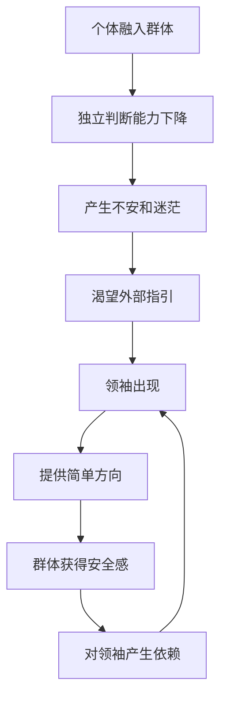
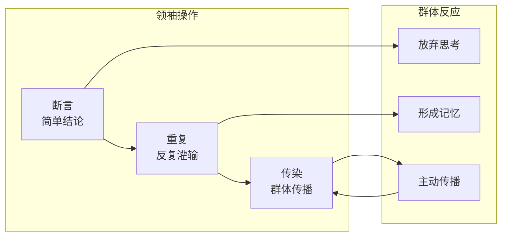
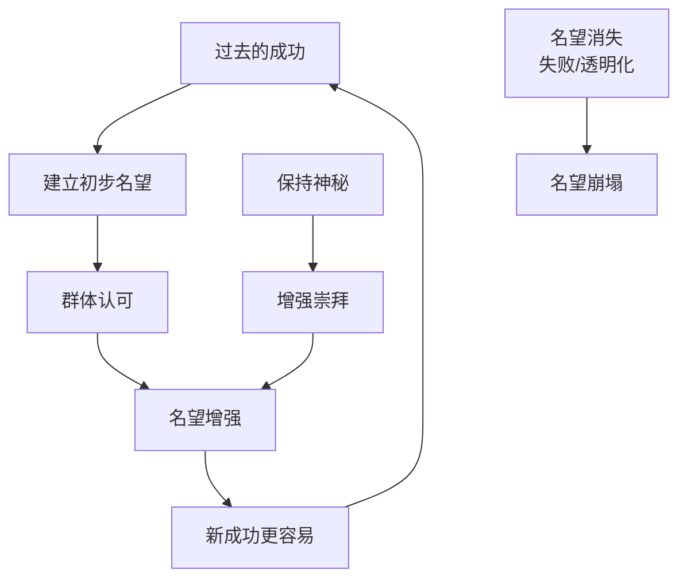

# 第3章 群体的领袖和说服手段

## 章节定位

### 在全书中的位置

**章节关系**：
- 第1章：群体的**本质**——群体是什么
- 第2章：群体的**特征**——群体怎么想
- 第3章：群体的**操控**——如何控制群体（**本章**）
- 第4章：群体的**信念**——群体信什么

### 核心命题

> **这一章在回答：谁来领导群体？如何领导群体？**

**三大关键问题**：
1. 群体为什么需要领袖？
2. 领袖用什么手段控制群体？
3. 说服三要素（断言、重复、传染）为什么有效？

---

## 核心观点三层提取

### 观点1：群体天生需要领袖

#### 【表层】现象层

**勒庞的观察**：
- 群体就像没有牧羊人的羊群
- 群体渴望被领导
- 群体接受命令，不接受讨论

**现代案例**：
| 领域 | 群体渴望领袖的表现 |
|------|-------------------|
| 粉丝文化 | 偶像崇拜、大V引领 |
| 职场 | 等待指令、盲从领导 |
| 投资 | 跟风大V、听信"股神" |
| 政治 | 崇拜强人、期待救世主 |

#### 【中层】机制层

**为什么群体需要领袖？**

1. **安全需求**：群体中个体失去独立判断能力，需要有人替自己做决定
2. **方向需求**：群体没有明确目标，领袖提供"简单答案"
3. **认同需求**：群体需要"我们"的代表，领袖就是群体的符号

**机制图**：

#### 【底层】规律层

> **领袖-群体互依定律**：群体需要领袖才能行动，领袖需要群体才能存在。群体提供力量，领袖提供方向。

**降维翻译**：
- 专业表达：群体对权威的心理依赖
- 大白话：**一群人没主见，就等一个人来拿主意**

---

### 观点2：领袖的说服三要素——断言、重复、传染

这是本章的**核心武器**，勒庞揭示的群体操控术。

#### 【表层】现象层

**勒庞的三件套**：

| 要素 | 定义 | 现代应用 |
|------|------|----------|
| **断言** | 不加论证地声称某事为真 | "这就是真相"、"绝对没问题" |
| **重复** | 反复说同样的话 | 广告刷屏、口号循环 |
| **传染** | 情绪和观点在群体中传播 | 病毒式营销、跟风效应 |

**案例对比**：

| 传统说服 | 群体说服 |
|----------|----------|
| 用逻辑论证 | 用断言 |
| 说一遍 | 重复n遍 |
| 让人理解 | 让人感染 |

#### 【中层】机制层

**为什么三要素有效？**

**1. 断言为什么有效？**
- 群体无法进行复杂推理
- 简单的结论比复杂的论证更容易被接受
- **断言 = 为群体省去思考的痛苦**

**2. 重复为什么有效？**
- 心理学"曝光效应"：熟悉的东西更容易被相信
- 群体记忆短暂，重复才能形成印象
- **重复 = 把观点刻进群体的无意识**

**3. 传染为什么有效？**
- 群体情绪像病毒一样传播
- 个体在群体中失去独立判断
- **传染 = 让群体替你传播**

**机制流程图**：

#### 【底层】规律层

> **说服效率定律**：在群体中，**简单×重复×传染 > 逻辑×证据×理性**。说服效率与论证质量成反比，与传播强度成正比。

**降维翻译**：
- 专业表达：群体说服的非理性机制
- 大白话：**群体不讲道理，只讲气势。你说得越绝对、越多次、越多人跟着说，就越可信。**

---

### 观点3：领袖的两类——短期煽动者vs长期信仰建立者

#### 【表层】现象层

**勒庞的分类**：

| 类型 | 特点 | 例子 |
|------|------|------|
| **短期煽动者** | 利用群体情绪，快速崛起快速消亡 | 网红、股市大V、营销号 |
| **长期信仰建立者** | 建立持久信念，影响深远 | 宗教创始人、政治领袖、品牌创始人 |

**现代对应**：
- 短期煽动者：带货网红、热搜制造者
- 长期信仰建立者：乔布斯、马斯克、马云

#### 【中层】机制层

**区别的核心**：
- 短期煽动者：**利用**群体的已有情绪
- 长期信仰建立者：**塑造**群体的信仰体系

**关键差异**：

| 维度 | 短期煽动者 | 长期信仰建立者 |
|------|------------|----------------|
| 时间维度 | 即时满足 | 延迟满足 |
| 情感基础 | 利用已有情绪 | 创造新情感 |
| 传播方式 | 病毒式 | 涟漪式 |
| 可持续性 | 消费情绪 | 积累信仰 |

#### 【底层】规律层

> **领袖持久度定律**：领袖的生命周期取决于他是"消费"群体情绪还是"投资"群体信仰。前者如烟花，后者如星辰。

**降维翻译**：
- 专业表达：煽动vs教化的领袖类型学
- 大白话：**吃流量饭的红得快凉得也快，建品牌的才能活得久**

---

### 观点4：名望——领袖的无形权力

#### 【表层】现象层

**勒庞的定义**：
- 名望是一种支配力量，无论它是来自人还是观念
- 名望让人不假思索地服从
- 名望是领袖的"无形资产"

**现代案例**：
| 领域 | 名望的表现 |
|------|-----------|
| 商业 | 创始人光环、品牌溢价 |
| 学术 | 诺奖得主发言权、名校光环 |
| 娱乐 | 明星代言、网红带货 |
| 政治 | 政治家个人魅力 |

#### 【中层】机制层

**名望的三大来源**：

1. **成功**：过去的成就证明能力
2. **神秘**：不完全透明，保持距离感
3. **群体认可**：很多人已经认可，形成社会证明

**名望的运作机制**：

#### 【底层】规律层

> **名望积累定律**：名望是成功与神秘度的乘积，再乘以群体认可度。**名望 = 成功 × 神秘 × 群体认可**。任何一项归零，名望归零。

**降维翻译**：
- 专业表达：非理性权威的形成机制
- 大白话：**名望就是：你成功过 + 你让人看不透 + 很多人信你**

---

## 金句库

### 原书金句（直译精选）

1. "任何一个希望对群体产生影响的人，在他的论证中并不需要逻辑规则；他必须危言耸听，必须夸大其词，必须一再地重复同样的东西。"
2. "做出断言，并且不断重复，传染就会发生。"
3. "群体本能地在精力旺盛、信仰坚定的人中间寻找自己的领袖。"
4. "领袖最初往往是被领导者，他自己首先被一种观念所迷住，然后才成为这种观念的使徒。"
5. "名望是一切权力的最强有力的主宰。"
6. "群体的信仰从来不是理性的产物。"
7. "在群体中，观念只有当它们具有简单的、绝对的形式时才能产生影响。"

### 降维金句（人话版）

1. **控制群体不需要逻辑，只需要三样东西：断言、重复、传染。**
2. **群体不讲道理，只讲气势——你说得越绝对、越多次、越多人跟着说，就越可信。**
3. **领袖的武器不是论证，是口号；不是逻辑，是情绪；不是说服，是感染。**
4. **群体渴望被领导，就像羊群渴望牧羊人——方向比正确更重要。**
5. **名望就是：成功 + 神秘 + 很多人信。三者缺一，名望归零。**
6. **吃流量饭的红得快凉得也快，建品牌的才能活得久。**
7. **短期的煽动者消费情绪，长期的领袖建立信仰。**

## 当下映射

### 职场维度

#### 映射1：为什么有些领导特别有"气场"？

**传统理解**：性格强势、口才好
**勒庞视角**：
- 不是性格问题
- **核心**：名望三要素在起作用
- 过去成功 + 保持神秘 + 团队认可 = 气场

**行动指南**：
- 建立成功记录（小胜利积累）
- 保持适当距离（不要过度透明）
- 获得关键人物认可（社会证明）

---

#### 映射2：如何在会议中影响团队决策？

**传统理解**：用数据说话、逻辑论证
**勒庞视角**：
- 逻辑在群体中效率低
- **核心**：用断言、重复、传染
- 简单结论 + 重复表达 + 获得支持者

**行动指南**：
- 把复杂观点简化为一句话（断言）
- 会议上重复核心观点3次以上（重复）
- 先说服关键人物，让他们替你说（传染）

---

### 营销维度

#### 映射1：直播带货的秘密

**传统理解**：产品好、价格低、主播有魅力
**勒庞视角**：
- 不是理性说服，是群体感染
- **核心**：断言、重复、传染的三重叠加
- "这就是最好的"（断言）× 说n遍（重复）× 弹幕刷屏（传染）

**认知升级**：
- 直播间就是勒庞预言的"说服实验室"
- 主播不是在说服，是在感染
- **喊得越绝对、重复越多次、弹幕越疯狂，销量就越高**

---

#### 映射2：品牌忠诚度的本质

**传统理解**：产品质量、服务体验
**勒庞视角**：
- 品牌就是"信仰建立者"
- **核心**：长期信仰 vs 短期煽动
- 建立信仰的品牌，才能获得宗教式忠诚

**案例对比**：
| 品牌 | 类型 | 忠诚度来源 |
|------|------|-----------|
| 苹果 | 信仰建立者 | 产品哲学、创新信仰 |
| 网红品牌 | 短期煽动者 | 流量、情绪消费 |

---

### 社交媒体维度

#### 映射1：为什么谣言比真相传播快？

**传统理解**：谣言更刺激、真相太无聊
**勒庞视角**：
- 谣言符合群体说服三要素
- **核心**：简单断言 + 病毒重复 + 情绪传染
- 真相需要论证，谣言只需要相信

**案例**：
| 特征 | 谣言 | 真相 |
|------|------|------|
| 复杂度 | 简单断言 | 需要论证 |
| 传播 | 病毒式 | 线性传播 |
| 情绪 | 高唤醒 | 理性冷静 |
| 赢面 | 高 | 低 |

---

#### 映射2：网红的生命周期

**传统理解**：运气、平台算法
**勒庞视角**：
- 区分短期煽动者vs长期信仰建立者
- **核心**：消费情绪 vs 建立信仰
- 吃流量饭的凉得快，建品牌的活得久

**案例**：
- 短期煽动者：蹭热点的网红，生命周期3-6个月
- 信仰建立者：有独特价值的创作者，生命周期3-5年+

---

## 章节关联

### 与第1章的关联

| 第1章（群体特征） | 第3章（领袖手段） |
|-------------------|-------------------|
| 群体智商下降 | 领袖用断言代替论证 |
| 群体易受暗示 | 领袖用重复强化暗示 |
| 群体情绪传染 | 领袖用传染扩大影响 |

**逻辑链**：群体特征决定了领袖手段的有效性

---

### 与第2章的关联

| 第2章（群体情感） | 第3章（领袖手段） |
|-------------------|-------------------|
| 群体情感简单化 | 领袖用简单口号 |
| 群体情感夸张化 | 领袖用危言耸听 |
| 群体情感冲动化 | 领袖煽动立即行动 |

**逻辑链**：群体情感特征是领袖操控的基础

---

### 与其他书籍的关联

#### 与《影响力》的关联

| 《乌合之众》第3章 | 《影响力》 |
|-------------------|-----------|
| 断言 | 权威效应 |
| 传染 | 社会证明 |
| 名望 | 权威+喜好 |

**关联逻辑**：勒庞揭示了群体说服的本质，西奥迪尼总结了说服的具体技术

---

## 问答设计

### Q1：如何在群体中保持独立判断？

**A**：理解领袖的说服机制，建立"反说服意识"：
1. **识别断言**：看到"这就是真相"——警惕，问"证据呢？"
2. **识别重复**：看到同样的信息刷屏——暂停，问"为什么都在说？"
3. **识别传染**：感受到情绪被带动——后退，问"我为什么激动？"

**核心心法**：**群体越兴奋，你越要冷静。**

---

### Q2：普通人能成为群体领袖吗？

**A**：能，但需要满足三个条件：
1. **被观念迷住**：先成为观念的信徒，再成为使徒
2. **简单化表达**：把复杂观念简化为一句话
3. **持续重复**：不断重复核心观点，直到它成为群体的"常识"

**关键洞察**：**领袖不是天生的，是观念的容器。先有信，后有服。**

---

### Q3：如何判断一个领袖是短期煽动者还是长期信仰建立者？

**A**：用三个标准判断：

| 标准 | 短期煽动者 | 长期信仰建立者 |
|------|------------|----------------|
| 内容 | 情绪化、刺激性 | 价值观、世界观 |
| 手段 | 利用已有情绪 | 创造新的认同 |
| 目标 | 流量变现 | 信仰积累 |

**一句话判断**：**他在消费你的情绪，还是在建立你的信仰？**

---

### Q4：为什么有些品牌能获得宗教式忠诚？

**A**：因为它们不只是卖产品，而是在建立信仰：
1. **提供了世界观**：不只是产品，是一种生活方式
2. **创造了仪式感**：新品发布会、粉丝见面会
3. **建立了认同感**：用这个品牌，代表你是"某类人"

**案例**：苹果不只是卖手机，是在卖"创新精神"；特斯拉不只是卖车，是在卖"未来愿景"。

---

## 实战工具箱

### 工具1：识别说服三要素检查表

看到任何信息，问自己三个问题：
- [ ] **断言检测**：它是不是在说"这就是真相"，没有论证？
- [ ] **重复检测**：我是不是已经看过这个信息很多次了？
- [ ] **传染检测**：我是因为自己相信，还是因为"大家都在说"？

**评分规则**：三项全中 = 高度警惕，可能正在被操控

---

### 工具2：建立名望的三步法

1. **积累成功记录**：从小胜利开始，建立"我能行"的证据
2. **保持适当神秘**：不要过度透明，保持一些未知感
3. **获得关键认可**：让有影响力的人认可你，形成社会证明

---

### 工具3：从煽动者到信仰建立者的转变

| 维度 | 煽动者思维 | 信仰建立者思维 |
|------|-----------|---------------|
| 内容 | 追热点 | 建价值观 |
| 手段 | 消费情绪 | 积累认同 |
| 目标 | 短期变现 | 长期品牌 |
| 验证 | 流量数据 | 用户忠诚 |

**转型关键**：**从"我想要你的注意力"转变为"我想要你的认同"**

---

## 关键洞察总结

> **第3章的核心价值**：揭示了群体操控的"说明书"——断言、重复、传染三件套，在129年后的今天，依然是直播带货、病毒营销、政治煽动的底层逻辑。

**一句话总结**：
> **群体不讲道理，只讲气势。领袖的武器不是逻辑，是感染。**

---

*章节拆解完成时间：2026-02-27*
*预计用时：45分钟*
*关联主记录：[[03-Resources/书籍拆解/1-拆解记录/乌合之众-勒庞-拆解记录]]*
