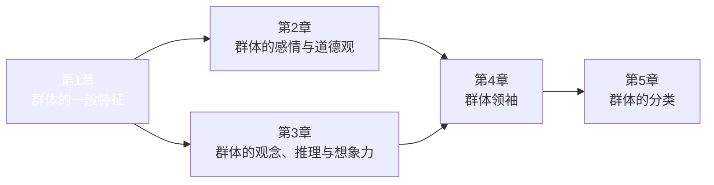
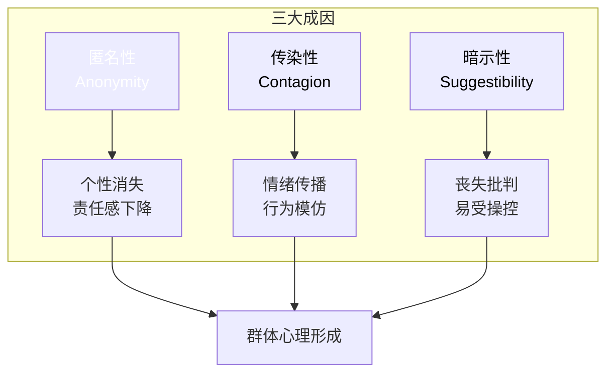
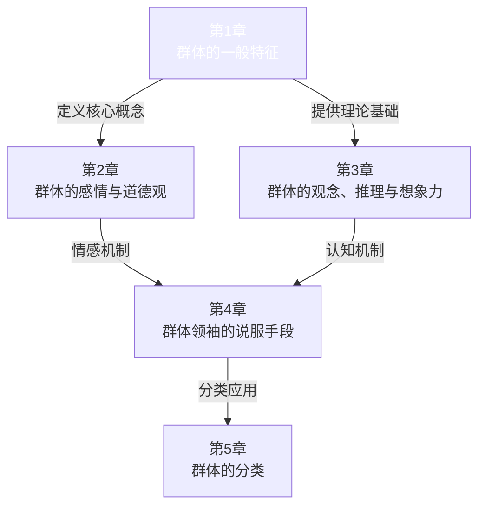

# 第1章：群体的一般特征

> **章节地位**：全书开篇，定义群体心理学的核心概念，是理解整本书的基础框架。

---

## 一、章节定位

### 1.1 在全书中的位置

**核心功能**：定义"什么是群体心理"，建立全书的理论基础。

### 1.2 章节核心问题

> **不是问"群体是什么"，而是问"为什么个体在群体中会变成另一个人？"**

---

## 二、核心观点三层提取

### 观点1：心理统一律——群体创造全新心理实体

#### 【表层】现象层
- 个体融入群体后，个性消失
- 表现出与个体完全不同的行为模式
- 理性被情感取代，智商似乎下降

#### 【中层】机制层
**核心机制**：群体不是个体的简单相加

| 个体心理 | 群体心理 |
|----------|----------|
| 理性主导 | 情感主导 |
| 独立判断 | 从众倾向 |
| 个性鲜明 | 个性消失 |
| 责任明确 | 责任分散 |
| 思考后行动 | 冲动行动 |

**勒庞的比喻**：
> 群体中的个人，不过是众多沙粒中的一颗，可以被大风吹到任何地方。

#### 【底层】规律层
> **心理统一律**：当个体融入群体时，会形成一个全新的心理实体，这个实体具有与个体心理完全不同的特征。

**降维表达**：
> 一个人是一个人，一群人是另一个人。

---

### 观点2：群体心理的三大成因

#### 【表层】现象层
为什么个体在群体中会改变？

#### 【中层】机制层

**三大成因详解**：

| 成因 | 机制 | 结果 | 现代映射 |
|------|------|------|----------|
| **匿名性** | 个体身份被群体淹没 | 责任感消失 | 网络匿名、键盘侠 |
| **传染性** | 情绪像病毒一样传播 | 行为同步化 | 舆论风暴、跟风转发 |
| **暗示性** | 丧失独立判断能力 | 易受操控 | 营销洗脑、饭圈文化 |

#### 【底层】规律层
> **群体心理定律**：匿名性+传染性+暗示性 = 群体心理的形成机制

**降维表达**：
> 没人知道我是谁 + 别人怎么做我就怎么做 + 别人说什么我就信什么 = 我在群体中变成了另一个人

---

### 观点3：群体心理的基本特征

#### 【表层】现象层
群体表现出哪些与个体不同的特征？

#### 【中层】机制层

| 特征 | 勒庞描述 | 降维理解 | 当下案例 |
|------|----------|----------|----------|
| **冲动性** | 群体由无意识支配 | 说风就是雨 | 舆情反转、网络审判 |
| **易变性** | 情绪容易从一个极端跳到另一个极端 | 昨天捧，今天踩 | 偶像塌房、品牌翻车 |
| **情绪化** | 只能感受简单和极端的情感 | 非黑即白 | 二极管思维、极端化舆论 |
| **形象思维** | 用形象而非逻辑思考 | 看图说话 | 短视频时代、视觉传播 |
| **无推理能力** | 不能进行复杂推理 | 听不懂复杂的 | 标语口号、简单化传播 |

#### 【底层】规律层
> **群体特征定律**：群体 = 冲动 + 易变 + 情绪化 + 形象思维 + 无推理能力

**降维表达**：
> 群体不是用来讲道理的，是用来煽动的。

---

### 观点4：群体智商下降定律

#### 【表层】现象层
勒庞的核心发现：群体在智力上总是低于孤立的个人。

#### 【中层】机制层

**关键机制**：
- 不是群体里的人变笨了
- 而是**群体环境压制了理性**
- 情感和本能接管了大脑

#### 【底层】规律层
> **智商下降定律**：个体在群体中的智力表现，会显著低于其独立状态。

**降维表达**：
> 一个人聪明，一群人变笨。

---

## 三、降维翻译字典

### 核心术语人话版

| 勒庞术语 | 人话版 | 生活场景 |
|----------|--------|----------|
| 心理统一律 | 一个人是一个人，一群人是另一个人 | 你单独时理性，上网时暴怒 |
| 匿名性 | 没人知道我是谁，所以我可以放肆 | 网络暴力的心理基础 |
| 传染性 | 别人怎么做，我就怎么做 | 跟风转发、羊群效应 |
| 暗示性 | 别人说什么，我就信什么 | 广告洗脑、谣言传播 |
| 形象思维 | 看图说话，不看书本 | 为什么短视频比长文火 |
| 冲动易变 | 说风就是雨，昨天捧今天踩 | 舆情反转、偶像塌房 |

### 一句话降维金句

1. **一个人聪明，一群人变笨。**
2. **在群体中，你用智商换来了归属感。**
3. **没人知道我是谁 + 别人怎么做我就怎么做 + 别人说什么我就信什么 = 群体心理。**
4. **群体不是用来讲道理的，是用来煽动的。**
5. **你单独时是成年人，在群体中是巨婴。**

---

## 四、金句库

### 原书金句（第1章精选）

1. "群体在智力上总是低于孤立的个人，但在感情和激情的驱使下，它可能比个人表现得更好或更差。"
2. "群体中的个人，不过是众多沙粒当中的一颗，可以被大风吹到任何地方。"
3. "心理群体是一个由异质成分组成的临时存在，这些成分暂时结合在一起，就像由某种化学作用结合在一起的细胞一样。"
4. "无意识现象不仅在有机体的生活中，而且在智力活动中，都起着决定性的作用。"
5. "在群体中，人们的思想倾向于一致，因此人们也变得极其平庸。"

### 降维金句

1. **一个人是一个人，一群人是另一个人。**
2. **群体不是个体的相加，而是全新的心理实体。**
3. **智商在群体中会"下线"——这不是你的错，是群体心理机制在起作用。**
4. **匿名性解放人性之恶，传染性放大情绪，暗示性取代理性。**
5. **理解群体心理，从理解这三个词开始：匿名、传染、暗示。**

## 五、当下映射

### 职场场景

#### 场景1：为什么团队决策常常不如个人决策？
**传统理解**：沟通成本、责任分散
**乌合之众视角**：
- 群体智商下降定律在起作用
- 会议环境激活了传染性和暗示性
- 理性被群体情绪压制

**行动指南**：
- 重要决策前，先要求每个人独立思考
- 设置"魔鬼代言人"角色
- 延迟决策，给理性时间上线

#### 场景2：如何在会议中保持独立思考？
**群体心理陷阱**：
- 第一个发言的人设定了基调（传染性）
- 多数人的观点会形成压力（暗示性）
- 匿名的"大家"让责任消失（匿名性）

**防御策略**：
- 会议前写下自己的观点
- 尽早发言，避免被传染
- 学会说"我需要时间思考"

---

### 生活场景

#### 场景1：为什么一上网就变"暴民"？
**群体心理分析**：

| 现实中 | 网络中 |
|--------|--------|
| 身份可见 | 匿名性激活 |
| 情绪可控 | 情绪传染放大 |
| 理性在线 | 暗示性增强 |

**结论**：网络创造了群体心理的理想环境。

#### 场景2：为什么饭圈文化如此极端？
**群体心理机制**：
- 匿名性：个体身份被粉丝身份取代
- 传染性：群体情绪（爱或恨）快速传播
- 暗示性：领袖（大粉）的言论被无条件接受

**认知升级**：
> 理解饭圈，就是理解群体心理。

---

### 社会场景

#### 场景1：为什么谣言比真相传播更快？
**群体心理解释**：
- 形象思维：谣言简单，真相复杂
- 情绪化：谣言刺激情绪，真相需要理性
- 暗示性：群体不验证，只接受

**行动指南**：
- 看到"震惊""必看"——先停
- 看到"大家都在转"——先疑
- 看到"不转不是人"——先拒

#### 场景2：为什么营销越来越简单粗暴？
**群体心理逻辑**：
- 简单的口号比复杂的道理更容易传播
- 形象比逻辑更有说服力
- 重复比论证更有效

**结论**：
> 营销的本质是应用群体心理学。

---

## 六、章节关联

### 与后续章节的逻辑关系

### 章节间的因果链

| 第1章定义 | 第2章展开 | 第3章深化 | 第4章应用 |
|-----------|-----------|-----------|-----------|
| 群体心理的形成机制 | 群体感情的特征 | 群体如何思考 | 领袖如何操控 |
| 匿名性、传染性、暗示性 | 冲动、易变、极端化 | 形象思维、无推理能力 | 断言、重复、传染 |

**关键逻辑**：
> 第1章定义了"什么是群体心理"，后续章节回答"群体心理如何运作"。

---

## 七、问答设计

### Q1：群体和人群有什么区别？
**A**：不是所有聚集的人都是群体。
- **人群**：只是物理上的聚集（如等车的人群）
- **群体**：心理上的统一（共同的情感、目标、行为）

**判断标准**：是否存在"心理统一"？

---

### Q2：群体一定是负面的吗？
**A**：勒庞没有说群体一定不好。
- 群体可能比个人表现得更好（如英雄行为）
- 群体也可能比个人表现得更差（如暴行）
- **核心**：群体放大了情感，无论是善还是恶

**降维**：群体是放大器，不是过滤器。

---

### Q3：如何在群体中保持独立思考？
**A**：理解机制，才能防御机制。

**四步防御法**：
1. **识别**：我是否在群体状态中？
2. **延迟**：不做即时反应，等理性上线
3. **隔离**：物理或心理上与群体保持距离
4. **验证**：用逻辑检验，而非情绪接受

---

### Q4：网络群体和现实群体有什么不同？
**A**：网络让群体心理更容易形成。

| 维度 | 现实群体 | 网络群体 |
|------|----------|----------|
| 匿名性 | 部分匿名 | 完全匿名 |
| 传染速度 | 慢 | 极快 |
| 暗示强度 | 中等 | 极强 |
| 持续时间 | 临时 | 持续 |

**结论**：网络是群体心理的理想培养基。

---

### Q5：勒庞的观点有局限性吗？
**A**：有，主要有三点：

1. **方法论缺陷**：缺乏科学实验验证
2. **时代局限**：带有19世纪的种族和性别偏见
3. **过度简化**：群体心理比勒庞描述的更复杂

**阅读建议**：取其精华（群体心理机制），去其糟粕（偏见和过度简化）。
