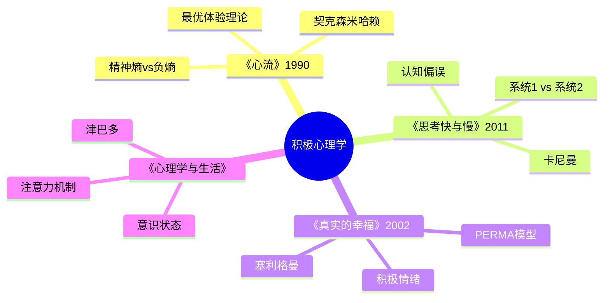

# 《心流：最优体验心理学》拆解记录

## 这本书要解决什么问题？

**核心困境**：现代人拥有了前所未有的物质条件，却普遍感到空虚和焦虑。刷手机停不下来，但越刷越空虚；工作忙得要死，却找不到意义；休闲时间一大把，却不知道怎么真正享受。为什么物质越丰富，幸福感反而越稀缺？

**一句话定位**：
> 幸福不是外在结果，而是内在秩序——心流状态就是意识的最优秩序，让人在做一件事时忘记时间、忘记自己、全神贯注。

### 作者站在什么位置说这些话？

| 维度 | 定位 |
|------|------|
| 主领域 | 积极心理学奠基之作 |
| 跨界领域 | 意识研究、幸福科学、创造力研究 |
| 作者背景 | 芝加哥大学心理学教授，"心流"概念提出者，用ESM（经验取样法）研究了数十万人的日常体验 |
| 历史语境 | 1990年出版，积极心理学运动的核心著作，与塞利格曼的《真实的幸福》并列 |

### 和其他书有什么关系？

| 关联书籍 | 关联关系 | 共同底层逻辑 |
|----------|----------|--------------|
| [[思考快与慢-丹尼尔·卡尼曼-拆解记录]] | 理论基础 | 卡尼曼揭示认知偏误，契克森米哈赖揭示最优体验——都是关于人类意识的运作 |
| [[被讨厌的勇气-岸见一郎-拆解记录]] | 幸福路径 | 阿德勒强调关系，契克森米哈赖强调活动——两种"向内求"的路径 |
| [[第五项修炼-圣吉-拆解记录]] | 个人与组织 | 心流是个人修炼，系统思考是组织修炼——从个人最优体验到集体最优体验 |
| [[影响力-西奥迪尼-拆解记录]] | 意识的两面 | 西奥迪尼讲如何影响他人意识，契克森米哈赖讲如何控制自己意识 |
| [[心理学与生活-津巴多-拆解记录]] | 科学机制 | 津巴多解释注意力如何工作，契克森米哈赖教你如何让注意力持续集中 |

### 知识网络图

---

## 作者的核心论点

### 心流状态的本质：意识的最优秩序

攀岩者在悬崖上专注每一个动作，忘记了时间。外科医生在手术台前全神贯注，世界消失了只余手术刀和病人。棋手对弈时进入另一个维度，几个小时像几分钟一样过去。

契克森米哈赖研究了这些人的共同体验，发现了"心流"状态的本质：注意力高度集中、目标明确、即时反馈、自我意识消失、时间感异常。这不是神秘体验，是意识进入有序状态后的自然结果。

他借用物理学的概念来解释：精神熵=意识失序，心流=精神负熵。大多数人每天的精神状态是熵增的——焦虑、混乱、注意力分散。心流状态是熵减的——有序、和谐、专注。

> **幸福不是外在结果，而是内在秩序**：精神熵=意识失序（焦虑、混乱）；心流=精神负熵（有序、和谐）；幸福=持续创造内心秩序的能力。

我以前一直以为快乐就是舒服——躺着刷手机、吃好吃的、什么都不做。现在意识到这完全搞反了。真正的快乐是专注做事做到忘记时间，是主动创造秩序而不是被动消磨时间。

知道了心流是什么，下一个问题是：心流是怎么产生的？

### 为什么打游戏有时候很爽有时候很烦？——挑战-技能平衡

这个观点打碎了我的一个假设。我一直以为"简单就是轻松，轻松就是快乐"，但契克森米哈赖揭示了一个反直觉的机制：太简单=无聊，太难=焦虑，只有刚刚好=心流。

游戏的设计就是这个原理。太简单的游戏，玩两下就没意思了。太难的游戏，玩两下就放弃了。好的游戏让你始终在"心流通道"里——随着技能提升，挑战也同步提升，永远保持刚刚好的状态。

这个原理可以迁移到一切活动。工作：重复劳动=厌倦，过度挑战=压力，找到自己的心流通道=既成长又享受。学习：内容太浅=走神，太难=放弃，匹配当前能力的挑战=深度学习。运动：太轻松=无聊，太难=挫折，刚刚好的强度=享受运动。

> **成长动态**：心流通道——随技能提升，挑战必须同步提升。成长螺旋：技能↑→挑战↑→技能↑...停滞陷阱：技能固定→挑战固定→厌倦/焦虑。

下次遇到一件事觉得无聊或者焦虑，我不会简单地说"这不是我的菜"，而会问：是不是挑战和技能不匹配？我需要提升技能来匹配更高的挑战，还是调整挑战来匹配当前的技能？

理解了心流的产生条件，下一个问题是：怎么让心流成为一种生活方式？

### 生活重构：在一切活动中创造最优体验

这打碎了我对"休闲"的迷信。我一直以为下班后躺着刷手机是最好的休息，但契克森米哈赖说：被动消费几乎无心流可能，主动创造才有高心流潜力。

看电视、刷短视频、躺着发呆——这些"休息"实际上在增加精神熵。你的注意力被外界牵引，意识是被动接收状态，没有秩序只有混乱。真正的休息不是什么都不做，而是做一件让你忘记时间的事——运动、阅读、写作、学习新技能。

工作反而更容易产生心流，因为工作通常有明确目标、即时反馈、挑战匹配。流水线工人也能在重复劳动中找到节奏和秩序。问题不在工作本身，而在你是否主动把工作变成心流活动。

> **活动重构公式**：任何活动 → 设定目标 + 即时反馈 + 挑战匹配 = 心流可能性。被动消费（电视/刷手机）→ 几乎无心流可能；主动创造（写作/运动/学习）→ 高心流潜力。

下次想要"休息"的时候，我不会再躺下刷手机，而会问自己：有什么事是我做了会忘记时间的？真正的休息不是让大脑停摆，而是让大脑进入有序运转。

---

## 这本书的局限

> 契克森米哈赖的心流理论是积极心理学的里程碑，但这套方法有它的边界。

| 批评点 | 谁在批评 | 怎么说 | 实际情况 |
|--------|---------|--------|---------|
| 过度强调个体 | 社会心理学家 | 心流聚焦个人体验，忽略社会结构因素 | 个人方法确实受限于社会条件，但个体仍有选择空间 |
| 心流成瘾可能 | 心理治疗师 | 某些人沉迷心流活动（游戏、工作狂），逃避现实问题 | 心流本身是中性状态，关键在于用在什么活动上 |
| 测量困难 | 学术研究者 | 心流是主观体验，难以客观测量 | ESM方法已相对成熟，但确实存在测量局限 |
| 文化偏见 | 跨文化研究者 | 心流概念可能不适用所有文化背景 | 核心机制可能普遍，但具体表现形式因文化而异 |

**一句话总结局限性**：
> 心流是工具，不是目的。它能让你在任何活动中找到最优体验，但不能帮你选择什么活动值得做。

---

## 最值得记住的话

**原书说的**：
1. "幸福不是存心去找就能找到的，幸福要靠个人的修持，事先充分准备、刻意培养与维护。"
2. "最优体验出现时，一个人可以投入全部的注意力，以求实现目标。"
3. "心流即一个人完全沉浸在某种活动中，无视其他事物存在的状态。"
4. "我们对自己的观感、从生活中得到的快乐，归根结底直接取决于心灵如何过滤与阐释日常体验。"
5. "只有学会掌控心灵的人，才能决定自己的生活品质。"
6. "注意力是无价的资源。"

**翻译成人话**：
1. 刷手机不是休息，是在给精神熵加码
2. 真正的休息不是躺着，而是做一件让你忘记时间的事
3. 无聊不是没事情做，是做的事情没有挑战
4. 焦虑不是事情太难，是你的技能还不够
5. 心流的秘密：事情不难不很容易，刚刚好
6. 幸福的秘诀：管住你的注意力，别让它乱跑
7. 最好的时间管理，不是省时间，是进入心流让时间消失
8. AI能做99%的事，但只有人类能进入心流——这是最后的堡垒

---

## 讲给没读过的人听

你有没有发现，越刷手机越空虚？

契克森米哈赖研究了这个问题。他发现大多数人把"休息"理解错了。躺着刷手机不是休息，是精神熵增——你的注意力被各种信息牵着走，意识是混乱的。真正的休息是做一件让你忘记时间的事，进入心流状态。

心流是什么？就是做事做到忘记时间、忘记自己、全神贯注的状态。攀岩者在悬崖上、外科医生在手术台前、棋手对弈时，都能进入这种状态。

怎么进入心流？关键是挑战和技能的平衡。太简单=无聊，太难=焦虑，刚刚好=心流。好的游戏就是这样设计的——随着你水平提高，难度也提高，永远让你在"刚刚好"的通道里。

这个原理可以用在一切活动上。工作、学习、运动、爱好，都可以通过设定目标、创造即时反馈、调整挑战匹配来进入心流。

下次想休息的时候，不要躺下刷手机。找一件能让你忘记时间的事去做——那才是真正的休息。

---

## 用来检验理解的问题

**基础回忆**：
1. Q: 心流状态的六个特征是什么？
   A: 注意力高度集中、目标明确、即时反馈、自我意识消失、时间感异常、内在动机。

2. Q: 什么是"精神熵"？
   A: 意识失序的状态——焦虑、混乱、注意力分散。心流是精神负熵，创造内心秩序。

3. Q: 挑战-技能平衡模型中，四个象限分别是什么？
   A: 高挑战/高技能=心流；低挑战/低技能=冷漠；高挑战/低技能=焦虑；低挑战/高技能=无聊。

**理解验证**：
1. Q: 为什么"被动休闲"（看电视、刷手机）难以产生心流？
   A: 缺乏明确目标、没有即时反馈、技能不参与。注意力被外界牵引，意识是被动接收状态。

2. Q: 心流和快乐有什么区别？
   A: 快乐是情绪状态，可能来自外在刺激；心流是意识状态，来自内在秩序。心流状态可能不"快乐"（很累、很专注），但结束后有深层满足感。

3. Q: 如何把枯燥的工作变成心流活动？
   A: 设定目标（今天要达到什么标准）、创造即时反馈（每做完一个就记录）、调整挑战（提高难度或缩短时间）。

**实际应用**：
1. Q: 列出你最近进入心流状态的三次经历。它们有什么共同特点？
   A: 分析这些活动：目标是什么？反馈是什么？挑战和技能是否匹配？

2. Q: 你每天的休闲活动中，哪些是主动创造，哪些是被动消费？
   A: 统计时间分配，看看有多少时间花在高心流潜力的活动上。

**深度分析**：
1. Q: 心流理论在AI时代有什么新价值？
   A: AI能替代重复劳动，但只有人类能进入心流状态。心流成为人类独特的竞争力——创造力、深度思考、最优体验。

2. Q: 契克森米哈赖的"心流"和卡尼曼的"系统2"有什么关系？
   A: 心流是系统2的极致专注状态——但不是费力的专注，是忘我的专注。系统2是理性思考，心流是理性思考的优化形态。

---

## 和其他书的对话

卡尼曼和契克森米哈赖都在研究人类意识，但一个诊断病情，一个开药方。卡尼曼告诉你系统1和系统2怎么打架、认知偏误有哪些；契克森米哈赖告诉你如何让系统2进入最优状态、如何创造内心秩序。一个是问题视角，一个是解决视角。

塞利格曼和契克森米哈赖一起创立了积极心理学，但方向不同。塞利格曼的PERMA模型告诉你幸福有五个维度；契克森米哈赖告诉你其中一个维度（投入/心流）怎么实现。塞利格曼是地图，契克森米哈赖是路径。

津巴多和契克森米哈赖是"注意力"的两个侧面。津巴多告诉你注意力如何工作、为什么会分散；契克森米哈赖告诉你如何让注意力持续集中。一个是机制说明书，一个是操作手册。

庄子在两千年前就描述了类似心流的状态——"坐忘""心斋"。但庄子用诗意的语言，契克森米哈赖用科学的方法。东方的"忘我"和西方的"心流"指向同一个体验，一个靠顿悟，一个靠方法。

---

*拆解日期：2026-02-14*
*下次回访：1周后回顾「讲给没读过的人听」和「检验问题」*