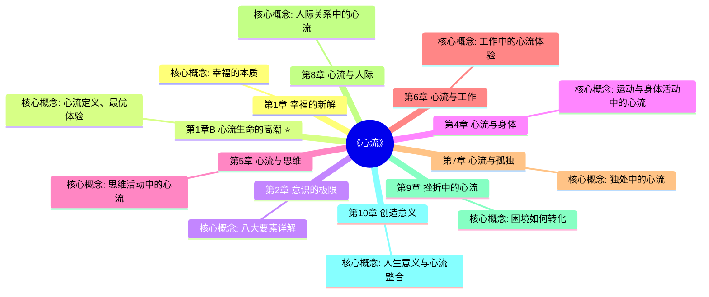

# 《心流》章节导航

## 📊 基本信息

| 项目 | 内容 |
|------|------|
| 书名 | 《心流：最优体验心理学》（Flow） |
| 作者 | 米哈里·契克森米哈赖（Mihaly Csikszentmihalyi） |
| 总章节 | 10章 |
| 已拆解 | 1章 |
| 整书拆解 | [[心流-契克森米哈赖-拆解记录]] |

---

## 🗺️ 章节结构图

---

## 💎 心流八要素

| 序号 | 要素 | 简述 |
|------|------|------|
| 1 | 可完成挑战的任务 | 技能与挑战匹配 |
| 2 | 专注 | 全神贯注于当下 |
| 3 | 明确目标 | 清楚知道要做什么 |
| 4 | 即时反馈 | 行动后立刻知道结果 |
| 5 | 忘我投入 | 深度沉浸感 |
| 6 | 掌控感 | 对行为的控制力 |
| 7 | 忘记时间 | 时间感扭曲 |
| 8 | 自我意识消失 | 不再关注自我评价 |

---

## 📈 拆解进度

| 序号 | 章节 | 核心概念 | 状态 | 链接 |
|------|------|----------|------|------|
| 1A | 幸福的新解 | 幸福的本质 | ✅ 已完成 | [[第1章-幸福的新解]] |
| 1B | 心流生命的高潮 | 心流定义、最优体验 | ✅ 已完成 | [[第1章-心流生命的高潮]] |
| 2 | 意识的极限 | 注意力与精神能量 | ✅ 已完成 | [[第2章-意识的极限]] |
| 3A | 心流的要素 ⭐ | 八大要素详解 | ✅ 已完成 | [[第3章-心流的要素]] |
| 3B | 快乐与心流 | 快乐vs心流本质区别 | ✅ 已完成 | [[第3章-快乐与心流]] |
| 4 | 心流与身体 | 运动与身体活动中的心流 | ✅ 已完成 | [[第4章-心流与身体]] |
| 5 | 心流与思维 | 思维活动中的心流 | ✅ 已完成 | [[第5章-心流与思维]] |
| 6 | 心流与工作 | 工作中的心流体验 | ✅ 已完成 | [[第6章-心流与工作]] |
| 7 | 心流与孤独 | 独处中的心流 | ✅ 已完成 | [[第7章-心流与孤独]] |
| 8 | 心流与人际 | 人际关系中的心流 | ✅ 已完成 | [[第8章-心流与人际]] |
| 9 | 挫折中的心流 | 困境如何转化 | ✅ 已完成 | [[第9章-挫折中的心流]] |
| 10 | 创造意义 | 人生意义与心流整合 | ✅ 已完成 | [[第10章-创造意义]] |
|------|------|----------|------|------|
| 1 | 幸福的新解 | 心流理论概述 | ✅ 已完成 | [[第1章-幸福的新解]] |
| 2 | 意识的极限 | 注意力与精神能量 | ✅ 已完成 | [[第2章-意识的极限]] |
| 3 | 心流的要素 ⭐ | 八大要素详解 | ✅ 已完成 | [[第3章-心流的要素]] |
|------|------|----------|------|------|
| 1 | 幸福的新解 | 心流理论概述 | ⏳ 待拆解 | [[第1章-幸福的新解]] |
| 2 | 意识的极限 | 注意力与精神能量 | ⏳ 待拆解 | [[第2章-意识的极限]] |
| 3 | 心流的要素 ⭐ | 八大要素详解 | ✅ 已完成 | [[第3章-心流的要素]] |
| 4 | 心流与身体 | 运动与身体活动中的心流 | ⏳ 待拆解 | [[第4章-心流与身体]] |
| 5 | 心流与思维 | 思维活动中的心流 | ⏳ 待拆解 | [[第5章-心流与思维]] |
| 6 | 心流与工作 | 工作中的心流体验 | ⏳ 待拆解 | [[第6章-心流与工作]] |
| 7 | 心流与孤独 | 独处中的心流 | ⏳ 待拆解 | [[第7章-心流与孤独]] |
**进度**: 10/10 (100%) ✅ 完成
| 9 | 挫折中的心流 | 困境如何转化 | ⏳ 待拆解 | [[第9章-挫折中的心流]] |
| 10 | 创造意义 | 人生意义与心流整合 | ⏳ 待拆解 | [[第10章-创造意义]] |

**进度**: 3/10 (30%)

⭐ = 优先拆解（核心章节）

---

## 🎯 拆解优先级

根据心流理论框架，优先拆解以下章节：

### 第一优先级（核心概念）
1. **第3章 心流的要素** - 八大要素是全书的操作核心
2. **第1章 幸福的新解** - 建立心流认知框架
3. **第2章 意识的极限** - 注意力机制的底层逻辑

### 第二优先级（应用场景）
4. 第6章 心流与工作 - 最实用的应用场景
5. 第8章 心流与人际 - 社会关系中的心流
6. 第9章 挫折中的心流 - 困境转化方法论

### 第三优先级（延伸维度）
7. 第4章 心流与身体 - 身体活动维度
8. 第5章 心流与思维 - 认知活动维度
9. 第7章 心流与孤独 - 独处能力
10. 第10章 创造意义 - 人生整合

---

## 🔗 快速跳转

### 按章节跳转
- [[第1章-幸福的新解]]
- [[第1章-心流生命的高潮]]
- [[第3章-心流的要素]]
- [[第3章-快乐与心流]]
- [[第4章-心流与身体]]
- [[第5章-心流与思维]]
- [[第6章-心流与工作]]
- [[第7章-心流与孤独]]
- [[第7章-工作中的心流]] ⭐ 深度版：如何在工作中找到意义
- [[第7章-心流与孤独]]
- [[第8章-心流与人际]]
- [[第8章-人际中的心流]] ⭐ 深度版：如何在人际关系中创造心流
- [[第9章-挫折中的心流]]
- [[第10章-创造意义]]
- [[第5章-身体的心流]] ⭐ 身体心流深度解析
- [[第4章-心流的条件]] ⭐ 核心条件深度解析
- [[第6章-思维的心流]] ⭐ 思维心流深度解析
- [[第4章-心流的条件]] ⭐ 核心条件深度解析

### 相关资源
- [[心流-契克森米哈赖-拆解记录]] - 整书拆解笔记
- [[03-Resources/书籍拆解/1-拆解记录/心理学与生活-津巴多-拆解记录]] - 心理学基础
- [[少有人走的路-派克-拆解记录]] - 自我成长相关

---

## 📝 章节拆解说明

每个章节拆解将包含：
- 📍 **章节定位**：在全书中回答的问题
- 🎯 **核心观点**：三层提取（案例→机制→规律）
- 💬 **降维翻译**：原文→中学生能懂→奶奶能懂
- ✨ **金句库**：原书/降维/二创金句
- 🔗 **当下映射**：财富/职场/生活应用
- 🕸️ **章节关联**：前后章+整书+跨书关联
- ❓ **问答设计**：5-10个认知层次问题

---

*创建日期: 2026-02-26*
*最后更新: 2026-02-28 - 新增第8章-人际中的心流（深度版）
