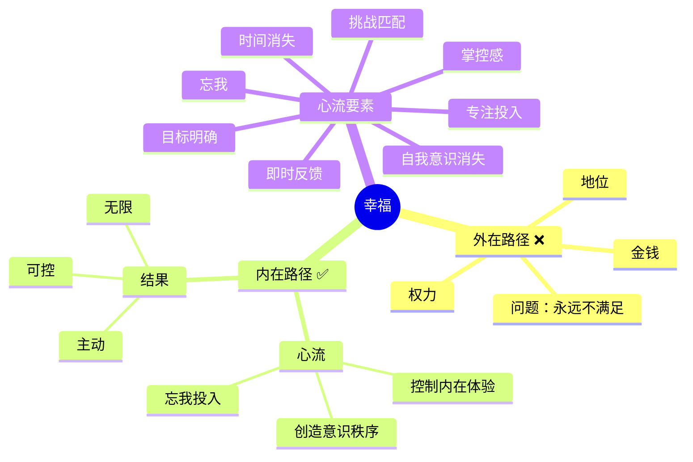
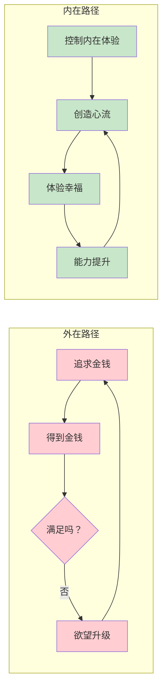

# 第1章 幸福的新解

## 📍 章节定位

**全书位置**：第1章是整书的理论基石，提出核心问题——"幸福的本质是什么"，并给出颠覆性答案——幸福不是外在结果，而是控制内在体验的能力。本章奠定了全书"向内求"的哲学基调。

**章节序列**：开篇章节，第1章（共10章）

**一句话定位**：
> 幸福不是金钱、权力或舒适生活能买来的外在结果，而是通过控制内在体验、创造意识秩序，在每一刻都能主动选择"如何度过"的能力。

**核心问题**：
- 为什么物质生活越来越富裕，人们却越来越不幸福？
- 真正的幸福是什么？如何获得？
- 心流与幸福是什么关系？

---

## 🎯 核心观点（三层提取）

### 观点1：幸福不是外在结果，而是控制内在体验的能力

| 层次 | 内容 |
|------|------|

**降维翻译**：
- **原文**：幸福不是外在结果，而是控制内在体验的能力
- **中学生懂**：你控制不了外面发生什么，但你能控制自己怎么想、怎么反应
- **奶奶懂**：日子好不好过，不全看碰上什么事儿，全看你怎么过

---

### 观点2：最优体验（心流）——人类最幸福的时刻

| 层次 | 内容 |
|------|------|

**降维翻译**：
- **原文**：心流是完全沉浸、忘我的最优体验状态
- **中学生懂**：做事做到"忘我"，只想手上的活，忘了自己在干
- **奶奶懂**：干活干进去了，忘了吃饭，忘了睡觉，忘了自己是谁

---

### 观点3：幸福的悖论——越追求，越得不到

| 层次 | 内容 |
|------|------|

**降维翻译**：
- **原文**：幸福是其他有意义活动的副产品，不能直接追求
- **中学生懂**：你越想"我要快乐"，越不快乐；专心干有趣的事，快乐自然来
- **奶奶懂**：幸福不是追来的，是干正事干着干着就来的

---

### 观点4：宇宙的无序性——人类无法改变的本质

| 层次 | 内容 |
|------|------|

**降维翻译**：
- **原文**：宇宙不是为人类设计的，它对人类的需求毫无反应
- **中学生懂**：世界不会因为你想舒服就对你好，它按自己的规律转
- **奶奶懂**：老天爷不听人指挥，你不能指望外面都顺你心意

---

### 观点5：文化盾牌——人类应对无序的保护机制

| 层次 | 内容 |
|------|------|

**降维翻译**：
- **原文**：文化是为人类提供安全感的故事，但最终都会失效
- **中学生懂**：以前信的"道理"慢慢不管用了，得自己找意义
- **奶奶懂**：老规矩老道理都不灵了，得自己琢磨怎么活

---

### 观点6：现代人的困境——物质富裕，精神贫穷

| 层次 | 内容 |
|------|------|
  1. **物质饱和**：基本需求已满足，但欲望随之上升——有空调想要更好的，有车想要更贵的
  2. **精神空虚**：传统价值观（宗教、家庭、传统）瓦解，但没有新的意义框架填补
  3. **注意力失控**：信息爆炸，社交媒体，短视频，让注意力碎片化，无法创造深度体验
  结果：物质丰富，精神贫乏；外在强大，内在混乱。 |

**降维翻译**：
- **原文**：物质财富增长不再带来幸福感提升
- **中学生懂**：有了很多好东西，还是不快乐，因为心里还是空的
- **奶奶懂**：日子过得再富，心里不安，还是没意思

---

### 观点7：心流是唯一的出路——向内求，而非向外求

| 层次 | 内容 |
|------|------|

**降维翻译**：
- **原文**：心流是不依赖外在条件的幸福路径
- **中学生懂**：你不需要等有好条件才能快乐，现在就能创造快乐
- **奶奶懂**：日子好不好，全看你能不能把平凡过出滋味

---

### 观点8：心流的理论基础——体验采样法（ESM）

| 层次 | 内容 |
|------|------|

**降维翻译**：
- **原文**：心流是普遍存在的心理现象，可以用科学方法研究
- **中学生懂**：心流不是少数人的天赋，是谁都能学会的本事
- **奶奶懂**：快乐是有方法的，不是靠运气，能学，能练

---

## 💬 金句库

### 原书金句
> "幸福不是存心去找就能找到的，幸福要靠个人的修持，事先充分准备、刻意培养与维护。"

> "我们对自己的观感、从生活中得到的快乐，归根结底直接取决于心灵如何过滤与阐释日常体验。"

> "只有学会掌控心灵的人，才能决定自己的生活品质。"

> "最优体验出现时，一个人可以投入全部的注意力，以求实现目标；个人的身体或心灵被拉伸到极限，自愿去完成一些困难而又有价值的事情。"

> "问问自己是否快乐，你就不再快乐了——幸福是其他有意义活动的副产品，不能直接追求。"

> "注意力是无价的资源。"

### 降维金句
> "幸福不是外面给什么，是你自己怎么过日子。"

> "你管不了世界好不好，但你能管自己怎么想。"

> "越想'我要快乐'，越不快乐；专心干正事，快乐自然来。"

> "老天爷不听指挥，但你能听自己指挥。"

> "物质再富，心还是空的；心富了，日子再穷也有滋味。"

> "快乐不是等来的，是干出来的——干着干着就快乐了。"

> "心流就是：做这件事本身，就是奖励。"

## 🔗 当下映射

### 💰 财富应用

| 场景 | 具体行动 | 心流要素 | 预期效果 |
|------|----------|----------|----------|
| 股票投资 | 设定研究目标（每天分析1家公司）+ 记录笔记 | 明确目标+即时反馈 | 把焦虑变成专注，提升决策质量 |
| 副业创业 | 选择"略高于能力"的小项目，快速迭代 | 挑战匹配+即时反馈 | 从煎熬变享受，成功率提升 |
| 技能提升 | 拆分技能为小目标，每完成一个给自己奖励 | 可完成挑战+即时反馈 | 学习效率翻倍，不再拖延 |

### 💼 职场应用

| 场景 | 具体行动 | 心流要素 | 适用职级 |
|------|----------|----------|----------|
| 会议中 | 聚焦"我能贡献什么"，而非"别人怎么看" | 掌控感+自我意识消失 | 全职级 |
| 深度工作 | 设定90分钟目标块，关闭所有通知 | 专注+明确目标+即时反馈 | 全职级 |
| 处理冲突 | 把冲突当作挑战，寻找双赢方案 | 挑战匹配+掌控感 | 管理层 |
| 厌倦工作 | 重新定义目标，自己创造反馈 | 自成目标+即时反馈 | 全职级 |

### 🏠 生活应用

| 场景 | 具体行动 | 可行性 | 见效时间 |
|------|----------|--------|----------|
| 家务 | 设定计时挑战（"15分钟把客厅收拾完"） | 高 | 即时 |
| 运动 | 选择"有点挑战但能完成"的目标 | 高 | 即时 |
| 阅读 | 读+笔记+分享，创造即时反馈 | 高 | 1周 |
| 亲子 | 设计小游戏（"谁先找到10种不同的绿色"） | 中 | 即时 |

### 72小时应用计划
1. **今天**：记录你的一天，哪些时刻你感到"专注忘我"？分析原因。
2. **明天**：选择一件你常做的事，给它设定一个小目标和即时反馈机制。
3. **本周**：每天创造一个"心流时间块"——30分钟，全心投入。

---

## 🕸️ 章节关联

### 向上：整书关联
- **核心问题**：本章回答"幸福是什么、如何获得"——幸福=控制内在体验，心流是最优实现方式
- **全书定位**：第1章奠定"向内求"的哲学基调，后续章节展开"如何控制内在体验"

### 横向：章节序列

| 章节编号 | 章节标题 | 关联类型 | 连接描述 |
|----------|----------|----------|----------|
| 第2章 | 意识的极限 | 基础 | 第1章提出"控制内在体验"，第2章讲解"意识如何工作" |
| 第3章 | 心流的要素 | 方法 | 第1章说"心流=幸福"，第3章讲"心流的8个条件" |
| 第4-10章 | 心流的应用 | 展开 | 第1章建立理论框架，第4-10章在身体、思维、工作、人际、挫折、意义中实践 |

### 跨书关联

| 书籍 | 概念 | 关系 | 备注 |
|------|------|------|------|
| [[被讨厌的勇气-岸见一郎-拆解记录]] | 课题分离 | 呼应 | 阿德勒的"课题分离"与"控制内在体验"相通 |
| [[少有人走的路-派克-拆解记录]] | 自律 | 呼应 | 派克的"自律"与契克森米哈赖的"控制注意力"相通 |
| [[当下的力量-埃克哈特·托利-拆解记录]] | 临在 | 对比 | 托利的"临在"是静态的心流，心流是动态的临在 |
| [[庄子]] | 无为 | 对比 | 庄子的"无为"vs 契克森米哈赖的"忘我"，都指向自我超越 |

### 心流理论框架图

### 幸福获取路径对比图

---

## ❓ 问答设计

### Q1: 第1章的核心观点是什么？（记忆型）
**认知层次**: 记忆
**难度**: 低
**答案要点**:
- 幸福不是外在结果（钱、权、名），而是控制内在体验的能力
- 心流是最优体验状态，完全沉浸、忘我投入
- 幸福不能直接追求，是其他有意义活动的副产品
- 向外求（外在条件）永远不满足，向内求（内在体验）可获得自由

### Q2: 契克森米哈赖用了什么研究方法？为什么这个方法重要？（理解型）
**认知层次**: 理解
**难度**: 中
**答案要点**:
- 体验采样法（ESM）：给被试者佩戴电子传呼器，随机每天响8次，记录当下感受
- 重要性：
  - 传统研究依赖事后回忆，回忆会扭曲记忆
  - ESM捕捉当下真实感受，数据更可靠
  - 证实了心流的普遍性（跨文化、跨年龄）
  - 证明心流是可以科学研究的心理现象

### Q3: 为什么"越追求幸福越不幸福"？（理解型）
**认知层次**: 理解
**难度**: 中
**答案要点**:
- 幸福不能作为直接目标
- 当人有意识地"追求"幸福时，注意力从"体验本身"转向了"我是否快乐"
- 这种分心破坏了沉浸体验（心流的前提是全神贯注）
- 正确做法：放弃"我要幸福"的执念，全心投入有意义的活动
- 幸福是副产品——当你全心投入，幸福自然发生

### Q4: 现代人的"三重困境"是什么？如何解决？（分析型）
**认知层次**: 分析
**难度**: 中
**答案要点**:
**三重困境**:
1. **物质饱和**：基本需求已满足，但欲望不断升级
2. **精神空虚**：传统价值观（宗教、家庭、传统）瓦解，新的意义框架未形成
3. **注意力失控**：信息爆炸、社交媒体让注意力碎片化

**解决方法**:
- 放弃"外在路径"（追求物质），转向"内在路径"（控制体验）
- 学会创造心流：在任何活动中设定目标、创造反馈、找到挑战
- 训练注意力管理：专注当下，减少分心

### Q5: "外在路径"和"内在路径"获取幸福的区别是什么？（分析型）
**认知层次**: 分析
**难度**: 中
**答案要点**:

| 维度 | 外在路径 | 内在路径 |
|------|----------|----------|
| 目标 | 追求钱、权、名、利 | 控制内在体验 |
| 依赖 | 依赖外在条件 | 不依赖任何条件 |
| 可控性 | 不可控（受外界影响） | 完全可控（自己决定） |
| 满足感 | 永远不满足 | 每次体验都满足 |
| 稳定性 | 不稳定（外界变化） | 稳定（内在能力） |
| 适用性 | 只有少数人能获得 | 每个人都能获得 |

### Q6: 为什么说"宇宙不是为人类设计的"？（理解型）
**认知层次**: 理解
**难度**: 中
**答案要点**:
- 宇宙的规律（物理、化学、生物）不照顾人类需求
- 流星撞击、病毒感染、自然灾害，这些事件没有恶意也没有善意
- 从物理学角度看，一切都严格遵循规律；从人类视角看，宇宙充满混乱
- 这是幸福的第一个大障碍：人类渴望意义，宇宙不提供意义
- 解决方法：放弃"宇宙应该对我友善"的幻想，专注于"我能控制什么"

### Q7: "文化盾牌"是什么？为什么会失效？（分析型）
**认知层次**: 分析
**难度**: 中
**答案要点**:
**文化盾牌的定义**:
- 文化创造的"解释框架"，让人类在宇宙的混乱中感到安全
- 包括：宗教、神话、传统、价值观、爱国等
- 作用：把无序包装成有序，给人提供意义和安全感

**为什么会失效**:
- 文化最终会被现实击碎（罗马帝国、大清王朝、各种信仰）
- 科学发展揭穿神话（地心说被否定）
- 战争、灾难摧毁国家框架
- 在文化真空期，旧盾牌失效，新盾牌未形成，现代人陷入存在焦虑

**解决方法**:
- 放弃依赖外在文化盾牌
- 学会自己创造内在秩序（通过心流）

### Q8: 第1章与《被讨厌的勇气》的"课题分离"有什么相通之处？（分析型）
**认知层次**: 分析
**难度**: 高
**答案要点**:
**共同底层**:
- 都强调"向内求"而非"向外求"
- 都认为幸福来自控制内在世界，而非改变外在世界
- 都承认外部世界不可控，但内在世界可以控制

**具体呼应**:
- **课题分离**：区分"我的事"和"别人的事"，不被他人评价干扰
- **控制内在体验**：能决定自己如何解读和应对外界事件

**区别**:
- 阿德勒聚焦人际关系（课题分离主要用于处理人际冲突）
- 契克森米哈赖聚焦活动本身（控制内在体验主要用于创造心流）

**互补关系**:
- 课题分离解决人际上的"自我意识消失"
- 心流解决活动上的"自我意识消失"
- 两者结合：既不被他人评价干扰，也不被自我评价干扰

### Q9: 如何在今天创造一个"心流时间块"？请给出具体步骤。（应用型）
**认知层次**: 应用
**难度**: 中
**答案要点**:
**具体步骤**（90分钟）:
1. **选择任务**（5分钟）：选择一件略高于你当前能力的事（不是太简单，也不是太难）
2. **设定目标**（5分钟）：明确今天要完成什么（具体、可衡量）
3. **创造条件**（5分钟）：关闭手机通知、清理桌面、准备工具
4. **全心投入**（75分钟）：开始工作，专注当下，不评价自己
5. **即时反馈**（持续）：每完成一小步，给自己确认（打勾、记录）
6. **结束后**（5分钟）：记录你学到了什么，给自己奖励

**关键原则**:
- 不强求"忘记时间"和"自我意识消失"，让它们自然发生
- 如果分心，温柔地把注意力拉回来
- 完成90分钟比完美90分钟更重要

### Q10: 如果我的工作很无聊，无法创造心流，应该怎么办？（综合型）
**认知层次**: 综合
**难度**: 高
**答案要点**:
**主动改造任务**:
- 重新定义目标：把"应付工作"变成"提升技能"或"服务他人"
- 自己创造反馈：记录每天做了什么、学到什么
- 调整难度：把大任务拆成小挑战，给自己设时间限制

**寻找工作之外的心流**:
- 培养一个副业或爱好，在那里创造心流
- 每天1-2小时，做你真正热爱的事
- 用副业的心流体验，抵消工作的无聊

**终极选择**:
- 如果工作完全无法改造，也无法在别处创造心流
- 可能需要考虑换工作
- 但在换之前，先确认你是否真的尝试了所有改造方法

**核心原则**:
- 不要等待"完美条件"，要在"现在"创造心流
- 心流能力是可以训练的，越练习越强

### Q11: 心流与"临在"（《当下的力量》）有什么区别和联系？（分析型）
**认知层次**: 分析
**难度**: 高
**答案要点**:
**共同点**:
- 都是"忘我"状态
- 都超越小我，获得内在平静
- 都是对"当下"的投入

**区别**:

| 维度 | 心流 | 临在 |
|------|------|------|
| 动态 | 动态活动中专注 | 静态觉察中存在 |
| 条件 | 需要目标+反馈+挑战匹配 | 只需要觉察当下 |
| 适合场景 | 工作、运动、创作、学习 | 等待、休息、独处、冥想 |
| 体验类型 | "完全沉浸在活动中" | "纯粹觉察一切" |

**互补关系**:
- 心流适合动态场景（做事时）
- 临在适合静态场景（休息时）
- 两者的结合：既能"忘我做事"，也能"纯粹觉察"

**关系比喻**:
- 心流就像"打游戏进入状态"——完全投入
- 临在就像"坐在河边看流水"——纯粹观察
- 两者都是"好的状态"，只是适合不同的时间

### Q12: 为什么说"心流是AI时代人类最后的堡垒"？（综合型）
**认知层次**: 综合
**难度**: 高
**答案要点**:
**AI能做什么**:
- 99%的可重复、可预测的工作
- 数据分析、内容生成、编程、翻译
- 甚至部分创意工作（AI绘画、AI音乐）

**AI不能做什么**:
- 完全沉浸、忘我的心流状态
- 主动创造意义和价值
- 体验过程中的主观感受

**心流的价值**:
- 心流是人类独有的体验
- AI可以模拟心流的产出，但无法模拟心流本身
- 心流是"过程的快乐"，AI只能产生"结果的产出"

**2026的意义**:
- AI替代大量工作，人类更难找到"外在价值"
- 但心流提供"内在价值"——无论外界如何变化，人都能从心流中获得快乐
- 训练心流能力，就是训练"不受外界影响的快乐能力"

**结论**:
- 心流不是奢侈品，而是必需品
- 2026年最该学的技能不是AI，而是创造心流

### Q13: 如何判断自己是否进入了心流状态？（应用型）
**认知层次**: 应用
**难度**: 中
**答案要点**:
**心流的8个判断标准**:

1. **可完成的挑战**：任务有难度，但你觉得"能搞定"
2. **明确目标**：你知道自己在做什么、要达成什么
3. **即时反馈**：每做一步就知道好不好用
4. **深度专注**：脑子完全被手上的事占满，没空想别的
5. **忘我投入**：你感觉自己在"做这件事"，而不是"我在做这件事"
6. **掌控感**：你觉得自己能影响结果
7. **时间消失**：一抬头，"怎么这么晚了"
8. **自我意识消失**：你忘了"别人怎么看我"，忘了"我表现得好不好"

**简易判断法**（3个核心）:
- 忘记时间了吗？
- 忘记自己在做事了吗？
- 做完后感到满足吗？

**注意**:
- 不需要8个全有，4-5个就能算心流
- 时间消失和忘我是最重要的两个标志
- 初学者不强求，先练习专注和目标

### Q14: 为什么契克森米哈赖说"注意力是无价的资源"？（理解型）
**认知层次**: 理解
**难度**: 中
**答案要点**:
**注意力的稀缺性**:
- 人脑的认知带宽有限（每秒约126比特）
- 同一时间只能关注有限的信息
- 注意力是有限的，但信息是无限的

**注意力的价值**:
- 注意力决定了你体验什么——你注意什么，就体验什么
- 注意力决定了你成为什么样的人——你关注什么，就强化什么
- 注意力是创造心流的基础——没有专注，就没有心流

**2026年的现实**:
- 信息爆炸、社交媒体、短视频，都在争夺你的注意力
- 注意力被碎片化，无法创造深度体验
- 谁能控制注意力，谁就能控制自己的人生

**结论**:
- 注意力不是免费的，而是最贵的资源
- 保护注意力，就是保护你的幸福

### Q15: 如果我总是分心，无法专注，该怎么办？（应用型）
**认知层次**: 应用
**难度**: 中
**答案要点**:
**诊断原因**:
- 任务太无聊/太难？
- 外部干扰太多？
- 手机通知不断？
- 焦虑、压力太大？

**具体方法**:
1. **减少外部干扰**：关闭通知，把手机放到另一个房间
2. **从小事开始**：不要从90分钟开始，从10分钟开始
3. **设定小目标**：把大任务拆成小目标，每完成一个给自己反馈
4. **培养习惯**：每天同一时间、同一地点做这件事
5. **接受不完美**：开始专注比完美专注更重要
6. **温柔对待**：如果分心了，不要自责，温柔地把注意力拉回来

**长期训练**:
- 专注力像肌肉，越练越强
- 每天练习，3个月后你会发现自己专注力显著提升
- 可以用冥想、呼吸练习辅助训练

---
