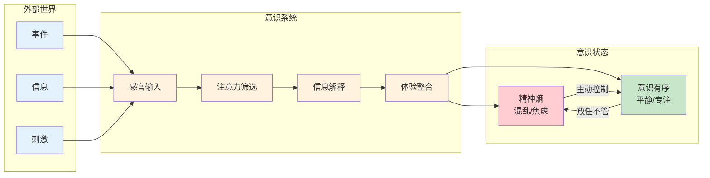
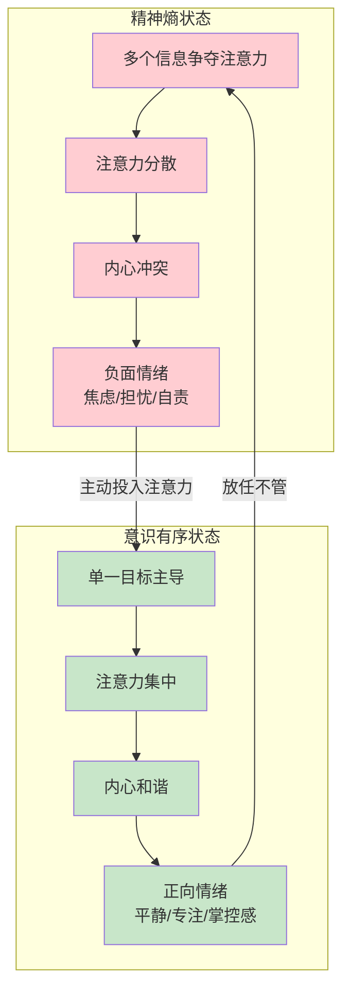

# 第2章 意识的力量

## 📍 章节定位

**全书位置**：本章是心流理论的"操作系统"章节，回答"意识是什么"和"如何控制意识"。如果把心流比作一个应用程序，第1章讲的是这个应用的"效果展示"，本章讲的是"运行环境"——意识是如何工作的。

**章节序列**：第2章（共10章），承接第1章"心流是什么"，开启第3章"心流如何发生"

**一句话定位**：
> 意识是你体验世界的唯一窗口，注意力是意识有限的能量，精神熵是意识失序的状态。学会控制意识，就掌握了幸福的能力。

**核心问题**：
- 意识是什么？它如何运作？
- 注意力为什么是"无价的资源"？
- 什么是精神熵？它如何破坏内心秩序？
- 如何控制意识，创造内心秩序？

---

## 🎯 核心观点（三层提取）

### 观点1：意识的本质——你体验世界的唯一窗口

| 层次 | 内容 |
|------|------|

**降维翻译**：
- **原文**：意识是我们体验现实的唯一途径
- **中学生懂**：你看到的世界，其实是你脑子里的世界——真正的世界你永远看不到
- **奶奶懂**：好日子坏日子，不是看日子本身，是看你心里怎么想

---

### 观点2：注意力——意识有限的能量

| 层次 | 内容 |
|------|------|

**降维翻译**：
- **原文**：注意力是意识有限的能量
- **中学生懂**：脑子一次只能干好一件事，多任务只会多出错
- **奶奶懂**：一心不能二用，想两头顾，两头都顾不好

---

### 观点3：精神熵——意识失序的状态

| 层次 | 内容 |
|------|------|

**降维翻译**：
- **原文**：精神熵是意识失序的状态
- **中学生懂**：脑子里一团乱麻，想东想西，干啥都干不好
- **奶奶懂**：心里乱糟糟的，像一锅粥，吃不好睡不好

---

### 观点4：控制意识——创造内心秩序的能力

| 层次 | 内容 |
|------|------|

**降维翻译**：
- **原文**：控制意识是创造内心秩序的能力
- **中学生懂**：管住自己的脑子，别让它乱跑，你就比别人强
- **奶奶懂**：心里要有主见，不能被外面的风吹草动牵着走

---

### 观点5：意识塑造现实——幸福是一种能力

| 层次 | 内容 |
|------|------|

**降维翻译**：
- **原文**：幸福是一种能力，不取决于外在条件
- **中学生懂**：快不快乐不看环境，看你自己会不会调节
- **奶奶懂**：好日子是心里头过的，不是钱堆出来的

---

### 观点6：意识的进化——从被动到主动

| 层次 | 内容 |
|------|------|

**降维翻译**：
- **原文**：意识需要从被动进化到主动
- **中学生懂**：你的脑子是原始人设计的，需要你自己升级
- **奶奶懂**：脑子好用不是天生的，是练出来的

---

## 💬 金句库

### 原书金句
> "注意力是无价的资源。"

> "我们对自己的观感、从生活中得到的快乐，归根结底直接取决于心灵如何过滤与阐释日常体验。"

> "只有学会掌控心灵的人，才能决定自己的生活品质。"

> "意识是我们体验现实的唯一途径。"

> "幸福不是存心去找就能找到的，幸福要靠个人的修持，事先充分准备、刻意培养与维护。"

> "控制意识的能力，是决定生活品质的关键。"

### 降维金句
> "你的世界就是你注意到的世界——注意什么，你就是什么。"

> "精神熵就像脑子里的灰尘，不打扫就会越积越厚。"

> "管不住脑子的人，永远管不住人生。"

> "同样的日子，有人过成天堂，有人过成地狱——差别不在日子，在脑子。"

> "注意力是最稀缺的资源，花在哪，你的命就在哪。"

> "控制意识的能力=幸福的能力。"

> "幸福不是运气，是本事。"

## 🔗 当下映射

### 💰 财富应用

| 场景 | 具体行动 | 意识控制要点 | 预期效果 |
|------|----------|--------------|----------|
| 投资决策 | 减少信息摄入，专注少数关键指标 | 注意力有限，少即是多 | 减少决策噪音，提高判断质量 |
| 职业焦虑 | 把注意力从"别人怎么样"转向"我能做什么" | 选择信息输入 | 减少比较焦虑，专注自我提升 |
| 学习投资 | 每天1小时专注学习，记录进步 | 控制精神熵 | 积累效应，一年后技能跃迁 |

### 💼 职场应用

| 场景 | 具体行动 | 意识控制方法 | 适用职级 |
|------|----------|--------------|----------|
| 信息过载 | 设定信息边界，固定时间查看消息 | 注意力守恒 | 全职级 |
| 多任务陷阱 | 单任务专注，用番茄钟管理 | 注意力有限 | 全职级 |
| 职业倦怠 | 识别精神熵信号，主动创造心流 | 精神熵识别 | 中高级 |
| 负面情绪 | 觉察→选择→投入三步法 | 意识控制流程 | 全职级 |

### 🏠 生活应用

| 场景 | 具体行动 | 可行性 | 见效时间 |
|------|----------|--------|----------|
| 社交媒体焦虑 | 设定每天30分钟限制，删除APP | 高 | 即时 |
| 晚间失眠 | 睡前30分钟不看手机，做冥想 | 中 | 1周 |
| 亲子陪伴 | 全身心投入15分钟，不看手机 | 高 | 即时 |
| 学习新技能 | 每天30分钟专注，记录进步 | 高 | 2周 |

### 72小时应用计划
1. **今天**：记录你的注意力去向——每小时记录一次，你在关注什么？晚上回顾：哪些注意力被"浪费"了？
2. **明天**：识别你的"精神熵信号"——什么时候脑子最乱？是什么触发的？记录下来。
3. **本周**：每天创造一个"意识控制时间块"——30分钟，关闭所有通知，只专注一件事，记录前后感受。

---

## 🕸️ 章节关联

### 向上：整书关联
- **核心问题**：本章回答"意识如何工作"——理解意识是理解心流的基础
- **全书定位**：承接第1章"心流定义"，开启第3章"心流要素"

### 横向：章节序列

| 章节编号 | 章节标题 | 关联类型 | 连接描述 |
|----------|----------|----------|----------|
| 第1章 | 心流生命的高潮 | 前置 | 第1章讲"心流是什么"，本章讲"心流在什么系统上运行" |
| 第3章 | 心流的要素 | 后续 | 本章讲意识机制，第3章讲如何利用机制创造心流 |
| 第4章 | 心流与身体 | 应用 | 身体活动是控制意识的具体方式之一 |

### 跨书关联

| 书籍 | 概念 | 关系 | 备注 |
|------|------|------|------|
| [[心理学与生活-津巴多-拆解记录]] | 意识与注意 | 科学基础 | 津巴多讲意识的科学机制，契克森米哈赖讲意识的应用 |
| [[思考快与慢-丹尼尔·卡尼曼-拆解记录]] | 系统1/系统2 | 对比 | 卡尼曼讲认知模式，契克森米哈赖讲意识控制 |
| [[当下的力量-埃克哈特·托利-拆解记录]] | 小我vs临在 | 呼应 | 托利的"小我"=契克森米哈赖的"精神熵" |
| [[庄子-庄子-拆解记录]] | 心斋坐忘 | 东方对照 | 庄子的"心斋"是东方的意识控制方法 |

### 意识运作模型图

### 精神熵vs意识有序对比图

---

## ❓ 问答设计

### Q1: 意识的本质是什么？（记忆型）
**认知层次**: 记忆
**难度**: 低
**答案要点**:
- 意识是我们体验现实的唯一途径
- 意识像"信息处理站"：筛选、解释、整合信息
- 你永远无法直接接触外部世界，只能接触意识中的"世界呈现"
- 生活品质取决于意识如何过滤和解释事件，而非事件本身

### Q2: 注意力为什么被称为"无价的资源"？（理解型）
**认知层次**: 理解
**难度**: 中
**答案要点**:

| 特性 | 说明 |
|------|------|
| 有限性 | 人脑每秒只能处理约126比特信息 |
| 选择性 | 必须选择关注什么，忽略什么 |
| 决定性 | 你关注什么，你就成为什么 |
| 不可再生 | 花掉的注意力无法回收 |

- 注意力决定了你的体验质量
- 控制注意力=控制人生

### Q3: 什么是精神熵？它有哪些表现？（理解型）
**认知层次**: 理解
**难度**: 中
**答案要点**:
- 精神熵=意识的无序状态（借用物理学"熵"的概念）
- 多个信息争夺注意力，互相干扰，无法整合

**精神熵高的表现**：
1. 注意力分散——无法专注任何一件事
2. 内心冲突——不同欲望互相打架
3. 情绪负面——焦虑、担忧、自我怀疑
4. 行为混乱——想做很多事，都做不好

### Q4: 如何从精神熵状态转向意识有序状态？（应用型）
**认知层次**: 应用
**难度**: 中
**答案要点**:
1. **觉察**——意识到自己的意识状态（我现在的脑子是乱还是有序？）
2. **选择**——主动决定把注意力投向哪里（我最该关注的一件事是什么？）
3. **投入**——把注意力持续集中在选定目标（设定时间块，专注一件事）

**关键**：主动投入能量（注意力），才能创造意识秩序

### Q5: 为什么说"幸福是一种能力"？（理解型）
**认知层次**: 理解
**难度**: 中
**答案要点**:
- 大脑的"适应机制"：无论好事坏事，都会逐渐适应，把情绪拉回基准线
- 外在成功（财富、地位、名声）只能影响幸福的约10%
- 内在能力（意识控制）决定幸福的约90%
- 幸福不取决于外在条件，而取决于内在能力
- 这种能力不会自动产生，需要刻意培养

### Q6: 意识的"出厂设置"是什么？为什么需要"升级"？（分析型）
**认知层次**: 分析
**难度**: 高
**答案要点**:

**出厂设置**（原始社会适应）：
- 对威胁敏感（恐惧）
- 对奖励敏感（欲望）
- 对社交敏感（比较）

**需要升级的原因**：
- 现代社会面临完全不同的挑战：信息过载、社交媒体、职业焦虑
- 原始设置在现代社会会导致精神熵
- 需要从"被动反应"升级到"主动选择"

**升级方法**：心流实践——主动控制意识

### Q7: 注意力守恒定律是什么？它对生活有什么启示？（分析型）
**认知层次**: 分析
**难度**: 中
**答案要点**:

**定律内容**：注意力总量有限，花在A上的注意力，必然减少花在B上的注意力

**生活启示**：
1. 无法同时专注多件事——多任务只会降低所有任务的质量
2. 你关注什么，你就成为什么——选择关注对象就是选择人生方向
3. 控制注意力=控制人生——注意力是最值得管理的资源
4. 减少"注意力浪费"——识别并减少无效的信息消费

### Q8: 控制意识的三个步骤是什么？（应用型）
**认知层次**: 应用
**难度**: 中
**答案要点**:

1. **觉察**：意识到自己的意识状态
   - 我现在脑子是乱还是有序？
   - 我的注意力在哪里？
   - 我为什么会有这种情绪？

2. **选择**：主动决定把注意力投向哪里
   - 哪些信息值得关注？
   - 哪些信息可以忽略？
   - 我最该做的一件事是什么？

3. **投入**：把注意力持续集中在选定目标
   - 设定专注时间
   - 关闭干扰源
   - 持续直到目标完成

### Q9: 心流与精神熵是什么关系？（分析型）
**认知层次**: 分析
**难度**: 高
**答案要点**:

| 对比 | 精神熵 | 心流 |
|------|--------|------|
| 定义 | 意识失序 | 意识有序 |
| 特征 | 混乱、焦虑、分散 | 专注、平静、掌控 |
| 注意力 | 多个目标争夺 | 单一目标主导 |
| 情绪 | 负面 | 正向 |
| 关系 | 心流的反面 | 精神熵的解药 |

**核心关系**：心流是精神负熵——主动创造意识秩序的过程

### Q10: 如何用"意识窗口"隐喻理解生活品质？（综合型）
**认知层次**: 综合
**难度**: 高
**答案要点**:

**隐喻内容**：
- 意识是你体验世界的唯一窗口
- 你永远无法直接接触外部世界，只能通过这个窗口看世界
- 窗口的"滤镜"决定了你看到的世界是什么样的

**应用**：
- 相同的客观事件，不同人会有完全不同的体验
- 生活品质不取决于事件本身，而取决于意识如何过滤和解释事件
- 控制意识=调整窗口的"滤镜"
- 幸福的人不是遇到更好的事，而是用更好的方式"看"事

---

## 📊 核心概念速查

| 概念 | 定义 | 关键要点 |
|------|------|----------|
| **意识** | 体验现实的唯一窗口 | 筛选、解释、整合信息 |
| **注意力** | 意识有限的能量 | 无价资源、决定生活品质 |
| **精神熵** | 意识失序状态 | 混乱、焦虑、分散 |
| **意识有序** | 注意力集中的状态 | 平静、专注、掌控 |
| **意识控制** | 创造内心秩序的能力 | 觉察→选择→投入 |
| **幸福** | 控制意识的能力 | 内在能力、可培养 |

---

*拆解日期: 2026-02-27*
