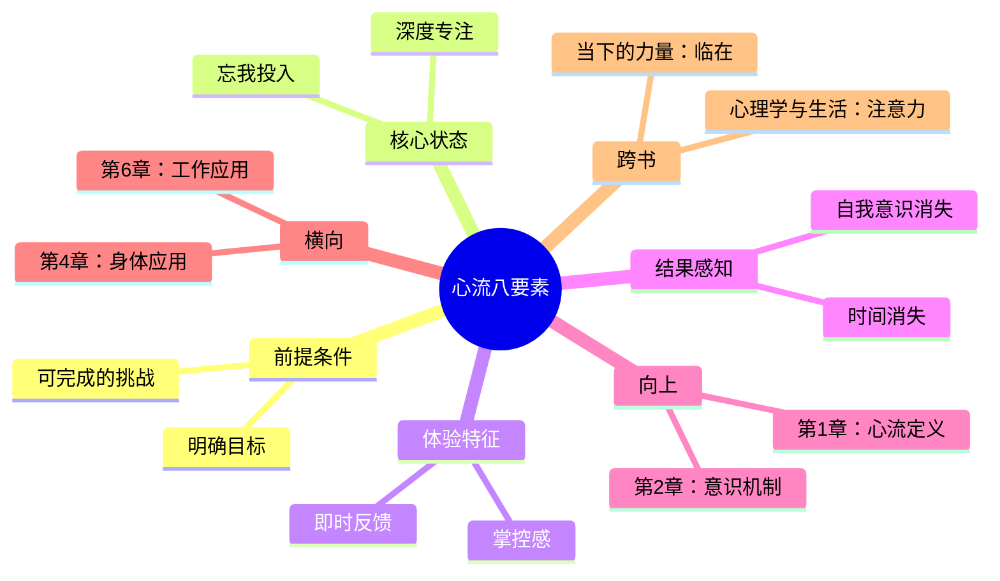

# 第3章 心流的要素

## 📍 章节定位

**全书位置**：本章是心流理论的实操核心，揭示心流状态的八大构成要素——理解这八个要素，就掌握了"如何进入心流"的操作手册。

**章节序列**：第3章，承接第1章的理论框架和第2章的意识机制，是全书最实用的一章。

**一句话定位**：
> 心流状态有八个必要条件：可完成的挑战、深度专注、明确目标、即时反馈、忘我投入、掌控感、时间消失、自我意识消失——它们共同构成进入心流的"密码锁"。

---

## 🎯 核心观点（三层提取）

### 观点1：可完成的挑战——心流的前提条件

| 层次 | 内容 |
|------|------|
| 📖 **表层（案例）** | 攀岩者面对难度适中的岩壁，每一步都刚好够难但可以完成。外科医生做一台有挑战但能搞定的手术。游戏玩家选择"困难"模式而非"地狱"模式。太难会焦虑，太简单会无聊。 |
| ⚙️ **中层（机制）** | 挑战与技能的动态匹配是心流的核心机制。当挑战略高于当前技能，人会被"拉伸"进入专注状态；当挑战远超技能，大脑会判断"不可能"而放弃；当挑战远低于技能，大脑会判断"没意思"而走神。 |
| 🔮 **底层（规律）** | 人类意识的设计机制是"适度的困难感"——我们天生被"刚刚好难"的事物吸引。太简单=无聊，太难=焦虑，刚刚好=心流。 |

**降维翻译**：
- **原文**：任务难度必须与个人技能相匹配，形成挑战-技能平衡
- **降维**：事情不能太难也不能太简单，做起来"有点挑战但能搞定"
- **类比**：就像游戏关卡设计——太简单没人玩，太难没人过，刚刚好让人上瘾

---

### 观点2：深度专注——心流的核心状态

| 层次 | 内容 |
|------|------|
| 📖 **表层（案例）** | 象棋大师对弈时，周围的一切都消失了，只剩棋盘。外科医生做手术时，连续4小时不吃不喝不觉累。作家写作时"进入状态"，一口气写完一章才抬头。 |
| ⚙️ **中层（机制）** | 专注是注意力的"激光化"——将有限的认知资源全部聚焦于单一任务。这种聚焦会导致大脑屏蔽其他信息输入，包括身体感受、环境噪音、自我评价。 |
| 🔮 **底层（规律）** | 人类大脑的认知带宽有限（每秒约126比特），当全部带宽用于单一任务时，就没有余力处理"分心"——心流就是"认知带宽被完全占用"的状态。 |

**降维翻译**：
- **原文**：将全部注意力集中于当前任务，排除其他干扰
- **降维**：脑子完全被手上的事占满了，没空想别的
- **类比**：就像手机运行大型游戏——内存被占满，后台程序自动关闭

---

### 观点3：明确目标——心流的方向指引

| 层次 | 内容 |
|------|------|
| 📖 **表层（案例）** | 网球运动员知道目标是把球打过网。外科医生知道目标是切除肿瘤。攀岩者知道目标是到达顶峰。清晰的目标让每一步都有意义。 |
| ⚙️ **中层（机制）** | 明确目标为注意力提供"锚点"——大脑知道该聚焦什么。没有目标，注意力会漫无目的地游荡；目标模糊，大脑会不断判断"我在做什么"，消耗认知资源。 |
| 🔮 **底层（规律）** | 人类意识需要"方向感"——这是进化遗留的生存机制。有目标=有方向=有安全感=可以专注。目标越清晰，大脑越能"放心"地投入。 |

**降维翻译**：
- **原文**：必须清楚知道自己要达成什么，才能全神贯注
- **降维**：得先知道"我要干嘛"，才能好好干
- **类比**：就像GPS——先设目的地，才能专心开车

---

### 观点4：即时反馈——心流的节奏保障

| 层次 | 内容 |
|------|------|
| 📖 **表层（案例）** | 玩家按下按钮，角色立刻跳起——知道操作有效。外科医生切开组织，立刻看到结果——知道切对了。写代码时运行程序，立刻报错或成功——知道对不对。 |
| ⚙️ **中层（机制）** | 即时反馈形成"行动-结果"的闭环，大脑能实时调整策略。没有反馈，大脑会陷入"这样做对吗"的怀疑；反馈太慢，大脑会失去因果关联的感知。 |
| 🔮 **底层（规律）** | 人类学习的核心机制是"即时强化"——行为后立刻得到结果，学习效率最高。游戏让人上瘾的秘密就是即时反馈：按一下就知道效果。 |

**降维翻译**：
- **原文**：每一个行动都要能立即知道效果，形成反馈闭环
- **降维**：做一步就知道对不对，不用等到最后
- **类比**：就像玩游戏——按一下按键，立刻有反应，爽感就来了

---

### 观点5：忘我投入——心流的沉浸体验

| 层次 | 内容 |
|------|------|
| 📖 **表层（案例）** | 画家画画时"忘了自己在画画"。音乐家演奏时"忘了自己在演奏"。跑步者跑着跑着"忘了自己在跑步"。他们与活动融为一体。 |
| ⚙️ **中层（机制）** | 忘我投入是"主体-客体"边界的模糊——人不再是"做事的人"，而是"事情在通过我发生"。这种状态让行动变得毫不费力，如同被一种力量推动。 |
| 🔮 **底层（规律）** | 自我意识是大脑的"后台程序"，持续消耗认知资源监控"我做得怎么样"。当任务足够吸引人，大脑会关闭这个后台程序，释放全部资源给任务本身。 |

**降维翻译**：
- **原文**：完全沉浸在活动中，人与活动融为一体
- **降维**：做事做到"忘了自己是谁"，只记得手上的活
- **类比**：就像看电影入戏——忘了自己在看电影，只记得剧情

---

### 观点6：掌控感——心流的情绪基础

| 层次 | 内容 |
|------|------|
| 📖 **表层（案例）** | 攀岩者相信自己能控制每个动作。外科医生相信自己能掌控手术进程。赛车手相信自己能操控赛车。有掌控感，才能放心投入。 |
| ⚙️ **中层（机制）** | 掌控感是"我能影响结果"的信念。有掌控感，大脑会判断"值得投入"；没有掌控感，大脑会判断"不可控"而产生焦虑，退出心流状态。 |
| 🔮 **底层（规律）** | 人类的安全感来自"可预测性"——能预测结果=有安全感=能专注。掌控感不是真正的控制一切，而是相信自己能应对可能出现的情况。 |

**降维翻译**：
- **原文**：相信自己的行动能够影响结果，产生掌控感
- **降维**：感觉自己能掌控局面，不是被动挨打
- **类比**：就像开车——知道自己能控制方向盘，才敢开快

---

### 观点7：时间消失——心流的感知特征

| 层次 | 内容 |
|------|------|
| 📖 **表层（案例）** | 程序员写代码"感觉才过了半小时"，一看表已经三小时。画家画画"感觉才画了几笔"，天已经黑了。运动员比赛"感觉才刚开始"，已经结束了。 |
| ⚙️ **中层（机制）** | 时间感知需要认知资源——大脑要持续判断"现在几点了"。在心流状态，全部认知资源用于任务，没有余力监控时间，时间感知被"屏蔽"了。 |
| 🔮 **底层（规律）** | 时间感是大脑的"后台程序"，在专注状态下自动关闭。忘记时间不是时间真的消失了，而是大脑停止了"计时"功能。 |

**降维翻译**：
- **原文**：对时间的感知发生扭曲，通常感觉时间过得飞快
- **降维**：做着做着，一看表，"卧槽怎么这么晚了"
- **类比**：就像刷短视频——"我就看两分钟"，结果刷了两小时

---

### 观点8：自我意识消失——心流的终极境界

| 层次 | 内容 |
|------|------|
| 📖 **表层（案例）** | 演讲者站上舞台，紧张得忘词——因为太在意"我表现怎么样"。但在心流状态，演讲者"忘记有人在看"，进入流畅表达。不再担心"别人怎么看我"。 |
| ⚙️ **中层（机制）** | 自我意识是大脑的"元认知监控"——持续判断"我做得好吗""别人怎么看"。这个监控消耗大量认知资源。在心流状态，监控被关闭，资源释放给任务本身。 |
| 🔮 **底层（规律）** | 自我意识是人类独有的高级功能，也是焦虑的根源。心流的"自我意识消失"不是失去自我，而是暂时放下"对自我的关注"，获得真正的自由。 |

**降维翻译**：
- **原文**：暂时放下对自我的关注，不再担心"我表现得怎么样"
- **降维**：忘了"别人怎么看我"，忘了"我帅不帅"，只记得手上的事
- **类比**：就像上台演讲——紧张是因为在意"我"，忘我是忘了"我"

---

## 💬 金句库

### 原书金句
> "心流即一个人完全沉浸在某种活动中，无视其他事物存在的状态。"

> "当挑战与技能平衡时，人最容易进入心流——太难会焦虑，太简单会无聊。"

> "心流状态下，时间仿佛停止了——这不是时间的魔法，而是大脑停止了计时。"

> "自我意识消失是心流最珍贵的礼物——暂时放下'我'，才能真正投入到'做'。"

> "明确的目标和即时反馈，是心流的双引擎——没有目标会迷失，没有反馈会怀疑。"

### 降维金句
> "事情不能太难也不能太简单，做起来'有点挑战但能搞定'——这才是心流的甜点区。"

> "真正的专注不是'努力不分心'，而是'没空分心'——脑子被占满了，哪有空想别的。"

> "不知道自己要干嘛，就没法好好干——目标越清晰，投入越彻底。"

> "做一步就知道对不对，不用等到最后——即时反馈是心流的'爽感来源'。"

> "忘记时间不是时间停止了，是你停止看表了。"

> "心流的秘密：先忘掉'我怎么样'，才能全身心'做事情'。"

## 🔗 当下映射

### 💰 财富应用

| 场景 | 具体行动 | 所需条件 | 预期效果 |
|------|----------|----------|----------|
| 股票研究 | 设定明确研究目标+即时记录心得 | 安静环境+2小时 | 进入深度分析心流，发现别人忽略的机会 |
| 副业创业 | 选择有挑战但可完成的项目 | 技能匹配+明确里程碑 | 工作变成享受，副业不再是负担 |
| 技能学习 | 设定小目标+即时测试 | 学习材料+反馈机制 | 学习效率提升3倍，不再拖延 |

### 💼 职场应用

| 场景 | 具体行动 | 心流要素应用 | 适用职级 |
|------|----------|--------------|----------|
| 深度工作 | 关闭通知+设定90分钟目标块 | 专注+明确目标+即时反馈 | 全职级 |
| 会议发言 | 提前准备+聚焦"我能贡献什么" | 掌控感+明确目标 | 中层以上 |
| 学习新技能 | 设定可完成的里程碑+每日练习 | 挑战匹配+即时反馈 | 全职级 |
| 处理邮件 | 批量处理+计时挑战 | 时间消失+挑战匹配 | 全职级 |

### 🏠 生活应用

| 场景 | 具体行动 | 可行性 | 见效时间 |
|------|----------|--------|----------|
| 运动健身 | 设定小目标（跑5公里）+记录数据 | 高 | 即时 |
| 学习乐器 | 练习有挑战但能完成的曲子 | 中 | 1周 |
| 阅读写作 | 设定阅读目标+做笔记输出 | 高 | 即时 |
| 家务整理 | 播放音乐+计时挑战 | 高 | 即时 |

### 72小时应用计划
1. **今天**：找到一个你常做的事情，用"心流八要素"检查——缺了哪几个？
2. **明天**：选择一个要素（如"即时反馈"），设计一个方法让它出现在你的工作中
3. **本周**：尝试创造一个"心流时间块"——90分钟，关闭所有干扰，设定明确目标，完成后给自己即时奖励

---

## 🕸️ 章节关联

### 向上：整书关联
- **核心问题**：本章回答"心流需要什么条件"——八要素是心流理论的操作核心
- **论证位置**：第1章讲"心流是什么"，第2章讲"心流如何在意识中发生"，本章讲"如何进入心流"

### 横向：章节序列

| 章节编号 | 章节标题 | 关联类型 | 连接描述 |
|----------|----------|----------|----------|
| 第1章 | 幸福的新解 | 基础 | 第1章定义心流，本章拆解心流的构成要素 |
| 第2章 | 意识的极限 | 机制 | 第2章讲注意力机制，本章讲如何利用注意力进入心流 |
| 第4章 | 心流与身体 | 应用 | 本章的八要素在身体活动中的具体表现 |
| 第6章 | 心流与工作 | 应用 | 本章的八要素在工作场景中的具体应用 |

### 跨书关联

| 书籍 | 概念 | 关系 | 备注 |
|------|------|------|------|
| [[03-Resources/书籍拆解/1-拆解记录/心理学与生活-津巴多-拆解记录]] | 注意力机制 | 基础 | 津巴多解释"专注"如何发生，契克森米哈赖讲如何利用它 |
| [[被讨厌的勇气-岸见一郎-拆解记录]] | 课题分离 | 呼应 | 阿德勒的"课题分离"与"自我意识消失"相通 |
| [[当下的力量-埃克哈特·托利-拆解记录]] | 临在 | 对比 | 托利的"临在"是静态的心流，契克森米哈赖的"心流"是动态的临在 |
| [[思考快与慢-丹尼尔·卡尼曼-拆解记录]] | 系统2专注 | 深化 | 心流是系统2的极致专注状态 |

### 心流八要素关系图

### 八要素逻辑流程图

---

## ❓ 问答设计

### Q1: 心流的八个要素分别是什么？（记忆型）
**认知层次**: 记忆
**难度**: 低
**答案要点**:
1. 可完成的挑战——任务难度与技能匹配
2. 深度专注——全神贯注于当前任务
3. 明确目标——清楚知道自己要达成什么
4. 即时反馈——行动后立刻知道结果
5. 忘我投入——人与活动融为一体
6. 掌控感——相信自己的行动能影响结果
7. 时间消失——对时间的感知扭曲
8. 自我意识消失——不再关注"我表现得怎么样"

### Q2: 为什么"可完成的挑战"是心流的前提条件？（理解型）
**认知层次**: 理解
**难度**: 中
**答案要点**:
- 挑战与技能的匹配决定大脑的反应
- 太难：大脑判断"不可能"，放弃或焦虑
- 太简单：大脑判断"没意思"，走神或无聊
- 刚刚好：大脑被"拉伸"进入专注状态
- 这是由人类认知机制决定的——我们天生被"适度困难"的事物吸引

### Q3: "即时反馈"为什么重要？哪些活动缺少即时反馈？（理解型）
**认知层次**: 理解
**难度**: 中
**答案要点**:
- 即时反馈形成"行动-结果"闭环，让大脑能实时调整
- 没有反馈，大脑陷入"这样做对吗"的怀疑
- 反馈太慢，大脑失去因果关联的感知
- 缺少即时反馈的活动：长期投资、学术研究、管理岗位、创意工作
- 解决方法：自己创造反馈机制（如记录、分享、测试）

### Q4: "时间消失"和"自我意识消失"有什么区别？（分析型）
**认知层次**: 分析
**难度**: 高
**答案要点**:
- 时间消失：停止"计时"功能，感觉时间过得飞快
- 自我意识消失：停止"元认知监控"，不再判断"我表现得怎么样"
- 前者是感知层面的屏蔽，后者是评价层面的关闭
- 时间消失关乎"外部感知"，自我意识消失关乎"内部评价"
- 两者都是大脑释放认知资源的结果，但关闭的"后台程序"不同

### Q5: 如何在工作中创造"心流八要素"？（应用型）
**认知层次**: 应用
**难度**: 中
**答案要点**:
1. **可完成的挑战**：拆分大任务，设定略高于当前能力的小目标
2. **明确目标**：开工前写下今天要完成的3件事
3. **深度专注**：关闭通知，设定90分钟专注时间块
4. **即时反馈**：完成后打勾、记录、分享成果
5. **忘我投入**：选择你真正感兴趣的任务，或找到任务的意义
6. **掌控感**：聚焦"我能控制什么"，而非"我控制不了什么"
7. **创造条件**：让时间消失和自我意识消失自然发生，不要强求

### Q6: 游戏为什么容易让人进入心流？用了哪些要素？（分析型）
**认知层次**: 分析
**难度**: 中
**答案要点**:
- 游戏"精心设计"了心流八要素
- **可完成的挑战**：关卡难度递进，始终"刚刚好"
- **明确目标**：任务清晰，奖励明确
- **即时反馈**：按下按键立刻有反应
- **掌控感**：玩家知道自己的操作能影响结果
- **忘我投入**：沉浸式画面和音效
- **时间消失**：没有明显的时间提示
- **自我意识消失**：玩家角色代替现实身份
- 这就是为什么游戏让人"停不下来"——它完美复制了心流的条件

### Q7: 为什么很多人工作时很难进入心流？（综合型）
**认知层次**: 综合
**难度**: 高
**答案要点**:
- 现代工作环境天然破坏心流八要素：
  - **目标模糊**：不知道今天要完成什么
  - **反馈太慢**：做了很久才知道结果
  - **难度失控**：要么太简单重复，要么太难超负荷
  - **缺乏掌控感**：被动接受任务，无法自主
  - **干扰太多**：通知、会议、邮件不断打断
- 解决方法：主动创造心流条件，而不是等待环境改变

### Q8: "自我意识消失"和《被讨厌的勇气》的"课题分离"有什么相通之处？（分析型）
**认知层次**: 分析
**难度**: 高
**答案要点**:
- 两者都涉及"放下对自我的关注"
- **课题分离**：区分"我的事"和"别人的事"，不被他人评价干扰
- **自我意识消失**：暂时放下"别人怎么看我"的担忧，全情投入
- 共同底层：过度关注自我是焦虑的根源
- 区别：阿德勒聚焦人际关系，契克森米哈赖聚焦活动本身
- 互补：课题分离是人际上的"自我意识消失"，心流是活动上的"自我意识消失"

### Q9: 如果工作本身没有心流八要素，应该怎么办？（综合型）
**认知层次**: 综合
**难度**: 高
**答案要点**:
- **主动改造任务**：自己设定目标、创造反馈、调整难度
- **重新定义意义**：找到工作的"自成目标"——做事本身就是回报
- **创造心流时间块**：每天留出1-2小时，按自己的方式工作
- **提升技能**：让原本困难的任务变得"可完成"
- **改变环境**：减少干扰，创造专注空间
- **终极选择**：如果工作完全无法创造心流，可能是换工作的信号

### Q10: 心流八要素中，哪个最难创造？为什么？（评价型）
**认知层次**: 评价
**难度**: 高
**答案要点**:
- **最难创造**：自我意识消失
- **原因**：
  - 自我意识是人类独有的高级功能，根深蒂固
  - 社会化教育让我们习惯"被评价"的视角
  - 社交媒体时代，自我意识被不断强化
  - 越在意"表现"，越难消失
- **创造方法**：
  - 不强求，让其他七个要素先到位
  - 专注于"事情本身"而非"做事情的我"
  - 接受"不完美"，减少评价压力
  - 选择真正热爱的活动，热爱会自然冲淡自我意识

---
